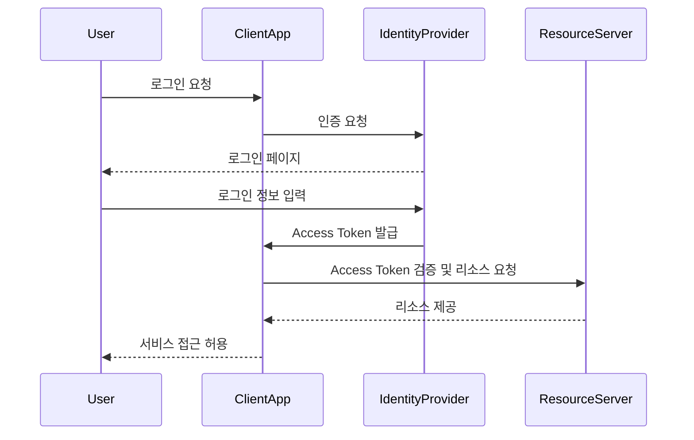
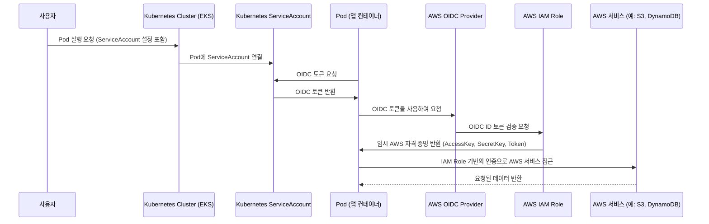
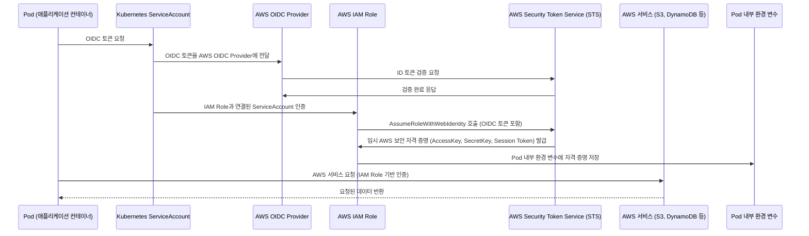

# SSO 요약

<!-- more -->

## SSO 연동 프로토콜

|연동 방식 (프로토콜)|설명|장점|단점|
|---------------|--|---|----|
|OAuth 2.0|API 접근 권한 부여 프레임워크 (사용자 인증 X)|다양한 애플리케이션과 연동 가능, 토큰 기반 접근 제어|사용자 인증 기능이 없어 OIDC 필요|
|OpenID Connect (OIDC)|OAuth 2.0을 확장하여 사용자 인증 추가|ID 토큰을 통해 사용자 정보를 검증 가능|OAuth 2.0보다 구조가 복잡|
|SAML (Security Assertion Markup Language)|XML 기반의 기업용 SSO 표준|기업 환경에서 많이 사용|XML 기반이라 비교적 무겁고 설정이 복잡|
|JWT (JSON Web Token)|JSON 기반의 토큰 형식(프로토콜이 아님)|빠른 인증 처리 가능|토큰 유출 시 보안 문제 발생 가능|

## SSO 연동 과정

### Pod Identity vs IRSA 비교표

| 비교 항목 | Pod Identity (OIDC 기반 AssumeRoleWithWebIdentity) | IAM Role for Service Account (IRSA) |
|-----------|------------------------------------------------------|-------------------------------------|
| 개념 | OIDC 토큰을 사용하여 AWS STS에서 IAM Role을 임시 획득 | Kubernetes의 ServiceAccount와 IAM Role을 직접 연결 |
| IAM Role 연결 방식 | Pod가 실행될 때 OIDC 토큰을 이용하여 IAM Role을 Assume | Kubernetes ServiceAccount가 IAM Role과 연결되어 자동 인증 |
| 자격 증명 관리 | OIDC 토큰을 기반으로 임시 보안 자격 증명 발급 | ServiceAccount에 IAM Role을 연결하여 자동 인증 |
| 보안성 | OIDC 토큰이 자동으로 갱신됨 (단기 자격 증명) | IAM Role을 ServiceAccount에 직접 연결하여 더 세밀한 권한 관리 가능 |
| 설정 난이도 | OIDC Provider 설정 필요, IAM 정책 구성 필요 | `eksctl`을 사용하면 쉽게 설정 가능 |
| AWS STS 호출 여부 | OIDC 토큰을 사용하여 STS를 통해 임시 자격 증명 획득 | STS 호출 없이 ServiceAccount와 IAM Role이 직접 연동됨 |
| 사용 예시 | 다른 클러스터나 외부 서비스가 AWS 서비스 접근을 필요로 할 때 적합 | EKS 내부 Pod가 AWS 서비스(S3, DynamoDB 등)에 접근할 때 가장 일반적인 방식 |
| 지원하는 AWS 서비스 | STS 기반으로 모든 AWS 서비스 접근 가능 | IRSA를 설정한 AWS 서비스만 접근 가능 |
| 권장 시나리오 | AWS STS 기반 인증을 선호하는 경우 | EKS 내부에서 AWS 서비스 사용이 많은 경우 |
| 구현 난이도 | IAM Role을 설정하고 OIDC 인증을 추가해야 함 | EKS ServiceAccount와 IAM Role을 `eksctl`로 간단히 연결 가능 |

|비교 항목|IRSA (IAM Role for Service Account)|일반 OIDC 기반 Pod Identity|
|---------|--------------|------------|
|OIDC 사용 여부| OIDC 기반 (AWS IAM OIDC Provider 사용)| OIDC 기반 (AWS IAM OIDC Provider 사용)|
|IAM Role 연결 방식|Kubernetes ServiceAccount를 IAM Role과 직접 연결|Pod가 직접 OIDC 토큰을 이용하여 STS |AssumeRoleWithWebIdentity 호출
|STS 호출 방식|ServiceAccount에 IAM Role이 자동 매핑됨|Pod가 직접 STS AssumeRoleWithWebIdentity 호출|
|보안성|Kubernetes 네임스페이스와 ServiceAccount 단위로 IAM Role을 제한 가능|OIDC 토큰을 직접 사용하여 외부에서도 |인증 가능
|EKS 외부 접근 가능 여부| ServiceAccount 기반이므로 EKS 내부 전용| OIDC 토큰을 이용하면 EKS 외부에서도 IAM Role |Assume 가능
|설정 난이도|eksctl create iamserviceaccount 등으로 쉽게 설정 가능|IAM 정책을 직접 구성해야 함|

## EKS Pod Identity 인증 프로세스

## IAM Role for Service Account (IRSA) 프로세스

### Pod Identity (OIDC) 시나리오
| 추천 상황 | 추천 사유 |
|--------------|-------------|
| AWS STS 기반 인증을 원할 때 | OIDC 기반 인증을 사용하여 AWS STS를 통해 임시 자격 증명을 발급받을 수 있음 |
| EKS 외부(예: 다른 클러스터)에서도 AWS 접근이 필요할 때 | OIDC 토큰을 사용하면 EKS 외부에서도 인증을 수행할 수 있음 (EKS 내부 ServiceAccount에 의존하지 않음) |
| 단기 자격 증명이 필요할 때 | AWS STS가 발급하는 임시 보안 자격 증명은 짧은 TTL(Time-To-Live)을 가지므로, 보안성이 향상됨 |
| EKS 내에서 Pod가 AWS IAM Role을 직접 Assume해야 할 때 | `AssumeRoleWithWebIdentity` API를 사용하여 IAM Role을 동적으로 가져올 수 있음 |
| ID 관리 및 페더레이션 인증이 필요한 경우 | OIDC 기반이므로 SAML, OAuth 2.0 등의 ID Provider와 연동이 가능함 |

Pod Identity 방식은 OIDC 토큰을 활용하여 AWS IAM과 직접 연동할 수 있으므로,  
EKS 외부에서도 AWS 서비스에 접근하거나, ID 페더레이션과의 연동이 필요한 경우 적합

### IAM Role for Service Account (IRSA) 시나리오
| 추천 상황 | 추천 사유 |
|--------------|-------------|
| EKS 내부에서 AWS 서비스 접근이 필요할 때 | Kubernetes ServiceAccount와 IAM Role을 1:1 매핑하여 AWS 리소스 접근이 가능 |
| AWS STS 호출 없이 효율적으로 인증하고 싶을 때 | OIDC를 통한 STS 인증이 필요 없고, ServiceAccount 기반으로 IAM Role을 자동 연결하여 성능 향상 |
| EKS 내에서 다수의 Pod가 AWS 서비스에 접근해야 할 때 | 각 Pod에 별도의 IAM Role을 부여할 필요 없이 ServiceAccount를 사용하여 IAM Role을 공유할 수 있음 |
| IAM 정책을 더 세밀하게 관리하고 싶을 때 | 특정 Kubernetes Namespace, ServiceAccount 단위로 세밀한 IAM 정책 적용 가능 |
| EKS의 기본적인 AWS 서비스 접근 방식이 필요할 때 | IRSA는 EKS에서 AWS 서비스에 접근할 때 가장 일반적으로 권장되는 방식 |

IRSA 방식은 Kubernetes의 ServiceAccount를 AWS IAM Role과 직접 연결하는 방식이므로 EKS 내부에서 AWS 리소스(S3, DynamoDB, SQS 등)에 접근하는 Pod를 효율적으로 관리할 때 적합

### 상황별 OIDC vs IRSA
| 상황 | 추천 방식 | 추천 사유 |
|---------|-------------|-------------|
| EKS 외부에서 AWS 서비스 접근이 필요한 경우 | Pod Identity (OIDC) | OIDC 토큰을 사용하여 클러스터 외부에서도 IAM Role을 Assume할 수 있음 |
| AWS STS 기반의 임시 자격 증명이 필요한 경우 | Pod Identity (OIDC) | STS의 AssumeRoleWithWebIdentity를 통해 자동 갱신되는 단기 자격 증명 발급 |
| EKS 내부에서 AWS 서비스 접근이 필요한 경우 | IRSA | Kubernetes ServiceAccount를 통해 IAM Role을 자동 연결할 수 있어 효율적 |
| STS 호출 없이 성능을 최적화하고 싶은 경우 | IRSA | OIDC 기반 STS 호출 없이 ServiceAccount만으로 인증 가능 |
| IAM Role과 Kubernetes 네임스페이스별 세분화된 권한을 적용하고 싶을 때 | IRSA | Kubernetes ServiceAccount와 IAM Role을 1:1 매핑하여 세밀한 권한 관리 가능 |

- EKS 내부에서 AWS 서비스 접근을 관리하는 가장 일반적인 방식은 IRSA  
- OIDC 기반 Pod Identity는 EKS 외부 접근이 필요한 경우에 활용

### 참고: ID 페더레이션 / IDP 비교표

| 항목 | ID 페더레이션 (Federation) | IDP (Identity Provider) |
|----------|--------------------------------|------------------------------|
| 개념 | 여러 개의 IDP를 통합하여 하나의 인증 체계로 연동하는 개념 | 사용자 인증을 제공하는 독립적인 서비스 |
| 목적 | 하나의 계정으로 여러 시스템/서비스에 접근 가능하도록 IDP들을 연결 | 사용자의 신원을 확인하고 인증을 수행 |
| 사용 기술 | SAML, OpenID Connect (OIDC), OAuth 2.0 | Active Directory, Google, Okta, Keycloak |
| 예제 | 기업에서 Google Workspace, Azure AD, Okta 등의 IDP를 통합하여 단일 로그인 사용 | Google, Facebook, Azure AD, Okta 등 개별적인 인증 제공자 |
| 연동 방식 | SSO(Single Sign-On) 구현 시 주로 사용됨 | 자체적인 로그인 및 인증 기능 제공 |
| 대표 사례 | AWS Cognito, Google Federation, Azure AD Federation | Google Identity Platform, Microsoft Azure AD, Okta |
