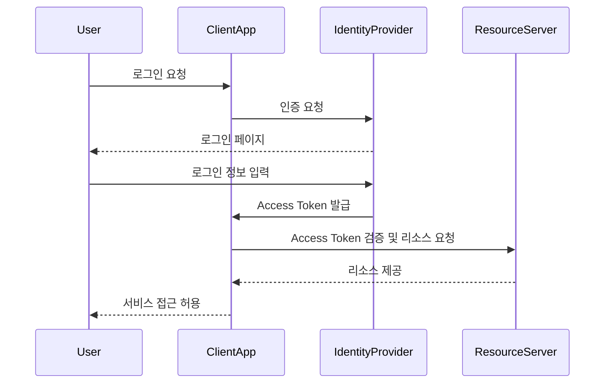
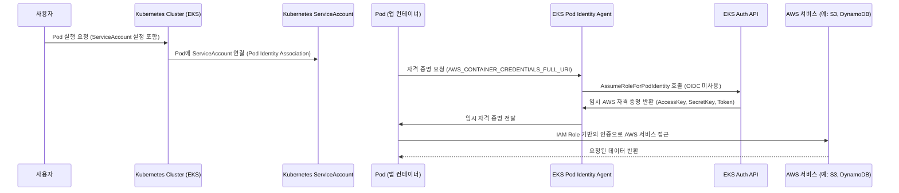
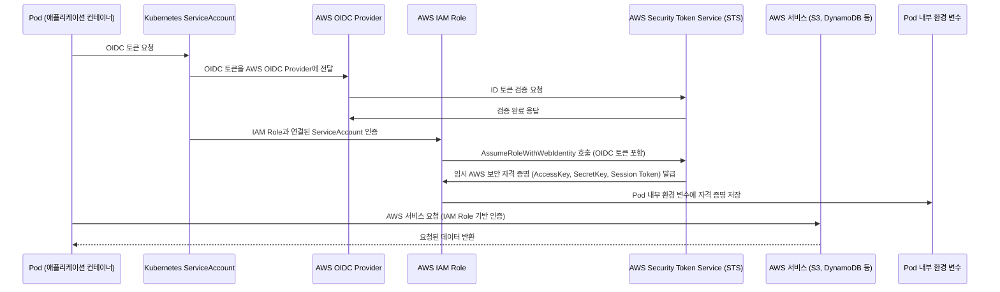

# SSO 요약

<!-- more -->

## SSO 연동 프로토콜

|연동 방식 (프로토콜)|설명|장점|단점|
|---------------|--|---|----|
|OAuth 2.0|API 접근 권한 부여 프레임워크 (사용자 인증 X)|다양한 애플리케이션과 연동 가능, 토큰 기반 접근 제어|사용자 인증 기능이 없어 OIDC 필요|
|OpenID Connect (OIDC)|OAuth 2.0을 확장하여 사용자 인증 추가|ID 토큰을 통해 사용자 정보를 검증 가능|OAuth 2.0보다 구조가 복잡|
|SAML (Security Assertion Markup Language)|XML 기반의 기업용 SSO 표준|기업 환경에서 많이 사용|XML 기반이라 비교적 무겁고 설정이 복잡|
|JWT (JSON Web Token)|JSON 기반의 토큰 형식(프로토콜이 아님)|빠른 인증 처리 가능|토큰 유출 시 보안 문제 발생 가능|

## SSO 연동 과정

```mermaid
sequenceDiagram
  participant User
  participant ClientApp
  participant IdentityProvider
  participant ResourceServer
  
  User->>ClientApp: 로그인 요청
  ClientApp->>IdentityProvider: 인증 요청
  IdentityProvider-->>User: 로그인 페이지
  User->>IdentityProvider: 로그인 정보 입력
  IdentityProvider->>ClientApp: Access Token 발급
  ClientApp->>ResourceServer: Access Token 검증 및 리소스 요청
  ResourceServer-->>ClientApp: 리소스 제공
  ClientApp-->>User: 서비스 접근 허용
```

### Pod Identity vs IRSA 비교표

비교 항목                | Pod Identity (Pod Identity Agent + EKS Auth API) | IAM Role for Service Account (IRSA)
-------------------- | ------------------------------------------------ | -----------------------------------------------------------
OIDC 사용 여부           | X (불필요) | O
IAM Role 연결 방식       | Pod Identity Association으로 ServiceAccount에 매핑 | ServiceAccount 어노테이션으로 IAM Role 연결
AWS STS 호출 여부        | X (EKS Auth API 호출) | O (AssumeRoleWithWebIdentity)
EKS API Server 인증 과정 | Pod Identity Agent가 EKS Auth API로 자격 증명 요청 | OIDC Provider 통해 STS에서 토큰 검증 후 발급
EKS 외부 접근 가능 여부      | X (Agent 의존) | O (OIDC 페더레이션)
AssumeRole 시점        | Pod 실행 시 Agent가 EKS Auth API로 자격 증명 획득 | Pod가 OIDC 토큰으로 STS AssumeRoleWithWebIdentity 호출
사용 예시                | EKS 내부 Pod가 AWS 서비스 접근 (설정 간편) | OIDC 페더레이션·EKS 외부 접근이 필요한 경우

## EKS Pod Identity 인증 프로세스

```mermaid
sequenceDiagram
    participant User as 사용자
    participant Kubernetes as Kubernetes Cluster (EKS)
    participant ServiceAccount as Kubernetes ServiceAccount
    participant Pod as Pod (앱 컨테이너)
    participant Agent as EKS Pod Identity Agent
    participant EKSAuth as EKS Auth API
    participant AWS_Service as AWS 서비스 (예: S3, DynamoDB)

    User->>Kubernetes: Pod 실행 요청 (ServiceAccount 설정 포함)
    Kubernetes->>ServiceAccount: Pod에 ServiceAccount 연결 (Pod Identity Association)
    Pod->>Agent: 자격 증명 요청 (AWS_CONTAINER_CREDENTIALS_FULL_URI)
    Agent->>EKSAuth: AssumeRoleForPodIdentity 호출 (OIDC 미사용)
    EKSAuth->>Agent: 임시 AWS 자격 증명 반환 (AccessKey, SecretKey, Token)
    Agent->>Pod: 임시 자격 증명 전달
    Pod->>AWS_Service: IAM Role 기반의 인증으로 AWS 서비스 접근
    AWS_Service-->>Pod: 요청된 데이터 반환
```

## IAM Role for Service Account (IRSA) 프로세스

```mermaid
sequenceDiagram
    participant Pod as Pod (애플리케이션 컨테이너)
    participant ServiceAccount as Kubernetes ServiceAccount
    participant AWS_OIDC as AWS OIDC Provider
    participant IAM as AWS IAM Role
    participant STS as AWS Security Token Service (STS)
    participant AWS_Service as AWS 서비스 (S3, DynamoDB 등)
    participant Pod_Env as Pod 내부 환경 변수

    Pod->>ServiceAccount: OIDC 토큰 요청
    ServiceAccount->>AWS_OIDC: OIDC 토큰을 AWS OIDC Provider에 전달
    AWS_OIDC->>STS: ID 토큰 검증 요청
    STS->>AWS_OIDC: 검증 완료 응답
    ServiceAccount->>IAM: IAM Role과 연결된 ServiceAccount 인증
    IAM->>STS: AssumeRoleWithWebIdentity 호출 (OIDC 토큰 포함)
    STS->>IAM: 임시 AWS 보안 자격 증명 (AccessKey, SecretKey, Session Token) 발급
    IAM->>Pod_Env: Pod 내부 환경 변수에 자격 증명 저장
    Pod->>AWS_Service: AWS 서비스 요청 (IAM Role 기반 인증)
    AWS_Service-->>Pod: 요청된 데이터 반환
```

### Pod Identity 시나리오
| 상황 | 비고 |
|--------------|-------------|
| OIDC Provider 설정 없이 인증하고 싶을 때 | OIDC 구성 없이 Pod Identity Association만으로 ServiceAccount와 IAM Role을 연결할 수 있음 |
| EKS 클러스터 내부 Pod에서 AWS 접근이 필요할 때 | 노드의 Pod Identity Agent가 자격 증명을 발급하므로 클러스터 내부에서만 동작함 (외부 접근 불가) |
| 단기 자격 증명이 필요할 때 | EKS Auth API가 발급하는 임시 자격 증명은 짧은 TTL(Time-To-Live)을 가지므로, 보안성이 향상됨 |
| 하나의 IAM Role을 여러 클러스터에서 재사용하고 싶을 때 | 신뢰 관계를 EKS가 관리하므로 IAM Role 신뢰 정책 수정 없이 여러 클러스터에서 사용 가능함 |
| STS 호출 없이 자격 증명을 발급받고 싶을 때 | Pod Identity Agent가 AssumeRoleForPodIdentity를 호출하여 STS 없이 자격 증명을 가져올 수 있음 |

Pod Identity 방식은 OIDC 설정 없이 Pod Identity Agent가 자격 증명을 발급하므로,  
EKS 클러스터 내부 Pod에서 간편하게 AWS 서비스에 접근해야 하는 경우 적합

### IAM Role for Service Account (IRSA) 시나리오
| 상황 | 비고 |
|--------------|-------------|
| EKS 내부에서 AWS 서비스 접근이 필요할 때 | Kubernetes ServiceAccount와 IAM Role을 1:1 매핑하여 AWS 리소스 접근이 가능 |
| STS 임시 자격 증명으로 인증하고 싶을 때 | OIDC 토큰으로 STS AssumeRoleWithWebIdentity를 호출하여 단기 자격 증명 발급 |
| EKS 내에서 다수의 Pod가 AWS 서비스에 접근해야 할 때 | 각 Pod에 별도의 IAM Role을 부여할 필요 없이 ServiceAccount를 사용하여 IAM Role을 공유할 수 있음 |
| IAM 정책을 더 세밀하게 관리하고 싶을 때 | 특정 Kubernetes Namespace, ServiceAccount 단위로 세밀한 IAM 정책 적용 가능 |
| EKS의 기본적인 AWS 서비스 접근 방식이 필요할 때 | IRSA는 EKS에서 AWS 서비스에 접근할 때 가장 일반적으로 권장되는 방식 |

IRSA 방식은 Kubernetes의 ServiceAccount를 AWS IAM Role과 직접 연결하는 방식이므로 EKS 내부에서 AWS 리소스(S3, DynamoDB, SQS 등)에 접근하는 Pod를 효율적으로 관리할 때 적합

### 상황별 Pod Identity vs IRSA
| 상황 | 추천 방식 | 추천 사유 |
|---------|-------------|-------------|
| EKS 외부에서 AWS 서비스 접근이 필요한 경우 | IRSA | OIDC 페더레이션으로 클러스터 외부에서도 IAM Role을 Assume할 수 있음 |
| AWS STS 기반의 임시 자격 증명이 필요한 경우 | IRSA | STS의 AssumeRoleWithWebIdentity를 통해 자동 갱신되는 단기 자격 증명 발급 |
| EKS 내부에서 AWS 서비스 접근이 필요한 경우 | IRSA | Kubernetes ServiceAccount를 통해 IAM Role을 자동 연결할 수 있어 효율적 |
| STS 호출 없이 자격 증명을 발급받고 싶은 경우 | Pod Identity | Pod Identity Agent가 EKS Auth API로 자격 증명을 발급하여 STS 호출이 불필요 |
| IAM Role과 Kubernetes 네임스페이스별 세분화된 권한을 적용하고 싶을 때 | IRSA | Kubernetes ServiceAccount와 IAM Role을 1:1 매핑하여 세밀한 권한 관리 가능 |

- EKS 내부에서 AWS 서비스 접근을 관리하는 가장 일반적인 방식은 IRSA  
- Pod Identity는 OIDC 설정 없이 간편하게 클러스터 내부에서 인증할 때 활용

### 참고: ID 페더레이션 / IDP 비교표

| 항목 | ID 페더레이션 (Federation) | IDP (Identity Provider) |
|----------|--------------------------------|------------------------------|
| 개념 | 여러 개의 IDP를 통합하여 하나의 인증 체계로 연동하는 개념 | 사용자 인증을 제공하는 독립적인 서비스 |
| 목적 | 하나의 계정으로 여러 시스템/서비스에 접근 가능하도록 IDP들을 연결 | 사용자의 신원을 확인하고 인증을 수행 |
| 사용 기술 | SAML, OpenID Connect (OIDC), OAuth 2.0 | Active Directory, Google, Okta, Keycloak |
| 예제 | 기업에서 Google Workspace, Azure AD, Okta 등의 IDP를 통합하여 단일 로그인 사용 | Google, Facebook, Azure AD, Okta 등 개별적인 인증 제공자 |
| 연동 방식 | SSO(Single Sign-On) 구현 시 주로 사용됨 | 자체적인 로그인 및 인증 기능 제공 |
| 대표 사례 | AWS Cognito, Google Federation, Azure AD Federation | Google Identity Platform, Microsoft Azure AD, Okta |
