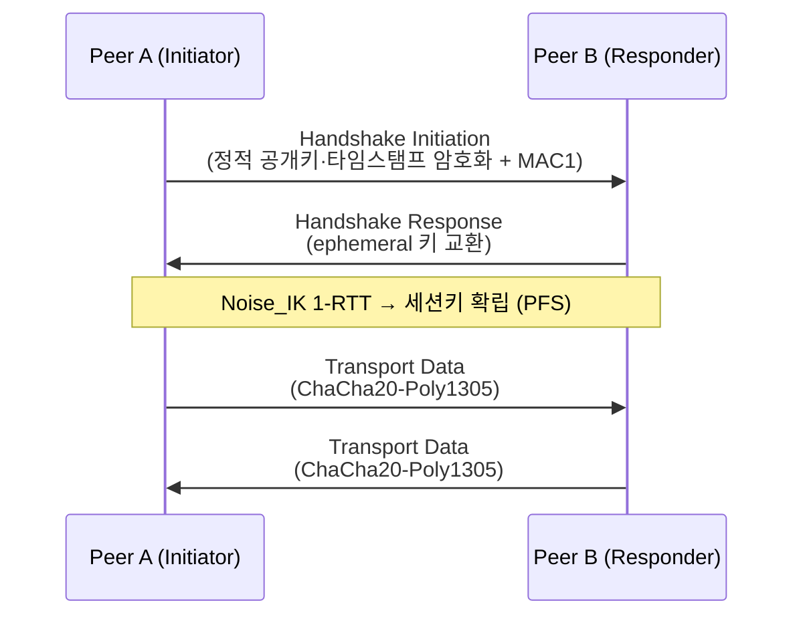

# WireGuard vs IPIP 차이점 정리

<!-- more -->

## 터널링이란
터널링(Tunneling)이란 원본 패킷을 다른 헤더로 한 번 더 감싸(캡슐화) 중간 경로가 이해하는 주소로 실어 나르는 기술

- 목적: 언더레이가 직접 라우팅하지 못하는 주소·대역을 우회 전달
- 구조: 바깥 헤더(전달용) + 안쪽 원본 패킷(페이로드)로 이중 포장
- 대가: 헤더가 덧붙어 유효 MTU 감소, 캡슐·역캡슐 처리 비용 발생
- 갈림: 무엇으로 감싸는지, 암호화 여부를 두는지로 프로토콜이 나뉨

IPIP와 WireGuard는 둘 다 "패킷을 패킷에 싸서 나른다"는 점은 같지만, 하나는 최소한으로 싸기만 하고 다른 하나는 싸면서 암호화까지 한다는 데서 성격이 갈림.

---

## IPIP 정리
IPIP(IP-in-IP)란 IPv4 패킷 앞에 바깥 IPv4 헤더 하나만 덧붙이는 가장 단순한 캡슐화 방식(RFC 2003)

- 오버헤드: 바깥 IP 헤더 20B만 추가 → 캡슐화 방식 중 최소
- 표시: 바깥 헤더의 프로토콜 번호를 4로 세팅 → 페이로드가 또 다른 IP 패킷임을 명시
- 보안: 자체 암호화·인증 없음 → 페이로드가 평문 그대로 노출
- 제약: IPv4 유니캐스트 전용, 멀티캐스트·브로드캐스트·IPv6 미지원(멀티캐스트가 필요하면 GRE로 대체)
- 폴백: ipip 모듈 적재 시 커널이 tunl0 기본 디바이스 생성, 매칭되는 터널이 없으면 이 장치가 처리
- 상태: 세션·핸드셰이크 개념이 없는 단순 스테이트리스 캡슐화

바깥 헤더를 벗기면 원본 IP 패킷이 그대로 나오므로, 신뢰된 경로에서 라우팅만 우회시키는 용도에 맞음. 반대로 경로가 신뢰되지 않으면 페이로드가 통째로 도청 가능.

### IPIP 사용처
- 사설망 내부에서 서로 라우팅되지 않는 서브넷을 연결
- Calico IPIP 모드: 언더레이가 파드 CIDR을 라우팅하지 못할 때 파드 트래픽을 IPIP로 오버레이
- Calico는 IPIP 라우트를 BGP로 노드 간 분배(VXLAN 모드는 BGP를 쓰지 않는 것과 대비)
- CrossSubnet 옵션: 같은 서브넷 안은 비캡슐화, 서브넷 경계를 넘는 트래픽만 IPIP로 감싸 오버헤드 절감

### IPIP 구성 예

```s
# ipip 모듈 적재
modprobe ipip

# 양쪽 노드에 터널 생성, local/remote는 물리 인터페이스 IP
ip tunnel add tun0 mode ipip local 10.0.1.1 remote 10.0.2.1
ip addr add 192.168.100.1/30 dev tun0   # 터널 내부 대역
ip link set tun0 up
```

- 키·인증서·핸드셰이크 항목이 전혀 없음 → 양쪽 물리 IP만 맞추면 즉시 통신
- 반대편 노드도 local·remote를 뒤집어 동일하게 설정하면 대칭 터널 완성

---

## WireGuard 정리
WireGuard란 Noise 프로토콜 프레임워크의 Noise_IK 핸드셰이크로 피어를 인증하고, 모든 트래픽을 UDP로 캡슐화해 암호화하는 커널 내장 VPN 터널

- 핸드셰이크: Noise_IK 1-RTT로 세션키 확립, 순방향 비밀성(PFS)·신원 은닉·키 훼손 위장(KCI) 회피 제공
- 데이터: 세션은 ChaCha20-Poly1305로 암호화와 인증을 한 번에 처리(AEAD)
- 전송: 프로토콜은 UDP 하나로 통일, 기본 리슨 포트 51820
- 스텔스: 인증되지 않은 패킷에는 아예 응답하지 않음 → 미인증 트래픽에 상태를 만들지 않아 포트 스캔·DDoS에 강함
- 커널: 리눅스 mainline 5.6(2020년)부터 커널에 내장, 유저스페이스 구현(wireguard-go)도 존재
- 설정: 인터페이스 개인키 + 피어별 공개키·AllowedIPs·Endpoint만으로 동작하는 최소 구성

### 로밍
- 정의: 최근 인증에 성공한 엔드포인트로 응답을 보내는 로밍(Roaming) 특성
- 효과: 클라이언트 IP가 바뀌거나 NAT 매핑이 재바인딩돼도 재협상 없이 연결 유지
- 활용: 모바일·NAT 뒤 노드처럼 출발지 IP가 자주 변하는 환경에 유리

### cryptokey routing
공개키와 그 피어에 허용된 IP 목록(AllowedIPs)을 한 쌍으로 묶어 라우팅과 접근제어를 하나의 테이블로 합친 방식

- 송신: 목적지 IP가 어느 피어의 AllowedIPs에 속하는지로 암호화에 쓸 공개키를 결정(라우팅 테이블 역할)
- 수신: 복호화한 패킷의 출발지 IP가 그 피어의 AllowedIPs에 없으면 폐기(ACL 역할)
- 효과: 키와 허용 대역이 한 곳에 묶여 방화벽 규칙과 라우팅을 따로 관리할 필요가 줄어듦

### 핸드셰이크 흐름



- 개시: MAC1이 수신자 공개키로 검증되어야만 응답 → 잘못된 상대에겐 무응답
- 확립: 두 메시지(1-RTT)만에 세션키 확보, 이후 데이터 채널로 전환
- 갱신: 세션키는 주기적으로 재핸드셰이크되어 장기 노출 위험 축소

### 최소 설정 예

```conf title="wg0.conf"
[Interface]
PrivateKey = <자신의 개인키>
ListenPort = 51820
Address = 10.10.0.1/24

[Peer]
PublicKey = <상대 공개키>
AllowedIPs = 10.10.0.2/32
Endpoint = 203.0.113.5:51820
```

- Peer 블록의 AllowedIPs가 곧 cryptokey routing 테이블 → 이 대역만 이 공개키로 오가는 것을 허용
- Endpoint는 최초 접속용 힌트일 뿐, 이후 로밍으로 실제 엔드포인트가 갱신됨

---

## 비교표

| 비교 항목 | IPIP | WireGuard |
|---|---|---|
| 암호화·인증 | 없음(평문 캡슐화) | ChaCha20-Poly1305 AEAD 암호화·인증 |
| 키 관리 | 불필요(키 개념 없음) | 피어별 공개키·개인키 쌍 배포 |
| NAT 통과 | 프로토콜 4는 포트가 없어 별도 처리 필요 | UDP 캡슐화 + 로밍으로 NAT 친화적 |
| 설정 복잡도 | 로컬·리모트 IP만 지정 | 인터페이스 키 + 피어 AllowedIPs (여전히 최소) |
| 커널 지원 시점 | 리눅스 초기부터 내장(RFC 2003 표준) | mainline 5.6(2020년)부터 내장 |
| 프로토콜/포트 | IP 프로토콜 4, 포트 없음 | UDP, 기본 51820 |
| 지원 트래픽 | IPv4 유니캐스트 전용 | IPv4·IPv6 모두 |
| 사용 사례 | 사설망 내부 라우팅, Calico IPIP | 사이트 간 VPN, 원격 접속, 비신뢰 구간 암호화 |

- 핵심 차이: IPIP는 "감싸기만", WireGuard는 "감싸면서 암호화·인증"
- 키 관리 유무가 운영 부담과 보안 수준을 동시에 가름

---

## 함께 쓰는 경우
둘은 서로를 대체하는 관계가 아니라, 구간의 신뢰 수준에 따라 나눠 쓰는 계층 관계

- 신뢰 구간(동일 사설망·같은 VPC 내부): IPIP로 최소 오버헤드 라우팅
- 비신뢰 구간(퍼블릭 인터넷·데이터센터 간): WireGuard로 암호화 터널
- 판단 기준: 경로를 도청·변조로부터 지켜야 하면 WireGuard, 이미 신뢰된 경로면 IPIP

### k8s CNI에서의 위치
- 오버레이 위치: 언더레이가 파드 CIDR을 라우팅 못 하면 IPIP·VXLAN 같은 오버레이로 노드 간 파드 트래픽을 연결
- 암호화 위치: 노드 간 경로가 인터넷을 경유하면 그 위에 WireGuard 암호화 계층을 얹음(Calico는 파드 트래픽 WireGuard 암호화 옵션 제공)
- 실제 분리: Calico CrossSubnet은 같은 서브넷은 비캡슐화, 서브넷 경계만 IPIP로 처리 → 신뢰/비신뢰 구간 구분의 구현 예

### 선택 가이드

| 상황 | 추천 | 사유 |
|------|------|------|
| 신뢰된 사설망 서브넷 연결 | IPIP | 오버헤드 최소, 키 관리 불필요 |
| 인터넷 경유 사이트 간 연결 | WireGuard | 도청·변조 방지 필요 |
| NAT 뒤 모바일·원격 접속 | WireGuard | UDP 캡슐화 + 로밍으로 IP 변경에 강함 |
| 멀티캐스트가 필요한 L3 터널 | GRE | IPIP는 유니캐스트 전용이라 부적합 |
| k8s 파드 오버레이(신뢰 언더레이) | IPIP CrossSubnet | 서브넷 경계만 캡슐화로 성능 절감 |

---

## 운영 주의
- MTU: 캡슐화 헤더만큼 유효 MTU가 줄어 인터페이스 MTU를 하향 조정해야 함. IPIP 약 20B, WireGuard 약 60B(IPv4 실측) 오버헤드가 붙으며 정확한 수치·중첩 계산은 "Overlay 비교" 글 참조
- WireGuard 기본 인터페이스 MTU: 커널이 바깥 헤더 IPv6(오버헤드 80B)까지 감안해 1420으로 잡음 → IPv4 위에서는 20B 여유가 남음
- IPIP 방화벽: 보안그룹·방화벽에서 IP 프로토콜 4를 명시적으로 허용해야 함. TCP/UDP 포트 규칙으로는 열리지 않으며, NAT를 지나면 프로토콜 4가 막히는 환경이 많음
- WireGuard 방화벽: UDP 기본 포트 51820을 허용. 스텔스 특성상 막혀 있으면 응답이 없어 "무반응"으로 보이므로 방화벽부터 점검
- 키 배포: WireGuard는 개인키가 노드 밖으로 나가면 안 되고, 피어 추가·폐기 시 공개키·AllowedIPs 배포 체계가 필요
- 공통: 비대칭 경로·PMTU 블랙홀 주의. DF 비트 + 경로상 ICMP 차단이 겹치면 대형 패킷만 조용히 드롭됨

---

### 참고
- 두 터널을 컨테이너에 직접 올려 평문·암호문과 처리량·MTU를 실측한 실습: [IPIP와 WireGuard 터널 직접 구성하고 비교하기](wireguard_ipip_lab.md)
- WireGuard: Next Generation Kernel Network Tunnel (백서): https://www.wireguard.com/papers/wireguard.pdf
- WireGuard Protocol & Cryptography: https://www.wireguard.com/protocol/
- RFC 2003 IP Encapsulation within IP: https://www.rfc-editor.org/rfc/rfc2003
- Calico Overlay networking (VXLAN·IPIP): https://docs.tigera.io/calico/latest/networking/configuring/vxlan-ipip

---

## 결론
- IPIP는 바깥 IP 헤더 20B만 더하는 최소 캡슐화, 암호화·인증 없음 → 신뢰된 사설망 내부 라우팅용
- WireGuard는 Noise_IK 핸드셰이크 + cryptokey routing으로 인증·암호화를 기본 내장 → 비신뢰 구간 터널용
- 둘은 경쟁 관계가 아니라 계층 관계로, 신뢰 구간은 IPIP, 그 위 비신뢰 구간은 WireGuard로 감쌈
- IPIP는 "빠르게 나르기", WireGuard는 "안전하게 나르기"라고 이해하면 됌
