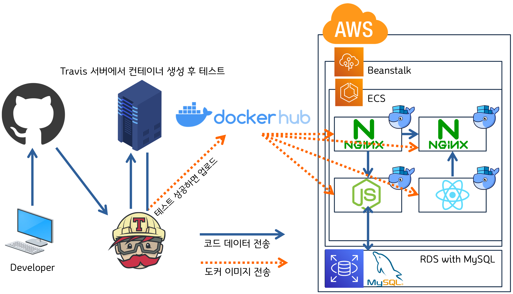

# Multi container CICD


## 구성도

- DEV Flow chart
    
    
    
- Service ENV
    
    Docker-compose를 사용해 모든 컨테이너 환경을 제어합니다
    
    
    

## 요약

---

1. 멀티컨테이너를 이용해 개발환경과 운영환경을 구축합니다
2. nodeJS백엔드 ↔ reactJS프론트엔드 간에 REST API 구조로 데이터를 전달합니다(axios)
3. Nginx의 라우팅을 활용하여 
URI가 /api 로 시작하면 백엔드(NodeJS)로, 나머지( / )는 프론트(ReactJS)로 보내도록 설정합니다
4. Docker Compose를 사용해 컨테이너간의 통신 등 개발환경을 구축합니다
5. 깃헙에 푸시하면 → Travis CI 테스트→ Docker Hub로 이미지를 전달하고 Beanstalk이 ECS를 이용해 이미지를 pull하고 ECS를 이용해 컨테이너를 Deploy하도록 합니다
<!-- more -->
## Backend(nodeJS)

---

1. 메인 작업 디렉터리를 생성합니다

    ```s
    mkdir docker_multicon_app
    cd docker_multicon_app
    ```
    
2. nodeJS로 백앤드를 구성합니다. 백앤드 작업용 폴더를 생성합니다
    
    ```s
    mkdir backend
    cd backend
    ```
    
3. 노드 세팅을 시작합니다. 모두 기본값으로 진행합니다

    ```s
    npm init
    ```

4. 종속성을 수정합니다
    
    body-parser는 클라이언트에서 오는 요청의 본문을 해석해주는 미들웨어입니다

    ```s
    code package.json
    ```

    ```json
    "scripts": {
    "test": "echo \"Error: no test specified\" && exit 1",
    "start": "node server.js",
    "dev": "nodemon server.js"
    },
    "dependencies": {
    "express":"^4.17.1",
    "mysql":"^2.18.1",
    "nodemon": "^2.0.7",
    "body-parser":"^1.19.0"
    }
    ```
    
5. mysql연결을 위한 db.js를 작성합니다
    
    데이터베이스를 이용하려면  connection을 연결한 후 다 사용하고 나면 그 connection을 반납해야합니다. 하지만 너무 많은 요청이 오면 이 과정에서 부하가 생길 수 있기 때문에 연결된 Connection을 Pool에 보관한 후 필요할 때 Pool에 있는 Connection을 가져다가 쓸 수 있습니다.

    ```s
    code db.js
    ```

    ```js
    const mysql = require("mysql");
    const pool = mysql.createPool({
        connectionLimit: 10,
        host: "mysql",
        user: "root",
        password: "password",
        database: "myapp"
    });
    exports.pool = pool; //다른 앱에서 쓸 수 있도록 export
    ```

6. app의 시작점인 server.js를 작성합니다

    ```s
    code server.js
    ```

    ```js
    const express = require("express");
    const bodyParser = require("body-parser");
    //앞에서 export된 pool의 시작점인 db.js를 불러오기
    const db = require("./db");

    const EXPRESS_PORT = 5000;

    const app = express();

    //JSON형태로 오는 요청을 해석할 수 있도록 parser 사용
    app.use(bodyParser.json());
    //------------! 테이블 생성 !---------------/
    //참고용으로 기록해두었으며, 실제 환경에서는 컨테이너 로드시 별도로 테이블을 생성합니다
    /*
    db.pool.query(`CREATE TABLE lists(
        id INT AUTO_INCREMENT,
        value TEXT,
        PRIMARY KEY (id)
    )`, (err, results, fields) => {
        console.log(`results : ${results}`)
    })
    */   
    //--------------! API !--------------------/
    //DB 테이블에 있는 모든 데이터를 프론트로 보내기
    app.get('/api/values'), function (req, res, next) { //핸들러 생성
        db.pool.query("SELECT * FROM lists;", //DB에서 모든 데이터 가져오기
            (err, results, fields) => {
                if (err)
                    return res.status(500).send(err)
                else
                    return res.json(results)
            })
    })

    //프론트에서 입력한 값을 DB 테이블에 입력
    app.post('/api/values', function (res, req, next) {
        db.pool.query(`INSERT INTO lists (values) VALUES("${req.body.value}");`, //bodyParser 사용
            (err, results, fields) => {
                if (err)
                    return res.status(500).send(err)
                else
                    return res.json({success: true, value: req.body.value})
        })
    })

    //------------! START EXPRESS !-----------------/

    app.listen(EXPRESS_PORT, ()) => {
        console.log("app running on PORT 5000")
    }
    ```
      

## Frontend(reactJS)

---

1. 메인 작업 디렉터리에 리액트를 설치합니다. 
    
    ```s
    npx create-react-app frontend
    ```

2. 다음과 같은 구조가 되겠습니다
    
    
    
3. 데이터 입력을 위해 리액트 /src/app.js에 인풋과 버튼을 생성합니다

    ```html
    <div className="container">
      <form className="example">
        <input
          type="text"
          placeholder="type something here"
        />
        <button type="submit">GO</button>
      </form>
    </div>
    ```

4. 데이터 전달에 useState, useEffect, axios를 사용합니다
    - package.json - depencencise

    ```s
    "axios" : "^0.21.1" 
    -> 종속성 업데이트 후 npm install
    ```
        
    - import

    ```js
    import React, { useState, useEffect } from 'react';
    //useState, useEffect를 사용하기 위해 react라이브러리에서 가져옵니다
    import axios from 'axios';
    ```

- useState

    ```js
    const [lists, setLists] = useState([]) //기본state는 빈 배열
    // 데이터베이스에 저장된 값을 가져와서 화면에 보여주기전 이 State에 넣어둡니다
    const [value, setValue] = useState("") //기본state에 빈 스트링
    //Input박스에 입력한 값이 이 state에 들어갑니다
    ```

- axios, useEffect

    ```js
    useEffect(() => { //이곳에서 데이터베이스에 있는 값을 요청
        axios.get('/api/values') //데이터를 요청하기 위해 get Request 보내는 곳, Node서버에서 지정해준 경로대로
          .then(response => { //백엔드(Node)가 처리 후 송신한 데이터가 이곳(respose 파라미터)로 수신
            console.log(`response ${response.data}`) //어떤 값이 왔는지 콘솔로 확인
            setLists(response.data) //수신한 데이터를 이곳(setLists(38행))에 넣어줌
        })
      }, [])

      //changeHandler역할 : 56행 onChange컨트롤 = input박스에 입력을 할 때 onChangeEvent가 발생할 때 마다 value state를 변화시켜줌
      const changeHandler = (event) => {  //onChange핸들러 이벤트 발생시 다음 단계 수행
        setValue(event.currentTarget.value)
      }

      //submitHandler역할 : 값을 input 박스에 입력하고 확인 버튼을 누르면 데이터값이 DB에 저장
      const submitHandler = (event) => { //이벤트를 받아옵니다
        event.preventDefault(); //오동작 방지를 위해 기본 동작을 제거합니다
        axios.post('/api/value', //데이터 전달을 위해 백엔드에 POST request를 보냅니다
          { value: value }) //키값 : value / 데이터값 : value / 참조 : 40행 리스트의 0번 = value
          .then(response => { //백엔드에서 처리 후 회신받은 데이터를 response에 받아옴
            if (response.data.success) { //response가 성공했다면 <- server.js 42행 참고
              console.log(`response.data : ${response.data}`) //성공했을경우 결과값을 한 번 살펴봅니다
              setLists([...lists, response.data]) //38행 리스트[0] (lists)에 값을 넣어주기. 원래 리스트에 있던 데이터에 이어서 넣어주기 위해 ...lists(3번째)로 작성
              setValue(""); //데이터 입력 후 input 박스 내용은 삭제
            } else { //response가 실패했다면
              alert("DB에 데이터 넣기 실패")
          }
        })
      }
    ```

- 이벤트핸들러 호출을 위한 부분(onSubmit, onChange)과 렌더링 보강(아래 코드조각의 3~5행)을 위해 html 코드를 수정합니다. 이는 화면에 표시되는 리스트의 개수가 다를 떄 렌더링 오류가 발생하는 것을 수정합니다

    ```js
    <div className="container">

      {lists && lists.map((list, index) => ( 
        <li key={index}>{list.value}</li>
      ))}

      <form className="example" onSubmit={submitHandler}>
        <input
          type="text"
          placeholder="type something here"
          onChange={changeHandler}
          value={value}
        />
        <button type="submit">GO</button>
      </form>
    </div>
    ```

5. 고로 최종적인 코드는 다음과 같습니다
    - App.js
        
    ```js
    import logo from './logo.svg';
    import './App.css';
    import React, { useState, useEffect } from 'react';
    //useState, useEffect를 사용하기 위해 react라이브러리에서 가져옵니다
    import axios from 'axios'; 

    function App() {

      useEffect(() => { //이곳에서 데이터베이스에 있는 값을 요청
        axios.get('/api/values') //데이터를 요청하기 위해 get Request 보내는 곳, Node서버에서 지정해준 경로대로
          .then(response => { //백엔드(Node)가 처리 후 송신한 데이터가 이곳(respose 파라미터)로 수신
            console.log(`response ${response.data}`) //어떤 값이 왔는지 콘솔로 확인
            setLists(response.data) //수신한 데이터를 이곳(setLists(38행))에 넣어줌
        })
      }, [])

      //changeHandler역할 : 56행 onChange컨트롤 = input박스에 입력을 할 때 onChangeEvent가 발생할 때 마다 value state를 변화시켜줌
      const changeHandler = (event) => {  //onChange핸들러 이벤트 발생시 다음 단계 수행
        setValue(event.currentTarget.value)
      }

      //submitHandler역할 : 값을 input 박스에 입력하고 확인 버튼을 누르면 데이터값이 DB에 저장
      const submitHandler = (event) => { //이벤트를 받아옵니다
        event.preventDefault(); //오동작 방지를 위해 기본 동작을 제거합니다
        axios.post('/api/value', //데이터 전달을 위해 백엔드에 POST request를 보냅니다
          { value: value }) //키값 : value / 데이터값 : value / 참조 : 40행 리스트의 0번 = value
          .then(response => { //백엔드에서 처리 후 회신받은 데이터를 response에 받아옴
            if (response.data.success) { //response가 성공했다면 <- server.js 42행 참고
              console.log(`response.data : ${response.data}`) //성공했을경우 결과값을 한 번 살펴봅니다
              setLists([...lists, response.data]) //38행 리스트[0] (lists)에 값을 넣어주기. 원래 리스트에 있던 데이터에 이어서 넣어주기 위해 ...lists(3번째)로 작성
              setValue(""); //데이터 입력 후 input 박스 내용은 삭제
            } else { //response가 실패했다면
              alert("DB에 데이터 넣기 실패")
          }
        })
      }

      const [lists, setLists] = useState([]) //기본state는 빈 배열
      // 데이터베이스에 저장된 값을 가져와서 화면에 보여주기전 이 State에 넣어둡니다
      const [value, setValue] = useState("") //기본state에 빈 스트링
      //Input박스에 입력한 값이 이 state에 들어갑니다

      return (
        <div className="App">
          <header className="App-header">
            

            <div className="container">
              {lists && lists.map((list, index) => ( //38행의 lists
                <li key={index}>{list.value}</li> //map메소드 사용시 key값 명시 필수
              ))}
              <form className="example" onSubmit={submitHandler}>
                <input
                  type="text"
                  placeholder="type something here"
                  onChange={changeHandler}
                  value={value} //40행과 매핑
                />
                <button type="submit">GO</button>
              </form>
            </div>        

          </header>
        </div>
      );
    }

    export default App;
    ```

6. 디자인을 위해 app.css도 추가합니다
    
    ```s
    code App.css
    ```

    ```css
    .container {
      width: 375px;
    }

    form.example input {
      padding: 10px;
      font-size: 17px;
      border: 1px solid grey;
      float: left;
      width: 74%;
      background: #f1f1f1;
    }

    form.example button {
      float: left;
      width: 20%;
      padding: 10px;
      background: #2196F3;
      color: white;
      font-size: 17px;
      border: 1px solid grey;
      border-left: none;
      cursor: pointer;
    }

    form.example button:hover {
      background: #0b7dda;
    }

    form.example::after {
      content: "";
      clear: both;
      display: table;
    }
    ```
        
7. 프론트에서 백엔드로 데이터를 밀어넣을 준비가 되었습니다
    
    
    

## Dockerfile 작성 - for React

---

- 다음과 같이 frontend 디렉터리에 작성합니다
    
    
    

### 개발 환경용 Dockerfile.dev

    ```s
    code Dockerfile.dev
    ```

    ```dockerfile
    FROM node:alpine 
    #도커허브에서 베이스 이미지를 가져옵니다
    WORKDIR /app
    #해당 어플의 소스코드들이 /app에 들어가게 됩니다
    COPY package.json ./
    #소스코드가 바뀔 때 마다 종속성을 다시 복사하지 않도록 먼저 작업합니다
    RUN npm install
    #종속성에 명시된 라이브러리, 프레임워크를 설치합니다
    COPY ./ ./
    #모든 소스코드를 WORKDIR로 복사합니다
    CMD ["npm", "run", "start"]
    #컨테이너를 로드할 때 실행할 명령어를 지정합니다
    ```

### 운영 환경용 Dockerfile

    ```
    code Dockerfile
    ```

    ```dockerfile
    FROM node:alpine as builder
    WORKDIR /app
    COPY ./package.json ./
    RUN npm install
    COPY ./ ./
    RUN npm run build
    #여기까지 nginx에서 사용할 파일을 build합니다

    #Nginx를 가동하고 윗 단계에서 생성한 빌드파일들을 nginx에 복사합니다
    FROM nginx
    EXPOSE 3000
    #nginx 컨테이너가 3000번 포트를 listen 하도록 합니다
    COPY ./nginx/default.conf /etc/nginx/conf.d/default.conf
    #default.conf설정파일 미리 만들고 nginx컨테이너 안에 적용하도록 복사합니다
    COPY --from=builder /app/build /usr/share/nginx/html
    #빌드가 완료된 파일을 Nginx 루트 폴더에 복사합니다
    ```

### 라우팅용 Nginx 설정(정적파일 제공을 위한)

- frontend 디렉토리에 nginx폴더 생성

    ```s
    mkdir nginx
    cd nginx
    code default.conf
    ```

- default.conf
    
    ```s
    server {
      listen 3000;
      
      location / {
        
        root /usr/share/nginx/html;
        index index.html index.htm;
        try_files $uri $uri/ /index.html;
      }
    }
    ```
    
    - listen 3000 : nginx 서버가 사용할 포트를 오픈합니다
    - location / : 만약 루트로 요청이 들어온다면
    - root /usr/share/nginx/html : HTML파일(빌드파일)이 위치한 루트폴더를 설정합니다
    - index index.html index.htm : 사이트의 Index페이지를 index.html로 설정합니다
    - try_files $uri $uri/ /index.html
     : React Router를 사용해서 페이지간 이동할 때 필요한 옵션입니다
        
        <aside>
        💡 React는 SPA이기 때문에 index.html단일 파일만 가지고 있으며, URL GET(REST)로 접속을 하려고 할 때고 index.html로 라우팅 시켜야합니다.
        하지만 NginX는 이것을 인지하지 않고 있기 때문에 어떤 요청이 들어와도 강제로 index.html에 라우팅 하도록 설정합니다
        
        </aside>
        

## Dockerfile 작성 - for NodeJS

---

- 당연히 backend 디렉터리에서 작업합니다

### 개발 환경용 Dockerfile.dev

!!! notice
    💡 너무 많이 반복했기 때문에 설명은 생략합니다


    ```s
    cd backend
    code Dockerfile.dev
    ```

    ```dockerfile
    FROM node:alpine

    WORKDIR /app

    COPY ./package.json ./

    RUN npm install

    COPY ./ ./

    CMD ["npm", "run", "dev"]
    #npm run start가 아닌 npm run dev를 사용해서 nodemon모듈을 이용해 시작합니다
    ```

### 운영 환경용 Dockerfile

    ```s
    code Dockerfile
    ```

    ```dockerfile
    FROM node:alpine

    WORKDIR /app

    COPY ./package.json ./

    RUN npm install

    COPY ./ ./

    CMD ["npm", "run", "start"]
    ```

## DB 세팅

---

!!! warning
    💡 DB작업은 중요한 데이터를 다루기 때문에 작은 실수로도 큰 재앙을 초래할 수 있습니다.
    따라서 개발환경은 도커를 이용하고 운영환경에서는 AWS RDS를 사용하였습니다

1. 개발환경은 도커로 MySQL서버를 구축합니다
2. 한글이 깨지는 것을 막기 위해 MySQL 인코딩을 UTF-8로 설정합니다.
MySQL용 conf 파일을 이용해 설정할 수 있습니다
    
    ```s
    mkdir mysql
    cd mysql
    code my.cnf
    ```

    ```conf
    [mysqld]
    character-set-server=utf8

    [mysql]
    default-character-set=utf8

    [client]
    default-character-set=utf8
    ```
    
3. mysql 디렉터리를 생성하고 도커파일을 생성합니다

    ```s
    code Dockerfile
    ```

    ```dockerfile
    FROM mysql:5.7

    COPY ./my.cnf /etc/mysql/conf.d/my.cnf
    ```
    
4. MySQL DB를 로드한 후 초기 db와 테이블 사용을 위한 초기 환경을 제작합니다
5. 디렉터리를 새로 만들고 sql문을 작성합니다
    
    ```s
    mkdir sqls
    cd sqls
    code init.sql
    ```

    ```sql
    DTOP DATABASE IF EXISTS myapp;
    -- 이전에 생성된 myapp DB가 존재할 경우 삭제
    CREATE DATABASE myapp;
    USE myapp;

    CREATE TABLE lists(
        id INT AUTO_INCREMENT,
        value TEXT,
        PRIMARY KEY (id)
    );
    ```


## Proxy Layer용 Nginx 설정

---

1. 루트폴더에 Nginx를 위한 디렉터리를 생성합니다
    
    ```s
    mkdir nginx
    cd nginx
    ```
    
2. 도커파일을 생성합니다(개발, 운영 환경 설정이 같기 때문에 .dev를 따로 생성하지 않습니다
    
    ```s
    code Dockerfile
    ```

    ```dockerfile
    FROM nginx
    #Nginx베이스 이미지 가져오기
    COPY ./default.conf /etc/nginx/conf.d/default.conf
    #작성된 conf 파일을 Nginx컨테이너에 복사하여 설정 적용하기
    ```
    
3. Nginx 설정파일 생성을 시작합니다

    ```s
    code default.conf
    ```

    ```s
    upstream frontend {
        server frontend:3000;
    }

    upstream backend {
        server backend:5000;
    }

    server {
        listen 80;

        location / {
            proxy_pass http://frontend;
        }

        location /api {
            proxy_pass http://backend;
        }

        location /sockjs-node {
            proxy_pass http://frontend;
            proxy_http_version 1.1;
            proxy_set_header Upgrade $http_upgrade;
            proxy_set_header Connection "Upgrade";
        }
    }
    ```

    - 아래 'frontend', 'backend'는 docker-compose 파일에서 명시합니다
    - upstream frontend : 3000번 포트에서 frontend가 동작중인 것을 명시합니다
    - upstream backend : 5000번 포트에서 backend가 동작중인 것을 명시합니다
    - listen 80 : Nginx 서버 80번 포트를 Listening(오픈) 합니다
    - location / : 아래에 나오는 조건에 해당하는 라우팅 설정이 없으면 frontend로 라우팅 합니다
    - location /api : /api로 들어오는 요청은 backend로 보내줍니다
    - location /sockjs-node : 리액트 개발환경에서 발생하는 에러(↓)를 처리하기 위해 작성합니다
        
        
        

## Docker compose 작성

---

- 디렉터리 구조는 다음과 같습니다
    
    
    
1. 루트 폴더에서 컴포즈 파일을 작성합니다

    ```s
    code docker-compose.yml
    ```
        
    ```dockerfile title="docker-compose.yml"
    version: "3"
    services:
    frontend:
      build: #개발환경의 Dockerfile이 어디있는지 알려줍니다
        dockerfile: Dockerfile.dev
        context: ./frontend
      container_name: app_frontend
      environment:
        - CHOKIDAR_USEPOLLING=true
      volumes: #코드수정후 이미지를 다시 빌드할 필요 없도록 매핑합니다
        - /app/node_modules #매핑에서 제외합니다
        - ./frontend:/app #나머지는 전부 이곳으로 매핑합니다
      stdin_open: true #리액트 앱을 종료할 때 발생하는 버그를 해결해줍니다
    nginx:
      restart: always #proxy역할을 하고 있는 Nginx가 죽어버리면 시스템 전체가 다운되기 때문에 얘는 항상 재시작
      #재시작 정책
      #no : 어떤 상황에도 재시작 하지 않음
      #always : 항상 재시작
      #on-failure : on-failure에러코드와 함께 컨테이너가 멈추었을 때만 재시작
      #unless-stopped : 개발자가 임의로 멈추려 하는 경우를 제외하고 항상 재시작
      build:
        dockerfile: Dockerfile
        context: ./nginx
      container_name: app_proxy_nginx
      ports: -"3000:80"
    backend:
      build:
        dockerfile: Dockerfile.dev
        context: ./backend
      container_name: app_backend
      volumes:
        - /app/node_modules
        - ./backend:/app
    mysql:
      build: ./mysql
      restart: unless-stopped
      container_name: app_mysql
    ports: -"3306:3306"
    volumes:
      - ./mysql/mysql_data:/var/lib/mysql
      - ./mysql/sqls/:/docker-entrypoint-initdb.d/
    environment: #환경변수
      MYSQL_ROOT_PASSWORD: password
      MYSQL_DATABASE: myapp
    ```
    
2. 작성이 완료되었으면 컴포즈를 실행해봅니다

    ```s
    docker-compose up
    ```
    
3. ERROR : -initialize specified but the data directory has files in it. Aborting. 발생시
볼륨으로 연결된 mysql 데이터 디렉터리를 날려줍니다

## ready for CICD

---

### remove MySQL Container

1. AWS환경에서는 DB로 RDS를 이용하기 때문에 MySQL 컨테이너가 필요하지 않으니 삭제합니다
2. docker-compose.yml 에서 MySQL코드를 제거합니다
    
    
    

## Travis CI YAML 작성

1. 루트 폴더에 트레비스 설정 파일을 작성합니다

    ```s
    code .travis.yml
    ```

    ```yaml title=".travis.yml"
    language: generic

    sudo: required

    services: #Travis CI에게 도커 환경으로 만들것이라고 선언해주기
      - docker

    before_install: #구성된 도커 환경에서 Dockerfile.dev를 이용해 이미지 생성
      - docker build -t dotoryeee/build-test -f ./frontend/Dockerfile.dev ./frontend

    script: #생성된 테스트 이미지를 이용해 테스트 수행하기
      - docker run -e CI=true dotoryeee/build-test npm run test

    after_success: #테스트가 성공하면 본격적으로 운영버전을 빌드
      - docker build -t dotoryeee/docker-frontend ./frontend
      - docker build -t dotoryeee/docker-backend ./backend
      - docker build -t dotoryeee/docker-nginx ./nginx
      #도커 허브에 로그인
      - echo "$DOCKER_HUB_PASSWORD" | docker login -u "$DOCKER_HUB_ID" --password-stdin
      #도커 허브에 이미지 푸시
      - docker push dotoryeee/docker-frontend
      - docker push dotoryeee/docker-backend
      - docker push dotoryeee/docker-nginx
    ```

2. 계정 정보는 Travis CI 환경변수에 입력합니다
    
    
    
3. 깃헙에 푸시하고 한 번 지켜봅니다
    
    
    
4. 환경변수도 잘 가져오는 것을 확인할 수 있습니다
    
    
    
5. 헹
    
    
    
6. 도커 허브에 이미지가 잘 업로드 된 것을 확인할 수 있습니다
    
    
    

## AWS

---

### Dockerrun.aws.json ?

- Dockerfile이 다수 존재하는 경우 Beanstalk이 어떻게 처리해야 하는지 프로세스를 모르기 때문에 Dockerrun.aws.json을 이용해 '작업 정의(Task Definition)'를 명시해줄 수 있으며 작업 정의를 등록할 떄는 '컨테이너 정의(Container Definition)'도 명시해야 합니다
- 따라서 멀티컨테이너 환경에서만 필요합니다
- 작업정의에서 할 수 있는 것
    - 컨테이너에서 사용할 도커 이미지
    - 컨테이너를 띄울 vCPU, 메모리
    - 컨테이너가 사용할 도커 네트워크
    - 작업이 호스팅되는 인프라
    - 작업에 사용할 로깅 구성
    - AWS IAM

### ECS 작업 정의 파일 작성

1. 루트 폴더에 JSON 파일을 생성합니다

    ```s
    code Dockerrun.aws.json
    ```

    ```json title="Dockerrun.aws.json"
    {
        "AWSEBDockerrunVersion": 2,
        "containerDefinitions": [
            {
                "name": "frontend",
                "image": "dotoryeee/docker-frontend",
                "hostname": "frontend",
                "essential": false,
                "memory": 128
            },
            {
                "name": "backend",
                "image": "dotoryeee/docker-backend",
                "hostname": "backend",
                "essential": false,
                "memory": 128
            },
            {
                "name": "nginx",
                "image": "dotoryeee/docker-nginx",
                "hostname": "nginx",
                "essential": true,
                "portMappings": [
                    {
                        "hostPort": 80,
                        "containerPort": 80
                    }
                ],
                "links": ["frontend", "backend"],
                "memory":128
            }
        ]
    }
    ```
    
2. 컨테이너 정의 간단 설명
    - name : 컨테이너 이름
    - hostname : 이것을 이용해서 도커 컴포즈를 이용해 생성된 다른 컨테이너에서 접근 가능
    - essential : 컨테이너가 실패할 경우 작업을 중지해야하면 true. 필수적이지 않은 컨테이너는 인스턴스의 나머지 컨테이너에 영향을 미치지 않고 종료되거나 충돌할 수 있습니다
    지금 작업에선 Nginx가 죽으면 아무것도 동작할 수 없기 때문에 Nginx만 true 입니다
    - links : 연결할 컨테이너의 목록. 연결된 컨테이너는 서로를 검색하고 통신할 수 있습니다
        
        현재 links처럼 설정하면 아래 그림 처럼 연결됩니다
        
        
        

### AWS Beanstalk 생성

- 멀티컨테이너 플랫폼으로 생성합니다
    
    
    

### AWS RDS 생성

1. RDS접속을 위해 Docker-compose 파일에 다음과 같이 환경변수를 추가합니다

    ```yaml
    environment: 
      MYSQL_HOST: mysql
      MYSQL_USER: root
      MYSQL_ROOT_PASSWORD: password
      MYSQL_DATABASE: myapp
      MYSQL_PORT: 3306
    ```
        
2. RDS접속을 위해 /backend/db.js 파일에서 환경변수를 불러옵니다

    ```js
    const pool = mysql.createPool({
        connectionLimit: 10,
        host: process.env.MYSQL_HOST,
        user: process.env.MYSQL_USER,
        password: process.env.MYSQL_ROOT_PASSWORD,
        database: process.env.MYSQL_DATABASE,
        port: process.env.MYSQL_PORT
    });
    ```
        
3. AWS RDS에 접속해서 인스턴스를 생성합니다
    
    
    
4. 환경변수에 맞춰서 세팅해줍니다
    
    
    
5. 편하게 추가 설정에서 초기 DB도 미리 만들어줍니다
    
    
    

### AWS 보안그룹

1. 인바운드 옵션 없이 SG를 생성합니다
    
    
    
2. 인바운드에 SG스스로를 소스로 등록하고 3306 포트를 허용합니다
    
    이는 VPC 내부에서만 통신을 허용하게 합니다
    
    
    
3. RDS에 방금 생성한 보안그룹을 등록합니다
    
    
    
4. 수정사항을 즉시 적용합니다
    
    
    
5. 이번엔 Beanstalk에 보안그룹을 적용합니다
Beanstalk의 동작환경(env) → Configuration → Instance의 Edit 메뉴에 진입합니다
    
    
    
6. 방금 만든 SG를 적용합니다
    
    
    

### Beanstalk ↔ RDS 연결을 위한 환경변수 설정

1. 빈스톡 안에있는 컨테이너들은 MySQL과 소통할 떄 환경변수를 인식할 수 없기 때문에 따로 설정해야 합니다
2. RDS의 엔드포인트(접속)주소를 복사합니다
    
    
    
3. 빈스톡 환경 구성에서 Software를 편집합니다
    
    
    
4. 다음과 같이 환경변수를 설정하고 저장합니다
    
    
    

## 배포 설정

1.  .travis.yml에 다음 코드를 추가합니다

    ```yaml title=".travis.yml"
    deploy:
      provider: elasticbeanstalk
      region: "ap-northeast-2"
      app: "dotoryeee_FIRST_ECS_APP"
      env: "Dotoryeeefirstecsapp-env"
      bucket_name: elasticbeanstalk-ap-northeast-2-737382971423
      bucket_path: "dotoryeee_FIRST_ECS_APP"
      on:
        branch: master

      access_key_id: $AWS_ACCESS_KEY
      secret_access_key: $AWS_SECRET_ACCESS_KEY
    ```
    
2. travis 환경변수에 AWS API KEY정보를 추가해줍니다
    
    
    

## 최종 푸시

1. git push
2. 빌드 성공
    
    
    
3. 자동으로 빈스톡에 배포됩니다
    
    
    
    