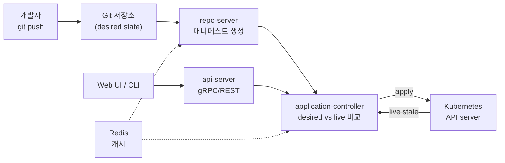

# GitOps와 ArgoCD 정리

<!-- more -->

## GitOps란
GitOps란 시스템의 원하는 상태(desired state)를 Git에 선언적으로 저장하고, 에이전트가 이를 pull해 실제 상태와 지속적으로 맞추는 운영 방식

OpenGitOps가 정의한 네 원칙으로 정리됨.

- 선언적(Declarative): 원하는 상태를 절차가 아닌 선언으로 기술 → 무엇을 원하는지만 적고 도달 방법은 시스템에 맡김
- 버전 관리·불변(Versioned and Immutable): 상태를 불변·버전 이력이 남는 저장소에 보관 → Git이 단일 진실 원천(Single Source of Truth)
- 자동 pull(Pulled Automatically): 소프트웨어 에이전트가 저장소에서 desired state를 스스로 가져옴
- 지속 조정(Continuously Reconciled): 에이전트가 실제 상태를 상시 관측하고 desired state로 되돌림

핵심은 "Git 커밋 = 배포"라는 등식. 클러스터 변경은 kubectl이 아니라 Git 커밋으로만 일어나야 함.

---

## push형 CI/CD와의 차이
기존 CI/CD는 파이프라인이 클러스터로 매니페스트를 밀어넣는 push 모델, GitOps는 클러스터 내부 에이전트가 Git을 당겨오는 pull 모델.

| 비교 항목 | push (기존 CI/CD) | pull (GitOps) |
|-----------|-------------------|---------------|
| 배포 주체 | CI 러너가 외부에서 kubectl apply | 클러스터 내부 에이전트가 Git pull 후 적용 |
| 크리덴셜 위치 | CI 시스템이 클러스터 자격증명 보관 → 외부 노출 | 자격증명이 클러스터를 벗어나지 않음 |
| drift 처리 | 파이프라인 미실행 구간의 수동 변경 방치 | 에이전트가 desired와 live를 상시 비교 후 자동 조정 |
| 감사(Audit) | 배포 이력이 CI 로그에 산재 | Git 커밋 히스토리가 단일 감사 원장 |
| 롤백 | 이전 파이프라인 재실행 | 이전 커밋으로 revert |

- push는 CI가 클러스터 밖에서 권한을 쥐므로 자격증명이 파이프라인에 상주 → 유출 표면↑
- pull은 에이전트가 방화벽 안에서 저장소를 읽기만 하면 됨 → 클러스터 API를 외부에 열지 않아도 됨
- drift는 pull 모델에서만 자동으로 잡힘. push는 배포 순간 외에는 실제 상태를 감시하지 않음
- 실무에선 하이브리드가 흔함 → CI는 빌드·테스트·이미지 push까지, CD는 GitOps 에이전트가 전담하는 분업
- pull이 항상 우위는 아님. 클러스터 밖 리소스(외부 DNS·SaaS 설정)는 여전히 push형 파이프라인이 필요

---

## ArgoCD 아키텍처
Argo CD는 Git의 desired state와 클러스터의 live state 차이를 지우는 조정 루프(reconcile loop)를 도는 Kubernetes 컨트롤러 집합.



| 컴포넌트 | 역할 |
|----------|------|
| api-server | gRPC/REST API 노출, Web UI·CLI·CI/CD가 소비. 인증·RBAC·Git webhook 처리 |
| repo-server | Git 저장소 로컬 캐시 유지, revision별로 Kubernetes 매니페스트 생성·반환 |
| application-controller | Application의 desired(Git)와 live(클러스터) 비교, 차이 조정 및 sync hook 실행 |
| Redis | Kube API·Git 요청을 줄이는 캐시 계층. 상태를 영구 저장하지 않음 |
| ApplicationSet controller | 다중 클러스터·다중 환경에 Application을 템플릿으로 대량 생성 |
| Dex(선택) | 외부 IdP 연동용 OIDC 인증 프록시 |

- repo-server는 kustomize·helm·jsonnet 등 템플릿 도구를 렌더링해 순수 매니페스트로 변환하는 지점
- application-controller가 조정 루프의 심장. 여기가 부하 집중점이라 대규모에서 샤딩 대상이 됨
- Redis는 캐시라 유실돼도 재계산으로 복구됨 → HA 구성 시에도 데이터 저장소가 아니라 성능 계층으로 취급

### Application CRD
- Argo CD의 배포 단위는 Application 커스텀 리소스(CRD)
- 필드: source(Git repo·path·revision), destination(클러스터·네임스페이스), syncPolicy(동기화 방식)
- Application 자체를 Git으로 관리하는 방식이 App of Apps 패턴 → 상위 Application이 하위 Application들을 선언

```yaml title="application.yaml"
apiVersion: argoproj.io/v1alpha1
kind: Application
metadata:
  name: dotoryeee-web           #Application 이름
  namespace: argocd             #Argo CD 설치 네임스페이스
spec:
  project: default              #소속 AppProject
  source:
    repoURL: https://github.com/dotoryeee/gitops.git  #desired state 저장소
    targetRevision: main        #추적할 브랜치·태그
    path: apps/web              #매니페스트 경로
  destination:
    server: https://kubernetes.default.svc  #배포 대상 클러스터
    namespace: web              #배포 대상 네임스페이스
  syncPolicy:
    automated:
      prune: true               #Git에서 삭제된 리소스 제거
      selfHeal: true            #클러스터 drift를 Git 상태로 복원
```

---

## 동기화 정리
sync는 Git 매니페스트를 클러스터에 적용하는 동작, 정책과 순서·상태 판정으로 세분화됨.

| 정책 | 동작 |
|------|------|
| manual | 사용자가 UI·CLI·API로 sync를 명시적으로 트리거 |
| automated | Git 변경을 감지하면 자동으로 sync |
| prune | Git에서 사라진 리소스를 클러스터에서 제거. 기본 비활성 |
| selfHeal | 클러스터에서 직접 수정된 리소스를 Git 상태로 되돌림 |

- automated만 켜고 prune을 끄면 삭제만 반영 안 됨 → 유령 리소스가 남을 수 있음
- selfHeal은 drift 방어의 핵심. 끄면 수동 kubectl 변경이 다음 Git 커밋까지 살아남음
- 긴급 수정 시 selfHeal이 롤백을 방해할 수 있음 → hotfix도 Git 커밋으로 반영하는 습관이 전제
- automated여도 실제 apply 전 diff는 UI·`argocd app diff`로 확인 가능

### sync wave와 hook
- Phase: PreSync → Sync → PostSync 순으로 매니페스트 적용 단계가 갈림
- hook: `argocd.argoproj.io/hook` 어노테이션으로 특정 Phase에 Job·Pod를 끼워 넣음 (마이그레이션·스모크 테스트 등)
- sync wave: `argocd.argoproj.io/sync-wave` 정수로 같은 Phase 내 적용 순서를 지정. 낮은 wave 먼저 적용
- prune 시에는 wave 순서가 역전됨 → 높은 wave부터 제거

### health 판정
- Argo CD는 리소스별 health를 평가하고, 하위 리소스 중 가장 나쁜 상태를 Application health로 승격
- 우선순위(건강→불량): Healthy → Suspended → Progressing → Missing → Degraded → Unknown
- sync 상태(Synced/OutOfSync)와 health는 별개 축. Synced여도 Pod가 CrashLoop면 Degraded

---

## Flux와의 비교
둘 다 CNCF graduated GitOps 컨트롤러지만 형태가 다름. Argo CD는 올인원 애플리케이션 플랫폼, Flux는 조립형 컨트롤러 집합.

| 비교 항목 | Argo CD | Flux |
|-----------|---------|------|
| UI | 내장 Web 대시보드 제공 | 공식 UI 없음(Weave GitOps 등 별도) |
| 멀티테넌시 | AppProject + RBAC로 논리 격리 | 컨트롤러·CRD가 네임스페이스 단위 분리, 테넌시가 설계 전제 |
| CRD 구조 | Application·ApplicationSet 단일 계열 | source·kustomize·helm·notification 컨트롤러별 CRD 분리 |
| 시크릿 복호화 | 플러그인 연동(KSOPS·vault-plugin 등) | kustomize-controller가 SOPS 복호화 네이티브 지원 |
| 형태 | 통합 플랫폼(UI·SSO·RBAC 내장) | GitOps Toolkit 컨트롤러 조합 |
| 라이선스·거버넌스 | Apache 2.0, CNCF graduated(2022) | Apache 2.0, CNCF graduated(2022) |

- Flux는 source-controller가 Git·Helm·OCI 소스를 당기고, kustomize/helm-controller가 적용하는 역할 분리 구조
- Argo CD는 UI·SSO·RBAC를 한 배포에 묶어 팀 온보딩이 빠름 → 대시보드로 sync·health를 눈으로 확인
- Flux는 컨트롤러를 골라 얹는 방식이라 Kubernetes 네이티브 통합·자동화 파이프라인에 유리
- 두 진영 모두 image 자동 갱신을 지원. Flux는 image-automation·image-reflector 컨트롤러, Argo CD는 Image Updater로 처리
- 우열보다 운영 형태의 차이. UI·중앙 관리가 중요하면 Argo CD, 컨트롤러 조립·GitOps 자동화가 중요하면 Flux

---

## 운영 주의
GitOps는 모든 상태를 Git에 두므로 시크릿·규모·권한 세 축에서 사고가 나기 쉬움.

### 시크릿 관리
- 평문 Secret을 Git에 커밋하면 안 됨 → 저장소 접근자 전원에게 노출됨
- Sealed Secrets: 컨트롤러가 클러스터 안에서만 복호화 가능한 SealedSecret CRD로 암호화 → 암호문만 Git에 저장
- SOPS: age·PGP 키로 값 단위 암호화. Flux는 kustomize-controller가 네이티브 복호화, Argo CD는 KSOPS·argocd-vault-plugin 등으로 연동
- 외부 저장소 연동: External Secrets Operator로 Vault·클라우드 Secret Manager를 참조하는 방식도 병행 가능

### 대규모 앱 수 성능
- application-controller가 조정 부하 집중점 → Application 수천 개 규모에서 병목
- 대응: 컨트롤러 샤딩(`--replicas`, 클러스터별 분산), repo-server 복제, Redis HA
- 매니페스트 렌더링(kustomize·helm)이 무거우면 repo-server CPU·메모리가 먼저 포화됨
- webhook을 걸어 폴링 주기 대신 이벤트 기반 sync로 전환하면 지연·부하 감소

### RBAC
- Argo CD 자체 RBAC(policy.csv)로 role·group을 매핑 → 프로젝트·액션 단위 권한 제어
- AppProject로 배포 가능한 소스 저장소·대상 클러스터·네임스페이스를 화이트리스트로 제한
- SSO(OIDC·Dex) 연동 시 IdP 그룹을 Argo CD role에 매핑 → 팀별 권한 경계 유지
- admin 계정은 초기 설정 후 비활성화 권장. 상시 admin 사용은 감사 추적을 흐림

```yaml title="appproject.yaml"
apiVersion: argoproj.io/v1alpha1
kind: AppProject
metadata:
  name: dotoryeee-team
  namespace: argocd
spec:
  sourceRepos:
    - https://github.com/dotoryeee/gitops.git   #허용 저장소 화이트리스트
  destinations:
    - server: https://kubernetes.default.svc
      namespace: web                            #허용 대상 네임스페이스
```

---

### 참고
- OpenGitOps Principles v1.0.0: https://opengitops.dev/
- Argo CD Architectural Overview: https://argo-cd.readthedocs.io/en/stable/operator-manual/architecture/
- Automated Sync Policy: https://argo-cd.readthedocs.io/en/stable/user-guide/auto_sync/
- Sync Phases and Waves: https://argo-cd.readthedocs.io/en/stable/user-guide/sync-waves/
- Resource Health: https://argo-cd.readthedocs.io/en/stable/operator-manual/health/
- Flux Components: https://fluxcd.io/flux/components/

---

## 결론
- GitOps는 배포 상태의 단일 진실 원천을 Git으로 고정하고 에이전트가 상시 조정하는 운영 모델
- Argo CD는 desired(Git)와 live(클러스터)의 차이를 지우는 조정 루프가 전부
- 시크릿·규모·권한은 Git에 모든 걸 두는 대가 → sealed-secrets·샤딩·RBAC로 각각 방어
- push는 "파이프라인이 클러스터에 밀어넣는 방식", pull은 "클러스터가 Git을 당겨와 스스로 맞추는 방식"
