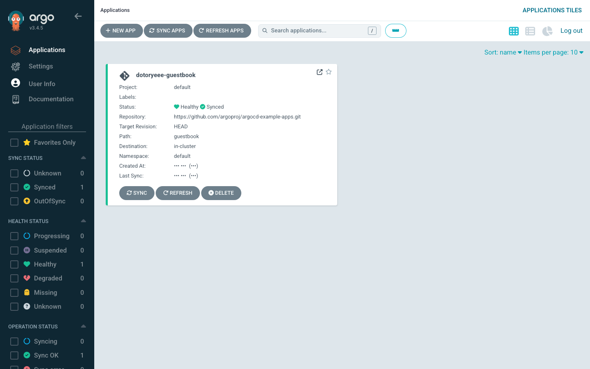
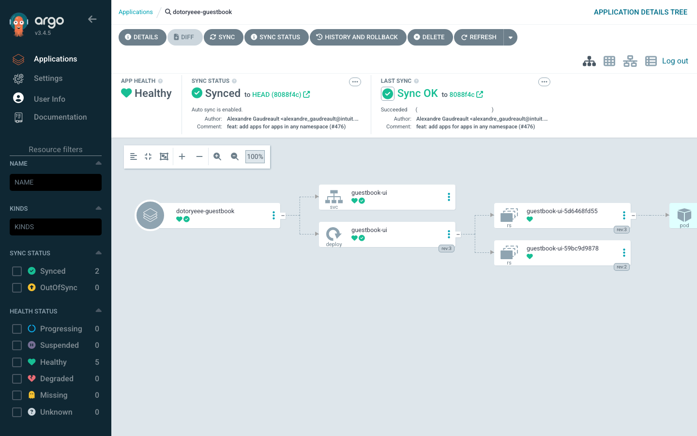
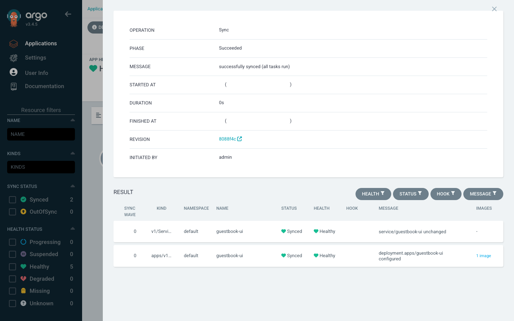

# kind에 ArgoCD 올려 GitOps 동작 확인하기

<!-- more -->

## 목표

---

- GitOps와 ArgoCD 정리 글에서 개념과 아키텍처를 다뤘고, 여기서는 로컬 클러스터에 ArgoCD를 직접 올려 동작을 실측한다
- kind 클러스터에 공식 install.yaml로 ArgoCD를 설치하고, 공개 예제 저장소의 애플리케이션 하나를 sync한다
- kubectl로 라이브 리소스를 흔들어 drift를 만든 뒤, selfHeal이 이를 자동으로 되돌리는 과정을 초 단위로 확인한다
- 이전 리비전으로 롤백해 배포 이력이 어떻게 쌓이고 되감기는지 본다

## 실습 환경

---

도구는 모두 로컬 macOS에 설치했고, 클러스터는 kind가 띄운 단일 노드다. 버전은 다음과 같다.

```s
kind version
kind v0.32.0 go1.26.3 darwin/arm64

argocd version --client --short
argocd: v3.4.5+564b949.dirty
```

ArgoCD CLI는 brew install argocd로 받았다. kind가 받아오는 노드 이미지는 kindest/node:v1.36.1이고, 클러스터 API 서버도 v1.36.1이다.

## kind 클러스터와 ArgoCD 설치

---

클러스터부터 만든다. 이름에 dotoryeee를 넣어 기존 실습 컨테이너와 섞이지 않게 한다.

```s
kind create cluster --name dotoryeee-gitops
 ✓ Preparing nodes 📦
 ✓ Starting control-plane 🕹️
 ✓ Installing CNI 🔌
 ✓ Installing StorageClass 💾
Set kubectl context to "kind-dotoryeee-gitops"
```

이어서 argocd 네임스페이스를 만들고 공식 install.yaml을 적용한다.

```s
kubectl create namespace argocd
kubectl apply -n argocd -f https://raw.githubusercontent.com/argoproj/argo-cd/stable/manifests/install.yaml
```

그런데 마지막 CRD에서 막힌다.

```s
The CustomResourceDefinition "applicationsets.argoproj.io" is invalid: metadata.annotations: Too long: may not be more than 262144 bytes
```

client-side apply는 원본 매니페스트를 last-applied-configuration 어노테이션에 통째로 넣는다. ApplicationSet CRD가 커서 이 어노테이션이 256KB 한도를 넘는다. server-side apply로 다시 적용하면 원본을 어노테이션에 담지 않으므로 통과한다.

```s
kubectl apply --server-side --force-conflicts -n argocd -f https://raw.githubusercontent.com/argoproj/argo-cd/stable/manifests/install.yaml
```

!!! warning
    💡 최신 kubectl로 install.yaml 적용시 ApplicationSet CRD가 어노테이션 한도를 넘으므로 server-side apply로 적용한다

파드 일곱 개가 다 뜨면 설치가 끝난다.

```s
kubectl get pods -n argocd
NAME                                                READY   STATUS    RESTARTS      AGE
argocd-application-controller-0                     1/1     Running   0             70s
argocd-applicationset-controller-7d4d7c7b89-gwpqv   1/1     Running   0             70s
argocd-dex-server-cbddb9676-2pk4c                   1/1     Running   1 (32s ago)   70s
argocd-notifications-controller-7b55c64b69-kdm4p    1/1     Running   0             70s
argocd-redis-68bc658cfb-6js6z                       1/1     Running   0             70s
argocd-repo-server-56c67cf674-p46tj                 1/1     Running   0             70s
argocd-server-66b7d96445-kh9ff                      1/1     Running   0             70s
```

## 로그인과 dotoryeee 계정 추가

---

UI와 CLI는 argocd-server로 붙는다. 로컬에서는 port-forward로 연다.

```s
kubectl port-forward svc/argocd-server -n argocd 8080:443
```

초기 admin 비밀번호는 설치 때 만들어진 시크릿에 들어 있다.

```s
kubectl -n argocd get secret argocd-initial-admin-secret -o jsonpath='{.data.password}' | base64 -d
E70x8Oun8SKJoTkB
```

이 값으로 CLI에 로그인한다. 아래 명령의 비밀번호 자리는 위에서 뽑은 실제 값으로 넣는다.

```s
argocd login localhost:8080 --username admin --password <admin-pw> --insecure
'admin:login' logged in successfully
Context 'localhost:8080' updated
```

admin 계정은 이름을 바꿀 수 없다. 대신 로컬 계정 dotoryeee를 하나 추가해 UI 로그인과 화면에 쓴다. argocd-cm에 계정을, argocd-rbac-cm에 권한을 넣고 argocd-server를 재시작해 설정을 읽힌다.

```s
kubectl -n argocd patch configmap argocd-cm --type merge \
  -p '{"data":{"accounts.dotoryeee":"apiKey,login"}}'
kubectl -n argocd patch configmap argocd-rbac-cm --type merge \
  -p '{"data":{"policy.csv":"g, dotoryeee, role:admin\n"}}'
kubectl -n argocd rollout restart deployment argocd-server
```

계정 비밀번호를 정하면 로그인 준비가 끝난다.

```s
argocd account update-password --account dotoryeee \
  --current-password <admin-pw> --new-password <dotoryeee-pw>
Password updated

argocd account list
NAME       ENABLED  CAPABILITIES
admin      true     login
dotoryeee  true     apiKey, login
```

## Application 생성과 sync

---

배포 대상은 ArgoCD 공식 예제 저장소의 guestbook이다. 저장소를 새로 만들지 않고 공개 repo를 그대로 desired state로 쓴다. Application 이름에도 dotoryeee를 넣는다.

```s
argocd app create dotoryeee-guestbook \
  --repo https://github.com/argoproj/argocd-example-apps.git \
  --path guestbook \
  --dest-server https://kubernetes.default.svc \
  --dest-namespace default
application 'dotoryeee-guestbook' created
```

만들자마자 상태를 보면 아직 아무것도 배포되지 않아 OutOfSync에 Missing이다. desired state(Git)는 있고 live state(클러스터)는 비어 있는 상태다.

```s
argocd app get dotoryeee-guestbook --refresh
Sync Status:        OutOfSync from  (8088f4c)
Health Status:      Missing

GROUP  KIND        NAMESPACE  NAME          STATUS     HEALTH   HOOK  MESSAGE
       Service     default    guestbook-ui  OutOfSync  Missing
apps   Deployment  default    guestbook-ui  OutOfSync  Missing
```

sync를 트리거하면 매니페스트가 클러스터에 적용된다. Deployment는 처음엔 Progressing이다가 파드가 뜨면 Healthy로 넘어간다.

```s
argocd app sync dotoryeee-guestbook
Sync Status:        Synced to  (8088f4c)
Health Status:      Progressing

GROUP  KIND        NAMESPACE  NAME          STATUS  HEALTH       HOOK  MESSAGE
       Service     default    guestbook-ui  Synced  Healthy            service/guestbook-ui created
apps   Deployment  default    guestbook-ui  Synced  Progressing        deployment.apps/guestbook-ui created
```

argocd app wait로 Healthy까지 기다리면 두 리소스 모두 Synced에 Healthy가 된다.

```s
argocd app wait dotoryeee-guestbook --health
Health Status:      Healthy

GROUP  KIND        NAMESPACE  NAME          STATUS  HEALTH   HOOK  MESSAGE
       Service     default    guestbook-ui  Synced  Healthy        service/guestbook-ui created
apps   Deployment  default    guestbook-ui  Synced  Healthy        deployment.apps/guestbook-ui created
```

UI에서도 같은 상태가 보인다. 애플리케이션 타일에 dotoryeee-guestbook이 Healthy와 Synced로 뜬다.



타일을 열면 리소스 트리가 나온다. Application 아래로 Service와 Deployment, 그 밑으로 ReplicaSet과 Pod까지 한 화면에 이어진다. 상단 패널에 sync 상태와 추적 중인 리비전(8088f4c)이 같이 뜬다. 아래 트리는 뒤에서 할 drift와 롤백까지 마친 실습 종료 시점이라 자동 sync가 켜져 있고 ReplicaSet이 여러 리비전으로 쌓여 있다.



## drift와 self-heal

---

GitOps의 핵심은 클러스터를 직접 건드려도 Git 상태로 되돌아온다는 점이다. 이 동작을 직접 흔들어 확인한다.

1. kubectl로 라이브 Deployment의 replicas를 1에서 3으로 늘린다. Git에는 여전히 1로 적혀 있으니 이건 drift다

    ```s
    kubectl -n default scale deployment guestbook-ui --replicas=3
    deployment.apps/guestbook-ui scaled
    ```

2. argocd app diff로 desired와 live 차이를 본다. 왼쪽(<)이 클러스터의 live 값(3), 오른쪽(>)이 Git의 desired 값(1)이다

    ```s
    argocd app diff dotoryeee-guestbook
    ===== apps/Deployment default/guestbook-ui ======
    107c107
    <   replicas: 3
    ---
    >   replicas: 1
    ```

3. Application 상태는 OutOfSync로 바뀐다. 하지만 sync 정책이 Manual이라 ArgoCD는 감지만 하고 되돌리지 않는다. 20초를 기다려도 replicas는 3 그대로다

    ```s
    argocd app get dotoryeee-guestbook --refresh
    Sync Policy:        Manual
    Sync Status:        OutOfSync from  (8088f4c)

    apps   Deployment  default    guestbook-ui  OutOfSync  Healthy
    ```

    ```s
    # 20초 뒤 다시 확인
    replicas now: 3
    sync status: OutOfSync
    ```

4. 이제 automated sync와 selfHeal을 켠다. selfHeal은 클러스터에서 직접 바뀐 리소스를 Git 상태로 되돌리는 스위치다

    ```s
    argocd app set dotoryeee-guestbook --sync-policy automated --self-heal
    ```

5. OutOfSync 상태에서 automated를 처음 켜는 순간의 초기 sync라 감지 즉시 replicas가 3에서 1로 돌아가고 상태도 Synced로 복구된다. kubectl로 손댄 변경이 곧바로 지워졌다. 이후 반복되는 self-heal 재조정은 기본 5초 주기로 돈다

    ```s
    t=1s replicas=3 sync=OutOfSync
    t=2s replicas=1 sync=Synced
    --> self-heal complete
    ```

selfHeal을 끈 3단계에서는 drift가 그대로 남았고, 켠 5단계에서는 손대는 즉시 되돌아왔다. 같은 kubectl scale인데 정책 한 줄로 결과가 갈린다. sync 상태 화면을 열면 sync 작업 결과가 남아 있다. Operation은 Sync, Phase는 Succeeded, 두 리소스 모두 Synced에 Healthy이고 리비전은 8088f4c다.



## 롤백

---

sync를 할 때마다 배포 이력이 쌓인다. 이력을 이용하면 이전 리비전으로 되감을 수 있다. 롤백은 automated sync가 켜져 있으면 곧바로 다시 덮어써지므로, 먼저 정책을 manual로 되돌린다.

```s
argocd app set dotoryeee-guestbook --sync-policy none
```

예제 저장소에는 guestbook 이미지가 한 번 교체된 이력이 있다. 지금 HEAD(8088f4c)는 gb-frontend:v5를 쓰고, 그 이전 커밋(6865767)은 argocd-e2e-container:0.2를 쓴다. 이전 커밋을 targetRevision으로 지정해 sync하면 이미지가 옛날 것으로 내려간다.

```s
argocd app set dotoryeee-guestbook --revision 68657670d9131dc5bc5f538b14c1de3377d74591
argocd app sync dotoryeee-guestbook --revision 68657670d9131dc5bc5f538b14c1de3377d74591

kubectl -n default get deploy guestbook-ui -o jsonpath='{.spec.template.spec.containers[0].image}'
quay.io/argoprojlabs/argocd-e2e-container:0.2
```

이 시점에 배포 이력은 두 개다. ID 0이 처음 sync한 8088f4c, ID 1이 방금 내린 옛 커밋이다.

```s
argocd app history dotoryeee-guestbook
ID      DATE                           REVISION
0       2026-07-20 22:53:25 +0900 KST   (8088f4c)
1       2026-07-20 22:56:42 +0900 KST  68657670d9131dc5bc5f538b14c1de3377d74591 (6865767)
```

ID 0으로 롤백하면 이미지가 다시 gb-frontend:v5로 올라온다. 롤백도 하나의 배포로 기록되어 ID 2가 붙는다.

```s
argocd app rollback dotoryeee-guestbook 0

kubectl -n default get deploy guestbook-ui -o jsonpath='{.spec.template.spec.containers[0].image}'
gcr.io/google-samples/gb-frontend:v5

argocd app history dotoryeee-guestbook
ID      DATE                           REVISION
0       2026-07-20 22:53:25 +0900 KST   (8088f4c)
1       2026-07-20 22:56:42 +0900 KST  68657670d9131dc5bc5f538b14c1de3377d74591 (6865767)
2       2026-07-20 22:56:55 +0900 KST   (8088f4c)
```

롤백 직후엔 Application이 OutOfSync로 뜬다. rollback은 targetRevision을 옛 커밋(6865767)에 둔 채 특정 이력만 다시 배포하기 때문이다. targetRevision을 HEAD로 되돌리고 automated와 selfHeal을 다시 켜면 최종 상태가 Synced에 Healthy로 정리된다.

```s
argocd app set dotoryeee-guestbook --revision HEAD --sync-policy automated --self-heal --auto-prune
Sync Policy:        Automated (Prune)
Sync Status:        Synced to HEAD (8088f4c)
Health Status:      Healthy
```

## 정리

---

실습이 끝나면 클러스터를 통째로 지운다. kind delete cluster 한 번이면 노드 컨테이너와 네트워크까지 사라진다. 같은 Docker에서 돌던 다른 컨테이너는 건드리지 않는다.

```s
kind delete cluster --name dotoryeee-gitops
Deleting cluster "dotoryeee-gitops" ...
Deleted nodes: ["dotoryeee-gitops-control-plane"]

kind get clusters
No kind clusters found.
```

## 결론

GitOps 네 원칙과 Argo CD 아키텍처, push·pull 차이 같은 개념은 [GitOps와 ArgoCD 정리](gitops_argocd.md)에서 다뤘다.

- kind와 install.yaml, argocd CLI 세 가지면 로컬에서 GitOps 루프를 통째로 돌려볼 수 있다
- OutOfSync는 desired와 live가 다르다는 신호일 뿐, 되돌릴지 말지는 selfHeal 정책이 정한다
- selfHeal을 켠 뒤 kubectl로 준 변경은 2초 만에 지워졌다. 클러스터를 직접 고치는 습관이 왜 GitOps와 안 맞는지 눈으로 보인다
- 배포 이력이 그대로 남아 이전 리비전으로의 롤백이 명령 한 줄로 끝난다
- drift 방어와 롤백을 클러스터가 스스로 하니, 사람이 손댈 지점은 Git 커밋으로 좁혀진다
