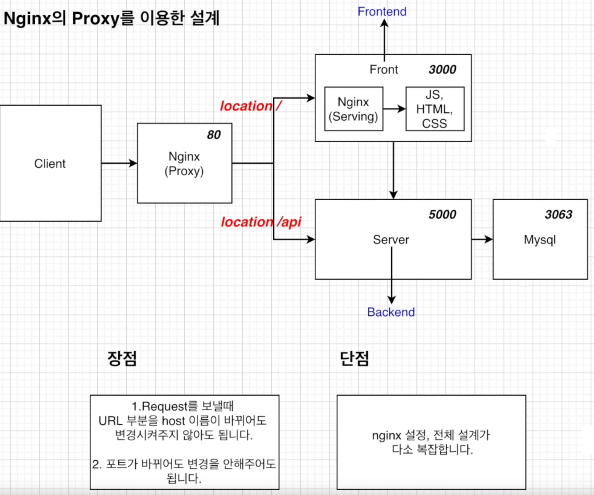

# Docker Proxy Layer for MySQL

## Proxy Layer의 필요성

---

- 외부(어플리케이션)에서 접속 시 3306포트의 MASTER DB가 에러가 발생했을 때, FailOver가 구현되어 SLAVE DB(3307)가 MASTER로 승격되더라도 3307포트로 자동으로 변경되지 않기 떄문에 사이에서 중재해줄 Layer가 필요합니다.
- ex>Nginx with Proxy
    
    
    
- ex)Nginx without Proxy
    
    
    

## 목표

---

- ProxySQL을 이용해 Proxy Layer를 구현합니다
- READ, WRITE작업을 수행하는 호스트그룹과 Read작업만 수행하는 호스트 그룹을 생성합니다
<!-- more -->
## ProxySQL 컨테이너 로드

---

1. ProxySQL 컨테이너에 매핑할 디렉터리를 생성합니다

    ```s
    mkdir -p /db/proxysql/data /db/proxysql/conf
    ```

2. 생성한 디렉터리에 접근 가능하도록 권한을 설정합니다
    
    ```s
    chmod 777 /db/proxysql /db/proxysql/data /db/proxysql/conf
    ```
    
3. conf 디렉터리에 다음과 같은 내용으로 설정파일(proxysql.cnf)을 생성합니다
    
    ```s
    vi /db/proxysql/conf/proxysql.cnf
    ```

    ```json
    datadir="/var/lib/proxysql"
    admin_variables=
    {
        admin_credentials="admin:admin;radmin:radmin"
        mysql_ifaces="0.0.0.0:6032"
    }
    mysql_variables=
    {
        threads=4
        max_connections=2048
        default_query_delay=0
        default_query_timeout=36000000
        have_compress=true
        poll_timeout=2000
        interfaces="0.0.0.0:6033"
        default_schema="information_schema"
        stacksize=1048576
        server_version="5.5.30"
        connect_timeout_server=3000
        monitor_username="monitor"
        monitor_password="monitor"
        monitor_history=600000
        monitor_connect_interval=60000
        monitor_ping_interval=10000
        monitor_read_only_interval=1500
        monitor_read_only_timeout=500
        ping_interval_server_msec=120000
        ping_timeout_server=500
        commands_stats=true
        sessions_sort=true
        connect_retries_on_failure=10
    }
    ```

4. 설정파일의 권한을 설정합니다

    ```s
    chmod 644 /db/proxysql/conf/proxysql.cnf
    ```

5. mybridge 네트워크에서 proxySQL 컨테이너를 실행합니다.

16032:6032 포트와 16033:6033 포트를 사용합니다

    ```s
    docker run -i -t --name proxysql -h proxysql --net mybridge --net-alias=proxysql -p 16032:6032 -p 16033:6033 -v /db/proxysql/data:/var/lib/proxysql -v /db/proxysql/conf/proxysql.cnf:/etc/proxysql.cnf -d proxysql/proxysql
    ```

6. 컨테이너가 잘 실행되었는지 확인해봅니다

    ```s
    docker ps --format "table {{.ID}}\t{{.Names}}\t{{.Status}}"
    ```

7. 컨테이너가 잘 실행되었습니다
    
    
    
8. MySQL을 이용해 proxySQL에 접근을 시도합니다

    ```s
    mysql -h 127.0.0.1 -P 16032 -uradmin -pradmin --prompt "ProxySQL Admin>"
    ```
    
9. MySQL 클라이언트가 없다면 설치 후 재시도 합니다
    
    ```s
    dnf install -y mysql
    ```

10. ProxySQL Admin에 잘 접속되었습니다
    
    
    

## ProxySQL의 역할 수행을 위한 세팅

---

### DB컨테이너 세팅

1. db001 컨테이너의 MySQL 서버에 접속합니다

    ```s
    docker exec -it -uroot db001 /bin/bash
    mysql -uroot -p
    ```

2. testdb 데이터베이스를 생성합니다

    ```sql
    CREATE DATABASE testdb DEFAULT CHARACTER SET utf8;
    ```

3. 어플리케이션용 user를 생성하고 db접근 권한을 부여합니다

    ```sql
    CREATE USER appuser@'%' IDENTIFIED BY 'apppass';
    GRANT SELECT, INSERT, UPDATE, DELETE ON testdb.* TO appuser@'%';
    ```
    
4. ProxySQL모니터용 user를 생성하고 권한을 부여합니다

    ```sql
    CREATE USER monitor@'%' IDENTIFIED BY 'monitor';
    GRANT REPLICATION CLIENT ON *.* TO monitor@'%';
    ```
    
5. 권한을 적용합니다

    ```s
    flush privileges;
    ```
    

### ProxySQL 설정(서버정보)

---

1. sql을 이용해 ProxySQL 컨테이너 접속

    ```s
    mysql -h 127.0.0.1 -P 16032 -uradmin -pradmin --prompt "ProxySQL Admin>"
    ```

2. hostgroup 10(쓰기 쿼리 그룹) 에 db001을 등록합니다

    ```sql
    INSERT INTO mysql_servers(hostgroup_id, hostname, port) VALUES (10, 'db001', 3306);
    ```
    
3. hostgroup 20(읽기 쿼리 그룹)에 모든 db를 등록합니다

    ```sql
    INSERT INTO mysql_servers(hostgroup_id, hostname, port) VALUES (20, 'db001', 3306);
    INSERT INTO mysql_servers(hostgroup_id, hostname, port) VALUES (20, 'db002', 3306);
    INSERT INTO mysql_servers(hostgroup_id, hostname, port) VALUES (20, 'db003', 3306);
    ```
    
4. SQL구문으로 설정 상태를 확인해볼 수 있습니다
    
    ```sql
    SELECT * FROM mysql-servers;
    ```

    
    
5. 그룹의 정보를 저장해줍니다
    
    값은 WRITE GROUP, READ GROUP, WRITE와 READ그룹을 구별하는 기준,'' 입니다

    ```sql
    INSERT INTO mysql_replication_hostgroups VALUES (10, 20, 'read_only', '');
    //(WRITE GROUP, READ GROUP, WRITE와 READ그룹을 구별하는 기준,'')
    ```

6. 마찬가지로 SQL로 설정을 확인할 수 있습니다

    ```sql
    SELECT * FROM mysql_replication_hostgroups;
    ```
        
    
    
7. 설정을 적용하고 저장합니다

    ```s
    LOAD MYSQL SERVERS TO RUNTIME;
    SAVE MYSQL SERVERS TO DISK;
    //설정된 정보를 반영
    //설정을 영구적으로 저장(디스크에 기록)
    ```


### ProxySQL 설정(USER 정보)

---

1. 어플리케이션은 DB서버가 아닌 ProxySQL에 접속하기 때문에 ProxySQL에서 세팅합니다
2. 어플리케이션용 USER 정보를 ProxySQL에 등록합니다

    ```sql
    INSERT INTO mysql_users(username, password, default_hostgroup, transaction_persistent)
    VALUES ('appuser', 'apppass', 10, 0);
    ```
    
3. 마찬가지로 설정을 적용하고 저장합니다
    
    ```s
    LOAD MYSQL SERVERS TO RUNTIME;
    SAVE MYSQL SERVERS TO DISK;
    ```


### ProxySQL 설정(쿼리 룰)

---

!!! warning
    💡 작업 순서를 반드시 지킬 것

</aside>

1. SELECT FOR UPDATE(쓰기) 구문 요청이 들어오면 10번 그룹으로 보냅니다 //쓰기 쿼리 룰

    ```sql
    INSERT INTO mysql_query_rules(rule_id, active, match_pattern, destination_hostgroup)
    VALUES (1, 1, '^SELECT.*FOR UPDATE$', 10);
    ```
    
2. SELECT 쿼리는 20번 호스트 그룹으로 보냅니다 //읽기 쿼리 룰

    ```sql
    INSERT INTO mysql_query_rules(rule_id, active, match_pattern, destination_hostgroup)
    VALUES (2, 1, '^SELECT', 20);
    ```

3. 저장합니다
        
    ```s
    LOAD MYSQL SERVERS TO RUNTIME;
    SAVE MYSQL SERVERS TO DISK;
    ```

4. ProxySQL컨테이너에서 빠져나옵니다

## 동작 테스트

---

1. 테스트용 스크립트를 생성합니다
2. proxySQL 서버의 IP를 확인합니다

    ```s
    docker inspect --format "{{.NetworkSettings.Networks.mybridge.IPAddress}}" proxysql
    ```

3. 16033포트로 접속해 select 구문을 실행하는

    ```s
    vi app_test_conn.sh
    ```

- app_test_conn.sh

    ```sh
    #!/bin/bash
    while true;
    do
        mysql -uappuser -papppass -h127.0.0.1 -P16033 -N -e "select @@hostname,now()" 2>&1| grep -v "Warning"
        sleep 1
    done
    ```

4. select 구문 스크립트를 실행합니다
    
    ```s
    sh app_test_conn.sh
    ```
        
5. 읽기 쿼리는 이쪽 저쪽 DB를 모두 쑤시고 다닙니다
    
    
    
6. 다음으로 db001컨테이너 SQL 서버에 접속합니다

    ```s
    docker exec -it -uroot db001 /bin/bash
    mysql -uroot -p
    ```
        
7. Insert 구문 테스트를 위해 기록용 테이블을 만들어줍니다

    ```sql
    USE testdb;
    CREATE TABLE insert_test(hostname varchar(15), insert_time datetime);
    ```

8. db001 컨테이너에서 빠져나옵니다
9. 16033포트로 접속해  insert 구문을 실행하는
 
    ```s
    vi app_test_insert.sh
    ```
 
 - app_test_insert.sh
 
    ```sh
    #!/bin/bash
    
    while true;
    do
    mysql -uappuser -papppass -h127.0.0.1 -P16033 -N -e "insert into testdb.insert_test select @@hostname,now()" 2>&1| grep -v "Warning"
    sleep 1
    done
    ```
    
10. insert 구문 스크립트를 실행합니다

    ```s
    sh app_test_insert.sh
    ```

11. 이 스크립트는 동작하고 있지만 화면에 실시간으로 표시되지 않습니다
12. db001에 접속하면 데이터가 잘 쓰여진 것을 확인할 수 있습니다(1초간격)
    
    
    

## FAIL-OVER TEST

---

1. 장애 상황에서 의도한대로 동작하는지 테스트 합니다
2. db001에 접속해 테이블 내용을 날려줍니다
 
    ```s
    docker exec -it -uroot db001 /bin/bash
    mysql -uroot -p
    ```
    
    ```sql
    TRUNCATE TABLE testdb.insert_test;
    ```
    
3. 다음 사진 처럼 두 개의 터미널을 준비하고 insert 스크립트 실행 도중 MasterDB에 장애를 일으킵니다
    
    
    
4. db001이 정지하자마자 스크립트에 에러 한 개 표시됩니다
    
    
    
5. 콘솔에서도 클러스터에서 분리된 것을 확인할 수 있습니다
    
    
    
6. Master로 전환된 db002의 SQL 서버에 접속합니다

    ```s
    docker exec -it -uroot db002 /bin/bash
    mysql -uroot -p
    ```

7. db001이 중지하고 14초 이후에 db002에 쓰기 트랜잭션이 박히는 모습을 확인할 수 있습니다!
    
    
    
8. 오케스트레이터가 다시 동작할 수 있도록 recovery를 ack 처리해줍니다
    
    
    
9. 원상 복구를 위해 db001을 다시 SLAVE로 가동합니다
        
    ```s
    docker start db001
    docker exec -it -uroot db001 /bin/bash
    mysql -uroot -p
    ```

    ```sql
    set global read_only=1;
    CHANGE MASTER TO MASTER_HOST='db002', MASTER_USER='repl', MASTER_PASSWORD='repl', MASTER_AUTO_POSITION=1;
    START SLAVE;
    ```
    
10. db001이 SLAVE로써 다시 클러스터로 복귀했습니다
    
    
    

