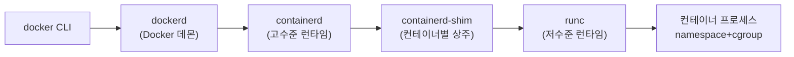

# 컨테이너 내부 구조 정리

<!-- more -->

## 컨테이너란
컨테이너(Container)란 호스트 커널을 그대로 공유하면서 namespace로 격리하고 cgroup으로 자원을 제한한 프로세스

- 격리(Isolation): namespace가 프로세스에 보이는 자원 범위를 분리
- 자원 제한(Resource Limit): cgroup이 CPU·메모리·IO 사용량에 상한 부여
- 이미지(Image): 애플리케이션과 의존성을 레이어(layer)로 묶은 읽기 전용 패키지
- 실행: 이미지를 풀어 rootfs를 만들고 격리된 프로세스로 기동
- 커널: 별도 게스트 커널 없이 호스트 커널을 그대로 사용

### VM과의 차이
가상머신은 게스트 OS와 커널을 통째로 얹고, 컨테이너는 커널을 공유한 프로세스 하나라는 점이 갈림

| 비교 항목 | 가상머신(VM) | 컨테이너 |
|-----------|--------------|----------|
| 격리 단위 | 게스트 OS 전체 | 프로세스 |
| 커널 | 게스트 커널 별도 | 호스트 커널 공유 |
| 기동 | 초 단위 부팅 | 즉시 기동 |
| 오버헤드 | OS 사본만큼 큼 | 프로세스 수준 |
| 이미지 크기 | GB 단위 | MB~수백MB |
| 격리 경계 | 하이퍼바이저 | 커널 namespace |
| 집적도 | 호스트당 수십 대 | 호스트당 수백~수천 개 |

---

## 격리 기술 정리
격리는 namespace, 자원 제한은 cgroup, 두 커널 기능이 컨테이너의 토대

### namespace 종류
프로세스가 보는 자원 종류마다 별도 namespace로 나뉘며, 커널 5.6부터 8종으로 확정

| namespace | CLONE 플래그 | 격리 대상 |
|-----------|--------------|-----------|
| Mount(mnt) | CLONE_NEWNS | 마운트 포인트·파일시스템 뷰 |
| PID | CLONE_NEWPID | 프로세스 ID 공간 |
| Network(net) | CLONE_NEWNET | 네트워크 장치·스택·포트 |
| IPC | CLONE_NEWIPC | System V IPC·POSIX 메시지 큐 |
| UTS | CLONE_NEWUTS | 호스트명·NIS 도메인명 |
| User | CLONE_NEWUSER | UID·GID 매핑 |
| Cgroup | CLONE_NEWCGROUP | cgroup 루트 디렉터리 뷰 |
| Time | CLONE_NEWTIME | boot·monotonic 시계 |

- Time namespace가 마지막으로 5.6(2020)에 합류해 8종 완성
- User namespace로 컨테이너 내부 root를 호스트 비특권 UID에 매핑 → 권한 격리 강화
- 런타임은 clone()·unshare()로 이 namespace들을 조합해 컨테이너 생성

### cgroup v1 vs v2
자원 제어 계층을 컨트롤러별로 흩어놓던 v1에서, 하나의 트리로 합친 v2로 이동

| 비교 항목 | cgroup v1 | cgroup v2 |
|-----------|-----------|-----------|
| 계층 구조 | 컨트롤러별 독립 계층 | 단일 통합 계층(unified hierarchy) |
| 프로세스 배치 | 임의 노드 가능 | 리프(leaf) cgroup에만 배치 |
| 컨트롤러 | 서브시스템별 분리 마운트 | cpu·io·memory·pids 통합 |
| 인터페이스 | 컨트롤러마다 상이 | min·low·high·max 일관 명명 |
| freezer | 별도 서브시스템 | cgroup.freeze로 통합 |
| 기본값 | 초기 배포판 기본 | 현재 최신 배포판·systemd 기본, unified_cgroup_hierarchy=0으로 v1 회귀 |

- 최신 배포판과 systemd는 v2를 기본으로 이동, RHEL 10은 v2 전용
- 쿠버네티스도 v2 기준으로 정렬 → 노드 커널·배포판 버전 확인 필요

---

## 런타임 계층 구조
docker 명령 한 줄이 실제 컨테이너 프로세스가 되기까지 여러 계층을 거침

| 계층 | 역할 |
|------|------|
| docker CLI | 사용자 명령 파싱 후 dockerd에 API 요청 |
| dockerd | 이미지 빌드·네트워크·볼륨 등 상위 기능, 실행은 containerd에 위임 |
| containerd | 이미지 pull·스냅샷·컨테이너 수명주기 관리(고수준 런타임) |
| containerd-shim | 컨테이너별 상주 프로세스, 데몬 재시작에도 컨테이너 유지 |
| runc | namespace·cgroup 세팅 후 컨테이너 프로세스 exec(저수준 런타임) |

### OCI 스펙
표준화 주체는 OCI(Open Container Initiative), 스펙 3종으로 계층 간 인터페이스를 규정

| 스펙 | 정의 대상 |
|------|-----------|
| image-spec | 이미지 매니페스트·레이어·config 포맷 |
| runtime-spec | 디스크에 푼 filesystem bundle 실행 방식 |
| distribution-spec | 레지스트리 이미지 배포 API |

- runc는 runtime-spec의 참조 구현(reference implementation), 1.0.0은 2021-06-22 릴리스
- containerd는 직접 실행하지 않고 OCI bundle을 만들어 runc·kata에 위임
- 흐름: 이미지 pull → snapshotter로 레이어 언팩 → OCI bundle 생성 → runc가 컨테이너 생성

---

## Docker vs containerd 차이점
Docker는 빌드·CLI·API까지 포함한 상위 플랫폼, containerd는 그 안에 든 코어 런타임

| 비교 항목 | Docker | containerd |
|-----------|--------|------------|
| 범위 | 빌드·CLI·네트워크·볼륨·API 포함 플랫폼 | 이미지·컨테이너 수명주기 중심 코어 런타임 |
| 계층 | containerd를 내부에 포함(상위) | Docker·k8s가 호출하는 하위 런타임 |
| CRI 지원 | 자체 미구현(dockershim 필요) | CRI 플러그인 내장(containerd 1.1+) |
| k8s 위치 | 1.24부터 kubelet 직접 미지원 | kubelet이 CRI로 직접 호출 |
| 데몬 | dockerd | containerd(+shim) |
| 기본 CLI | docker | ctr(디버깅)·nerdctl(docker 호환) |
| 이미지 | OCI 이미지 | 동일 OCI 이미지(호환) |

### dockershim 제거
Docker Engine이 CRI를 구현하지 않아 kubelet에 붙이던 어댑터가 dockershim, 이 어댑터가 1.24에서 제거됨

| 항목 | 내용 |
|------|------|
| 배경 | Docker Engine이 CRI 미구현 → kubelet에 dockershim 어댑터 필요 |
| deprecated | 쿠버네티스 1.20(2020)에서 사용 중단 예고 |
| 제거 | 1.24(2022, Stargazer)에서 dockershim 제거 |
| 대안 | containerd·CRI-O 직접 사용, 또는 cri-dockerd 어댑터로 Docker Engine 유지 |
| 오해 | "Docker 이미지 못 쓴다"가 아님 → 이미지는 OCI 표준이라 그대로 동작 |

### 도구 정리
같은 containerd를 두고도 목적별로 CLI가 갈리며, k8s 노드 디버깅은 crictl이 표준

| 도구 | 커뮤니티 | 용도 |
|------|----------|------|
| docker | Docker | dockerd 대상 종합 CLI |
| ctr | containerd | containerd 직접 제어·디버깅, 기능 최소 |
| nerdctl | containerd | docker 호환 명령, compose·rootless 지원 |
| crictl | Kubernetes | CRI 런타임(containerd·CRI-O) 공통 디버깅, Pod 단위 조회 |

---

## 이미지와 스토리지
이미지는 읽기 전용 레이어 스택, 컨테이너는 그 위에 쓰기 레이어를 얹은 상태

- 레이어: Dockerfile 명령 단위로 나뉜 읽기 전용 tar, 해시로 식별·재사용
- 공유: 여러 이미지가 동일 하위 레이어를 공유 → 저장·전송량 절감
- overlayfs: 읽기 전용 레이어 위에 쓰기 레이어를 겹쳐 단일 뷰로 제공하는 유니온 파일시스템
- copy-on-write: 하위 레이어 파일 수정 시 upperdir로 복사 후 변경 → 원본 레이어 불변
- 컨테이너 삭제: upperdir(쓰기 레이어)만 사라지고 이미지 레이어는 보존

| overlayfs 구성 | 역할 |
|----------------|------|
| lowerdir | 이미지 레이어(읽기 전용), 여러 겹 가능 |
| upperdir | 컨테이너 쓰기 레이어(변경분 저장) |
| merged | lower+upper 병합 뷰, 컨테이너가 보는 rootfs |
| workdir | overlay 내부 원자적 작업용 디렉터리 |

### 이미지 구성
OCI 이미지는 매니페스트(manifest)가 config와 레이어 blob을 다이제스트로 참조하는 구조

| 구성 | 역할 |
|------|------|
| manifest | config·레이어 목록과 다이제스트(digest) 참조 |
| config | 엔트리포인트·env·레이어 순서 등 실행 메타데이터 |
| layer blob | 파일시스템 변경분을 담은 tar 아카이브 |
| index | 멀티 아키텍처용 매니페스트 목록(선택) |

- 다이제스트: 콘텐츠 해시(sha256)로 식별 → 같은 레이어는 레지스트리·노드에서 한 번만 저장
- 태그(tag)는 매니페스트를 가리키는 가변 포인터, 실제 무결성은 다이제스트가 보장

---

## 런타임 선택지
저수준 런타임은 OCI runtime-spec만 지키면 교체 가능, 격리 강도와 성능이 트레이드오프

| 런타임 | 격리 방식 | 특징 |
|--------|-----------|------|
| runc | namespace+cgroup(호스트 커널 공유) | OCI 참조 구현, 오버헤드 최소·기본값 |
| gVisor | 유저스페이스 커널(Sentry)로 시스템콜 가로채기 | 격리 강함, 시스템콜·IO 오버헤드 큼 |
| Kata Containers | 경량 VM(하이퍼바이저 KVM) per Pod | 커널 분리로 격리 최상, Pod당 130~200MB·기동 지연 가산 |

- runc는 커널을 공유하므로 커널 취약점이 곧 탈출 경로 → 격리 강화가 필요하면 gVisor·Kata 선택
- 런타임 교체는 쿠버네티스 RuntimeClass로 워크로드별 지정 가능

---

### 참고
- Linux namespaces (man7): https://man7.org/linux/man-pages/man7/namespaces.7.html
- Dockershim Removal FAQ (Kubernetes): https://kubernetes.io/blog/2022/02/17/dockershim-faq/
- About the OCI (opencontainers.org): https://opencontainers.org/about/overview/

---

## 결론
- 컨테이너는 namespace(격리)·cgroup(제한)·레이어 이미지로 조합한 격리 프로세스
- docker CLI→dockerd→containerd→shim→runc 계층을 거쳐 실제 프로세스가 됨
- 쿠버네티스는 1.24에서 dockershim을 제거 → containerd가 CRI로 kubelet에 직결
- Docker는 "빌드까지 포함한 상위 플랫폼", containerd는 "그 안의 코어 런타임"으로 이해하면 됌
