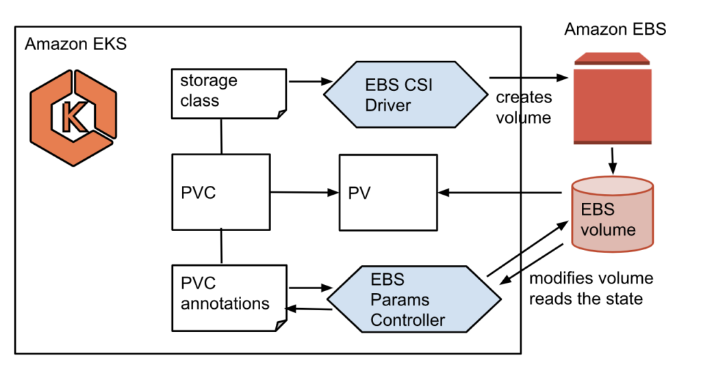
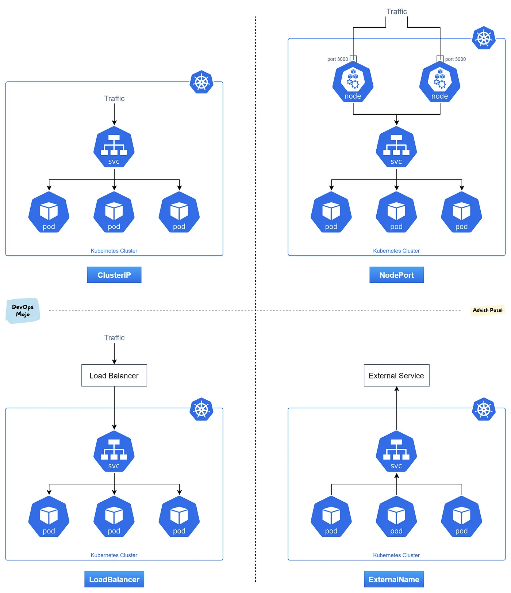
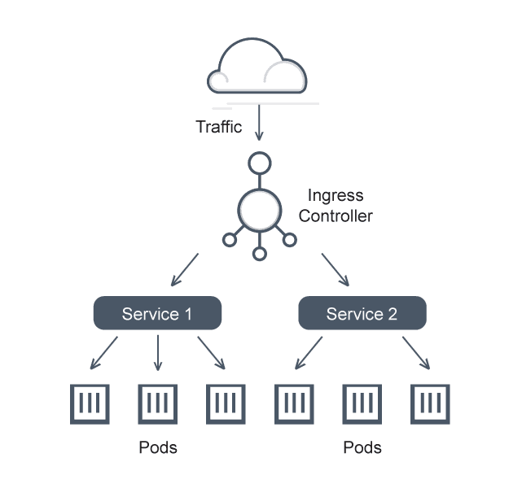

# Database on Kubernetes study / Week 1
---
## 목표
1. Kubectl 명령의 흐름
2. CSI
3. PV/PVC
4. CNI
5. Sercice
6. ExternalDNS
7. CoreDNS
8. StatefulSet / HeadlessService
<!-- more -->

---
## 실습
1. Kubectl 명령의 흐름
     
    출처: https://devocean.sk.com/blog/techBoardDetail.do?ID=163578 
    AWS EKS cluter 구축 시 Contorl plane은 무조건 AWS에서 관리하는 VPC에 provisioning되며, worker node만 사용자의 VPC에 구성된다. 
    참고: Control plane의 앞단에는 무조건 ALB가 아닌 NLB가 배포된다.
     
    클러스터 관리자가 Kubectl을 이용해 베포 명령 시 아래와 같은 순서로 명령어가 전달된다. 
    1. Kubectl은 kubeconfig에 저장된 인증 정보를 로드한다.
    2. Kubectl명령은 AWS에서 관리하는 NLB에 도달한다.
    3. NLB 뒷단에 배치된 Control plane의 API Server에 명령이 전달된다.
    4. API Server는 변경사항을 etcd에 기록합니다.
    5. controller manager는 변경사항을 감지하고 desired state를 유지하기 위해 각종 컨트롤러(Node, Replication, Endpoint, Service Account, Namespace 등)를 동작시킵니다.
    6. Scheduler는 새로운 pod가 위치할 적절한 노드를 예약합니다.
    7. Scheduler가 노드에 pod를 할당하면 kubelet이 감지하고 pod배포를 진행합니다.
    8. kubelet은 CRI -> container runtime을 이용해 pod배포를 진행합니다.
2. CSI
    1. CSI를 사용하는 이유: Kubernetes 프로젝트 소스 코드에 있는 Kubernetes ‘in-tree’ 스토리지 드라이버 드라이버를 대체합니다. [출처](https://docs.aws.amazon.com/ko_kr/eks/latest/userguide/ebs-csi-migration-faq.html)
    2. AWS EKS사용 시 CSI를 사용하는 이유: CSI를 사용하면 EBS, EFS, FSx for Lustre 등 AWS의 다양한 스토리지 서비스를 EKS cluster에 쉽게 통합할 수 있습니다. 또한 pod의 볼륨을 동적으로 provisioning할 수 있습니다.
3. PV/PVC
      1. EKS+CSI+PV architecture  
      출처: https://itnext.io/amazon-eks-add-ons-a-curated-set-of-software-for-managing-your-kubernetes-clusters-bca8f620d55e
      2. PV: EBS, EFS등 Storage를 클러스터 리소스로 표현한 것입니다. Storage가 어떤 시스템에 위치하고 있는지, 어떻게 접근할 수 있는지, 용량의 크기나 등의 정보를 포함합니다.
      3. PVC: PV와 PVC는 1:1로 바인딩 할 수 있으며 PV는 실제 스토리지를, PVC는 스토리지 요청 후 수령한 PV를 사용할 수 있는 티켓/토큰으로 비유할 수 있습니다.
4. CNI
      1. AWS에서 VPC CNI를 제공함으로 EKS는 이를 pod의 네트워크 통신을 지원합니다(동일 노드 내 pod, 다른 노드간의 pod, 외부 트래픽과 pod, AWS 서비스와 pod 등)
      2. pod에 IP를 할당해주는 원리입니다. 이때 VPC CNI의 경우 pod와 worker node의 네트워크 대역이 동일하기 때문에 pod<->worker node간에 별도의 network overlay나 NAT GW없이 직접 통신이 가능합니다.(VPC CIDR의 IP를 pod에 직접 할당)
5. Service
    Kubernetes Service 종류
     
    출처: https://medium.com/devops-mojo/kubernetes-service-types-overview-introduction-to-k8s-service-types-what-are-types-of-kubernetes-services-ea6db72c3f8c

    | Service       | 설명                                  |
    | ------------- | ------------------------------------ |
    | ClusterIP     | Service에 대한 내부 IP(cluster내에서만 접근 가능)를 제공합니다. 외부에서는 이 Service에 직접 접근할 수 없습니다. |
    | NodePort      | 특정 Pod에 노드의 port를 매핑합니다. |
    | LoadBalancer  | AWS 에서 제공하는 Load Balancer를 사용하여 특정 서비스에 외부 트래픽을 라우팅 합니다. NodePort와 ClusterIP Service를 자동으로 생성하여 통합합니다.|
    | External      | Service를 CNAME 레코드에 매핑하여 외부 서비스에 리다이렉트합니다. |

6. Ingress
     
    출처: https://avinetworks.com/glossary/kubernetes-ingress-services/
    1. Ingress는 Cluster 내의 Service에 대한 HTTP와 HTTPS 트래픽을 라우팅하는 규칙을 정의합니다.
    2. Kubernetes에서 Ingress를 사용하려면 Ingress Controller (nginx, HAProxy 등)가 필요합니다.
    3. LoadBalancer Service는 간단한 외부 트래픽 라우팅에 사용되는 반면, Ingress는 복잡한 HTTP/HTTPS 트래픽 라우팅 규칙 및 기능을 제공합니다. 대부분 Ingress는 LoadBalancer Service 뒤에 위치하여, 외부에서의 접근을 LoadBalancer를 통해 받고, 그 트래픽을 Ingress 규칙에 따라 Service로 라우팅합니다.
7. ExternalDNS
    1. AWS Route53과 같은 CSP의 DNS서비스와 연결되어 Kubernetes 리소스와 연결된 도메인 이름의 DNS 기록을 자동으로 생성하거나 업데이트합니다.
    2. Service나 Ingress를 배포할 때 해당 리소스에 연결된 도메인 이름의 DNS 기록을 자동으로 생성하거나 업데이트 할 수 있습니다.
8. CoreDNS
    1.  Kubernetes cluter 내부의 DNS 서비스를 제공하며 service discovery나 pod의 DNS resolver로 사용할 수 있습니다.
    2.  pod가 kubernetes cluser내 다른 서비스에 연결할 때 서비스의 DNS 이름을 사용하여 CoreDNS에 위치를 요청(DNS Query)하고 IP를 알아낼 수 있습니다.

