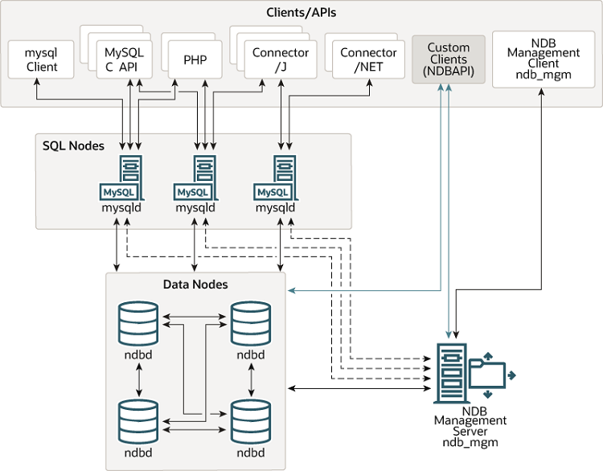
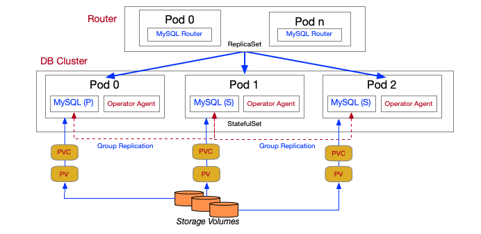

# Database on Kubernetes study / Week 2
---
!!! Warning ""
    스터디 커리큘럼, 강의 및 스크립트를 [Cloudnet@](http://gasidaseo.notion.site/gasidaseo/CloudNet-Blog-c9dfa44a27ff431dafdd2edacc8a1863)팀의 가시다님께서 제공해주셨습니다.항상 감사드립니다.

## 목차
1. Kubernetes operator
2. MySQL 구성
3. MySQL Operator for Kubernetes
4. MySQL Operator for Kubernetes 배포
5. 테스트를 위한 Wordpress 배포
6. 장애 테스트
7. Scaling 테스트
8. MySQL 백업 및 복구

<!-- more -->

---
## 실습
### Kubernetes Operator
1. Kubernetes(이하 k8s)의 operator는 3가지 요소로 구성되어 있다.<br><br>출처: [betterprogramming.pub](https://betterprogramming.pub/write-tests-for-your-kubernetes-operator-d3d6a9530840)
2. CRD: Custom Resource Definition<br> operator를 사용하기 위해 먼저 k8s API를 확장하여 새로운 리소스 유형을 정의하는 CRD는 YAML형식의 파일로 새로운 Object의 Scheme를 정의한다.
3. CR: Custom Resource<br> 앞서 정의한 CRD를 기반으로 생성할 수 있는 custom object로, 어플리케이션 상태, 구성, metadata를 저장하는데 사용한다. 당연히 YAML이다.
4. Operator Controller<br> Operator의 로직을 담고 있는 컴포넌트이고, k8s api server와 직접 통신하여 CR의 상태를 감지하다가 생성, 업데이트, 삭제 등 실제 작업을 수행한다.
### MySQL 구성
1. MySQL구성은 Primary-Secondary구성과 NDB Cluster, InnoDB Cluster를 사용할 수 있다.
2. MySQL Primary Secondary replication
    1. Primary: 모든 쓰기(INSERT, UPDATE, DELETE) 작업을 처리하고, 데이터 변경이 발생하면 변경사항을 바이너리 로그에 기록한다.
    2. Secondary: Primary 서버에서 발생한 변경사항을 복제하여 동기화하며, 읽기전용 복제본을 제공함으로써 읽기 작업에 대한 부하를 분산시켜준다.
    3. replication: Primary의 바이너리 로그에서 변경사항을 읽고 Secondary 이를 재실행하여 데이터를 동기화한다.
3. MySQL NDB Cluster
    <br> 출처: [dev.mysql.com](https://dev.mysql.com/doc/refman/8.0/en/mysql-cluster-overview.html)
    1. 구성요소
        1. Data Node: 실제 데이터를 저장하며는 Data node는 여러 노드로 분산되어 있어 HA를 제공하고 Scale-Out이 가능하다.
        2. SQL Node: 클라이언트의 SQL 요청을 처리하며, 데이터를 Data Node에서 읽고 쓴다.
        3. Management Node: 클러스터의 구성과 상태를 관리하며, Data Node와 SQL Node의 연결을 관리한다
    2. 특징
        1. NDB Cluster는 빠른 읽기/쓰기와 Scaling 용이성에 초점을 맞추고 있다.
        2. NDB (Network Database) 스토리지 엔진을 사용한다.
        3. 데이터는 여러 Data Node에 자동으로 분산되어 저장된다.
        4. 데이터는 주로 메모리에 저장되며, 디스크에도 백업된다.
        5. 메모리 기반 스토리지와 데이터 분산으로 인해 높은 읽기/쓰기 성능을 제공한다.
        6. 데이터는 자동으로 샤딩되어 여러 노드에 분산된다.
        7. NDB Cluster의 설정과 관리는 복잡하다.
### MySQL InnoDB Cluster
<br>MySQL with k8s operator (Primary-Secondary)상세 구조 / 출처: [dev.mysql.com](https://dev.mysql.com/doc/mysql-operator/en/mysql-operator-introduction.html)<br>
#### 구성요소
1. MySQL Server Pod: InnoDB storage engine을 사용하는 MySQL pod는 서로 데이터를 복제하고 클라이언트의 읽기와 쓰기 요청을 처리한다.
2. Group Replication: MySQL Group Replication은 MySQL pod들 사이에서 데이터를 동기화하는 역할을 수행하고 데이터의 일관성과 가용성을 유지하며 특정 pod가 실패하더라도 클러스터가 동작할 수 있게 유지한다.
3. MySQL Router: 클라이언트 요청을 적절한 MySQL pod로 라우팅하는 역할을 하여 read request를 로드 밸런싱하고 write request를 적절한 pod 전달하여 클러스터의 가용성을 향상시킨다.
4. MySQL Shell: 클러스터의 구성과 관리를 수행하는 도구로 사용자는 MySQL Shell을 통해 클러스터의 상태를 모니터링 및 구성 변경을 수행할 수 있다.
#### 특징
1. InnoDB Cluster는 쉬운 설정과 높은 데이터 일관성에 초점을 맞추고 있다.
2. InnoDB 스토리지 엔진을 사용한다.
3. 데이터는 MySQL Group Replication을 통해 서버 인스턴스(pod)간에 복제된다.
4. 데이터는 주로 디스크에 저장된다.
5. 동기식 복제와 트랜잭션 일관성을 통해 높은 데이터 일관성을 제공한다.
6. InnoDB Cluster는 설정과 관리가 간편하다.
### MySQL Operator for Kubernetes
<br>MySQL with k8s operator / 출처: [ronekins.com](https://ronekins.com/2021/08/31/getting-started-with-the-oracle-mysql-kubernetes-operator-and-portworx/)
#### k8s에 MySQL cluster배포 시 operator를 사용하는 이유
1. 복잡한 MySQL Cluster 구성을 간편하게 YAML 파일로 정의 하고 kubectl apply 명령으로 "쉽게 배포할 수 있다".
2. Cluster의 Life cycle를 관리하며 백업, 복구, 업그레이드, 스케일링과 같은 "운영 작업을 자동화"한다.
3. Node가 실패했을 때 자동으로 복구하고 필요에 따라 새 인스턴스를 생성하여 "서비스의 중단을 최소화"한다.(고가용성 확보)
4. Cluster의 상태를 모니터링하고, 문제가 발생하면 "자동으로 복구 작업을 수행"할 수 있다.
5. Cluster에 Node를 추가하거나 제거하는 작업을 자동화하여 "scaling을 쉽게 진행"할 수 있다.
### MySQL InnoDB cluster & Operator Kubernetes 배포
#### MySQL Operator 배포 with Helm [Chart](https://artifacthub.io/packages/helm/mysql-operator/mysql-operator)
```sh 
# Repo 추가
helm repo add mysql-operator https://mysql.github.io/mysql-operator/
helm repo update

# MySQL operator 설치 
helm install mysql-operator mysql-operator/mysql-operator --namespace mysql-operator --create-namespace --version 2.0.12
helm get manifest mysql-operator -n mysql-operator
```

```sh
# 설치 확인
kubectl get deploy,pod -n mysql-operator
```

```sh

# CRD 확인
kubectl get crd | egrep 'mysql|zalando'
```

```sh

## (참고) CRD 상세 정보 확인
kubectl describe crd innodbclusters.mysql.oracle.com

# (참고) 삭제
helm uninstall mysql-operator -n mysql-operator && kubectl delete ns mysql-operator
```
#### MySQL InnoDB Cluster 배포
```sh
# (참고) Helm Chart Default Values 확인
helm show values mysql-operator/mysql-innodbcluster

# 파라미터 파일 생성
cat <<EOT> mycnf-values.yaml
credentials:
  root:
    password: sakila
serverConfig:
  mycnf: |
    [mysqld]
     max_connections=300
     default_authentication_plugin=mysql_native_password
tls:
  useSelfSigned: true
EOT
```
<br>
계속 에러나길래 뭔가했는데 복붙 과정에서 인덴트가 망가졌던 것..<br>
<br>
인덴트 수정 후 배포 완료
```sh

# 차트 설치(기본값) : root 사용자(root), 호스트(%), 서버인스턴스(파드 3개), 라우터인스턴스(파드 1개), serverVersion(8.0.35)
# root 사용자 암호(sakila), tls.useSelfSigned(사용), 네임스페이스 생성 및 적용(mysql-cluster)
helm install mycluster mysql-operator/mysql-innodbcluster --namespace mysql-cluster --version 2.0.12 -f mycnf-values.yaml --create-namespace
helm get values mycluster -n mysql-cluster
helm get manifest mycluster -n mysql-cluster

# PV는 특정 namespace에 종속되지 않으므로 아래 명령에 보이지 않음
watch kubectl get innodbcluster,sts,pod,pvc,svc -n mysql-cluster

# 설치 확인
kubectl get innodbcluster,sts,pod,pvc,svc,pdb,all -n mysql-cluster
kubectl df-pv
kubectl resource-capacity

## MySQL InnoDB Cluster 구성요소 확인
kubectl get InnoDBCluster -n mysql-cluster
NAME        STATUS   ONLINE   INSTANCES   ROUTERS   AGE
mycluster   ONLINE   3        3           1         6m20s
```
<br>
k9s로 확인해본 결과 pod가 잘 올라오지 않는다<br>
<br>
Namespace확인하고 k describe pod <pod> 로 이벤트를 확인한다<br>
<br>
뭔가 잘 안되고 있다
<br>
operator도 로그를 확인해본다
<br>
`kubectl describe pod mycluster-0 -n mysql-cluster` 명령 결과 PV 바인딩이 제대로 동작하지 않는것을 확인했다.<br>
<br>
PV가 30분 넘게 pending 상태이다😥. SCP정책에 걸린 것 같아 다른 AWS 계정을 사용해보기로 했다.<br>

```sh
## 이벤트 확인
kubectl describe innodbcluster -n mysql-cluster | grep Events: -A30
...(생략)...

## MySQL InnoDB Cluster 초기 설정 확인
kubectl get configmap -n mysql-cluster mycluster-initconf -o json | jq -r '.data["my.cnf.in"]'
kubectl get configmap -n mysql-cluster mycluster-initconf -o yaml | yh
kubectl describe configmap -n mysql-cluster mycluster-initconf
...(생략)...
01-group_replication.cnf:
----
# GR and replication related options
# Do not edit.
[mysqld]
log_bin=mycluster
enforce_gtid_consistency=ON
gtid_mode=ON                    # 그룹 복제 모드 사용을 위해서 GTID 활성화
relay_log_info_repository=TABLE # 복제 메타데이터는 데이터 일관성을 위해 릴레이로그를 파일이 아닌 테이블에 저장
skip_slave_start=1
...(생략)...

99-extra.cnf:
----
# Additional user configurations taken from spec.mycnf in InnoDBCluster.
# Do not edit directly.
[mysqld]
max_connections=300            # max_connections default 기본값은 151
default_authentication_plugin=mysql_native_password
...(생략)...

## 서버인스턴스 확인(스테이트풀셋) : 3개의 노드에 각각 파드 생성 확인, 사이드카 컨테이너 배포
kubectl get sts -n mysql-cluster; echo; kubectl get pod -n mysql-cluster -l app.kubernetes.io/component=database -owide

## 프로브 확인(Readiness, Liveness, Startup)
kubectl describe pod -n mysql-cluster mycluster-0 | egrep 'Liveness|Readiness:|Startup'

## 서버인스턴스가 사용하는 PV(PVC) 확인 : AWS EBS 볼륨 확인해보기
kubectl get sc
kubectl df-pv
kubectl get pvc,pv -n mysql-cluster

## 서버인스턴스 각각 접속을 위한 헤드리스 Headless 서비스 확인
kubectl describe svc -n mysql-cluster mycluster-instances
...(생략)...

kubectl get svc,ep -n mysql-cluster mycluster-instances
NAME                  TYPE        CLUSTER-IP   EXTERNAL-IP   PORT(S)                        AGE
mycluster-instances   ClusterIP   None         <none>        3306/TCP,33060/TCP,33061/TCP   19m

## 라우터인스턴스(디플로이먼트) 확인  : 1대의 파드 생성 확인
kubectl get deploy -n mysql-cluster;kubectl get pod -n mysql-cluster -l app.kubernetes.io/component=router

## 라우터인스턴스 접속을 위한 서비스(ClusterIP) 확인
kubectl get svc,ep -n mysql-cluster mycluster

# max_connections 설정 값 확인 : MySQL 라우터를 통한 MySQL 파드 접속 >> Helm 차트 설치 시 파라미터러 기본값(151 -> 300)을 변경함
MIC=mycluster.mysql-cluster.svc.cluster.local
echo "export MIC=mycluster.mysql-cluster.svc.cluster.local" >> /etc/profile
kubectl exec -it -n mysql-operator deploy/mysql-operator -- mysqlsh mysqlx://root@$MIC --password=sakila --sqlx --execute="SHOW VARIABLES LIKE 'max_connections';"

# (참고) 삭제
helm uninstall mycluster -n mysql-cluster && kubectl delete ns mysql-cluster
```
#### MySQL 접속(Headless 서비스 주소로 개별 MySQL pod로 직접 접속)
```sh
# MySQL 라우터 접속을 위한 서비스 정보 확인 : 실습 환경은 Cluster-IP Type
kubectl get svc -n mysql-cluster mycluster

# MySQL 서버(파드) 접속을 위한 서비스 정보 확인 : Headless 서비스
kubectl get svc -n mysql-cluster mycluster-instances
kubectl get pod -n mysql-cluster -l app.kubernetes.io/component=database -owide

# netshoot 파드에 zsh 접속해서 DNS 쿼리 수행
kubectl run -it --rm netdebug --image=nicolaka/netshoot --restart=Never -- zsh
-------
# dig 툴로 도메인 질의 : <서비스명>.<네임스페이스>.svc 혹은 <서비스명>.<네임스페이스>.svc.cluster.local
# 아래 도메인 주소로 접근 시 MySQL 라우터를 통해서 MySQL 서버(파드)로 접속됨
dig mycluster.mysql-cluster.svc +search +short
dig mycluster.mysql-cluster.svc.cluster.local +search +short

# Headless 서비스 주소로 개별 MySQL 서버(파드)로 직접 접속을 위한 DNS 쿼리
dig mycluster-instances.mysql-cluster.svc +search
dig mycluster-instances.mysql-cluster.svc.cluster.local +short

# MySQL 서버(파드)마다 고유한 SRV 레코드가 있고, 해당 도메인 주소로 접속 시 MySQL 라우터를 경유하지 않고 지정된 MySQL 서버(파드)로 접속됨
dig mycluster-instances.mysql-cluster.svc.cluster.local SRV
..(생략)...
;; ADDITIONAL SECTION:
mycluster-2.mycluster-instances.mysql-cluster.svc.cluster.local. 30 IN A 172.16.1.11
mycluster-0.mycluster-instances.mysql-cluster.svc.cluster.local. 30 IN A 172.16.3.14
mycluster-1.mycluster-instances.mysql-cluster.svc.cluster.local. 30 IN A 172.16.2.12

# zsh 빠져나오기
exit
-------

# 접속 주소 변수 지정
MIC=mycluster.mysql-cluster.svc.cluster.local
MDB1=mycluster-0.mycluster-instances.mysql-cluster.svc.cluster.local
MDB2=mycluster-1.mycluster-instances.mysql-cluster.svc.cluster.local
MDB3=mycluster-2.mycluster-instances.mysql-cluster.svc.cluster.local

# MySQL 라우터를 통한 MySQL 파드 접속
#kubectl exec -it -n mysql-operator deploy/mysql-operator -- mysqlsh mysqlx://root@$MIC --password=sakila
kubectl exec -it -n mysql-operator deploy/mysql-operator -- mysqlsh mysqlx://root@$MIC --password=sakila --sqlx --execute='show databases;'
...(생략)...

kubectl exec -it -n mysql-operator deploy/mysql-operator -- mysqlsh mysqlx://root@$MIC --password=sakila --sqlx --execute="SHOW VARIABLES LIKE 'max_connections';"
Variable_name	Value
max_connections	151

# 개별 MySQL 파드 접속 : 헤드리스 서비스
kubectl exec -it -n mysql-operator deploy/mysql-operator -- mysqlsh mysqlx://root@$MDB1 --password=sakila --sqlx --execute='SELECT @@hostname;'
mycluster-0

kubectl exec -it -n mysql-operator deploy/mysql-operator -- mysqlsh mysqlx://root@$MDB2 --password=sakila --sqlx --execute='SELECT @@hostname;'
mycluster-1

kubectl exec -it -n mysql-operator deploy/mysql-operator -- mysqlsh mysqlx://root@$MDB3 --password=sakila --sqlx --execute='SELECT @@hostname;'
mycluster-2
```
#### MySQL Shell 8.x 를 통한 연결
```sh
# MySQL Shell 은 mysql-operator 파드나 서버인스턴스(사이드카 컨테이너)에 포함되어 있어서 바로 사용 가능
# (참고) kubectl run --rm -it myshell --image=mysql/mysql-operator -- mysqlsh
kubectl exec -it -n mysql-operator deploy/mysql-operator -- mysqlsh

## MySQL InnoDB Cluster 접속 : 라우터인스턴스의 도메인주소로 접속
MySQL  JS > \connect root@mycluster.mysql-cluster.svc
Creating a session to 'root@mycluster.mysql-cluster.svc'
Please provide the password for 'root@mycluster.mysql-cluster.svc': ******  # 암호입력 sakila

## MySQL InnoDB Cluster 상태 확인 : JavaScript 모드
MySQL  mycluster.mysql-cluster.svc:33060+ ssl  JS > \status
MySQL Shell version 8.1.0

Connection Id:                1656
Default schema:               
Current schema:               
Current user:                 root@ip-192-168-2-187.ap-northeast-2.compute.internal
SSL:                          Cipher in use: TLS_AES_256_GCM_SHA384 TLSv1.3
Using delimiter:              ;
Server version:               8.1.0 MySQL Community Server - GPL
Protocol version:             X protocol
Client library:               8.1.0
Connection:                   mycluster.mysql-cluster.svc via TCP/IP
TCP port:                     33060
Server characterset:          utf8mb4
Schema characterset:          utf8mb4
Client characterset:          utf8mb4
Conn. characterset:           utf8mb4
Result characterset:          utf8mb4
Compression:                  Disabled
Uptime:                       10 min 32.0000 sec

## SQL 모드로 전환
MySQL  mycluster.mysql-cluster.svc:33060+ ssl  JS > \sql
Switching to SQL mode... Commands end with ;

## Python 모드로 전환
MySQL  mycluster.mysql-cluster.svc:33060+ ssl  SQL > \py
Switching to Python mode...

## MySQL Shell 종료
MySQL  mycluster.mysql-cluster.svc:33060+ ssl  Py > \exit
Bye!
```
#### 샘플 대용량 데이터베이스 주입 [test-db 링크](https://github.com/datacharmer/test_db)
```sh
# [터미널1] 포트 포워딩
kubectl -n mysql-cluster port-forward service/mycluster mysql
Forwarding from 127.0.0.1:3306 -> 6446
Forwarding from [::1]:3306 -> 6446

# [터미널2] 아래부터는 터미널2에서 입력
------------------------------
# 포트 포워드 확인
ss -tnlp | grep kubectl
LISTEN 0      128        127.0.0.1:3306       0.0.0.0:*    users:(("kubectl",pid=16778,fd=8))   
LISTEN 0      128            [::1]:3306          [::]:*    users:(("kubectl",pid=16778,fd=9))

# 샘플 데이터베이스 git clone
git clone https://github.com/datacharmer/test_db && cd test_db/

# 마스터 노드에 mariadb-client 툴 설치
yum install mariadb -y
mysql -h127.0.0.1 -P3306 -uroot -psakila -e "SELECT @@hostname;"

# To import the data into your MySQL instance, load the data through the mysql command-line tool: 1분 10초 정도 소요
mysql -h127.0.0.1 -P3306 -uroot -psakila -t < employees.sql

# 확인
mysql -h127.0.0.1 -P3306 -uroot -psakila -e "SHOW DATABASES;"
mysql -h127.0.0.1 -P3306 -uroot -psakila -e "USE employees;SELECT * FROM employees;"
mysql -h127.0.0.1 -P3306 -uroot -psakila -e "USE employees;SELECT * FROM employees LIMIT 10;"

# 각각 헤드리스 서비스 주소로 각각의 mysql 파드로 접속하여 데이터 조회 확인 : 대용량 데이터 복제가 잘 되었는지 확인해보기!
kubectl exec -it -n mysql-operator deploy/mysql-operator -- mysqlsh mysqlx://root@$MDB1 --password=sakila --sqlx --execute="USE employees;SELECT * FROM employees LIMIT 5;"
kubectl exec -it -n mysql-operator deploy/mysql-operator -- mysqlsh mysqlx://root@$MDB2 --password=sakila --sqlx --execute="USE employees;SELECT * FROM employees LIMIT 5;"
kubectl exec -it -n mysql-operator deploy/mysql-operator -- mysqlsh mysqlx://root@$MDB3 --password=sakila --sqlx --execute="USE employees;SELECT * FROM employees LIMIT 5;"
```
#### MySQL InnoDB Cluster 상세 정보 : MySQL Shell 의 SQL 모드 & 모드 변경
```sh
# 접속
MIC=mycluster.mysql-cluster.svc.cluster.local
kubectl exec -it -n mysql-operator deploy/mysql-operator -- mysqlsh mysqlx://root@$MIC --password=sakila --sqlx
------------------------

# 데이터베이스 확인
SQL > show databases;

# PERSIST 설정된 시스템 변수 확인
SQL > SELECT * FROM performance_schema.persisted_variables;
+----------------------------------------------------+-------------------------------------------------------------------------------------------------------------------------------------------+
| VARIABLE_NAME                                      | VARIABLE_VALUE                                                                                                                            |
+----------------------------------------------------+-------------------------------------------------------------------------------------------------------------------------------------------+
| auto_increment_offset                              | 2                                                                                                                                         |
| auto_increment_increment                           | 1                                                                                                                                         |
| super_read_only                                    | ON                                                                                                                                        |
| binlog_transaction_dependency_tracking             | WRITESET                                                                                                                                  |
| group_replication_communication_stack              | MYSQL                                                                                                                                     |
| group_replication_start_on_boot                    | OFF                                                                                                                                       |
| replica_parallel_workers                           | 4                                                                                                                                         |
| slave_parallel_workers                             | 4                                                                                                                                         |
| group_replication_paxos_single_leader              | OFF                                                                                                                                       |
| group_replication_enforce_update_everywhere_checks | OFF                                                                                                                                       |
| group_replication_exit_state_action                | ABORT_SERVER                                                                                                                              |
| group_replication_ssl_mode                         | REQUIRED                                                                                                                                  |
| group_replication_group_name                       | 4411d3c6-7007-11ee-a919-b64e04162b41                                                                                                      |
| group_replication_view_change_uuid                 | 4412077a-7007-11ee-a919-b64e04162b41                                                                                                      |
| group_replication_local_address                    | mycluster-0.mycluster-instances.mysql-cluster.svc.cluster.local:3306                                                                      |
| group_replication_single_primary_mode              | ON                                                                                                                                        |
| group_replication_recovery_use_ssl                 | ON                                                                                                                                        |
| group_replication_group_seeds                      | mycluster-2.mycluster-instances.mysql-cluster.svc.cluster.local:3306,mycluster-1.mycluster-instances.mysql-cluster.svc.cluster.local:3306 |
| group_replication_recovery_ssl_verify_server_cert  | OFF                                                                                                                                       |
+----------------------------------------------------+-------------------------------------------------------------------------------------------------------------------------------------------+

# 현재 싱글 프라이머리 모드 동작 중이며, mycluster-0 파드가 프라이머리(소스)서버이며, 나머지 파드는 세컨더리(레플리카)서버이다
SQL > SELECT MEMBER_HOST, MEMBER_ROLE FROM performance_schema.replication_group_members;
+-----------------------------------------------------------------+-------------+
| MEMBER_HOST                                                     | MEMBER_ROLE |
+-----------------------------------------------------------------+-------------+
| mycluster-1.mycluster-instances.mysql-cluster.svc.cluster.local | SECONDARY   |
| mycluster-0.mycluster-instances.mysql-cluster.svc.cluster.local | PRIMARY     |
| mycluster-2.mycluster-instances.mysql-cluster.svc.cluster.local | SECONDARY   |
+-----------------------------------------------------------------+-------------+

# 그룹 멤버 상태 확인
SQL > SELECT MEMBER_ID,MEMBER_STATE FROM performance_schema.replication_group_members;
+--------------------------------------+--------------+
| MEMBER_ID                            | MEMBER_STATE |
+--------------------------------------+--------------+
| e87266a2-db74-11ec-bce8-0235afde6de4 | ONLINE       |
| f1af17d8-db74-11ec-bd27-5a10126add15 | ONLINE       |
| f299e9c3-db74-11ec-bca0-729b96e7fbcf | ONLINE       |
+--------------------------------------+--------------+

# 그룹 복제 Group Replication 에 묶인 그룹 멤버 상태 정보 확인
SQL > SELECT * FROM performance_schema.replication_group_members \G
*************************** 1. row ***************************
            CHANNEL_NAME: group_replication_applier
                MEMBER_ID: 719da3f9-d2a8-11ec-af79-ba7e60d88c8d
            MEMBER_HOST: mycluster-1.mycluster-instances.mysql-cluster.svc.cluster.local
            MEMBER_PORT: 3306
            MEMBER_STATE: ONLINE
            MEMBER_ROLE: SECONDARY
            MEMBER_VERSION: 8.1.0
MEMBER_COMMUNICATION_STACK: MySQL
*************************** 2. row ***************************
            CHANNEL_NAME: group_replication_applier
                MEMBER_ID: 7e48b4c1-d2a8-11ec-b050-de005de3704a
            MEMBER_HOST: mycluster-0.mycluster-instances.mysql-cluster.svc.cluster.local
            MEMBER_PORT: 3306
            MEMBER_STATE: ONLINE
            MEMBER_ROLE: PRIMARY
            MEMBER_VERSION: 8.1.0
MEMBER_COMMUNICATION_STACK: MySQL
*************************** 3. row ***************************
            CHANNEL_NAME: group_replication_applier
                MEMBER_ID: 80df97bc-d2a8-11ec-afa2-12ecfd025671
            MEMBER_HOST: mycluster-2.mycluster-instances.mysql-cluster.svc.cluster.local
            MEMBER_PORT: 3306
            MEMBER_STATE: ONLINE
            MEMBER_ROLE: SECONDARY
            MEMBER_VERSION: 8.1.0
MEMBER_COMMUNICATION_STACK: MySQL

# Group Replication 이 관리하는 멤버 목록과 상태 정보(View ID) 확인 : 그룹 멤버 변경 시 변경됨
SQL > SELECT VIEW_ID FROM performance_schema.replication_group_member_stats LIMIT 1;
+---------------------+
| VIEW_ID             |
+---------------------+
| 16524381853527486:3 |
+---------------------+

# 그룹 복제에서 추방 시 다시 재가입 동작 여부 확인 : 0 일 경우 다시 가입 시도하지 않는다, 예를 들어 3이라면 그룹 재가입을 3번 시도한다
SQL > SELECT COUNT(*) FROM performance_schema.events_stages_current WHERE EVENT_NAME LIKE '%auto-rejoin%';
+----------+
| COUNT(*) |
+----------+
|        0 |
+----------+

# 스토리지 엔진 : InnoDB 사용!
SQL > SHOW ENGINES;
+--------------------+---------+----------------------------------------------------------------+--------------+------+------------+
| Engine             | Support | Comment                                                        | Transactions | XA   | Savepoints |
+--------------------+---------+----------------------------------------------------------------+--------------+------+------------+
| ndbcluster         | NO      | Clustered, fault-tolerant tables                               | NULL         | NULL | NULL       |
| FEDERATED          | NO      | Federated MySQL storage engine                                 | NULL         | NULL | NULL       |
| MEMORY             | YES     | Hash based, stored in memory, useful for temporary tables      | NO           | NO   | NO         |
| InnoDB             | DEFAULT | Supports transactions, row-level locking, and foreign keys     | YES          | YES  | YES        |
| PERFORMANCE_SCHEMA | YES     | Performance Schema                                             | NO           | NO   | NO         |
| MyISAM             | YES     | MyISAM storage engine                                          | NO           | NO   | NO         |
| ndbinfo            | NO      | MySQL Cluster system information storage engine                | NULL         | NULL | NULL       |
| MRG_MYISAM         | YES     | Collection of identical MyISAM tables                          | NO           | NO   | NO         |
| BLACKHOLE          | YES     | /dev/null storage engine (anything you write to it disappears) | NO           | NO   | NO         |
| CSV                | YES     | CSV storage engine                                             | NO           | NO   | NO         |
| ARCHIVE            | YES     | Archive storage engine                                         | NO           | NO   | NO         |
+--------------------+---------+----------------------------------------------------------------+--------------+------+------------+
```
#### 로그 확인
```sh
# logs 확인
kubectl logs mycluster-0 -c sidecar -n mysql-cluster
kubectl logs mycluster-0 -c mysql -n mysql-cluster
kubectl logs deploy/mycluster-router -n mysql-cluster
kubectl logs deploy/mysql-operator -n mysql-operator

# kubetail 확인 - MySQL 서버
kubectl krew install tail
kubectl tail -n mysql-cluster -l app.kubernetes.io/component=database --since 2h -c sidecar    # Initialization, including initial setup of data (initDB) and ongoing maintenance tasks for a specific instance, such as TLS certification updates
kubectl tail -n mysql-cluster -l app.kubernetes.io/component=database --since 2h -c mysql      # The MySQL Server itself
kubectl tail -n mysql-cluster -l app.kubernetes.io/component=database --since 2h -c fixdatadir # Sets appropriate permissions and ownership of the MySQL data directory, upon initialization.
kubectl tail -n mysql-cluster -l app.kubernetes.io/component=database --since 2h -c initconf   # InnoDBCluster's initialization
kubectl tail -n mysql-cluster -l app.kubernetes.io/component=database --since 2h -c initmysql  # Initializes the MySQL Server, including its data directory.
kubectl tail -n mysql-cluster -l app.kubernetes.io/component=database --since 2h
kubectl tail -n mysql-cluster -l app.kubernetes.io/component=database

# kubetail 확인 - MySQL 라우터
kubectl tail -n mysql-cluster -l app.kubernetes.io/component=router --since 2h
kubectl tail -n mysql-cluster -l app.kubernetes.io/component=router

# kubetail 확인 - MySQL 오퍼레이터
kubectl tail -n mysql-operator -l name=mysql-operator --since 2h
kubectl tail -n mysql-operator -l name=mysql-operator
```
#### MySQL 라우터 확인 & 프라이머리 변경
```sh
# MySQL 라우터 bash 셸 접속
kubectl exec -it -n mysql-cluster deploy/mycluster-router -- bash
--------------------
# help
mysqlrouter --help
mysqlrouter --version

# 관련 파일 확인
ls -al /tmp/mysqlrouter/
total 36
drwx------ 5 mysqlrouter mysqlrouter 4096 May 24 15:20 .
drwxrwxrwt 1 root        root        4096 May 24 15:20 ..
drwx------ 2 mysqlrouter mysqlrouter 4096 May 24 15:20 data
drwx------ 2 mysqlrouter mysqlrouter 4096 May 24 15:20 log
-rw------- 1 mysqlrouter mysqlrouter 1870 May 24 15:20 mysqlrouter.conf
-rw------- 1 mysqlrouter mysqlrouter   87 May 24 15:20 mysqlrouter.key
drwx------ 2 mysqlrouter mysqlrouter 4096 May 24 15:20 run
-rwx------ 1 mysqlrouter mysqlrouter  135 May 24 15:20 start.sh
-rwx------ 1 mysqlrouter mysqlrouter  158 May 24 15:20 stop.sh

cat /tmp/mysqlrouter/mysqlrouter.conf
[DEFAULT]
...
connect_timeout=5
read_timeout=30
dynamic_state=/tmp/mysqlrouter/data/state.json
...

[metadata_cache:bootstrap]  # 라우터에 접속할 InnoDB 클러스터의 정보를 구성하고 관리
cluster_type=gr
router_id=1
user=mysqlrouter
metadata_cluster=mycluster
ttl=0.5                     # MySQL 라우터가 내부적으로 캐싱하고 있는 클러스터 메타데이터를 갱신하는 주기, 단위(초)
auth_cache_ttl=-1
auth_cache_refresh_interval=2
use_gr_notifications=0      # 해당 옵션 활성화시, 클러스터의 그룹 복제 변경사항을 MySQL 라우터가 알람을 받을 수 있다, 알람 받으면 클러스터 메타데이터를 갱신한다

# 각각 MySQL 기본 프로토콜로 연결되는 '읽기전용포트', 읽기-쓰기포트'와 X프로토콜로 연결되는 읽기전용포트', 읽기-쓰기포트'로 총 4개의 TCP 포트를 사용
# role 이 PRIMART 시 : 기본 round-robin 동작, MySQL 라우터 부트스트랩 설정 시 first-available 설정이 자동 지정, 2가지 중 선택(round-robin,first-available)
# role 이 SECONDARY 시 : 기본 round-robin 동작, MySQL 라우터 부트스트랩 설정 시 round-robin-with-fallback 설정이 자동 지정, 3가지 중 선택(round-robin,first-available,round-robin-with-fallback)
# role 이 PRIMART_AND_SECONDARY 시 : 기본 round-robin 동작, 2가지 중 선택(round-robin,first-available)
[routing:bootstrap_rw]
bind_address=0.0.0.0
bind_port=6446
destinations=metadata-cache://mycluster/?role=PRIMARY   # 라우팅 전달 대상이 URL 포맷은 동적이 대상임, role 프라이머리 서버로 연결(읽기-쓰기)
routing_strategy=first-available    # 쿼리 요청 전달 전략(4가지): round-robin, round-robin-with-fallback(세컨더리 서버에 RR, 세컨더리 없으면 프라이어머로 RR)        
protocol=classic                    # 쿼리 요청 전달 전략(이어서): first-available(목록 중 사용 가능 첫번째 서버 연결, 연결안되면 그 다음 서버로 시도)
                                    # 쿼리 요청 전달 전략(이어서): next-available(first-available 와 동일하나, 연결 오류 서버는 연결 불가로 표시하고, 연결 대상에서 제외, 단 정적으로 서버 지정시만 가능)
[routing:bootstrap_ro]
bind_address=0.0.0.0
bind_port=6447
destinations=metadata-cache://mycluster/?role=SECONDARY # role 는 어떤 타입의 MySQL 서버로 연결할지를 설정, 여기서는 세컨터리 타입 서버로 연결(읽기전용)
routing_strategy=round-robin-with-fallback
protocol=classic     # 3306 기존 mysql TCP 통신 방법

[routing:bootstrap_x_rw]
bind_address=0.0.0.0
bind_port=6448
destinations=metadata-cache://mycluster/?role=PRIMARY
routing_strategy=first-available
protocol=x

[routing:bootstrap_x_ro]
bind_address=0.0.0.0
bind_port=6449
destinations=metadata-cache://mycluster/?role=SECONDARY
routing_strategy=round-robin-with-fallback
protocol=x

[http_server]
port=8443
ssl=1
ssl_cert=/tmp/mysqlrouter/data/router-cert.pem
ssl_key=/tmp/mysqlrouter/data/router-key.pem
...

exit
--------------------

# mysqlrouter 설정 확인
kubectl exec -it -n mysql-cluster deploy/mycluster-router -- mysqlrouter --help
kubectl exec -it -n mysql-cluster deploy/mycluster-router -- cat /tmp/mysqlrouter/mysqlrouter.conf
...(생략)...

# 메타데이터 캐시 정보 확인
kubectl exec -it -n mysql-cluster deploy/mycluster-router -- cat /tmp/mysqlrouter/data/state.json | jq
{
"metadata-cache": {
    "group-replication-id": "4411d3c6-7007-11ee-a919-b64e04162b41",
    "cluster-metadata-servers": [
    "mysql://mycluster-2.mycluster-instances.mysql-cluster.svc.cluster.local:3306",
    "mysql://mycluster-0.mycluster-instances.mysql-cluster.svc.cluster.local:3306",
    "mysql://mycluster-1.mycluster-instances.mysql-cluster.svc.cluster.local:3306"
    ]
},
"version": "1.0.0"
}

# 라우터 계정 정보 확인
kubectl get secret -n mysql-cluster  mycluster-router -o jsonpath={.data.routerUsername} | base64 -d;echo
mysqlrouter

kubectl get secret -n mysql-cluster  mycluster-router -o jsonpath={.data.routerPassword} | base64 -d;echo
LLYjH-2wUqE-0=vmS-V673B-fWuia

# (옵션) 모니터링
watch -d "kubectl exec -it -n mysql-cluster deploy/mycluster-router -- cat /tmp/mysqlrouter/data/state.json"
```
#### 다수의 MySQL 클라이언트 파드를 통해 MySQL 라우터 시 부하분산 확인
```sh
# mysql 클라이언트 파드 YAML 내용 확인
curl -s https://raw.githubusercontent.com/gasida/DOIK/main/2/myclient-new.yaml -o myclient.yaml
cat myclient.yaml | yh

# myclient 파드 1대 배포 : envsubst 활용
PODNAME=myclient1 envsubst < myclient.yaml | kubectl apply -f -

# myclient 파드 추가로 2대 배포
for ((i=2; i<=3; i++)); do PODNAME=myclient$i envsubst < myclient.yaml | kubectl apply -f - ; done

# myclient 파드들 확인
kubectl get pod -l app=myclient

# 파드1에서 mysql 라우터 서비스로 접속 확인 : TCP 3306
kubectl exec -it myclient1 -- mysql -h mycluster.mysql-cluster -uroot -psakila -e "SHOW DATABASES;"
kubectl exec -it myclient1 -- mysql -h mycluster.mysql-cluster -uroot -psakila -e "SELECT @@HOSTNAME,@@SERVER_ID;"
kubectl exec -it myclient1 -- mysql -h mycluster.mysql-cluster -uroot -psakila -e "SELECT @@HOSTNAME,host from information_schema.processlist WHERE ID=connection_id();"

# 파드1에서 mysql 라우터 서비스로 접속 확인 : TCP 6446
kubectl exec -it myclient1 -- mysql -h mycluster.mysql-cluster -uroot -psakila --port=6446 -e "SELECT @@HOSTNAME,@@SERVER_ID;"

# 파드1에서 mysql 라우터 서비스로 접속 확인 : TCP 6447 >> 3초 간격으로 확인!
kubectl exec -it myclient1 -- mysql -h mycluster.mysql-cluster -uroot -psakila --port=6447 -e "SELECT @@HOSTNAME,@@SERVER_ID;"
3초 간격
kubectl exec -it myclient1 -- mysql -h mycluster.mysql-cluster -uroot -psakila --port=6447 -e "SELECT @@HOSTNAME,@@SERVER_ID;"

# 파드들에서 mysql 라우터 서비스로 접속 확인 : MySQL 라우터정책이 first-available 라서 무조건 멤버 (프라이머리) 첫번쨰로 전달, host 에는 라우터의 IP가 찍힌다.
for ((i=1; i<=3; i++)); do kubectl exec -it myclient$i -- mysql -h mycluster.mysql-cluster -uroot -psakila -e "select @@hostname, @@read_only, @@super_read_only";echo; done
for ((i=1; i<=3; i++)); do kubectl exec -it myclient$i -- mysql -h mycluster.mysql-cluster -uroot -psakila -e "SELECT @@HOSTNAME,host from information_schema.processlist WHERE ID=connection_id();";echo; done
for ((i=1; i<=3; i++)); do kubectl exec -it myclient$i -- mysql -h mycluster.mysql-cluster -uroot -psakila -e "SELECT @@HOSTNAME;USE employees;SELECT * FROM employees LIMIT $i;";echo; done

# 파드들에서 mysql 라우터 서비스로 접속 확인 : TCP 6447 접속 시 round-robin-with-fallback 정책에 의해서 2대에 라운드 로빈(부하분산) 접속됨
for ((i=1; i<=3; i++)); do kubectl exec -it myclient$i -- mysql -h mycluster.mysql-cluster -uroot -psakila --port=6447 -e "SELECT @@HOSTNAME,host from information_schema.processlist WHERE ID=connection_id();";echo; done
for ((i=1; i<=3; i++)); do kubectl exec -it myclient$i -- mysql -h mycluster.mysql-cluster -uroot -psakila --port=6447 -e "SELECT @@HOSTNAME;USE employees;SELECT * FROM employees LIMIT $i;";echo; done
for ((i=1; i<=3; i++)); do kubectl exec -it myclient$i -- mysql -h mycluster.mysql-cluster -uroot -psakila --port=6447 -e "select @@hostname, @@read_only, @@super_read_only";echo; done
```
#### 반복적으로 데이터 INSERT  및 MySQL 서버에 복제 확인 : 세컨더리파드에 INSERT 시도
```sh
# 파드1에서 mysql 라우터 서비스로 접속 확인
kubectl exec -it myclient1 -- mysql -h mycluster.mysql-cluster -uroot -psakila
--------------------
# 간단한 데이터베이스 생성
CREATE DATABASE test;
USE test;
CREATE TABLE t1 (c1 INT PRIMARY KEY, c2 TEXT NOT NULL);
INSERT INTO t1 VALUES (1, 'Luis');
SELECT * FROM t1;
exit
--------------------

# 조회
kubectl exec -it myclient1 -- mysql -h mycluster.mysql-cluster -uroot -psakila -e "USE test;SELECT * FROM t1;"

# 추가 후 조회
kubectl exec -it myclient1 -- mysql -h mycluster.mysql-cluster -uroot -psakila -e "USE test;INSERT INTO t1 VALUES (2, 'Luis2');"
kubectl exec -it myclient1 -- mysql -h mycluster.mysql-cluster -uroot -psakila -e "USE test;SELECT * FROM t1;"

# 반복 추가 및 조회
for ((i=3; i<=100; i++)); do kubectl exec -it myclient1 -- mysql -h mycluster.mysql-cluster -uroot -psakila -e "SELECT @@HOSTNAME;USE test;INSERT INTO t1 VALUES ($i, 'Luis$i');";echo; done
kubectl exec -it myclient1 -- mysql -h mycluster.mysql-cluster -uroot -psakila -e "USE test;SELECT * FROM t1;"

# 모니터링 : 신규 터미널 3개
watch -d "kubectl exec -it myclient1 -- mysql -h mycluster-0.mycluster-instances.mysql-cluster.svc -uroot -psakila -e 'USE test;SELECT * FROM t1 ORDER BY c1 DESC LIMIT 5;'"
watch -d "kubectl exec -it myclient2 -- mysql -h mycluster-1.mycluster-instances.mysql-cluster.svc -uroot -psakila -e 'USE test;SELECT * FROM t1 ORDER BY c1 DESC LIMIT 5;'"
watch -d "kubectl exec -it myclient3 -- mysql -h mycluster-2.mycluster-instances.mysql-cluster.svc -uroot -psakila -e 'USE test;SELECT * FROM t1 ORDER BY c1 DESC LIMIT 5;'"

# 원하는 갯수 만큼 추가, CTRL+C 로 취소
for ((i=101; i<=1000; i++)); do kubectl exec -it myclient1 -- mysql -h mycluster.mysql-cluster -uroot -psakila -e "SELECT @@HOSTNAME;USE test;INSERT INTO t1 VALUES ($i, 'Luis$i');";echo; done

# (참고) 세컨더리 MySQL 서버 파드에 INSERT 가 되지 않는다 : --super-read-only option
kubectl exec -it myclient1 -- mysql -h mycluster-0.mycluster-instances.mysql-cluster.svc -uroot -psakila -e "USE test;INSERT INTO t1 VALUES (1089, 'Luis1089');" 
혹은
kubectl exec -it myclient1 -- mysql -h mycluster-1.mycluster-instances.mysql-cluster.svc -uroot -psakila -e "USE test;INSERT INTO t1 VALUES (1089, 'Luis1089');" 
혹은
kubectl exec -it myclient1 -- mysql -h mycluster-2.mycluster-instances.mysql-cluster.svc -uroot -psakila -e "USE test;INSERT INTO t1 VALUES (1089, 'Luis1089');" 
ERROR 1290 (HY000) at line 1: The MySQL server is running with the --super-read-only option so it cannot execute this statement
command terminated with exit code 1
```
### Helm을 이용한 Wordpress 배포
```sh
# NFS 마운트 확인
ssh ec2-user@$N1 sudo df -hT --type nfs4
ssh ec2-user@$N2 sudo df -hT --type nfs4
ssh ec2-user@$N3 sudo df -hT --type nfs4

# MySQL 에 wordpress 데이터베이스 생성
kubectl exec -it myclient1 -- mysql -h mycluster.mysql-cluster -uroot -psakila -e "create database wordpress;"
kubectl exec -it myclient1 -- mysql -h mycluster.mysql-cluster -uroot -psakila -e "show databases;"

# 파라미터 파일 생성
cat <<EOT > wp-values.yaml
wordpressUsername: admin
wordpressPassword: "password"
wordpressBlogName: "DOIK Study"
replicaCount: 3
service:
type: NodePort
ingress:
enabled: true
ingressClassName: alb
hostname: wp.$MyDomain
path: /*
annotations:
    alb.ingress.kubernetes.io/scheme: internet-facing
    alb.ingress.kubernetes.io/target-type: ip
    alb.ingress.kubernetes.io/listen-ports: '[{"HTTPS":443}, {"HTTP":80}]'
    alb.ingress.kubernetes.io/certificate-arn: $CERT_ARN
    alb.ingress.kubernetes.io/success-codes: 200-399
    alb.ingress.kubernetes.io/load-balancer-name: myeks-ingress-alb
    alb.ingress.kubernetes.io/group.name: study
    alb.ingress.kubernetes.io/ssl-redirect: '443'
persistence:
enabled: true
storageClass: "efs-sc"
accessModes:
    - ReadWriteMany
mariadb:
enabled: false
externalDatabase:
host: mycluster.mysql-cluster.svc
port: 3306
user: root
password: sakila
database: wordpress
EOT

# wordpress 설치 : MySQL 접속 주소(mycluster.mysql-cluster.svc), MySQL 데이터베이스 이름 지정(wordpress) , 장애 테스트를 위해서 3대의 파드 배포
helm repo add bitnami https://charts.bitnami.com/bitnami
helm install my-wordpress bitnami/wordpress --version 18.0.7 -f wp-values.yaml
helm get values my-wordpress

# 설치 확인
watch -d kubectl get pod,svc,pvc
kubectl get deploy,ingress,pvc my-wordpress
kubectl get pod -l app.kubernetes.io/instance=my-wordpress
kubectl get sc,pv

# NFS 마운트 확인
ssh ec2-user@$N1 sudo df -hT --type nfs4
ssh ec2-user@$N2 sudo df -hT --type nfs4
ssh ec2-user@$N3 sudo df -hT --type nfs4

# Wordpress 웹 접속 주소 확인 : 블로그, 관리자
echo -e "Wordpress Web   URL = https://wp.$MyDomain"
echo -e "Wordpress Admin URL = https://wp.$MyDomain/admin"   # 관리자 페이지 : admin, password

# 모니터링
while true; do kubectl exec -it myclient1 -- mysql -h mycluster.mysql-cluster -uroot -psakila -e "SELECT post_title FROM wordpress.wp_posts;"; date;sleep 1; done

# (참고) EFS 확인
mount -t efs -o tls $EFS_ID:/ /mnt/myefs
df -hT --type nfs4
tree /mnt/myefs/ -L 4

# (참고) 관리자 로그인 후 새 글 작성(이미지 첨부) 후 아래 확인
kubectl exec -it myclient1 -- mysql -h mycluster.mysql-cluster -uroot -psakila -e "SELECT * FROM wordpress.wp_term_taxonomy;"
kubectl exec -it myclient1 -- mysql -h mycluster.mysql-cluster -uroot -psakila -e "SELECT post_content FROM wordpress.wp_posts;"
```
### 장애 테스트
#### MySQL Pod 1대 강제 삭제 및 동작 확인<br>
워드프레스 정상 접속 및 포스팅 작성 가능, 데이터베이스에 반복해서 INSERT 시도
```sh
# PRIMARY 파드 정보 확인
kubectl exec -it myclient1 -- mysql -h mycluster.mysql-cluster -uroot -psakila -e 'SELECT VIEW_ID FROM performance_schema.replication_group_member_stats LIMIT 1;SELECT MEMBER_HOST, MEMBER_ROLE FROM performance_schema.replication_group_members;'
kubectl get pod -n mysql-cluster -owide

# 파드들에서 mysql 라우터 서비스로 접속 확인 : TCP 6447 접속 시 round-robin-with-fallback 정책에 의해서 2대에 라운드 로빈(부하분산) 접속됨 >> 3초 간격으로 확인!
kubectl exec -it myclient1 -- mysql -h mycluster.mysql-cluster -uroot -psakila --port=6447 -e "SELECT @@HOSTNAME,@@SERVER_ID;"
3초 간격
kubectl exec -it myclient1 -- mysql -h mycluster.mysql-cluster -uroot -psakila --port=6447 -e "SELECT @@HOSTNAME,@@SERVER_ID;"
```

```sh
# 모니터링 : 터미널 3개
watch -d 'kubectl get pod -o wide -n mysql-cluster;echo;kubectl get pod -o wide'
while true; do kubectl exec -it myclient1 -- mysql -h mycluster.mysql-cluster -uroot -psakila -e 'SELECT VIEW_ID FROM performance_schema.replication_group_member_stats LIMIT 1;SELECT MEMBER_HOST, MEMBER_ROLE FROM performance_schema.replication_group_members;'; date;sleep 1; done
while true; do kubectl exec -it myclient1 -- mysql -h mycluster.mysql-cluster -uroot -psakila --port=6447 -e 'SELECT @@HOSTNAME;'; date;sleep 2; done

# 신규터미널4 : test 데이터베이스에 원하는 갯수 만큼 데이터 INSERT, CTRL+C 로 취소
for ((i=1001; i<=5000; i++)); do kubectl exec -it myclient1 -- mysql -h mycluster.mysql-cluster -uroot -psakila -e "SELECT NOW();INSERT INTO test.t1 VALUES ($i, 'Luis$i');";echo; done

# 신규터미널5 : 프라이머리 파드 삭제 kubectl delete pod -n mysql-cluster <현재 프라이머리 MySQL 서버파드 이름> && kubectl get pod -n mysql-cluster -w
kubectl delete pod -n mysql-cluster mycluster-0 && kubectl get pod -n mysql-cluster -w
혹은
kubectl delete pod -n mysql-cluster mycluster-1 && kubectl get pod -n mysql-cluster -w
혹은
kubectl delete pod -n mysql-cluster mycluster-2 && kubectl get pod -n mysql-cluster -w

# 워드프레스에 글 작성 및 접속 확인 : 1초 미만으로 자동 절체! >> 원상복구 FailBack 확인(파드 재생성 후 그룹 멤버 Join 확인)
# 만약 <세컨더리 MySQL 서버파드> 를 삭제했을 경우에는 자동 Join 되지 않음 >> 아래 수동 Join 실행하자
```
#### MySQL 서버 파드(인스턴스) 가 배포된 노드 1대 drain 설정 및 동작 확인<br>
워드프레스 정상 접속 및 포스팅 작성 가능, 데이터베이스에 반복해서 INSERT 시도
```sh
# 모니터링 : 터미널 3개 >> 장애1 모니터링과 상동
watch -d 'kubectl get pod -o wide -n mysql-cluster;echo;kubectl get pod -o wide'
while true; do kubectl exec -it myclient1 -- mysql -h mycluster.mysql-cluster -uroot -psakila -e 'SELECT VIEW_ID FROM performance_schema.replication_group_member_stats LIMIT 1;SELECT MEMBER_HOST, MEMBER_ROLE FROM performance_schema.replication_group_members;'; date;sleep 1; done
while true; do kubectl exec -it myclient1 -- mysql -h mycluster.mysql-cluster -uroot -psakila --port=6447 -e 'SELECT @@HOSTNAME;'; date;sleep 2; done

# 신규터미널4 : test 데이터베이스에 원하는 갯수 만큼 데이터 INSERT, CTRL+C 로 취소
for ((i=5001; i<=10000; i++)); do kubectl exec -it myclient1 -- mysql -h mycluster.mysql-cluster -uroot -psakila -e "SELECT NOW();INSERT INTO test.t1 VALUES ($i, 'Luis$i');";echo; done

# 신규터미널5 : EC2 노드 1대 drain(중지) 설정 : 세컨더리 노드 먼저 테스트 =>> 이후 프라이머리 노드 테스트 해보자! 결과 비교!
kubectl get pdb -n mysql-cluster # 왜 오퍼레이터는 PDB 를 자동으로 설정했을까요?
# kubectl drain <<노드>> --ignore-daemonsets --delete-emptydir-data
kubectl get node
NODE=<각자 자신의 EC2 노드 이름 지정>
NODE=ip-192-168-2-58.ap-northeast-2.compute.internal
kubectl drain $NODE --ignore-daemonsets --delete-emptydir-data --force && kubectl get pod -n mysql-cluster -w

# 워드프레스에 글 작성 및 접속 확인 & INSERT 및 확인

# 노드 상태 확인
kubectl get node
NAME     STATUS                     ROLES                  AGE   VERSION
k8s-m    Ready                      control-plane,master   65m   v1.23.6
k8s-w1   Ready                      <none>                 64m   v1.23.6
k8s-w2   Ready,SchedulingDisabled   <none>                 64m   v1.23.6
k8s-w3   Ready                      <none>                 64m   v1.23.6

# 파드 상태 확인
kubectl get pod -n mysql-cluster -l app.kubernetes.io/component=database -owide
NAME          READY   STATUS    RESTARTS      AGE     IP              NODE     NOMINATED NODE   READINESS GATES
mycluster-0   2/2     Running   2 (15m ago)   58m     172.16.158.10   k8s-w1   <none>           1/2
mycluster-1   2/2     Running   0             21m     172.16.24.6     k8s-w3   <none>           2/2
mycluster-2   0/2     Pending   0             6m15s   <none>          <none>   <none>           0/2

# EC2 노드 1대 uncordon(정상복귀) 설정
# kubectl uncordon <<노드>>
kubectl uncordon $NODE

# 추가로 남은 EC2 노드 1대 더 drain(중지) 테스트 : PDB 정책에 의해서 mysql-cluster 가 쫓겨나지 않음!
kubectl drain k8s-w3 --ignore-daemonsets --delete-emptydir-data
... (아래 에러 메시지 반복 출력)
err or when evicting pods/"mycluster-1" -n "mysql-cluster" (will retry after 5s): Cannot evict pod as it would violate the pod's disruption budget.
evicting pod mysql-cluster/mycluster-1
error when evicting pods/"mycluster-1" -n "mysql-cluster" (will retry after 5s): Cannot evict pod as it would violate the pod's disruption budget.
evicting pod mysql-cluster/mycluster-1
...

# 현재 PDB 정책에 mysql 서버파드는 최대 1개까지만 UNAVAILABLE 비정상 상태로 될 수 있음
# 참고로 PDB 정책에 'MIN AVAILABLE' 과 'MAX AVAILABLE' 는 동시에 두 곳에 설정을 지정할 수 없음
kubectl get pdb -n mysql-cluster
NAME            MIN AVAILABLE   MAX UNAVAILABLE   ALLOWED DISRUPTIONS   AGE
mycluster-pdb   N/A             1                 0                     49m

# 만약 PDB 정책을 삭제하게 된다면?
kubectl delete pdb -n mysql-cluster mycluster-pdb
kubectl drain k8s-w3 --ignore-daemonsets --delete-emptydir-data  # 다시 시도 시 쫓겨나서 남은 MySQL 서버 파드가 1대만 존재한다...

# EC2 노드 1대 uncordon(정상복귀) 설정
# kubectl uncordon <<노드>>
kubectl uncordon k8s-w3
```
### Scaling 테스트
```sh
# 현재 MySQL InnoDB Cluster 정보 확인 : 서버파드(인스턴스)는 3대, 라우터파드(인스턴스)는 1대
kubectl get innodbclusters -n mysql-cluster
NAME        STATUS   ONLINE   INSTANCES   ROUTERS   AGE
mycluster   ONLINE   3        3           1         17m

# 모니터링
while true; do kubectl exec -it myclient1 -- mysql -h mycluster.mysql-cluster -uroot -psakila -e 'SELECT VIEW_ID FROM performance_schema.replication_group_member_stats LIMIT 1;SELECT MEMBER_HOST, MEMBER_ROLE FROM performance_schema.replication_group_members;'; date;sleep 1; done

# MySQL 서버 파드(인스턴스) 2대 추가 : 기본값(serverInstances: 3, routerInstances: 1) >> 복제 그룹 멤버 정상 상태(그후 쿼리 분산)까지 다소 시간이 걸릴 수 있다(데이터 복제 등)
helm upgrade mycluster mysql-operator/mysql-innodbcluster --reuse-values --set serverInstances=5 --namespace mysql-cluster

# MySQL 라우터 파드 3대로 증가 
helm upgrade mycluster mysql-operator/mysql-innodbcluster --reuse-values --set routerInstances=3 --namespace mysql-cluster

# 확인
kubectl get innodbclusters -n mysql-cluster
kubectl get pod -n mysql-cluster -l app.kubernetes.io/component=database
kubectl get pod -n mysql-cluster -l app.kubernetes.io/component=router

# MySQL 서버 파드(인스턴스) 1대 삭제 : 스테이트풀셋이므로 마지막에 생성된 서버 파드(인스턴스)가 삭제됨 : PV/PVC 는 어떻게 될까요?
helm upgrade mycluster mysql-operator/mysql-innodbcluster --reuse-values --set serverInstances=4 --namespace mysql-cluster
#kubectl delete pvc -n mysql-clutser datadir-mycluster-4 # (옵션) PV는 어떻게 될까요?

# MySQL 라우터 파드 1대로 축소
helm upgrade mycluster mysql-operator/mysql-innodbcluster --reuse-values --set routerInstances=1 --namespace mysql-cluster

# 확인
kubectl get innodbclusters -n mysql-cluster
```
### MySQL 백업 및 복구
#### MySQL InnoDB Cluster 에 backup 설정 추가 with Helm
```sh
# 백업이 저장될 PVC 생성
cat << EOF | kubectl apply -f -
apiVersion: v1
kind: PersistentVolumeClaim
metadata:
name: backup-pvc
namespace: mysql-cluster
spec:
accessModes:
    - ReadWriteOnce
resources:
    requests:
    storage: 10Gi
EOF

# 스케줄 백업 설정 YAML 파일 생성 : 5분 마다 백업 실행(스케줄)
cat <<EOT> backup.yaml
backupProfiles:
- name: dump-instance-profile-pvc
dumpInstance:
    storage:
    persistentVolumeClaim:
        claimName: backup-pvc
backupSchedules:
- name: schedule-inline
schedule: "*/5 * * * *"
deleteBackupData: false
enabled: true
backupProfileName: dump-instance-profile-pvc
EOT

# helm 업그레이드
helm upgrade mycluster mysql-operator/mysql-innodbcluster --reuse-values --namespace mysql-cluster -f backup.yaml
helm get values mycluster -n mysql-cluster
```
#### backupProfiles 설정을 통한 (스케줄) 백업 : PVC PersistentVolumeClaim 와 OCI ociObjectStorage 로 백업 가능
```sh
# backup 관련 설정 정보 확인 : 5분 마다 백업 실행(스케줄)
kubectl describe innodbcluster -n mysql-cluster | grep Spec: -A12
Spec:
Backup Profiles:
    Dump Instance:
    Storage:
        Persistent Volume Claim:
        Claim Name:  backup-pvc
    Name:              dump-instance-profile-pvc
Backup Schedules:
    Backup Profile Name:  dump-instance-profile-pvc
    Delete Backup Data:   false
    Enabled:              true
    Name:                 schedule-inline
    Schedule:             */5 * * * *

# 모니터링 : 설정 후 최소 5분 이후에 결과 확인
watch -d kubectl get mysqlbackup,cronjobs,jobs -n mysql-cluster

# 백업 작업 정보 확인
kubectl get mysqlbackup -n mysql-cluster
NAME                                    CLUSTER     STATUS      OUTPUT                                  AGE
mycluster-schedule-inline220513170040   mycluster   Completed   mycluster-schedule-inline220513170040   14m
mycluster-schedule-inline220513170502   mycluster   Completed   mycluster-schedule-inline220513170502   10m
...

# 크론잡 cronjobs 확인 : backup 설정 시 자동으로 크론잡 설정됨
kubectl get cronjobs -n mysql-cluster
NAME                           SCHEDULE      SUSPEND   ACTIVE   LAST SCHEDULE   AGE
mycluster-schedule-inline-cb   */5 * * * *   False     0        119s            20m

# 잡 확인 : 실제로 수행 기록 확인
kubectl get jobs -n mysql-cluster
NAME                                    COMPLETIONS   DURATION   AGE
mycluster-schedule-inline220513170040   1/1           4m40s      17m
mycluster-schedule-inline220513170502   1/1           17s        13m
...

# 백업으로 사용되는 PVC 확인 : 백업 수행 전까지는 Pending 상태였다가 한번이라도 실행 시 Bound 로 변경됨
kubectl get pvc -n mysql-cluster backup-pvc
NAME         STATUS   VOLUME                                     CAPACITY   ACCESS MODES   STORAGECLASS   AGE
backup-pvc   Bound    pvc-b0b4f5b5-284a-48ac-b94b-c2dd1fa2cb7c   10Gi        RWO            local-path     15m

# 백업으로 사용되는 PVC 가 실제 저장되는 노드 확인
kubectl describe pvc -n mysql-cluster backup-pvc | grep selected-node
            volume.kubernetes.io/selected-node: k8s-w3

# 백업으로 사용되는 PV 가 실제 저장되는 노드의 Path 확인
kubectl describe pv pvc-<YYY> | grep Path:
    Path:          /opt/local-path-provisioner/pvc-b0b4f5b5-284a-48ac-b94b-c2dd1fa2cb7c_mysql-cluster_backup-pvc

# 마스터노드에서 PV Path 디렉터리 내부 정보 확인 : 하위 디렉터리 1개씩이 매 5분 백업 시마다 생성
BNODE=<PV 저장노드>
BNODE=k8s-w3
BPATH=<PV 의 Path>
BPATH=/opt/local-path-provisioner/pvc-b0b4f5b5-284a-48ac-b94b-c2dd1fa2cb7c_mysql-cluster_backup-pvc

sshpass -p "Pa55W0rd" ssh -o StrictHostKeyChecking=no root@$BNODE ls $BPATH
mycluster-schedule-inline220513170040
mycluster-schedule-inline220513170502
mycluster-schedule-inline220513171002
...

sshpass -p "Pa55W0rd" ssh -o StrictHostKeyChecking=no root@$BNODE tree $BPATH
...(생략)...
└── mycluster-schedule-inline220513172502
    ├── @.done.json
    ├── @.json
    ├── @.post.sql
    ├── @.sql
    ├── @.users.sql
    ├── mysql_innodb_cluster_metadata.json
    ├── mysql_innodb_cluster_metadata.sql
    ├── mysql_innodb_cluster_metadata@async_cluster_members.json
    ├── mysql_innodb_cluster_metadata@async_cluster_members.sql
    ├── mysql_innodb_cluster_metadata@async_cluster_members@@0.tsv.zst
    ├── mysql_innodb_cluster_metadata@async_cluster_members@@0.tsv.zst.idx
    ├── mysql_innodb_cluster_metadata@async_cluster_views.json
    ├── mysql_innodb_cluster_metadata@async_cluster_views.sql
    ├── mysql_innodb_cluster_metadata@async_cluster_views@@0.tsv.zst
    ├── mysql_innodb_cluster_metadata@async_cluster_views@@0.tsv.zst.idx
    ├── mysql_innodb_cluster_metadata@clusters.json
    ├── mysql_innodb_cluster_metadata@clusters.sql
    ├── mysql_innodb_cluster_metadata@clusters@@0.tsv.zst
    ├── mysql_innodb_cluster_metadata@clusters@@0.tsv.zst.idx
...(생략)...
```