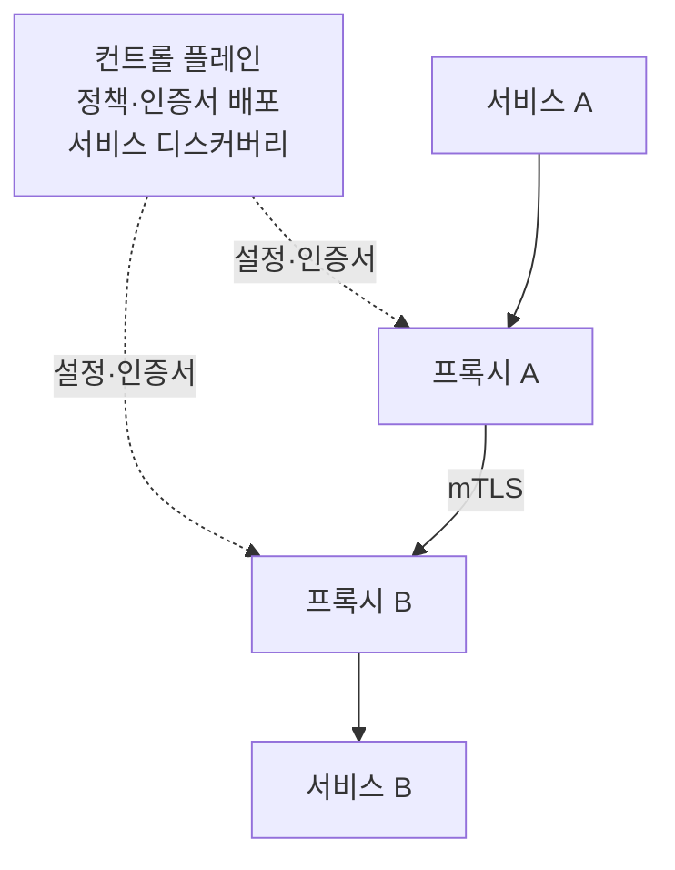

# Service Mesh 정리

사이드카, 앰비언트, eBPF 세 가지 데이터 플레인 배치가 프록시 개수와 기능 범위를 어떻게 맞바꾸는지 비교했다. mTLS 처리 주체와 장애 반경을 기준으로 정리한 글이다.

<!-- more -->

## Service Mesh란
Service Mesh란 서비스 사이 통신에서 mTLS·재시도·트래픽 분할·관측을 애플리케이션 코드 밖의 프록시 계층으로 옮긴 구조

- 대상: 서비스 사이(East-West) 트래픽 → 외부 유입은 Ingress·Gateway 몫
- 구성: 트래픽을 실제로 나르는 데이터 플레인과 정책을 배포하는 컨트롤 플레인으로 나뉨
- 전제: 애플리케이션은 평문으로 평소처럼 호출하고, 암호화·재시도는 프록시가 가로채 처리
- 위치: CNI가 만든 파드 사이 경로 위에 얹히는 계층

패킷이 파드 사이를 어떻게 오가는지는 [Kubernetes CNI 비교](k8s_cni_01.md)에서 다룬 주제고, 이 글은 그 경로 위에서 누가 TLS를 걸고 재시도를 판단하는지를 보는 쪽.

---

## 필요한 이유
같은 기능을 애플리케이션 안에서 해결하려면 언어마다 같은 일을 반복해야 함

| 방식 | 적용 지점 | 한계 |
|------|---------|------|
| 라이브러리 | 서비스 코드에 SDK를 넣어 재시도·서킷브레이커 구현 | 언어별로 따로 구현. 정책을 바꾸려면 전 서비스 재배포 |
| API Gateway | 클러스터 진입 지점 한 곳 | 내부 서비스 사이 호출은 지나가지 않아 통제 밖 |
| Service Mesh | 워크로드 옆 또는 노드의 프록시 | 프록시 자체의 리소스와 운영 부담이 새로 생김 |

- 정책을 코드에서 떼어내면 언어가 섞인 클러스터에서도 한 벌로 집행 가능

---

## 구조

- 컨트롤 플레인은 트래픽 경로에 없음 → 컨트롤 플레인이 죽어도 이미 배포된 설정으로 통신은 계속됨
- 데이터 플레인은 실제 패킷을 처리하므로 여기서의 선택이 자원 소비와 장애 반경을 결정

---

## 데이터 플레인 배치 방식
Service Mesh를 고르는 일은 사실상 프록시를 어디에 몇 개 두느냐를 고르는 일

| 비교 항목 | 사이드카(Istio) | 앰비언트(Istio) | eBPF 기반(Cilium) |
|-----------|----------------|----------------|------------------|
| 프록시 개수 | 파드마다 Envoy 1개 | 노드마다 ztunnel 1개 + 네임스페이스마다 waypoint | 노드마다 Envoy 1개 |
| L4 처리 | Envoy | ztunnel(Rust) | eBPF 커널 데이터패스 |
| L7 처리 | Envoy | waypoint(Envoy). 배치했을 때만 | Envoy |
| mTLS·암호화 | Envoy가 mTLS | ztunnel이 mTLS | mTLS는 Mutual Authentication(Beta), 구간 암호화는 IPsec·WireGuard |
| 앱 파드 spec 변경 | 사이드카 주입으로 변경됨 | 불필요 | 불필요 |
| 프록시 업그레이드 | 앱 파드 재시작 동반 | 앱과 무관하게 갱신 | 앱과 무관하게 갱신 |
| 장애 반경 | 파드 하나 | 노드 단위 또는 네임스페이스 단위 | 노드 단위 |

- ztunnel은 HTTP를 종료하지도 헤더를 파싱하지도 않음 → L7 인가·텔레메트리·VirtualService 라우팅이 필요하면 waypoint를 따로 배치해야 함
- Cilium은 L7 정책이 걸린 트래픽만 eBPF가 Envoy로 넘기고 나머지는 커널 경로에 그대로 둠
- 앰비언트는 Istio 1.24에서 GA로 올라섰고 한 메시 안에서 사이드카 모드와 섞어 쓸 수 있음
- Linkerd도 사이드카 계열이지만 배치 방식이 Istio 사이드카와 같은 축이라 여기서는 뺌

---

## 기능별 처리 위치
같은 기능이라도 어느 방식이냐에 따라 처리하는 주체가 달라짐

| 기능 | 사이드카 | 앰비언트 | eBPF 기반 |
|------|---------|---------|----------|
| 워크로드 간 암호화 | Envoy mTLS | ztunnel mTLS | IPsec·WireGuard 구간 암호화 |
| L4 인가 | Envoy | ztunnel | eBPF 정책 |
| L7 인가·경로 라우팅 | Envoy | waypoint 필요 | Envoy |
| 재시도·타임아웃·서킷브레이커 | Envoy | waypoint 필요 | Envoy |
| 트래픽 분할(카나리) | Envoy | waypoint 필요 | Envoy |
| L4 텔레메트리 | Envoy | ztunnel | eBPF |
| L7 텔레메트리 | Envoy | waypoint 필요 | Envoy |

- 세 방식 모두 L7까지 가면 결국 Envoy를 거치고, 갈리는 것은 그 Envoy가 몇 개이고 어디 있느냐
- Cilium의 IPsec·WireGuard는 노드 사이 구간을 암호화하는 방식 → 같은 노드 안 파드끼리는 적용되지 않고 워크로드 신원 증명도 아님

---

## 도입 판단

| 상황 | 추천 방식 | 추천 사유 |
|------|---------|---------|
| 서비스 수가 적고 언어가 하나 | 도입 보류 | 라이브러리나 Gateway로 충분. 프록시 운영 부담만 남음 |
| 워크로드 신원 증명까지 규정에 걸림 | 앰비언트 | ztunnel이 워크로드 인증서로 mTLS를 걺 |
| 노드 사이 구간 암호화면 충분 | Cilium | IPsec·WireGuard로 프록시 없이 처리 |
| 서비스별 L7 정책이 세밀함 | 사이드카 또는 waypoint를 붙인 앰비언트 | L7 인가·라우팅은 Envoy가 있어야 가능 |
| 이미 Cilium을 CNI로 운영 중 | Cilium Service Mesh | 별도 컨트롤 플레인 없이 기존 설정을 확장 |
| 파드 밀도가 높아 자원이 빠듯 | 앰비언트 또는 Cilium | 프록시가 파드 수가 아닌 노드 수에 비례 |
| 파드 단위 장애 격리가 중요 | 사이드카 | 프록시가 죽어도 그 파드만 영향 |

---

## 결론
- Service Mesh는 mTLS·재시도·트래픽 분할·관측을 코드 밖 프록시로 옮긴 계층이고, CNI가 만든 경로 위에 얹힘
- 방식을 고른다는 것은 프록시를 파드마다 둘지 노드마다 둘지를 고르는 것
- 사이드카는 파드 단위 격리를 주고 파드 수만큼 자원과 재시작 부담을 가져감
- 앰비언트와 eBPF 기반은 노드 단위로 프록시를 줄이는 대신 장애 반경이 노드로 커짐
- L7 기능이 필요 없다면 앰비언트의 ztunnel만으로 mTLS까지 닿으니, 무엇이 필요한지 먼저 정하고 방식을 고를 것
