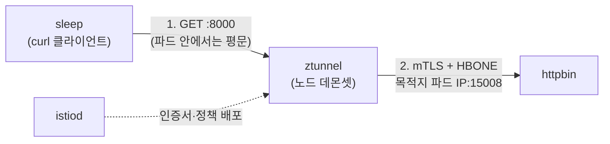
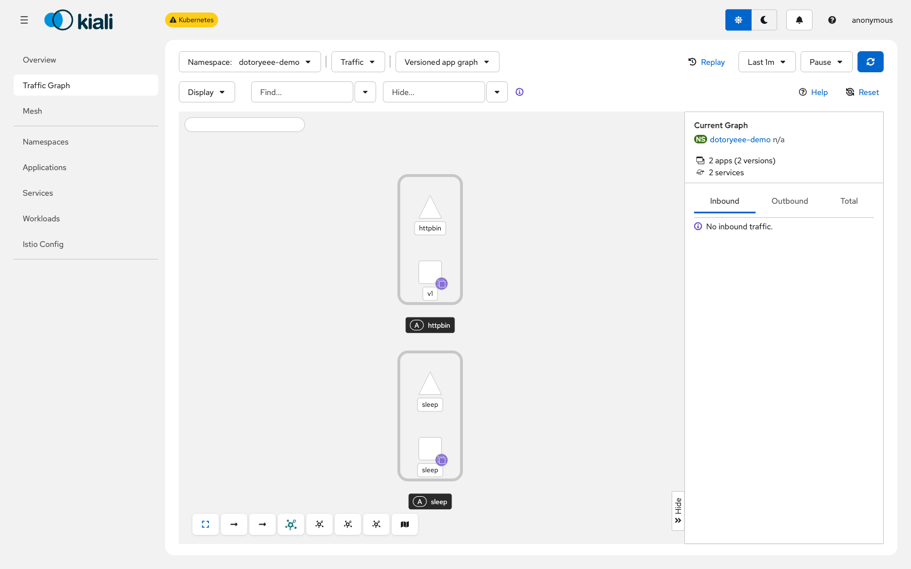
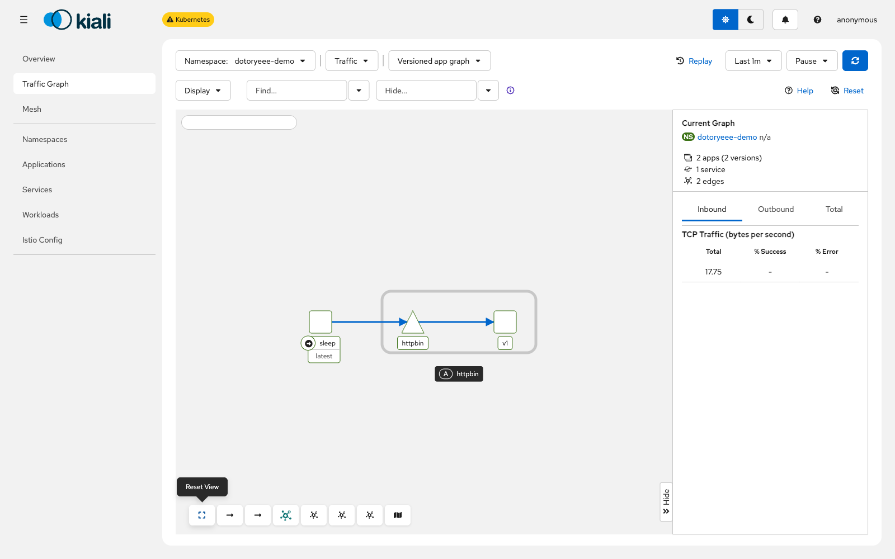
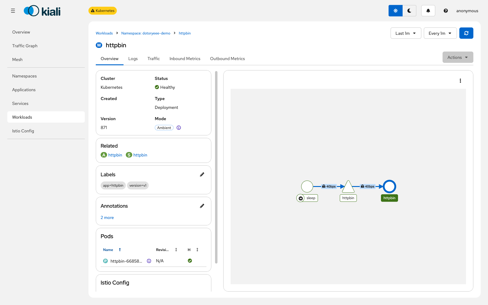
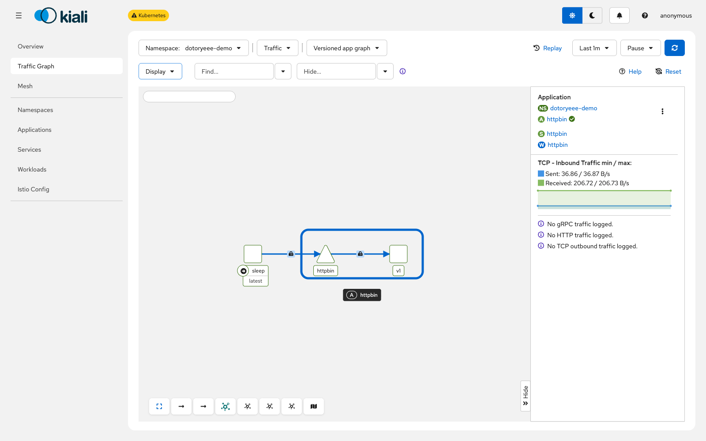
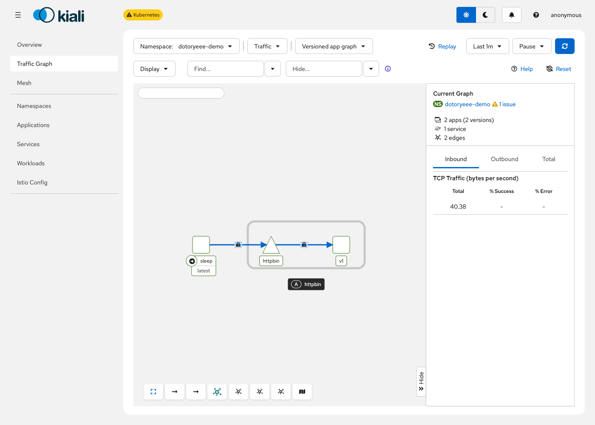
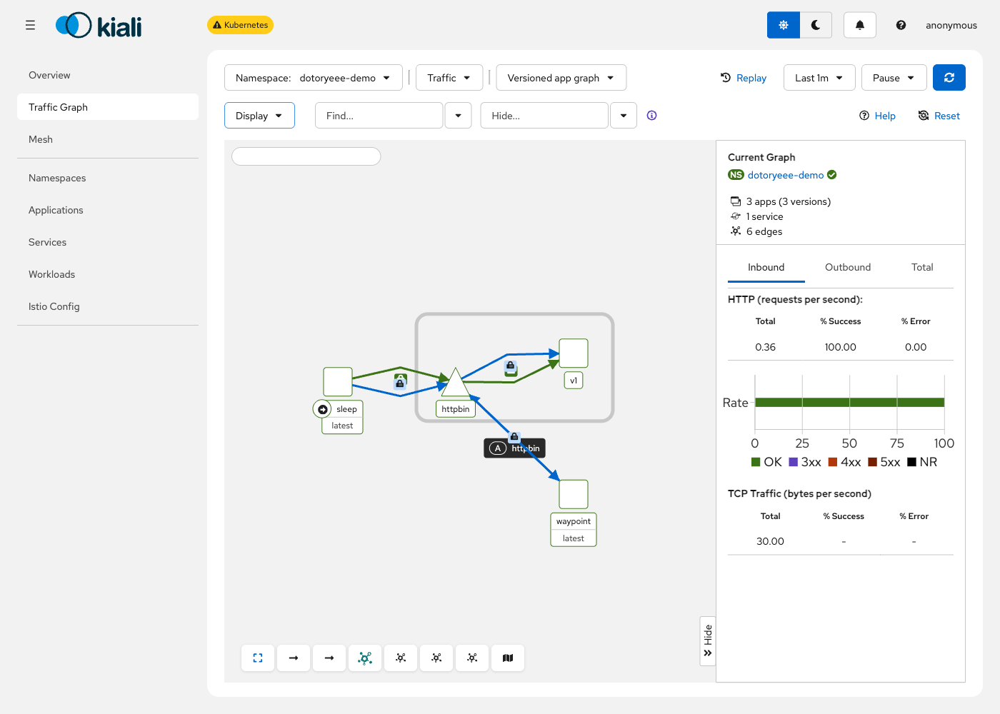
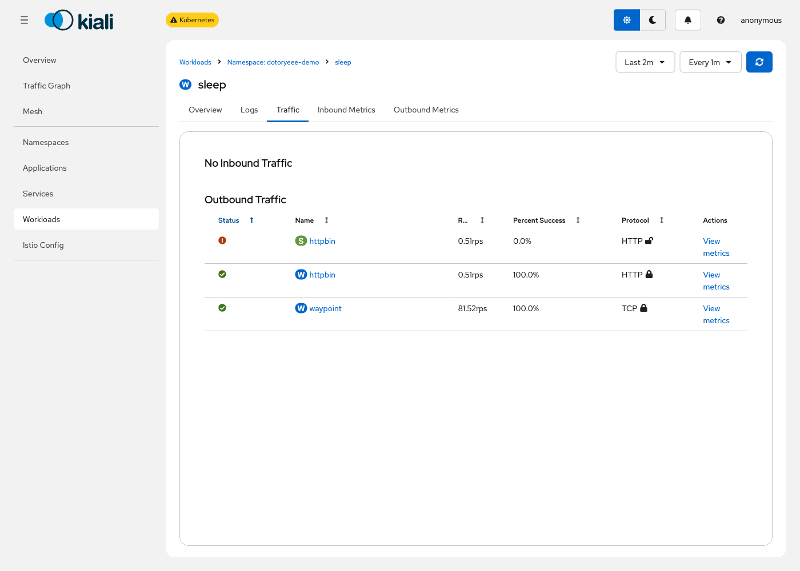
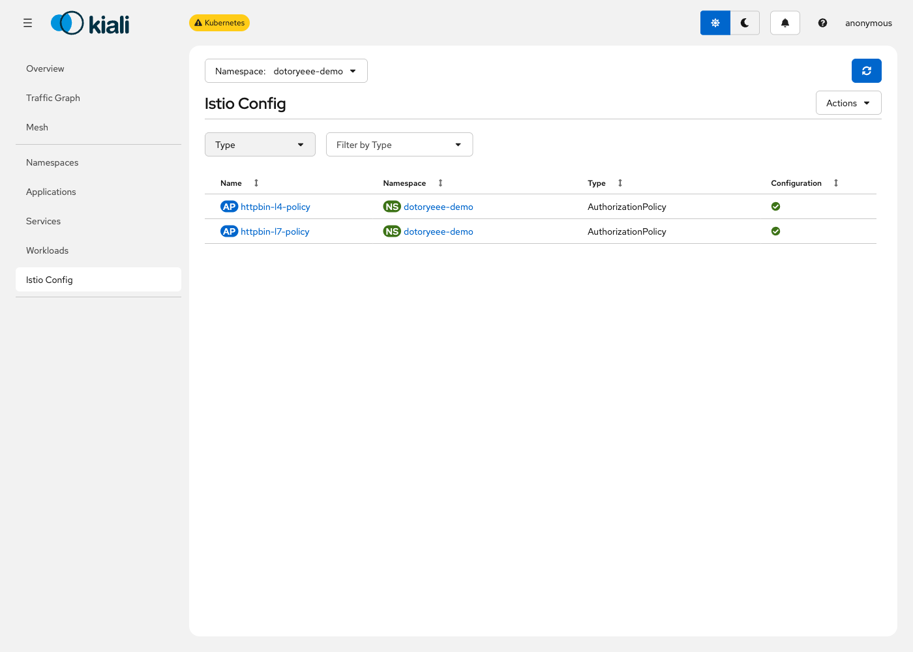

# kind에 Istio 앰비언트 올려 mTLS 확인하기

<!-- more -->

## 목표

---

- kind 단일 노드에 Istio 앰비언트를 설치하고, 같은 두 파드 사이 HTTP 호출을 라벨 적용 전후로 tcpdump에 떠서 평문이 HBONE 터널로 바뀌는지 실측한다
- L4 인가 정책이 ztunnel만으로 걸리는지, HTTP 메서드 기준 L7 인가 정책은 무엇이 있어야 걸리는지를 실제 정책을 적용하고 curl 응답으로 확인한다
- 앰비언트 라벨과 waypoint를 붙이는 동안 kubectl get pod의 READY·RESTARTS가 그대로인지 봐서, 사이드카 주입 없이 프록시가 붙는다는 것을 확인한다

데이터 플레인을 사이드카·앰비언트·eBPF 세 갈래로 나눠 프록시 개수와 mTLS 처리 주체를 비교한 내용은 [Service Mesh 정리](service_mesh.md)에서 다뤘다. 이 글은 그중 앰비언트 한 가지를 실제로 클러스터에 올려, 표로만 봤던 내용을 패킷과 정책 적용 결과로 확인하는 데 집중한다.

## 실습 구성

---

클러스터 하나에 컴포넌트를 전부 올린다. kind 노드 하나 위에 컨트롤 플레인(istiod)과 데이터 플레인(ztunnel, 뒤에서 waypoint도 추가)이 같이 뜨고, 그 위에서 sleep이 httpbin을 호출한다. 앰비언트 라벨을 붙인 뒤의 경로는 다음과 같다.



- sleep: curlimages/curl:8.16.0으로 뜨는 curl 클라이언트. istioctl 배포판에 담긴 공식 샘플이다
- httpbin: mccutchen/go-httpbin:v2.15.0으로 뜨는 echo 서버. 마찬가지로 공식 샘플이다
- ztunnel: 노드마다 하나씩 뜨는 데몬셋. L4 처리와 mTLS를 담당한다
- istiod: 인증서 발급과 정책 배포를 맡는 컨트롤 플레인. 트래픽 경로에는 없다

istioctl과 컨트롤 플레인 버전은 1.30.3으로 고정한다. kind는 v0.32.0, 클러스터의 쿠버네티스는 kindest/node:v1.36.1이다.

!!! tip
    💡 kind 단일 노드에 앰비언트(istiod·ztunnel·istio-cni)와 waypoint, 샘플 앱까지 다 올려도 메모리 1.6GiB 안팎에서 안정된다

## 클러스터와 앰비언트 설치

---

워커 노드 없이 단일 노드로 만들고, 이름은 dotoryeee-mesh로 한다.

```s
kind create cluster --name dotoryeee-mesh
Creating cluster "dotoryeee-mesh" ...
 ✓ Ensuring node image (kindest/node:v1.36.1) 🖼
 ✓ Preparing nodes 📦
 ✓ Writing configuration 📜
 ✓ Starting control-plane 🕹️
 ✓ Installing CNI 🔌
 ✓ Installing StorageClass 💾
Set kubectl context to "kind-dotoryeee-mesh"
```

노드가 Ready로 올라올 때까지 기다린다.

```s
kubectl wait --for=condition=Ready node --all --timeout=120s
node/dotoryeee-mesh-control-plane condition met
```

istioctl은 공식 다운로드 스크립트로 받는다. 버전을 지정하지 않으면 그 시점의 최신 안정 버전이 내려온다. 이번엔 1.30.3이었다.

```s
curl -sL https://istio.io/downloadIstio | sh -
export PATH="$PATH:$PWD/istio-1.30.3/bin"
```

precheck로 클러스터가 설치 가능한 상태인지 먼저 본다.

```s
istioctl x precheck
✔ No issues found when checking the cluster. Istio is safe to install or upgrade!
```

앰비언트 프로파일로 설치한다. 명령 한 번이 core, CNI, istiod, ztunnel을 순서대로 올린다.

```s
istioctl install --set profile=ambient -y
✔ Istio core installed ⛵️
✔ CNI installed 🪢
✔ Istiod installed 🧠
✔ Ztunnel installed 🔒
✔ Installation complete
The ambient profile has been installed successfully, enjoy Istio without sidecars!
```

istio-system에 파드 세 개가 떴다. 사이드카를 주입하는 웹훅이 아니라 노드에 상주하는 프록시와 컨트롤 플레인만 올라온 상태다.

```s
kubectl get pods -n istio-system
NAME                      READY   STATUS    RESTARTS   AGE
istio-cni-node-x2kp5      1/1     Running   0          33s
istiod-6b4d8fccc6-xw5vk   1/1     Running   0          33s
ztunnel-h4bls             1/1     Running   0          19s
```

## 샘플 앱 배포

---

전용 네임스페이스를 만들고 sleep과 httpbin을 올린다. 둘 다 istioctl 배포판의 samples 아래에 있는 공식 샘플 그대로다.

```s
kubectl create namespace dotoryeee-demo
kubectl apply -n dotoryeee-demo -f istio-1.30.3/samples/sleep/sleep.yaml
kubectl apply -n dotoryeee-demo -f istio-1.30.3/samples/httpbin/httpbin.yaml
```

두 파드 모두 컨테이너 한 개짜리로 뜬다. 아직 라벨을 붙이지 않았으니 당연한 상태지만, 이 READY 값이 뒤에서도 그대로 유지되는지가 이 글의 확인 대상 중 하나다.

```s
kubectl get pod -n dotoryeee-demo
NAME                       READY   STATUS    RESTARTS   AGE
httpbin-66858df76d-gvjfs   1/1     Running   0          12s
sleep-7598f4665f-9thnf     1/1     Running   0          12s
```

sleep에서 httpbin을 호출해 기본 동작부터 확인한다.

```s
kubectl exec -n dotoryeee-demo sleep-7598f4665f-9thnf -c sleep -- curl -s http://httpbin:8000/get
{
  "args": {},
  "headers": {
    "Accept": [
      "*/*"
    ],
    "Host": [
      "httpbin:8000"
    ],
    "User-Agent": [
      "curl/8.16.0"
    ]
  },
  "method": "GET",
  "origin": "10.244.0.10:57666",
  "url": "http://httpbin:8000/get"
}
```

## 적용 전 평문 확인

---

sleep 파드 자신의 네트워크 네임스페이스에 tcpdump를 붙여서 본다. 사이드카도 별도 프록시도 없는 상태라 kubectl debug로 임시 컨테이너 하나를 같은 파드에 붙이는 방법을 쓴다. netshoot 이미지에 tcpdump가 들어 있고, target을 sleep 컨테이너로 주면 같은 네트워크 네임스페이스를 본다.

```s
kubectl debug -n dotoryeee-demo sleep-7598f4665f-9thnf \
  --image=nicolaka/netshoot --target=sleep --container=tcpdump-pre --attach=false \
  -- sh -c "timeout 10 tcpdump -l -i any -A -s0 'tcp port 8000'"
```

캡처가 시작된 뒤 같은 sleep 컨테이너에서 curl을 한 번 날리고, 잠시 뒤 임시 컨테이너의 로그를 읽는다. GET 요청 줄과 응답 헤더, JSON 바디까지 그대로 읽힌다.

```s
kubectl logs -n dotoryeee-demo sleep-7598f4665f-9thnf -c tcpdump-pre
06:44:21.382720 eth0  Out IP sleep-7598f4665f-9thnf.48520 > httpbin.dotoryeee-demo.svc.cluster.local.8000: Flags [P.], seq 1:80, ack 1, win 512, options [nop,nop,TS val 2281321755 ecr 135285578], length 79
E.....@.@.b.
..

`.t...@.............H.....
..5...KJGET /get HTTP/1.1
Host: httpbin:8000
User-Agent: curl/8.16.0
Accept: */*


06:44:21.383016 eth0  In  IP httpbin.dotoryeee-demo.svc.cluster.local.8000 > sleep-7598f4665f-9thnf.48520: Flags [P.], seq 1:445, ack 80, win 512, options [nop,nop,TS val 135285578 ecr 2281321755], length 444
E.....@.?.4&
`.t
..
.@.........	...........
..KJ..5.HTTP/1.1 200 OK
Access-Control-Allow-Credentials: true
Access-Control-Allow-Origin: *
Content-Type: application/json; charset=utf-8
Date: Sun, 26 Jul 2026 06:44:21 GMT
Content-Length: 248
```

노드 안 어디서 패킷을 뜨든 상관없이, 지금은 요청과 응답이 패킷에 그대로 노출된다.

istio 배포판의 samples/addons에 있는 Prometheus와 Kiali를 추가로 올려 같은 상태를 그래프로도 본다. 라벨 적용 전이라 Kiali 그래프에도 sleep과 httpbin이 연결 없이 따로 떠 있다.



## 앰비언트 라벨 적용

---

네임스페이스에 라벨 하나만 붙인다.

```s
kubectl label namespace dotoryeee-demo istio.io/dataplane-mode=ambient
namespace/dotoryeee-demo labeled
```

파드를 다시 본다. 재시작 없이 READY도 그대로다.

```s
kubectl get pod -n dotoryeee-demo
NAME                       READY   STATUS    RESTARTS   AGE
httpbin-66858df76d-gvjfs   1/1     Running   0          2m16s
sleep-7598f4665f-9thnf     1/1     Running   0          52s
```

Kiali 그래프에도 sleep에서 httpbin으로 가는 엣지가 새로 나타나고 TCP 트래픽 수치가 찍히기 시작한다.



ztunnel이 이 두 파드를 인지했는지는 istioctl로 바로 확인할 수 있다. WAYPOINT 컬럼은 아직 비어 있고 PROTOCOL이 HBONE으로 잡힌다.

```s
istioctl ztunnel-config workloads ztunnel-h4bls -n istio-system --workload-namespace dotoryeee-demo
NAMESPACE      POD NAME                 ADDRESS     NODE                         WAYPOINT PROTOCOL
dotoryeee-demo httpbin-66858df76d-gvjfs 10.244.0.9  dotoryeee-mesh-control-plane None     HBONE
dotoryeee-demo sleep-7598f4665f-9thnf   10.244.0.10 dotoryeee-mesh-control-plane None     HBONE
```

두 워크로드 모두 SPIFFE 인증서가 이미 발급돼 있다. 이 신원 위에서 뒤의 mTLS와 인가 정책이 걸린다.

```s
istioctl ztunnel-config certificates ztunnel-h4bls -n istio-system
CERTIFICATE NAME                                      TYPE   STATUS      VALID CERT   SERIAL NUMBER                       NOT AFTER              NOT BEFORE
spiffe://cluster.local/ns/dotoryeee-demo/sa/httpbin   Leaf   Available   true          e060da9be4ddefbbded6436973c0a8b6   2026-07-27T06:45:03Z   2026-07-26T06:43:03Z
spiffe://cluster.local/ns/dotoryeee-demo/sa/sleep     Leaf   Available   true          37fd2926a010bfed4f763ec142bef01d   2026-07-27T06:45:03Z   2026-07-26T06:43:03Z
```

httpbin 워크로드 상세에도 Mode가 Ambient로 표시되어 사이드카 없는 데이터플레인 편입이 Kiali 쪽에서도 확인된다.



## 적용 후 HBONE 확인

---

같은 방법으로 다시 tcpdump를 뜬다. 이번엔 목적지 포트를 8000뿐 아니라 15008(HBONE)까지 넣는다.

```s
kubectl debug -n dotoryeee-demo sleep-7598f4665f-9thnf \
  --image=nicolaka/netshoot --target=sleep --container=tcpdump-post --attach=false \
  -- sh -c "timeout 10 tcpdump -l -i any -A -s0 'tcp port 8000 or tcp port 15008'"
```

curl을 다시 날리고 로그를 본다. 같은 파드의 네트워크 네임스페이스인데 인터페이스별로 결과가 갈린다. eth0로 나가는 트래픽은 목적지가 httpbin 파드 IP의 15008번 포트로 바뀌었고, 페이로드는 더 이상 읽히지 않는다.

```s
06:45:39.317139 eth0  Out IP sleep-7598f4665f-9thnf.50512 > 10-244-0-9.httpbin.dotoryeee-demo.svc.cluster.local.15008: Flags [P.], seq 1:210, ack 1, win 512, options [nop,nop,TS val 225643746 ecr 135363513], length 209
E...(:@.@...
..

..	.P:.S[4Z.U.=...........
.s....{................P......Q..H..>(Pv..S...V.... . u.n.#.|.....p...d\.M....o..............{.
```

같은 캡처의 lo(루프백)에는 원래 향하던 것과 같은 응답이 여전히 평문으로 잡힌다.

```s
06:45:39.318726 lo    In  IP httpbin.dotoryeee-demo.svc.cluster.local.8000 > sleep-7598f4665f-9thnf.39374: Flags [P.], seq 1:445, ack 80, win 512, options [nop,nop,TS val 1310400510 ecr 2281399689], length 444
E.....@.@.3.
`.t
..
.@..3.U.	..............
N.....e.HTTP/1.1 200 OK
Access-Control-Allow-Credentials: true
Access-Control-Allow-Origin: *
Content-Type: application/json; charset=utf-8
Date: Sun, 26 Jul 2026 06:45:39 GMT
Content-Length: 248
```

평문은 파드 네임스페이스 안의 루프백에 갇혀 있고, 실제로 파드 밖으로 나가는 eth0 트래픽은 15008 포트로 향하는 판독 불가능한 바이트뿐이다. 같은 방식으로 -X와 -c 6을 줘서 헥스로 한 번 더 떠보면 그 바이트가 무작위가 아니라 TLS라는 것도 보인다.

```s
kubectl logs -n dotoryeee-demo sleep-7598f4665f-9thnf -c tcpdump-hex
06:46:08.680585 IP sleep-7598f4665f-9thnf.50512 > 10-244-0-9.httpbin.dotoryeee-demo.svc.cluster.local.15008: Flags [P.], seq 1398487802:1398487931, ack 3965043307, win 540, options [nop,nop,TS val 225673110 ecr 135383562], length 129
	0x0000:  4500 00b5 284d 4000 4006 fbfb 0af4 000a  E...(M@.@.......
	0x0010:  0af4 0009 c550 3aa0 535b 3afa ec55 c26b  .....P:.S[:..U.k
	0x0020:  8018 021c 16a2 0000 0101 080a 0d73 7f96  .............s..
	0x0030:  0811 ca0a 1703 0300 7c90 9ba2 c7ed b057  ........|......W
```

TCP 옵션 뒤 0x0030 오프셋의 1703 0300이 TLS 레코드 헤더다. 0x17은 Application Data, 0x0303은 레코드 계층 버전, 뒤의 007c는 124바이트 길이를 뜻한다. ztunnel이 두 파드의 SPIFFE 인증서로 mTLS를 걸고 그 위에 HBONE(HTTP/2 CONNECT) 터널을 얹어 보낸 결과다.

Kiali에서 Security 표시를 켜면 sleep과 httpbin을 잇는 엣지 모두에 자물쇠 아이콘이 붙는다.



## L4 인가 정책 확인

---

여기까지는 트래픽이 실제로 암호화되는지를 봤다. 이제 그 위에서 인가 정책이 어느 프록시 단계에서 걸리는지를 본다. 먼저 waypoint 없이 ztunnel만 떠 있는 상태에서 네임스페이스 기준 정책을 걸어본다.

```s
vi httpbin-l4-policy.yaml
```

```yaml title="httpbin-l4-policy.yaml"
apiVersion: security.istio.io/v1
kind: AuthorizationPolicy
metadata:
  name: httpbin-l4-policy
  namespace: dotoryeee-demo
spec:
  selector:
    matchLabels:
      app: httpbin
  action: ALLOW
  rules:
  - from:
    - source:
        namespaces: ["dotoryeee-nonexistent"]   #존재하지 않는 네임스페이스만 허용
```

sleep은 dotoryeee-demo에 있으니 이 허용 조건에 걸리지 않고 차단되는 게 정상이다. 적용하고 다시 호출해 본다.

```s
kubectl apply -f httpbin-l4-policy.yaml
authorizationpolicy.security.istio.io/httpbin-l4-policy created

kubectl exec -n dotoryeee-demo sleep-7598f4665f-9thnf -c sleep -- curl -sv --max-time 5 http://httpbin:8000/get
* Established connection to httpbin (10.96.250.116 port 8000) from 10.244.0.10 port 53862
> GET /get HTTP/1.1
> Host: httpbin:8000
* Request completely sent off
* Recv failure: Connection reset by peer
* closing connection #0
command terminated with exit code 56
```

waypoint 없이도 요청이 막혔다. 다만 막히는 방식이 눈에 띈다. HTTP 403이 아니라 TCP 연결 자체가 끊긴다. ztunnel은 HTTP를 종료하지 않으니 403 응답을 만들어 돌려줄 수가 없고, 연결을 끊는 것으로 거부를 표현한다.

이 상태의 Kiali 그래프는 엣지 색과 % Error 값이 그대로고, 대신 네임스페이스 옆에 정책 경고 배지 하나만 붙는다.



규칙의 네임스페이스를 dotoryeee-demo로 고치면 다시 통과한다.

```s
kubectl apply -f httpbin-l4-policy.yaml
authorizationpolicy.security.istio.io/httpbin-l4-policy configured

kubectl exec -n dotoryeee-demo sleep-7598f4665f-9thnf -c sleep -- curl -s -o /dev/null -w "http_status=%{http_code}\n" http://httpbin:8000/get
http_status=200
```

## L7 인가 정책과 waypoint

---

이번엔 HTTP 메서드를 기준으로 건다. POST만 막고 GET은 그대로 두는 정책이다.

```s
vi httpbin-l7-policy.yaml
```

```yaml title="httpbin-l7-policy.yaml"
apiVersion: security.istio.io/v1
kind: AuthorizationPolicy
metadata:
  name: httpbin-l7-policy
  namespace: dotoryeee-demo
spec:
  selector:
    matchLabels:
      app: httpbin
  action: DENY
  rules:
  - to:
    - operation:
        methods: ["POST"]   #POST만 차단, GET은 그대로 둠
```

apply 시점부터 경고가 붙는다.

```s
kubectl apply -f httpbin-l7-policy.yaml
Warning: configured AuthorizationPolicy will deny all traffic to TCP ports under its scope due to the use of only HTTP attributes in a DENY rule; it is recommended to explicitly specify the port
authorizationpolicy.security.istio.io/httpbin-l7-policy created
```

그런데 GET도 POST도 똑같이 통과한다.

```s
kubectl exec -n dotoryeee-demo sleep-7598f4665f-9thnf -c sleep -- curl -s -o /dev/null -w "GET http_status=%{http_code}\n" http://httpbin:8000/get
GET http_status=200

kubectl exec -n dotoryeee-demo sleep-7598f4665f-9thnf -c sleep -- curl -s -o /dev/null -w "POST http_status=%{http_code}\n" -X POST http://httpbin:8000/post
POST http_status=200
```

정책 상태를 보면 경고가 그대로 남아 있다.

```s
kubectl get authorizationpolicy httpbin-l7-policy -n dotoryeee-demo -o yaml
status:
  conditions:
  - message: 'ztunnel does not support HTTP attributes (found: methods). In ambient
      mode you must use a waypoint proxy to enforce HTTP rules. DENY policy with
      HTTP attributes is enforced without the HTTP rules. This will be more restrictive
      than requested.'
    reason: UnsupportedValue
    status: "True"
    type: ZtunnelAccepted
```

문구만 보면 대상 트래픽을 전부 막아야 정상인데 실제로는 반대다. istioctl ztunnel-config policies로 뽑아보면 이 DENY 규칙은 조건이 하나도 없는 빈 match로 등록돼 있다. istiod가 HTTP 속성을 떼어낸 뒤 남은 껍데기를 그대로 내려보낸 결과인데, ztunnel은 빈 match를 일치하는 것이 없다고 평가하기 때문에 규칙 자체가 발동하지 않는다. 그래서 GET·POST가 계속 통과했고 ztunnel 로그에도 거부 없이 정상 종료로만 남았다. rules를 통째로 비워서 만든 DENY 정책이 곧바로 전체 차단되는 것과 대조된다.

경고 문구는 사이드카 모드를 설명한 것이다. Envoy는 같은 상황에서 조건을 넓혀 전부 막지만 ztunnel에는 그 처리가 없다. 다만 같은 규칙에 포트가 함께 적혀 있으면 match가 비지 않아 그 포트 전체가 막히므로, 그때는 경고대로 동작한다. 1.30.3에서 확인한 결과이고, istiod가 빈 match를 내려보내지 않도록 바뀌면 달라질 수 있다.

빈 match를 두고 안내 문구와 실제 동작이 어긋나는 문제는 상류에서도 지적된 적이 있다. 2024년 말 [ztunnel authz pol status is confusing](https://github.com/istio/istio/issues/54334) 이슈가 ALLOW 쪽 status 문구를 두고 같은 문제를 제기했고 그때 문구가 정리됐다. DENY 쪽 문구는 1.30.3에서도 사이드카 기준 그대로 남아 있다.

정리 글에서 L7 인가는 waypoint가 있어야 걸린다고 적었던 이유가 여기 있다. waypoint는 쿠버네티스 Gateway API의 Gateway 리소스로 만들어지는데, CRD가 없으면 첫 시도부터 막힌다.

```s
istioctl waypoint apply --namespace dotoryeee-demo --enroll-namespace --wait
Error: missing Kubernetes Gateway CRDs need to be installed before applying a waypoint: the server could not find the requested resource (patch gateways.gateway.networking.k8s.io waypoint)
```

Gateway API CRD를 먼저 넣는다.

```s
kubectl apply -f https://github.com/kubernetes-sigs/gateway-api/releases/download/v1.6.1/standard-install.yaml
customresourcedefinition.apiextensions.k8s.io/backendtlspolicies.gateway.networking.k8s.io created
customresourcedefinition.apiextensions.k8s.io/gatewayclasses.gateway.networking.k8s.io created
customresourcedefinition.apiextensions.k8s.io/gateways.gateway.networking.k8s.io created
customresourcedefinition.apiextensions.k8s.io/grpcroutes.gateway.networking.k8s.io created
customresourcedefinition.apiextensions.k8s.io/httproutes.gateway.networking.k8s.io created
customresourcedefinition.apiextensions.k8s.io/listenersets.gateway.networking.k8s.io created
customresourcedefinition.apiextensions.k8s.io/referencegrants.gateway.networking.k8s.io created
customresourcedefinition.apiextensions.k8s.io/tcproutes.gateway.networking.k8s.io created
customresourcedefinition.apiextensions.k8s.io/tlsroutes.gateway.networking.k8s.io created
customresourcedefinition.apiextensions.k8s.io/udproutes.gateway.networking.k8s.io created
validatingadmissionpolicy.admissionregistration.k8s.io/safe-upgrades.gateway.networking.k8s.io created
validatingadmissionpolicybinding.admissionregistration.k8s.io/safe-upgrades.gateway.networking.k8s.io created
```

다시 waypoint를 적용한다. 이번엔 성공한다.

```s
istioctl waypoint apply --namespace dotoryeee-demo --enroll-namespace --wait
✅ waypoint dotoryeee-demo/waypoint applied
✅ waypoint dotoryeee-demo/waypoint is ready!
✅ namespace dotoryeee-demo labeled with "istio.io/use-waypoint: waypoint"
```

waypoint 파드가 떴는데도 GET·POST 결과는 그대로다. 목록을 보면 TRAFFIC TYPE이 none이다.

```s
istioctl waypoint list -n dotoryeee-demo
NAME       REVISION   TRAFFIC TYPE   PROGRAMMED
waypoint   default    none           True
```

!!! warning
    💡 --for 없이 적용하면 istio.io/waypoint-for 라벨이 안 붙어 list에는 none으로 뜨지만, 라벨이 없는 waypoint는 기본값으로 Service 트래픽을 처리한다

none은 표시일 뿐 아무 트래픽도 못 받는다는 뜻이 아니라서, 트래픽 타입을 명시적으로 남기려는 목적으로 for 옵션을 붙여 다시 적용한다.

```s
istioctl waypoint apply --namespace dotoryeee-demo --enroll-namespace --for all --overwrite --wait
✅ waypoint dotoryeee-demo/waypoint applied
✅ waypoint dotoryeee-demo/waypoint is ready!

istioctl waypoint list -n dotoryeee-demo
NAME       REVISION   TRAFFIC TYPE   PROGRAMMED
waypoint   default    all            True
```

ztunnel 쪽 워크로드 목록에도 WAYPOINT 컬럼이 채워졌다.

```s
istioctl ztunnel-config workloads ztunnel-h4bls -n istio-system --workload-namespace dotoryeee-demo
NAMESPACE      POD NAME                 ADDRESS     NODE                         WAYPOINT PROTOCOL
dotoryeee-demo httpbin-66858df76d-gvjfs 10.244.0.9  dotoryeee-mesh-control-plane waypoint HBONE
dotoryeee-demo sleep-7598f4665f-9thnf   10.244.0.10 dotoryeee-mesh-control-plane waypoint HBONE
```

Kiali 그래프에도 waypoint가 새 노드로 나타나고, 이때부터 TCP뿐 아니라 HTTP 요청 수치도 함께 잡힌다.



그런데도 POST는 여전히 200이다. waypoint의 Envoy 설정을 직접 확인해 보면, 이 정책 자체가 waypoint까지 전달되지 않았다.

```s
istioctl experimental authz check waypoint-54bcc8cf56-zc4sr.dotoryeee-demo
ACTION   AuthorizationPolicy   RULES
```

원인은 정책이 워크로드를 selector로 지정했기 때문이다. waypoint에 정책이 붙으려면 targetRefs로 Gateway나 Service를 직접 가리켜야 한다.

!!! warning
    💡 selector로 지정한 AuthorizationPolicy는 waypoint에 붙지 않으니 targetRefs로 Gateway나 Service를 직접 가리킨다

정책을 targetRefs 방식으로 고쳐 쓴다.

```s
vi httpbin-l7-policy.yaml
```

```yaml title="httpbin-l7-policy.yaml"
apiVersion: security.istio.io/v1
kind: AuthorizationPolicy
metadata:
  name: httpbin-l7-policy
  namespace: dotoryeee-demo
spec:
  targetRefs:
  - kind: Service            #워크로드 selector 대신 Service를 직접 지정
    group: ""
    name: httpbin
  action: DENY
  rules:
  - to:
    - operation:
        methods: ["POST"]
```

적용하면 상태부터 달라진다.

```s
kubectl apply -f httpbin-l7-policy.yaml
authorizationpolicy.security.istio.io/httpbin-l7-policy configured

kubectl get authorizationpolicy httpbin-l7-policy -n dotoryeee-demo -o yaml
status:
  conditions:
  - message: bound to dotoryeee-demo/waypoint
    reason: Accepted
    status: "True"
    type: WaypointAccepted
```

waypoint 설정에도 규칙이 잡힌다.

```s
istioctl experimental authz check waypoint-54bcc8cf56-zc4sr.dotoryeee-demo
ACTION   AuthorizationPolicy                RULES
DENY     httpbin-l7-policy.dotoryeee-demo   1
```

이제 GET과 POST가 갈린다.

```s
kubectl exec -n dotoryeee-demo sleep-7598f4665f-9thnf -c sleep -- curl -s -o /dev/null -w "GET http_status=%{http_code}\n" http://httpbin:8000/get
GET http_status=200

kubectl exec -n dotoryeee-demo sleep-7598f4665f-9thnf -c sleep -- curl -sv -X POST http://httpbin:8000/post
> POST /post HTTP/1.1
> Host: httpbin:8000
* Request completely sent off
< HTTP/1.1 403 Forbidden
< content-length: 19
< content-type: text/plain
< server: istio-envoy
RBAC: access denied
```

L4 차단은 연결이 끊기는 것으로 끝났지만, 이번엔 403 Forbidden과 RBAC: access denied 본문까지 돌아온다. waypoint는 Envoy라서 HTTP 레벨에서 요청을 받고 판단하고 응답까지 만들 수 있다는 차이가 그대로 드러난다.

sleep 워크로드의 Outbound Traffic 목록에서도 Service httpbin 경로만 Percent Success가 0.0%로 떨어진다.



Istio Config 목록에는 두 AuthorizationPolicy가 모두 검증 정상 상태로 올라온다.



## 파드에 붙는 컨테이너

---

지금까지 라벨을 붙이고 waypoint까지 올리는 동안 httpbin과 sleep 파드 자체를 손댄 적은 없다. READY와 RESTARTS를 시점별로 모아보면 한 번도 바뀌지 않았다.

|시점|httpbin|sleep|
|---|---|---|
|배포 직후|READY 1/1, RESTARTS 0|READY 1/1, RESTARTS 0|
|ambient 라벨 적용 후|READY 1/1, RESTARTS 0|READY 1/1, RESTARTS 0|
|waypoint 배포 후|READY 1/1, RESTARTS 0|READY 1/1, RESTARTS 0|

새로 생긴 프록시는 두 파드 어디에도 들어가지 않고, ztunnel과 waypoint라는 별도 파드로만 늘었다. 사이드카 방식이었다면 프록시 업그레이드마다 앱 파드 재시작이 따라붙었겠지만, 여기서는 그 재시작 자체가 일어날 여지가 없었다.

## 정리

---

실습이 끝나면 클러스터를 통째로 지운다.

```s
kind delete cluster --name dotoryeee-mesh
Deleting cluster "dotoryeee-mesh" ...
```

- 라벨을 붙이기 전 sleep 파드 자신의 eth0에서도 GET 요청과 JSON 응답이 그대로 읽혔지만, 라벨을 붙인 뒤에는 같은 위치에서 목적지가 httpbin 파드의 15008 포트로 바뀌고 페이로드는 TLS Application Data 레코드로만 보였다
- L4 인가 정책(네임스페이스 기준)은 waypoint 없이 ztunnel만으로 걸렸다. 다만 차단은 403이 아니라 TCP 연결이 끊기는 형태였다
- L7 인가 정책(HTTP 메서드 기준)은 selector 방식으로는 waypoint를 붙여도 걸리지 않았다. apply 시점 경고는 전체 차단을 암시했지만 실제 GET·POST는 계속 통과했고, targetRefs로 Service를 직접 가리키고 나서야 POST가 403으로 막혔다
- 라벨과 waypoint를 붙이는 동안 httpbin·sleep 파드의 READY는 1/1, RESTARTS는 0에서 한 번도 바뀌지 않았다
