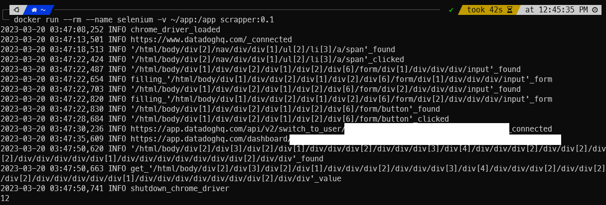

# Datadog dashboard crawling

## 목적
Datadog dashboard에서 기본적으로 제공하는 report 기능이 빈약하여 dashboard를 직접 긁어 report를 렌더링 하기로 했습니다
<!-- more -->

## 방법
- Python + Selenium 구동을 위한 Docker file 생성
    ```s
    mkdir ~/app
    cat<<EOF >~/app/requirements.txt
    requests
    selenium
    jinja2
    EOF
    ```

    ```dockerfile title="Dockerfile"
    FROM python:latest
    RUN mkdir -p app/temp
    WORKDIR app
    RUN apt update -y; apt install wget unzip -y
    RUN wget http://dl.google.com/linux/deb/pool/main/g/google-chrome-unstable/google-chrome-unstable_112.0.5615.20-1_amd64.deb -O ./temp/google_chrome.deb
    RUN apt install -f ./temp/google_chrome.deb -y
    RUN wget https://chromedriver.storage.googleapis.com/112.0.5615.28/chromedriver_linux64.zip -P ./temp
    RUN unzip ./temp/chromedriver_linux64.zip -d ./
    RUN rm -rf ./temp
    RUN pip install --upgrade pip
    COPY app/requirements.txt ./
    RUN pip install -r requirements.txt --no-cache-dir
    CMD [ "python", "/app/app.py" ]
    ```

    ```s title="실행 명령"
    # Dockerfile이 존재하는 위치에서
    docker build -t scrapper:0.2 ./
    docker run --rm --name selenium -v ~/app:/app scrapper:0.2
    ```
- Datadog dashboard 접속 및 데이터 크롤링을 위한 Python 코드 작성
    ```py title="crawling_datadog_dashboard"
    import logging
    import warnings
    import jinja2
    from time import sleep
    from selenium import webdriver
    from selenium.webdriver.common.by import By
    from selenium.webdriver.support.ui import WebDriverWait
    from selenium.webdriver.support import expected_conditions as EC

    #selenium4에서 deprecate되는 executable_path 옵션 warning 무시하기
    warnings.filterwarnings("ignore", category=DeprecationWarning) 

    #chrome driver 설정
    chrome_driver_path = "app/chromedriver"

    #report template file name
    report_template_file_name = "report.j2"

    #로거 설정
    logger = logging.getLogger()
    logger.setLevel(logging.INFO)
    formatter = logging.Formatter('%(asctime)s %(levelname)s %(message)s')

    stream_handler = logging.StreamHandler()
    stream_handler.setFormatter(formatter)
    logger.addHandler(stream_handler)

    #chrome web browser 설정
    options = webdriver.ChromeOptions()
    options.add_argument('headless')
    options.add_argument('window-size=1080x1920')
    options.add_argument('--no-sandbox') #unknown error: DevToolsActivePort file doesn't exist 에러 방지
    options.add_argument('--disable-dev-shm-usage') #selenium.common.exceptions.WebDriverException: Message: unknown error: session deleted because of page crash 에러 발생 방지
    options.add_argument("user-agent=Mozilla/5.0 (Macintosh; Intel Mac OS X 10_12_6) AppleWebKit/537.36 (KHTML, like Gecko) Chrome/61.0.3163.100 Safari/537.36")

    #chrome 실행
    chrome_driver = webdriver.Chrome(executable_path=chrome_driver_path, options=options)
    chrome_driver.implicitly_wait(5)
    logger.info("chrome_driver_loaded")

    def close_chrome_driver() -> None:
        chrome_driver.quit()
        logger.info("shutdown_chrome_driver")

    def connect_webpage(address: str) -> None:
        try:
            chrome_driver.get(address)
            logger.info(f"'{address}'_connected")
            sleep(5)
        except:
            logger.error(f"fail_connect_'{address}'")

    def find_and_click(xpath: str) -> None:
        try:
            element = WebDriverWait(chrome_driver, 5).until(
                EC.presence_of_element_located((By.XPATH , xpath))
            )
            logger.info(f"'{xpath}'_found")
            element.click()
            logger.info(f"'{xpath}'_clicked")
        except:
            logger.error(f"'{xpath}'_not_found")
            close_chrome_driver()

    def find_and_fill(xpath: str, value: str) -> None:
        try:
            element = WebDriverWait(chrome_driver, 5).until(
                EC.presence_of_element_located((By.XPATH , xpath))
            )
            logger.info(f"'{xpath}'_found")
            element.send_keys(value)
            logger.info(f"filling_'{xpath}'_form")
        except:
            logger.error(f"'{xpath}'_not_found")
            close_chrome_driver()

    def crwaling_value(xpath: str) -> str:
        try:
            element = WebDriverWait(chrome_driver, 5).until(
                EC.presence_of_element_located((By.XPATH , xpath))
            )
            logger.info(f"'{xpath}'_found")
            value = element.text
            logger.info(f"get_'{xpath}'_value")
        except:
            logger.error(f"'{xpath}'_not_found")
            close_chrome_driver()
        return value

    def make_report(data_dict: dict) -> object:
        print(data_dict)
        try:
            logger.info("start_rendereing_report")
            file_loader = jinja2.FileSystemLoader("./")
            env = jinja2.Environment(loader=file_loader)
            template = env.get_template(report_template_file_name)
            output = template.render(data=data_dict)
            logger.info("rendering_finished")
            logger.info("saving_rendered_report")
            with open('rendered_report.html', 'w') as f:
                f.write(output)
            logger.info("save_report_complete")
            return output
        except Exception as e:
            logger.error(f"rendereing_report_fail: {e}")

    def main():
        data_dict = {}
        try:
            #datadog 접속
            connect_webpage("https://www.datadoghq.com/")

            #로그인버튼 클릭 시도
            find_and_click('/html/body/div[2]/nav/div/div[1]/ul[2]/li[3]/a/span')

            #ID 채우기
            find_and_fill("/html/body/div[1]/div/div[2]/div[1]/div[2]/div[6]/form/div[1]/div/div/div/input", "")

            #PW 채우기
            find_and_fill("/html/body/div[1]/div/div[2]/div[1]/div[2]/div[6]/form/div[2]/div/div/div/input", "")

            #로그인 시도 버튼 클릭
            find_and_click('/html/body/div[1]/div/div[2]/div[1]/div[2]/div[6]/form/button')

            #타켓 서비스로 전환
            connect_webpage("https://app.datadoghq.com/api/v2/switch_to_user/")

            #타겟 dashboard 입장
            connect_webpage("https://app.datadoghq.com/dashboard/")

            sleep(10) # wait 10s for dashboard loading

            data_dict[""] = crwaling_value("")
            data_dict[""] = crwaling_value("")
            data_dict[""] = crwaling_value("")
            data_dict[""] = crwaling_value("")
            data_dict[""] = crwaling_value("")
            data_dict[""] = crwaling_value("")
            data_dict[""] = crwaling_value("")
            data_dict[""] = crwaling_value("")
            
            #report rendering
            make_report(data_dict)

        finally:
            #chrome_driver 종료
            close_chrome_driver()

    if __name__ == "__main__":
        main()


    ```
    
    데이터를 잘 가져오고 있습니다(12)
    
- 크롤링된 데이터를 report 포맷에 맞게 렌더링 할 Python + Jinja tempate 코드 작성