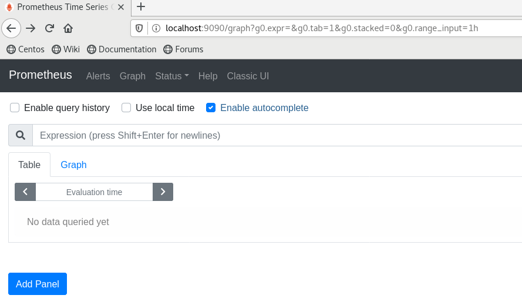
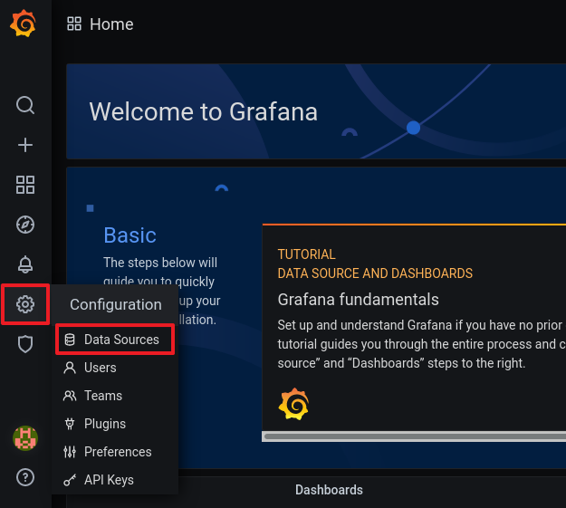
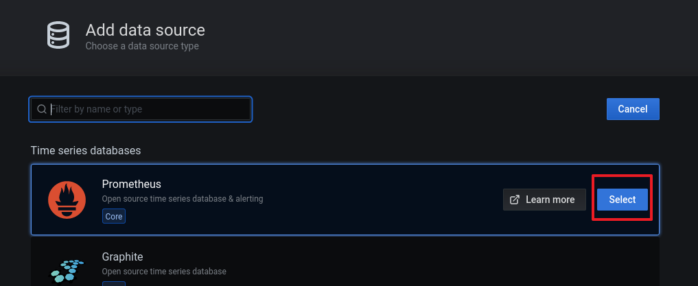

# Prometheus and Grafana


## 목표

---

- 프로메테우스와 그라파나를 연결합니다
- 그라파나에 대시보드를 추가해 시각적인 정보를 생성합니다
<!-- more -->
## DB컨테이너 준비

---

1. 여태 작업했던 DB컨테이너를 모두 종료합니다

    ```s
    docker stop mydb db001 db002 db003
    docker rm mydb db001 db002 db003
    ```

2. Docker HOST에 MySQL그룹을 생성하고 mysql 유저를 추가합니다
    
    이때 사전에 만든 Docker Image와 동일하게 GID UID를 갖도록 합니다
    
    이렇게 하면 컨테이너 유저의 GID, UID가 DOCKER HOST 유저의 GID, UID가 같아지게 됩니다
    
    ```sql
    groupadd -g 1001 mysql
    useradd -u 1001 -r -g 1001 mysql
    ```
        
3. 호스트 디렉터리의 OWNER를 mysql로 변경하고 권한을 755로 변경합니다
    
    ```s
    chown -R mysql:mysql /db/db001 /db/db002 /db/db003
    ```

4. mysql57 이미지를 이용해 db001 컨테이너를 로드합니다
    
    ```s
    docker run -i -t --name db001 -h db001 -p 3306:3306 --net mybridge --net-alias=db001 -v /db/db001/data:/var/lib/mysql -v /db/db001/log:/var/log/mysql -v /db/db001/conf:/etc/percona-server.conf.d -e MYSQL_ROOT_PASSWORD="root" -d mysql57:0.0
    ```
    
5. mysql57 이미지를 이용해 db002 컨테이너를 로드합니다
    
    ```s
    docker run -i -t --name db002 -h db002 -p 3307:3306 --net mybridge --net-alias=db002 -v /db/db002/data:/var/lib/mysql -v /db/db002/log:/var/log/mysql -v /db/db002/conf:/etc/percona-server.conf.d -e MYSQL_ROOT_PASSWORD="root" -d mysql57:0.0
    ```

6. mysql57 이미지를 이용해 db003 컨테이너를 로드합니다
    
    ```s
    docker run -i -t --name db003 -h db003 -p 3308:3306 --net mybridge --net-alias=db003 -v /db/db003/data:/var/lib/mysql -v /db/db003/log:/var/log/mysql -v /db/db003/conf:/etc/percona-server.conf.d -e MYSQL_ROOT_PASSWORD="root" -d mysql57:0.0
    ```
    

## Prometheus 컨테이너 준비

---

1. 프로메테우스가 사용할 디렉터리를 준비합니다
    
    프로메테우스는 mysql 유저로 사용하는 것이 아니기 때문에 일단 777권한을 부여합니다
    
    ```s
    mkdir -p /db/prom001 /db/prom001/data /db/prom001/conf
    chmod 777 /db/prom001 /db/prom001/data /db/prom001/conf
    ```
        
2. 프로메테우스 설정파일을 작성합니다

    ```s
    cd /db/prom001/conf
    vi prometheus.yml
    ```
        
3. 설정 파일은 각 컨테이너별 node exporter용 job과 mysqld exporter용 job을 등록하고
    
    각 컨테이너별로 연결 정보를 등록합니다

    ```yaml
    global:
        scrape_interval:     5s
        evaluation_interval: 5s

    scrape_configs:
    - job_name: linux_db001
        static_configs:
        - targets: ['db001:9100']
            labels:
            alias: db001
    - job_name: mysql_db001
        static_configs:
        - targets: ['db001:9104']
            labels:
            alias: db001
    - job_name: linux_db002
        static_configs:
        - targets: ['db002:9100']
            labels:
            alias: db002
    - job_name: mysql_db002
        static_configs:
        - targets: ['db002:9104']
            labels:
            alias: db002
    - job_name: linux_db003
        static_configs:
        - targets: ['db003:9100']
            labels:
            alias: db003
    - job_name: mysql_db003
        static_configs:
        - targets: ['db003:9104']
            labels:
            alias: db003
    ```
        
4. 9090포트를 이용해 프로메테우스 컨테이너를 실행합니다

    ```s
    docker run -i -t --name prom001 -h prom001 --net mybridge --net-alias=prom001 -p 9090:9090 \
    -v /db/prom001/data:/prometheus \
    -v /db/prom001/conf:/etc/prometheus \
    -d prom/prometheus-linux-amd64
    ```


## Prometheus ↔ MySQL DB 연결

---

### db001

1. db001 컨테이너 SQL서버에 접속합니다
        
    ```s
    docker exec -it -uroot db001 /bin/bash
    mysql -uroot -p
    ```
        
2. mysqld exporter가 사용할 'exporter' 유저를 생성합니다
    
    ```sql
    CREATE USER 'exporter'@'localhost' IDENTIFIED BY 'exporter123' WITH MAX_USER_CONNECTIONS 3;
    ```

3. exporter 유저에게 권한을 부여합니다

    ```sql
    GRANT PROCESS, REPLICATION CLIENT, SELECT ON *.* TO 'exporter'@'localhost';
    ```
        
4. 사전 이미지 작업때 작성했던 셸스크립트를 실행해 exporter를 실행합니다

    ```s
    docker exec db001 sh /opt/exporters/node_exporter/start_node_exporter.sh
    docker exec db001 sh /opt/exporters/mysqld_exporter/start_mysqld_exporter.sh
    ```


### db002

1. db002 컨테이너 SQL서버에 접속합니다
    
    ```s
    docker exec -it -uroot db002 /bin/bash
    mysql -uroot -p
    ```

2. mysqld exporter가 사용할 'exporter' 유저를 생성합니다

    ```sql
    CREATE USER 'exporter'@'localhost' IDENTIFIED BY 'exporter123' WITH MAX_USER_CONNECTIONS 3;
    ```

3. exporter 유저에게 권한을 부여합니다

    ```sql
    GRANT PROCESS, REPLICATION CLIENT, SELECT ON *.* TO 'exporter'@'localhost';
    ```

4. 사전 이미지 작업때 작성했던 셸스크립트를 실행해 exporter를 실행합니다

    ```s
    docker exec db002 sh /opt/exporters/node_exporter/start_node_exporter.sh
    docker exec db002 sh /opt/exporters/mysqld_exporter/start_mysqld_exporter.sh
    ```


### db003

1. db003 컨테이너 SQL서버에 접속합니다
    
    ```s
    docker exec -it -uroot db003 /bin/bash
    mysql -uroot -p
    ```

2. mysqld exporter가 사용할 'exporter' 유저를 생성합니다

    ```sql
    CREATE USER 'exporter'@'localhost' IDENTIFIED BY 'exporter123' WITH MAX_USER_CONNECTIONS 3;
    ```

3. exporter 유저에게 권한을 부여합니다

    ```sql
    GRANT PROCESS, REPLICATION CLIENT, SELECT ON *.* TO 'exporter'@'localhost';
    ```
    
4. 사전 이미지 작업때 작성했던 셸스크립트를 실행해 exporter를 실행합니다
    
    ```s
    docker exec db003 sh /opt/exporters/node_exporter/start_node_exporter.sh
    docker exec db003 sh /opt/exporters/mysqld_exporter/start_mysqld_exporter.sh
    ```


## Prometheus 시작

---

1. http://{DOCKER HOST IP}:9090 에 접속하여 Prometheus GUI 콘솔에 접속합니다

    ```s
    localhost:9090
    ```

    !!! tip
        💡 AWS EC2 환경이면 인바운드에서 9090포트를 열어둬야 합니다
    

    
2. 프로메테우스 콘솔에 정상적으로 접속되었습니다
    
    
    
3. 컨테이너에서 제대로 정보를 수집하고 있는지 알아보기 위해 'up'쿼리를 실행합니다
    
    
    
4. 컨테이너에서 각각 두 개씩의 exporter가 잘 수행되고 있습니다
    
    
    

## Grafana ↔ Prometheus 연결

---

1. 호스트 13000포트에 그라파나컨테이너 3000포트로 매핑하여 컨테이너를 로드합니다

    ```s
    docker run -i -t --name grafana -h grafana -p 13000:3000 --net mybridge --net-alias=grafana -d grafana/grafana
    ```

2. http://{DOCKER HOST IP}:13000 에 접속하여 Grafana 콘솔에 접속합니다

    ```s
    localhost:13000
    ```

3. grafana 초기 비밀접속 정보는 username : admin / password : admin 입니다
    
    
    
4. 그라파나 콘솔에서 데이터 소스 연결 메뉴에 진입합니다
    
    
    
5. 새로운 데이터소스를 클릭합니다
    
    
    
6. 데이터소스 종류에서 프로메테우스를 선택합니다
    
    
    
7. 데이터 수신 주소에 호스트이름:포트번호 (prom001:9090) 을 입력합니다
    
    
    
8. Save&Test를 클릭하면 자동으로 테스트 후 데이터소스에 연결합니다
    
    
    

## Dashboard 생성

---

1. 이미 생성된 Dashboard를 사용하기 위해 다음 주소에 접속합니다
    
    ```s
    http://github.com/percona/grafana-dashboards/tree/master/dashboards
    ```

2. MySQL Overview 대시보드를 사용하겠습니다
    
    
    
3. 해당 JSON파일에서 RAW를 클릭하고 파일 전체 내용을 복사합니다
    
    
    
4. 그라파나 콘솔에서  Dashboard Import를 클릭합니다
    
    
    
5. 복사한 JSON파일을 붙여넣고 LOAD 합니다
    
    
    
6. 설정값을 확인하고 IMPORT 합니다
    
    
    
7. 뭔가 있어보이는 대시보드가 생성되었습니다. 이처럼 다른 여러 대시보드를 다운받아 사용해볼 수 있고, PromQL을 이용해 Dashboard를 직접 생성할 수도 있습니다
    
    
    