# k6로 부하 걸어 SLO 지표 확인하기

k6 컨테이너로 인위적 지연을 넣은 HTTP 서버에 부하를 걸어 p95와 에러율, RPS를 실측했다. threshold로 SLO 위반을 종료 코드로 확인하는 것까지 다룬 기록이다.

<!-- more -->

## 목표

---

- k6 컨테이너로 인위적 지연을 넣은 HTTP 서버에 부하를 걸어 응답 시간의 p95(95번째 백분위)·에러율·처리량(RPS, 초당 요청 수)을 실측한다
- http_req_duration에 p(95) threshold를 걸어, SLO를 만족했을 때와 벗어났을 때 k6 종료 코드가 실제로 갈리는지 확인한다
- 가상 사용자(Virtual User, VU)를 늘려가며 지연이 완만하게 오르다 급격히 꺾이는 지점을 찾는다
- 같은 최대 VU를 constant-vus와 ramping-vus로 걸었을 때 지표가 어떻게 달라지는지 대조한다

SLI·SLO·SLA의 정의와 설정 기준은 [SLI SLO SLA](../Cloud Infra/service_indicator.md)에서 다뤘다. 이 글은 그 정의 위에서 실제로 부하를 걸어 지표가 숫자로 어떻게 움직이는지 확인하는 데 집중한다.

## 실습 구성

---

컨테이너 구성은 단순하다. 지연을 내장한 HTTP 서버 하나를 compose로 띄우고, k6는 grafana/k6 이미지를 그때그때 docker run으로 실행해 부하를 건다.

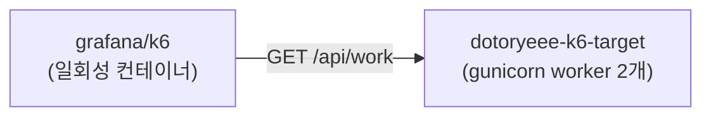

- dotoryeee-k6-target: Flask 앱을 gunicorn으로 띄운 서버. 호출마다 50ms를 쉬었다 응답하고, worker를 2개로 좁혀 부하가 몰리면 큐잉 지연이 금방 드러나게 했다
- k6: 스크립트 하나를 실행하고 끝나는 일회성 컨테이너. 별도 설치 없이 compose 네트워크에 붙어 대상 컨테이너를 이름으로 호출한다

!!! warning
    💡 k6와 측정 대상이 같은 노트북에서 함께 돌아가므로 이 글의 수치는 상대 변화로만 읽는다

이미지는 python:3.12-slim 기반에 flask 3.0.3, gunicorn 23.0.0을 고정한다. worker 2개는 실제 운영 튜닝값이 아니라 포화 구간을 짧은 테스트 안에서 확실히 보려고 일부러 좁힌 값이다.

먼저 compose 파일을 작성한다. 호스트 포트는 흔히 쓰는 8080 대신 18081로 매핑한다.

```s
vi docker-compose.yml
```

```yaml title="docker-compose.yml"
services:
  dotoryeee-k6-target:
    build: ./app
    image: dotoryeee-k6-target:local
    container_name: dotoryeee-k6-target
    ports:
      - "18081:8081"                      #흔히 쓰는 8080 대신 18081로 매핑
    environment:
      DELAY_SECONDS: "0.05"               #요청마다 넣을 인위적 지연

networks:
  default:
    name: dotoryeee-k6-net
```

대상 앱은 app 디렉터리에 Dockerfile과 함께 둔다. gunicorn을 sync worker 2개, 스레드 1개로 띄워 동시에 처리 가능한 요청 수를 정확히 2개로 제한한다.

```dockerfile title="app/Dockerfile"
FROM python:3.12-slim
WORKDIR /app
RUN pip install --no-cache-dir flask==3.0.3 gunicorn==23.0.0
COPY dotoryeee_target.py /app/
CMD ["gunicorn", "--workers", "2", "--threads", "1", "--worker-class", "sync", "--bind", "0.0.0.0:8081", "dotoryeee_target:app"]
```

```python title="app/dotoryeee_target.py"
import os
import time
from flask import Flask, jsonify

app = Flask(__name__)

DELAY_SECONDS = float(os.environ.get("DELAY_SECONDS", "0.05"))


@app.route("/healthz")
def healthz():
    return jsonify({"status": "ok"})


@app.route("/api/work")
def work():
    time.sleep(DELAY_SECONDS)
    return jsonify({"service": "dotoryeee-target", "delay_ms": int(DELAY_SECONDS * 1000)})
```

이제 스택을 올린다.

```s
docker compose up -d --build
```

```s
docker compose ps --format 'table {{.Name}}\t{{.Status}}\t{{.Ports}}'
NAME                  STATUS          PORTS
dotoryeee-k6-target   Up 10 seconds   0.0.0.0:18081->8081/tcp, [::]:18081->8081/tcp
```

curl로 실제 지연이 걸리는지 먼저 확인한다.

```s
curl -s -w "\ntime_total=%{time_total}s\n" http://localhost:18081/api/work
{"delay_ms":50,"service":"dotoryeee-target"}

time_total=0.052915s
```

설정한 50ms에 근접한 시간이 나왔다.

## k6 스크립트 작성

---

k6는 컨테이너 안에서 실행되므로 대상 주소는 환경변수 TARGET_URL로 받는다. 스크립트 디렉터리를 볼륨으로 마운트하고 grafana/k6 이미지로 돌린다.

```s
vi scripts/basic.js
```

```javascript title="scripts/basic.js"
import http from 'k6/http';
import { check } from 'k6';

export const options = {
  vus: 10,
  duration: '30s',
};

export default function () {
  const res = http.get(`${__ENV.TARGET_URL}/api/work`);
  check(res, { 'status is 200': (r) => r.status === 200 });
}
```

VU 10개가 30초 동안 api/work를 반복 호출하고, 응답 코드가 200인지 check로 검증한다.

## 기본 부하 테스트

---

```s
docker run --rm --network dotoryeee-k6-net \
  -v "$(pwd)/scripts:/scripts" \
  -e TARGET_URL=http://dotoryeee-k6-target:8081 \
  grafana/k6 run --quiet /scripts/basic.js
```

```s
  █ TOTAL RESULTS 

    checks_total.......: 1140    37.688541/s
    checks_succeeded...: 100.00% 1140 out of 1140
    checks_failed......: 0.00%   0 out of 1140

    ✓ status is 200

    HTTP
    http_req_duration..............: avg=263.74ms min=51.08ms med=264.52ms max=278.14ms p(90)=271.28ms p(95)=273.36ms
      { expected_response:true }...: avg=263.74ms min=51.08ms med=264.52ms max=278.14ms p(90)=271.28ms p(95)=273.36ms
    http_req_failed................: 0.00%  0 out of 1140
    http_reqs......................: 1140   37.688541/s

    EXECUTION
    iteration_duration.............: avg=264.37ms min=52.86ms med=265.16ms max=278.87ms p(90)=271.91ms p(95)=274.03ms
    iterations.....................: 1140   37.688541/s
    vus............................: 10     min=10        max=10
    vus_max........................: 10     min=10        max=10

    NETWORK
    data_received..................: 217 kB 7.2 kB/s
    data_sent......................: 100 kB 3.3 kB/s
```

VU 10개로 30초를 돌리자 p95는 273.36ms, RPS는 37.69/s, 에러율은 0%로 나왔다. 요청 하나의 순수 지연은 50ms인데 p95는 그 5배가 넘는다. worker가 2개뿐이라 VU 10개 중 대부분이 순서를 기다리며 큐잉 지연을 얹은 결과다. 정확히 어디서부터 밀리기 시작하는지는 뒤의 VU 스캔에서 확인한다.

같은 실행 결과를 Prometheus와 Grafana로도 함께 본다. k6 실행에 experimental-prometheus-rw 출력을 추가하고 Prometheus remote write로 받아, Grafana 대시보드에서 그래프로 확인한다.

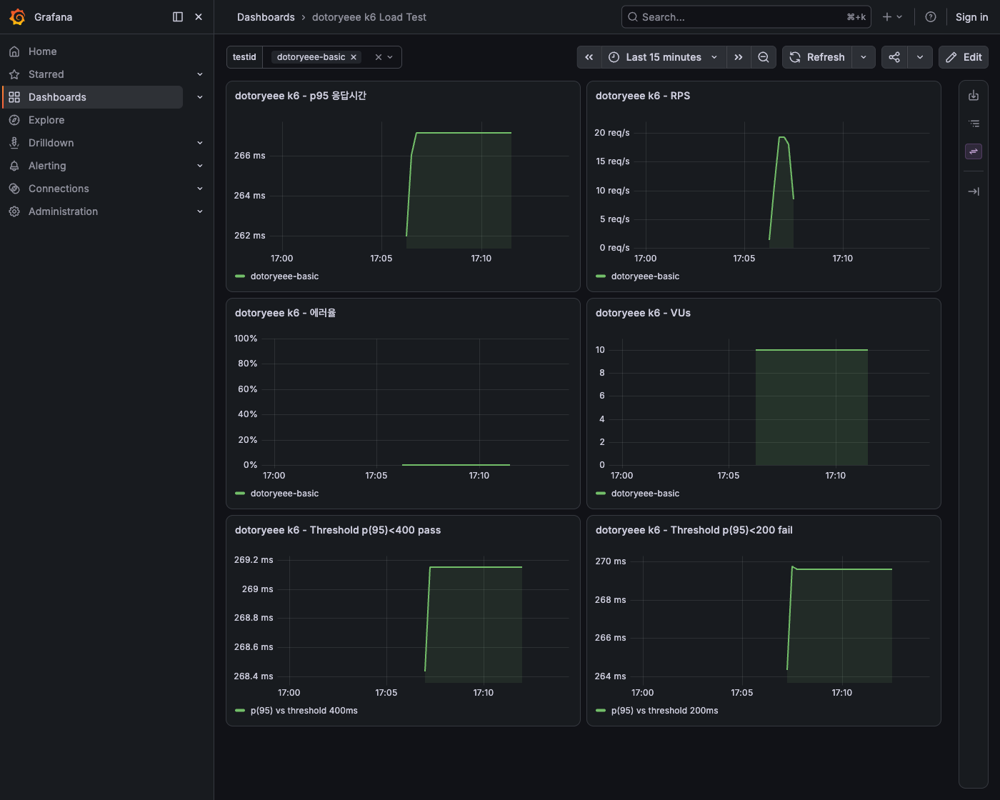

같은 구간의 p95 응답시간과 RPS를 각각 확대하면 다음과 같다.

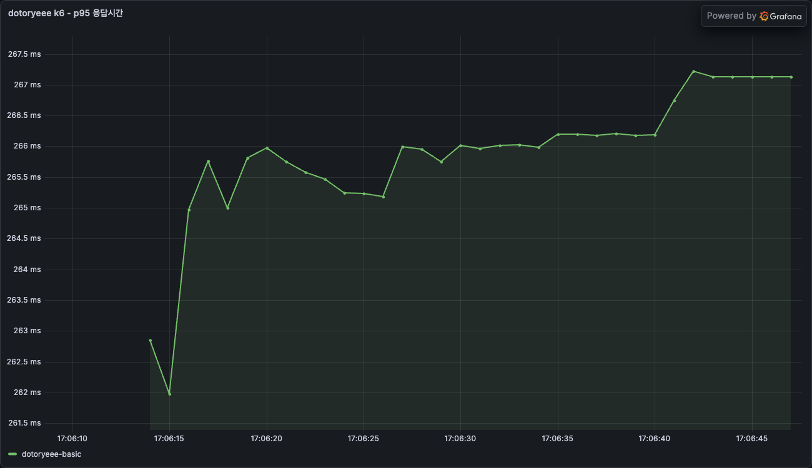

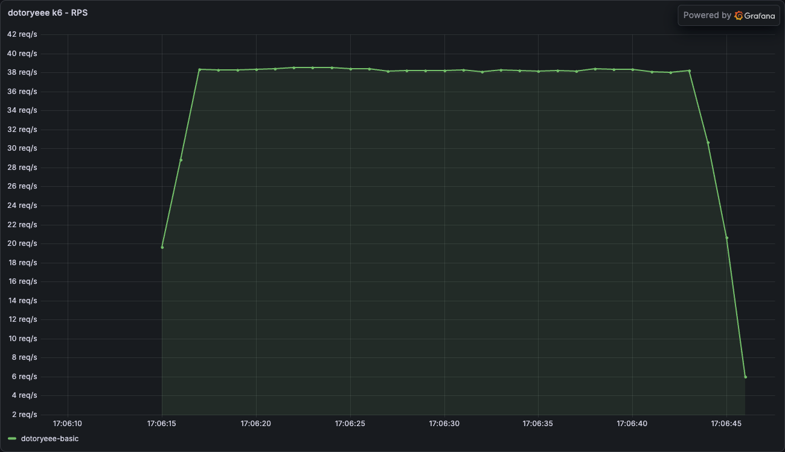

## threshold로 SLO 위반 잡아내기

---

threshold는 SLO를 k6가 실행 중에 직접 판정하도록 코드로 옮긴 것이다. 같은 부하, 같은 지표에 값만 다르게 걸어 통과와 실패를 대조한다.

```javascript title="scripts/threshold_pass.js"
import http from 'k6/http';
import { check } from 'k6';

export const options = {
  vus: 10,
  duration: '20s',
  thresholds: {
    http_req_duration: ['p(95)<400'],
  },
};

export default function () {
  const res = http.get(`${__ENV.TARGET_URL}/api/work`);
  check(res, { 'status is 200': (r) => r.status === 200 });
}
```

threshold_fail.js는 p(95)<400을 p(95)<200으로 바꾼 것 말고는 동일하다. 앞서 확인한 p95가 273ms 근처였으니 200ms 기준이면 넘어설 것으로 예상된다.

```s
docker run --rm --network dotoryeee-k6-net \
  -v "$(pwd)/scripts:/scripts" \
  -e TARGET_URL=http://dotoryeee-k6-target:8081 \
  grafana/k6 run --quiet /scripts/threshold_pass.js
echo "exit code: $?"
```

```s
  █ THRESHOLDS 

    http_req_duration
    ✓ 'p(95)<400' p(95)=273.95ms


  █ TOTAL RESULTS 

    checks_total.......: 764     37.773969/s
    checks_succeeded...: 100.00% 764 out of 764
    checks_failed......: 0.00%   0 out of 764

    HTTP
    http_req_duration..............: avg=262.73ms min=51.42ms med=263.67ms max=281.34ms p(90)=270.1ms  p(95)=273.95ms
    http_req_failed................: 0.00%  0 out of 764
    http_reqs......................: 764    37.773969/s

exit code: 0
```

p(95)<200으로 건 threshold_fail.js는 다르게 끝난다.

```s
docker run --rm --network dotoryeee-k6-net \
  -v "$(pwd)/scripts:/scripts" \
  -e TARGET_URL=http://dotoryeee-k6-target:8081 \
  grafana/k6 run --quiet /scripts/threshold_fail.js
echo "exit code: $?"
```

```s
  █ THRESHOLDS 

    http_req_duration
    ✗ 'p(95)<200' p(95)=274.26ms


  █ TOTAL RESULTS 

    checks_total.......: 762     37.635327/s
    checks_succeeded...: 100.00% 762 out of 762
    checks_failed......: 0.00%   0 out of 762

    HTTP
    http_req_duration..............: avg=263.67ms min=51.34ms med=264.5ms  max=289.92ms p(90)=272.09ms p(95)=274.26ms
    http_req_failed................: 0.00%  0 out of 762
    http_reqs......................: 762    37.635327/s

time="2026-07-26T05:25:49Z" level=error msg="thresholds on metrics 'http_req_duration' have been crossed"
exit code: 99
```

**같은 부하, 거의 같은 p95(274ms 안팎)인데 threshold 값 하나로 종료 코드가 0과 99로 갈렸다.** CI 파이프라인이라면 이 종료 코드 하나로 배포를 막을지 그냥 넘어갈지 정할 수 있다. SLO는 이 순간 숫자로 정한 약속에서, 빌드를 통과시키거나 막는 조건문으로 바뀐다.

같은 두 실행을 Grafana에서 threshold 기준선과 함께 보면 통과와 실패가 선 하나로 갈리는 모습이 그래프로도 보인다.

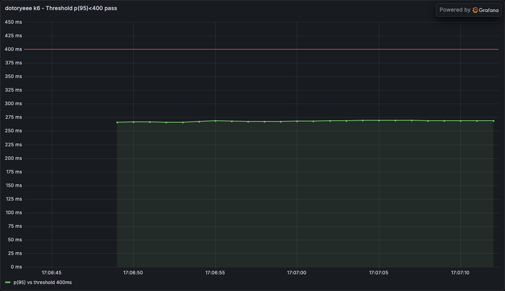

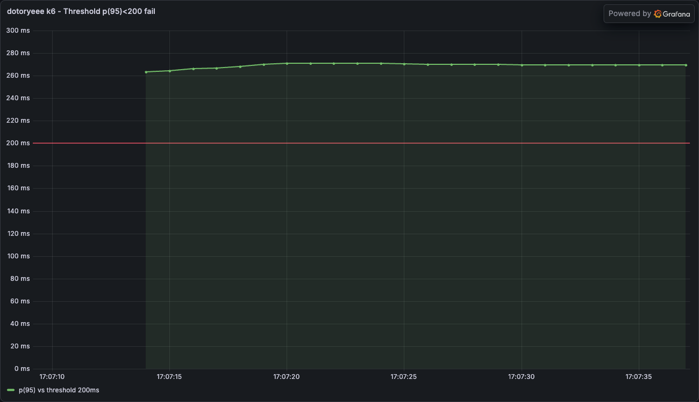

## VU를 늘려 포화점 찾기

---

!!! warning
    💡 같은 스크립트를 다시 돌려도 노트북 상태에 따라 수치는 달라진다

VU와 실행 시간을 환경변수로 받는 스크립트를 하나 더 만든다.

```javascript title="scripts/vu_scan.js"
import http from 'k6/http';
import { check } from 'k6';

export const options = {
  vus: Number(__ENV.VUS || 10),
  duration: __ENV.TEST_DURATION || '15s',
};

export default function () {
  const res = http.get(`${__ENV.TARGET_URL}/api/work`);
  check(res, { 'status is 200': (r) => r.status === 200 });
}
```

VU를 1부터 64까지 늘려가며 15초씩 돌린다.

```s
for VU in 1 2 3 4 8 16 32 64; do
  docker run --rm --network dotoryeee-k6-net \
    -v "$(pwd)/scripts:/scripts" \
    -e TARGET_URL=http://dotoryeee-k6-target:8081 \
    -e VUS=$VU -e TEST_DURATION=15s \
    grafana/k6 run --quiet /scripts/vu_scan.js
done
```

VU 16 구간의 원본 출력 일부는 다음과 같다.

```s
    http_req_duration..............: avg=414.81ms min=53.04ms med=420.99ms max=434.81ms p(90)=428.87ms p(95)=431.13ms
    http_req_failed................: 0.00%  0 out of 586
    http_reqs......................: 586    38.072065/s
```

여덟 구간의 결과를 모으면 다음과 같다.

|VU|p95|평균|RPS|에러율|
|---|---|---|---|---|
|1|57ms|53ms|18.5/s|0%|
|2|56ms|53ms|37.2/s|0%|
|3|106ms|78ms|38.0/s|0%|
|4|112ms|105ms|37.6/s|0%|
|8|216ms|208ms|38.1/s|0%|
|16|431ms|415ms|38.1/s|0%|
|32|862ms|825ms|37.8/s|0%|
|64|1720ms|1530ms|37.7/s|0%|

worker 2개, 요청당 50ms 고정이니 이론상 최대 처리량은 2 ÷ 0.05 = 40 RPS다. 실측 RPS는 VU 2에서 이미 37.2/s로 이론치 부근에 붙었고 이후 VU를 아무리 올려도 37~38/s에서 움직이지 않았다. p95는 VU 1과 2에서는 56~57ms로 순수 지연 수준을 벗어나지 않다가 VU 3부터 갈라진다. 큐잉이 시작되는 경계가 worker 수(2)와 정확히 맞아떨어진 셈이다. 포화 구간(VU 4 이상)에서는 VU가 두 배가 될 때마다 p95도 거의 두 배로 늘었다.

VU를 늘려가며 실행한 전체 구간을 Grafana에서 이어서 보면 두 지표의 움직임이 그래프로 뚜렷하게 나타난다.

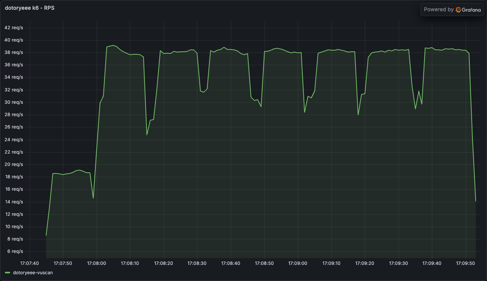

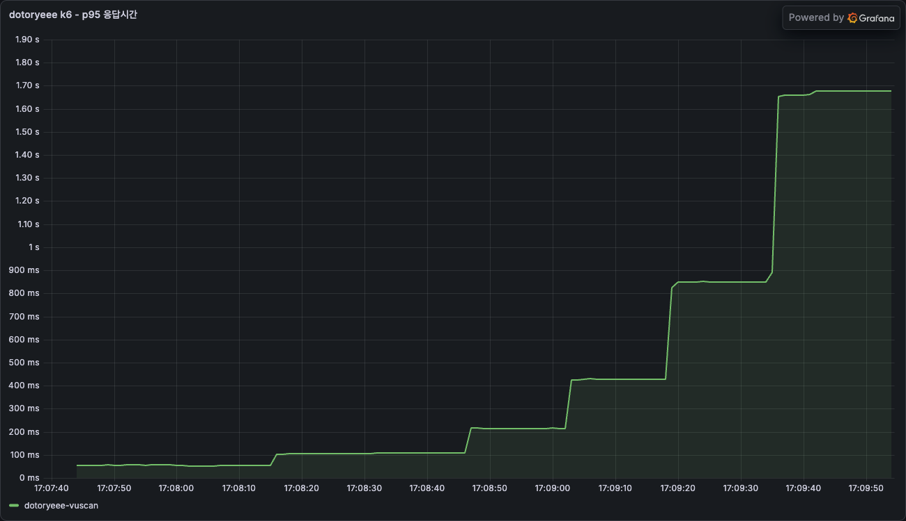

에러율은 VU 64까지도 0%를 유지했다. 이 구성의 병목은 요청을 거부하는 쪽이 아니라 순서를 기다리게 하는 쪽으로만 나타났다. 지연 SLI와 에러율 SLI가 반드시 같이 나빠지지는 않는다는 뜻이다.

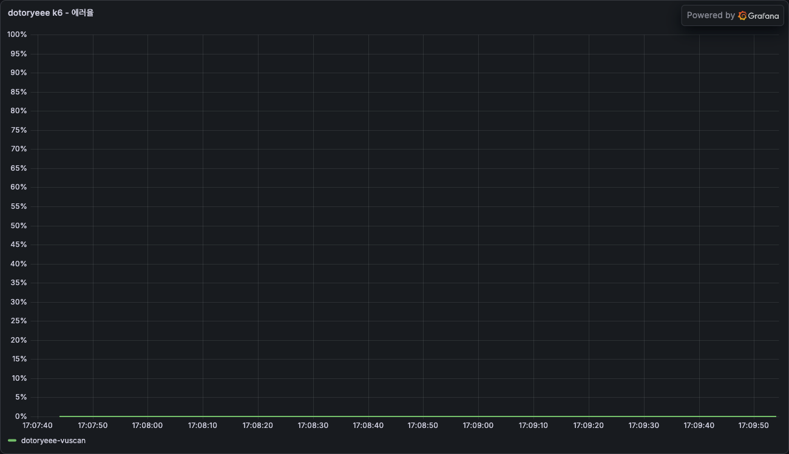

## constant-vus와 ramping-vus 대조

---

같은 최대 VU(30)를 두 가지 방식으로 걸어본다. 하나는 처음부터 30 VU를 고정으로, 하나는 0에서 30까지 서서히 올렸다 다시 내린다.

```javascript title="scripts/constant_vus.js"
import http from 'k6/http';
import { check } from 'k6';

export const options = {
  scenarios: {
    constant_load: {
      executor: 'constant-vus',
      vus: 30,
      duration: '30s',
    },
  },
};

export default function () {
  const res = http.get(`${__ENV.TARGET_URL}/api/work`);
  check(res, { 'status is 200': (r) => r.status === 200 });
}
```

ramping_vus.js는 import문과 default function은 동일하고, options.scenarios만 다음과 같이 바꾼 것이다.

```javascript
export const options = {
  scenarios: {
    ramping_load: {
      executor: 'ramping-vus',
      startVUs: 0,
      stages: [
        { duration: '10s', target: 30 },
        { duration: '10s', target: 30 },
        { duration: '10s', target: 0 },
      ],
    },
  },
};
```

constant_vus.js를 먼저 돌린다.

```s
docker run --rm --network dotoryeee-k6-net \
  -v "$(pwd)/scripts:/scripts" \
  -e TARGET_URL=http://dotoryeee-k6-target:8081 \
  grafana/k6 run /scripts/constant_vus.js
```

```s
  █ TOTAL RESULTS 

    checks_total.......: 1161    37.70995/s
    checks_succeeded...: 100.00% 1161 out of 1161
    checks_failed......: 0.00%   0 out of 1161

    HTTP
    http_req_duration..............: avg=785.04ms min=50.7ms  med=794.25ms max=820.46ms p(90)=803.49ms p(95)=806.97ms
    http_req_failed................: 0.00%  0 out of 1161
    http_reqs......................: 1161   37.70995/s
```

ramping_vus.js는 진행률 로그에서 VU 수가 오르내리는 모습이 그대로 보인다.

```s
docker run --rm --network dotoryeee-k6-net \
  -v "$(pwd)/scripts:/scripts" \
  -e TARGET_URL=http://dotoryeee-k6-target:8081 \
  grafana/k6 run /scripts/ramping_vus.js 2>&1 | tee ramping.log

grep -E '0m(01|05|10|15|20|25|30)\.0s' ramping.log
```

```s
running (0m01.0s), 02/30 VUs, 17 complete and 0 interrupted iterations
running (0m05.0s), 14/30 VUs, 168 complete and 0 interrupted iterations
running (0m10.0s), 29/30 VUs, 356 complete and 0 interrupted iterations
running (0m15.0s), 30/30 VUs, 545 complete and 0 interrupted iterations
running (0m20.0s), 30/30 VUs, 732 complete and 0 interrupted iterations
running (0m25.0s), 16/30 VUs, 920 complete and 0 interrupted iterations
running (0m30.0s), 01/30 VUs, 1102 complete and 0 interrupted iterations
```

같은 실행의 최종 요약은 다음과 같다.

```s
  █ TOTAL RESULTS 

    checks_total.......: 1104    36.738304/s
    checks_succeeded...: 100.00% 1104 out of 1104
    checks_failed......: 0.00%   0 out of 1104

    HTTP
    http_req_duration..............: avg=547.9ms  min=51ms   med=631.36ms max=827.24ms p(90)=803.68ms p(95)=809.22ms
    http_req_failed................: 0.00%  0 out of 1104
    http_reqs......................: 1104   36.738304/s
```

두 실행을 나란히 놓으면 다음과 같다.

|executor|평균|p95|RPS|완료 iteration|
|---|---|---|---|---|
|constant-vus (30 고정)|785ms|807ms|37.7/s|1161|
|ramping-vus (0→30→30→0)|548ms|809ms|36.7/s|1104|

p95는 807ms와 809ms로 거의 같다. 최고 VU에서 충분히 버티면 꼬리 지연은 결국 같은 포화 상태로 수렴한다. 반면 평균은 785ms와 548ms로 꽤 벌어졌다. ramping은 VU가 아직 낮은 초반 구간이 껴 있어 빠른 응답이 평균을 끌어내렸기 때문이다. 완료 iteration 수도 1161 대 1104로, 포화 상태에 머문 시간이 짧았던 ramping 쪽이 더 적다.

두 실행을 이어서 Grafana로 보면 VU 곡선의 모양 차이와 p95의 수렴이 한눈에 들어온다.

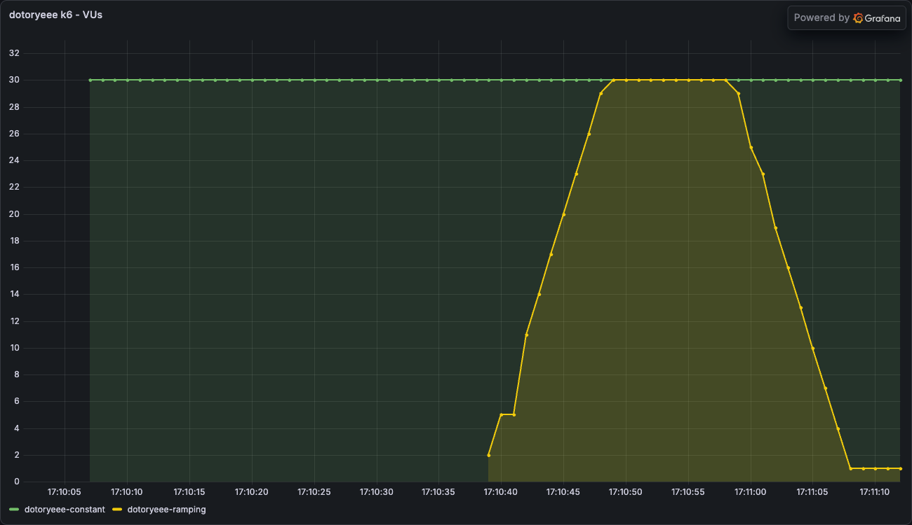

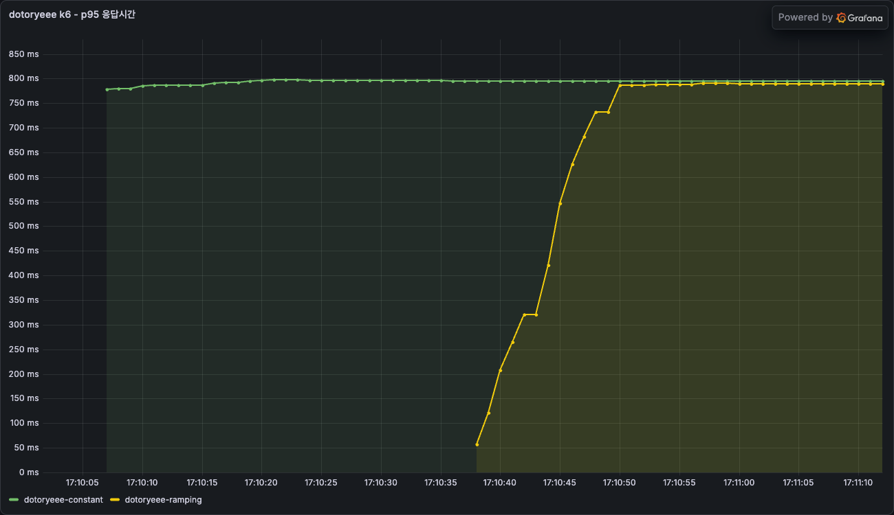

## 정리

---

```s
docker compose down -v
```

- p95·에러율·RPS는 worker 2개짜리 서버에서도 실제로 요청을 쏴 봐야 나오는 숫자였다. 정의만으로는 몇 VU에서 지연이 꺾이는지 알 수 없었다
- threshold는 SLO를 종료 코드로 옮기는 장치였다. 같은 부하에서도 threshold 값 하나로 통과와 실패가 갈렸다
- 포화점은 worker 수와 정확히 맞물렸고, 그 지점을 넘으면 지연은 VU에 비례해 커졌다. 반면 에러율은 끝까지 0%였다
- constant-vus와 ramping-vus는 꼬리 지연은 같아도 평균과 완료 요청 수는 달랐다
