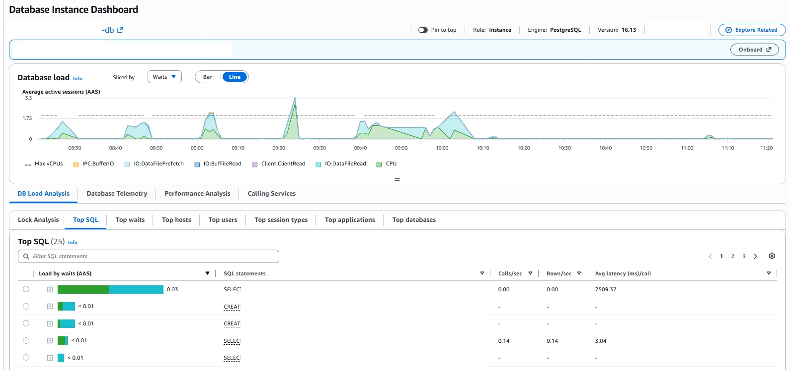
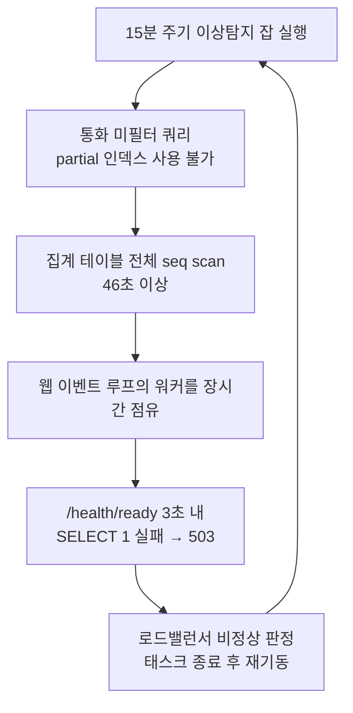

# partial 인덱스 seq scan 인시던트

DB CPU가 낮은데도 태스크가 15분마다 재시작되던 장애를 wait event로 추적했다. partial 인덱스의 함정을 찾아 인덱스 하나로 해결한 실전 기록이다.

<!-- more -->

## 증상

- 운영 중인 클라우드 비용 리포팅 서비스가 전반적으로 느려짐
- 주기적으로 도는 배치(이상탐지) 처리가 계속 실패
- 웹 컨테이너(태스크)가 대략 15분 주기로 반복 재시작
- 약 3일간 아무 알람 없이 방치됨 (탐지 공백)

---

## DB CPU Usage가 높을 줄 알았다

증상이 "커넥션이 막힌 것"처럼 보여서 처음에는 커넥션 풀 고갈을 의심했다. 커넥션이 막힌다면 보통 DB가 바쁠 때다. 그런데 지표를 다시 보니 DB CPU가 12% 남짓이었다.

| 확인 지점 | 관찰 | 해석 |
|---|---|---|
| DB CPU | 약 12% | 자원 포화 아님 → 부하 문제 아님 |
| 커넥션 | 막힘 | 특정 쿼리가 장시간 점유 의심 |
| Slow Query 로그 | 한 쿼리가 46초+ (큰 대상은 150초+) | 원인 후보 확정 |
| EXPLAIN | `Seq Scan` | 인덱스를 못 타고 테이블 풀스캔 |

---

## Performance Insights와 wait event

Slow Query 로그가 후보를 좁혀 줬다면, 원인을 확정한 건 RDS Performance Insights였다.



RDS Performance Insights. Database load(AAS)를 wait event로 쪼갠 그래프(위)와 Top SQL(아래). 15분 간격 스파이크가 파란 `IO:DataFileRead`로 차오르고, 부하 1위 쿼리의 평균 지연이 7,509ms다.

Database load(평균 활성 세션, AAS) 를 wait event로 쪼개 보면 그림이 선명해진다. 평소 0에 가깝다가 15분 간격으로 규칙적인 스파이크가 솟고, 큰 스파이크는 Max vCPUs 선(약 1.75)을 넘겨 3.5까지 치솟았다. AAS가 vCPU 수를 넘었다는 건 세션이 CPU를 다 쓴 게 아니라 무언가를 기다리며 쌓였다는 뜻이다.

스파이크 구간의 wait은 초록색 CPU가 아니라 파란색 `IO:DataFileRead` 로 채워져 있었다. 여기서 원인이 좁혀졌다.

인덱스로 몇 페이지만 집어오는 쿼리라면 IO:DataFileRead가 이만큼 크게 나올 수 없다. 테이블 데이터 파일을 디스크에서 통째로 읽고 있다는 뜻, 곧 seq scan이 남기는 전형적 신호다.

Top SQL을 부하순으로 정렬하니 1위가 곧장 드러났다. 한 쿼리가 평균 7,509ms/call로 부하를 독식하고 있었다(나머지는 3ms 안팎). Slow Query 로그의 "최대 46초"는 데이터가 많은 큰 그룹에서 나온 최댓값이었고, 이 쿼리는 평균만 7.5초여도 15분마다 강제로 도니 랭킹 최상단을 놓지 않았다. 같은 목록엔 조치로 돌린 `CREATE INDEX CONCURRENTLY`도 함께 잡혀 있었다.

---

## 진짜 원인: partial 인덱스를 못 타는 쿼리

문제의 쿼리는 15분마다 도는 이상탐지 잡이 실행하는 것으로, 그룹의 대표 통화(dominant currency)를 찾는 쿼리였다. 통화별로 합계를 내야 하니 `currency`를 필터하지 않는다.

그런데 이 집계 테이블에 걸린 인덱스는 전부 `WHERE currency = 'USD'` partial(부분) 인덱스였다.

```sql
-- 집계 테이블에 있던 인덱스는 전부 partial (USD 전용)
CREATE INDEX idx_daily_cost_usd
  ON daily_cost_agg (group_id, usage_date)
  WHERE currency = 'USD';          -- ← 부분 조건

-- 대표 통화를 찾는 쿼리는 currency를 필터하지 않는다
SELECT currency, SUM(amount)
FROM daily_cost_agg
WHERE group_id = :group_id
GROUP BY currency;                 -- ← WHERE에 currency 없음
```

핵심은 이것이다. **partial 인덱스는 쿼리의 predicate가 인덱스의 부분 조건을 포함한다고 플래너가 증명할 수 있을 때만 쓰인다.** 위 쿼리에는 `currency = 'USD'` 조건이 없으니(있으면 안 되는 게 맞다) 플래너는 이 인덱스를 후보에서 제외하고, 다른 인덱스도 없으니 테이블 전체 seq scan으로 떨어진다.

```text
EXPLAIN 결과 (before)

Seq Scan on daily_cost_agg  (rows=수백만)
  Filter: (group_id = :group_id)
→ 실측 46초 이상
```

이 잡은 웹(uvicorn) 프로세스의 이벤트 루프에서 도는 인프로세스 스케줄러(APScheduler) 잡이었다. 즉 46초짜리 쿼리가 도는 동안 그 워커가 붙잡힌다. 그 사이 로드밸런서의 헬스체크(`/health/ready`, 3초 안에 `SELECT 1`)가 응답을 못 받아 503이 나고, 로드밸런서는 태스크를 비정상으로 판정해 죽이고 새로 띄운다. 그리고 새 태스크에서 잡이 또 돌면서 같은 일이 반복된다.


```mermaid
flowchart TD
    A[15분 주기 이상탐지 잡 실행] --> B[통화 미필터 쿼리<br/>partial 인덱스 사용 불가]
    B --> C[집계 테이블 전체 seq scan<br/>46초 이상]
    C --> D[웹 이벤트 루프의 워커를 장시간 점유]
    D --> E["/health/ready 3초 내<br/>SELECT 1 실패 → 503"]
    E --> F[로드밸런서 비정상 판정<br/>태스크 종료 후 재기동]
    F --> A
```

---

## 조치

부분 조건과 무관하게 `(group_id, usage_date)`로 대상을 좁히는 full 인덱스를 추가했다. partial이 아니므로 통화 필터가 없는 쿼리도 탈 수 있다.

```sql
-- predicate에 currency가 없어도 group_id로 바로 좁히는 full 인덱스
CREATE INDEX IF NOT EXISTS idx_daily_cost_group_date
  ON daily_cost_agg (group_id, usage_date);
```

장애 대응 중에는 손으로 먼저 인덱스를 만들어 급한 불을 껐고, 이후 같은 `CREATE INDEX IF NOT EXISTS` 문을 마이그레이션 파일에도 넣어 스키마에 영구히 남겼다. 이미 인덱스가 있는 상태에서 마이그레이션이 다시 실행돼도 `IF NOT EXISTS` 덕분에 아무 것도 하지 않고 넘어가므로(중복 생성 오류 없음) 안전하다.

---

## 검증

```text
EXPLAIN 결과 (after)

Index Scan using idx_daily_cost_group_date on daily_cost_agg
  Index Cond: (group_id = :group_id)
→ 46초 → 1ms
```

- 문제 쿼리: 46초 → 1ms
- 라이브에서 이상탐지 잡이 전체 대상을 432ms에 완료
- 태스크가 잡 주기를 넘겨 살아남음 → 헬스체크 실패 0회
- 잡이 완료 기록(`last_run_date`)을 남겨 같은 주기 재실행을 스스로 건너뜀

---

"느리다"의 진짜 원인은 대개 자원 포화가 아니라 특정 쿼리다. DB CPU가 낮은데 커넥션이 막힌다면 Slow Query 로그부터 본다. partial 인덱스는 강력하지만 쿼리 predicate가 인덱스의 부분 조건을 벗어나는 순간 seq scan으로 떨어지므로, 새 조회 경로는 EXPLAIN으로 실제 인덱스를 타는지 확인하고 쓴다.
