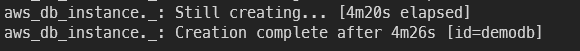

# Terraform Practice

<aside>
💡 테라폼을 아키텍처를 연습해봅니다

</aside>

- EC2에 SSH 접속을 위한 키페어 생성
    1. 비밀키를 생성합니다

    ```s
    ssh-keygen -t rsa -b 2048 -f ~/dotoryeee.pem -q -N ""
    ```
        
    2. pem을 사용하려면 권한을 수정해야 합니다

    ```s
    chmod 400 ~/dotoryeee.pem
    ```
        
    3. AWS에 넘겨줄 공개키를 생성합니다

    ```s
    ssh-keygen -y -f ~/dotoryeee.pem > ~/dotoryeee.pub
    ```
<!-- more -->
- Terraform Docs
    
    [](https://registry.terraform.io/providers/hashicorp/aws/latest/docs)
    
- 에러가 자주 났던 부분
    1. EC2 t2.micro는 서울기준 2a, 2c에서만 지원됩니다
    2. VPC 사이더 범위가 서브넷보다 넓은지 확인
    3. MySQL RDS생성시 allocated_storage값에 0은 불가능
    4. DB인스턴스는 별도로 서브넷 그룹을 생성해야 함

    ```s
    Error: Error creating DB Instance: InvalidParameterCombination: The DB instance and EC2 security group are in different VPCs. The DB instance is in vpc-7ae25b11 and the EC2 security group is in vpc-07d48e73dba07404a
    status code: 400, request id: 25f97e75-89d9-4323-9cd3-b09e83675d4e on [rds.tf](http://rds.tf/) line 16, in resource "aws_db_instance" "rds":
    16: resource "aws_db_instance" "rds" {
    ```
        
    5. RDS는 반드시 서브넷 2개 이상을 묶어서 구성
    6. 베스천 호스트 사용하는 RDS는 당연시 퍼블릭 엑세스 제한
        
    ```s
    Error: Error creating DB Instance: InvalidVPCNetworkStateFault: Cannot create a publicly accessible DBInstance.  The specified VPC does not support DNS resolution, DNS hostnames, or both. Update the VPC and then try again
    status code: 400, request id: d26672f9-7f0a-40ac-9e17-6fd0b9fa2558
    ```
        
    7. ssh 접속을 위한 map_public_ip_on_launch (서브넷) 당연히 true
    8. RDS는 생성에 오랜 시간이 걸리는 점 유의
        
        
        
    9. 보안그룸 이름은 소문자 sg로 시작할 수 없음
    10. RDS 보안그룹은 security_group_names 대신 vpc_security_group_ids 사용

    ```
    Error: Error creating DB Instance: InvalidParameterCombination: DB Security Groups can only be associated with VPC DB Instances using API versions 2012-01-15 through 2012-09-17.
    ```
        

## 연습1 (VPC, Subnets, EC2, IGW)

---

- 구성
    
    
    
- 코드
    
    ```terraform linenums="1"
    #---------------VPC-----------------
    resource "aws_vpc" "main" {
        cidr_block = "10.0.0.0/16"
        instance_tenancy = "default" #전용인스턴스 사용, default는 사용 하지 않음을 의미
        enable_dns_hostnames = true

        tags = {
            Name = "vpc_practice_01"
        }
    }
    #---------------IGW-----------------
    resource "aws_internet_gateway" "default" {
        vpc_id = aws_vpc.main.id

        tags = {
            Name = "igw_practice_01"
        }
    }
    #---------------Subnet-----------------
    resource "aws_subnet" "public_01" {
        vpc_id = aws_vpc.main.id

        cidr_block = "10.0.0.0/24"
        availability_zone = "ap-northeast-2a"

        map_public_ip_on_launch = true

        tags = {
            Name = "public_subnet_01"
        }
    }
    resource "aws_subnet" "public_02" {
        vpc_id = aws_vpc.main.id

        cidr_block = "10.0.1.0/24"
        availability_zone = "ap-northeast-2c"

        map_public_ip_on_launch = true

        tags = {
            Name = "public_subnet_02"
        }
    }
    #--------------Association--------------
    resource "aws_route_table_association" "public_01_association" {
        subnet_id = aws_subnet.public_01.id
        route_table_id = aws_route_table.public.id
    }

    resource "aws_route_table_association" "public_02_association" {
        subnet_id = aws_subnet.public_02.id
        route_table_id = aws_route_table.public.id
    }
    #-------------Route table---------------
    resource "aws_route_table" "public" {
        vpc_id = aws_vpc.main.id

        tags = {
            Name = "public_route_table"
        }
    }
    #-----------Route table Routes------------
    resource "aws_route" "public_sub_IGW" {
        route_table_id = aws_route_table.public.id
        destination_cidr_block = "0.0.0.0/0"
        gateway_id = aws_internet_gateway.default.id
    }
    #----------Security Group for EC2----------
    resource "aws_security_group" "practice_01" {
        vpc_id = aws_vpc.main.id
        name = "practice_01_SG"
        description = "SG_for_EC2"

        #-----------인바운드-----------
        ingress {
            from_port = 22
            to_port = 22
            protocol = "tcp"
            cidr_blocks = ["0.0.0.0/0"]
            description = "open SSH from Anywhere"
        }

        #----------아웃바운드-----------
        egress {
            from_port = 0 #모든 포트
            to_port = 0 
            protocol = "-1" #모든 프로토콜
            cidr_blocks = ["0.0.0.0/0"] #리스트 형태도 가능
            description = "open all port from anywhere"
        }
    }
    #----------ready Public Key--------------
    resource "aws_key_pair" "practice_01" {
        key_name = "practice_01"
        public_key = "ssh-rsa...... 키 삭제"
    }
    #---------public_01  EC2 Instance---------
    resource "aws_instance" "dotoryeee-EC2-01" {
        ami = "ami-006e2f9fa7597680a"
        instance_type = "t2.micro"
        
        subnet_id = aws_subnet.public_01.id

        key_name = aws_key_pair.practice_01.key_name

        vpc_security_group_ids = [aws_security_group.practice_01.id]

        tags = {
            Name = "doto_EC2_01"
        }
    }
    #---------public_02  EC2 Instance---------
    resource "aws_instance" "dotoryeee-EC2-02" {
        ami = "ami-006e2f9fa7597680a"
        instance_type = "t2.micro"

        subnet_id = aws_subnet.public_02.id

        key_name = aws_key_pair.practice_01.key_name

        vpc_security_group_ids = [aws_security_group.practice_01.id]

        tags = {
            Name = "doto_EC2_02"
        }
    }
    ```

- terraform apply

    ```json linenums="1"
    An execution plan has been generated and is shown below.
    Resource actions are indicated with the following symbols:
      + create

    Terraform will perform the following actions:

      # aws_instance.dotoryeee-EC2-01 will be created
      + resource "aws_instance" "dotoryeee-EC2-01" {
          + ami                          = "ami-006e2f9fa7597680a"
          + arn                          = (known after apply)
          + associate_public_ip_address  = (known after apply)
          + availability_zone            = (known after apply)
          + cpu_core_count               = (known after apply)
          + cpu_threads_per_core         = (known after apply)
          + get_password_data            = false
          + host_id                      = (known after apply)
          + id                           = (known after apply)
          + instance_state               = (known after apply)
          + instance_type                = "t2.micro"
          + ipv6_address_count           = (known after apply)
          + ipv6_addresses               = (known after apply)
          + key_name                     = "practice_01"
          + outpost_arn                  = (known after apply)
          + password_data                = (known after apply)
          + placement_group              = (known after apply)
          + primary_network_interface_id = (known after apply)
          + private_dns                  = (known after apply)
          + private_ip                   = (known after apply)
          + public_dns                   = (known after apply)
          + public_ip                    = (known after apply)
          + secondary_private_ips        = (known after apply)
          + security_groups              = (known after apply)
          + subnet_id                    = (known after apply)
          + tags                         = {
              + "Name" = "doto_EC2_01"
            }
          + tenancy                      = (known after apply)
          + vpc_security_group_ids       = (known after apply)

          + ebs_block_device {
              + delete_on_termination = (known after apply)
              + device_name           = (known after apply)
              + encrypted             = (known after apply)
              + iops                  = (known after apply)
              + kms_key_id            = (known after apply)
              + snapshot_id           = (known after apply)
              + tags                  = (known after apply)
              + throughput            = (known after apply)
              + volume_id             = (known after apply)
              + volume_size           = (known after apply)
              + volume_type           = (known after apply)
            }

          + enclave_options {
              + enabled = (known after apply)
            }

          + ephemeral_block_device {
              + device_name  = (known after apply)
              + no_device    = (known after apply)
              + virtual_name = (known after apply)
            }

          + metadata_options {
              + http_endpoint               = (known after apply)
              + http_put_response_hop_limit = (known after apply)
              + http_tokens                 = (known after apply)
            }

          + network_interface {
              + delete_on_termination = false
              + device_index          = 0
              + network_interface_id  = (known after apply)
            }

          + root_block_device {
              + delete_on_termination = (known after apply)
              + device_name           = (known after apply)
              + encrypted             = (known after apply)
              + iops                  = (known after apply)
              + kms_key_id            = (known after apply)
              + tags                  = (known after apply)
              + throughput            = (known after apply)
              + volume_id             = (known after apply)
              + volume_size           = (known after apply)
              + volume_type           = (known after apply)
            }
        }

      # aws_instance.dotoryeee-EC2-02 will be created
      + resource "aws_instance" "dotoryeee-EC2-02" {
          + ami                          = "ami-006e2f9fa7597680a"
          + arn                          = (known after apply)
          + associate_public_ip_address  = (known after apply)
          + availability_zone            = (known after apply)
          + cpu_core_count               = (known after apply)
          + cpu_threads_per_core         = (known after apply)
          + get_password_data            = false
          + host_id                      = (known after apply)
          + id                           = (known after apply)
          + instance_state               = (known after apply)
          + instance_type                = "t2.micro"
          + ipv6_address_count           = (known after apply)
          + ipv6_addresses               = (known after apply)
          + key_name                     = "practice_01"
          + outpost_arn                  = (known after apply)
          + password_data                = (known after apply)
          + placement_group              = (known after apply)
          + primary_network_interface_id = (known after apply)
          + private_dns                  = (known after apply)
          + private_ip                   = (known after apply)
          + public_dns                   = (known after apply)
          + public_ip                    = (known after apply)
          + secondary_private_ips        = (known after apply)
          + security_groups              = (known after apply)
          + subnet_id                    = (known after apply)
          + tags                         = {
              + "Name" = "doto_EC2_02"
            }
          + tenancy                      = (known after apply)
          + vpc_security_group_ids       = (known after apply)

          + ebs_block_device {
              + delete_on_termination = (known after apply)
              + device_name           = (known after apply)
              + encrypted             = (known after apply)
              + iops                  = (known after apply)
              + kms_key_id            = (known after apply)
              + snapshot_id           = (known after apply)
              + tags                  = (known after apply)
              + throughput            = (known after apply)
              + volume_id             = (known after apply)
              + volume_size           = (known after apply)
              + volume_type           = (known after apply)
            }

          + enclave_options {
              + enabled = (known after apply)
            }

          + ephemeral_block_device {
              + device_name  = (known after apply)
              + no_device    = (known after apply)
              + virtual_name = (known after apply)
            }

          + metadata_options {
              + http_endpoint               = (known after apply)
              + http_put_response_hop_limit = (known after apply)
              + http_tokens                 = (known after apply)
            }

          + network_interface {
              + delete_on_termination = false
              + device_index          = 0
              + network_interface_id  = (known after apply)
            }

          + root_block_device {
              + delete_on_termination = (known after apply)
              + device_name           = (known after apply)
              + encrypted             = (known after apply)
              + iops                  = (known after apply)
              + kms_key_id            = (known after apply)
              + tags                  = (known after apply)
              + throughput            = (known after apply)
              + volume_id             = (known after apply)
              + volume_size           = (known after apply)
              + volume_type           = (known after apply)
            }
        }

      # aws_internet_gateway.default will be created
      + resource "aws_internet_gateway" "default" {
          + arn      = (known after apply)
          + id       = (known after apply)
          + owner_id = (known after apply)
          + tags     = {
              + "Name" = "igw_practice_01"
            }
          + vpc_id   = (known after apply)
        }

      # aws_key_pair.practice_01 will be created
      + resource "aws_key_pair" "practice_01" {
          + arn         = (known after apply)
          + fingerprint = (known after apply)
          + id          = (known after apply)
          + key_name    = "practice_01"
          + key_pair_id = (known after apply)
          + public_key  = "ssh-rsa AAAAB3NzaC1yc2EAAAADAQABAAABAQDD5D5mHSD/vdgcGmh6Kd57DqLxebcvbrUsHj8DYDW0+9MSvvK874Bm4hpqHliYze/ht7VnzL5+A5qZkCevKGBDeJNmR/QDHccCsCfRuyEmzMlvj3SxzYSH2N4lBG6eZZbQ+0yRl7ny3aeyol5boDkztLZ/PZwVR5IH6BgsNiGClSDtuf2CYoKN7hQufjeuCDcLlQa+ItFa4abMe/mWtMeEh7+ZpC+0KAFFvqY80OCtuUdqq7tcP8uHzQy9mPKvKBieJYitUoStjFEMAro1v34u6193Qgk6DAhyMom4GmLc2+tTyKMsvBlRKUOb87F+2zsATX3Ahz9cMpEkfPTkY15V dotoryeee@i5-6500"
        }

      # aws_network_interface.public_01 will be created
      + resource "aws_network_interface" "public_01" {
          + id                 = (known after apply)
          + ipv6_address_count = (known after apply)
          + ipv6_addresses     = (known after apply)
          + mac_address        = (known after apply)
          + outpost_arn        = (known after apply)
          + private_dns_name   = (known after apply)
          + private_ip         = (known after apply)
          + private_ips        = (known after apply)
          + private_ips_count  = (known after apply)
          + security_groups    = (known after apply)
          + source_dest_check  = true
          + subnet_id          = (known after apply)
          + tags               = {
              + "Name" = "interface_public_01"
            }

          + attachment {
              + attachment_id = (known after apply)
              + device_index  = (known after apply)
              + instance      = (known after apply)
            }
        }

      # aws_network_interface.public_02 will be created
      + resource "aws_network_interface" "public_02" {
          + id                 = (known after apply)
          + ipv6_address_count = (known after apply)
          + ipv6_addresses     = (known after apply)
          + mac_address        = (known after apply)
          + outpost_arn        = (known after apply)
          + private_dns_name   = (known after apply)
          + private_ip         = (known after apply)
          + private_ips        = (known after apply)
          + private_ips_count  = (known after apply)
          + security_groups    = (known after apply)
          + source_dest_check  = true
          + subnet_id          = (known after apply)
          + tags               = {
              + "Name" = "interface_public_02"
            }

          + attachment {
              + attachment_id = (known after apply)
              + device_index  = (known after apply)
              + instance      = (known after apply)
            }
        }

      # aws_route.public_sub_IGW will be created
      + resource "aws_route" "public_sub_IGW" {
          + destination_cidr_block     = "0.0.0.0/0"
          + destination_prefix_list_id = (known after apply)
          + egress_only_gateway_id     = (known after apply)
          + gateway_id                 = (known after apply)
          + id                         = (known after apply)
          + instance_id                = (known after apply)
          + instance_owner_id          = (known after apply)
          + local_gateway_id           = (known after apply)
          + nat_gateway_id             = (known after apply)
          + network_interface_id       = (known after apply)
          + origin                     = (known after apply)
          + route_table_id             = (known after apply)
          + state                      = (known after apply)
        }

      # aws_route_table.public will be created
      + resource "aws_route_table" "public" {
          + id               = (known after apply)
          + owner_id         = (known after apply)
          + propagating_vgws = (known after apply)
          + route            = (known after apply)
          + tags             = {
              + "Name" = "public_route_table"
            }
          + vpc_id           = (known after apply)
        }

      # aws_route_table_association.public_01_association will be created
      + resource "aws_route_table_association" "public_01_association" {
          + id             = (known after apply)
          + route_table_id = (known after apply)
          + subnet_id      = (known after apply)
        }

      # aws_route_table_association.public_02_association will be created
      + resource "aws_route_table_association" "public_02_association" {
          + id             = (known after apply)
          + route_table_id = (known after apply)
          + subnet_id      = (known after apply)
        }

      # aws_security_group.practice_01 will be created
      + resource "aws_security_group" "practice_01" {
          + arn                    = (known after apply)
          + description            = "SG_for_EC2"
          + egress                 = [
              + {
                  + cidr_blocks      = [
                      + "0.0.0.0/0",
                    ]
                  + description      = "open all port from anywhere"
                  + from_port        = 0
                  + ipv6_cidr_blocks = []
                  + prefix_list_ids  = []
                  + protocol         = "-1"
                  + security_groups  = []
                  + self             = false
                  + to_port          = 0
                },
            ]
          + id                     = (known after apply)
          + ingress                = [
              + {
                  + cidr_blocks      = [
                      + "0.0.0.0/0",
                    ]
                  + description      = "open SSH from Anywhere"
                  + from_port        = 22
                  + ipv6_cidr_blocks = []
                  + prefix_list_ids  = []
                  + protocol         = "tcp"
                  + security_groups  = []
                  + self             = false
                  + to_port          = 22
                },
            ]
          + name                   = "practice_01_SG"
          + name_prefix            = (known after apply)
          + owner_id               = (known after apply)
          + revoke_rules_on_delete = false
          + vpc_id                 = (known after apply)
        }

      # aws_subnet.public_01 will be created
      + resource "aws_subnet" "public_01" {
          + arn                             = (known after apply)
          + assign_ipv6_address_on_creation = false
          + availability_zone               = "ap-northeast-2a"
          + availability_zone_id            = (known after apply)
          + cidr_block                      = "10.0.0.0/24"
          + id                              = (known after apply)
          + ipv6_cidr_block_association_id  = (known after apply)
          + map_public_ip_on_launch         = true
          + owner_id                        = (known after apply)
          + tags                            = {
              + "Name" = "public_subnet_01"
            }
          + vpc_id                          = (known after apply)
        }

      # aws_subnet.public_02 will be created
      + resource "aws_subnet" "public_02" {
          + arn                             = (known after apply)
          + assign_ipv6_address_on_creation = false
          + availability_zone               = "ap-northeast-2c"
          + availability_zone_id            = (known after apply)
          + cidr_block                      = "10.0.1.0/24"
          + id                              = (known after apply)
          + ipv6_cidr_block_association_id  = (known after apply)
          + map_public_ip_on_launch         = true
          + owner_id                        = (known after apply)
          + tags                            = {
              + "Name" = "public_subnet_02"
            }
          + vpc_id                          = (known after apply)
        }

      # aws_vpc.main will be created
      + resource "aws_vpc" "main" {
          + arn                              = (known after apply)
          + assign_generated_ipv6_cidr_block = false
          + cidr_block                       = "10.0.0.0/16"
          + default_network_acl_id           = (known after apply)
          + default_route_table_id           = (known after apply)
          + default_security_group_id        = (known after apply)
          + dhcp_options_id                  = (known after apply)
          + enable_classiclink               = (known after apply)
          + enable_classiclink_dns_support   = (known after apply)
          + enable_dns_hostnames             = true
          + enable_dns_support               = true
          + id                               = (known after apply)
          + instance_tenancy                 = "default"
          + ipv6_association_id              = (known after apply)
          + ipv6_cidr_block                  = (known after apply)
          + main_route_table_id              = (known after apply)
          + owner_id                         = (known after apply)
          + tags                             = {
              + "Name" = "vpc_practice_01"
            }
        }

    Plan: 14 to add, 0 to change, 0 to destroy.
    ```

- 결과
    
    
    
    
    
    
    
    EC2 SSH 접속까지 성공
    

## 연습2 (RDS, Bastion)

---

- 구성
    
    
    
- 코드
    - variables.tf
        
    ```terraform title="variables.tf" linenums="1"
    variable "aws_region" {
      description = "region for AWS"
    }

    variable "vpc_name" {
      description = "name for practice_02 VPC"
    }

    variable "subnet_name" {
    }

    variable "instance_names" {
      type = list(string)
    }

    variable "az" {
      type    = list(string)
      default = ["ap-northeast-2a"]
    }

    variable "ami_id_maps" {
      type    = map(any)
      default = {}
    }

    variable "instance_type" {
    }
    ```

        - terraform.tfvars

    ``` linenums="1"
    aws_region = "ap-northeast-2"

    vpc_name = "vpc_practice_02"

    subnet_name = "subnet_practice_02"

    az = [
        "ap-northeast-2a", 
        "ap-northeast-2c"
    ]

    instance_names = [
        "public-01", 
        "public-02"
    ]

    ami_id_maps = {
        amazon_linux_2 = "ami-006e2f9fa7597680a"
        ubuntu_20_04 = "ami-00f1068284b9eca92"
    }

    instance_type = "t2.micro"
    ```

    - provider.tf

    ``` linenums="1"
    provider "aws" {
      region = var.aws_region
    }
    ```

    - vpc.tf

    ``` linenums="1"
    #------------VPC-------------
    resource "aws_vpc" "main" {
      cidr_block       = "10.0.0.0/16"
      instance_tenancy = "default"

      enable_dns_support = "true"

      tags = {
        Name = var.vpc_name
      }
    }
    ################PUBLIC SUBNET#################
    #-------------IGW---------------
    resource "aws_internet_gateway" "default" {
      vpc_id = aws_vpc.main.id

      tags = {
        Name = "practice_02"
      }
    }
    #------------subnet-------------
    resource "aws_subnet" "public" {
      vpc_id     = aws_vpc.main.id
      cidr_block = "10.0.0.0/24"

      availability_zone = var.az[0]

      map_public_ip_on_launch = true

      tags = {
        "Name" = "public_subnet"
      }
    }
    #------------association-------------
    resource "aws_route_table_association" "association1" {
      subnet_id      = aws_subnet.public.id
      route_table_id = aws_route_table.public.id
    }
    #------------router table------------
    resource "aws_route_table" "public" {
      vpc_id = aws_vpc.main.id

      route {
        cidr_block = "0.0.0.0/0"
        gateway_id = aws_internet_gateway.default.id
      }

      tags = {
        "Name" = "public_table"
      }
    }
    ################PRIVATE SUBNET#################
    #-------------subnet-------------
    resource "aws_subnet" "private" {
      vpc_id = aws_vpc.main.id

      availability_zone = var.az[0]

      cidr_block = "10.0.1.0/24"
    }

    resource "aws_subnet" "private2" {
      vpc_id = aws_vpc.main.id

      availability_zone = var.az[1]

      cidr_block = "10.0.2.0/24"
    }
    ```

    - ec2.tf

    ``` linenums="1"
    #----------------SG---------------------
    resource "aws_security_group" "public_ec2" {
      vpc_id = aws_vpc.main.id

      name        = "allow SSH"
      description = "allow SSH from anywhere"

      ingress {
        from_port   = 22
        to_port     = 22
        protocol    = "tcp"
        cidr_blocks = ["0.0.0.0/0"]
      }

      egress {
        from_port   = 0
        to_port     = 0
        protocol    = "-1"
        cidr_blocks = ["0.0.0.0/0"]
      }

      tags = {
        "Name" = "SG-for-publicEC2"
      }
    }
    #-------------Key pair--------------
    resource "aws_key_pair" "dotoryeee" {
      key_name   = "dotoryeee"
      public_key = "ssh-rsa AAAAB3NzaC1yc2EAAAADAQABAAABAQDD5D5mHSD/vdgcGmh6Kd57DqLxebcvbrUsHj8DYDW0+9MSvvK874Bm4hpqHliYze/ht7VnzL5+A5qZkCevKGBDeJNmR/QDHccCsCfRuyEmzMlvj3SxzYSH2N4lBG6eZZbQ+0yRl7ny3aeyol5boDkztLZ/PZwVR5IH6BgsNiGClSDtuf2CYoKN7hQufjeuCDcLlQa+ItFa4abMe/mWtMeEh7+ZpC+0KAFFvqY80OCtuUdqq7tcP8uHzQy9mPKvKBieJYitUoStjFEMAro1v34u6193Qgk6DAhyMom4GmLc2+tTyKMsvBlRKUOb87F+2zsATX3Ahz9cMpEkfPTkY15V dotoryeee@i5-6500"
    }
    #----------------EC2---------------------
    resource "aws_instance" "public_01" {
      ami           = var.ami_id_maps["amazon_linux_2"]
      instance_type = var.instance_type

      subnet_id = aws_subnet.public.id

      vpc_security_group_ids = [aws_security_group.public_ec2.id]

      key_name = aws_key_pair.dotoryeee.key_name

      tags = {
        Name = var.instance_names[0]
      }
    }

    resource "aws_instance" "public_02" {
      ami           = var.ami_id_maps["ubuntu_20_04"]
      instance_type = var.instance_type

      subnet_id = aws_subnet.public.id

      vpc_security_group_ids = [aws_security_group.public_ec2.id]

      key_name = aws_key_pair.dotoryeee.key_name

      tags = {
        Name = var.instance_names[1]
      }
    }
    ```

- rds.tf

    !!! warning

        💡 지금은 aws_db_instance에서 name 대신 db_name으로 작성합니다

    ```terraform title="rds.tf" linenums="1"
    #--------------Security Group----------------
    resource "aws_security_group" "rds" {
      vpc_id = aws_vpc.main.id
      name   = "SG-for-RDS"

      ingress {
        from_port       = 3306
        to_port         = 3306
        protocol        = "tcp"
        security_groups = [aws_security_group.public_ec2.id]
      }
    }
    #---------------RDS Subnet Group--------
    resource "aws_db_subnet_group" "_" {
      name = "subnet_for_rds"
      subnet_ids = [
        aws_subnet.private.id,
        aws_subnet.private2.id
      ]
    }
    #----------------RDS instance-------------
    resource "aws_db_instance" "_" {
      #settings for Free tier
      instance_class      = "db.t2.micro"
      skip_final_snapshot = true
      allocated_storage   = 10
      engine              = "mysql"
      engine_version      = "5.7"
      #settings for Free tier

      identifier = "demodb"
      username   = "root"
      password   = "password"
      name       = "mydb"

      db_subnet_group_name = aws_db_subnet_group._.name

      vpc_security_group_ids = [aws_security_group.rds.id]
    }
    ```
            
    - terraform apply
        
    ``` linenums="1"
    An execution plan has been generated and is shown below.
    Resource actions are indicated with the following symbols:
      + create

    Terraform will perform the following actions:

      # aws_db_instance._ will be created
      + resource "aws_db_instance" "_" {
          + address                               = (known after apply)
          + allocated_storage                     = 10
          + apply_immediately                     = (known after apply)
          + arn                                   = (known after apply)
          + auto_minor_version_upgrade            = true
          + availability_zone                     = (known after apply)
          + backup_retention_period               = (known after apply)
          + backup_window                         = (known after apply)
          + ca_cert_identifier                    = (known after apply)
          + character_set_name                    = (known after apply)
          + copy_tags_to_snapshot                 = false
          + db_subnet_group_name                  = "subnet_for_rds"
          + delete_automated_backups              = true
          + endpoint                              = (known after apply)
          + engine                                = "mysql"
          + engine_version                        = "5.7"
          + hosted_zone_id                        = (known after apply)
          + id                                    = (known after apply)
          + identifier                            = "demodb"
          + identifier_prefix                     = (known after apply)
          + instance_class                        = "db.t2.micro"
          + kms_key_id                            = (known after apply)
          + latest_restorable_time                = (known after apply)
          + license_model                         = (known after apply)
          + maintenance_window                    = (known after apply)
          + monitoring_interval                   = 0
          + monitoring_role_arn                   = (known after apply)
          + multi_az                              = (known after apply)
          + name                                  = "mydb"
          + option_group_name                     = (known after apply)
          + parameter_group_name                  = (known after apply)
          + password                              = (sensitive value)
          + performance_insights_enabled          = false
          + performance_insights_kms_key_id       = (known after apply)
          + performance_insights_retention_period = (known after apply)
          + port                                  = (known after apply)
          + publicly_accessible                   = false
          + replicas                              = (known after apply)
          + resource_id                           = (known after apply)
          + skip_final_snapshot                   = true
          + status                                = (known after apply)
          + storage_type                          = (known after apply)
          + timezone                              = (known after apply)
          + username                              = "root"
          + vpc_security_group_ids                = (known after apply)
        }

      # aws_db_subnet_group._ will be created
      + resource "aws_db_subnet_group" "_" {
          + arn         = (known after apply)
          + description = "Managed by Terraform"
          + id          = (known after apply)
          + name        = "subnet_for_rds"
          + name_prefix = (known after apply)
          + subnet_ids  = (known after apply)
        }

      # aws_instance.public_01 will be created
      + resource "aws_instance" "public_01" {
          + ami                          = "ami-006e2f9fa7597680a"
          + arn                          = (known after apply)
          + associate_public_ip_address  = (known after apply)
          + availability_zone            = (known after apply)
          + cpu_core_count               = (known after apply)
          + cpu_threads_per_core         = (known after apply)
          + get_password_data            = false
          + host_id                      = (known after apply)
          + id                           = (known after apply)
          + instance_state               = (known after apply)
          + instance_type                = "t2.micro"
          + ipv6_address_count           = (known after apply)
          + ipv6_addresses               = (known after apply)
          + key_name                     = "dotoryeee"
          + outpost_arn                  = (known after apply)
          + password_data                = (known after apply)
          + placement_group              = (known after apply)
          + primary_network_interface_id = (known after apply)
          + private_dns                  = (known after apply)
          + private_ip                   = (known after apply)
          + public_dns                   = (known after apply)
          + public_ip                    = (known after apply)
          + secondary_private_ips        = (known after apply)
          + security_groups              = (known after apply)
          + source_dest_check            = true
          + subnet_id                    = (known after apply)
          + tags                         = {
              + "Name" = "public-01"
            }
          + tenancy                      = (known after apply)
          + vpc_security_group_ids       = (known after apply)

          + ebs_block_device {
              + delete_on_termination = (known after apply)
              + device_name           = (known after apply)
              + encrypted             = (known after apply)
              + iops                  = (known after apply)
              + kms_key_id            = (known after apply)
              + snapshot_id           = (known after apply)
              + tags                  = (known after apply)
              + throughput            = (known after apply)
              + volume_id             = (known after apply)
              + volume_size           = (known after apply)
              + volume_type           = (known after apply)
            }

          + enclave_options {
              + enabled = (known after apply)
            }

          + ephemeral_block_device {
              + device_name  = (known after apply)
              + no_device    = (known after apply)
              + virtual_name = (known after apply)
            }

          + metadata_options {
              + http_endpoint               = (known after apply)
              + http_put_response_hop_limit = (known after apply)
              + http_tokens                 = (known after apply)
            }

          + network_interface {
              + delete_on_termination = (known after apply)
              + device_index          = (known after apply)
              + network_interface_id  = (known after apply)
            }

          + root_block_device {
              + delete_on_termination = (known after apply)
              + device_name           = (known after apply)
              + encrypted             = (known after apply)
              + iops                  = (known after apply)
              + kms_key_id            = (known after apply)
              + tags                  = (known after apply)
              + throughput            = (known after apply)
              + volume_id             = (known after apply)
              + volume_size           = (known after apply)
              + volume_type           = (known after apply)
            }
        }

      # aws_instance.public_02 will be created
      + resource "aws_instance" "public_02" {
          + ami                          = "ami-00f1068284b9eca92"
          + arn                          = (known after apply)
          + associate_public_ip_address  = (known after apply)
          + availability_zone            = (known after apply)
          + cpu_core_count               = (known after apply)
          + cpu_threads_per_core         = (known after apply)
          + get_password_data            = false
          + host_id                      = (known after apply)
          + id                           = (known after apply)
          + instance_state               = (known after apply)
          + instance_type                = "t2.micro"
          + ipv6_address_count           = (known after apply)
          + ipv6_addresses               = (known after apply)
          + key_name                     = "dotoryeee"
          + outpost_arn                  = (known after apply)
          + password_data                = (known after apply)
          + placement_group              = (known after apply)
          + primary_network_interface_id = (known after apply)
          + private_dns                  = (known after apply)
          + private_ip                   = (known after apply)
          + public_dns                   = (known after apply)
          + public_ip                    = (known after apply)
          + secondary_private_ips        = (known after apply)
          + security_groups              = (known after apply)
          + source_dest_check            = true
          + subnet_id                    = (known after apply)
          + tags                         = {
              + "Name" = "public-02"
            }
          + tenancy                      = (known after apply)
          + vpc_security_group_ids       = (known after apply)

          + ebs_block_device {
              + delete_on_termination = (known after apply)
              + device_name           = (known after apply)
              + encrypted             = (known after apply)
              + iops                  = (known after apply)
              + kms_key_id            = (known after apply)
              + snapshot_id           = (known after apply)
              + tags                  = (known after apply)
              + throughput            = (known after apply)
              + volume_id             = (known after apply)
              + volume_size           = (known after apply)
              + volume_type           = (known after apply)
            }

          + enclave_options {
              + enabled = (known after apply)
            }

          + ephemeral_block_device {
              + device_name  = (known after apply)
              + no_device    = (known after apply)
              + virtual_name = (known after apply)
            }

          + metadata_options {
              + http_endpoint               = (known after apply)
              + http_put_response_hop_limit = (known after apply)
              + http_tokens                 = (known after apply)
            }

          + network_interface {
              + delete_on_termination = (known after apply)
              + device_index          = (known after apply)
              + network_interface_id  = (known after apply)
            }

          + root_block_device {
              + delete_on_termination = (known after apply)
              + device_name           = (known after apply)
              + encrypted             = (known after apply)
              + iops                  = (known after apply)
              + kms_key_id            = (known after apply)
              + tags                  = (known after apply)
              + throughput            = (known after apply)
              + volume_id             = (known after apply)
              + volume_size           = (known after apply)
              + volume_type           = (known after apply)
            }
        }

      # aws_internet_gateway.default will be created
      + resource "aws_internet_gateway" "default" {
          + arn      = (known after apply)
          + id       = (known after apply)
          + owner_id = (known after apply)
          + tags     = {
              + "Name" = "practice_02"
            }
          + vpc_id   = (known after apply)
        }

      # aws_key_pair.dotoryeee will be created
      + resource "aws_key_pair" "dotoryeee" {
          + arn         = (known after apply)
          + fingerprint = (known after apply)
          + id          = (known after apply)
          + key_name    = "dotoryeee"
          + key_pair_id = (known after apply)
          + public_key  = "ssh-rsa AAAAB3NzaC1yc2EAAAADAQABAAABAQDD5D5mHSD/vdgcGmh6Kd57DqLxebcvbrUsHj8DYDW0+9MSvvK874Bm4hpqHliYze/ht7VnzL5+A5qZkCevKGBDeJNmR/QDHccCsCfRuyEmzMlvj3SxzYSH2N4lBG6eZZbQ+0yRl7ny3aeyol5boDkztLZ/PZwVR5IH6BgsNiGClSDtuf2CYoKN7hQufjeuCDcLlQa+ItFa4abMe/mWtMeEh7+ZpC+0KAFFvqY80OCtuUdqq7tcP8uHzQy9mPKvKBieJYitUoStjFEMAro1v34u6193Qgk6DAhyMom4GmLc2+tTyKMsvBlRKUOb87F+2zsATX3Ahz9cMpEkfPTkY15V dotoryeee@i5-6500"
        }

      # aws_route_table.public will be created
      + resource "aws_route_table" "public" {
          + id               = (known after apply)
          + owner_id         = (known after apply)
          + propagating_vgws = (known after apply)
          + route            = [
              + {
                  + cidr_block                = "0.0.0.0/0"
                  + egress_only_gateway_id    = ""
                  + gateway_id                = (known after apply)
                  + instance_id               = ""
                  + ipv6_cidr_block           = ""
                  + local_gateway_id          = ""
                  + nat_gateway_id            = ""
                  + network_interface_id      = ""
                  + transit_gateway_id        = ""
                  + vpc_endpoint_id           = ""
                  + vpc_peering_connection_id = ""
                },
            ]
          + tags             = {
              + "Name" = "public_table"
            }
          + vpc_id           = (known after apply)
        }

      # aws_route_table_association.association1 will be created
      + resource "aws_route_table_association" "association1" {
          + id             = (known after apply)
          + route_table_id = (known after apply)
          + subnet_id      = (known after apply)
        }

      # aws_security_group.public_ec2 will be created
      + resource "aws_security_group" "public_ec2" {
          + arn                    = (known after apply)
          + description            = "allow SSH from anywhere"
          + egress                 = [
              + {
                  + cidr_blocks      = [
                      + "0.0.0.0/0",
                    ]
                  + description      = ""
                  + from_port        = 0
                  + ipv6_cidr_blocks = []
                  + prefix_list_ids  = []
                  + protocol         = "-1"
                  + security_groups  = []
                  + self             = false
                  + to_port          = 0
                },
            ]
          + id                     = (known after apply)
          + ingress                = [
              + {
                  + cidr_blocks      = [
                      + "0.0.0.0/0",
                    ]
                  + description      = ""
                  + from_port        = 22
                  + ipv6_cidr_blocks = []
                  + prefix_list_ids  = []
                  + protocol         = "tcp"
                  + security_groups  = []
                  + self             = false
                  + to_port          = 22
                },
            ]
          + name                   = "allow SSH"
          + name_prefix            = (known after apply)
          + owner_id               = (known after apply)
          + revoke_rules_on_delete = false
          + tags                   = {
              + "Name" = "SG-for-publicEC2"
            }
          + vpc_id                 = (known after apply)
        }

      # aws_security_group.rds will be created
      + resource "aws_security_group" "rds" {
          + arn                    = (known after apply)
          + description            = "Managed by Terraform"
          + egress                 = (known after apply)
          + id                     = (known after apply)
          + ingress                = [
              + {
                  + cidr_blocks      = []
                  + description      = ""
                  + from_port        = 3306
                  + ipv6_cidr_blocks = []
                  + prefix_list_ids  = []
                  + protocol         = "tcp"
                  + security_groups  = (known after apply)
                  + self             = false
                  + to_port          = 3306
                },
            ]
          + name                   = "SG-for-RDS"
          + name_prefix            = (known after apply)
          + owner_id               = (known after apply)
          + revoke_rules_on_delete = false
          + vpc_id                 = (known after apply)
        }

      # aws_subnet.private will be created
      + resource "aws_subnet" "private" {
          + arn                             = (known after apply)
          + assign_ipv6_address_on_creation = false
          + availability_zone               = "ap-northeast-2a"
          + availability_zone_id            = (known after apply)
          + cidr_block                      = "10.0.1.0/24"
          + id                              = (known after apply)
          + ipv6_cidr_block_association_id  = (known after apply)
          + map_public_ip_on_launch         = false
          + owner_id                        = (known after apply)
          + vpc_id                          = (known after apply)
        }

      # aws_subnet.private2 will be created
      + resource "aws_subnet" "private2" {
          + arn                             = (known after apply)
          + assign_ipv6_address_on_creation = false
          + availability_zone               = "ap-northeast-2c"
          + availability_zone_id            = (known after apply)
          + cidr_block                      = "10.0.2.0/24"
          + id                              = (known after apply)
          + ipv6_cidr_block_association_id  = (known after apply)
          + map_public_ip_on_launch         = false
          + owner_id                        = (known after apply)
          + vpc_id                          = (known after apply)
        }

      # aws_subnet.public will be created
      + resource "aws_subnet" "public" {
          + arn                             = (known after apply)
          + assign_ipv6_address_on_creation = false
          + availability_zone               = "ap-northeast-2a"
          + availability_zone_id            = (known after apply)
          + cidr_block                      = "10.0.0.0/24"
          + id                              = (known after apply)
          + ipv6_cidr_block_association_id  = (known after apply)
          + map_public_ip_on_launch         = true
          + owner_id                        = (known after apply)
          + tags                            = {
              + "Name" = "public_subnet"
            }
          + vpc_id                          = (known after apply)
        }

      # aws_vpc.main will be created
      + resource "aws_vpc" "main" {
          + arn                              = (known after apply)
          + assign_generated_ipv6_cidr_block = false
          + cidr_block                       = "10.0.0.0/16"
          + default_network_acl_id           = (known after apply)
          + default_route_table_id           = (known after apply)
          + default_security_group_id        = (known after apply)
          + dhcp_options_id                  = (known after apply)
          + enable_classiclink               = (known after apply)
          + enable_classiclink_dns_support   = (known after apply)
          + enable_dns_hostnames             = (known after apply)
          + enable_dns_support               = true
          + id                               = (known after apply)
          + instance_tenancy                 = "default"
          + ipv6_association_id              = (known after apply)
          + ipv6_cidr_block                  = (known after apply)
          + main_route_table_id              = (known after apply)
          + owner_id                         = (known after apply)
          + tags                             = {
              + "Name" = "vpc_practice_02"
            }
        }

    Plan: 14 to add, 0 to change, 0 to destroy.
    ```
    
- 결과
    - 콘솔에서 EC2 확인
        
        
        
    - 배스천 인스턴스에 SSH 접속
        
        
        
    - 자동으로 세팅 완료된 RDS 서버
        
        
        
    - Datagrip 터널링 세팅
        
        
        
    - Datagrip DB접속 세팅
        
        
        
    - Bastion을 이용한 RDS DB 접속 성공
        
        
        

## 연습3 (Application Load Balancer)

---

- 구성
    
    
    
- 코드
    
    ```

    ```


- 구성
- 코드

    ```

    ```
    
