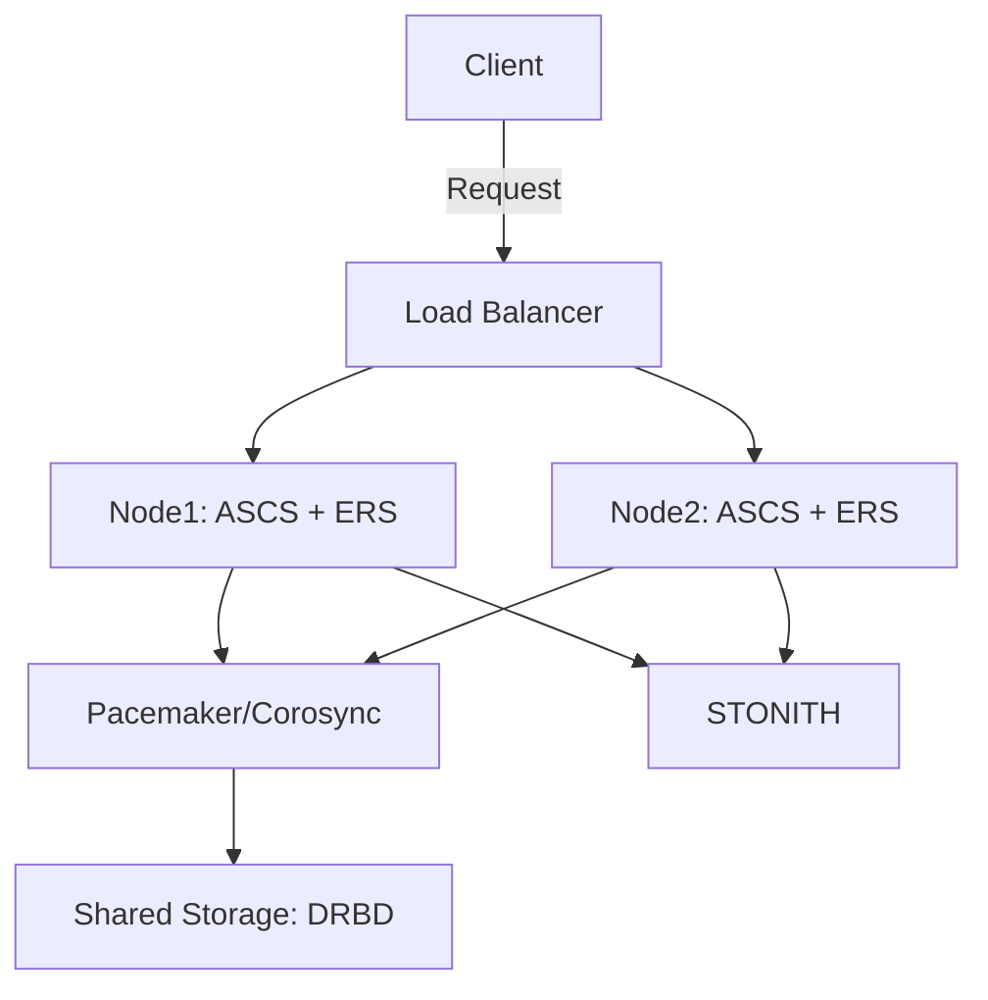

# SAP AP 이중화 방안 정리

## SAP AP 이중화 요약

SAP 시스템은 ASCS (ABAP SAP Central Services)와 ERS (Enqueue Replication Server)를 사용하여 고가용성(HA)을 구성한다. 이때 Pacemaker, corosync, STONITH를 더해 split brain문제가 개선된 HA를 구성할 수 있다.
<!-- more -->

??? note
    맞는 정보를 기재하기위해 노력했으나 내용이 틀릴 수 있으며, 발견 즉시 포스트 업데이트 진행합니다.
## 구성 요소

### ASCS와 ERS
- ASCS (ABAP SAP Central Services): 메시지 서버와 큐 서버 역할로 SAP 시스템의 중앙 통신과 트랜잭션 락 관리 담당
- ERS (Enqueue Replication Server): ASCS의 고가용성을 보장하기 위해 인큐 서버의 복제본

### 클러스터링 
- Pacemaker/Corosync: 클러스터 노드 간의 통신 담당
- STONITH: Split brain 문제를 방지하기 위해 타 노드를 강제로 종료(펜싱)하는 역할

### 스토리지 복제
- DRBD (Distributed Replicated Block Device): 데이터(스토리지)를 실시간으로 복제하여 장애 발생 시 데이터 일관성 유지

## SAP HA 구성 예시

### 클러스터 구성

#### Pacemaker, corosync 설치(전체노드) 클러스터 설정
pcs는 pacekamer 관리도구

```sh 
sudo yum install pacemaker corosync pcs
sudo pcs cluster auth node1 node2
sudo pcs cluster setup --name sap_cluster node1 node2
sudo pcs cluster start --all
sudo pcs property set stonith-enabled=true
sudo pcs property set no-quorum-policy=ignore
```

#### ASCS, ERS를 클러스터에 등록
```sh
# ASCS 
sudo pcs resource create SAP_ASCS ocf:heartbeat:SAPInstance InstanceName=ASCS_00 SAPInstanceType=ASCS

# ERS 
sudo pcs resource create SAP_ERS ocf:heartbeat:SAPInstance InstanceName=ERS_01 SAPInstanceType=ERS
```
#### 스토리지를 복제
```sh
# DRBD 설치
sudo yum install drbd84-utils

# DRBD 설정 파일 편집 (/etc/drbd.d/r0.res)
cat <<EOF > /etc/drbd.d/r0.res
resource r0 {
    device /dev/drbd0;
    disk /dev/sdb1;
    meta-disk internal;

    on node1 {
        address 192.168.1.1:7788;
    }
    on node2 {
        address 192.168.1.2:7788;
    }
}
EOF

# DRBD 초기화, 시작
sudo drbdadm create-md r0
sudo drbdadm up r0

# 동기화, 파일 시스템 생성
sudo drbdadm -- --overwrite-data-of-peer primary r0
sudo mkfs.xfs /dev/drbd0 # 또는 mkfs.ext4
sudo mount /dev/drbd0 /mnt/drbd
```

#### Split brain 방지
```sh
# Quorum 설정
sudo pcs quorum device add model net host=node3

# Tie Breaker 설정
sudo pcs property set quorum.tie-breaker=auto
```

### 시스템 구성 도표


#### Split brain 문제 해결
네트워크 격리로 인해 모든 AP 서버가 서로 통신할 수 없게 되는 Split brain 문제를 방지하기 위해 아래 방안을 적용할 수 있다.

- 여러 STONITH 장치를 설정하여 하나의 장치가 실패하더라도 다른 장치가 펜싱을 수행할 수 있도록 설정
- Quorum, Witness 노드를 사용해 클러스터의 다수결 원칙 적용
- STONITH 실패 시 Secondary 서버가 자동으로 Primary로 승격되지 않도록 설정하고 관리자의 approve를 받도록하여 Split brain을 방지
