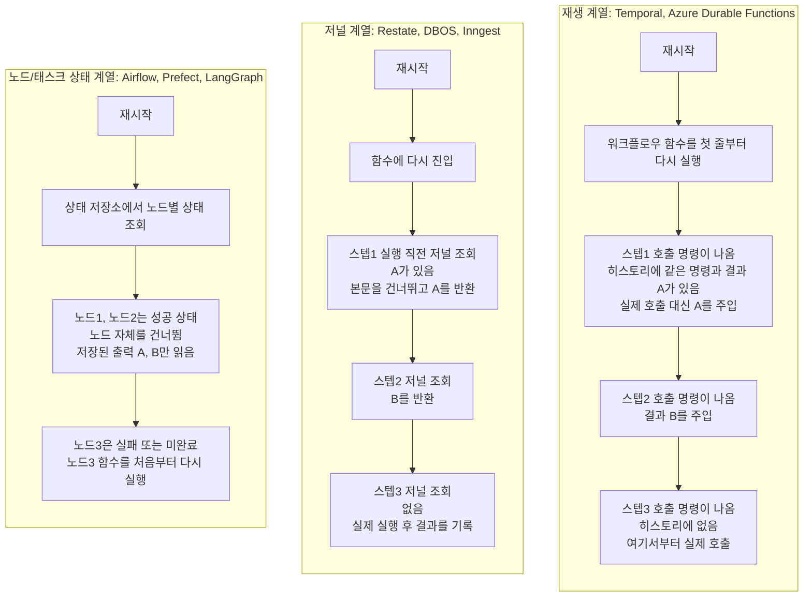
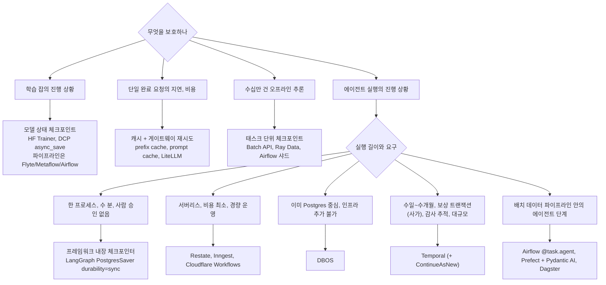

# AI 에이전트 체크포인트 정리

에이전트를 만들다 보면 LLM 호출 도중 프로세스가 죽거나, 사람 승인을 며칠 기다려야 하거나, 서버리스 타임아웃에 걸리는 상황을 만나게 됨. 학습의 모델 체크포인트나 서빙의 캐시와 구분되는 에이전트용 실행 상태 체크포인트가 무엇이고 도구마다 어떻게 다르며 언제 무엇을 써야 하는지 표로 정리

<!-- more -->

## 체크포인트 정확한 용어 정리

셋 다 체크포인트라는 한 단어로 불리지만 무엇을 저장하고 어떤 장애를 막는지는 완전히 다름. 이 글이 다루는 것은 아래 표 가운데 열의 실행 상태 체크포인트

| 구분 | 모델 상태 체크포인트 | 실행 상태 체크포인트 | 캐시 |
|---|---|---|---|
| 쓰이는 곳 | 사전학습, 파인튜닝, RLHF | 워크플로우 엔진, 에이전트 프레임워크 | 추론 서빙, LLM API |
| 저장하는 것 | 가중치 + 옵티마이저 상태 + LR 스케줄러 + RNG 상태 (+ 데이터로더 위치) | 프로그램의 진행 상황. 완료된 스텝과 그 결과의 저널 | 계산이 끝난 KV 블록, 프롬프트 프리픽스 |
| 복원 시점 | 잡 재시작 시 `resume_from_checkpoint` 같은 명시적 호출 | 크래시 후 자동. 저널을 재생해 중단 직전 상태를 재구성 | 다음 요청이 같은 프리픽스를 가질 때 기회적으로 |
| 막는 장애 | 수 주짜리 학습 중 GPU, 호스트 고장 | 프로세스, 호스트 크래시, 배포, 긴 대기 중 진행 상황 유실, 부수효과 중복 실행 | 없음. 비용과 지연 시간을 줄일 뿐. 캐시 미스가 나도 정상 동작 |
| 대표 도구 | HF Trainer, PyTorch DCP, DeepSpeed, verl | Temporal, Restate, DBOS, Airflow, Prefect, LangGraph 체크포인터 | vLLM prefix caching, SGLang RadixAttention, API prompt caching |

캐시는 유실돼도 결과가 달라지지 않고 비용만 더 듦. 체크포인트는 유실되면 진행 상황이 사라지거나 부수효과가 두 번 실행됨. 이 차이가 뒤의 LLM 서빙 절의 전제. 서빙 요청 경로에 내구성 실행을 두지 않는 근거이기도 함

---

## 에이전트에 실행 상태 체크포인트가 필요한 이유

일반 웹 요청과 달리 에이전트 실행은 길고, 비싸고, 외부에 흔적을 남기고, 중간에 사람을 기다림. 각 벤더가 공통으로 드는 이유를 모으면 일곱 가지

| 이유 | 내용 | 근거, 수치 |
|---|---|---|
| 재실행 비용 | 크래시 후 처음부터 다시 돌리면 이미 끝난 LLM 호출의 비용을 다시 지불 | Inngest: 재시도마다 재호출하면 추론 비용이 2~3배. Temporal: 실패하면 스텝 1로 돌아가 시간과 비용이 드는 LLM 호출을 반복 |
| 비결정성 | 다시 돌리면 LLM이 다른 계획을 세움. 이미 외부에 반영된 작업(항공권 예약 등)과 어긋남 | Temporal 예시: 휘슬러행 항공권을 예약한 뒤 호텔 검색 단계에서 크래시. 재시작한 에이전트가 이번엔 일본행을 결정 |
| 부수효과 | 도구 호출은 결제, 이메일, DB 쓰기처럼 외부에 실제 변화를 남김. 중복 실행 금지 | Restate: 이중 예약, 중복 이메일 없음. DBOS: 중복 환불 없음. LangGraph, ADK 문서 모두 재개 시 도구가 두 번 실행될 수 있다고 명시 |
| 사람 대기 | 승인은 몇 초일 수도, 며칠일 수도 있음. 요청 응답 모델로는 감당 불가 | Temporal: 프로세스를 띄워 둔 채 대기 비용을 내든지, 프로세스를 내렸다가 다시 올리는 장치를 직접 만들든지 둘 중 하나. 내구성 대기는 기다리는 동안 비용 0 |
| 런타임 한도 | 서버리스 함수는 실행 시간 상한이 있음 | AWS Lambda 최대 900초. Vercel Functions Pro 최대 800초(베타 1,800초), Edge 첫 응답 25초. Cloudflare Workers는 CPU 시간 기준 무료 10ms, 유료 기본 30초(최대 5분) |
| 멀티 에이전트 | 하위 에이전트를 병렬로 돌리고, 핸드오프로 넘어온 결과를 정해진 순서로 합쳐야 함 | Temporal 예시: ADK 자식 → LangGraph 자식 순차 실행, Fleet, Customer 에이전트 병렬 후 Dispatch가 종합 |
| 관측, 디버깅 | 에이전트 실행 추적은 요청 하나 추적보다 어려움. 어느 스텝에서 무슨 결과가 나왔는지 기록이 필요 | Temporal: 내구성 에이전트 추적은 요청 추적보다 어렵다. LangGraph: 체크포인트가 있어야 타임 트래블 가능 |

Inngest 블로그의 예시 계산. 스텝 하나의 성공 확률이 99%라면 스텝 5개를 전부 통과할 확률은 0.99의 5제곱인 약 95%, 10개면 약 90%로 떨어짐. 실측치가 아닌 가정 계산이지만, 스텝이 늘수록 처음부터 다시 도는 대신 실패 지점부터 이어 달리는 능력이 중요해지는 이유를 보여줌

---

## 복구 메커니즘 세가지 방법

도구마다 이름은 다르지만 크래시 후 어떻게 이어 달리는지는 세 가지 방식 중 하나. 같은 상황을 놓고 세 방식이 각각 무엇을 하는지 먼저 보고, 그다음 속성을 비교

공통 시나리오. 에이전트가 스텝1 LLM 호출(응답 A) → 스텝2 도구 호출(결과 B) → 스텝3 LLM 호출 순서로 실행되다가 스텝3 도중 프로세스가 죽음. 목표는 A와 B를 다시 만들지 않고 스텝3부터 이어가는 것

세 방식 모두 A와 B를 다시 만들지 않는다는 결과는 같음. 차이는 어디서 코드를 다시 시작하고, 무엇을 근거로 건너뛰고, 그 대가로 코드에 무엇을 요구하느냐

| 질문 | 재생 계열 | 저널 계열 | 노드/태스크 상태 계열 |
|---|---|---|---|
| 크래시 시점에 저장돼 있던 것 | 스텝1, 스텝2의 호출 명령과 결과 A, B가 담긴 이벤트 히스토리(추가 전용 로그) | 스텝1 = A, 스텝2 = B라는 스텝 ID와 결과 쌍 | 노드1 성공(출력 A), 노드2 성공(출력 B), 노드3 실행 중이라는 상태 행 |
| 재시작 후 코드가 시작되는 지점 | 워크플로우 함수 첫 줄 | 함수 첫 줄 | 노드3 함수 첫 줄 |
| 스텝1, 스텝2를 건너뛰는 근거 | 함수가 만들어 내는 명령 순서를 히스토리와 대조. 일치하면 기록된 결과를 주입 | 스텝 ID로 저널을 조회. 있으면 본문을 실행하지 않고 결과 반환 | 노드 상태가 성공이면 스케줄하지 않음 |
| 스텝3 이전에 만든 로컬 변수 | 함수를 다시 실행하므로 복원됨 | 함수를 다시 실행하므로 복원됨 | 유실. 노드 출력으로 저장한 값만 다음 노드 입력으로 받음 |
| 스텝3 도중 이미 나간 부수효과 | 한 번 더 나갈 수 있음. 스텝은 최소 1회 실행 | 동일 | 동일. 노드 처음부터 다시 돌기 때문 |
| 코드에 요구되는 것 | 첫 줄부터 스텝3까지 매번 같은 명령 순서를 만들어야 함. 시계 조회, 난수 생성, 네트워크 호출은 워크플로우 밖(Activity)으로 | 스텝 사이 제어 흐름이 같은 스텝 ID를 같은 순서로 만나야 함. 비결정적 작업은 스텝 안으로 | 노드 안 부수효과는 멱등하게. 노드 사이 상태는 입출력으로만 전달 |
| 이 방식의 대가 | 결정론 규율, 코드 변경 시 버전 관리, 히스토리 크기 상한 | 저장소가 스텝 수에 비례해 증가. 스텝 순서를 바꾸는 배포는 여전히 위험 | 노드보다 작은 단위로는 재개 불가. LLM이 다음 노드를 고르는 루프를 그래프에 맞춰야 함 |

각 계열의 속성을 한 번 더 요약하면

| 계열 | 저장하는 것 | 복구 방식 | 코드 제약 | 크래시 시 로컬 변수 | 대표 |
|---|---|---|---|---|---|
| 재생(Replay), 이벤트 소싱 | 오케스트레이터가 내린 명령과 그 결과가 모두 기록된 이벤트 히스토리(추가 전용 로그) | 워크플로우 함수를 첫 줄부터 다시 실행. 기록된 결과를 실제 호출 대신 주입해 중단 지점까지 빨리 감기 | 워크플로우 코드는 결정론적이어야 함. 시계 조회, 난수 생성, 네트워크 호출 금지, 명령 순서 변경 금지 | 재생으로 재구성됨 | Temporal, Azure Durable Functions, Vercel Workflows |
| 저널, 스텝 메모이제이션 | 스텝 ID → 결과 쌍. 결과를 함수에 돌려주기 전에 먼저 영속화 | 함수에 다시 진입하되 완료된 스텝은 본문을 실행하지 않고 기록된 결과를 즉시 반환 | 스텝 사이 제어 흐름은 재현 가능해야 함. 저널 순서와 어긋나는 코드 변경은 위험(Restate 문서도 SDK 호출 추가, 삭제, 순서 변경을 안전하지 않은 변경으로 분류). 재생 계열보다 규율이 가볍다는 것은 벤더 주장에 가까움 | 재진입으로 재구성됨 | Restate, DBOS, Inngest, Cloudflare Workflows |
| 노드/태스크 상태 | 선언된 그래프의 노드별 상태 행 + 외부에 저장된 결과 | 실패, 미시작 노드부터 다시 스케줄. 성공한 노드는 저장된 결과를 재사용 | 태스크는 멱등해야 함. 태스크 안에서 죽으면 태스크 처음부터 | 유실됨(Airflow deferral 문서 기준: 로컬 변수, self 속성은 보존되지 않음. LangGraph도 노드 처음부터 재실행) | Airflow, Prefect, Dagster(DAG), LangGraph 체크포인터(순환 그래프) |

재생 계열과 저널 계열은 실제로는 둘 다 함수에 재진입해 빨리 감기하므로 경계가 벤더 주장만큼 뚜렷하지는 않음. 실질적 차이는 내구성의 단위가 명령 스트림이냐 스텝 결과냐, 그리고 히스토리 크기 상한이 있느냐 저장소 증가만 있느냐

노드/태스크 상태 계열은 엔진이 그래프 구조를 미리 알고 제어 흐름을 직접 쥠. LLM이 다음 단계를 고르는 에이전트 루프는 정적 DAG가 아니어서 순환 그래프 추상화(LangGraph)로 밀어 넣거나 턴당 노드 하나로 쪼개야 함. 이것이 2025~2026년에 에이전트 프레임워크들이 재생, 저널 엔진을 아래에 까는 이유

---

## 도구별 체크포인트 방식 비교

체크포인트를 제공하는 도구를 세 레이어로 나눔. 먼저 나오는 레이어일수록 범용이고 뒤로 갈수록 에이전트 전용

### 내구성 실행 엔진

에이전트 루프를 감싸서 LLM 호출, 도구 호출 하나하나를 복구 단위로 만드는 범용 엔진

| 항목 | Temporal | Restate | DBOS |
|---|---|---|---|
| 계열 | 재생(이벤트 히스토리) | 저널 | 저널(Postgres 체크포인트) |
| 저장하는 것 | Workflow Execution별 Event History | 호출(invocation)별 저널. 스텝 결과를 함수에 돌려주기 전에 기록 | 워크플로우 입력, 스텝 출력, 워크플로우 결과. 스텝당 DB 쓰기 1회 + 워크플로우당 2회 |
| 비결정적 코드 위치 | Activity. 문서에 LLM/AI 호출을 Activity에 두라고 명시 | `ctx.run()`. 결과가 저널에 기록돼 재생 시 재실행되지 않음 | `@DBOS.step()`. DB 작업은 `@DBOS.transaction()` |
| 결정론 제약 | 엄격. 명령 순서가 히스토리와 다르면 비결정론 에러 | 저널을 재생하므로 스텝 사이 제어 흐름은 재현 가능해야 함. 문서상 SDK 호출 추가, 삭제, 순서 변경은 안전하지 않은 변경 | 입력 인자와 스텝 반환값이 같다면 워크플로우가 같은 스텝을 같은 순서로 호출해야 함. 순서가 달라지면 재개 불가 |
| 긴 실행의 한도와 관리 | Event History 51,200개 또는 50MB(경고 10,240개, 10MB). ContinueAsNew로 새 히스토리 시작 | 공개된 저널 상한 없음. 긴 대기는 한 핸들러 안에서 sleep하지 말고, 핸들러를 끝낸 뒤 지연 호출로 다음 핸들러를 예약해 대기 구간이 호출과 호출 사이에 오게 하라는 권고(장기 실행 중에는 코드 버전 교체가 어려워지기 때문) | 개수 상한 없음. 보존 정책으로 관리(시간 또는 행 수. DBOS Cloud 기준 기본 100만 행) |
| 사람 대기 | Signal, Update, Query, 내구성 Timer | Awakeable, 이름 있는 Signal, 내구성 Promise, 내구성 Sleep. 대기 중에는 핸들러가 중단(suspend)됨 | `DBOS.send/recv`, `set_event/get_event`(`recv`와 `get_event`의 기본 타임아웃 60초), 내구성 Sleep, 워크플로우 타임아웃 |
| 보장 수준 | Activity 본문은 최소 1회 실행되지만 히스토리에 남는 결과는 하나. Update는 워크플로우 Start와 한 원자 단위로 묶이지 않는다고 문서가 경고 | 스텝 본문은 최소 1회, 결과 기록은 정확히 1회. 호출 멱등성 키 제공(같은 키로 24시간 안에 재호출하면 저장된 응답을 반환) | 워크플로우 완료 보장, 스텝 최소 1회(완료 후 재실행 없음), `@DBOS.transaction`은 정확히 1회 커밋 |
| 배포 형태 | Temporal Service(frontend, history, matching, worker + Cassandra/Postgres/MySQL + Elasticsearch) + 상시 Worker(Worker가 서버에서 작업을 당겨가는 pull 방식) | 단일 바이너리. 별도 DB 없음. 런타임이 서비스로 요청을 밀어 넣는 push 방식(서비스 앞단의 리버스 프록시 같은 위치). Lambda 같은 서버리스에 적합 | 라이브러리 + 기존 Postgres. 추가 인프라 없음 |
| SDK | Go, Java, TypeScript, Python, .NET, PHP, Ruby, Rust | TypeScript, Python, Java, Kotlin, Go, Rust, Ruby | Python, TypeScript, Go, Java |
| 라이선스, 버전 | MIT. 서버 v1.31.2(2026년 7월) | BSL 1.1(4년 후 Apache 2.0). 자체 호스팅은 가능, 관리형 재판매 금지. v1.7.8(2026년 8월) | MIT. dbos 2.31.0 |
| 공식 AI 통합 | OpenAI Agents SDK 플러그인(모델 호출이 Activity로), Vercel AI SDK, LangGraph 플러그인, AI Cookbook | Vercel AI SDK `durableCalls()` 미들웨어, OpenAI Agents SDK, Google ADK, Pydantic AI, LangChain | OpenAI Agents SDK `DBOSRunner`(도구, 가드레일을 `@DBOS.step`으로), Pydantic AI, LangGraph는 `PostgresSaver` 병용 패턴 |
| 알려진 사용처 | Snap(모든 Story 처리 경로에 사용), Netflix(Plato 미디어 워크플로우, 하루 수백만 건의 워크플로우 이벤트. Temporal 웨비나 자료 기준), Datadog, Stripe | KPMG, Unkey, Fortis, Cinder(Restate 홈페이지에 사용처로만 표기. 상세 케이스 스터디는 없음) | Dosu(Celery에서 이전, 시간당 2만 워크플로우), Supabase |

DBOS의 주의점. 처리되지 않은 예외가 나면 워크플로우가 영구 종료 상태로 기록됨. 일시적 실패는 스텝 재시도 정책에 맡길 것. 워크플로우 본문에서 예외를 잡아 그냥 넘기면 재시도 기회를 잃고 잘못된 상태로 완료됨

같은 계열의 다른 선택지

| 도구 | 계열 | 특징 | 에이전트 관련 |
|---|---|---|---|
| Inngest | 저널 | 완료로 기록된 `step.run`은 다시 실행되지 않음(실행 도중 죽으면 그 스텝만 재시도). `step.sleep` 최대 1년(무료 7일), `step.waitForEvent`. 대기 중인 실행은 동시성 한도에 안 잡힘 | AgentKit(Agents, Networks, Router, State), `step.ai`가 재시도와 결과 캐싱을 담당 |
| Vercel Workflows(오픈소스 Workflow Development Kit) | 재생 | `'use workflow'`(상태를 들고 흐름을 지휘하는 함수) + `'use step'`(상태 없이 한 작업만 내구성 있게 수행하는 단위). 스텝의 입출력을 이벤트 로그에 기록하고 재시작 시 그 로그로 결정론적 재생. 스텝 실행 중 워크플로우는 중단(suspend) 상태 | 관리형 플랫폼으로 AI 에이전트를 전면에 내세움. 2025년 10월 공개 베타로 시작해 2026년 4월 16일 GA |
| Cloudflare Workflows | 저널 | `step.do()` 단위 체크포인트. 무료 1,024스텝, 유료 10,000스텝(설정으로 25,000까지), 스텝 결과 1MiB, sleep 최대 365일 | Durable Objects와 조합. 대기 중 인스턴스는 동시성 한도 제외 |
| Azure Durable Functions | 재생 | 오케스트레이션 이력을 추가 전용 저장소에 기록, `await`/`yield`마다 체크포인트, 깨어나면 함수 전체를 처음부터 재실행. `DateTime.UtcNow`, `Guid.NewGuid()`, I/O 금지 | Durable Task Scheduler가 멀티 에이전트 오케스트레이션을 대상 시나리오로 명시 |

### 데이터 오케스트레이터

배치 파이프라인용으로 출발했지만 2026년 들어 각자 에이전트 기능을 덧붙이는 중

| 항목 | Apache Airflow 3.3 | Prefect 3.8 | Dagster |
|---|---|---|---|
| 상태 저장 | 메타데이터 DB(Postgres/MySQL)에 태스크 인스턴스 상태 14종. 태스크 간 데이터는 XCom(작은 값 전용, 큰 값은 오브젝트 스토리지 백엔드) | 태스크 실행 하나하나를 트랜잭션 단위로 관리. 캐시 키가 가리키는 위치에 결과 레코드 저장. 결과 영속화는 기본 꺼짐 | 실행 이벤트 로그 + I/O 매니저가 저장한 출력 |
| 복구 단위 | 태스크 전체. 태스크 중간에 죽으면 태스크 처음부터(공식 가이드: 태스크를 DB 트랜잭션처럼 원자적, 멱등하게) | 플로우 함수를 다시 실행하되 캐시 히트한 태스크는 코드 실행 없이 Cached 상태(Completed의 하위 상태)로 처리 | 기본 `FROM_FAILURE`. 성공한 op(Dagster의 태스크 단위)은 건너뛰고 출력 재사용. 이전 실행의 출력을 읽을 수 있는 I/O 매니저 필요(S3는 가능, K8s의 파일시스템 매니저는 불가) |
| 크래시 처리 | 좀비 태스크를 주기적으로 회수해 실패 처리 또는 재시도. 스케줄러가 재시작하면 주인 없는 태스크를 다시 맡음. Celery 실행기에서 이중 큐잉이 보고된 이슈 있음(공식 보장 문서는 아님, 최소 1회로 봐야 함) | Crashed 상태로 표시하고 응답이 끊긴 실행은 좀비 플로우 실행으로 분류. UI에서 재시도(Retry) | 실행 재시도 정책 |
| 긴 대기 | Deferrable 오퍼레이터가 triggerer로 이동해 워커 슬롯 반납. 단 로컬 변수, self 속성은 보존되지 않고 새 인스턴스로 재개. 직렬화 가능한 kwargs를 직접 넘겨야 함 | `pause_flow_run`, `suspend_flow_run`, `resume_flow_run`. 타입 지정 폼으로 사람 입력 | 센서 |
| 에이전트 이야기 | Apache 공식 common AI provider 패키지(2026년 4월 발표, 0.x). `@task.agent`에 `durable=True`를 주면 실행 중 모델 응답과 도구 결과를 ObjectStorage에 캐시해 재시도 시 재지불 없음. Astronomer의 기존 Airflow AI SDK 저장소는 아카이브 | 에이전트용 오케스트레이터를 표방. 사전 컴파일 그래프 없음, 캐시된 LLM 응답 재사용. Pydantic AI `PrefectDurability`로 모델 요청, 도구 호출, MCP 통신을 Prefect 태스크로 | AI/ML 파이프라인 오케스트레이션 포지션. 에이전트 런타임 아님 |
| 참고 | 2.x 문서: 유한 배치 워크플로우용, 무한 실행 이벤트 워크플로우용이 아님. 3.x는 Asset Watcher, REST push로 이벤트 기반 트리거 보강 | Prefect가 2026년 7월 Dagster Labs 인수 발표. 양쪽 제품 독립 유지 | Prefect 산하 |

Prefect의 캐시 정책 함정 두 가지. 캐시는 결과 영속화가 켜져 있어야 동작(`PREFECT_RESULTS_PERSIST_BY_DEFAULT=true`). 기본 정책 `DEFAULT`는 플로우 실행 ID를 키에 포함하므로 새 실행은 이전 실행의 캐시를 못 씀. 실행 간 이어 달리기가 필요하면 `INPUTS`나 `TASK_SOURCE` 정책 사용

Pydantic AI 문서의 Prefect 통합 제약이 데이터 오케스트레이터 계열의 한계를 잘 보여줌. 모델 인스턴스는 직렬화가 안 돼 태스크 경계를 넘길 수 없고, `run_stream()` 이벤트는 실시간이 아니라 버퍼링되며, 취소 토큰은 내구성 경계를 넘지 못함. 토큰 스트리밍과 내구성 체크포인트는 서로 상충

### 에이전트 프레임워크 내장 기능

프레임워크가 직접 제공하는 것은 대부분 상태 저장과 재개용 기본 도구(primitive)까지. 장애를 감지해 재개를 걸어 주는 주체는 없는 경우가 많음

| 프레임워크 | 저장하는 것 | 크래시 후 자동 재개 | 사람 대기 | 재개 시 주의 |
|---|---|---|---|---|
| LangGraph 1.2 | 슈퍼스텝(한 번에 함께 실행되는 노드 묶음)마다 그래프 상태 전체 스냅샷을 `thread_id`별로 저장. `InMemorySaver`, `SqliteSaver`, `PostgresSaver`. 그 외 Redis, MongoDB, CosmosDB용 세이버 | 아님. 프로세스가 죽으면 실행도 죽고, 같은 `thread_id`로 다시 invoke하는 것은 호출자 책임. Agent Server(LangGraph Platform)는 영속화를 대신 처리 | `interrupt()`로 멈추고 `Command(resume=값)`으로 재개 | 재개 시 노드 전체를 처음부터 재실행. interrupt 앞의 부수효과는 멱등해야 함. 재생 시 LLM 호출이 다시 나가 다른 결과가 나올 수 있음 |
| OpenAI Agents SDK 0.22 | Session은 대화 기록 저장(SQLite, Redis, SQLAlchemy, MongoDB, Dapr 등). 실행 상태 아님 | 아님. 공식 문서가 내구성은 Dapr, DBOS, Temporal, Restate에 맡기라고 안내. Temporal 통합은 Python SDK 기준 2026년 3월 GA | `needs_approval` 도구 → `RunResult.interruptions`. 프로세스 간 재개는 `to_state()`/`RunState.from_json()`으로 직접 직렬화 | 직접 저장, 복원해야 함 |
| Claude Agent SDK | 세션 = 대화 기록. cwd별 `.jsonl`로 디스크에 자동 저장. `resume`, `fork_session` | 아님. 프로세스를 다시 띄워 대화를 이어가는 용도. 문서 표현: 세션은 대화를 보존하지 파일시스템을 보존하지 않음 | 없음(호스트 앱 책임) | 파일 체크포인트(`rewind_files`)는 별도 기능. Write, Edit, NotebookEdit만 추적(Bash 변경은 미추적)하고 대화는 되감지 않음 |
| Google ADK(재개 기능은 1.16+, 현재 2.x) | SessionService(InMemory, Database, VertexAI)에 이벤트와 상태. `ResumabilityConfig(is_resumable=True)`로 재개 가능 | Invocation ID로 재개 호출 필요. 완료된 에이전트 작업은 이벤트에서 복원 | `LongRunningFunctionTool` 응답을 새 메시지로 넣어 재개 | 도구가 두 번 실행될 수 있음. 구매 같은 도구에는 가드 필요. Web UI, CLI 재개 미지원 |
| Microsoft Agent Framework | 슈퍼스텝 끝마다 실행자 상태, 대기 메시지, 공유 상태. InMemory, File, Cosmos 저장소 | 체크포인트 ID로 재개 호출. 토폴로지와 실행자 ID가 같아야 함 | 대기 요청이 체크포인트에 포함 | 체크포인트 저장소는 신뢰 경계(File, Cosmos 저장소는 pickle 사용) |
| CrewAI Flows | `@persist`로 메서드 완료마다 상태 저장. 기본 SQLite | 같은 UUID로 재실행 시 재개 | 내장 없음(직접 구현) | `@persist`를 클래스에 붙이면 전체, 메서드에 붙이면 해당 메서드만 저장되므로 범위를 먼저 정할 것 |

LangGraph의 `durability` 옵션이 프레임워크 내장 체크포인트의 성격을 가장 잘 요약함

| 값 | 동작 | 트레이드오프 |
|---|---|---|
| `sync` | 다음 스텝 시작 전에 동기 영속화 | 가장 안전, 오버헤드 있음 |
| `async` | 다음 스텝 실행 중 비동기 영속화 | 균형. 크래시 시 마지막 체크포인트 유실 가능 |
| `exit` | 그래프 종료 시에만 영속화 | 가장 빠름. 실행 중 복구 불가 |

Temporal의 LangGraph 플러그인 문서가 이 차이를 명확히 정리함. 체크포인트는 데이터를 보존하지 실행을 보존하지 않는다는 것. 결국 그래프 바깥의 주체(엔진 또는 관리형 플랫폼)가 장애를 감지하고, 그래프의 어느 지점으로 재진입할지 정해 다시 시작해야 함. 그래서 플러그인은 `InMemorySaver`를 쓰라고 안내함. 내구성은 Temporal이 맡으니 Postgres 체크포인터가 필요 없다는 뜻

---

## 에이전트에서 자주 걸리는 함정

세 계열에 공통으로 적용되는 규칙과 계열별로 다른 함정을 모음

| 함정 | 내용 | 대응 |
|---|---|---|
| LLM 호출을 워크플로우 본문에 둠 | 재생 계열은 결정론 위반, 저널 계열은 재시작 시 재호출 | LLM 호출, HTTP 요청, DB 접근, 난수 생성, 시계 조회는 전부 Activity/`ctx.run`/`@DBOS.step`/`@task` 안으로. Temporal LangGraph 플러그인 규칙: 네트워크 호출, 난수 생성, 시계 조회, 파일 I/O가 있는 노드는 `execute_in: "activity"` |
| 도구 부수효과 중복 | 스텝 실행 보장은 최소 1회. 완료 기록 직전에 죽으면 한 번 더 실행됨 | 도구 호출에 멱등성 키. 쓰기 도구는 UPSERT. LangGraph에서는 부수효과를 별도 태스크로 분리하고 interrupt 앞에 두지 말 것 |
| 긴 대화가 히스토리 한도에 걸림 | Temporal은 턴마다 이벤트가 쌓여 51,200개, 50MB 한도에 도달 | 세션 단위로 ContinueAsNew. 큰 페이로드는 Claim Check 패턴으로 오브젝트 스토리지에 두고 참조만 기록 |
| 스트리밍과 체크포인트의 상충 | 토큰 스트리밍은 스텝 경계 안에서 일어남. 모델 호출을 태스크로 감싸면 스트림 이벤트가 버퍼링될 수 있음(Pydantic AI와 Prefect 조합에서 확인된 제약) | 스트리밍은 프레임워크가, 턴 단위 내구성은 엔진이 맡는 분업. Temporal LangGraph 플러그인은 Workflow 노드에서 스트리밍 지원(Python 3.11+) |
| 예외 처리 | DBOS는 처리되지 않은 예외로 워크플로우가 영구 종료. LangGraph는 `interrupt()`를 try/except로 감싸면 재개가 깨짐 | 일시적 실패는 스텝 재시도 정책으로, 영구 실패는 명시적 분기로 처리 |
| 실행 중인 워크플로우가 있는 상태에서의 코드 배포 | 재생 계열은 코드가 바뀌면 비결정론 에러 | 버전 관리 API(Temporal Patching, Restate 서비스 버전). Restate는 긴 대기를 한 핸들러 안에 두지 말고 호출과 호출 사이에 두어 배포 중 코드 교체 영향을 줄이라고 권장 |
| 체크포인트 저장소를 신뢰함 | 상태에 프롬프트, 도구 결과, 자격 증명이 들어감. MS Agent Framework 문서: 체크포인트 저장소는 신뢰 경계 | 저장소 암호화, 접근 제어. 직렬화 형식 검토(pickle 주의) |
| 캐시를 체크포인트로 착각 | Prefect 캐시는 결과 영속화가 꺼져 있으면 동작 안 함. API prompt cache는 캐시 미스가 나도 에러 없음 | 캐시 히트는 최적화, 복구는 별도 설계 |

---

## 프레임워크와 엔진의 조합

프레임워크가 에이전트 루프와 스트리밍, 추적을 맡고 엔진이 장애 감지와 재개를 맡는 분업. 2026년 기준 공식 지원되는 조합은 아래와 같음

| 조합 | 형태 | 체크포인터 처리 | 출처 |
|---|---|---|---|
| Temporal + LangGraph | `temporalio[langgraph]` 플러그인(temporalio 1.27+). 노드별 `execute_in`으로 Activity 여부 지정 | `InMemorySaver` 사용. Temporal이 내구성 담당 | Temporal 공식 문서 |
| Temporal + OpenAI Agents SDK | `OpenAIAgentsPlugin`(Python. TypeScript는 `TemporalOpenAIRunner`). 루프는 Workflow, 모델 호출은 Activity | SDK Session(SQLiteSession)은 미지원. 대화 기록은 Workflow 상태에 두고 매 턴 `to_input_list()`로 재구성 | Temporal 문서, 2026년 3월 GA |
| DBOS + LangGraph | 도구, 진입점을 `@DBOS.workflow`로, LangGraph `PostgresSaver`를 같은 Postgres에 | 병용. 그래프 상태는 PostgresSaver, 실행 내구성은 DBOS | DBOS 예제, 블로그 |
| DBOS + OpenAI Agents SDK | `DBOSRunner.run`이 `Runner` 대체. 도구, 가드레일에 `@DBOS.step` | 해당 없음 | DBOS 문서 |
| Restate + Vercel AI SDK / OpenAI Agents / ADK / Pydantic AI | `durableCalls()` 미들웨어 등으로 모델 호출을 저널 스텝화 | 해당 없음 | Restate 문서 |
| Pydantic AI + 4종 백엔드 | Temporal, DBOS, Prefect, Restate를 공식 내구성 백엔드로 Pydantic AI 팀과 각 벤더가 함께 유지보수 | 백엔드마다 다름 | Pydantic AI 문서 |
| Airflow `@task.agent` | 태스크 안에서 Pydantic AI 에이전트 실행. `durable=True`면 모델 응답, 도구 결과를 ObjectStorage에 캐시 | 태스크 재시도 시 캐시 재생 | Airflow common AI provider 블로그 |

LangChain의 입장도 참고(벤더의 경쟁 관점임을 감안)

- 에이전트의 추론, 분기, 도구 호출과 AI 특화 추적, 평가, 토큰 스트리밍은 LangGraph 영역
- 결정론적 분산 시스템 워크플로우와 정확성이 단순함보다 중요한 장기 프로세스는 Temporal 영역
- 둘을 합칠 수는 있으나 그래프 전체를 Activity 하나로 감싸면 스텝별 가시성을 잃고, 도구 호출마다 Activity로 쪼개면 복잡도가 오르는 트레이드오프

---

## LLM 개발(학습, 파인튜닝)에서의 체크포인트

여기서 체크포인트는 모델 상태 체크포인트. 워크플로우 엔진은 파이프라인 단계(데이터 준비 → 학습 → 평가 → 등록 → 배포)를 관리하고, 학습 잡은 자기 상태를 직접 저장함. 오케스트레이터의 재시도가 안전해지는 것은 학습 스텝이 `resume_from_checkpoint`로 멱등해지기 때문

### 무엇을 저장하고 얼마나 큰가

| 구성 요소 | 내용 | 크기(Adam 혼합 정밀도 기준) |
|---|---|---|
| 가중치 | bf16 또는 fp16 파라미터 | 파라미터당 2바이트 |
| 옵티마이저 상태 | fp32 마스터 가중치 + 1차 모멘트 + 2차 모멘트 | 파라미터당 12바이트 |
| 스케줄러, RNG | LR 스케줄러 상태, 난수 상태 | 무시할 수준 |
| 데이터로더 위치 | 어느 샘플까지 봤는지 | 매우 작음(없으면 에폭 안에서 같은 샘플을 다시 학습) |

ZeRO 논문 계산으로 재개 가능한 체크포인트는 파라미터당 14바이트(bf16 가중치를 따로 저장하지 않고 fp32 마스터 가중치에서 복원한다면 12바이트). bf16 배포 아티팩트(2바이트)의 약 7배. 흔히 말하는 "모델의 2~3배"는 fp32 가중치(4바이트) 대비 옵티마이저 상태(12바이트)만 비교할 때 나오는 값. HF Trainer의 `save_only_model=True`는 용량을 크게 줄이지만 공식 문서 표현으로는 재개가 불가능해짐. LoRA는 어댑터만 저장하므로 GPT 3 175B 기준 350GB → 35MB

### 왜 필수인가

| 출처 | 수치 |
|---|---|
| Llama 3 405B 사전학습 | 54일간 H100 16,384장에서 중단 466회. 계획된 47회, 예상치 못한 419회. 예상치 못한 중단의 약 78%가 하드웨어(확인 또는 추정), GPU 단독 58.7% |
| Meta 클러스터 신뢰성 연구 | GPU 8장 잡 MTTF 약 47.7일, GPU 1,024장 잡 약 7.9시간. 외삽하면 GPU 16,384장 약 1.8시간. 인프라 장애를 겪는 잡은 전체의 약 0.2%뿐이지만, 그 장애가 전체 실행 시간의 18.7%를 잡아먹음. GPU 2,048~4,096장 잡의 평균 ETTR(유효 학습 시간 비율) 약 0.9. 이를 12,000 GPU까지 유지하려면 체크포인트 쓰기 오버헤드가 약 10초여야 한다는 추정 |

GPU 수가 늘면 MTTF는 급격히 줄고, 체크포인트 간격은 Young/Daly 공식(`W = √(2 × MTTF × 저장 비용)`)으로 정해짐. 간격을 줄이려면 저장 비용을 줄여야 하고, 그래서 아래 기법이 나옴

### 저장 비용을 줄이는 기법

| 기법 | 방식 | 수치 |
|---|---|---|
| 비동기 체크포인트(PyTorch DCP `async_save`) | GPU → CPU 스테이징만 동기, 디스크 쓰기는 백그라운드. 별도 프로세스 그룹 필요 | 7B 모델에서 체크포인트 때문에 학습이 멈추는 시간 148.8초 → 6.3초(23.6배 단축) |
| 인메모리, 피어 체크포인트(GEMINI, SOSP '23) | 호스트 CPU 메모리에 저장하고, 저장 위치 배정과 전송 트래픽을 스케줄링해 학습 통신과 겹치지 않게 함 | 복구 13배 이상 빠름. 이터레이션마다 체크포인트를 떠도 처리량 손실 없음 |
| 빈도 자동 조정(CheckFreq, FAST '21) | 프로파일링으로 이터레이션 단위 빈도 결정. 데이터로더 상태도 저장 | 런타임 오버헤드 3.5% 이내 |
| JIT 체크포인트(EuroSys '24) | 주기 저장 대신 장애 발생 시점에 상태 캡처. 미니배치 하나만 재생 | 복구 시간 GPU당 수 분 → 수 초 |
| 관리형(Azure ML Nebula, 현재는 지원 중단) | 비동기 비차단 저장 | 128 A100에서 97GB 체크포인트 20분 → 1초(벤더 수치). 패키지가 최신 ACPT 이미지에서 제거돼 참고용 |

### 오케스트레이터의 역할

| 도구 | 지원 |
|---|---|
| Flyte | 태스크 내부 체크포인트 API. 스팟, 선점형 등 중단 가능한 인스턴스 운용을 목적으로 명시 |
| Metaflow | `@checkpoint` + `@retry`. 재시도 시 최신 체크포인트를 자동 로드 |
| Temporal | 공식 블로그에서 학습 잡 재시도와 마지막 체크포인트부터 재개를 오케스트레이션 사례로 소개 |
| Airflow, Prefect | 공식 문서에 학습 재개 관련 명시는 없음. 실무상 파이프라인 단계 재시도만 담당하고 학습 스텝의 재개는 학습 코드가 `resume_from_checkpoint`로 처리 |
| verl(RL 후학습) | `checkpoint.save_contents`로 model, optimizer, extra(스케줄러, RNG) 저장. 장애 대비 체크포인트 활성화 권장 |

RL 후학습 루프에서는 롤아웃 엔진 쪽도 상태 관리가 필요함. vLLM sleep mode는 GPU 메모리를 비웠다가 `wake_up()`으로 복귀하는 기능. 레벨 1은 가중치를 CPU로 내리고 KV 캐시 폐기. 레벨 2는 가중치까지 버림. 새 가중치로 갱신한 뒤 다시 올리는 경우에 사용. 메모리 관리이지 내구성 체크포인트가 아님

---

## LLM 서빙에서의 체크포인트

결론부터. 토큰 생성 요청 경로에는 실행 상태 체크포인트를 두지 않음. 캐시와 게이트웨이 재시도로 해결하고, 내구성은 배치, 파이프라인 레이어로 올림

### 요청 경로에 두지 않는 이유

| 근거 | 내용 |
|---|---|
| 스텝당 지연 | Restate: 스텝 결과를 로그에 기록한 뒤 함수로 반환. 자체 수치로 10스텝 워크플로우 p99 100ms 미만(부하와 멀티 AZ 조건에서는 170ms 미만). DBOS 자체 주장: 스텝당 2ms 미만. 둘 다 벤더 수치이고 방법론은 미공개 |
| 요청의 성격 | 완료 한 건은 짧고 무상태에 가까움. 실패하면 그냥 재시도하면 됨. 보존할 진행 상황이 없음 |
| 오버헤드의 상대적 크기 | 수 초~수 분짜리 에이전트 턴에 수 ms 오버헤드는 무시 가능. 높은 QPS의 완료 경로에서는 의미 있는 비용 |

### 서빙에 있는 체크포인트처럼 보이는 것들

| 메커니즘 | 저장하는 것 | 성격과 비용 |
|---|---|---|
| vLLM automatic prefix caching | 프리픽스 토큰 해시 → KV 블록 | 문서 표현: 사실상 공짜에 가까우며 모델 출력이 바뀌지 않음. 언제든 축출 가능 |
| SGLang RadixAttention | 완료 요청의 KV 캐시를 LRU 기수 트리로 유지 | 프리필 절감, TTFT 단축 |
| KV 오프로드(NVIDIA Dynamo KVBM, LMCache) | GPU → 호스트 메모리 → SSD → 오브젝트 스토리지 티어 | 캐시 재사용 이득이 전송 비용보다 클 때 |
| API prompt caching(Anthropic) | 프롬프트 프리픽스. 기본 TTL 5분, 1시간 옵션 | 기본 입력 토큰 요금 대비 캐시 쓰기 1.25배(5분), 2배(1시간), 캐시 읽기 0.1배. 최소 캐시 단위는 모델별 512, 1,024, 2,048, 4,096 토큰. 그보다 짧으면 캐시 없이 처리되고 에러도 없음 |

공통점은 캐시 미스가 나도 결과가 같고 비용만 다르다는 것. 이것이 캐시와 체크포인트를 가르는 선

### 요청 경로의 회복력은 게이트웨이가

LiteLLM Router 기준(배포는 LiteLLM에서 모델 하나를 가리키는 라우팅 대상 항목)으로 같은 배포에서 `num_retries`만큼 재시도 → 가중 페일오버를 켰다면 같은 모델 그룹의 다른 배포 → 폴백 순서로 처리. 쿨다운은 이 순서와 별개로 배포 단위에 적용되는 장치. 429 응답, 실패율 임계치 초과 등이면 해당 배포를 일정 시간 라우팅에서 제외. 이 레이어는 요청을 다시 보내는 것이지 진행 상황을 이어가는 것이 아님

### 배치, 오프라인 추론에는 태스크 단위 체크포인트가 맞음

| 도구 | 체크포인트 방식 |
|---|---|
| Anthropic Message Batches | 배치당 최대 100,000건 또는 256MB. 요청별 독립 처리. 요청별 결과 상태는 `succeeded`, `errored`, `canceled`, `expired`. 24시간 내 미완료 시 만료(미과금). 결과 순서가 입력과 다를 수 있어 `custom_id`로 매칭. 결과 29일 보관 |
| Ray Data 체크포인트 | `id_column`과 체크포인트 경로를 지정하면 재실행 시 처리된 레코드를 건너뜀. Anyscale 런타임에서 먼저 제공됐고 2026년 1월부터 오픈소스 Ray Data에도 `CheckpointConfig`로 포함(Anyscale 문서 일부는 아직 OSS 미지원으로 표기). 대상은 읽기로 시작해 쓰기로 끝나는 map 계열 파이프라인뿐. 셔플, 조인, 집계는 불가. 일부 재시도에서 중복 출력이 나는 알려진 이슈가 있어 뒷단 처리에서 멱등성을 보장해야 함 |
| Airflow, Prefect | 100만 프롬프트를 샤드로 나눠 샤드 하나를 태스크로. 실패한 샤드만 재실행. Airflow AI provider의 `@task.agent`는 태스크 안에서도 모델 응답을 캐시 |

---

## 상황별 선택 가이드

| 상황 | 추천 | 이유 |
|---|---|---|
| 프로토타입, 단일 프로세스, 대화 이어가기만 필요 | 프레임워크 내장(LangGraph 체크포인터, ADK SessionService, OpenAI Agents SDK 세션) | 인프라 없음. 크래시 후 재개는 호출자가 같은 `thread_id`로 다시 실행 |
| 사람 승인이 수 시간~수일, 서버리스 배포 | Restate, Inngest, Cloudflare Workflows | 대기 중 suspend돼 비용 0. 단일 바이너리 또는 관리형 |
| 백엔드가 이미 Postgres, 인프라 추가 승인 어려움, 폐쇄망 | DBOS | 라이브러리 + Postgres. DB 트랜잭션과 워크플로우 체크포인트가 한 트랜잭션 |
| 결제, 주문 같은 보상 트랜잭션(사가), 수개월짜리 프로세스, 규정 감사, 팀 규모 큼 | Temporal | 가장 성숙한 재생 엔진과 운영 사례. 히스토리 한도와 결정론 규율은 감수 |
| 매일 도는 배치 파이프라인 안에 LLM 분류, 요약 단계 | Airflow AI provider, Prefect + Pydantic AI, Dagster | 데이터 생태계 연동. 태스크 단위 재시도로 충분 |
| 학습, 파인튜닝 | 학습 프레임워크의 모델 체크포인트 + 파이프라인 오케스트레이터 | 두 레이어의 체크포인트가 다름. 학습 스텝은 `resume_from_checkpoint`로 멱등화 |
| 온라인 추론 서빙 | 내구성 실행 없음. 캐시 + 게이트웨이 | 진행 상황이 없으므로 보존할 것도 없음 |

---

## 실무 체크리스트

- 에이전트 코드에서 LLM 호출, 도구 호출, HTTP 요청, DB 접근, 난수 생성, 시계 조회를 찾아 전부 스텝 단위로 감쌌는지
- 쓰기 도구마다 멱등성 키 또는 UPSERT가 있는지. 완료 기록 직전 크래시 시 한 번 더 실행돼도 되는지
- 사람 대기 중 프로세스를 내려도 되는 구조인지(suspend, signal, awakeable, interrupt)
- 세션 길이 상한을 정했는지. Temporal이면 ContinueAsNew 조건, DBOS면 보존 정책, LangGraph면 thread 정리
- 큰 페이로드(문서, 이미지, 긴 히스토리)는 저널 밖 오브젝트 스토리지에 두고 참조만 기록하는지
- 스트리밍이 필요한 경계와 내구성이 필요한 경계를 분리했는지
- 체크포인트 저장소의 암호화, 접근 제어, 직렬화 형식을 검토했는지
- 캐시(Prefect 캐시, prompt cache, prefix cache)를 복구 수단으로 착각하고 있지 않은지
- 학습이라면 옵티마이저 상태까지 저장하는지, 간격을 MTTF와 저장 비용으로 계산했는지, 비동기 저장을 켰는지

---

## 결론

- 체크포인트는 세 가지. 학습의 모델 상태, 워크플로우의 실행 상태, 서빙의 캐시. 무엇을 저장하고 어떤 장애를 막는지가 다르므로 섞어 쓰지 말 것
- 에이전트에 실행 상태 체크포인트가 필요한 이유는 재실행 비용, LLM 비결정성, 도구 부수효과, 사람 대기, 런타임 한도, 멀티 에이전트 조합, 관측과 디버깅. 스텝이 늘수록 부분 실패에서 이어 달리는 능력이 성공률을 결정
- 복구 메커니즘은 재생(Temporal), 저널(Restate, DBOS, Inngest), 노드/태스크 상태(Airflow, Prefect, LangGraph 체크포인터) 세 계열. 어느 계열을 쓰느냐가 결정론 제약, 히스토리 한도, 로컬 변수 보존 여부를 결정
- 세 계열 모두에서 LLM, 도구 호출은 스텝으로 감싸고 부수효과는 멱등하게. 스텝은 최소 1회이고 결과 기록만 정확히 1회. DB 트랜잭션 커밋까지 정확히 1회를 명시하는 대표 사례는 DBOS의 `@DBOS.transaction`
- 프레임워크 내장 체크포인터는 상태를 보존하지 실행을 보존하지 않음. 장애 감지와 재개 감독이 필요하면 엔진을 아래에 두거나 관리형 플랫폼을 씀. Pydantic AI가 Temporal, DBOS, Prefect, Restate 4종을 공식 내구성 백엔드로 공동 유지보수하는 것이 2026년 현재 가장 넓은 조합
- 학습에서는 옵티마이저 상태를 포함해 파라미터당 약 14바이트짜리 체크포인트를 MTTF 기준 간격으로 저장하고, 오케스트레이터는 파이프라인 단계만 관리
- 온라인 서빙 요청 경로에는 내구성 실행을 두지 않음. 캐시와 게이트웨이 재시도로 해결하고, 배치 추론과 파이프라인에서만 태스크 단위 체크포인트를 씀
