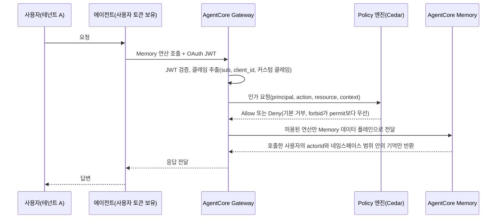

# AgentCore Memory 접근 제어와 AWS Agent Registry 정리

AgentCore Memory 세밀 접근 제어(2026년 8월 28일)와 AWS Agent Registry GA(2026년 8월 31일)로 AgentCore 거버넌스 레이어 정리

<!-- more -->

## 왜 필요한가

에이전트를 하나 만드는 단계를 지나 팀마다 에이전트와 도구가 늘어나면 문제가 "어떻게 만드나"에서 "누가 무엇에 접근하고 무엇이 어디에 존재하나"로 바뀜. 2026년 8월 말 AWS가 연이어 내놓은 두 발표가 이 지점을 겨냥함

| 발표 | 날짜 | 해결하려는 문제 |
|---|---|---|
| AgentCore Memory 세밀 접근 제어 | 2026년 8월 28일 발표 | 멀티 테넌트 격리를 인프라 레이어에서 강제. 사용자 A의 에이전트가 사용자 B의 기억을 읽지 못하게 차단하고 애플리케이션 코드에는 인가 로직을 두지 않음 |
| AWS Agent Registry GA | 2026년 8월 31일 | 조직 안에 어떤 에이전트, 도구, 스킬, MCP 서버가 존재하고 누가 소유하며 무엇을 믿고 재사용해도 되는지 모르는 문제(에이전트 난립과 미등록 에이전트, AWS 표현으로는 섀도 AI) |

Memory 세밀 접근 제어는 기존 구성 요소(Gateway, Policy)를 연결해 확장한 것이고, Registry는 AgentCore와 통합되는 별도 신규 서비스. 둘 다 개별 기능보다 거버넌스 레이어 전체를 놓고 보면 이해가 빠름

---

## 거버넌스 구성 요소 다섯 개

각 구성 요소는 한 가지 질문에 답함. Identity와 Gateway는 같은 날 GA, 이후 Policy, Memory 접근 제어, Registry 순으로 추가됨

| 질문 | 구성 요소 | 하는 일 | 공개 시점 | 서울 리전 | 요금 |
|---|---|---|---|---|---|
| 누가 호출하나 | AgentCore Identity | 에이전트를 워크로드 아이덴티티로 다룸. 인바운드 인증은 JWT 또는 IAM SigV4(AWS 요청 서명 방식). 아웃바운드는 OAuth 2LO/3LO(서비스 계정 방식과 사용자 동의 방식) 자격 증명과 API 키를 토큰 볼트에 보관. OBO(On Behalf Of, 사용자 대신 호출) 토큰 교환은 2026년 4월, Secrets Manager 연동은 2026년 6월 추가 | 2025년 10월 13일 GA | 지원 | 비 AWS 리소스 대상 1,000 요청당 $0.010. Runtime이나 Gateway 경유 시 무료 |
| 어디로 나가나 | AgentCore Gateway | REST, OpenAPI, Lambda를 MCP 도구로 변환하고 외부 MCP 서버와 A2A 에이전트를 패스스루로 연결. 도구 호출을 Gateway로 모으면 정책 집행 지점이 한 곳으로 모임 | 2025년 10월 13일 GA | 지원 | 1,000 호출당 $0.005. 검색 API 1,000건당 $0.025. 도구 인덱싱 100개당 월 $0.02 |
| 무엇을 해도 되나 | Policy in AgentCore | 자연어로 쓴 정책을 Cedar(AWS 오픈소스 정책 언어)로 변환해 정책 엔진에 저장(세션 이력 기반 정책은 Cedar 호환 언어 Dogwood로 작성). Gateway에 붙여 도구 호출마다 허용 여부 평가. 기본 거부, forbid가 permit보다 우선. Guardrails 결합(2026년 6월), 세션 이력 기반 정책(temporal policy)과 속도 제한(2026년 8월) | 2026년 3월 3일 GA(프리뷰 2025년 12월) | 지원 | 인가 요청당 $0.000025(엔진당 세션 이력 기반 정책 100개까지는 인가 요금 무료). 자연어 정책 작성 1,000 토큰당 $0.13 |
| 누구의 기억에 접근하나 | Memory 세밀 접근 제어 | Memory 앞에 Gateway를 두고 Memory 커넥터로 12개 Memory 연산을 Cedar 액션으로 노출. JWT 클레임으로 정한 actorId와 네임스페이스 안으로 접근 범위 제한 | 2026년 8월 28일 발표 | 구성 요소(Memory, Gateway, Policy)는 모두 서울 지원. 기능 전용 리전 표기는 문서에 없음 | 별도 요금 없음. Memory, Gateway, Policy 기존 요금 적용 |
| 무엇이 존재하나 | AWS Agent Registry | 에이전트, 도구, 스킬, MCP 서버, 커스텀 리소스의 프라이빗 카탈로그. 검색, 승인 워크플로우, 자동 탐지, 크로스 계정 공유 | 2026년 8월 31일 GA | 미지원(버지니아 북부, 오레곤, 아일랜드, 도쿄, 시드니만 지원) | 월 5,000 레코드 무료, 이후 1,000건당 $0.40. 검색 API 월 100만 건 무료, 이후 1,000건당 $0.02. List와 Get 월 200만 건 무료, 이후 1,000건당 $0.004 |

Registry만 이름이 "Amazon Bedrock AgentCore"가 아니라 "AWS Agent Registry"이고 API 레퍼런스도 별도 네임스페이스에 있음(개발자 가이드는 AgentCore 가이드 안에 포함). AgentCore와 깊게 통합돼 있지만 AgentCore 밖의 MCP 서버와 A2A 에이전트까지 담는 조직 단위 카탈로그에 해당

---

## Memory 접근 제어 동작 흐름

핵심은 Memory 자체에 권한 기능이 생긴 것이 아니라, 이미 있던 Gateway + Policy 조합에 Memory 커넥터가 추가된 것. 그래서 도구 호출에 쓰던 Cedar 정책 문법 그대로 기억 접근도 통제함

| 요소 | 내용 |
|---|---|
| 인바운드 인증 | Gateway에 OAuth JWT 인바운드 인증 설정. IAM SigV4로 서명하는 호출자는 Cedar 정책에서 IAM ARN 패턴으로 지정 |
| Memory 커넥터 | Gateway 타깃을 Memory 데이터 플레인에 연결하는 관리형 커넥터. BatchCreateMemoryRecords, BatchUpdateMemoryRecords, BatchDeleteMemoryRecords 3개는 Cedar 액션 목록에서 제외돼 세밀 제어 대상이 아님 |
| Cedar 액션 12개 | ListEvents, CreateEvent, GetEvent, DeleteEvent, ListSessions, ListActors, RetrieveMemoryRecords, ListMemoryRecords, GetMemoryRecord, DeleteMemoryRecord, ListMemoryExtractionJobs, StartMemoryExtractionJob. 액션 ID는 `타깃이름___METHOD:경로` 형태. 와일드카드 미지원이라 여러 연산은 `action in [...]`으로 나열 |
| 정책 조건 | `context.input` 아래 경로 파라미터(memoryId, actorId, sessionId, eventId, memoryRecordId)와 본문 필드(namespace, namespacePath, metadata, filter, payload). principal 조건은 `principal.getTag("sub")`처럼 JWT 클레임 참조. sub는 IdP(인증 공급자)가 발급하는 사용자 고유 식별자 |
| 대표 격리 패턴 | `context.input.actorId == principal.getTag("sub")`. 인증된 사용자의 sub와 Memory의 actorId가 같을 때만 허용 |
| 기존 배포의 마이그레이션 경로 | actorId를 IdP의 sub와 다르게 설계한 경우 선택지 세 가지. 커스텀 JWT 클레임(예: `custom:app_user_id`)과 매칭, 네임스페이스 기준으로 격리, actorId를 sub 기준으로 이관 |
| 적용 모드 | ENFORCE와 LOG_ONLY. LOG_ONLY로 먼저 돌려 차단될 요청을 확인한 뒤 ENFORCE로 전환 |
| 애플리케이션 코드 영향 | 인가 로직을 코드에 넣지 않음. 코드로 작성하는 Gateway 요청 인터셉터와는 다른 경로 |

멀티 테넌트 관점에서 정리하면 다음과 같음. 기존 방식은 에이전트 코드가 요청마다 올바른 actorId와 네임스페이스를 넣어 조회 범위를 스스로 제한했고, Memory 쪽에는 백엔드의 IAM 롤만 보여 어떤 최종 사용자의 요청인지 인프라에서 확인할 지점이 없었음. 모든 Memory 호출이 Gateway를 지나고 ENFORCE 모드라면, 에이전트가 다른 actorId를 넣어도 정책 단계에서 차단됨

---

## AWS Agent Registry

| 항목 | 내용 |
|---|---|
| 레코드 유형 | MCP(서버, 도구, 리소스, 프롬프트), Agent(A2A 에이전트 카드), Skill(마크다운 스킬 정의와 코드), Custom(임의 JSON) |
| 검색 | 시맨틱 검색과 키워드 검색. 콘솔 브라우즈 화면. Registry 검색 API 자체가 MCP 서버로 노출돼 Kiro, Claude Code 같은 MCP 클라이언트에서 Dynamic Client Registration으로 연결해 바로 검색 |
| 라이프사이클 | DRAFT → PENDING_APPROVAL → APPROVED 또는 REJECTED → DEPRECATED. 자동 승인 플래그, EventBridge로 보안 스캔이나 중복 검사 같은 승인 자동화, 검토와 승인을 맡는 Curator 역할 |
| 자동 탐지 | 연결한 계정과 OU(AWS Organizations 조직 단위)의 AgentCore Runtime 에이전트와 Gateway 리소스를 자동 탐지해 Detected Endpoints 화면에 DRAFT 레코드로 표시. 에이전트를 만든 팀이 직접 등록하지 않아도 새 배포가 목록에 나타남 |
| 통합 | Amazon Bedrock AgentCore, Amazon Quick(Quick Suite. 승인된 리소스가 Integrations 화면에 노출), Kiro IDE, 콘솔, CLI, SDK, PrivateLink, IAM Identity Center |
| 거버넌스 | CloudTrail 감사 추적, 태그 기반 분류와 비용 할당, 커스텀 메타데이터 스키마(비용 센터, 데이터 등급, SLA 등. 블로그는 이 중 일부를 로드맵 기능으로 표시) |
| 멀티 계정 | AWS RAM(Resource Access Manager)으로 계정 간 공유. 조직 전체 레지스트리 하나 또는 규제, 사업부, 데이터 상주 기준으로 여러 인스턴스 |
| IaC(Infrastructure as Code) | CloudFormation, Terraform, CDK |
| 리전 | 버지니아 북부, 오레곤, 아일랜드, 도쿄, 시드니. 서울 미지원 |
| 공개 사례 | Southwest Airlines, PepsiCo, Syngenta, Amdocs |

Registry가 없을 때 흔한 상황. 같은 사내 API를 감싼 MCP 서버가 팀마다 하나씩 생기고, 누가 만든 에이전트가 프로덕션 계정에서 돌고 있는지 플랫폼 팀이 모름. 검색과 카탈로그가 중복 제작을, 자동 탐지가 미등록 배포를 각각 겨냥함

---

## Azure, GCP 대응

| 역할 | AWS | Azure(Microsoft Foundry) | GCP(Gemini Enterprise Agent Platform) |
|---|---|---|---|
| 아이덴티티 | AgentCore Identity | Entra Agent ID. 배포 시 에이전트별 Entra 아이덴티티 자동 생성 | Agent Identity(2026년 4월 GA) |
| 도구 관문 | AgentCore Gateway | Toolbox(관리형 MCP 엔드포인트. 인증과 버전 관리 중앙화, 도구 검색 등 일부 기능은 프리뷰) | Agent Gateway(2026년 6월 GA, 서울 미지원) |
| 정책 | Policy in AgentCore(Cedar) | Foundry Guardrails(에이전트 가드레일과 도구 호출 개입은 프리뷰) | Model Armor(Agent Gateway 연동 GA), Semantic Governance Policies(공개 프리뷰), IAM 거버넌스 정책(비공개 프리뷰) |
| 메모리 접근 제어 | Memory FGAC(Gateway + Cedar) | Memory는 공개 프리뷰. scope 파라미터로 사용자별 격리 제공(`{{$userId}}` 지정 시 토큰 클레임으로 자동 해석). 정책 언어 기반의 세밀 접근 제어는 없음 | Memory Bank에 IAM Conditions로 세션, 메모리 단위 접근 제어 |
| 레지스트리 | AWS Agent Registry | Microsoft Agent 365(2026년 5월 GA) + Entra Agent ID 인벤토리 | Agent Registry(2026년 6월 GA, A2A v1.0과 0.3) |

세 클라우드 모두 아이덴티티, 관문, 정책, 레지스트리 네 축은 갖췄고, 메모리 접근 제어를 도구 정책과 같은 정책 언어로 묶은 곳은 AWS와 GCP. AWS는 Gateway의 Cedar 정책 엔진이 도구 호출과 Memory 연산을 함께 평가하고, GCP는 Agent Gateway와 Memory Bank를 IAM Conditions의 CEL 표현식으로 통제. Azure는 메모리 격리를 scope 파라미터로, 도구 통제를 Guardrails로 각각 처리. 리전 공백은 AWS가 Registry, GCP가 Agent Gateway에 있음

---

## 도입 순서

| 순서 | 구성 요소 | 이유 |
|---|---|---|
| 1 | Identity | 이후 모든 정책이 "누구인가"를 전제로 함. JWT 클레임 설계(sub, 테넌트 ID)를 여기서 정함 |
| 2 | Gateway | 도구와 Memory 호출이 전부 관문을 지나야 정책을 걸 수 있음. 직접 호출 경로가 남아 있으면 정책이 우회됨 |
| 3 | Policy | LOG_ONLY로 시작해 실제 트래픽에서 차단 대상을 확인한 뒤 ENFORCE |
| 4 | Memory 접근 제어 | actorId를 sub와 맞추는 설계가 되어 있어야 정책이 단순해짐. 기존 배포는 마이그레이션 경로 세 가지 중 선택 |
| 5 | Registry | 위 넷이 계정별로 자리 잡은 뒤 조직 단위로 묶음. 서울 워크로드는 리전 추가를 기다리거나 도쿄 리전 레지스트리에 등록해 운영 |

---

## 결론

- AgentCore 거버넌스는 누가, 어디로, 무엇을, 누구의 기억을, 무엇이 존재하는지 다섯 질문에 대응하는 Identity, Gateway, Policy, Memory 접근 제어, Registry로 구성
- Memory 세밀 접근 제어는 새 엔진이 아니라 Gateway와 Policy에 Memory 커넥터를 붙인 것. 도구 호출과 기억 접근을 Cedar 정책 하나로 통제하고 애플리케이션 코드에 인가 로직을 두지 않음
- 12개 Memory 연산이 Cedar 액션으로 노출되며 배치 연산 3개는 제외. 대표 패턴은 actorId와 JWT sub 일치
- AWS Agent Registry는 카탈로그에 자동 탐지와 승인 워크플로우를 더한 것. 미등록 에이전트를 발견해 DRAFT로 올리고 Curator가 승인하는 흐름
- 서울 리전은 Identity, Gateway, Policy, Memory가 모두 지원되어 접근 제어 스택은 바로 쓸 수 있고, Registry만 5개 리전 한정
- 도입은 Identity → Gateway → Policy → Memory 접근 제어 → Registry 순서. AWS가 공개한 성숙도 경로(Connect, Control, Catalog, Harden)와 큰 틀에서 겹치고 Memory 접근 제어 단계를 더한 것. 관문을 우회하는 호출 경로가 남아 있으면 정책이 무의미해짐
