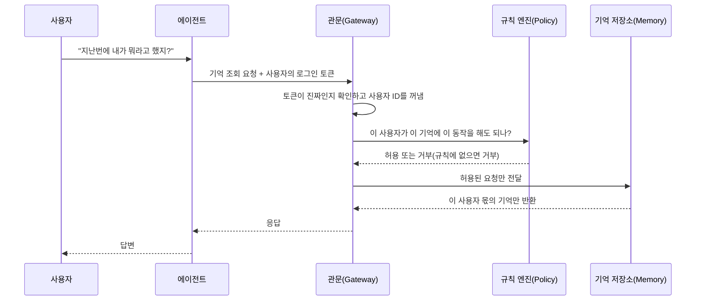

# AgentCore Memory 접근 제어와 AWS Agent Registry 정리

AgentCore Memory 세밀 접근 제어(2026년 8월 28일)와 AWS Agent Registry GA(2026년 8월 31일)로 AgentCore 거버넌스 레이어 정리

<!-- more -->

## 왜 필요한가

에이전트를 하나 만드는 단계를 지나 팀마다 에이전트와 도구가 늘어나면 문제가 "어떻게 만드나"에서 "누가 무엇에 접근하고 무엇이 어디에 존재하나"로 바뀜

| 발표 | 날짜 | 해결하려는 문제 |
|---|---|---|
| AgentCore Memory 세밀 접근 제어 | 2026년 8월 28일 발표 | 여러 회사나 사용자가 같은 에이전트 서비스를 쓸 때, 사용자 A의 에이전트가 사용자 B의 기억을 읽지 못하게 막는 일을 애플리케이션 코드가 아니라 인프라에서 강제 |
| AWS Agent Registry GA | 2026년 8월 31일 | 조직 안에 어떤 에이전트, 도구, 스킬, MCP 서버가 존재하고 누가 소유하며 무엇을 믿고 재사용해도 되는지 모르는 문제(에이전트 난립과 미등록 에이전트, AWS 표현으로는 섀도 AI) |

Memory 세밀 접근 제어는 기존 구성 요소(Gateway, Policy)를 연결해 확장한 것이고, Registry는 AgentCore와 통합되는 별도 신규 서비스. 둘 다 개별 기능보다 거버넌스 레이어 전체를 놓고 보면 이해가 빠름

---

## 거버넌스 구성 요소 다섯 개

각 구성 요소는 한 가지 질문에 답함. Identity와 Gateway는 같은 날 나왔고, 이후 Policy, Memory 접근 제어, Registry 순으로 추가됨

| 질문 | 구성 요소 | 하는 일 | 요금 |
|---|---|---|---|
| 누가 호출하나 | AgentCore Identity | 에이전트를 워크로드 아이덴티티로 다룸. 인바운드 인증은 JWT 또는 IAM SigV4(AWS 요청 서명 방식). 아웃바운드는 OAuth 2LO/3LO(서비스 계정 방식과 사용자 동의 방식) 자격 증명과 API 키를 토큰 볼트에 보관. OBO(On Behalf Of, 사용자 대신 호출) 토큰 교환은 2026년 4월, Secrets Manager 연동은 2026년 6월 추가 | 유료(Runtime이나 Gateway를 거쳐 쓰면 무료) |
| 어디로 나가나 | AgentCore Gateway | REST, OpenAPI, Lambda를 MCP 도구로 변환하고 외부 MCP 서버와 A2A 에이전트를 패스스루로 연결. 도구 호출을 Gateway로 모으면 정책 집행 지점이 한 곳으로 모임 | 유료 |
| 무엇을 해도 되나 | Policy in AgentCore | 자연어로 쓴 정책을 Cedar(AWS 오픈소스 정책 언어)로 변환해 정책 엔진에 저장(세션 이력 기반 정책은 Cedar 호환 언어 Dogwood로 작성). Gateway에 붙여 도구 호출마다 허용 여부 평가. 기본 거부, forbid가 permit보다 우선. Guardrails 결합(2026년 6월), 세션 이력 기반 정책(temporal policy)과 속도 제한(2026년 8월) | 유료 |
| 누구의 기억에 접근하나 | Memory 세밀 접근 제어 | Memory 앞에 Gateway를 두고 Memory 커넥터로 12개 Memory 연산을 Cedar 액션으로 노출. JWT 클레임으로 정한 actorId와 네임스페이스 안으로 접근 범위 제한 | 무료(Memory, Gateway, Policy 기존 요금만 적용) |
| 무엇이 존재하나 | AWS Agent Registry | 에이전트, 도구, 스킬, MCP 서버, 커스텀 리소스의 프라이빗 카탈로그. 검색, 승인 워크플로우, 자동 탐지, 크로스 계정 공유 | 유료(월 5,000 레코드, 검색 100만 건까지 무료) |

Registry만 이름이 "Amazon Bedrock AgentCore"가 아니라 "AWS Agent Registry"이고 API 레퍼런스도 별도 네임스페이스에 있음(개발자 가이드는 AgentCore 가이드 안에 포함). AgentCore와 통합되어 있지만 AgentCore 밖의 MCP 서버와 A2A 에이전트까지 담는 조직 단위 카탈로그에 해당

---

## Memory 접근 제어 동작 흐름

핵심은 Memory 자체에 권한 기능이 생긴 것이 아니라, 이미 있던 관문(Gateway)과 규칙(Policy)에 기억 저장소(Memory)를 연결한 것. 그래서 도구 사용을 통제하던 규칙과 같은 방식으로 기억 접근도 통제함

| 단계 | 쉽게 풀면 |
|---|---|
| 로그인 확인 | 사용자가 로그인해서 받은 토큰을 관문이 검사함. 토큰 안에는 "이 사람이 누구인지"를 나타내는 사용자 ID가 들어 있음. 사람이 아니라 AWS 안의 서버가 호출할 때는 그 서버의 IAM 신원으로 구분 |
| 연결 부품 | 관문이 기억 저장소와 대화할 수 있게 해 주는 부품(Memory 커넥터)을 붙임. 기억을 저장하고 읽고 지우는 동작 12가지가 각각 "허용할지 거부할지 판단하는 대상"이 됨. 여러 건을 한꺼번에 만들거나 고치거나 지우는 동작 3가지는 이 대상에 들어가지 않음 |
| 규칙 작성 | "요청한 사람의 사용자 ID와 조회하려는 기억의 주인 ID가 같을 때만 허용" 같은 규칙을 씀. 규칙에는 어떤 동작인지, 누구의 기억인지, 어떤 폴더(네임스페이스)인지 조건을 넣을 수 있음. 규칙에 없는 요청은 기본이 거부이고, 금지 규칙이 허용 규칙보다 우선 |
| 시험 운전 | 처음에는 차단하지 않고 기록만 남기는 모드(LOG_ONLY)로 돌려 어떤 요청이 막힐지 확인한 뒤, 실제로 차단하는 모드(ENFORCE)로 바꿈 |
| 기존 시스템에 적용 | 이미 기억을 저장할 때 쓰던 사용자 ID가 로그인 ID와 다르게 되어 있다면 세 가지 중 하나를 고름. 토큰에 담긴 다른 항목과 맞추기, 폴더 기준으로 나누기, 저장에 쓰는 ID를 로그인 ID로 바꾸기 |
| 코드 수정 | 애플리케이션 코드에 권한 검사 로직을 넣지 않아도 됨. 코드로 직접 검사 로직을 짜는 방식(Gateway 요청 인터셉터)은 별도로 존재 |

이 구조가 왜 중요한지 풀어 쓰면 다음과 같음. 이전에는 에이전트 코드가 "이 사용자의 기억만 조회한다"는 규칙을 스스로 지켜야 했음. 기억 저장소 입장에서는 요청을 보낸 것이 우리 서버라는 사실만 알 수 있고, 그 뒤에 어떤 사용자가 있는지는 알 수 없었기 때문. 이제는 모든 요청이 관문을 지나면서 로그인 정보와 대조되므로, 에이전트가 실수로든 공격을 당해서든 다른 사용자의 ID를 넣어도 관문에서 막힘. 단 기억 저장소를 관문 없이 직접 호출하는 경로가 남아 있으면 그 경로는 검사를 받지 않음

---

## AWS Agent Registry

| 항목 | 내용 |
|---|---|
| 등록할 수 있는 항목의 종류 | 프로토콜이 아니라 목록에 올릴 수 있는 것의 종류. 네 가지. MCP 서버(에이전트가 쓰는 도구 묶음), 에이전트(A2A 형식으로 쓴 에이전트 명함), 스킬(마크다운으로 쓴 작업 방법과 그에 딸린 코드), 그 밖의 항목(자유 형식 JSON) |
| 검색 | 뜻으로 찾는 시맨틱 검색과 이름으로 찾는 키워드 검색. 콘솔에서 목록을 훑어보는 화면. 검색 기능 자체가 MCP 서버로도 열려 있어 Kiro, Claude Code 같은 개발 도구 안에서 바로 검색 가능 |
| 등록에서 승인까지 | 초안(DRAFT) → 승인 대기(PENDING_APPROVAL) → 승인(APPROVED) 또는 반려(REJECTED) → 폐기(DEPRECATED). 자동 승인 옵션, EventBridge로 보안 검사나 중복 검사 같은 절차 자동화, 검토와 승인을 맡는 담당자 역할(Curator) |
| 자동 탐지 | 연결한 계정과 조직 단위(OU)에서 AgentCore Runtime에 배포된 에이전트와 Gateway에 연결된 리소스를 자동으로 찾아 "발견된 엔드포인트" 화면에 초안으로 올림. 만든 팀이 직접 등록하지 않아도 새 배포가 목록에 나타남 |
| 함께 쓰는 곳 | Amazon Bedrock AgentCore, Amazon Quick(Quick Suite. 승인된 항목이 Integrations 화면에 노출), Kiro IDE, 콘솔, CLI, SDK, PrivateLink, IAM Identity Center |
| 관리 기능 | CloudTrail 감사 기록, 태그로 분류와 비용 배분, 항목마다 붙이는 추가 정보 양식(비용 센터, 데이터 등급, SLA 등. 블로그는 이 중 일부를 로드맵 기능으로 표시) |
| 여러 계정 | AWS RAM(Resource Access Manager)으로 계정 간 공유. 회사 전체 레지스트리 하나를 두거나 규제, 사업부, 데이터 상주 기준으로 여러 개 운영 |

Registry가 없을 때 흔한 상황. 같은 사내 API를 감싼 MCP 서버가 팀마다 하나씩 생기고, 누가 만든 에이전트가 프로덕션 계정에서 돌고 있는지 플랫폼 팀이 모름. 검색과 카탈로그가 중복 제작을, 자동 탐지가 미등록 배포를 각각 겨냥함

---

## Azure, GCP 에서는?

| 역할 | AWS | Azure(Microsoft Foundry) | GCP(Gemini Enterprise Agent Platform) |
|---|---|---|---|
| 아이덴티티 | AgentCore Identity | Entra Agent ID | Agent Identity |
| 도구 관문 | AgentCore Gateway | Toolbox | Agent Gateway(서울 미지원) |
| 정책 | Policy in AgentCore | Foundry Guardrails | Model Armor, Semantic Governance Policies |
| 메모리 접근 제어 | Memory 세밀 접근 제어(정책 규칙으로 통제) | Memory의 scope 파라미터로 사용자별 격리 | Memory Bank의 IAM Conditions |
| 레지스트리 | AWS Agent Registry | Microsoft Agent 365 | Agent Registry |

---

## 도입 순서

| 순서 | 구성 요소 | 쉽게 풀면 |
|---|---|---|
| 1 | Identity | 먼저 "누가 요청했는지"를 확실히 알 수 있어야 뒤의 규칙이 의미가 있음. 로그인 토큰에 어떤 정보(사용자 ID, 소속 회사 ID)를 담을지 여기서 정함 |
| 2 | Gateway | 도구 호출과 기억 조회가 전부 이 관문을 지나가게 만들어야 규칙을 한 곳에서 걸 수 있음. 관문을 거치지 않는 직접 호출 경로가 남아 있으면 규칙이 소용없음 |
| 3 | Policy | 규칙을 쓰고, 처음에는 기록만 남기는 모드로 돌려 실제로 무엇이 막히는지 확인한 뒤 차단 모드로 바꿈 |
| 4 | Memory 접근 제어 | 기억을 저장할 때 쓰는 사용자 ID를 로그인 ID와 같게 맞춰 두면 규칙이 "둘이 같으면 허용" 한 줄로 끝남. 이미 다르게 되어 있다면 위의 세 가지 방법 중 선택 |
| 5 | Registry | 위 넷이 팀이나 계정 단위로 자리 잡은 뒤 회사 전체 목록으로 묶음. 서울 리전에는 아직 없으니 도쿄 리전 레지스트리에 등록하거나 출시를 기다림 |

AWS가 제시한 순서(연결 → 통제 → 목록화 → 강화)와 대체로 같고, 여기에 기억 접근 제어 단계를 더한 것

---

## 결론

- AgentCore 거버넌스는 다섯 질문에 답하는 다섯 부품. 누가 호출하나(Identity), 어디로 나가나(Gateway), 무엇을 해도 되나(Policy), 누구의 기억에 접근하나(Memory 접근 제어), 무엇이 존재하나(Registry)
- Memory 접근 제어는 새 기능이라기보다 관문과 규칙에 기억 저장소를 연결한 것. 도구 사용 규칙과 기억 접근 규칙을 한 곳에서 같은 방식으로 씀
- 규칙의 핵심은 한 줄. 요청한 사람의 로그인 ID와 기억의 주인 ID가 같을 때만 허용
- Agent Registry는 회사 안의 에이전트, 도구, 스킬 목록. 실행 중인 에이전트를 자동으로 찾아 초안으로 올리고, 담당자가 승인해야 정식 목록에 들어감
- 서울 리전에서는 Identity, Gateway, Policy, Memory가 모두 되므로 기억 접근 제어는 바로 쓸 수 있고, Registry만 아직 없음
- 순서는 로그인 확인 → 관문 → 규칙 → 기억 접근 제어 → 목록. 관문을 거치지 않는 호출 경로를 남기지 않는 것이 전부의 전제
