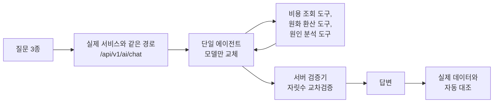

# AI 채팅 기본 모델을 Nova에서 GPT-5.6으로 바꾼 이유

프롬프트의 부탁은 통하지 않았고 루프를 막자 이번에는 자릿수가 틀렸음

<!-- more -->

사내 클라우드 비용 분석 서비스의 AI 채팅을 고치다가 기본 모델까지 바꾼 하루의 기록. 결론부터 적으면 모델 교체는 맨 나중에 온 조치였고, 그 전에 앱 쪽에서 고칠 것이 훨씬 많았음

---

## 시작은 실패 두 건

전날 밤 운영 로그에서 실패 두 건을 발견함

- 원인 분석 도구가 호출 예산을 넘긴 뒤 재시도까지 소진해 중단
- 원화 환산 도구를 같은 인자로 28회 반복하다 사용자가 취소

둘 다 도구 호출이 한도를 넘겨 끝난 경우. 하나는 호출 예산, 하나는 같은 인자 반복이었음. 답을 못 만든 것이 아니라 답을 만들 차례가 오지 않았음

## 고치려는 배포가 더 나빴음

반복 차단 코드를 넣고 배포함. 결과는 같은 질문이 2분 19초 동안 같은 도구 3개를 9회 돌다 사용자가 취소. 두 번째 배포 뒤에는 최종 답변 검증 재시도가 소진되며 실패. 사용자 요청으로 전날 버전으로 롤백함

롤백한 버전이 안전한지 확인하려고, 질문을 대신 보내고 응답을 끝까지 받아 기록하는 자동 실행 스크립트로 다시 재봤더니 3회 중 1회만 성공했고 소요는 44초에서 103초. 돌아갈 곳도 안정적이지 않았음. 같은 실패가 8월 19일에도 있었다는 사실을 로그에서 확인함

이 시점에서 감으로 고치는 것을 멈추고 원인부터 정리함. 이후로는 고칠 때마다 자동 실행으로 다시 재기로 함

## 원인은 부탁과 관측 공백

정리하면 원인은 두 가지였음

- 프롬프트에 적어 둔 "그만 부르세요" 같은 안내는 부탁일 뿐. 모델이 무시하면 아무도 끊을 수 없음. 게다가 에이전트가 매 스텝에서 도구 호출만 내놓도록 출력 형식이 잡혀 있어, 반드시 도구를 하나 골라야 하는 구조가 반복을 부추김
- 최종 답변 검증 재시도 한도가 2회로 짧았고, 어떤 검증이 왜 실패했는지 남는 로그가 없어 사후 확인이 불가능했음

## 가드 3종을 넣음

- 같은 인자로 같은 도구를 반복하거나 호출 예산을 넘기면 모델에게 주던 도구 목록을 빼고 최종 답변을 강제
- 재시도 한도 상향
- 재시도 사유 로깅

같은 질문 6회가 모두 27초 안에 끝남. 이 6회는 가드를 넣은 직후 확인 실행이고, 아래 표의 8회는 모델 비교용으로 다시 잰 값

| 조건 | 실행 | 성공 | 소요 | 실패 양상 |
|---|---|---|---|---|
| 가드 없음 | 3 | 1/3 | 44초에서 103초 | 원인 분석 도구가 호출 예산을 넘긴 뒤 재시도까지 소진해 중단, 원화 환산 도구를 같은 인자로 33회 반복해 요청 한도 소진 |
| 가드 적용 | 8 | 8/8 | 16초에서 40초 | 없음 |

표의 33회는 롤백 버전을 자동 실행으로 다시 돌려 본 실행에서 나온 값. 앞에서 적은 28회는 전날 밤 운영에서 사용자가 취소한 건으로 서로 다른 실행

가드 적용 후 8회의 소요는 질문에 따라 갈림. 도구를 4회만 부른 계정 기여도 질문이 16초에서 17초, 도구를 17회에서 18회 부른 EC2 분해 질문이 38초에서 40초

## 빨라진 만큼 빨리 틀렸음

답이 빨라지자 틀린 답도 빨리 왔음. 답변에 나온 숫자를 실제 데이터와 대조해 보니 6회 중 3회에서 4회가 USD 값을 1,000배 해 원화로 적고 있었음

원인을 찾아보니 모델이 아니라 서버였음

- 대시보드 요약 도구 결과에 통화 표기가 없어 모델이 단위를 추측함
- "이번 달"을 달력월인 9월로 주입해, 데이터가 아직 없는 달을 분석하게 만듦
- 데이터가 없는 달을 원인 분석 도구가 거부하지 않고 100% 감소로 계산함

조치는 네 가지. 도구 결과에 통화 명시, 데이터가 들어 있는 최신 월을 기준월로 주입, 빈 월 거부, 답변의 자릿수를 도구 계산과 대조하는 교차검증기 추가. 자릿수 오류 답변은 대시보드 통화를 명시한 뒤 6회 중 2회, 자릿수 교차검증을 넣은 뒤 8회 중 0회로 줄었음

검증기가 정당한 값을 오탐한 사례도 하나 있었음. 정상 환산값 41,423,290원을 무관한 값 414.16 USD의 10만 배로 판정한 건. 검증기 쪽을 고침

여기까지가 모델을 바꾸기 전에 앱에서 한 일. 지금부터가 모델 비교

---

## 측정 조건

모델을 고르기 전에 계정 제약부터 걸림. AWS MSP channel program 계정이라 Anthropic 모델 전체가 정책으로 차단됨(`Access to this model is not available for channel program accounts`). 남은 선택지가 Amazon Nova 계열과 OpenAI GPT-5.6 계열이라 이 4종을 비교함

| 항목 | 내용 |
|---|---|
| 대상 시스템 | 사내 클라우드 비용 분석 서비스의 AI 채팅(FastAPI, pydantic-ai 1.107.2, Bedrock Converse) |
| 측정 방식 | 실제 서비스와 같은 경로(`/api/v1/ai/chat`)로 질문을 보내고 스트리밍 응답을 끝까지 받아 기록하는 자동 실행 스크립트. 임시 계정으로 호출 |
| 질문 3종 | 이번 달 EC2 비용의 전월 대비 변화와 사용 유형별 분해, 특정 계정 그룹의 7월과 6월 EC2 비교, 전월 대비 증가액 기준 계정 기여도 |
| 실행 조건 | 빠른 답변(단일 에이전트) 모드, 동일 데이터 그룹, 모델만 교체 |
| 판정 방법 | 답변에 나온 수치를 실제 데이터와 자동 대조. USD 값을 1,000배 또는 100만 배로 부풀려 원화로 적은 자릿수 오류는 따로 판정 |
| 측정 시점 | 2026년 9월 2일 하루 |

측정 대상은 모델 단독 성능이 아니라 질문 하나에 답을 마칠 때까지의 한 턴 전체. 프롬프트, 도구 세트, 가드 코드를 고정하고 모델만 바꿈

로그를 읽을 때 주의할 점이 하나 있음. 화면에서 고른 모델 이름이 백엔드 매핑을 거쳐 호출되기 때문에 로그에 남는 키와 실제 호출 모델이 다를 수 있음. 이 측정에서도 Nova Pro가 앱 내부 레거시 키인 `sonnet_4_6`으로 기록됐고, 실제 호출은 `apac.amazon.nova-pro-v1:0`. Anthropic 모델은 계정 정책으로 차단돼 있어 실행 자체가 불가능함

## 호출 제약

토큰 하나만 만들게 하는 최소 요청과 도구 하나만 부르게 하는 최소 요청으로 확인한 제약

| 모델 | 계정 호출 | 도구 호출 | 도구 사용 강제 옵션(toolChoice) | temperature | 최소 요청 지연 | 단가(100만 토큰) |
|---|---|---|---|---|---|---|
| Nova 2 Lite | 가능 | 정상 | 지원 | 지원 | 0.64초 | 입력 $0.18에서 $0.36 사이, 출력 $1.48에서 $2.96 사이 |
| Nova Pro | 가능 | 정상 | 지원 | 지원 | 0.59초 | 입력 $0.95, 출력 $3.80 |
| GPT-5.6 Luna | 가능 | 정상 | 지원 | 거부(400) | 2.6초에서 11.7초 사이 | Pricing API 미등록 |
| GPT-5.6 Terra | 가능 | 정상 | 지원 | 거부(400) | 2.5초에서 10.8초 사이 | Pricing API 미등록 |
| Claude 전 모델 | 차단 | 확인 불가 | 확인 불가 | 확인 불가 | 확인 불가 | 확인 불가 |

- temperature를 넣으면 400 응답과 함께 "This model doesn't support the temperature field" 메시지가 옴. 기존 코드가 temperature를 넣고 있으면 그대로 실패
- GPT-5.6에는 제약 두 가지와 특성 하나가 더 있음. 추론에 얼마나 힘을 쓸지 지정하는 `reasoning_effort` 필드는 모르는 파라미터라며 거부, `maxTokens=1`은 최소값 미만 오류. 특성은 모델이 생각한 내용(reasoningContent)이 응답에 함께 담겨 오는 것
- Nova 단가는 Pricing API 조회값. Nova 2 Lite는 리전 교차 요금 기준이라 구간으로 조회됐고, Nova Pro는 서울 리전 온디맨드 기준
- GPT-5.6 단가는 2026년 9월 2일 기준 Pricing API에 없음. us-east-1 상품 1,032개를 전수 확인해도 나오지 않음

## 응답 시간

| 모델 | 실행 수 | 응답 성공 | 평균 소요(초) | 중앙값(초) | 도구 호출 수 평균 | 입력 토큰 중앙값 | 출력 토큰 중앙값 | 1회 추정 비용 |
|---|---|---|---|---|---|---|---|---|
| Nova 2 Lite | 8 | 8/8 | 28.5 | 28.4 | 10.2 | 89,301 | 1,090 | $0.018에서 $0.035 사이 |
| Nova Pro | 3 | 3/3 | 12.9 | 13.3 | 7.7 | 69,549 | 905 | 약 $0.07 |
| GPT-5.6 Luna | 3 | 3/3 | 20.2 | 12.6 | 4.0 | 23,366 | 872 | 단가 미확정 |
| GPT-5.6 Terra | 2(참고 3회 별도) | 2/2 | 22.4 | 22.4 | 4.5 | 27,727 | 1,155 | 단가 미확정 |

호출 하나의 지연은 Nova가 0.6초 안팎, GPT-5.6이 2.5초에서 11.7초 사이. 네 배에서 스무 배 가까운 차이. 그런데 턴 전체로 보면 순서가 뒤집힘. Nova 2 Lite 28.5초, Terra 22.4초, Luna 20.2초로 GPT 쪽이 6초에서 8초 빠름. Nova 2 Lite가 도구를 평균 10.2회 부르는 동안 GPT-5.6은 4회에서 4.5회만 부르기 때문

가장 빠른 것은 12.9초의 Nova Pro. 다만 3회 모두 반복 호출 가드에 걸려 중단됐고 그중 1회는 기준월 한 줄만 돌려준 빈 답변. 빨리 끝난 이유에 강제 중단이 섞여 있음

Luna는 3회가 39.1초, 12.6초, 9.0초로 갈림. 39초 한 번이 평균을 끌어올림. 표본이 작아 평균이 실행 하나에 끌려감

## 입력 토큰

같은 질문인데 Nova 2 Lite와 GPT 사이에서 입력 토큰이 세 배 넘게 차이 남. 도구 호출이 평균 10.2회인 Nova 2 Lite가 89,301, 4.0회인 Luna가 23,366. 도구 호출 횟수와 입력 토큰이 같은 방향으로 움직임. 도구를 한 번 부를 때마다 그때까지의 대화와 도구 결과가 다시 프롬프트에 실리는 구조라 이렇게 되는 것으로 보임. 반복 호출이 지연과 비용을 동시에 밀어 올린다는 뜻

## 반복 호출과 자릿수 오류

- 반복 호출 가드 발동은 같은 인자로 같은 도구를 3회 호출해 서버가 강제로 중단한 경우. Nova 2 Lite 8회 중 5회, Nova Pro 3회 중 3회 발동. GPT-5.6은 두 모델 모두 0회
- 자릿수 오류는 네 모델 모두 0. 다만 이 0은 모델만의 성과가 아님. 서버에 자릿수 교차검증을 넣은 뒤의 숫자
- Nova Pro는 앱 정책상 원화 환산 도구가 비활성이라 원화 표기 자체가 없음. 오류 0이라는 결과에 이 조건이 작용함

가드를 넣기 전 Nova 2 Lite가 만든 오류는 다음과 같았음. USD 총액 58,291.13을 58,291,129원으로 적었고, 다른 값 4,013.74는 약 4,013,737,106원으로 적음. USD 숫자를 1,000배 또는 100만 배로 부풀려 원화로 옮긴 것. 지금은 서버 검증기가 잡아냄

## 정성 비교

| 항목 | Nova 2 Lite | Nova Pro | GPT-5.6 Luna | GPT-5.6 Terra |
|---|---|---|---|---|
| 같은 인자 반복 호출 | 강함 | 강함 | 없음 | 없음 |
| USD를 원화로 옮길 때 자릿수 | 오류 있었음, 서버 검증기로 차단 | 환산 자체가 없어 관찰 불가 | 오류 없음, 도구값 그대로 인용 | 오류 없음, 환산값이 도구 계산과 일치 |
| 총액과 EC2 혼동, 증감 서술 모순 | 있음 | 일부 | 없음 | 없음 |
| 근거 없는 항목 처리 | 추정해서 서술하는 경향 | 짧게 생략 | 확인된 근거가 없으면 제시할 수 없다고 명시 | 동일하게 명시 |
| 응답 형식 안정성 | 최종 답변을 정해진 형식에 맞추지 못해 재시도 잦음 | 재시도 있음 | 형식 재시도 1회에서 2회 | 안정 |
| 빈 답변 | 없음 | 3회 중 1회, 기준월 한 줄만 반환 | 없음 | 없음 |

숫자를 다루는 서비스에서 가장 곤란한 것은 느린 답이 아니라 그럴듯하게 틀린 답. 모르는 값을 추정해서 채우는 경향과 근거가 없으면 없다고 말하는 태도의 차이가 이번 관찰에서 가장 눈에 띄게 갈린 지점

---

## 그래서 이렇게 정했음

- Nova 2 Lite와 Nova Pro를 앱에서 제거하고 GPT-5.6 Terra를 기본값, Luna를 선택 옵션으로 채택. 채팅, 전문가 에이전트, 리포트와 명세서 생성까지 포함
- 근거는 네 가지. 서버 검증기가 걸러 주기 전에도 모델이 내놓은 환산값 자체가 도구 계산과 일치, 반복 호출 0회, 근거 없는 서술을 피하는 태도, Nova 2 Lite 대비 입력 토큰 3분의 1 수준
- 비용 비교는 보류. GPT-5.6 단가가 확인되지 않아 지금은 임시 단가로 운영 중
- 하루 동안 쓴 테스트 비용은 상한 $20 안에서 $6 이하. GPT 단가가 미확정이라 보수적인 상한으로 계산한 값

## 바꾼 뒤에 드러난 버그

전환 직후 자세한 분석 모드에서 실패가 하나 났음. 앞의 측정은 빠른 답변 모드에서 한 것이고 이 실패는 자세한 분석 모드에서 나옴. 더 정확해진 모델이 프롬프트에 예시로 넣어 둔 SQL의 바인드 파라미터 `:gid`를 문자 그대로 따라 보냈고, 쿼리를 대신 실행해 주는 샌드박스는 값이 박힌 SQL만 받도록 돼 있어 거부함

프롬프트와 실행 환경의 계약이 어긋나 있었던 것. 이전 모델은 예시를 무시하고 리터럴을 채워 넣어서 드러나지 않았을 뿐, 서버 쪽 버그였음. 수정 중

## 배운 것

- 모델 교체보다 앱 쪽 가드와 검증기가 먼저. 같은 모델이 가드 전에는 3회 중 1회 성공, 가드 후에는 8회 모두 성공
- 부탁과 차단은 다름. 프롬프트의 안내 문구로는 루프를 못 끊음. 코드로 도구를 치워야 끊김
- 관측 공백이 원인 분석을 막음. 재시도 사유를 로깅하자마자 실패 유형이 보이기 시작함
- 모델 탓으로 보이던 오류의 상당수가 서버 쪽 계약 결함이었음. 통화 표기 없음, 기준월 주입, 빈 월 미거부, 프롬프트 예시와 샌드박스 불일치가 전부 여기에 해당
- 더 정확한 모델은 프롬프트를 더 문자 그대로 따르므로 숨어 있던 계약 불일치를 드러냄
- 실제 데이터와 자동 대조하는 판정기가 없었다면 빠르게 틀린 답을 성공으로 셌을 것

## 다음에 다르게 할 것

- 질문을 끝까지 자동으로 돌려 보는 하네스와 답변 수치 판정기를 먼저 만들고 코드를 바꿈
- 재시도 사유 로깅을 기본으로 둠
- 프롬프트와 도구 계약을 테스트로 고정

## 이 결과의 한계

- 표본이 작음. 질문 3종, 모델당 2회에서 8회, 하루치. 통계적 유의성을 주장할 수 있는 규모가 아님
- 같은 코드에서 비교했지만 Nova Pro만 원화 환산 도구가 비활성인 상태였음. 자릿수 오류 0을 다른 모델과 같은 조건에서 얻은 값으로 볼 수 없음
- GPT-5.6의 서울 리전 단가가 확인되지 않음. 비용은 토큰 수로만 비교 가능
- Luna 실행 중 권한 문제로 도구를 한 번도 부르지 못한 3회는 표에서 제외
- Terra의 참고 실행 3회는 데이터가 들어 있는 최신 월이 아니라 달력상 9월을 기준월로 넣던 결함이 남아 있을 때 측정한 값. 단위는 정확했지만 기준월을 9월로 잡아 데이터 없음으로 답함. 결함을 고친 뒤 2회를 본 표에 실음
