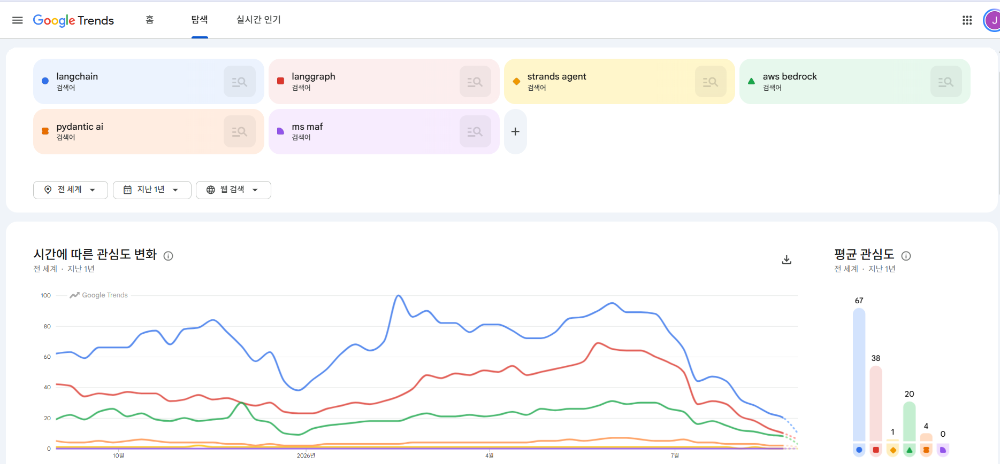

# AI 에이전트 플랫폼 비교: Bedrock AgentCore, Azure AI Foundry, Vertex AI Agent Engine

AWS, Azure, GCP가 각각 내놓은 오픈소스 에이전트 프레임워크와 관리형 실행 인프라를 같은 레이어끼리 표로 비교

<!-- more -->

## 이름 대응

세 클라우드 모두 오픈소스 프레임워크 하나와 관리형 런타임 하나를 쌍으로 내놓았고, 2026년 들어 제품명이 여러 번 바뀜. 이 글은 검색에 익숙한 이름을 제목에 쓰고 본문에서는 현재 공식 명칭을 씀

| 레이어 | AWS | Azure | GCP |
|---|---|---|---|
| 오픈소스 프레임워크 | Strands Agents | Microsoft Agent Framework(MAF) | Agent Development Kit(ADK) |
| 관리형 런타임 | Bedrock AgentCore Runtime | Microsoft Foundry Agent Service의 Hosted agents | Agent Runtime(구 Vertex AI Agent Engine) |
| 상위 플랫폼 이름 | Amazon Bedrock AgentCore | Microsoft Foundry(구 Azure AI Foundry) | Gemini Enterprise Agent Platform(구 Vertex AI, 2026년 4월 22일 개명) |
| 최종 사용자용 에이전트 제품 | Amazon Quick Suite(2025년 10월) | Copilot Studio, Microsoft 365 Copilot | Gemini Enterprise 앱(2025년 10월, Agentspace 흡수) |
| 개발자 IDE 에이전트 | Kiro(Q Developer는 2027년 4월 지원 종료) | GitHub Copilot | Antigravity, Gemini CLI |
| 이전 세대 에이전트 서비스 | Bedrock Agents Classic(2026년 7월 30일부터 신규 불가) | Foundry Agents(classic), 2027년 3월 31일 폐지 | Vertex AI Agent Builder 명칭 계열 |

프레임워크는 어느 클라우드에서든 돌아가고, 런타임은 자기 클라우드에 종속됨. 예를 들어 MAF 에이전트를 AgentCore Runtime에 올리거나 LangGraph 에이전트를 세 런타임 어디에나 올릴 수 있음. 그래서 비교는 프레임워크끼리, 런타임끼리 따로 해야 함

---

## 오픈소스 프레임워크 비교

| 항목 | Strands Agents | Microsoft Agent Framework | Google ADK |
|---|---|---|---|
| 라이선스 | Apache 2.0 | MIT | Apache 2.0 |
| 언어와 최신 버전 | Python 1.54.0, TypeScript 1.15.0(2026년 8월 27일 동시 릴리스). 저장소는 harness sdk 모노레포로 통합 | .NET 1.19.0, Python 1.16.0(2026년 8월 28일), Go는 2026년 7월 공개 프리뷰 | Python 2.8.0(1.x도 1.39.1로 유지), Go 2.2.0, Java 1.8.0, TypeScript 2.0.0, Kotlin 0.8.0 |
| 1.0 시점 | 2025년 7월 15일(공개는 2025년 5월) | 2026년 4월 3일 | Python 2025년 5월 20일, 2.0은 2026년 5월 19일 |
| 출신 | AWS 내부 에이전트 개발에 쓰던 SDK | Semantic Kernel과 AutoGen을 합친 후속작. 둘은 유지보수 모드 | Google이 자사 에이전트 제품에 쓰던 프레임워크 |
| 실행 모델 | 모델 주도 루프. 모델이 도구 선택과 종료 결정 | Agent(루프) + Workflow(그래프, 슈퍼스텝 체크포인트) 두 갈래 | 2.0부터 그래프 엔진. graph based, dynamic, collaborative 세 워크플로우 유형. Sequential, Parallel, Loop는 2.0에서 대체됨 |
| 멀티에이전트 | Agents as Tools, Handoffs, Swarm, Graph, Workflow | sequential, concurrent, handoff, group chat, Magentic One(1.0에서 모두 안정) | 코디네이터와 하위 에이전트 위임(transfer), 그래프 워크플로우 |
| 상태와 세션 | SessionManager File, S3, AgentCore Memory. 슬라이딩 윈도우와 요약 대화 관리자 | AgentSession, 컨텍스트 프로바이더(메모리), Workflow 체크포인트 저장소 InMemory, File, Cosmos | SessionService in memory, database, sqlite, Vertex AI. MemoryService Memory Bank, RAG |
| 크래시 후 재개 | 세션 복원. 내구 실행 엔진 없음 | Workflow 체크포인트 ID로 재개. Durable Task 확장을 붙이면 상태 변화마다 체크포인트, 대기 중 비용 0 | `ResumabilityConfig`(Python 1.16+)로 Invocation ID 기준 재개. 도구는 두 번 실행될 수 있음 |
| HITL | Interrupts(hook 또는 도구에서 발생) | 승인 흐름이 모든 오케스트레이션 패턴에 내장. 일시정지와 재개 | Tool Confirmation(Python 1.14+, 실험 단계). 불리언 또는 구조화 응답 |
| MCP | 1급. 공식 Strands MCP 서버 별도 제공 | 지원. hosted MCP 도구 | 양방향. 외부 MCP 소비와 ADK 도구를 MCP로 노출(FastMCP) |
| A2A | 서버와 클라이언트 양방향(Python, TypeScript). Swarm 안에서는 미지원 | 지원(1.0 시점 문서는 완전 지원을 곧 제공 예정으로 표기) | 서버와 클라이언트(Python, Go, Java). 실험 단계 표기 |
| 모델 제공자 | Bedrock 기본. Anthropic, Gemini, OpenAI, LiteLLM, Ollama, vLLM, SageMaker 등. 커뮤니티에 CLOVA Studio | Foundry, Azure OpenAI, OpenAI, Anthropic, Bedrock, Gemini, Ollama | Gemini, Claude, Model Garden 직접. LiteLlm, Apigee, Ollama, vLLM 커넥터. 모델 라우팅과 자동 페일오버 |
| 관측성 | OpenTelemetry 내장 | OpenTelemetry 네이티브 | OpenTelemetry GenAI 시맨틱 컨벤션, Cloud Trace |
| 평가 | 별도(AgentCore Evaluations) | Foundry 평가 대시보드 연동 | 내장 평가(궤적과 최종 응답, Python) |
| 특기 사항 | AgentCore Harness가 Strands 코드로 내보내기 지원 | 2026년 6월 Agent Harness GA, CodeAct(Hyperlight microVM에서 Python 실행) | 모델 컨텍스트 캐싱, 컨텍스트 압축, Skills 내장 |
| 배포 대상 | AgentCore, Lambda, Fargate, App Runner, EKS, EC2, Docker | Foundry Hosted agents, Container Apps, AKS, Functions, 아무 런타임 | Agent Runtime, Cloud Run, GKE, 아무 컨테이너 |

세 프레임워크 모두 다른 클라우드 모델과 런타임을 지원한다고 문서에 명시. 종속은 프레임워크가 아니라 아래 런타임 레이어에서 생김

---

## 관리형 런타임 비교

| 항목 | AgentCore Runtime | Foundry Hosted agents | Agent Runtime |
|---|---|---|---|
| GA | 2025년 10월 13일(9개 리전, 서울은 이후 추가) | 차세대 Foundry Agent Service GA 2026년 3월 16일, Hosted agents GA 2026년 7월 | 개편판 GA 2026년 4월 22일 |
| 격리 단위 | 세션당 전용 microVM. 종료 시 메모리 삭제 | 세션당 VM 격리 샌드박스. 영속 홈 디렉터리 | 컨테이너 기반. 세션 ID 호출자 지정 |
| 세션 수명 | 최대 8시간(유휴 15분 정지 후 재개는 새 컴퓨트). Runtime Instances는 14일 | 유휴 5~60분(기본 15분) 후 scale to zero, 상태 보존 재개. 30일 미사용 시 삭제. 벽시계 한도 문서 없음 | 장기 실행 작업 최대 7일. 서브초 콜드 스타트 |
| 프레임워크 무관 | 예. Strands, LangGraph, CrewAI, LlamaIndex, ADK, OpenAI Agents SDK, Claude Agent SDK, 커스텀 | 예. MAF, LangGraph, OpenAI Agents SDK, Anthropic Agent SDK, GitHub Copilot SDK, Semantic Kernel, 커스텀(Python, C#) | 예. ADK, LangChain, LangGraph, LlamaIndex, AG2, A2A 에이전트, 커스텀 컨테이너 |
| 선언형 대안 | AgentCore Harness(2026년 6월 GA, 설정형) | Prompt agents(지시문 + 모델 + 도구, 인프라 없음) | Agent Studio, Agent Designer |
| 프로토콜 | HTTP, MCP, A2A, AG UI 네 가지 네이티브 | Responses, Invocations(JSON, WebSocket), Activity(Teams), A2A(프리뷰) | Agent Registry가 A2A v1.0, 원격 MCP 서버 GA |
| 컴퓨트 요금 | vCPU 시간당 $0.0895 + GB 시간당 $0.00945, 초 단위, 유휴와 I/O 대기 무료 | Korea Central 기준 vCPU 시간당 $0.109 + GiB 시간당 $0.013(East US $0.099 + $0.012) | vCPU 시간당 $0.085 + GiB 시간당 $0.009, 턴 사이 유휴 무과금. 월 50 vCPU 시간과 100 GiB 시간 무료 |
| 서울 리전 | Runtime microVM 지원. Runtime Instances 미지원 | Korea Central 지원(Hosted agents 포함) | asia northeast3 지원 |
| 프라이빗 네트워크 | VPC 배치(2025년 10월), PrivateLink 컨트롤 플레인(2026년 3월), VPC egress(2026년 4월) | 30개 에이전트 리전 전부 프라이빗 VNet과 Class A 지원. Hosted agents는 BYO VNet, 공용 egress 없음 | Private Service Connect 인터페이스. Agent Gateway로 통제된 egress |
| 배포 단위 | 컨테이너 이미지 또는 코드 | 컨테이너 이미지 또는 zip(Foundry가 빌드). 불변 버전, 트래픽 분할 없음 | 컨테이너(BYOC) 또는 코드 |

세 런타임의 컴퓨트 단가는 vCPU 시간당 $0.085~$0.109로 좁은 범위. 차이는 단가보다 세션 수명(8시간 vs 7일), 무료 구간(GCP만 월 무료 할당), 서울에서 빠진 구성 요소에서 생김

---

## 구성 요소 대응표

AgentCore 구성 요소를 기준으로 Azure와 GCP의 대응 제품과 상태를 정리. GA와 프리뷰 표기는 2026년 8월 말 기준

| 역할 | AWS AgentCore | Azure Foundry | GCP Agent Platform |
|---|---|---|---|
| 런타임 | Runtime microVMs GA. Runtime Instances(EC2 기반, GPU 가능) 2026년 8월 GA | Hosted agents GA | Agent Runtime GA |
| 메모리 | Memory GA. 단기 이벤트와 장기 전략 | Memory 공개 프리뷰(단기 세션 + 장기 증류 메모리) | Memory Bank GA(2026년 6월 17일 글로벌 엔드포인트 GA), 메모리 프로필 GA |
| 도구 게이트웨이 | Gateway GA. REST, OpenAPI, Lambda를 MCP 도구로. 외부 MCP 서버와 A2A 에이전트를 passthrough 타깃으로 | Toolbox GA. 도구를 한 번 등록해 관리형 MCP 엔드포인트로. 도구 검색과 Skills 프리뷰 | Agent Gateway GA(2026년 6월 18일). 사용자, 에이전트, 도구 사이 정책 집행점. 별도로 Apigee, MCP Toolbox for Databases(베타) |
| 아이덴티티 | Identity GA. 워크로드 아이덴티티, 토큰 볼트, OBO 교환(2026년 4월) | Entra Agent ID GA. 배포 시 에이전트별 Entra 아이덴티티 자동 생성. Agent 365 레지스트리(2026년 5월 GA, 사용자당 $15) | Agent Identity GA(2026년 4월 22일). 자기 자신 또는 사용자 대신 인증 |
| 정책과 가드레일 | Policy GA(2026년 3월 3일). 자연어를 Cedar로 컴파일해 Gateway에서 도구 호출 차단. Guardrails 결합(2026년 6월), 시간 정책과 속도 제한(2026년 8월). Bedrock Guardrails는 모델과 독립된 ApplyGuardrail API | Foundry Guardrails(Content Safety, Prompt Shields). 에이전트 가드레일과 도구 호출 개입은 프리뷰 | Model Armor GA(Gateway 결합 2026년 6월). Semantic Governance Policies 공개 프리뷰. IAM 정책 비공개 프리뷰 |
| 평가 | Evaluations GA(2026년 3월 31일). 내장 평가자 13종, 온라인과 온디맨드. optimization, A/B 테스트 | Foundry evaluations GA(2026년 3월 16일). 지속 평가, agent optimizer 프리뷰 | Gen AI evals. 오프라인 평가, 온라인 모니터, 시뮬레이션, 실패 군집화 |
| 관측성 | Observability GA. CloudWatch 기반 | Application Insights 자동 주입, OpenTelemetry, 에이전트 대시보드 GA | Agent Observability GA(2026년 6월 18일). 새 ADK 에이전트는 OTel 기본 활성 |
| 레지스트리 | AWS Agent Registry(서울 미지원) | Agent 365 + Entra Agent ID | Agent Registry GA(2026년 6월 18일). 에이전트, 도구, MCP 서버 카탈로그 |
| 내장 도구 | Browser, Code Interpreter GA(Runtime과 같은 요금). Web Search Tool(서울 미지원) | Code Interpreter GA, Browser Automation Tool 프리뷰, Web Search, Bing grounding, Computer Use(Korea Central 미지원) | Code Execution(us central1만), Computer Use(2026년 5월), Google Search grounding |
| 결제 | payments 프리뷰(x402, MPP). 서울 미지원 | 해당 없음 | AP2 프로토콜 주도(플랫폼 기능은 별도) |

---

## 서울 리전 요약

| 구성 요소 | AWS 서울 | Azure Korea Central | GCP asia northeast3 |
|---|---|---|---|
| 런타임 | 지원(microVM). Instances 미지원 | 지원 | 지원 |
| 메모리 | 지원 | 지원(미터 존재) | 지원 |
| 도구 게이트웨이 | 지원 | 지원 | 미지원 |
| 아이덴티티 | 지원 | 테넌트 범위(리전 무관) | 문서에 리전 표 없음 |
| 정책 | 지원 | 리전 제한 문서 없음 | Model Armor 지원 목록에 포함 |
| 평가 | 지원 | 리전 제한 문서 없음 | 문서에 리전 표 없음 |
| 관측성 | 지원 | 지원 | 문서에 리전 표 없음 |
| 코드 실행 도구 | 지원 | 지원 | us central1만 |
| 브라우저 도구 | 지원 | 지원(프리뷰). Computer Use 미지원 | 문서 없음 |
| 미지원 목록 | Runtime Instances, payments, Agent Registry, Web Search Tool | Computer Use | Agent Gateway, Code Execution |

세 클라우드 모두 핵심 런타임과 메모리는 서울에 있고, 2026년에 추가된 신규 기능부터 빠져 있음. 서울에서 게이트웨이 정책 집행이 필요하면 현재는 AWS와 Azure가 가능

---

## 모델 카탈로그, 서울 관점

| 항목 | AWS Bedrock | Microsoft Foundry | GCP Model Garden |
|---|---|---|---|
| 자사 모델 | Amazon Nova 2 계열 | 없음(Azure OpenAI 경유 GPT 5.x 계열) | Gemini 3.x 계열, Gemini Embedding 2 |
| Claude | Opus 5, Sonnet 5, Fable 5, Sonnet 4.6 | 2026년 7월 GA. Opus 5, Opus 4.8, Sonnet 5, Haiku 4.5 | Sonnet 5, Opus 5, Fable 5, Opus 4.8 등 |
| 오픈 모델 | Llama, Mistral, DeepSeek, gpt oss(서울 여부 미확인) | Llama 3.3과 4, Mistral, DeepSeek V3.x와 R1, Grok 4, gpt oss | Llama 4, Mistral Medium 3, Grok 4.2, gpt oss, Qwen3, GLM, DeepSeek |
| 서울에서의 접근 방식 | 리전 내 온디맨드 목록에 현행 모델 없음. Nova는 APAC 지오 교차 리전 추론, Claude는 글로벌 교차 리전 추론 프로필로 접근 | GPT 5.x는 글로벌 배포 미터가 Korea Central에 존재. Claude는 프로젝트가 East US 2 또는 Sweden Central이어야 하므로 Korea Central 불가 | 서울은 서빙 리전 목록에 있으나 모델별 표가 스크립트 렌더링이라 정적 확인 불가. 글로벌 또는 us 엔드포인트 사용이 일반적 |

세 곳 모두 서울에서 프론티어 모델을 쓰려면 교차 리전 또는 글로벌 엔드포인트를 전제로 데이터 상주 요건을 검토해야 함. 리전 내 추론이 필수인 워크로드는 모델 선택지가 크게 줄어듦

---

## 프로토콜

| 프로토콜 | 역할 | 현황 | 3사 지원 |
|---|---|---|---|
| MCP | 에이전트와 도구, 데이터 연결 | 사실상 표준 | AWS Gateway가 MCP 허브, awslabs mcp 저장소에 서버 62개. Azure Toolbox가 관리형 MCP 엔드포인트. GCP 원격 MCP 서버 GA와 MCP Toolbox for Databases |
| A2A | 에이전트와 에이전트 연결 | Google이 2025년 4월 9일 공개, 2025년 6월 23일 Linux Foundation 기부(창립 AWS, Cisco, Google, Microsoft, Salesforce, SAP, ServiceNow). v1.0은 2026년 3월 12일, 서명된 Agent Card 도입. 150개 이상 조직 참여 | AWS AgentCore Runtime 네이티브(포트 9000, Agent Card). Azure Foundry와 Copilot Studio 통합(Hosted agents는 프리뷰). GCP Agent Registry가 v1.0 지원 |
| AG UI | 에이전트와 프론트엔드 연결 | CopilotKit 주도 | AWS AgentCore Runtime 네이티브(2026년 3월). Azure, GCP는 프레임워크 레벨 |
| AP2 | 에이전트 결제 | Google 주도, 60개 이상 결제 기관 | AWS는 AgentCore payments가 x402와 MPP 지원 |

MCP와 A2A는 경쟁이 아니라 보완 관계. 3사 모두 두 프로토콜을 런타임이나 게이트웨이 레벨에서 받아들였으므로 프로토콜은 이제 선택 기준이 아님

---

## 검색 관심도

Google Trends 전 세계 지난 1년 웹 검색 기준 평균 관심도. langchain 67, langgraph 38, aws bedrock 20, pydantic ai 4, strands agent 1, ms maf 0

- 프레임워크 검색은 여전히 LangChain과 LangGraph에 집중. 클라우드 벤더 프레임워크는 아직 초기
- 읽을 때 주의할 점 세 가지. "ms maf"는 실제 검색어로 쓰이지 않는 약어라 0에 가깝게 나옴. "aws bedrock"은 프레임워크가 아니라 서비스명이라 다른 항목과 성격이 다름. Google ADK는 비교에 넣지 않았음
- 같은 그래프에 "ai agent"를 넣으면 평균 53으로 나머지를 모두 압도함. 제품명보다 개념어 검색이 훨씬 큰 단계

---

## 선택 기준

| 상황 | 추천 | 이유 |
|---|---|---|
| 이미 AWS 위에 있고 서울에서 게이트웨이 정책까지 필요 | Strands 또는 원하는 프레임워크 + AgentCore | 서울에 Runtime, Memory, Gateway, Policy, Evaluations 모두 있음. 네 가지 프로토콜 네이티브 |
| Microsoft 365, Teams, Entra 중심 조직 | MAF + Foundry Hosted agents | Entra Agent ID 자동 발급, Teams와 Copilot 채널 게시, Agent 365 레지스트리 |
| 내구 실행이 프레임워크 안에서 필요 | MAF + Durable Task Scheduler | 상태 변화마다 체크포인트, 대기 비용 0. 세 프레임워크 중 유일하게 1st party 내구 실행 엔진 |
| Gemini 중심, 무료 구간으로 시작 | ADK + Agent Runtime | 월 50 vCPU 시간 무료, 7일 장기 실행, 서브초 콜드 스타트. 단 서울에서 Gateway와 Code Execution 없음 |
| 멀티 클라우드 또는 종속 회피 | LangGraph나 Pydantic AI + 각 런타임 | 세 런타임 모두 프레임워크 무관. 런타임만 바꾸면 이식 가능 |
| 리전 내 모델 추론이 규제상 필수 | 3사 모두 재검토 | 서울에서 프론티어 모델은 교차 리전 또는 글로벌 엔드포인트가 전제 |
| 코드 없이 시작 | AgentCore Harness, Foundry Prompt agents, Agent Designer | 세 곳 모두 선언형 경로 제공. 커스텀 오케스트레이션이 필요해지면 코드 배포로 전환 |

---

## 결론

- 3사 구도는 같음. 오픈소스 프레임워크(Strands, MAF, ADK) + 프레임워크 무관 관리형 런타임(AgentCore, Foundry Hosted agents, Agent Runtime). 종속은 런타임 레이어에서만 생김
- 프레임워크 차이는 실행 모델. Strands는 모델 주도 루프, MAF는 루프와 그래프 두 갈래에 1st party 내구 실행, ADK는 2.0부터 그래프 엔진
- 런타임 컴퓨트 단가는 vCPU 시간당 $0.085~$0.109로 비슷. 세션 수명(8시간, 유휴 기반, 7일), 무료 구간, 서울 지원 범위가 실질적 차이
- 서울은 3사 모두 런타임과 메모리는 있고 2026년 신규 기능이 빠짐. AWS는 Instances, payments, Registry, Web Search. Azure는 Computer Use. GCP는 Gateway, Code Execution
- 프론티어 모델은 3사 모두 서울에서 교차 리전 또는 글로벌 엔드포인트 전제. 데이터 상주 요건이 있으면 모델 선택이 먼저
- MCP와 A2A는 3사 공통. 프로토콜은 더 이상 선택 기준이 아니고, 검색 관심은 여전히 LangChain과 LangGraph에 있음

## 출처

- AWS: [AgentCore 리전](https://docs.aws.amazon.com/bedrock-agentcore/latest/devguide/agentcore-regions.html), [릴리스 노트](https://docs.aws.amazon.com/bedrock-agentcore/latest/devguide/release-notes.html), [Runtime 세션](https://docs.aws.amazon.com/bedrock-agentcore/latest/devguide/runtime-sessions.html), [Runtime 서비스 계약](https://docs.aws.amazon.com/bedrock-agentcore/latest/devguide/runtime-service-contract.html), [요금](https://aws.amazon.com/bedrock/agentcore/pricing/), [GA 공지](https://aws.amazon.com/about-aws/whats-new/2025/10/amazon-bedrock-agentcore-available/), [Policy GA](https://aws.amazon.com/about-aws/whats-new/2026/03/policy-amazon-bedrock-agentcore-generally-available/), [Evaluations GA](https://aws.amazon.com/about-aws/whats-new/2026/03/agentcore-evaluations-generally-available/), [Harness GA](https://aws.amazon.com/about-aws/whats-new/2026/06/amazon-bedrock-agentcore-harness-generally-available/), [Bedrock 모델 리전 호환](https://docs.aws.amazon.com/bedrock/latest/userguide/models-region-compatibility.html), [Strands 저장소](https://github.com/strands-agents/harness-sdk), [Strands 배포 가이드](https://strandsagents.com/docs/user-guide/deploy/operating-agents-in-production/), [Strands A2A](https://strandsagents.com/docs/user-guide/concepts/multi-agent/agent-to-agent/), [Quick Suite 공지](https://aws.amazon.com/about-aws/whats-new/2025/10/amazon-quick-suite-agentic-ai-powered-workspace/), [Q Developer 지원 종료](https://aws.amazon.com/blogs/devops/amazon-q-developer-end-of-support-announcement/), [awslabs mcp](https://github.com/awslabs/mcp)
- Azure: [MAF 1.0 발표](https://devblogs.microsoft.com/agent-framework/microsoft-agent-framework-version-1-0/), [MAF 개요](https://learn.microsoft.com/en-us/agent-framework/overview/agent-framework-overview), [MAF Build 2026](https://devblogs.microsoft.com/agent-framework/microsoft-agent-framework-at-build-2026-announce/), [Durable agents](https://learn.microsoft.com/en-us/azure/durable-task/sdks/durable-agents-microsoft-agent-framework), [Foundry Agent Service GA](https://devblogs.microsoft.com/foundry/foundry-agent-service-ga/), [Agent Service 개요](https://learn.microsoft.com/en-us/azure/ai-foundry/agents/overview), [Hosted agents](https://learn.microsoft.com/en-us/azure/ai-foundry/agents/concepts/hosted-agents), [한도와 리전](https://learn.microsoft.com/en-us/azure/foundry/agents/concepts/limits-quotas-regions), [Toolbox](https://learn.microsoft.com/en-us/azure/foundry/agents/concepts/toolbox-overview), [Guardrails](https://learn.microsoft.com/en-us/azure/foundry/guardrails/guardrails-overview), [Claude in Foundry](https://learn.microsoft.com/en-us/azure/foundry/foundry-models/concepts/claude-models), [Durable Task Scheduler 과금](https://learn.microsoft.com/en-us/azure/durable-task/scheduler/durable-task-scheduler-billing), [Agent 요금](https://azure.microsoft.com/en-us/pricing/details/foundry-agent-service/), [Copilot Studio vs Foundry](https://techcommunity.microsoft.com/blog/microsoft-security-blog/microsoft-copilot-studio-vs-microsoft-foundry-building-ai-agents-and-apps/4483160)
- GCP: [Vertex AI 명칭 변경](https://docs.cloud.google.com/gemini-enterprise-agent-platform/vertex-ai-name-changes), [Agent Platform 릴리스 노트](https://docs.cloud.google.com/gemini-enterprise-agent-platform/release-notes), [에이전트 리전](https://docs.cloud.google.com/gemini-enterprise-agent-platform/resources/agent-locations), [요금](https://cloud.google.com/vertex-ai/pricing), [Agent Platform 소개](https://cloud.google.com/blog/products/ai-machine-learning/introducing-gemini-enterprise-agent-platform), [ADK 2.0](https://adk.dev/2.0/), [ADK 릴리스 노트](https://adk.dev/release-notes/), [ADK 재개](https://adk.dev/runtime/resume/), [ADK Tool Confirmation](https://adk.dev/tools-custom/confirmation/), [ADK A2A](https://adk.dev/a2a/), [ADK 배포](https://adk.dev/deploy/), [Model Armor 리전](https://docs.cloud.google.com/model-armor/locations), [모델 리전](https://docs.cloud.google.com/vertex-ai/generative-ai/docs/learn/locations), [Gemini Enterprise](https://cloud.google.com/gemini-enterprise)
- 프로토콜: [A2A Linux Foundation 기부](https://developers.googleblog.com/en/google-cloud-donates-a2a-to-linux-foundation/), [A2A 150개 조직](https://www.linuxfoundation.org/press/a2a-protocol-surpasses-150-organizations-lands-in-major-cloud-platforms-and-sees-enterprise-production-use-in-first-year), [A2A 릴리스](https://github.com/a2aproject/A2A/releases), [AG UI](https://github.com/ag-ui-protocol/ag-ui)
