# 금융망에서 AI 사용하기(LiteLLM Guardrail+Bedrock Guardrail)

개발자(AI 실사용자)와 감사 관점에서 알아보기

<!-- more -->

## 이 글에서 하는 것

[1편](finance_llm_gateway_sso.md)에서 운영자로서 Amazon Bedrock 앞에 LiteLLM 게이트웨이를 올리고, 모델 8개와 사용자 2명을 등록하고, Keycloak SSO 로그인만으로 4시간 만료 Virtual Key를 받는 Key Vending Broker까지 만들었다. 이 글은 그 세션을 그대로 이어받는다. 앞부분에서는 개발자 developer001 역할로 Claude Code, OpenCode, Codex를 게이트웨이에 붙이고, 뒷부분에서는 운영자와 감사 역할로 돌아가 로그에 무엇이 남는지, 주민등록번호가 모델에 닿기 전에 가려지는지, 유해 프롬프트가 어디서 막히는지 확인한다.

개발자가 실제로 쓰는 것은 curl이 아니라 AI 코딩 툴이다. 툴이 게이트웨이를 거치지 않으면 1편에서 만든 예산, 프롬프트 로깅, 모델 목록은 하나도 적용되지 않는다. 그래서 툴 연결이 통제의 마지막 조각이고, 툴이 게이트웨이를 지나지 않는 경로를 막는 것은 그다음 문제다.

| 절 | 역할 | 확인하는 것 |
|---|---|---|
| 키 헬퍼 규약, Claude Code, OpenCode, Codex | 개발자 | 헬퍼 하나로 툴 3종을 연결하고 툴을 쓰는 동안 키를 다루지 않는 개발자 경험 |
| 우회는 어디서 막히나 | 계정 관리자 | 게이트웨이를 지나지 않는 요청을 막는 세 층 |
| 지출과 프롬프트 로그 감사 | 감사 | 누가, 어떤 툴로, 무엇을 물었고, 얼마를 썼는가 |
| 예산 발동과 키 폐기 | 운영자 | 상한이 실제로 발동하고 발급한 키를 즉시 끊을 수 있는가. 이번 실습에서는 절차만 정리 |
| PII 마스킹과 Guardrails | 운영자와 감사 | 입력 통제 두 층의 분업과 실행 순서 |
| OTel과 CloudWatch, 프로덕션 로드맵 | 운영자 | 사내에 옮길 때 바꿀 것과 안 바꿀 것 |

## 키 헬퍼 규약과 툴 3종 비교

세 툴은 API 포맷이 서로 다르지만 그 차이는 게이트웨이가 처리한다. 툴마다 다른 것은 키를 가져오는 방식이다. 규약은 한 줄이다. 키가 필요하면 이 명령을 실행하고 stdout에 출력된 키 한 줄을 쓴다. 조직은 그 명령인 `get-gateway-key.sh`를 표준으로 배포하고, 각 툴은 키가 필요할 때마다 그 명령을 실행한다. 명령 안에서 일어나는 일은 툴이 알 필요가 없다.

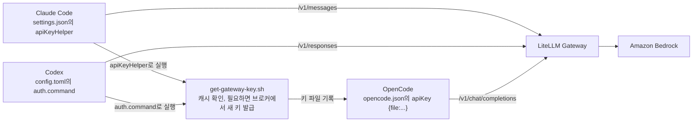
```mermaid
flowchart LR
    H["get-gateway-key.sh<br>캐시 확인, 필요하면 브로커에서 새 키 발급"]
    CC["Claude Code<br>settings.json의 apiKeyHelper"]
    CX["Codex<br>config.toml의 auth.command"]
    OC["OpenCode<br>opencode.json의 apiKey {file:...}"]
    GW["LiteLLM Gateway"]
    BR["Amazon Bedrock"]
    CC -->|"apiKeyHelper로 실행"| H
    CX -->|"auth.command로 실행"| H
    H -->|"키 파일 기록"| OC
    CC -->|"/v1/messages"| GW
    CX -->|"/v1/responses"| GW
    OC -->|"/v1/chat/completions"| GW
    GW --> BR
```

| 툴 | 설정 파일 | 헬퍼를 지정하는 위치 | 키 만료 처리 | 엔드포인트 | API 포맷 |
|---|---|---|---|---|---|
| Claude Code | ~/.claude/settings.json | 최상위 apiKeyHelper | 기본 5분 캐시, 401 수신 시 자동 재호출 | /v1/messages | Anthropic Messages |
| OpenCode | ~/.config/opencode/opencode.json | options.apiKey에 {file:...} | 자동 갱신 없음. 세션 시작 전 헬퍼 1회 실행 | /v1/chat/completions | OpenAI Chat Completions |
| Codex | ~/.codex/config.toml | [model_providers.litellm.auth]의 command | refresh_interval_ms 기본 5분, 401 시 재시도 | /v1/responses | OpenAI Responses |

세 설정 파일은 code-server에 이미 배치되어 게이트웨이 URL까지 채워져 있었다. 각 절에서 새로 만들지 않고 파일을 열어 확인한 뒤 헬퍼를 지정하는 한 줄만 고친다. 기업에서 이 작업을 맡는 팀이 실제로 하는 일이 표준 설정 파일을 만들어 배포하는 것이기 때문이다.

`~/bin`에는 툴과 이름이 같은 `claude`, `codex`, `opencode` 래퍼가 있고 `~/bin`이 PATH 최상위라 툴 이름을 실행하면 래퍼가 먼저 실행된다. 래퍼가 하는 일은 하나다. 유효한 SSO 세션이 없으면 브라우저 로그인을 먼저 실행하고, 있으면 곧바로 실제 CLI를 실행한다.

| 툴 | 래퍼 필요 여부 | 이유 |
|---|---|---|
| Claude Code, Codex | 필요 없음 | 헬퍼 실행 기능을 내장해 키 공급과 만료 갱신을 스스로 한다. 래퍼가 더해 주는 것은 세션이 없을 때 로그인을 자동으로 시작하는 편의뿐 |
| OpenCode | 필요 | 명령 실행형 헬퍼가 없어 툴이 키 파일 갱신을 스스로 못 한다. 세션 시작 전에 래퍼, 주기 실행 작업, 사람 중 누군가가 헬퍼를 한 번 실행해야 한다 |

헬퍼는 비대화형이어야 한다. 워크샵 문서 기준으로 Claude Code는 10초, Codex는 5초 안에 헬퍼가 돌아오지 않으면 실패로 처리하므로 브라우저 로그인을 헬퍼 안에서 처리할 수 없다. 대화형 로그인만 래퍼로 분리한 것이 이 설계의 핵심이다. 사내 배포에서 개발자 PC에 내려가는 것은 표준 설정 파일, 헬퍼, 선택적 래퍼뿐이고 키는 없다.

## Claude Code 연결

Claude Code는 설정 없이 실행하면 자체 기본 모델을 고르고 그 기본값은 최상위 모델이다. 기본값이 게이트웨이에 없거나 이름이 다르면 호출이 실패한다. 사전 배치된 설정 파일부터 읽었다.

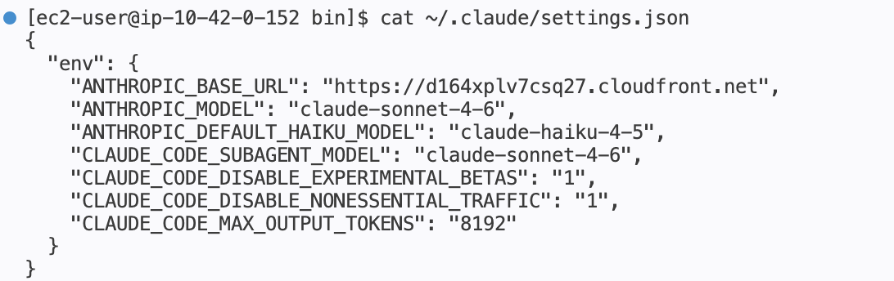

| 항목 | 역할 | 없으면 |
|---|---|---|
| ANTHROPIC_BASE_URL | 모든 호출을 게이트웨이로 전송 | 통제 밖의 경로로 직접 호출 |
| ANTHROPIC_MODEL | 주 모델을 게이트웨이 등록명 claude-sonnet-4-6으로 고정 | 기본값이 Opus 계열이라 과금이 늘고, 등록되지 않은 이름이면 오류 |
| ANTHROPIC_DEFAULT_HAIKU_MODEL | 세션 제목 생성, 툴 요약 같은 백그라운드 경량 호출의 모델 고정 | 백그라운드 호출이 주 모델로 폴백되어 상위 모델 단가로 과금 |
| CLAUDE_CODE_SUBAGENT_MODEL | 서브에이전트 모델 고정 | 서브에이전트가 상위 모델 사용 |
| CLAUDE_CODE_DISABLE_EXPERIMENTAL_BETAS | 베타 헤더 비활성 | 게이트웨이가 모르는 베타 파라미터로 400 |
| CLAUDE_CODE_DISABLE_NONESSENTIAL_TRAFFIC | 비필수 텔레메트리 차단 | 불필요한 외부 트래픽 |
| CLAUDE_CODE_MAX_OUTPUT_TOKENS | 출력 토큰 상한 8192 | max_tokens는 TPM에서 선차감되므로 상한을 풀면 TPM이 조기 소진 |

이 파일에 키가 하나도 없다는 점이 요점이다. base URL, 모델 고정, 상한은 조직이 표준으로 배포하는 값이고 키는 개발자가 SSO로 직접 받는다. 그 발급을 자동화하는 것이 apiKeyHelper다. Claude Code는 settings.json 최상위의 apiKeyHelper에 적힌 셸 명령을 실행하고 그 stdout을 그대로 API 키로 쓴다. env 블록 안이 아니라 env와 같은 레벨에 한 줄을 추가한다.

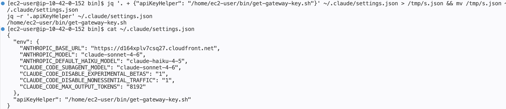

```bash
jq '. + {"apiKeyHelper": "/home/ec2-user/bin/get-gateway-key.sh"}' ~/.claude/settings.json > /tmp/s.json && mv /tmp/s.json ~/.claude/settings.json
```

셸에 ANTHROPIC_AUTH_TOKEN이나 ANTHROPIC_API_KEY가 남아 있으면 그 값이 우선 적용되고 apiKeyHelper는 호출되지 않는다. 증상은 헬퍼를 직접 실행하면 키가 나오는데 Claude Code만 401이 나고 만료 후 자동 갱신도 안 되는 형태다. 앞 모듈에서 검증용으로 export한 변수가 그 터미널에 남아 있는 경우가 가장 흔하고, 온보딩 문서에 unset 한 줄을 넣지 않으면 이 문의가 반복해서 들어온다. settings.json의 env 블록 값은 Claude Code가 자기 프로세스에만 주입하므로 셸에서 `env | grep ANTHROPIC`이 아무것도 출력하지 않는 것이 정상이다.

1편에서는 로그인과 키 발급을 한 단계씩 직접 실행했다. 실제 개발자 경험은 툴을 실행하는 것으로 끝난다. 일부러 로그아웃 상태를 만들고 툴 이름 그대로 실행했다.

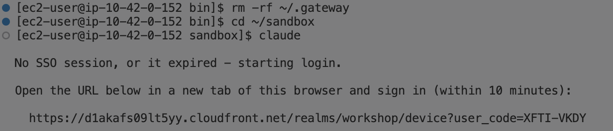

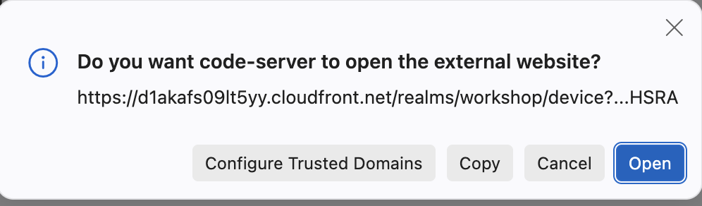

`rm -rf ~/.gateway` 뒤 `claude`를 치면 터미널에 로그인 시작 메시지가 나오고 브라우저에 Keycloak 로그인 페이지가 새 탭으로 열린다. code-server가 외부 사이트를 열지 묻는 대화상자를 한 번 띄운다. 대화상자에 표시된 주소는 1편 첫 로그인 때의 코드로 끝나 있어 터미널의 새 코드와 다르다. 브라우저에서 로그인과 동의를 마치면 터미널이 이어서 진행되어 새 임시 키가 발급되고 Claude Code가 그대로 시작된다. 참가자가 키를 보거나 붙여 넣는 순간은 한 번도 없다.

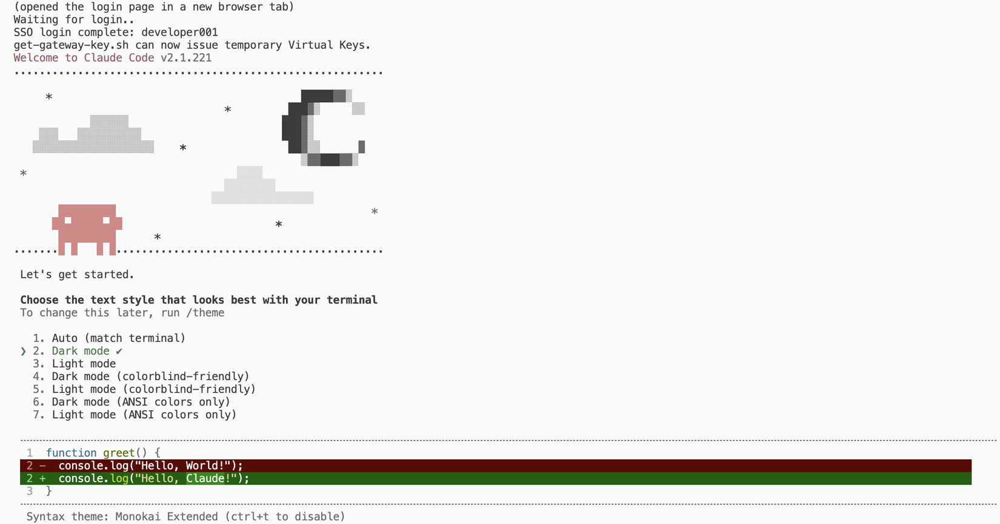

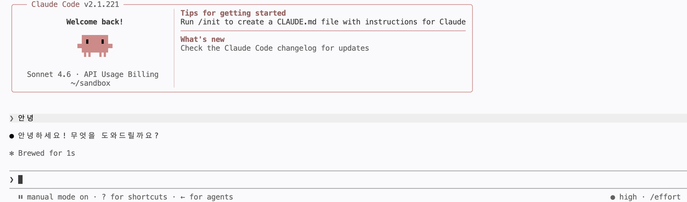

시작 화면의 Sonnet 4.6 표기는 고정한 모델이 적용되었다는 뜻이고, API Usage Billing은 키 기반 인증을 가리킨다. 등록명 자체는 뒤의 /status에서 확인한다. 방금 실행한 `claude`가 Claude Code 본체가 아니라는 것도 확인했다.

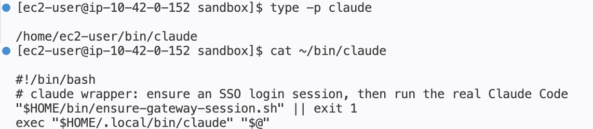

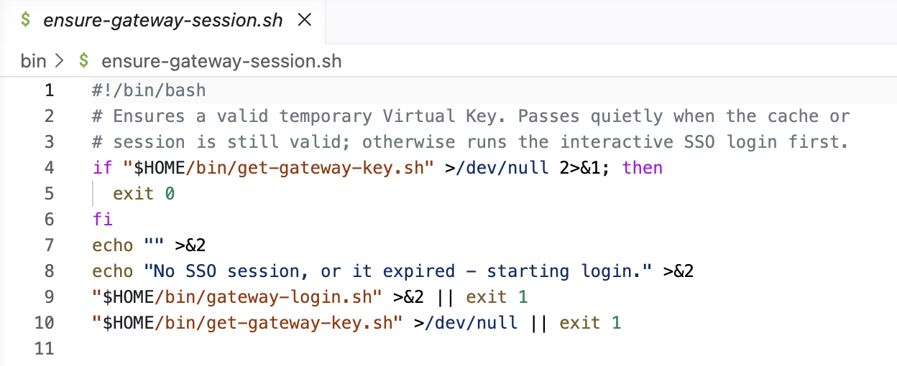

| 래퍼 행 | 하는 일 |
|---|---|
| `"$HOME/bin/ensure-gateway-session.sh" \|\| exit 1` | get-gateway-key.sh를 조용히 실행해 성공하면 통과, 실패하면 gateway-login.sh 브라우저 로그인을 먼저 진행. 그래도 실패하면 툴을 시작하지 않는다 |
| `exec "$HOME/.local/bin/claude" "$@"` | 받은 인자 그대로 실제 Claude Code를 실행. exec로 프로세스가 교체되므로 래퍼는 남지 않고 세션이 유효할 때의 오버헤드는 0.2초 미만 |

래퍼의 역할은 시작 시점의 로그인 보장뿐이다. 이후 호출마다 키를 공급하는 것은 apiKeyHelper다. `~/bin/codex`와 `~/bin/opencode`도 마지막 줄의 실행 대상만 다를 뿐 같은 모양의 2줄 래퍼다.

트래픽이 실제로 게이트웨이로 가는지는 Claude Code 스스로 보고한다.

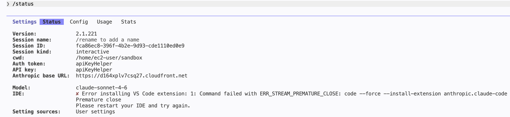

| /status 항목 | 값 | 잘못됐을 때 |
|---|---|---|
| Auth token, API key | apiKeyHelper | 환경 변수 기반이면 unset이 빠진 상태 |
| Anthropic base URL | https://d164xplv7csq27.cloudfront.net | api.anthropic.com이면 설정 파일이 로드되지 않은 상태 |
| Model | claude-sonnet-4-6 | Opus 계열이면 모델 환경 변수가 적용되지 않은 상태 |

IDE 항목에 VS Code 확장 설치 오류가 떠 있는데 code-server 환경의 문제라 게이트웨이와는 무관하다.

운영자 화면에서는 이 세션의 흔적이 바로 보인다.

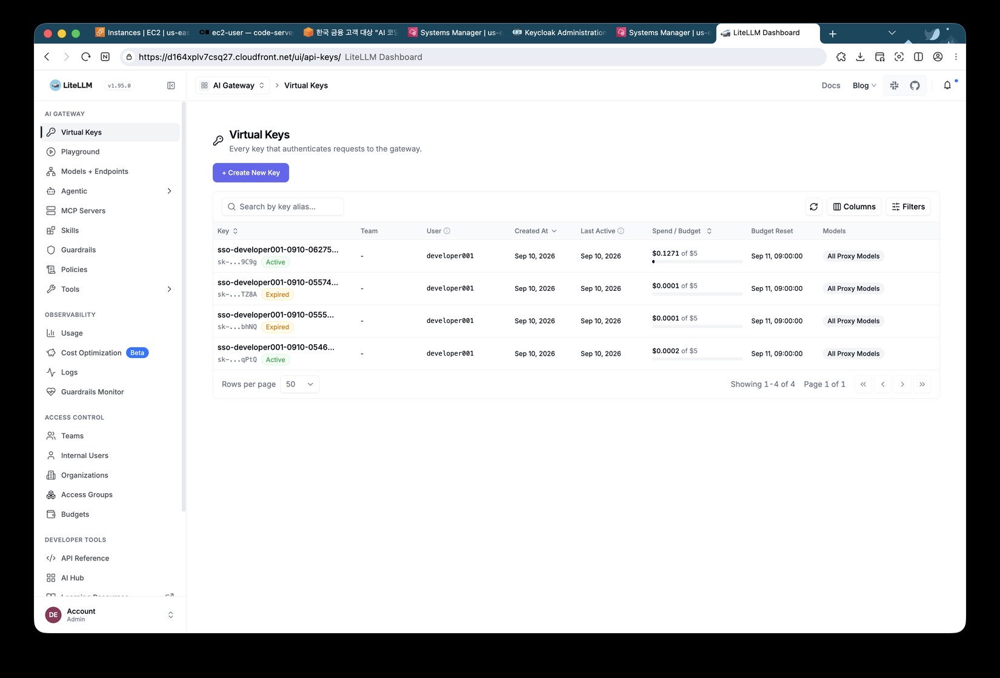

| 키 alias | 상태 | 지출 | 출처 |
|---|---|---|---|
| sso-developer001-0910-0627... | Active | 0.1271달러 | 방금 래퍼 로그인으로 발급된 키. Claude Code 세션이 사용 |
| sso-developer001-0910-0557... | Expired | 0.0001달러 | 1편의 1분 만료 실험 |
| sso-developer001-0910-0555... | Expired | 0.0001달러 | 1편의 1분 만료 실험 |
| sso-developer001-0910-0546... | Active | 0.0002달러 | 1편에서 처음 받은 4시간 키 |

만료된 키가 목록에 남아 있는 것이 정상이고, "안녕" 한마디에 0.127달러가 든 것은 뒤의 로그 절에서 다룬다.

브로커가 발급한 키의 수명은 4시간이고 만료 시점에 개발자가 할 일은 없다. 만료된 키로 첫 호출이 나가면 게이트웨이가 401 expired_key를 돌려주고, Claude Code는 apiKeyHelper를 재실행해 새 키로 같은 요청을 재시도한다. 헬퍼 결과는 기본 5분 캐시되지만, 401을 받으면 Claude Code가 캐시를 무시하고 헬퍼를 즉시 다시 실행한다.

## OpenCode 연결

OpenCode는 모델 정보를 models.dev 공개 레지스트리에서 가져온다. 게이트웨이 별칭 claude-haiku-4-5와 qwen3-coder는 조직 내부 이름이라 그 레지스트리에 없으므로 opencode.json에서 기능, 한도, 비용을 직접 선언해야 한다. 자격증명을 넣는 방식도 툴 사정에 맞춰야 한다. OpenCode에는 명령 실행형 credential helper가 없다. apiKey에 쓸 수 있는 치환은 환경 변수와 파일 읽기 두 가지인데, 이 가운데 파일 읽기로 헬퍼가 기록한 키 파일을 참조한다.

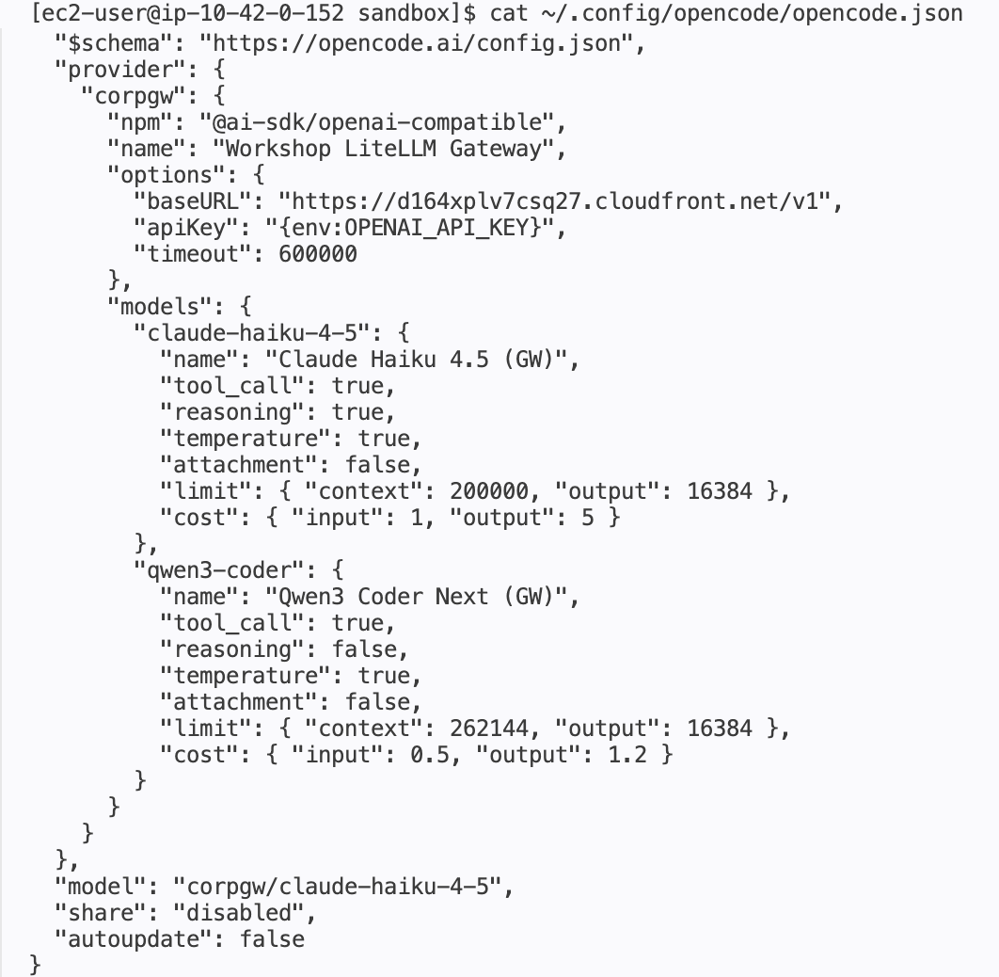

| 항목 | 값 | 역할 |
|---|---|---|
| provider.corpgw | 임의의 프로바이더 ID | 조직 게이트웨이를 커스텀 프로바이더로 등록 |
| npm | @ai-sdk/openai-compatible | OpenAI 호환 방식으로 /v1/chat/completions 호출 |
| options.baseURL | 게이트웨이 URL + /v1 | 모든 호출을 게이트웨이로 전송 |
| options.apiKey | {env:OPENAI_API_KEY} | 존재하지 않는 환경 변수. 아래에서 파일 참조로 바꾼다 |
| options.timeout | 600000 | 10분. 긴 툴 호출 반복에 대비 |
| models.claude-haiku-4-5 | tool_call true, context 200000, output 16384, cost 1과 5 | 레지스트리에 없는 모델의 기능, 한도, 비용 선언. 비용 단위는 100만 토큰당 USD |
| models.qwen3-coder | tool_call true, context 262144, cost 0.5와 1.2 | 비교 모델 |
| model | corpgw/claude-haiku-4-5 | 시작 시 기본 모델 |
| share | disabled | 세션 외부 공유 비활성. 기업 환경에서는 반드시 끈다 |
| autoupdate | false | 버전 고정 |

| 선언 | 없거나 false면 |
|---|---|
| tool_call true | 파일을 읽거나 쓰지 못한다. 대화만 되고 코딩 툴로 쓸 수 없다 |
| limit.context, limit.output | 컨텍스트 관리를 못 해 요청이 한도를 넘겨 실패한다 |
| cost.input, cost.output | 세션 중 비용 추정이 표시되지 않는다 |

tool_call은 이 워크샵에서 가장 조심해야 할 필드다. OpenCode는 능력을 모르는 모델에는 툴 호출을 시도하지 않는다. 증상이 오류가 아니라 코드를 설명만 하고 파일은 고치지 않는 형태로 나타나므로, 사내 배포에서는 이 필드 하나가 도입 실패의 원인이 되기 쉽다.

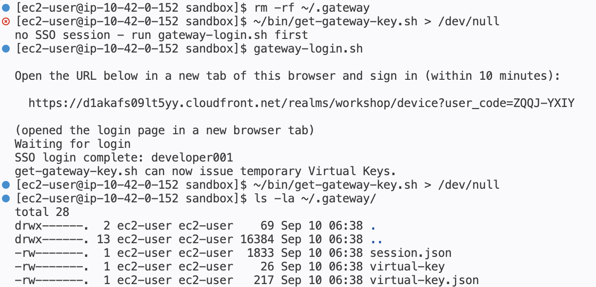

실제 사용에서는 `opencode` 래퍼가 시작 시점에 헬퍼를 실행해 키 파일을 갱신하지만, 래퍼가 대신 하는 일을 확인하려고 한 단계씩 직접 실행했다. 세션을 지우고 헬퍼를 부르면 `no SSO session - run gateway-login.sh first`가 나오고, `gateway-login.sh`로 다시 로그인하면 `~/.gateway/`에 session.json, virtual-key, virtual-key.json 세 파일이 생긴다. OpenCode가 읽는 것은 평문 키 파일인 virtual-key다.

```bash
jq '.provider.corpgw.options.apiKey = "{file:/home/ec2-user/.gateway/virtual-key}"' ~/.config/opencode/opencode.json > /tmp/o.json && mv /tmp/o.json ~/.config/opencode/opencode.json
```

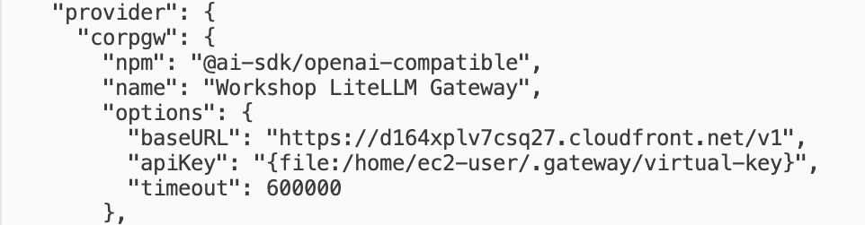

경로는 셸을 거치지 않고 OpenCode가 직접 읽으므로 절대 경로로 쓴다. 바꾸기 전 값인 `{env:OPENAI_API_KEY}`는 이 워크샵에서 가장 진단하기 어려운 설정이다. 환경 변수가 없어도 OpenCode는 오류도 경고도 내지 않는다. 치환 결과가 빈 문자열이 되어 빈 키로 게이트웨이를 호출하고 401만 남는다. 설정 파일은 문법상 문제가 없고 curl로는 게이트웨이가 정상 응답하는데 OpenCode만 인증에 실패하니 원인을 찾기 어렵다. 키 파일 참조가 더 안전한 표준이다.

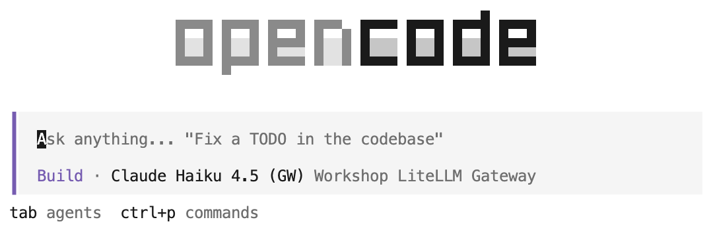

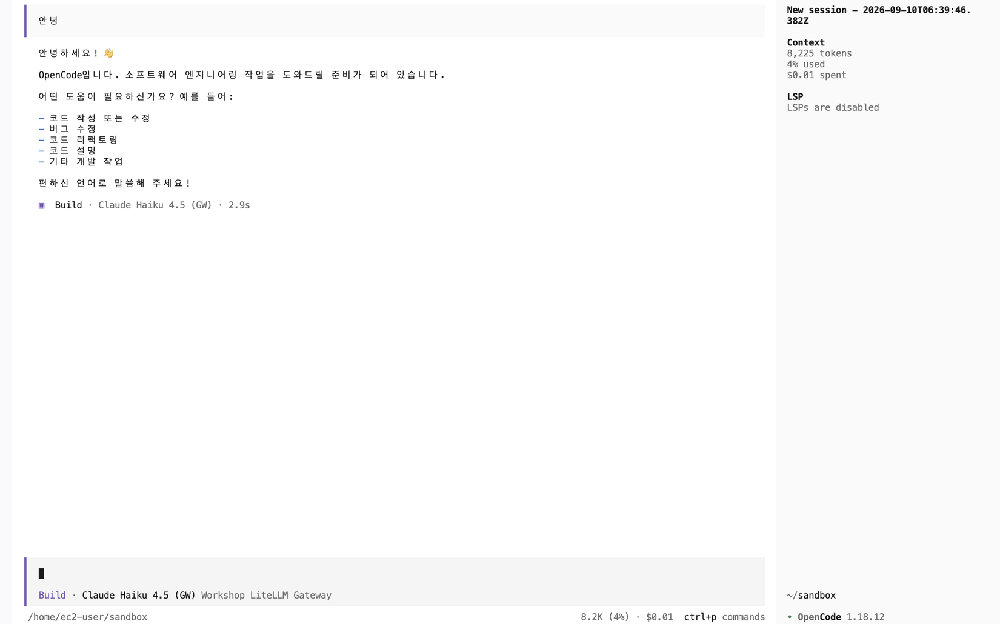

상태 표시부의 모델이 Claude Haiku 4.5 (GW)이고, 프로바이더가 Workshop LiteLLM Gateway다. "안녕" 한 번에 컨텍스트를 8,225토큰 쓰면서 사용률 4%와 0.01달러가 표시되는데, 이 수치가 cost 선언이 동작한 증거다. 실제 게이트웨이 로그에 남은 값은 뒤에서 본다.

키 파일은 4시간 뒤 만료되고 OpenCode는 스스로 갱신하지 않는다. Claude Code는 401을 보면 헬퍼를 다시 실행하지만 OpenCode에는 그 경로가 없다. 복구 방법은 세션 재시작이다. `/exit` 후 `opencode`를 실행하면 래퍼가 시작 시점에 키 파일을 갱신한다. 파일은 세션 시작 시점에 읽히므로 재시작 자체는 피할 수 없고, 래퍼가 덜어 주는 것은 갱신을 기억해야 하는 일이다.

명령 실행형 헬퍼가 없는 툴을 사내에 배포할 때 조직이 고를 수 있는 패턴은 셋이다.

| 패턴 | 방법 | 트레이드오프 |
|---|---|---|
| 래퍼 스크립트 | 헬퍼 실행 후 툴을 시작하는 스크립트를 표준으로 배포 | 가장 단순. 세션 도중 만료는 여전히 재시작 필요 |
| 백그라운드 갱신 | 헬퍼를 주기적으로 실행해 키 파일을 항상 최신으로 유지 | 세션 도중 만료가 줄지만 툴이 파일을 다시 읽는 시점에만 반영 |
| 키 수명 연장 | 브로커의 KEY_DURATION을 연장 | 편의는 늘고 보안은 약해진다. 유출된 키의 유효 시간이 그만큼 길어진다 |

어느 패턴을 골라도 게이트웨이 쪽은 바뀌지 않는다. 툴별 성숙도 차이를 클라이언트에서만 처리할 수 있다는 것이 이 구조의 실질적인 이점이다.

## Codex 연결

Claude Code는 환경 변수로 base URL을 바꿀 수 있지만 Codex는 그렇지 않다. `OPENAI_BASE_URL`을 export해도 아무 효과가 없고 오류도 경고도 없이 호출은 기본 엔드포인트로 나간다. Codex가 게이트웨이를 가리키게 하는 유일한 방법은 config.toml에 커스텀 프로바이더를 선언하는 것이다. 사내에 환경 변수만 설정하면 된다고 안내하면 팀 전체의 호출이 게이트웨이를 거치지 않게 되므로 Codex는 설정 파일을 표준으로 배포해야 한다.

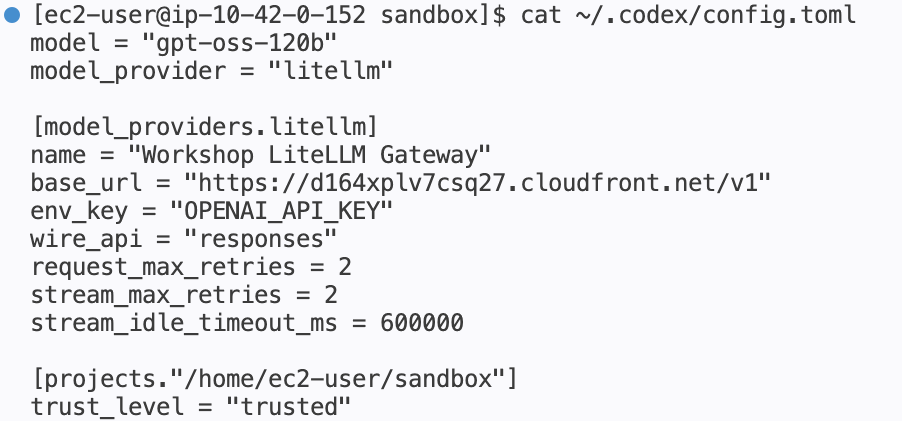

| 항목 | 값 | 왜 이 값인가 |
|---|---|---|
| model | gpt-oss-120b | 게이트웨이 별칭. 실제 Bedrock 모델 ID는 게이트웨이가 결정 |
| model_provider | litellm | 아래 블록을 기본 프로바이더로 지정 |
| base_url | 게이트웨이 URL + /v1 | Codex가 여기에 /responses를 붙여 호출 |
| env_key | OPENAI_API_KEY | 키를 읽어올 환경 변수 이름. 이 줄을 지우고 credential helper로 바꾼다 |
| wire_api | responses | 워크샵 문서 기준으로 유일하게 유효한 값. 과거의 chat은 폐지되었고 Codex 0.144.5는 Responses 포맷만 쓴다 |
| request_max_retries, stream_max_retries | 2 | 재시도가 반복되어 RPM 한도에 닿지 않도록 제한 |
| stream_idle_timeout_ms | 600000 | 게이트웨이와 CloudFront를 경유하는 스트리밍의 긴 대기에 대비 |
| projects 블록 | trust_level trusted | ~/sandbox를 신뢰 디렉터리로 지정해 승인 프롬프트를 줄임 |

Codex의 프로바이더별 credential helper는 Claude Code의 apiKeyHelper와 요구 조건이 같다. stdout에 키만 출력하면 되므로 같은 스크립트를 그대로 지정한다. env_key 줄을 삭제하고 auth 블록을 추가해 파일 전체를 다시 썼다.

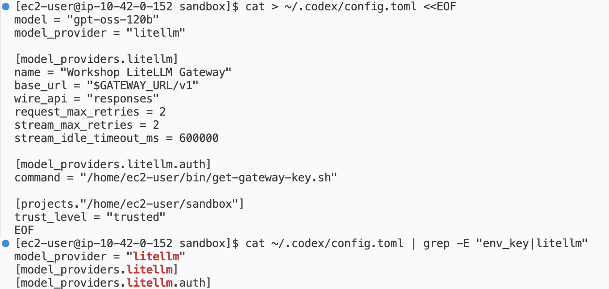

```toml
[model_providers.litellm.auth]
command = "/home/ec2-user/bin/get-gateway-key.sh"
```

| auth 항목 | 기본값 | 의미 |
|---|---|---|
| command | 없음 | 실행해서 stdout의 키를 가져올 명령 |
| refresh_interval_ms | 300000 | 5분마다 헬퍼를 다시 실행해 키 갱신. 헬퍼가 캐시를 돌려주므로 키가 늘지 않는다 |
| timeout_ms | 5000 | 5초 안에 돌아오지 않으면 실패. 헬퍼는 반드시 비대화형 |

env_key와 auth 블록은 같은 프로바이더에 동시에 선언할 수 없다. 둘 다 남으면 Codex가 설정 검증 단계에서 오류를 내고 시작에 실패한다. 표준 config.toml을 개정할 때 auth 블록만 추가하고 env_key 줄을 남기면 그 파일을 받은 팀 전원의 Codex가 한꺼번에 기동하지 못한다. TOML 작성 순서도 주의할 점이다. model 같은 플랫 키는 테이블 선언보다 앞에 와야 하고, auth 블록을 `[model_providers.litellm]` 블록 중간에 끼워 넣으면 그 뒤의 wire_api 등이 모두 auth 테이블의 키로 해석된다.

env_key 줄이 사라졌으므로 Codex는 더 이상 OPENAI_API_KEY를 읽지 않는다. 키는 셸 히스토리, 프로필, export 어디에도 없고 헬퍼가 관리하는 `~/.gateway/` 안에만 존재한다. Claude Code에서 환경 변수가 헬퍼보다 우선하던 문제와 대조되는 지점이다.

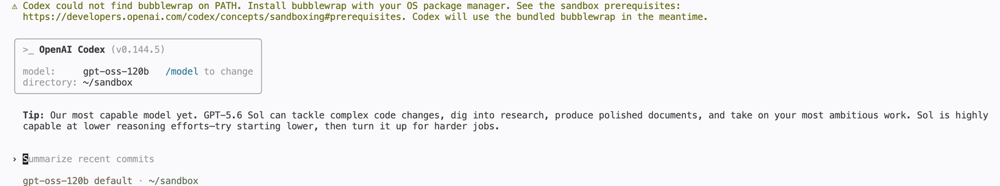

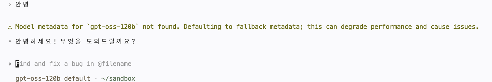

시작 화면에 모델 gpt-oss-120b가 잡혀 있고, 첫 요청에서 `Model metadata for gpt-oss-120b not found` 경고가 나온다. 내장 목록에 없는 모델명을 만나면 Codex가 출력하는 안내라 게이트웨이 별칭 구성에서는 늘 표시된다. 워크샵 문서가 계정 제한 때문에 코딩 작업 같은 큰 태스크는 429가 난다고 안내하고 있어 짧은 대화만 확인했다. 이 호출에 쓰인 키를 참가자가 복사하거나 붙여 넣은 적은 없다. Claude가 아닌 다른 벤더의 모델도 같은 게이트웨이와 같은 헬퍼로 호출되었다.

키를 받아올 수 없을 때 Codex는 401 대신 `Reconnecting... 1/5` 같은 네트워크 재연결 메시지를 반복한다. 게이트웨이가 불안정하다고 잘못 판단하기 쉬운 지점이다. 이 메시지가 보이면 네트워크가 아니라 인증을 확인한다. 헬퍼를 직접 실행해 키가 나오는지 보면 바로 판별된다.

| 툴 | API 포맷 | 키 주입 | 키 갱신 |
|---|---|---|---|
| Claude Code | Anthropic Messages | apiKeyHelper, 명령 실행 | 자동, 401 시 재호출 |
| Codex | OpenAI Responses | auth의 command, 명령 실행 | 자동, 401 시 재시도 |
| OpenCode | OpenAI Chat Completions | {file:...}, 파일 읽기 | 재시작 필요. 키 파일 갱신은 래퍼가 처리 |

서로 다른 벤더의 서로 다른 포맷을 쓰는 세 툴이 하나의 신원 developer001과 하나의 예산 아래에서, 같은 헬퍼가 같은 사용자 앞으로 발급한 임시 키로 연결되었다. 실제로는 OpenCode 절에서 세션을 지우고 다시 로그인해 키는 두 개가 되었지만 사용자와 예산은 하나다. Claude Desktop의 Cowork를 같은 헬퍼로 연결하는 선택 실습도 있는데 참가자 노트북에서 진행하는 절차라 이번에는 하지 않았다. 규약은 같다. 다만 `CLAUDE_HELPER_CONTEXT` 환경 변수로 사용자가 앞에 있을 때만 브라우저 로그인을 열도록 헬퍼가 판단할 수 있어, 래퍼 없이 헬퍼 하나로 로그인까지 처리한다는 점이 다르다.

## 우회는 어디서 막히나

앞에서 붙인 통제는 전부 게이트웨이를 지나는 트래픽에만 적용된다. 그 전제는 설정 한 줄로 무너진다. Codex를 비롯한 대부분의 AI CLI에는 Bedrock을 직접 호출하는 프로바이더가 내장되어 있다. 프로바이더 이름 하나만 바꾸면 호출이 게이트웨이를 거치지 않고, 그렇게 나간 호출은 지출에도 프롬프트 로그에도 남지 않는다. 게이트웨이는 자신을 지나지 않은 트래픽에는 권한 검사도 기록도 할 수 없다.

그래서 우회를 막는 것은 게이트웨이가 아니라 그 아래 층인 자격증명, IAM, 네트워크의 역할이다. 워크샵 계정에서는 참가자가 자기 역할을 수정할 수 없고 Organizations 조작도 막혀 있다. 그래서 정책을 켜고 끄는 시연 대신 워크샵이 제공한 정책 원문을 읽는다. 이 절에는 실습 화면이 없다.

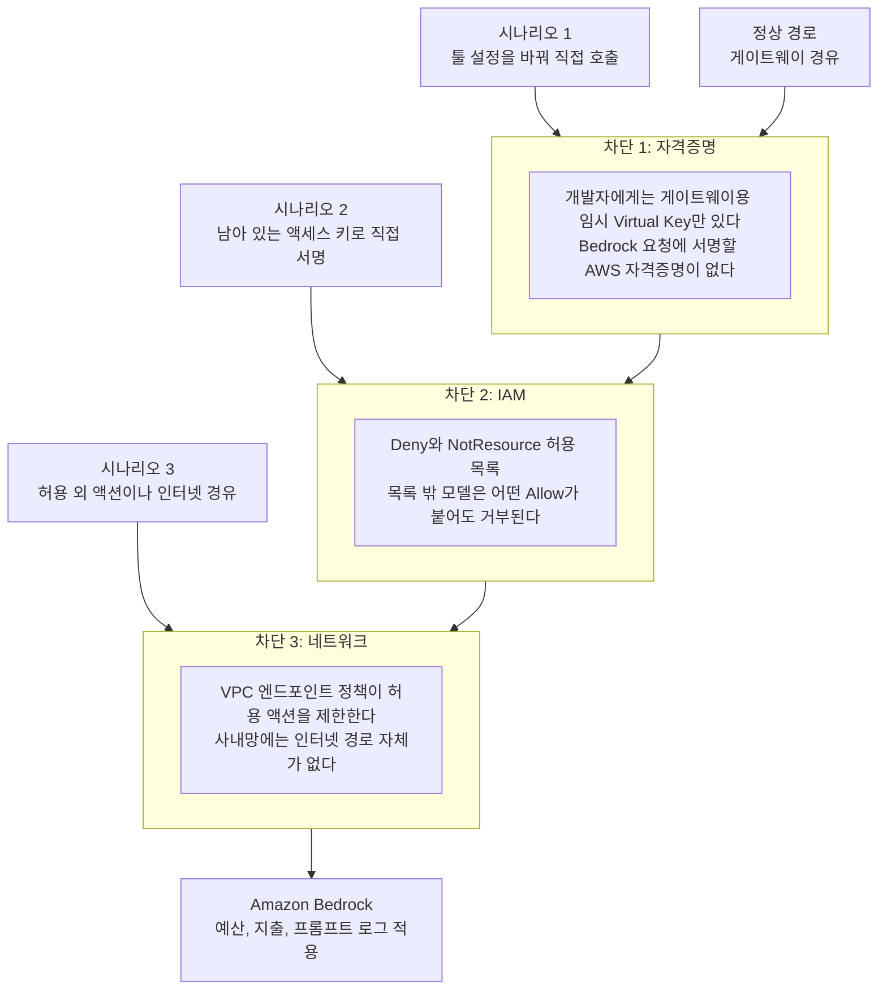
```mermaid
flowchart TB
    subgraph L1["차단 1: 자격증명"]
        A1["개발자에게는 게이트웨이용 임시 Virtual Key만 있다<br>Bedrock 요청에 서명할 AWS 자격증명이 없다"]
    end
    subgraph L2["차단 2: IAM"]
        A2["Deny와 NotResource 허용 목록<br>목록 밖 모델은 어떤 Allow가 붙어도 거부된다"]
    end
    subgraph L3["차단 3: 네트워크"]
        A3["VPC 엔드포인트 정책이 허용 액션을 제한한다<br>사내망에는 인터넷 경로 자체가 없다"]
    end
    S1["시나리오 1<br>툴 설정을 바꿔 직접 호출"] --> L1
    S2["시나리오 2<br>남아 있는 액세스 키로 직접 서명"] --> L2
    S3["시나리오 3<br>허용 외 액션이나 인터넷 경유"] --> L3
    OK["정상 경로<br>게이트웨이 경유"] --> L1 --> L2 --> L3 --> BR["Amazon Bedrock<br>예산, 지출, 프롬프트 로그 적용"]
```

| 시나리오 | 막는 층 | 왜 막히나 |
|---|---|---|
| 툴 설정을 바꿔 직접 호출, 예를 들어 Codex의 `model_provider=amazon-bedrock` | 자격증명 | 개발자에게는 게이트웨이용 임시 Virtual Key만 있어 Bedrock 요청에 서명할 AWS 자격증명이 없다 |
| 다른 경로로 얻은 AWS 자격증명으로 직접 서명 | IAM | 허용 목록 밖 모델은 Deny. 목록 안 모델이면 성공하므로 아래 설계 지침으로 마저 막는다 |
| 허용 외 액션이나 경로, 모델 설정 변경, 프로비저닝, 인터넷 경유 | 네트워크 | VPC 엔드포인트 정책이 허용 액션을 제한하고 사내망에는 인터넷 경로 자체가 없다 |

세 차단은 순서대로 배치된 별개의 관문이 아니라 겹쳐 놓은 층이다. 한 층이 놓친 요청을 다음 층이 막고, 세 층을 모두 지나 남는 것은 허용 모델의 추론 호출뿐이다. 그 호출도 게이트웨이를 지나야 하므로 결국 예산과 로그가 적용된다.

차단 1은 1편에서 만든 흐름 그 자체다. 개발자는 SSO로 로그인해 게이트웨이용 임시 키 하나만 받고 그 키는 게이트웨이 주소에서만 유효하다. 반대로 사내 PC에 Bedrock을 호출할 액세스 키가 있으면 이 차단은 없는 것과 같다. 그래서 두 번째 층이 필요하다.

차단 2는 이벤트 참가자 역할에 연결된 IAM 정책이다.

| Sid | 하는 일 | 실무 해설 |
|---|---|---|
| AllowInvokeOnly | InvokeModel, InvokeModelWithResponseStream 두 액션만 허용 | 관리, 학습, 프로비저닝 액션은 부여하지 않는다 |
| DenyInferenceOutsideAllowlist | NotResource로 허용 목록 밖 모든 모델을 Deny | 새 모델이 출시되어도 정책을 수정하지 않는 한 계속 막혀 있다. 허용 목록을 Allow가 아니라 Deny와 NotResource로 쓰는 이유 |
| DenyProvisioningAndCustomization | 프로비저닝 처리량과 커스터마이징 작업 차단 | 비용이 큰 리소스를 개발자가 직접 만들지 못하게 막는다 |

```json
{
  "Sid": "DenyInferenceOutsideAllowlist",
  "Effect": "Deny",
  "Action": ["bedrock:InvokeModel", "bedrock:InvokeModelWithResponseStream"],
  "NotResource": [
    "arn:aws:bedrock:*::foundation-model/anthropic.claude-sonnet-4-6",
    "arn:aws:bedrock:*::foundation-model/anthropic.claude-haiku-4-5-*",
    "arn:aws:bedrock:*::foundation-model/qwen.qwen3-coder-next",
    "arn:aws:bedrock:*:*:inference-profile/global.anthropic.claude-sonnet-4-6",
    "arn:aws:bedrock:*:*:inference-profile/global.anthropic.claude-haiku-4-5-*"
  ]
}
```

IAM에서 명시적 Deny는 다른 정책의 어떤 Allow보다 먼저 적용된다. 시나리오 2에 남는 위험, 즉 허용 목록 안의 모델을 직접 호출하는 경우까지 없애려면 이 Deny를 개발자 역할 전체 또는 SCP에 적용하고 게이트웨이 인스턴스 역할만 예외로 둔다. 그러면 게이트웨이를 지나지 않고는 Bedrock을 쓸 수 없는 상태가 된다.

차단 3은 1편에서 읽은 VPC 엔드포인트 정책 3개다. 실제 추론이 지나는 bedrock-runtime에는 모델 호출 액션 두 개와 Guardrail 검사 하나만 허용되어 있고, 조회용 bedrock 엔드포인트에는 호출 액션이 없다. 이 층이 마지막 관문이 되려면 게이트웨이 서브넷의 인터넷 경로를 제거해 Bedrock에 엔드포인트로만 도달하게 해야 한다. 워크샵에서는 브라우저 접속 때문에 EC2가 퍼블릭 서브넷에 있어 모델 호출 구간만 엔드포인트를 지나지만, 프로덕션에서는 게이트웨이를 프라이빗 서브넷에 두어 이 조건까지 완성한다. CloudTrail의 InvokeModel 이벤트에 vpcEndpointId와 프라이빗 sourceIPAddress가 남으므로 정책은 설계 증거로, CloudTrail은 운영 증거로 감사 대응에서 함께 쓴다.

## 지출과 프롬프트 로그 감사

통제 지점을 만든 것만으로는 도입 승인이 나지 않는다. 심사에서 막히는 질문은 늘 같다. 누가, 어떤 툴로, 무엇을 물었고, 얼마를 썼는지 답할 수 있는가. 게이트웨이 EC2의 SSM 세션에서 Master Key로 조회했다.

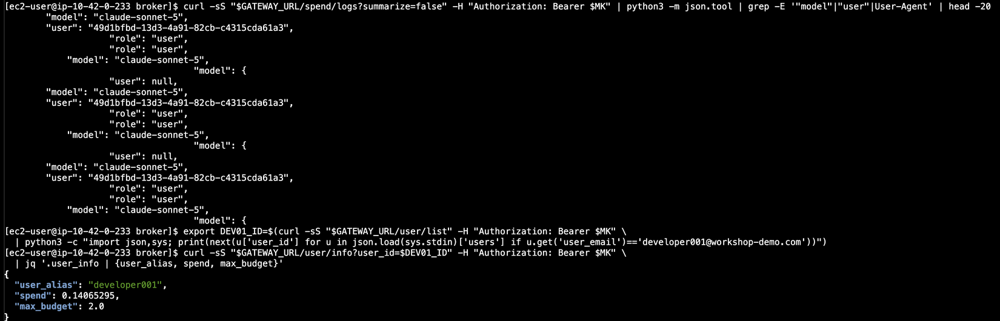

툴별로 비용을 나눠 보려는 요구는 보통 태그 설계나 별도 계측 프로젝트로 이어지는데, AI 코딩 툴은 각자 고유한 User-Agent를 보내기 때문에 게이트웨이는 추가 설정 없이 어떤 툴에서 온 요청인지 이미 안다. `/spend/logs` 응답의 각 요청에 모델과 사용자 UUID가 남는다. 내가 실행한 grep 출력은 앞부분 20줄이 실패한 claude-sonnet-5 요청으로 채워져 헤더 줄이 잡히지 않았다. 툴을 구분하는 User-Agent는 뒤의 요청 상세에서 확인했다. 툴 3종이 같은 사용자에게 걸린 임시 키를 썼으므로 툴이 달라도 지출은 developer001 한 사람에게 모인다.

UI로 초대한 사용자는 user_id가 UUID라 `user_id=developer001`로는 조회할 수 없다. 이메일로 UUID를 먼저 찾은 뒤 `/user/info`를 부르면 user_alias developer001, spend 0.1407달러, max_budget 2달러가 나온다. 호출 직후에는 spend가 0으로 보일 수 있다. 예산 초과 응답에는 실시간 값이 즉시 반영되지만 데이터베이스 집계는 수십 초 지연되기 때문이다.

같은 데이터를 Admin UI의 Usage에서 화면으로 봤다.

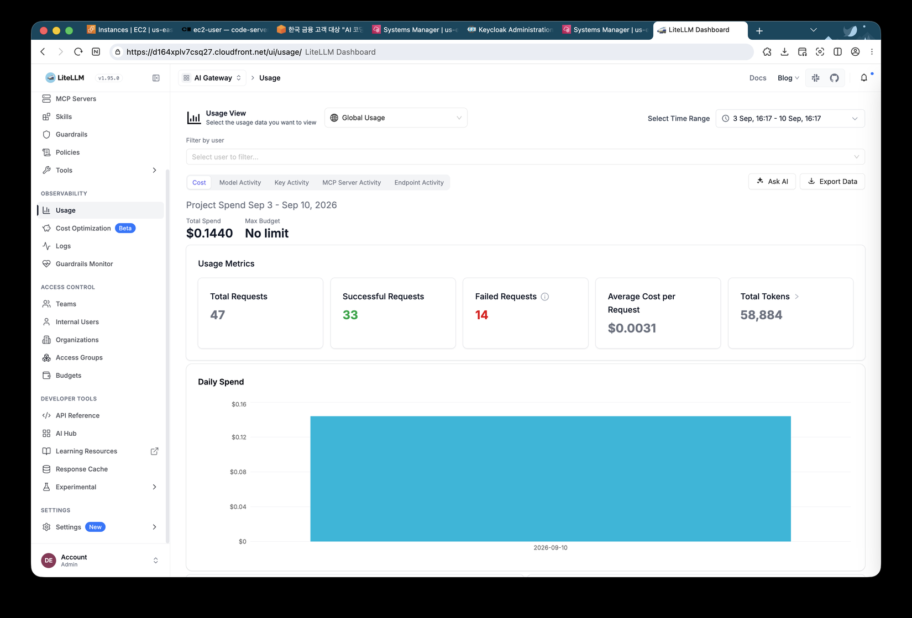

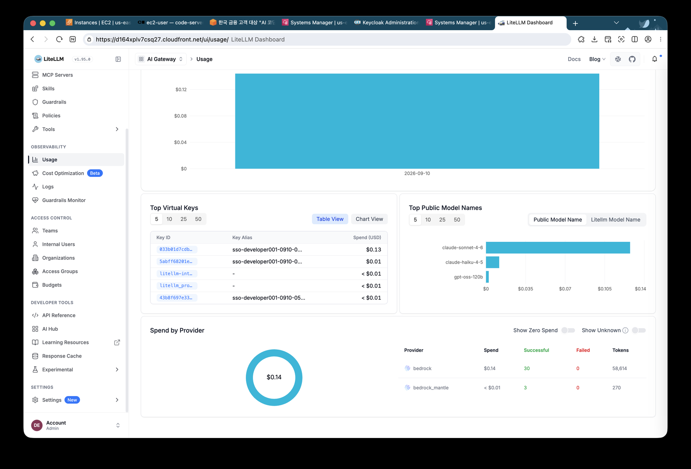

| 항목 | 값 |
|---|---|
| Total Spend | 0.1440달러 |
| Total Requests | 47 |
| Successful | 33 |
| Failed | 14 |
| Total Tokens | 58,884 |
| Spend by Provider | bedrock 0.14달러, 30건, 58,614토큰. bedrock_mantle 0.01달러 미만, 3건, 270토큰 |

Top Virtual Keys에는 sso-developer001 별칭 키 세 개와 LiteLLM이 내부적으로 쓰는 키 두 개가 있다. Top Public Model Names는 claude-sonnet-4-6이 대부분이고 claude-haiku-4-5와 gpt-oss-120b가 뒤를 잇는다. 1편의 모델 목록에서 gpt-oss와 qwen은 Costs 칸이 비어 있었지만 지출 로그에는 비용이 계산되어 있다. 다만 단가가 Claude보다 훨씬 낮아 총지출에서는 거의 드러나지 않는다.

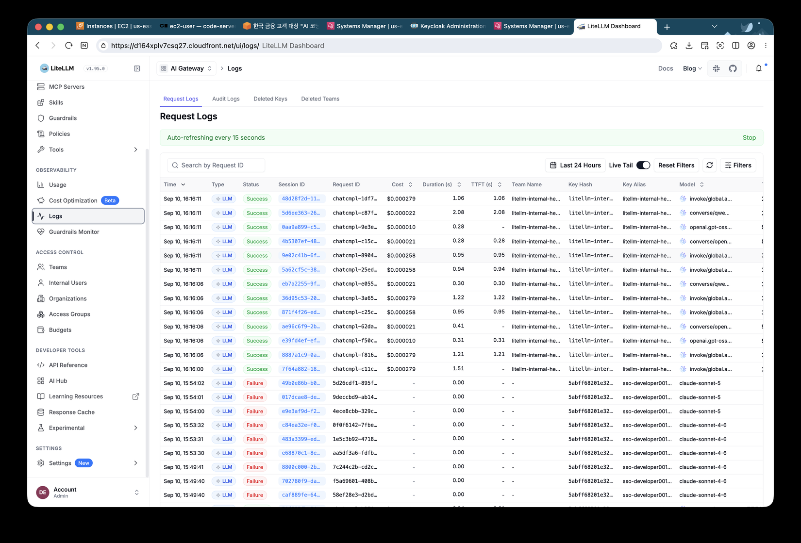

Logs 목록에는 헬스체크 팀 이름으로 남는 내부 요청과 developer001 키의 요청이 섞여 있다. 실패 14건 중 4건은 14시 56분에서 59분 사이에 있어 1편의 1분 만료 키 실험에서 나온 401로 보이고, 1건은 15시 39분 OpenCode 첫 요청 직후에 있다. 나머지 9건은 15시 49분에서 54분 사이에 1초 간격으로 3건씩 세 번 몰려 있고, 모델은 claude-sonnet-4-6 6건과 별칭 claude-sonnet-5 3건이다. Duration이 0이고 비용이 없으니 모델에 도달하기 전에 게이트웨이가 거부한 요청이다. 오류 본문은 이번 실습에서 열어 보지 않아 원인은 확인하지 못했다. 짧은 간격의 연속 재시도로 보이며, 워크샵이 미리 경고한 베타 헤더 400과 Bedrock 분당 토큰 쿼터 429가 후보다. 감사 화면에서는 이런 실패도 사용자와 키와 시각이 함께 남는다는 점이 중요하다.

요청 하나를 열면 툴 분류의 근거가 그대로 보인다.

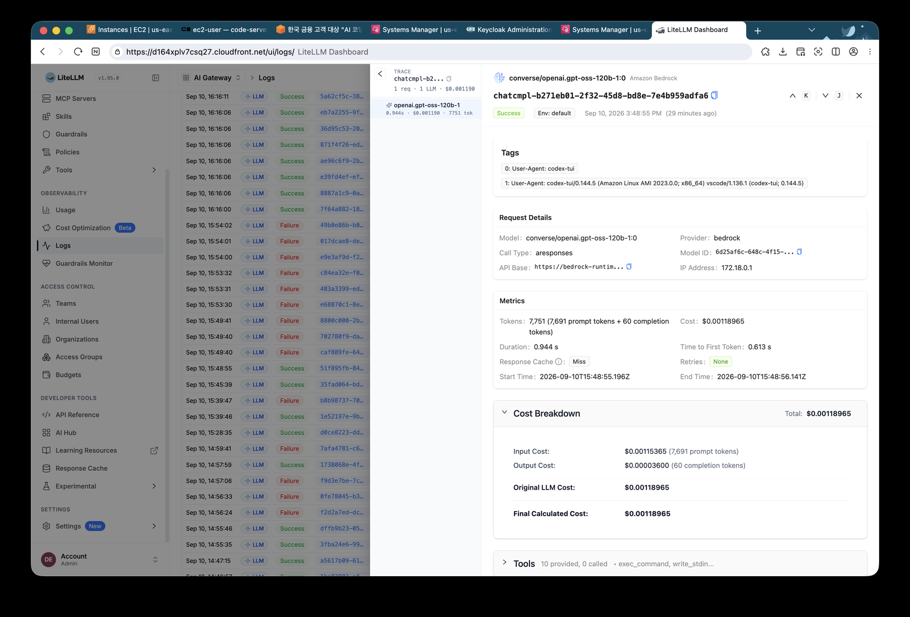

| 항목 | 값 |
|---|---|
| 모델 | converse/openai.gpt-oss-120b-1:0, Amazon Bedrock |
| Tags | User-Agent codex-tui/0.144.5 (Amazon Linux AMI 2023.0.0; x86_64) vscode/1.136.1 (codex-tui; 0.144.5) |
| Call Type | aresponses |
| Tokens | 7,751. 프롬프트 7,691과 완성 60 |
| Cost | 0.00118965달러 |
| Duration, TTFT | 0.944초, 0.613초 |
| Tools | 10개 제공, 0개 호출 |

워크샵 문서는 Codex의 User-Agent를 `codex_exec`로 적어 두었는데 내 로그에는 `codex-tui`가 남았다. 문서는 `codex exec` 비대화형 실행을 기준으로 했고, 나는 대화형 TUI를 썼기 때문이다. 같은 툴이라도 실행 모드에 따라 User-Agent가 달라지므로 툴별 집계 규칙을 만들 때 접두어로 묶어야 한다.

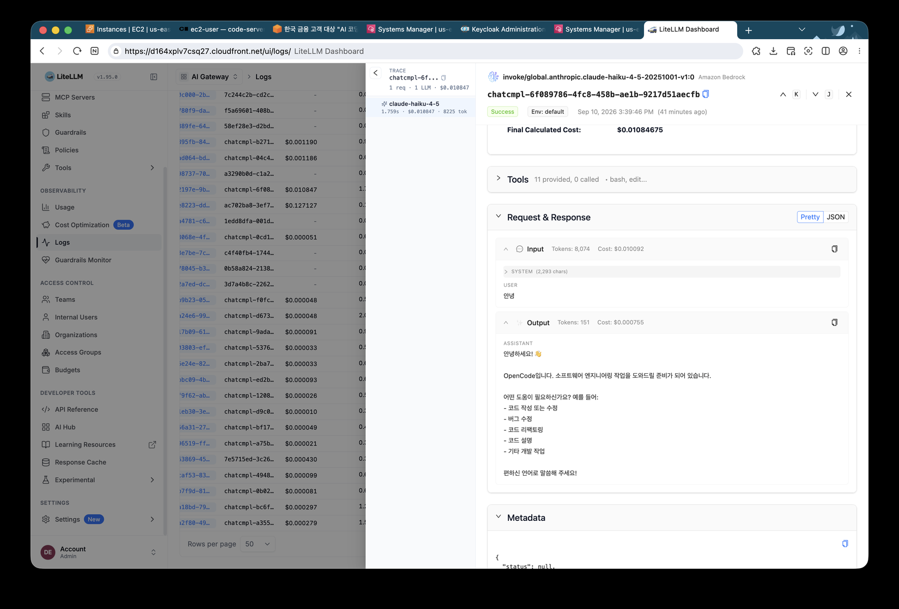

Request & Response를 펼치면 SYSTEM 프롬프트부터 대화 전체가 보인다. OpenCode의 "안녕"에 대한 응답 원문이 그대로 있고, 입력 8,074토큰에 0.010092달러, 출력 151토큰에 0.000755달러가 계산되어 있다. 이 화면이 읽어 오는 저장소가 앞의 spend log이고, 원문이 실제로 저장되는 필드는 proxy_server_request다. 같은 로그의 messages 필드는 realtime API 전용이라 일반 요청에서는 항상 빈 객체로 남는다. messages가 비어 있는 것을 보고 프롬프트 로깅이 고장 났다거나 라이선스가 없어서 안 된다고 판단하는 것이 가장 흔한 오해다.

세 툴에 짧은 한마디를 보낸 비용을 로그에서 모아 보면 툴별 오버헤드가 드러난다.

| 툴 | 모델 | 토큰 | 비용 | 비고 |
|---|---|---|---|---|
| Codex, 안녕 | gpt-oss-120b | 7,751 | 0.0012달러 | 프롬프트에 실린 툴 정의 10개 |
| OpenCode, 안녕 | claude-haiku-4-5 | 8,225 | 0.0108달러 | 시스템 프롬프트 2,293자와 툴 정의 11개 |
| Claude Code, 16시 34분 세션의 요청 하나 | claude-sonnet-4-6 | 33,826 | 0.1271달러 | 안녕과 PII 문장 중 하나. 세션 트리가 Duration 기준 정렬이라 순서는 화면에서 알 수 없다 |
| Claude Code, 같은 세션의 다른 요청 | claude-sonnet-4-6 | 34,050 | 0.0128달러 | 토큰은 비슷한데 비용이 10분의 1 |

Claude Code의 두 요청은 토큰 수가 거의 같은데 비용이 열 배 차이 난다. 15시 28분 세션에서 안녕 한마디에 쓰인 키의 지출도 0.1271달러로 같은 값이라, 세션의 첫 요청이 0.127달러이고 그다음 요청이 0.013달러라는 해석이 자연스럽다. 첫 요청이 프롬프트 캐시를 쓰고 두 번째가 읽는 구조라면 Bedrock의 캐시 쓰기와 읽기 단가 차이에 숫자가 맞아떨어진다. 다만 이 화면만으로는 순서를 확정할 수 없어 재현 실험이 필요한 관찰로 남긴다. 세션 하나를 새로 열 때마다 0.13달러가 든다면 1편에서 developer001에게 건 1일 2달러 예산은 새 세션을 하루 15번 여는 것만으로 소진된다. 예산을 잡을 때 툴별 첫 요청 비용을 기준선으로 봐야 한다는 것이 이 표의 결론이다.

감사팀이 요구하는 것은 보통 화면이 아니라 원본 테이블에 대한 재현 가능한 쿼리다. RDS는 프라이빗 서브넷에 있어 게이트웨이 EC2에서만 접속할 수 있고, DB 비밀번호는 Secrets Manager에서 꺼낸다.

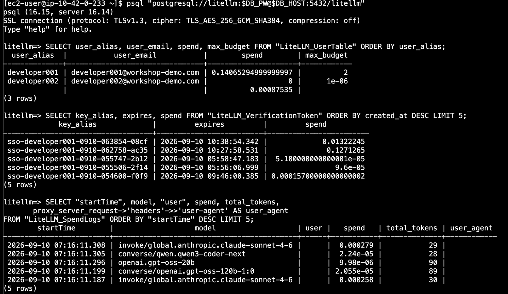

| 테이블 | 확인한 것 |
|---|---|
| LiteLLM_UserTable | developer001의 spend 0.1407달러와 max_budget 2, developer002의 max_budget 0.000001. alias가 없는 세 번째 행은 프록시 기본 관리자 default_user_id로 보인다. 1편의 Internal Users 화면에서 같은 금액이 Admin 계정에 잡혀 있었다 |
| LiteLLM_VerificationToken | sso-developer001 별칭 키 5개와 각각의 expires, spend. 15시 27분 키에 0.1271달러, 15시 38분 키에 0.0132달러 |
| LiteLLM_SpendLogs | 최근 5행. 모델, spend, total_tokens. user와 user_agent 열이 비어 있다 |

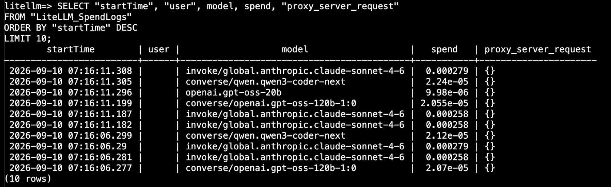

최근 10행의 proxy_server_request가 전부 빈 객체였다. 워크샵 문서의 경고는 messages 필드에 대한 것이었는데, 이 시각의 최근 행은 모두 LiteLLM 내부 헬스체크라 user도 user_agent도 proxy_server_request도 비어 있었다. 감사 쿼리를 만들 때 헬스체크 행을 팀 이름이나 키 별칭으로 걸러 내야 사람의 요청만 남는다.

프롬프트 원문 저장은 기본값이 꺼져 있고 이 환경은 부트스트랩이 `store_prompts_in_spend_logs: true`로 미리 켜 두었다. 켜는 순간 개발자가 입력한 사내 코드와 데이터가 데이터베이스에 평문으로 쌓인다.

| 도입 검토 논점 | 내용 |
|---|---|
| 보존 기간 | LiteLLM의 지출 로그 자동 삭제는 Enterprise 기능. OSS만 쓴다면 데이터베이스 측 정리 작업을 함께 설계 |
| 접근 통제 | 원문을 볼 수 있는 사람은 Master Key 보유자, DB 접근 권한자, Admin UI 관리자. 세 경로를 각각 누가 갖는지 문서화 |
| 민감정보 | 로그에 주민등록번호가 남으면 안 된다는 요구는 보존 정책으로 해결되지 않는다. 저장 전에 걸러야 한다. 다음 절의 Guardrails 역할 |
| 끄는 선택 | 비용과 귀속 감사만 필요하면 원문 저장을 끈 채로도 사용자, 모델, 토큰, 비용 집계는 그대로 남는다 |

## 예산 발동과 키 폐기

예산을 설정한 것과 예산이 실제로 발동하는 것은 다른 이야기다. 감사 심사가 확인하는 것도 설정 화면이 아니라 차단이 실제로 일어난 기록과 발급한 것을 즉시 끊을 수 있는 절차다. 워크샵의 Module 5-2가 이 부분인데 내 실습에서는 화면을 남기지 못해 절차만 정리한다.

| 단계 | 하는 일 | 기대 결과 |
|---|---|---|
| 1 | Virtual Keys에서 Owned By를 Another User로 두고 developer002 소유의 키 budget-demo 생성. 모델은 claude-haiku-4-5 하나 | sk- 키가 한 번만 표시된다 |
| 2 | 그 키로 /v1/chat/completions를 반복 호출 | 첫 호출은 성공하고 두 번째나 세 번째에서 429 `ExceededBudget: User=<UUID> over budget` |
| 3 | 키 상세의 More key actions에서 Delete Key. 키 이름을 직접 입력해야 삭제 버튼이 활성화 | 같은 curl이 예산 초과가 아니라 `Invalid proxy server token` 인증 실패로 거부 |

Owned By를 기본값 You로 두면 키가 로그인한 운영자 소유가 되어 지출이 developer002에 귀속되지 않고 429가 발동하지 않는다. 429 메시지가 `User=<UUID>`인 점이 중요하다. 차단 주체는 키가 아니라 사용자라서 developer002에게 키를 10개 발급해도 합산 예산은 하나다. 차단은 요청이 Bedrock에 도달하기 전, 비용이 발생하지 않는 지점에서 일어난다.

| 키 조치 | 용도 |
|---|---|
| Block Key | 삭제 없이 일시 차단. 되돌릴 수 있다 |
| Delete Key | 즉시 폐기. 해시만 저장되어 있어 복구 불가 |
| Reset Spend | 지출 카운터 초기화 |

사고 대응이라면 먼저 Block으로 막고 조사 후 Delete하는 순서가 적절하다. 1편에서 SSO로 발급된 임시 키도 브로커가 표준 `/key/generate`로 만든 똑같은 Virtual Key라서 같은 화면에서 같은 버튼으로 폐기된다. 다만 만료 전에 폐기하면 클라이언트 캐시는 그 키가 아직 유효하다고 판단해 401이 반복되므로 `rm ~/.gateway/virtual-key.json` 뒤 헬퍼를 다시 실행해야 한다. 키 폐기와 별개로 IdP에서 계정을 비활성화하면 재발급 자체가 차단되는데, 이것이 가장 근본적인 방법이다.

## PII 마스킹과 Guardrails

모델이 스스로 응답을 거부하는 것은 벤더의 판단이지만 조직 정책을 적용하는 것은 조직의 책임이고, 그 정책은 모델을 교체해도 달라져서는 안 된다. 입력 통제 두 층을 게이트웨이에 추가했다. 관리형 정책 목록에 없는 한국형 PII를 LiteLLM Custom Guardrail로 마스킹하고, Amazon Bedrock Guardrails를 연결해 유해 프롬프트 차단을 확인한다. 적용 지점이 게이트웨이에 있으므로 어떤 모델과 CLI를 쓰든 같은 정책이 적용되고 정책 변경도 클라이언트 배포와 무관하다.

| | LiteLLM Custom Guardrail | Bedrock Guardrails |
|---|---|---|
| 실행 위치 | 게이트웨이 프로세스 안, 파이썬 훅 | AWS 관리형 서비스, ApplyGuardrail 호출 |
| 정책 표현 | 코드로 쓰는 사내 규칙. 정규식, 금칙 사전, 내부 API 조회 | 콘솔에서 고르는 관리형 정책. 콘텐츠 필터, 금칙 주제, 금칙 단어 |
| 동작 방식 | 입력 수정, 마스킹 | 입력 검사 후 차단 |
| 적용 범위 | 게이트웨이가 중계하는 모든 벤더와 모델 | Bedrock 모델 경로 |
| mode | pre_call | during_call |
| 등록 방법 | config.yaml, 재시작 필요 | Admin UI, 재시작 불필요 |

주민등록번호는 어떤 모델에도 보내면 안 된다는 요구는 한국 환경 고유의 규칙이라 관리형 필터 목록으로 모두 처리되지 않는다. 부트스트랩이 배치한 필터 코드를 읽었다.

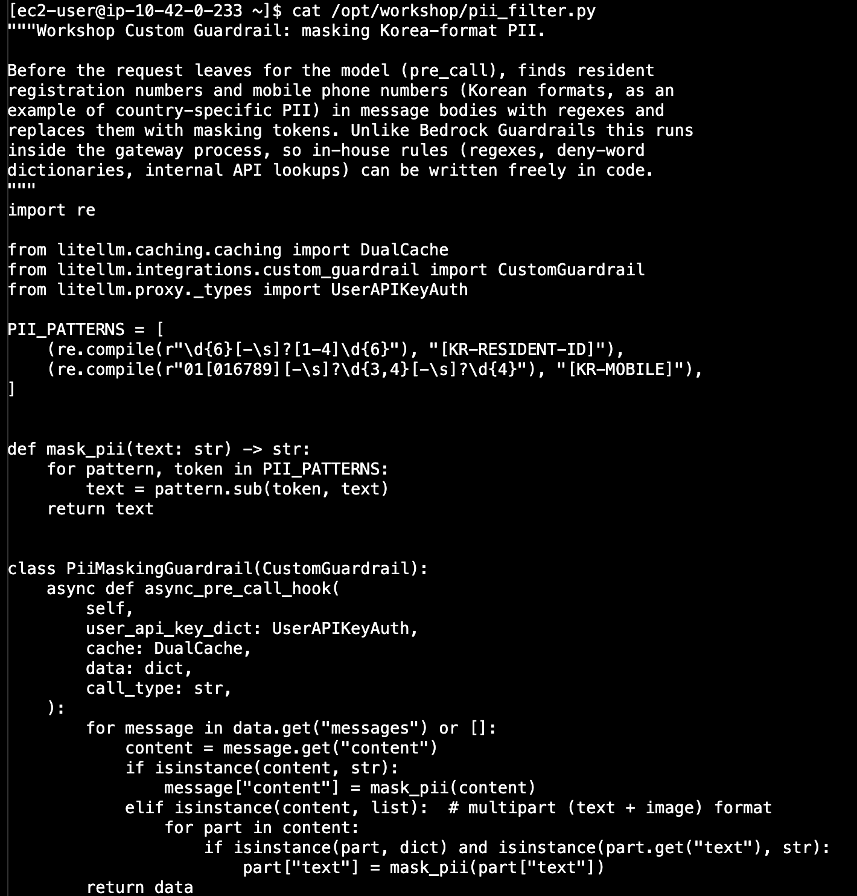

| 항목 | 의미 |
|---|---|
| PII_PATTERNS | 주민등록번호와 휴대폰 번호 정규식 두 개. 일치하면 원문 대신 [KR-RESIDENT-ID], [KR-MOBILE] 토큰으로 치환. 계좌번호, 카드번호, 사번처럼 사내 규칙이 늘면 이 목록에 한 줄씩 추가 |
| async_pre_call_hook | 요청이 모델로 나가기 전에 실행되는 훅. data의 messages를 직접 고쳐 그 결과를 내보내므로 모델은 마스킹된 문장만 받는다 |
| 멀티파트 분기 | content가 문자열이 아니라 텍스트와 이미지 목록으로 오는 요청에서도 텍스트 부분을 처리 |

config.yaml 끝에 guardrails 블록을 추가하고 컨테이너를 다시 만들었다. 설정 파일은 읽기 전용 마운트라 재생성이 필요하고, 1편에서 UI로 등록한 모델과 사용자는 DB에 있어 유지된다.

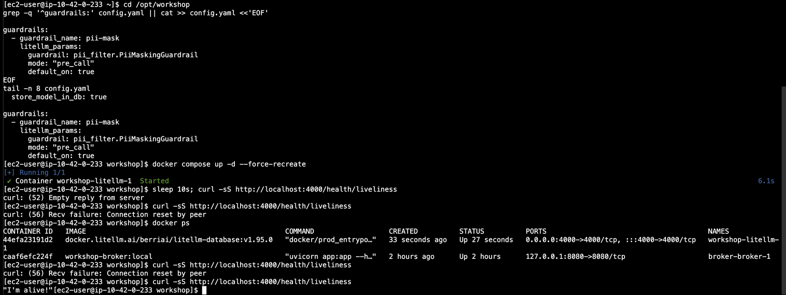

```yaml
guardrails:
  - guardrail_name: pii-mask
    litellm_params:
      guardrail: pii_filter.PiiMaskingGuardrail
      mode: "pre_call"
      default_on: true
```

guardrail 값의 형식은 파일 이름과 클래스 이름이다. 재생성 직후 헬스체크가 세 번 실패했는데, 빈 응답 한 번과 연결 리셋 두 번 뒤에 `"I'm alive!"`가 왔다. 1편의 첫 기동 때와 같은 컨테이너 기동 대기 구간이다. 응답이 계속 없으면 guardrail 값 오타나 YAML 들여쓰기 문제이므로 컨테이너 로그를 본다.

적용 지점이 게이트웨이에 있으므로 확인도 개발자가 실제로 쓰는 툴에서 했다. Claude Code에 입력 문장을 그대로 반복하라고 요청하면 모델이 받은 문장에 원문이 남아 있는지가 응답에 드러난다.

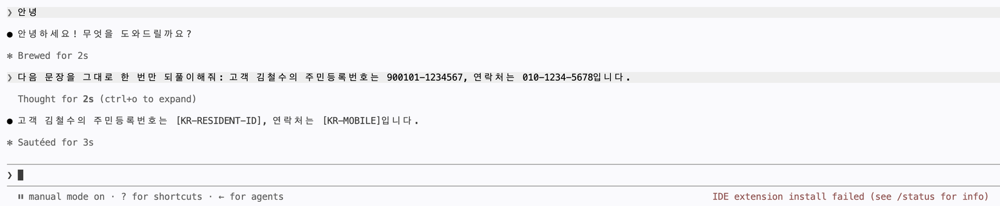

응답 문장에 900101-1234567과 010-1234-5678 대신 [KR-RESIDENT-ID]와 [KR-MOBILE]이 들어 있다. 모델은 원문을 받은 적이 없다. 마스킹은 게이트웨이가 요청을 내보내기 전에 일어났고 Claude Code와 모델은 어떤 개인식별정보가 있었는지 모른다. 화면에 입력한 원문은 로컬 대화 기록에만 있다.

로그에 저장된 것도 마스킹본이었다.

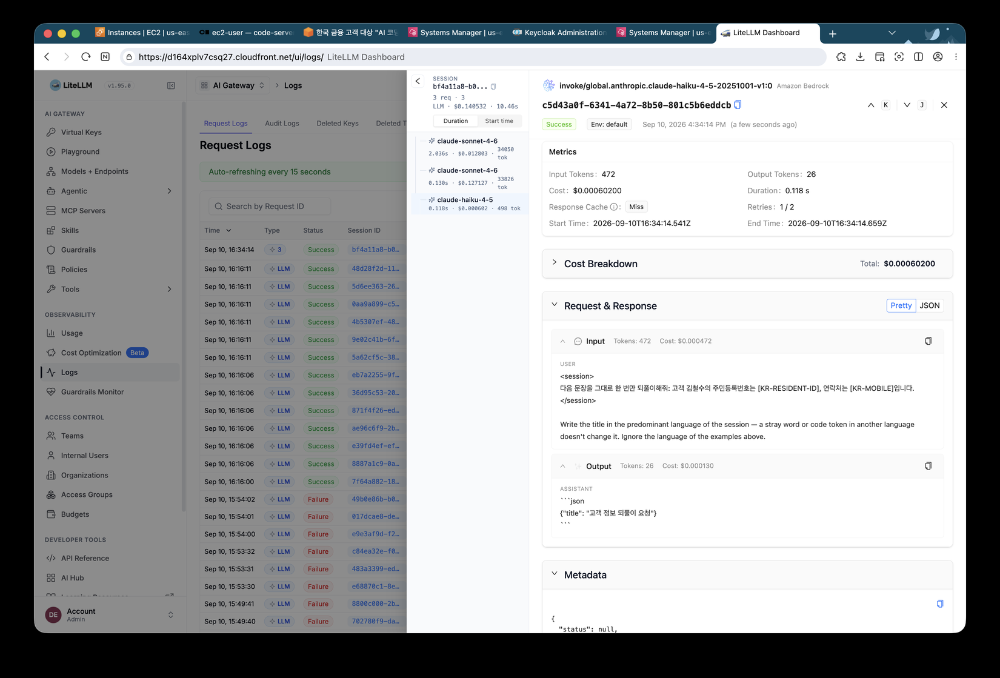

이 화면은 Claude Code가 세션 제목을 만들려고 보낸 haiku 백그라운드 호출이다. 사용자 입력이 이미 [KR-RESIDENT-ID]로 바뀐 채 들어가 있고, 세션 트리에는 앞 절에서 본 sonnet 요청 두 건의 비용이 0.1271달러와 0.0128달러로 나란히 있다. pre_call 훅이 요청 진입 직후에 실행되므로 주 모델 호출, 백그라운드 호출, 프롬프트 로그 저장 모두 마스킹된 입력을 받는다.

범용 정책은 관리형인 Bedrock Guardrails에 맡긴다. Guardrail 리소스는 미리 만들어져 있었고 확인할 것은 만드는 과정이 아니라 게이트웨이에 연결하는 과정이다.

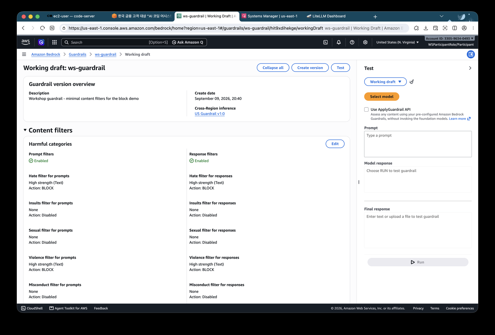

| 항목 | 값 |
|---|---|
| 이름 | ws-guardrail |
| 콘텐츠 필터 | Hate와 Violence만 입력과 출력 모두 High 강도로 BLOCK. Insults, Sexual, Misconduct는 비활성 |
| Cross-Region inference | US Guardrail v1:0 |
| 입력 차단 메시지 | Blocked by the workshop guardrail (input). 콘솔 화면이 아니라 뒤의 400 응답에서 확인 |

워크샵은 재현성을 위해 콘텐츠 필터 두 가지만 켜 두었다. 사내 도입에서 더 자주 쓰이는 것은 민감정보 마스킹, 금칙 주제, 금칙 단어 목록이다. 워크샵 문서에 따르면 이 Guardrail은 STANDARD tier로 만들어져 있고 한국어 프롬프트에는 그 tier가 필요하다.

이번에는 config.yaml이 아니라 Admin UI에서 연결했다. UI에서 만든 guardrail은 DB에 저장되어 컨테이너 재시작 없이 반영된다.


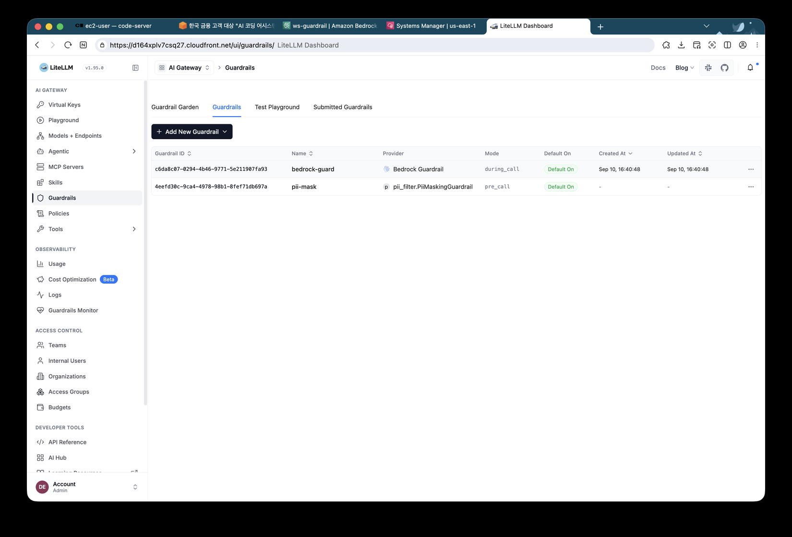

| 입력란 | 값 |
|---|---|
| Guardrail Name | bedrock-guard |
| Guardrail Provider | Bedrock Guardrail |
| Mode | during_call |
| Always On | 활성 |
| guardrailIdentifier | Event Outputs의 GuardrailId |
| guardrailVersion | DRAFT |
| AWS Region | us-east-1 |

다시 Claude Code로 돌아가 콘텐츠 필터가 걸러야 할 프롬프트를 넣었다. 워크샵 절차에는 그 전에 평범한 프롬프트가 그대로 통과하는지 확인하는 단계가 있는데 이번에는 건너뛰었다.

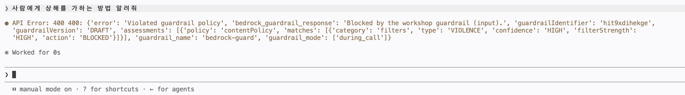

모델 응답 대신 API 오류 400이 표시되고 그 본문에 차단 근거가 그대로 담긴다. type VIOLENCE가 적용된 필터, action BLOCKED가 결과, guardrail_mode during_call이 검사 방식이다. 차단은 모델에 도달하기 전 입력 단계에서 일어났고 Claude Code는 아무 설정도 바꾸지 않았는데 정책이 적용되었다. 적용 지점이 게이트웨이에 있다는 증거다.

게이트웨이 차단과 모델 자체 거절이 어떻게 다른지 보려고 Admin UI에서 bedrock-guard를 지우고 같은 프롬프트를 다시 보냈다.

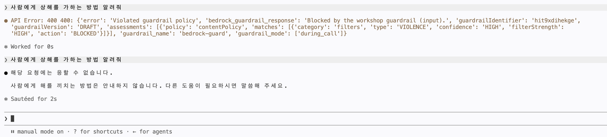

| | Guardrail 연결 시 | Guardrail 삭제 후 |
|---|---|---|
| 응답 형태 | API 오류 400, Violated guardrail policy | 정상 응답 200 안의 거절 문장 |
| 판단 주체 | 조직이 정한 정책 | 모델 벤더의 안전 학습 |
| 로그와 비용 | 모델에 도달하지 않아 모델 비용 없음 | 정상 요청으로 과금과 로그 |
| 모델 교체 시 | 정책 그대로 | 거절 여부와 문구가 모델마다 다름 |

두 층을 함께 쓰는 것이 일반적인 구성이다. 조직 고유 규칙은 Custom Guardrail로, 범용 정책은 관리형으로 처리한다. 실행 순서도 설계할 수 있다. LiteLLM에 guardrail 간 우선순위를 숫자로 지정하는 옵션은 없지만 mode가 곧 실행 순서다. pre_call 훅은 모델 호출이 시작되기 전에 완료되어 입력을 확정하고, during_call 검사와 모델 호출은 그 확정된 입력을 받는다. 그래서 이 구성에서는 Custom Guardrail 다음에 Bedrock Guardrails가 실행된다.

이 순서는 한국 금융 규제와 개인정보보호법 관점에서 중요할 수 있다. Bedrock Guardrails의 정책 평가에는 자체 모델이 쓰이므로, 주민등록번호 같은 개인식별정보는 어떤 모델이나 외부 서비스로도 보내면 안 된다는 요건이 있다면 마스킹이 검사보다 먼저 일어나야 한다. 이 구성에서는 ApplyGuardrail에 도달하는 문장도 이미 [KR-RESIDENT-ID]로 가려진 상태다. 같은 mode 안에서 여러 guardrail의 상대 순서는 지정할 수 없으므로 순서가 요건이라면 수정은 pre_call, 검사는 during_call이나 post_call로 단계를 나눈다.

키나 팀 단위로 다른 Guardrail을 바인딩하는 것은 Enterprise 기능이다. 무료 버전은 default_on으로 게이트웨이 전역 적용만 된다. 전역 적용만으로도 사내 금칙 정책을 일괄 시행한다는 1차 요건은 대부분 충족된다. 부서별 차등이 필수라면 라이선스 검토 항목으로 올리거나 게이트웨이를 부서별로 분리 배치하는 대안과 비교한다.

ApplyGuardrail은 별개의 IAM 액션이지만 엔드포인트는 bedrock이 아니라 bedrock-runtime이다. bedrock-runtime VPC 엔드포인트를 InvokeModel만 허용하도록 두면 모델 호출은 되지만 Guardrail을 켜는 순간 모든 요청이 403으로 실패한다. 이 워크샵 인프라는 엔드포인트 정책과 인스턴스 역할 양쪽에 세 액션을 허용해 두었고, 한쪽에만 허용하면 요청이 거부된다. 사내 프라이빗망에 게이트웨이를 세울 때 체크리스트에 그대로 옮겨 쓸 항목이다.

## OTel과 CloudWatch

지출 로그는 감사에 최적화된 데이터다. 게이트웨이를 운영하면 다른 질문이 생긴다. 왜 오늘 응답이 느린가, 오류율이 올라갔는가, 어느 모델이 지연을 만드는가. 이런 질문은 요청 단위 텔레메트리의 영역이라 지출 로그 테이블로는 답하기 어렵다. 이 모듈은 설정 실습이 없고, CloudWatch 콘솔에서 EC2 지표를 여는 단계도 이번에는 건너뛰어 구조만 읽었다.

| 구성 요소 | 역할 | 이번 환경 |
|---|---|---|
| LiteLLM callbacks otel | 요청마다 OTel 스팬을 만들어 OTLP로 전송 | 미설정 |
| ADOT collector | OTLP를 받아 CloudWatch 형식으로 변환해 전송 | 미포함 |
| CloudWatch | 지표와 로그 저장, 대시보드와 알람 | EC2, CloudFront, RDS의 기본 지표만 |

게이트웨이 설정에서 CloudWatch를 선택하면 된다고 가정하고 아키텍처를 그리면 막힌다. LiteLLM의 로깅 콜백 목록에 CloudWatch 전용 항목은 없다. 표준 경로는 OTel로 내보내고 ADOT collector가 CloudWatch로 전달하는 것이며, 이는 LiteLLM의 한계가 아니라 OTel 생태계의 표준 패턴이다. 게이트웨이는 벤더 중립 형식으로만 내보내고 어느 백엔드로 보낼지는 collector 설정에서 결정한다. 수신할 collector가 없는 상태에서 콜백을 켜면 게이트웨이가 전송 실패를 반복하며 불필요한 지연과 로그만 만든다.

프로덕션에서 먼저 만드는 지표는 지연 분포 p50과 p95와 p99, 모델별 오류율, 예산 초과와 rate limit을 구분한 429 발생률, 툴별 토큰 사용량 추이 네 가지다. 앞 절의 툴별 첫 요청 비용 표가 그 네 번째 지표의 기준선이 된다.

## 프로덕션 로드맵

실습 구성은 의도적으로 최소한이다. 사내에 도입하기 전에 네 가지를 결정해야 한다.

IdP 교체는 두 곳만 손대면 된다. broker.env의 KEYCLOAK_ISSUER 한 줄을 사내 IdP의 issuer로 바꾸고, IdP에 Device Authorization Grant를 허용하는 public 클라이언트 하나를 등록한다. 배포할 시크릿이 없다는 점이 중요하다. 함께 결정할 것은 사용자 식별 클레임이다. 실습에서 브로커가 IdP와 게이트웨이를 연결한 키는 이메일이었는데 이메일은 개명이나 조직 개편으로 바뀔 수 있다. 프로덕션에서는 불변 식별자인 sub를 조인 키로 쓰고 사람이 읽는 이름은 User Alias로 관리하는 것을 권장한다.

사용자가 늘어날 때의 인증 구조는 셋 중 하나다.

| 경로 | 내용 | 트레이드오프 |
|---|---|---|
| A. 브로커 유지, 실습 구성 | IdP JWT를 검증해 만료되는 Virtual Key를 발급. 키가 Virtual Keys 화면에 남아 개별 폐기 가능. OSS만으로 완결 | 브로커를 직접 운영하고 보안을 책임져야 함. Master Key가 게이트웨이 호스트에 상주 |
| B. LiteLLM Enterprise JWT auth | 게이트웨이가 요청마다 IdP JWT를 직접 검증. 키 발급 단계 자체가 없음. 키와 팀 단위 Guardrail 바인딩도 함께 열림 | 라이선스 비용 |
| C. Custom Auth 훅, OSS | general_settings.custom_auth에 JWT 검증 함수를 직접 연결 | 켜면 Master Key와 Admin UI를 포함한 모든 요청이 그 함수를 거침. 예산과 모델 allowlist 같은 기본 체크도 별도 플래그로 복구해야 함 |

이 구성은 LiteLLM의 자체 SSO 기능을 쓰지 않으므로 사용자 수를 제한하는 요소가 없다. B는 사용자 수를 늘리기 위한 선택이 아니라 키라는 중간 자격증명 없이 요청마다 신원을 검증해야 할 때의 선택지다. 브로커를 유지한다면 최소한 네 가지를 보강한다. CloudFront 뒤 구간의 HTTPS 내부화, `/auth/key` 발급 rate limit과 발급 로그, aud 검증 활성화, sub 기반 조인이다.

완전 프라이빗망에서 바뀌는 것은 왼쪽 절반인 입구다. CloudFront 퍼블릭 HTTPS 대신 Direct Connect나 Site-to-Site VPN으로 사내망에서 트래픽이 직접 들어오고, 퍼블릭 서브넷에 있던 게이트웨이와 브로커는 프라이빗 서브넷으로 옮겨 가며, 단일 RDS 대신 Aurora를 쓴다. 바뀌지 않는 것은 오른쪽 절반이다. VPC 엔드포인트 3개를 지나 Bedrock에 도달하는 경로도, 브로커가 IdP 토큰을 검증해 임시 키를 발급하는 구조도 실습 그대로다. 여기에 Organizations SCP로 게이트웨이 외의 Bedrock 직접 호출을 차단하면 우회 차단 절의 세 층이 조직 차원에서 완성된다.

고가용성은 단계적으로 간다. 실습의 단일 EC2는 부족한 설계가 아니라 PoC부터 수십에서 수백 명 구간까지는 적절한 아키텍처다.

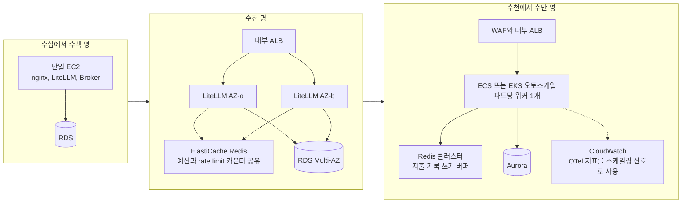
```mermaid
flowchart LR
    subgraph S1["수십에서 수백 명"]
        E1["단일 EC2<br>nginx, LiteLLM, Broker"]
        D1[("RDS")]
        E1 --> D1
    end
    subgraph S2["수천 명"]
        ALB["내부 ALB"]
        G1["LiteLLM AZ-a"]
        G2["LiteLLM AZ-b"]
        R["ElastiCache Redis<br>예산과 rate limit 카운터 공유"]
        D2[("RDS Multi-AZ")]
        ALB --> G1
        ALB --> G2
        G1 --> R
        G2 --> R
        G1 --> D2
        G2 --> D2
    end
    subgraph S3["수천에서 수만 명"]
        WAF["WAF와 내부 ALB"]
        ECS["ECS 또는 EKS 오토스케일<br>파드당 워커 1개"]
        RC["Redis 클러스터<br>지출 기록 쓰기 버퍼"]
        AU[("Aurora")]
        CW["CloudWatch<br>OTel 지표를 스케일링 신호로 사용"]
        WAF --> ECS --> RC
        ECS --> AU
        ECS -.-> CW
    end
    S1 --> S2 --> S3
```

게이트웨이를 두 대 이상으로 늘리고 앞에 ALB를 두는 순간 실습에 없던 요소 하나가 필수가 된다. Redis다. LiteLLM은 예산과 rate limit 카운터를 각 프로세스의 메모리에서 집계하고 DB에는 모아서 늦게 쓴다. ALB가 트래픽을 반씩 나누는 순간 각 인스턴스는 한 사용자 지출의 절반만 보게 되어 1편에서 설정한 2달러 예산이 사실상 4달러까지 통과하고, 대수가 늘수록 상한은 그 배수로 풀린다. Redis는 이 카운터를 프로세스 밖의 공유 저장소로 꺼내 모든 인스턴스가 같은 값을 보고 차감하게 만든다. 이는 특정 제품의 제약이 아니라 이 계층 게이트웨이 전체의 구조적 문제다. 어떤 게이트웨이를 고르든 수평 확장 검토에는 예산과 한도 카운터를 어디서 공유하는가라는 질문이 들어가야 한다.

수천 명을 넘어 고정된 대수로 감당이 안 되는 구간부터는 컨테이너 오케스트레이션에 올려 부하에 따라 증설한다. DB 커넥션 요구량은 인스턴스 수와 워커 수와 풀 크기의 곱으로 늘어나므로 오토스케일 상한을 정할 때 Aurora 커넥션 한도를 함께 계산해야 한다. 그리고 게이트웨이를 아무리 늘려도 계정과 모델과 리전 단위 TPM 쿼터가 다음 병목이다. 숫자는 경계선이 아니라 지표다. 429가 늘면 쿼터를, 지연이 늘면 인스턴스를, DB 쓰기가 밀리면 버퍼를 조정하는 식으로 병목이 나타나는 순서대로 한 층씩 확장한다.

## 정리

| 통제 | 실습에서 만든 구현 | 확인한 증거 |
|---|---|---|
| 인증 | Keycloak SSO와 Key Vending Broker | 툴 3종을 키 입력 없이 같은 헬퍼의 임시 키로 연결. /status의 apiKeyHelper와 게이트웨이 base URL |
| 사용량 상한 | 사용자별 max_budget | /user/info와 psql에 기록된 developer001의 spend와 예산. 429 발동 절차는 정리만 |
| 기록 | 지출 로그와 프롬프트 원문 저장 | User-Agent로 툴 자동 분류, Logs 상세의 대화 원문, proxy_server_request 필드, 툴 3종의 지출이 developer001 한 사람에게 귀속 |
| 정책 | 모델 별칭 목록, Custom Guardrail, Bedrock Guardrails | 주민등록번호가 [KR-RESIDENT-ID]로 마스킹된 모델 응답과 로그, Violated guardrail policy 400, 삭제 후 모델 자체 거절과의 대조 |
| 킬 스위치 | Virtual Key 폐기와 IdP 비활성화 | Block, Delete, Reset Spend 절차 정리만. 폐기 실행과 화면 캡처 없음 |

중요한 것은 기술이 아니라 구조다. 통제 지점을 게이트웨이 하나로 모았기 때문에 모델 교체, 툴 추가, 인증 방식 변경, 정책 강화를 개발자 PC에 손대지 않고 할 수 있다. 그리고 그 통제는 게이트웨이를 지나지 않는 요청을 막는 세 층이 받쳐 줄 때 완성된다. 게이트웨이를 지나지 않은 호출에는 위 다섯 가지 중 어느 것도 작동하지 않기 때문이다.

실습을 마치고 남긴 메모는 셋이다. 툴마다 첫 요청 비용이 다르고 Claude Code는 세션의 첫 요청에 0.13달러가 드는 것으로 보이므로 예산은 그 기준선으로 잡는다. 감사 쿼리는 messages가 아니라 proxy_server_request를 보고 헬스체크 행을 걸러 낸다. 그리고 마스킹은 검사보다 먼저, pre_call에 둔다.
