# 금융망에서 AI 사용하기(Keycloak SSO+LiteLLM)

운영자 관점에서 알아보기

<!-- more -->

## 이 글에서 만드는 것

2026년 9월 10일 AWS Workshop Studio에서 진행된 한국 금융 고객 대상 "AI 코딩 어시스턴트 툴(Claude Code, Codex) 제공을 위한 LLM Gateway 구축 워크숍"을 직접 따라 하며 실습한 기록이다. 개발자가 쓰는 Claude Code, Codex, OpenCode를 그대로 두고, 모든 모델 호출이 반드시 지나는 단일 진입점을 세운 뒤 그 위에 인증, 예산, 로깅, 정책을 얹는 것이 워크샵의 목표였다.

두 편으로 나눠 정리한다. 이 글은 운영자가 하는 일을 다룬다. 배정된 VPC의 경로를 확인하고, LiteLLM 컨테이너를 올리고, 모델과 사용자를 등록하고, Keycloak 앞에 Key Vending Broker를 세워 SSO 로그인만으로 4시간짜리 임시 키를 받는 데까지 간다. 2편에서는 개발자 역할로 툴 3종을 연결하고 감사 로그와 Guardrails를 확인한다.

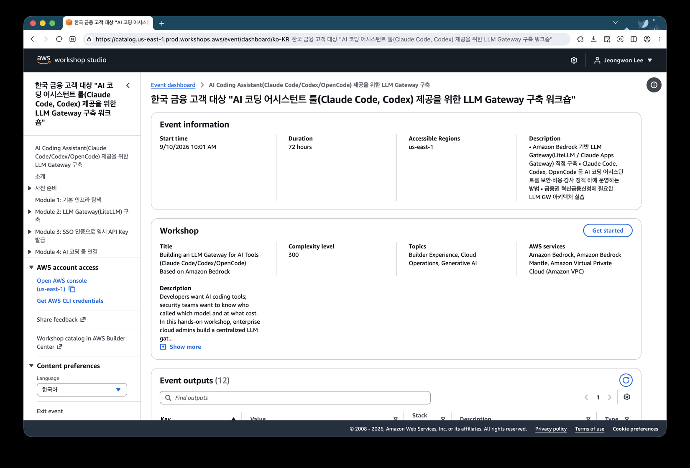

| 항목 | 내용 |
|---|---|
| 리전 | us-east-1 단일 |
| 게이트웨이 | LiteLLM Proxy v1.95.0, 무료 버전 |
| IdP | Keycloak, 사내 Active Directory나 Okta를 대신하는 역할 |
| 모델 경로 | Amazon Bedrock, VPC 인터페이스 엔드포인트 3개 |
| 사용 서비스 | Bedrock, EC2, RDS PostgreSQL, CloudFront, PrivateLink, IAM, Secrets Manager, CloudTrail |
| 참가자 역할 | LLM Gateway 운영자. 개발자 페르소나 developer001, developer002를 온보딩하는 쪽 |

AI Gateway 개념과 솔루션 비교는 [AI Gateway 정리](../Cloud%20Infra/ai_gateway.md)에, LiteLLM의 라우팅, 캐시, 관측은 [LiteLLM으로 AI Gateway 구축과 운영](../Cloud%20Infra/ai_gateway_litellm.md)에 정리해 두었다. 개발자에게 키를 주지 않는 Claude Code 전용 게이트웨이는 [Claude Apps Gateway 구축 정리](../Cloud%20Infra/claude_apps_gateway.md)에서 다뤘다. 이번 글은 그 셋과 겹치지 않는 부분, 즉 Bedrock PrivateLink 경로, 여러 툴의 API 포맷을 한 게이트웨이로 받는 구성, 그리고 SSO 임시 키 발급에 집중한다.

## 통제 다섯 가지와 담당 층

어떤 LLM Gateway 제품을 고르든 개발자 AI 툴을 안전하게 열어 주려면 다섯 가지가 필요하다. 워크샵은 이 다섯 가지를 어디에 배치할지 정하는 것이 곧 게이트웨이 구축이라고 정의한다.

| 통제 | 답하는 질문 | 이 실습에서 놓인 곳 | 편 |
|---|---|---|---|
| 인증 | 호출자가 누구인가 | Keycloak SSO와 Key Vending Broker가 발급한 임시 Virtual Key | 1편 |
| 사용량 상한 | 한 사람이 얼마까지 쓸 수 있는가 | LiteLLM 사용자별 max_budget | 1편 설정, 2편 발동 절차 정리 |
| 기록 | 무엇을 물었고 얼마를 썼는가 | LiteLLM 지출 로그와 프롬프트 원문 저장 | 2편 |
| 정책 | 어떤 모델과 어떤 내용을 허용하는가 | 등록 모델 목록, Custom Guardrail, Bedrock Guardrails | 1편 모델, 2편 Guardrails |
| 킬 스위치 | 사고 시 어떻게 끊는가 | Virtual Key 즉시 폐기, IdP 계정 비활성화 | 2편 |

실습 내내 두 역할을 오간다. 역할마다 작업 위치와 자격증명이 다르다.

| 역할 | 작업 위치 | 자격증명 |
|---|---|---|
| 운영자 | AWS 콘솔, 게이트웨이 EC2의 Session Manager 세션, Admin UI | Master Key. 모든 관리 API를 호출할 수 있는 최상위 키이자 Admin UI 비밀번호 |
| 개발자 developer001 | 브라우저 IDE인 code-server의 터미널 | SSO 로그인 후 브로커가 발급한 4시간 만료 Virtual Key |

Master Key는 개발자에게 절대 배포하지 않는다. 이 글의 마지막 절에서 Master Key 없이 첫 모델 호출이 성공하는 것을 확인하는 이유가 여기에 있다.

## 실습 환경

계정마다 아래 구성이 CloudFormation으로 미리 배포되어 있었다. 브라우저에서 접근하는 EC2 세 대는 CloudFront 뒤의 퍼블릭 서브넷에 있고, 모델 호출과 데이터베이스 트래픽은 프라이빗 서브넷 안에서만 오간다.

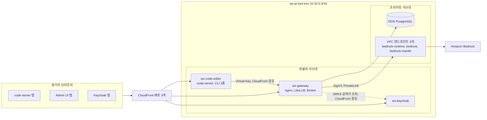
```mermaid
flowchart LR
    subgraph PC["참가자 브라우저"]
        B1["code-server 탭"]
        B2["Admin UI 탭"]
        B3["Keycloak 탭"]
    end
    CF["CloudFront 배포 3개"]
    subgraph VPC["ws-ai-tool-env 10.42.0.0/16"]
        subgraph PUB["퍼블릭 서브넷"]
            CE["ws-code-editor<br>code-server, CLI 3종"]
            GW["ws-gateway<br>nginx, LiteLLM, Broker"]
            KC["ws-keycloak"]
        end
        subgraph PRV["프라이빗 서브넷"]
            DB[("RDS PostgreSQL")]
            EP["VPC 엔드포인트 3개<br>bedrock-runtime, bedrock, bedrock-mantle"]
        end
    end
    BR["Amazon Bedrock"]
    PC --> CF
    CF --> CE
    CF --> GW
    CF --> KC
    CE -->|"Virtual Key, CloudFront 경유"| GW
    GW --> DB
    GW -->|"SigV4, PrivateLink"| EP
    EP --> BR
    GW -.->|"JWKS 공개키 조회, CloudFront 경유"| KC
```

| 트래픽 | 경로 | 이유 |
|---|---|---|
| 게이트웨이에서 Bedrock으로 가는 모델 호출 | 프라이빗 서브넷의 VPC 인터페이스 엔드포인트 3개 | 프롬프트와 소스 코드가 실제로 흐르는 구간. Claude, Qwen, GPT 모두 인터넷을 타지 않는다 |
| 브라우저에서 code-server, Keycloak, LiteLLM 접속 | CloudFront 경유 퍼블릭 HTTPS. EC2 인바운드는 CloudFront prefix list의 80 포트뿐이고 셸 접근은 인바운드 없이 Session Manager로 한다 | 참가자가 노트북에서 접속해야 하고 SSO 로그인이 브라우저를 거쳐 오간다 |
| 게이트웨이에서 RDS로 가는 트래픽 | 프라이빗 서브넷 내부 | 프라이빗 라우팅 테이블에는 로컬 라우트만 있고 IGW와 NAT가 없다 |

퍼블릭 구간은 워크샵 편의를 위한 것이다. 프로덕션에서는 Direct Connect나 Site-to-Site VPN으로 사내망에서 직접 진입하는 구성을 권장한다. 그 그림은 2편 끝에서 다룬다.

## 네트워크 경로 확인

Module 1은 새로 만드는 것 없이 배포된 구성을 콘솔에서 읽는 단계다. 핵심은 VPC 엔드포인트 3개와 각각의 정책이다.

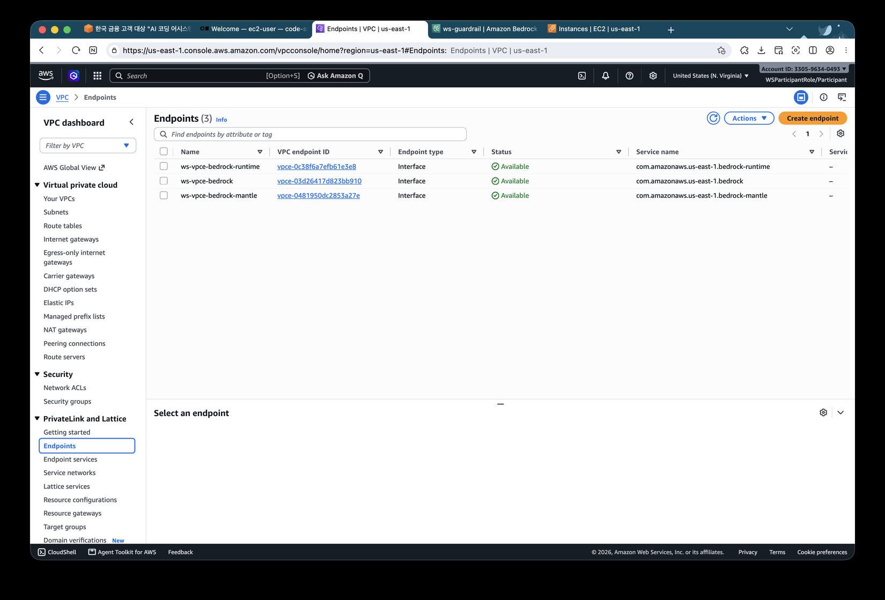

| 엔드포인트 | 서비스 이름 | ENI 서브넷 | 허용 액션 | 역할 |
|---|---|---|---|---|
| ws-vpce-bedrock-runtime | com.amazonaws.us-east-1.bedrock-runtime | ws-private-1, ws-private-2 | InvokeModel, InvokeModelWithResponseStream, ApplyGuardrail | 추론과 Guardrail 검사. 데이터 플레인 |
| ws-vpce-bedrock | com.amazonaws.us-east-1.bedrock | ws-private-1, ws-private-2 | GetInferenceProfile, ListInferenceProfiles, ListFoundationModels, GetGuardrail, ListGuardrails | 조회 전용. 컨트롤 플레인 |
| ws-vpce-bedrock-mantle | com.amazonaws.us-east-1.bedrock-mantle | ws-private-mantle | bedrock-mantle:CreateInference, CallWithBearerToken, Get*, List* | OpenAI Responses 포맷을 그대로 통과시키는 경로 |

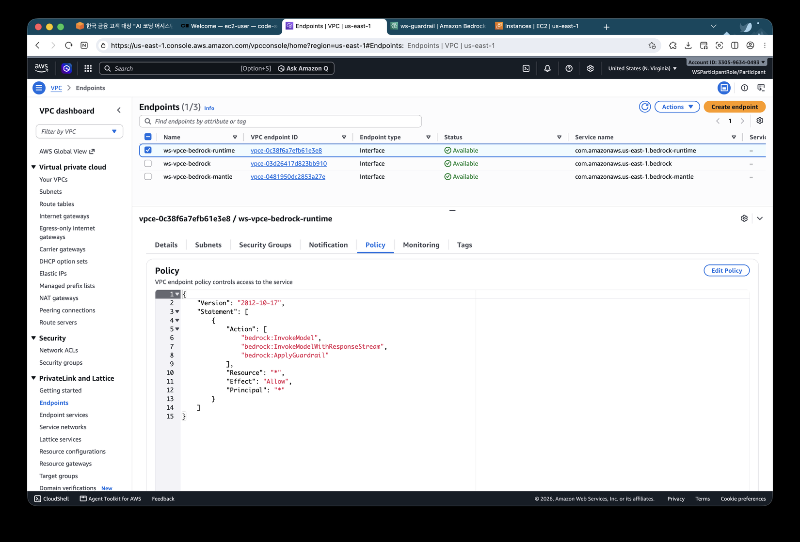

bedrock-runtime 정책의 Principal이 `*`인데도 안전한 이유는 호출자에게 IAM 권한이 없으면 어차피 거부되기 때문이다. 이 실습에서 호출 주체는 게이트웨이 EC2에 연결된 인스턴스 역할 하나뿐이다. Bedrock 접근 제어는 세 층으로 겹쳐 있고, 어느 층이 어떤 우회를 막는지는 2편에서 다룬다.

| 층 | 정하는 것 | 이 실습의 구현 |
|---|---|---|
| IAM | 누가 호출할 수 있는가 | 게이트웨이 EC2의 인스턴스 역할 |
| VPC 엔드포인트 정책 | 어떤 경로로 무엇을 할 수 있는가 | 위 표의 정책 3개 |
| LLM Gateway 설정 | 어떤 모델을 쓸 수 있는가 | 다음 절에서 등록하는 모델 목록 |

게이트웨이 EC2는 퍼블릭 서브넷에 있는데 어떻게 모델 호출이 프라이빗 엔드포인트를 지나는지 직접 확인했다. 엔드포인트의 Private DNS가 VPC 전체에 적용되기 때문인데, 같은 호스트 이름을 내 노트북에서 한 번, 같은 VPC 안의 code-server EC2에서 한 번 풀어 보면 답이 다르다.

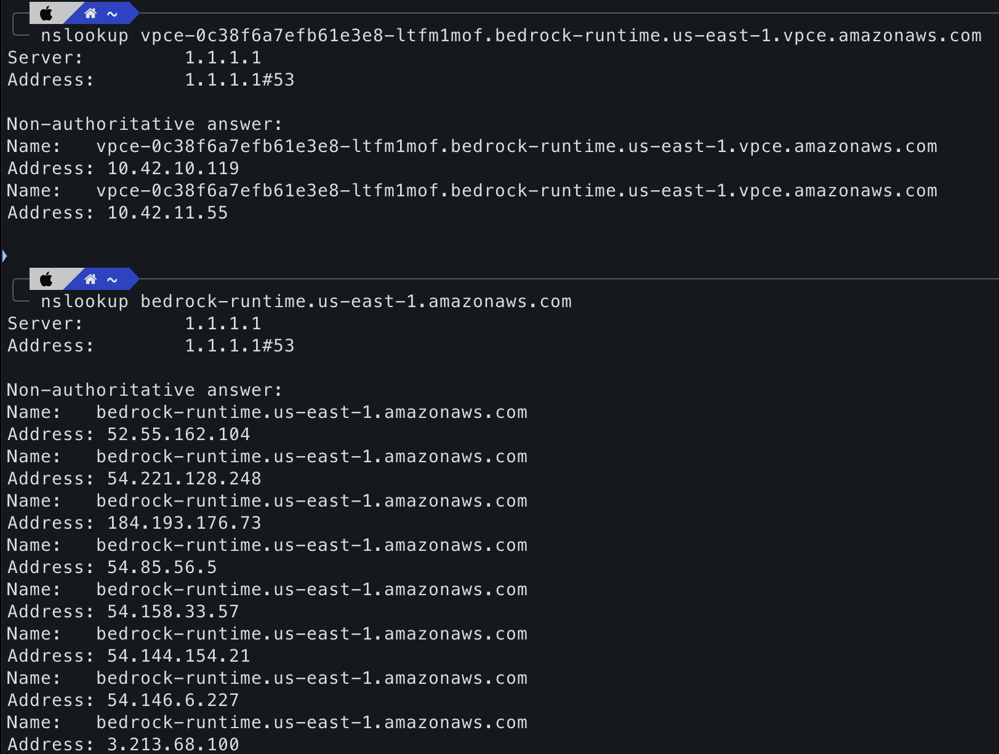

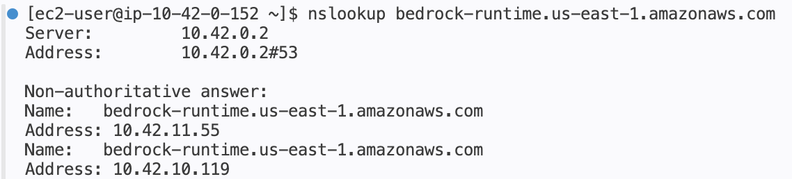

| 질의 위치 | 호스트 이름 | 응답 |
|---|---|---|
| 노트북, 1.1.1.1 | 엔드포인트 전용 이름 vpce-...bedrock-runtime.us-east-1.vpce.amazonaws.com | 10.42.10.119, 10.42.11.55 |
| 노트북, 1.1.1.1 | bedrock-runtime.us-east-1.amazonaws.com | 공인 IP 8개 |
| code-server EC2 안, 10.42.0.2 | bedrock-runtime.us-east-1.amazonaws.com | 10.42.11.55, 10.42.10.119 |

VPC 안에서는 퍼블릭 호스트 이름이 프라이빗 서브넷의 ENI 주소로 풀린다. 게이트웨이 코드는 평범한 Bedrock 엔드포인트를 부르지만 패킷은 인터넷으로 나가지 않는다.

## LiteLLM 기동

인프라는 서버까지만 준비되어 있었다. Docker와 nginx는 구성이 끝났고 LiteLLM 이미지도 내려받아 두었지만 컨테이너는 시작하지 않은 상태였다. SSH 키와 22번 포트 인바운드가 없으므로 셸 접근은 Session Manager로만 한다. 세션은 ssm-user로 시작하므로 `sudo su - ec2-user`로 전환한 뒤 진행한다.

| 파일 | 역할 | 다루는 절 |
|---|---|---|
| docker-compose.yml | LiteLLM 컨테이너 정의 | 이 절 |
| config.yaml | 프록시 기본 설정. Master Key 참조와 예산 기본값. 모델 정의는 없고 Admin UI로 등록한다 | 다음 절 |
| .env | DATABASE_URL, LITELLM_MASTER_KEY, LITELLM_SALT_KEY 등 비밀값. 권한 600 | 이 절 |
| pii_filter.py | 한국형 PII를 마스킹하는 Custom Guardrail. 마운트만 되어 있고 2편에서 켠다 | 2편 |
| broker/ | Key Vending Broker 소스와 compose | 이 글 뒤쪽 |

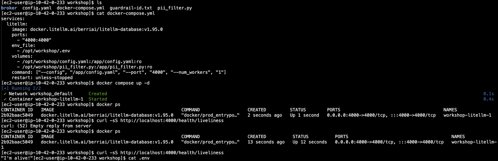

| compose 항목 | 값 | 의미 |
|---|---|---|
| image | docker.litellm.ai/berriai/litellm-database:v1.95.0 | latest가 아니라 특정 버전으로 고정 |
| ports | 4000:4000 | nginx가 프록시하는 포트 |
| env_file | /opt/workshop/.env | 비밀값은 compose 파일이 아니라 권한 600 파일에서 주입. 값은 부트스트랩이 Secrets Manager에서 읽어 왔다 |
| volumes | config.yaml, pii_filter.py를 읽기 전용 마운트 | 호스트에서 고쳐도 컨테이너를 다시 만들어야 반영된다 |
| command | --num_workers 1 | 워크샵용 단일 워커. 프로덕션 HA는 2편 로드맵 |

워크샵은 첫 시작에 약 45초가 걸린다고 안내한다. litellm-database 이미지가 RDS에 테이블을 만들기 위해 Prisma 마이그레이션 141개를 실행하기 때문이다. 이 환경에서는 기동 직후 보낸 헬스체크가 빈 응답으로 실패했고, 십여 초 뒤 다시 보내자 `"I'm alive!"`가 왔다. 이 호출은 CloudFront와 nginx를 거치지 않고 localhost:4000으로 컨테이너에 직접 가는 경로라, 이후 문제가 생겼을 때 컨테이너 문제인지 경로 문제인지 가르는 기준이 된다.

nginx 설정도 읽어 두었다. 게이트웨이 도메인 하나로 LiteLLM과 브로커를 함께 서비스하는 구조가 여기서 정해진다.

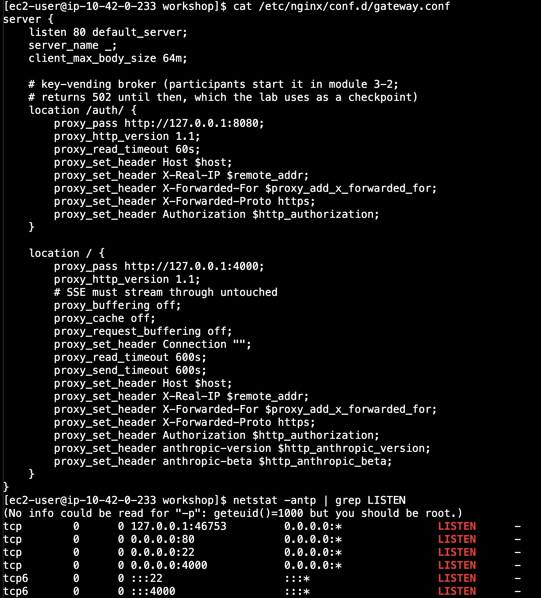

| 설정 | 의미 |
|---|---|
| `location /auth/`를 127.0.0.1:8080으로 프록시 | Key Vending Broker. 브로커를 시작하기 전까지는 502가 나고 워크샵은 이 502를 체크포인트로 쓴다 |
| `location /`을 127.0.0.1:4000으로 프록시 | LiteLLM |
| `proxy_buffering off` | SSE 스트리밍이 버퍼링 없이 통과해야 CLI 툴의 응답이 멈춘 것처럼 보이지 않는다 |
| `proxy_read_timeout 600s` | 긴 툴 호출 대기 |
| anthropic-version, anthropic-beta 헤더 전달 | Claude Code가 보내는 헤더를 그대로 넘긴다 |

브라우저에서 게이트웨이 도메인의 루트를 열면 LiteLLM API 문서가, `/ui`를 열면 Admin UI 로그인 화면이 나온다.

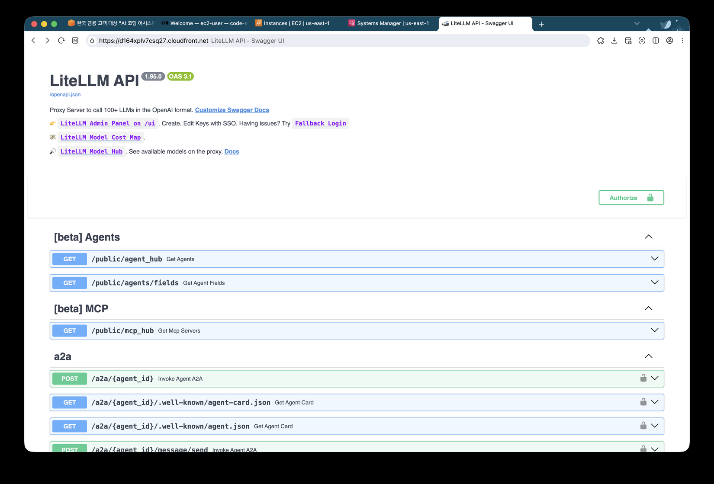

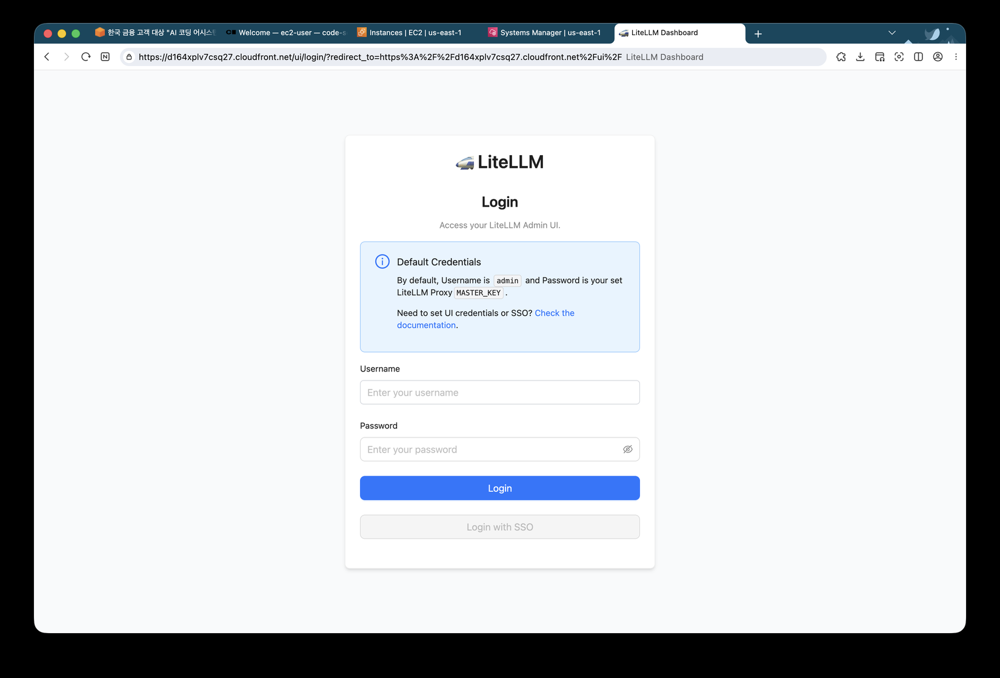

Admin UI의 Username은 admin, Password는 Master Key다. Master Key는 `.env`에서 꺼내 셸 변수에 담아 두고 curl 검증과 로그인에 같이 쓴다.

```bash
export GATEWAY_URL="https://d164xplv7csq27.cloudfront.net"
export MK=$(grep '^LITELLM_MASTER_KEY=' /opt/workshop/.env | cut -d= -f2)
```

.env에는 LITELLM_SALT_KEY도 있다. LiteLLM이 DB에 저장하는 모델 자격증명 같은 값을 암호화하는 키라서 한 번 데이터를 쓴 뒤 바꾸면 기존 값을 복호화할 수 없다. 프로덕션에서는 로테이션 대상에서 빼거나 재암호화 절차를 함께 설계해야 한다.

## 모델 등록과 API 포맷 3종 검증

게이트웨이의 통제는 모델 목록에서 시작한다. 등록되지 않은 모델은 호출할 수 없고, 등록된 이름에 어떤 실제 모델을 연결할지는 운영자가 정한다. 로그인 직후 Models + Endpoints는 비어 있고 `/v1/models` 응답도 빈 배열이다.

Add Model 폼에서 Provider를 Amazon Bedrock으로 두고 실제 대상과 공개 이름을 나눠 입력한다. 자격증명 필드 중 입력하는 것은 AWS Region Name뿐이다.

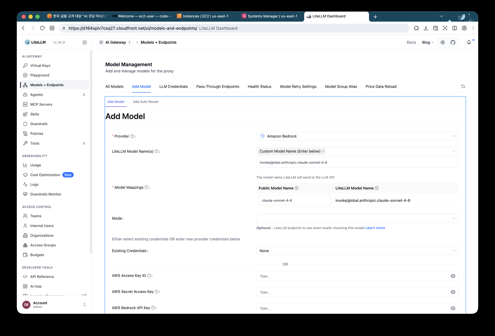

| 필드 | 값 | 의미 |
|---|---|---|
| Provider | Amazon Bedrock | |
| LiteLLM Model Name | invoke/global.anthropic.claude-sonnet-4-6 | 실제로 호출되는 대상 |
| Public Model Name | claude-sonnet-4-6 | 개발자가 부르는 이름 |
| AWS Region Name | us-east-1 | 자격증명 필드 중 유일하게 입력 |
| AWS Access Key, Secret Key | 비움 | 인스턴스 역할의 SigV4 서명으로 대체 |

부르는 이름과 실제 대상을 분리해 두면 나중에 Sonnet 4.6을 다른 모델로 바꿔도 개발자 설정은 그대로다. `invoke/` 접두어는 Bedrock의 InvokeModel 라우트를, `converse/`는 Converse 라우트를 뜻한다. `global.` 접두어는 Cross-Region Inference 프로파일이라 추론이 다른 리전에서 수행될 수 있다. 데이터 레지던시 요건이 있으면 등록 시점에 `us.`나 `apac.` 같은 범위를 확정해야 한다.

Test Connect를 누르면 등록 전에 이 설정으로 Bedrock까지 실제 호출이 한 번 나간다. 아래는 두 번째 모델을 등록할 때 잡은 성공 알림이다.

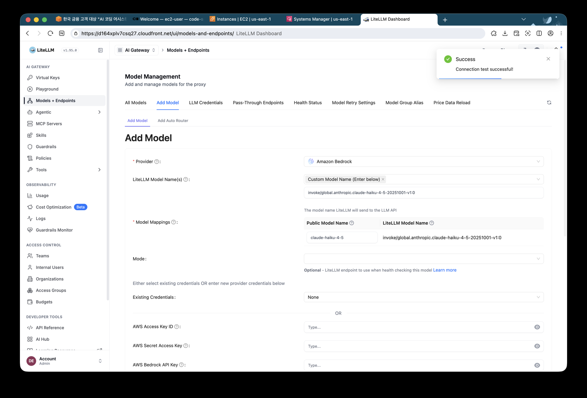

같은 절차로 모델 8개를 등록했다. 워크샵 기본은 7개이고, 선택 실습인 Mantle 경로의 gpt-oss-20b까지 더했다.

| Public Model Name | 실제 대상 | Provider | 용도 |
|---|---|---|---|
| claude-sonnet-4-6 | invoke/global.anthropic.claude-sonnet-4-6 | Amazon Bedrock | Claude Code 주력 |
| claude-haiku-4-5 | invoke/global.anthropic.claude-haiku-4-5-20251001-v1:0 | Amazon Bedrock | 경량 호출, OpenCode 기본 |
| gpt-oss-120b | converse/openai.gpt-oss-120b-1:0 | Amazon Bedrock | Codex |
| gpt-oss-20b | openai.gpt-oss-20b | Amazon Bedrock Mantle | Responses 포맷 통과 경로 확인 |
| qwen3-coder | converse/qwen.qwen3-coder-next | Amazon Bedrock | OpenCode 비교 모델 |
| claude-haiku-4-5-20251001 | invoke/global.anthropic.claude-haiku-4-5-20251001-v1:0 | Amazon Bedrock | 툴 내장 이름 별칭 |
| claude-sonnet-5 | invoke/global.anthropic.claude-sonnet-4-6 | Amazon Bedrock | 툴 내장 이름 별칭 |
| claude-opus-5 | invoke/global.anthropic.claude-sonnet-4-6 | Amazon Bedrock | 툴 내장 이름 별칭 |

마지막 세 개는 성격이 다르다. AI 코딩 툴은 사용자가 `/model haiku`처럼 별칭으로 모델을 바꿀 때나 툴이 표준 설정 없는 단말에서 실행될 때 개발자 설정에 보이지 않는 내장 기본 모델 이름을 그대로 호출한다. 그 이름이 게이트웨이에 없으면 툴 내부 요청이 404로 실패하고 사용자에게는 툴이 가끔 멈추는 것으로 보인다. 반대로 툴 기본값인 Opus 계열 이름을 그대로 열어 주면 예산이 빠르게 소진된다. 그래서 툴이 쓰는 이름을 별칭으로 받되 실제 대상은 운영자가 정한 Sonnet 4.6으로 묶는다.

이 워크샵 계정은 GPT-5.6 같은 독점 OpenAI 모델 접근이 활성화되어 있지 않아 오픈웨이트 gpt-oss 계열을 썼다. 실제 계정이라면 같은 절차에서 모델 값만 바꿔 GPT-5.6 계열을 등록하면 된다.


Mantle 경로에는 주의점이 하나 있다. 자격증명 우선순위는 모델의 API Key, 환경 변수 BEDROCK_MANTLE_API_KEY와 AWS_BEARER_TOKEN_BEDROCK, 그다음 SigV4 순이다. 그래서 bearer 값이 하나라도 남아 있으면 IAM 권한이 완벽해도 그 값이 우선되어 401이 난다. 권한은 있는데 인증이 실패하면 bearer 값부터 확인한다.

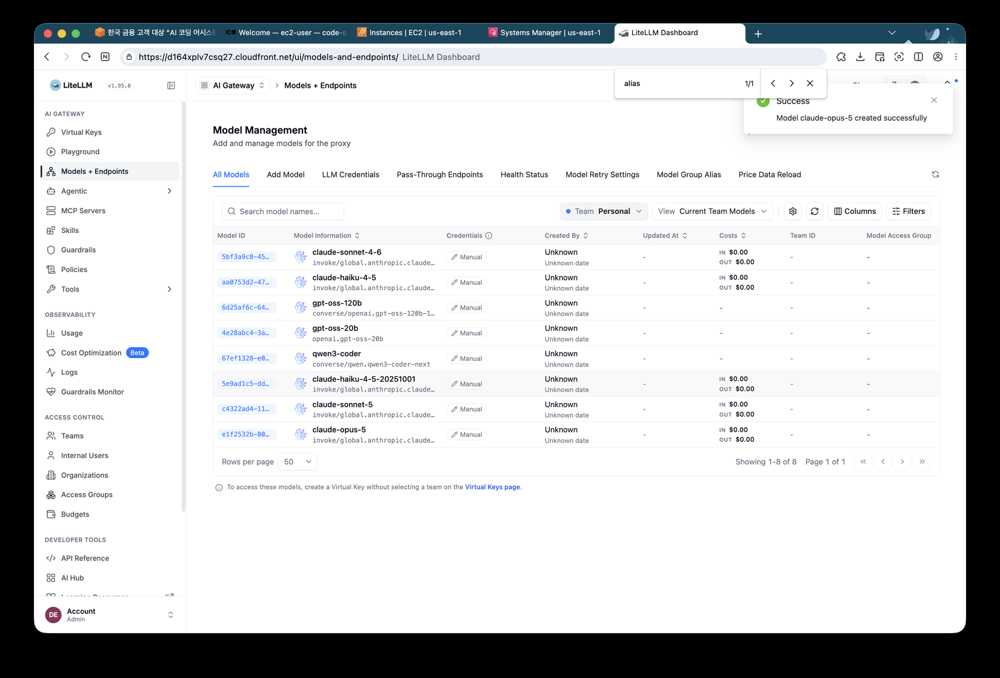

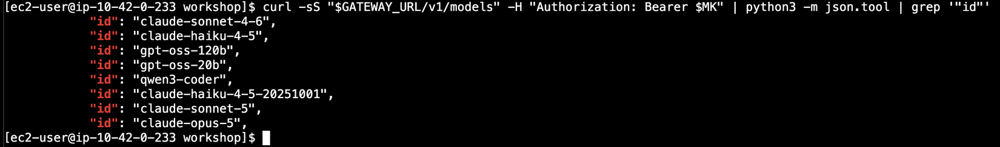

목록의 Costs 열을 보면 Claude 계열 다섯 개는 IN과 OUT 값이 채워져 있고 gpt-oss 두 개와 qwen은 비어 있다. 이는 등록할 때 단가를 직접 넣지 않았다는 표시일 뿐이다. 2편의 지출 로그를 보면 gpt-oss와 qwen 호출에도 비용이 계산되어 남는다.

세 툴이 쓰는 API 포맷이 다르므로 세 포맷 모두 게이트웨이를 통과하는지 curl로 검증한다. 검증은 게이트웨이 EC2의 SSM 세션에서 실행했고, 호출은 CloudFront, nginx, LiteLLM, VPC 엔드포인트를 거쳐 Bedrock까지 전 구간을 지난다.

| 포맷 | 엔드포인트 | 사용하는 툴 | 검증 모델 |
|---|---|---|---|
| Anthropic Messages | /v1/messages | Claude Code | claude-sonnet-4-6 |
| OpenAI Chat Completions | /v1/chat/completions | OpenCode | claude-haiku-4-5 |
| OpenAI Responses | /v1/responses | Codex | gpt-oss-120b |

첫 검증에서 curl이 두 번 연속 `URL rejected: No host part in the URL`로 실패했다. 셸 변수 GATEWAY_URL을 export하지 않은 채 명령을 붙여 넣은 것이 원인이었고, 변수를 넣자 바로 성공했다. Session Manager 세션은 유휴 60분이 지나면 끊기고 새 세션에서는 변수가 비어 있다. 이후 모듈에서도 같은 실수가 반복될 수 있는 지점이다.

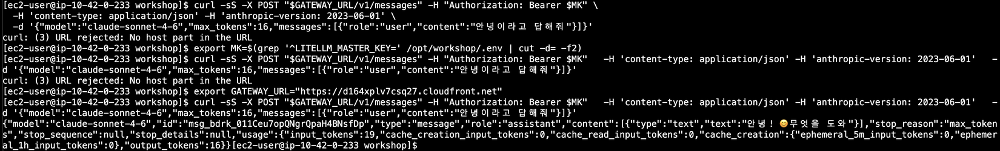

```bash
curl -sS -X POST "$GATEWAY_URL/v1/messages" -H "Authorization: Bearer $MK" \
  -H 'content-type: application/json' -H 'anthropic-version: 2023-06-01' \
  -d '{"model":"claude-sonnet-4-6","max_tokens":16,"messages":[{"role":"user","content":"안녕이라고 답해줘"}]}'
```

응답은 type이 message이고 한국어 본문과 usage가 담긴 JSON이다. UI에서 등록한 모델이 컨테이너 재시작 없이 바로 서빙된다.

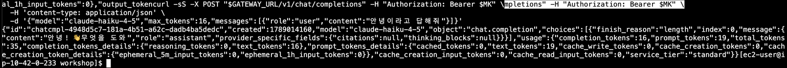

첫 줄은 터미널이 화면을 다시 그리면서 앞 응답의 꼬리와 명령이 겹쳐 보인다. 두 번째 검증에서 확인한 것은 Haiku 자체가 아니라 Claude 모델을 OpenAI 포맷으로 불러도 성공한다는 점이다. 포맷 변환은 게이트웨이가 담당하고 포맷은 모델에 묶여 있지 않다. 어떤 포맷을 쓸지는 클라이언트 툴이 정한다.

CLI 툴은 대부분 스트리밍으로 응답을 받는다. 경로 어딘가에서 버퍼링이 일어나면 응답은 정상인데 화면에서는 스피너가 멈춘 것처럼 보이므로 `stream: true`로 SSE가 순차적으로 도착하는지 따로 확인했다.

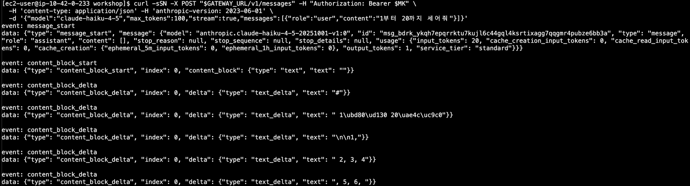

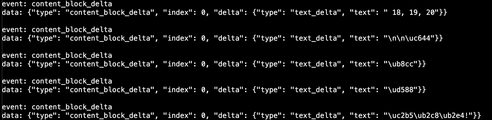

`message_start`, `content_block_start`, `content_block_delta`가 한 번에 몰리지 않고 순서대로 내려오고, 마지막 delta에 20까지 센 뒤 완료했다는 문장이 온다. curl 출력이라 한국어는 JSON 이스케이프로 보인다. 버퍼링 없는 스트리밍은 CloudFront의 캐시 비활성, nginx의 `proxy_buffering off`, LiteLLM 세 곳이 모두 맞아야 한다. 사내 도입 시 앞단에 ALB, WAF, 프록시를 추가할 때마다 다시 확인해야 한다.

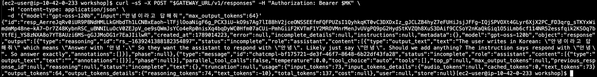

세 번째 검증에서 흥미로운 결과가 나왔다. gpt-oss-120b는 추론 모델이라 응답 앞에 reasoning 항목이 붙는데, `max_output_tokens`를 64로 준 요청에서 추론이 출력 한도를 다 써 버려 status가 incomplete로 끝나고 output_text가 비었다. usage에는 output_tokens 64, reasoning_tokens 74, text_tokens -10이라는 값이 찍혔다. 추론이 상한을 넘긴 만큼 텍스트 토큰이 음수로 계산된 것이다. 게이트웨이 경로는 정상이고 모델의 토큰 예산 문제다. Codex 같은 툴에 추론 모델을 붙일 때 출력 상한을 넉넉히 잡아야 하는 이유를 미리 본 셈이다.

등록한 모델 8개 중 API Key를 입력한 모델은 하나도 없다. Claude, GPT, Qwen은 물론 Mantle 경로까지 전부 EC2 인스턴스 역할의 SigV4 서명으로 호출되고, SDK가 인스턴스 메타데이터에서 자격증명을 얻어 자동으로 갱신한다. 설정 파일, UI, DB 어디에도 비밀값이 없으니 유출될 키 자체가 없고 만료, 재발급, 로테이션 업무도 없다. 인스턴스 역할에는 추론 계열 액션만 있고 관리 액션은 없어 모델을 늘려도 권한 범위가 넓어지지 않는다.

UI로 등록한 모델은 config.yaml이 아니라 RDS에 저장된다. `general_settings.store_model_in_db: true`가 켜져 있기 때문이다. 그래서 컨테이너를 다시 만들어도 모델 목록이 유지된다.

| | config.yaml | Admin UI |
|---|---|---|
| 변경 방법 | 파일 수정 후 컨테이너 재시작 | 화면에서 즉시 |
| 변경 이력 | Git으로 리뷰와 추적 | UI 감사 로그와 DB |
| 어울리는 것 | Master Key 참조, 예산 기본값 같은 불변 기반 설정 | 모델 목록처럼 운영 중 바뀌는 것 |

## 사용자와 예산

게이트웨이의 통제는 키 단위가 아니라 사용자 단위로 적용된다. Internal Users에서 개발자 계정 두 개를 초대하고 예산을 설정했다. 여기서 만든 developer001이 뒤에서 SSO 임시 키를 받는 사용자다.

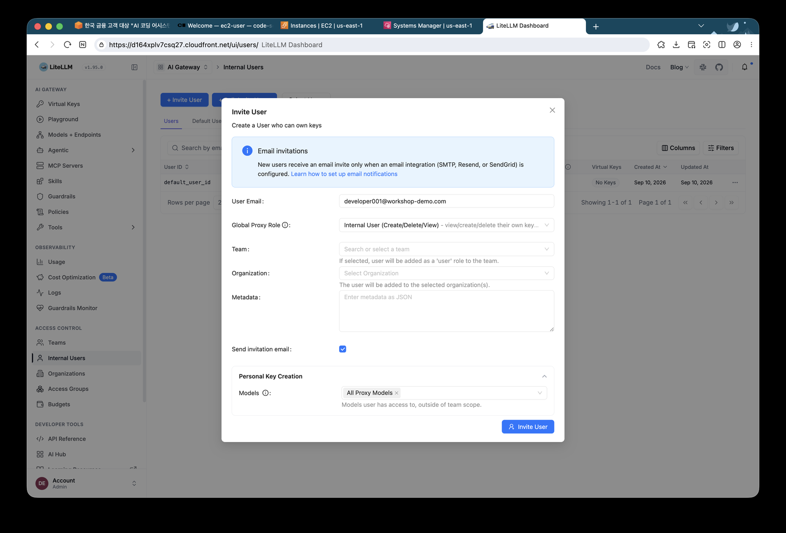

| 필드 | 값 | 비고 |
|---|---|---|
| User Email | developer001@workshop-demo.com | 브로커가 JWT의 이메일과 정확히 일치하는 사용자에게만 키를 발급한다. workshop.local 같은 special-use 도메인은 LiteLLM의 이메일 검증이 거부한다 |
| Global Proxy Role | Internal User (Create/Delete/View) | 기본값은 View Only라 드롭다운을 바꿔야 한다 |
| Team / Organization | 비움 | 팀을 지정하면 팀 예산이 우선해 개인 max_budget이 적용되지 않는다 |
| Personal Key Creation의 Models | All Proxy Models | 비우면 no-default-models 상태가 되어 모든 호출이 403으로 거부된다 |

초대하면 User ID가 UUID로 자동 생성되고, 이 UUID가 지출 기록의 귀속 주체가 된다. 초대 링크는 UI 비밀번호 온보딩용이라 SSO로 로그인하는 이 실습에서는 쓰지 않는다.

예산을 입력한 적이 없는데 목록에 5달러가 표시된다. config.yaml의 `default_internal_user_params`에 1일 5달러가 있어 새 사용자에게 자동 적용되기 때문이다. 개발자 온보딩 기본 한도를 설정 파일 한 곳에서 강제하는 패턴이다. 상세 화면에서 alias와 예산을 개인별로 덮어썼다.

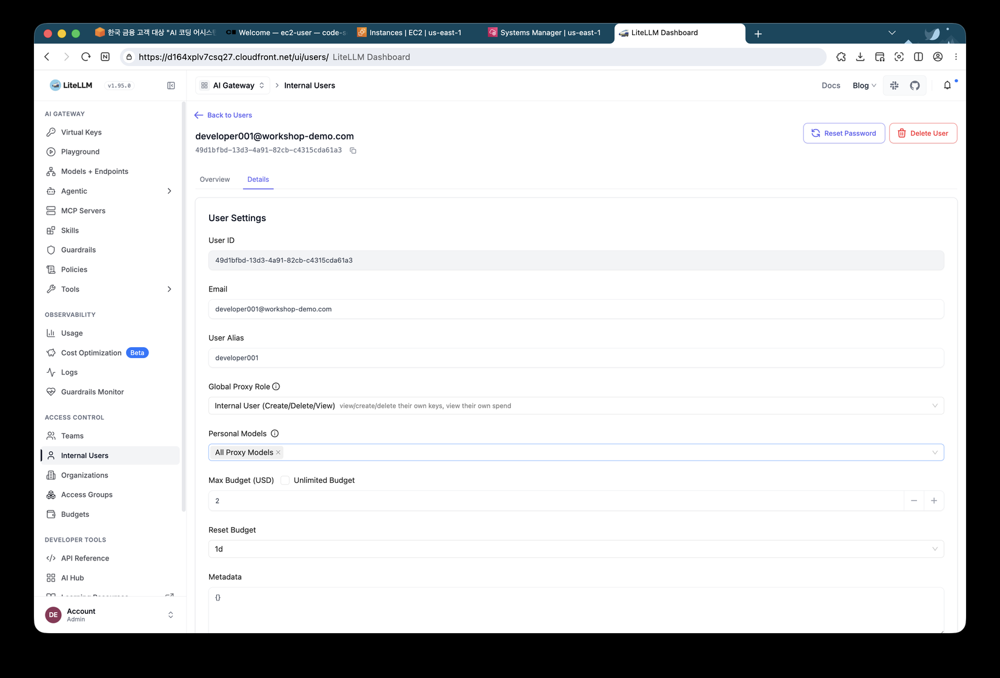

| 사용자 | User Alias | Max Budget | Reset Budget | 목적 |
|---|---|---|---|---|
| developer001 | developer001 | 2달러 | 1d | 정상 예산. 툴 3종의 지출이 이 사용자에게 귀속 |
| developer002 | developer002 | 0.000001달러 | 1d | 몇 번만 호출해도 확실히 초과되도록 잡은 데모용 값. 2편에서 429 발동 절차를 정리한다 |

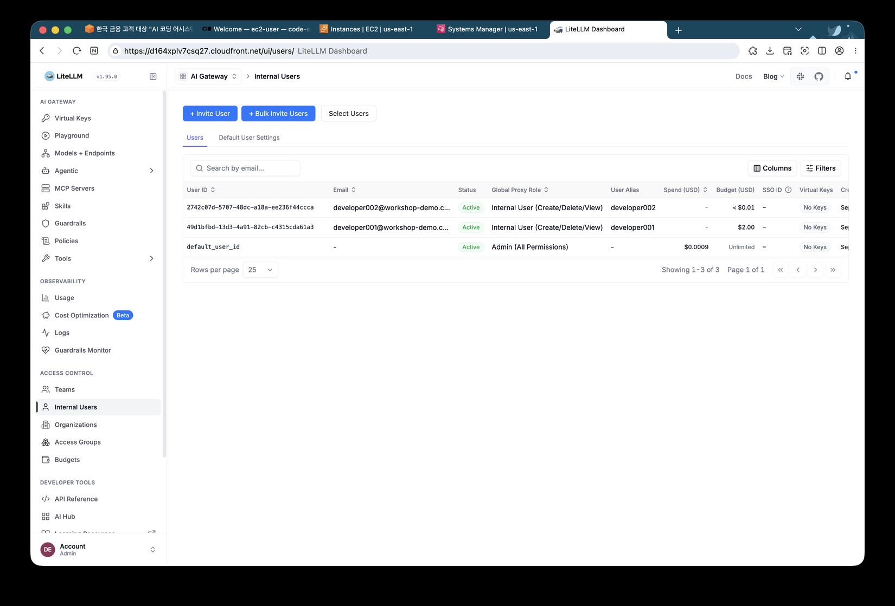

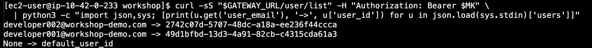

developer002의 Budget 열은 `< $0.01`로 보이지만 실제로 저장된 값은 0.000001이다. 터미널에서 `/user/list`를 부르면 이메일 두 개가 UUID와 함께 나온다. 이 이메일이 다음 절의 Keycloak 사용자 이메일과 한 글자도 다르지 않아야 한다.

LiteLLM에 SSO를 직접 연동하는 경우 무료 버전에는 사용자 5명 제한이 있다. 이 실습에서는 LiteLLM의 SSO 기능을 켜지 않고 게이트웨이 앞단의 브로커가 인증을 처리하므로 LiteLLM에는 평범한 Virtual Key만 도달한다. 그래서 사용자 수 제한이 없다.

## Keycloak 구성 확인

브로커에 신뢰할 IdP를 설정하기 전에 그 IdP가 어떻게 구성되어 있는지 봤다. 직접 연 화면은 realm 목록까지이고, 클라이언트와 사용자 설정은 워크샵이 미리 임포트해 둔 것이라 문서를 기준으로 정리했다. 여기 보이는 Keycloak은 사내 Active Directory, Okta, Entra ID를 대신하는 역할을 한다. 프로덕션에서 할 일은 두 가지뿐이다. IdP 팀에 CLI용 public 클라이언트 등록을 요청하고, 브로커 설정의 issuer URL을 그 IdP 값으로 바꾸면 된다.

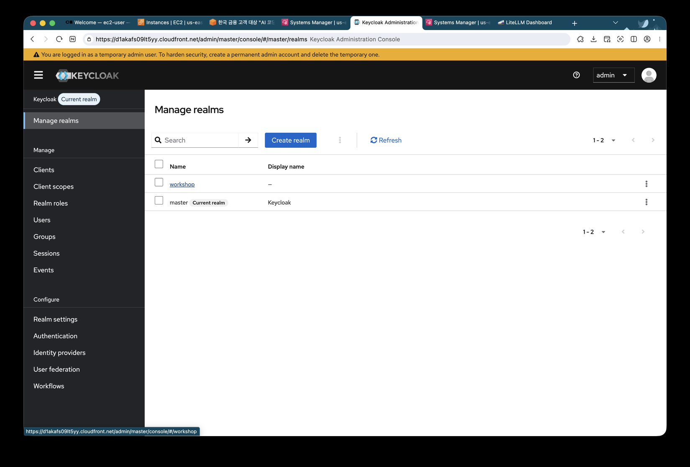

로그인 직후에는 master realm이 선택되어 있고 workshop realm으로 전환해야 클라이언트가 보인다. 상단에 임시 admin 사용자 경고가 떠 있는데, 이 admin 비밀번호가 Event Outputs에 값 그대로 노출된 것도 워크샵 편의를 위한 예외다. 실제 환경에서는 Secrets Manager에 두고 필요한 시점에만 조회한다.

| 항목 | 값 | 의미 |
|---|---|---|
| realm | workshop | 미리 임포트되어 있다 |
| 클라이언트 workshop-cli의 Client authentication | Off | 시크릿이 없는 public 클라이언트. 로그인을 시작하는 쪽이 개발자 PC의 스크립트라서 시크릿을 배포해도 보호할 수 없다. CLI와 모바일 앱을 public으로 등록하는 것이 OAuth 표준 방식 |
| Authentication flow | OAuth 2.0 Device Authorization Grant만 On | 터미널이 로그인 URL을 출력하고 사용자가 브라우저에서 로그인하면 터미널이 토큰을 받는 흐름. Standard flow와 Direct access grants는 꺼져 있어 다른 방법으로 토큰을 받을 수 없다 |
| redirect URI | 없음 | Device Grant는 로그인 후 브라우저를 되돌려 보내는 단계가 없어 등록할 주소가 없다 |
| 사용자 | developer001, developer002 | 이메일이 앞 절에서 초대한 값과 정확히 일치 |

Keycloak과 LiteLLM 양쪽에 developer001이 존재하는 이유는 두 시스템이 다른 질문에 답하기 때문이다. Keycloak은 누구인가에 답하고 비밀번호, MFA, 계정 활성 여부를 관리한다. LiteLLM은 무엇을 얼마나 할 수 있는가에 답하고 max_budget 같은 한도를 관리한다. 둘을 잇는 것이 이메일이고, IdP가 인증한 사람이라도 운영자가 초대하지 않았다면 키를 받을 수 없다.

## Key Vending Broker

지금까지는 Master Key로 모든 API를 호출했다. 그 키를 개발자 여러 명에게 나눠 줄 수는 없다. 워크샵이 택한 방식은 개발자에게 키를 배포하는 것이 아니라 개발자가 사내 계정으로 인증하면 짧은 수명의 키를 스스로 받아 가게 하는 것이다.

| | 정적 키 사전 배포 | SSO 인증 시 임시 키 발급 |
|---|---|---|
| 발급 주체 | 운영자가 만들어 전달 | 개발자가 로그인해서 직접 수령 |
| 수명 | 사실상 무기한 | 4시간, 만료 시 자동 재발급 |
| 신원 | 키는 문자열이고 사람과 무관 | 키가 IdP가 인증한 사람에게 귀속 |
| 퇴사자 처리 | 키를 찾아 개별 삭제 | IdP에서 계정을 비활성화하면 재발급 불가 |
| 예산 | 키마다 따로 설정 | 사용자에게 걸어 둔 설정이 그 사용자의 모든 키에 적용 |
| 유출 시 | 발견할 때까지 노출 | Keys UI에서 즉시 폐기, 최대 4시간 뒤 자동 만료 |

설계 제약이 하나 있다. LiteLLM이 요청마다 IdP의 JWT를 직접 검증하는 JWT Auth는 Enterprise 라이선스 전용이다. 이 워크샵은 무료 기능만으로 같은 효과를 내기 위해 게이트웨이 호스트에 약 120줄의 FastAPI 서비스인 Key Vending Broker를 둔다. 브로커가 하는 일은 셋이다.

| 브로커가 하는 일 | 의미 |
|---|---|
| Keycloak이 서명한 JWT인지 공개키로 검증 | 게이트웨이가 IdP를 신뢰하는 방식 |
| JWT의 이메일로 LiteLLM의 기존 사용자를 조회 | 신원과 예산의 연결점 |
| 그 사용자에게 표준 API `/key/generate`로 만료되는 Virtual Key 발급 | 개발자에게 전달되는 유일한 자격증명 |

LiteLLM 입장에서는 평범한 Virtual Key가 하나 생긴 것이다. 이 키는 Keys UI에 보이고, 운영자가 폐기할 수 있고, 사용자 예산이 그대로 적용된다. Master Key는 브로커까지만 전달되고 개발자 디바이스에 도달하는 것은 만료되는 임시 키뿐이다.

app.py의 `/auth/key` 핸들러는 네 단계로 동작한다.

| 단계 | 확인하는 것 | 방법 |
|---|---|---|
| 검증 1 | JWT의 서명, 발급자, 만료 | PyJWKClient가 `<ISSUER>/protocol/openid-connect/certs`에서 공개키를 받아 캐시하고 jwt.decode가 RS256 서명을 대조한다. 위조, 만료, 다른 IdP 서명은 여기서 401 |
| 검증 2 | 승인된 CLI 클라이언트로 발급된 토큰인지 | azp 클레임이 workshop-cli와 같은지. 관리 콘솔이나 다른 웹앱용 토큰을 키 발급에 재사용하는 것을 막는다 |
| 검증 3 | 게이트웨이에 등록된 사용자인지 | `/user/list?user_email=`로 조회한 뒤 소문자 완전 일치로 다시 거른다. 없으면 404. 새 사용자를 만들지 않는다 |
| 발급 | 만료 시각이 있는 임시 키 | `/key/generate`에 user_id, duration, `sso-<사용자>-<시각>-<랜덤>` alias, 메타데이터. team_id는 넣지 않는다 |

검증 1에는 비밀값이 필요 없다. 서명은 IdP의 개인키가, 검증은 공개키가 담당하므로 브로커와 Keycloak이 비밀을 미리 공유할 필요가 없고, 사내 IdP로 바꿀 때 수정할 값도 issuer URL 하나다. 검증 3에서 완전 일치를 한 번 더 확인하는 이유는 `/user/list`의 user_email 필터가 부분 일치 검색이기 때문이다. 첫 항목을 그대로 쓰면 다른 사람에게 키가 발급되어 그 사람의 예산에서 비용이 차감된다. 발급 페이로드에 team_id가 없는 것도 의도적이다. LiteLLM v1.95.0에서 팀에 소속된 키에는 사용자 개인 예산이 적용되지 않는다.

broker.env는 템플릿의 Keycloak URL 자리만 치환해 만든다.

```ini
KEYCLOAK_ISSUER=https://d1akafs09lt5yy.cloudfront.net/realms/workshop
KEYCLOAK_CLIENT_ID=workshop-cli
KEY_DURATION=4h
LITELLM_URL=http://litellm:4000
```

| 키 | 의미 |
|---|---|
| KEYCLOAK_ISSUER | 검증 1의 issuer 대조값이자 JWKS 공개키를 받아올 주소. 사내 IdP로 교체할 때 바뀌는 유일한 연결 값. JWT의 issuer 문자열과 문자 단위로 비교되므로 https가 빠지거나 끝에 슬래시가 붙으면 모든 발급이 Invalid issuer 401로 거부된다 |
| KEYCLOAK_CLIENT_ID | 검증 2의 대조값 |
| KEY_DURATION | 발급되는 임시 키의 수명. 뒤에서 이 값을 바꿔 만료를 실험한다 |
| LITELLM_URL | 컨테이너 네트워크 안의 서비스 이름 |

브로커 compose는 env_file로 `/opt/workshop/.env`와 broker.env 두 개를 읽는다. `/key/generate`에 Master Key가 필요한데 기존 파일을 재사용해 비밀값 사본을 늘리지 않는다. 포트는 127.0.0.1:8080에만 바인딩되어 호스트 밖으로 직접 노출되지 않고, 외부에서 들어오는 경로는 nginx의 `/auth/`뿐이다. 브로커는 LiteLLM compose가 만든 workshop_default 네트워크에 합류해 `http://litellm:4000` 내부 이름으로 통신한다.

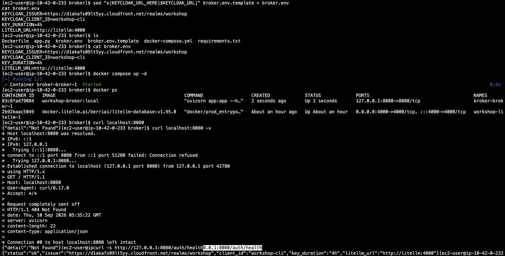

컨테이너가 뜨면 루트 경로는 uvicorn의 404 Not Found로 답하고, `/auth/health`가 issuer, client_id, key_duration, litellm_url을 돌려준다. 이어서 외부 경로와 인증 없는 요청을 함께 확인했다.

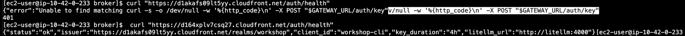

| 요청 | 응답 |
|---|---|
| Keycloak CloudFront 도메인의 /auth/health | Keycloak 자체의 오류 JSON. 브로커가 아니다. 화면에서는 다음 명령을 붙여 넣으면서 응답 뒷부분이 가려졌다 |
| JWT 없이 게이트웨이 도메인의 /auth/key에 POST | 401. 인증 없이 키를 요청하면 거부된다 |
| 게이트웨이 CloudFront 도메인의 /auth/health | status ok JSON. CloudFront, nginx `/auth/`, 브로커 경로가 열렸다 |

여기서 401은 정상 응답이고, 실제 JWT로 키를 받는 과정은 다음 절에서 개발자 역할로 진행한다.

## SSO 로그인과 임시 키 발급

여기서 역할이 바뀐다. 게이트웨이 EC2가 아니라 개발자 PC 역할인 code-server의 터미널에서 developer001로 작업한다. 확인할 것은 셋이다. 정적 키 없이 SSO 로그인만으로 키를 받는지, 그 키가 설정한 수명대로 만료되는지, 비용이 developer001에 귀속되어 앞서 설정한 예산이 그대로 적용되는지다.

`~/bin`에 인증 스크립트가 미리 배치되어 있다.

| 스크립트 | 역할 | 실행 빈도 |
|---|---|---|
| gateway-login.sh | 대화형 SSO 로그인. 브라우저 인증 후 로그인 세션을 캐시 | 하루 한 번 |
| get-gateway-key.sh | 비대화형 키 헬퍼. 세션으로 JWT를 얻어 브로커에서 임시 키를 수령 | 툴이 필요할 때마다 자동 |
| ensure-gateway-session.sh | 유효한 키를 보장. 있으면 통과, 없으면 gateway-login.sh를 실행 | 래퍼가 자동 호출 |
| claude, codex, opencode | AI 툴 래퍼. 세션을 확인한 뒤 실제 CLI를 실행 | 툴을 실행할 때마다 |

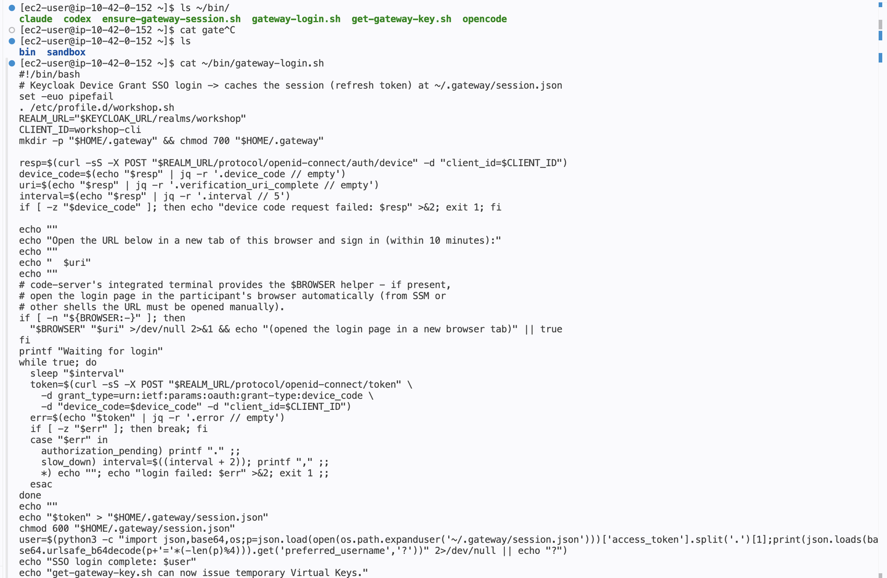

gateway-login.sh는 realm의 device 엔드포인트에 client_id만 보내 device code를 받고, 브라우저 탭을 열고, `authorization_pending`이면 점을 찍으며 폴링하고, `slow_down`이면 간격을 늘리고, 토큰이 오면 session.json에 권한 600으로 저장한다. 시크릿이 한 줄도 없다.

아래는 이 절에서 실습으로 만드는 흐름이다. 인증과 키 발급은 개발자, Keycloak, 브로커 사이에서 일어나고, 실제 모델 호출 경로에는 IdP가 등장하지 않는다.

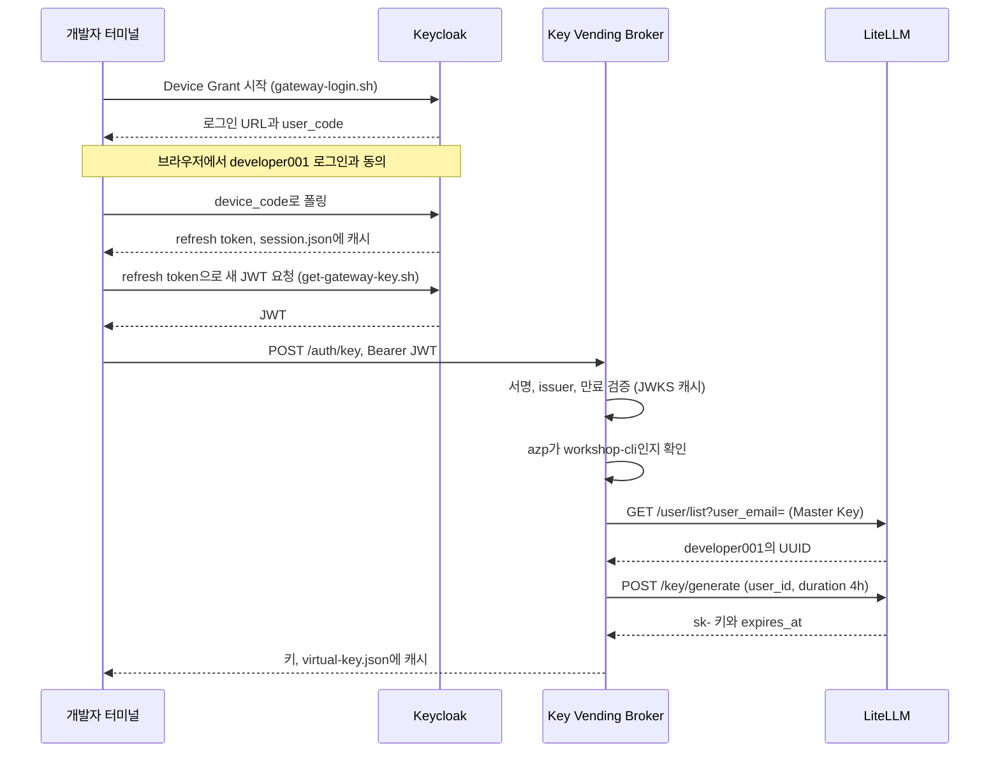
```mermaid
sequenceDiagram
    participant D as 개발자 터미널
    participant K as Keycloak
    participant B as Key Vending Broker
    participant L as LiteLLM
    D->>K: Device Grant 시작 (gateway-login.sh)
    K-->>D: 로그인 URL과 user_code
    Note over D,K: 브라우저에서 developer001 로그인과 동의
    D->>K: device_code로 폴링
    K-->>D: refresh token, session.json에 캐시
    D->>K: refresh token으로 새 JWT 요청 (get-gateway-key.sh)
    K-->>D: JWT
    D->>B: POST /auth/key, Bearer JWT
    B->>B: 서명, issuer, 만료 검증 (JWKS 캐시)
    B->>B: azp가 workshop-cli인지 확인
    B->>L: GET /user/list?user_email= (Master Key)
    L-->>B: developer001의 UUID
    B->>L: POST /key/generate (user_id, duration 4h)
    L-->>B: sk- 키와 expires_at
    B-->>D: 키, virtual-key.json에 캐시
```

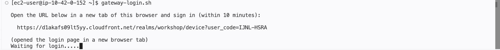

`gateway-login.sh`를 실행하면 user_code가 포함된 URL이 출력되고 code-server가 그 페이지를 새 탭으로 연다. Device Grant는 원래 브라우저에서 코드를 입력하는 흐름이지만 URL에 코드가 들어 있어 따로 입력할 것이 없다. Keycloak 로그인 화면에서 developer001로 로그인하면 동의 화면이 나온다.

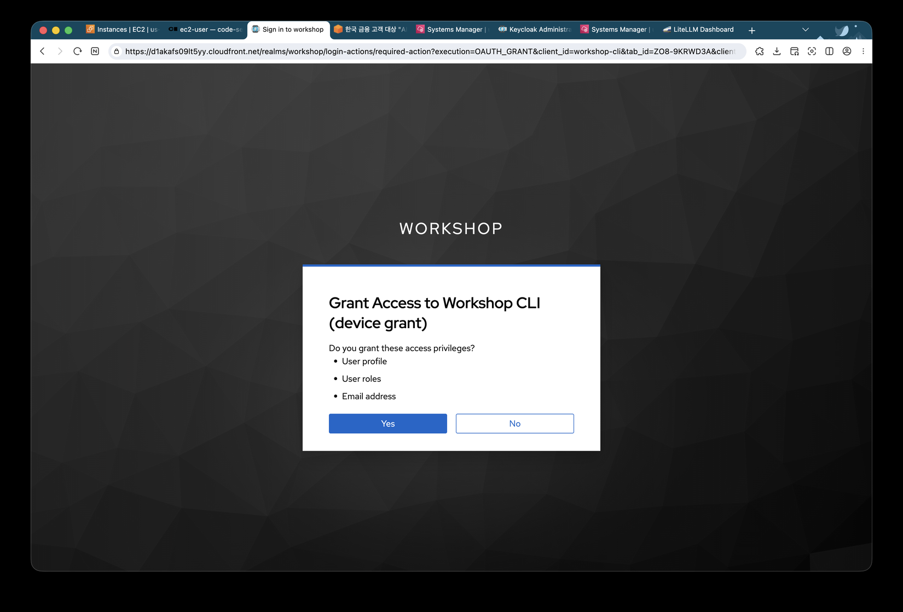

CLI라는 디바이스가 User profile, User roles, Email address에 접근해도 되는지 IdP가 묻는 절차다. 사내 계정으로 서드파티 앱에 로그인할 때 보는 화면과 같다. Yes를 누르면 Device Login Successful 페이지가 뜨고 브라우저 쪽 일은 끝난다.

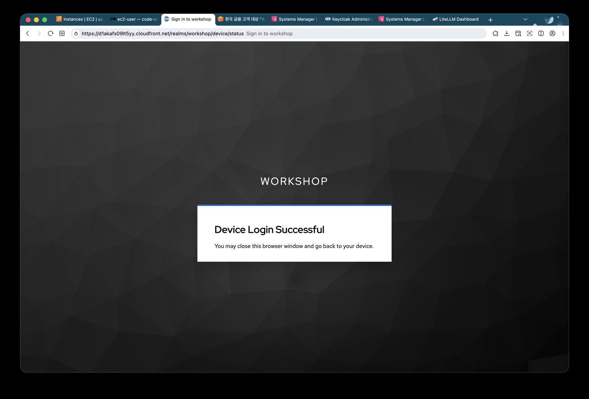

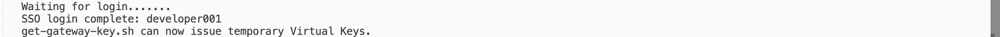

Keycloak이 이 터미널에 발급한 것은 refresh token이다. session.json을 열어 보면 access_token의 expires_in이 3600초, refresh_expires_in이 28800초로 JWT는 1시간, 로그인 세션은 8시간이다. 세션이 유효한 동안 헬퍼는 브라우저 없이 새 JWT를 얻는다.

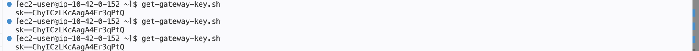

`get-gateway-key.sh`의 출력은 키 하나뿐이다. 사람이 읽는 출력이 아니라 툴이 호출하는 credential helper의 출력이므로 stdout에 키만 낸다. 세 번 연속 실행하면 같은 키가 즉시 나온다. 캐시된 키의 만료가 10분 이상 남아 있으면 재발급하지 않으므로 툴이 5분마다 헬퍼를 불러도 키가 불필요하게 늘지 않는다.

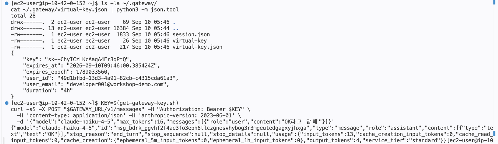

| 파일 | 내용 | 권한 |
|---|---|---|
| session.json | Keycloak refresh token | 600 |
| virtual-key.json | 키, expires_at, expires_epoch, user_id, user_email, duration | 600 |
| virtual-key | 같은 키의 평문. 2편에서 OpenCode가 파일 참조로 읽는다 | 600 |

virtual-key.json의 user_id는 앞 절에서 초대한 developer001 행의 UUID다. 브로커가 이메일로 기존 행을 조인했고 새 사용자를 만들지 않았다는 증거다. 이 키로 `/v1/messages`를 부르면 모델 응답이 돌아온다. Master Key 없이, 사전 배포된 정적 키 없이 게이트웨이를 통과한 첫 호출이다.

발급된 키로 모델을 부르는 두 번째 단계의 경로에는 Keycloak과 브로커가 없다. 호출 시점의 인증은 키 하나로 끝나므로 IdP 장애가 진행 중인 작업을 멈추지 않고, 게이트웨이는 요청마다 IdP를 호출하지 않는다.

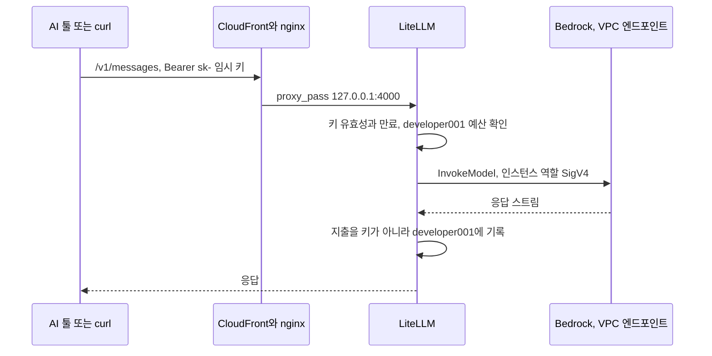
```mermaid
sequenceDiagram
    participant T as AI 툴 또는 curl
    participant N as CloudFront와 nginx
    participant L as LiteLLM
    participant BR as Bedrock, VPC 엔드포인트
    T->>N: /v1/messages, Bearer sk- 임시 키
    N->>L: proxy_pass 127.0.0.1:4000
    L->>L: 키 유효성과 만료, developer001 예산 확인
    L->>BR: InvokeModel, 인스턴스 역할 SigV4
    BR-->>L: 응답 스트림
    L->>L: 지출을 키가 아니라 developer001에 기록
    L-->>T: 응답
```

운영자 화면으로 돌아가면 방금 일어난 일이 보인다.

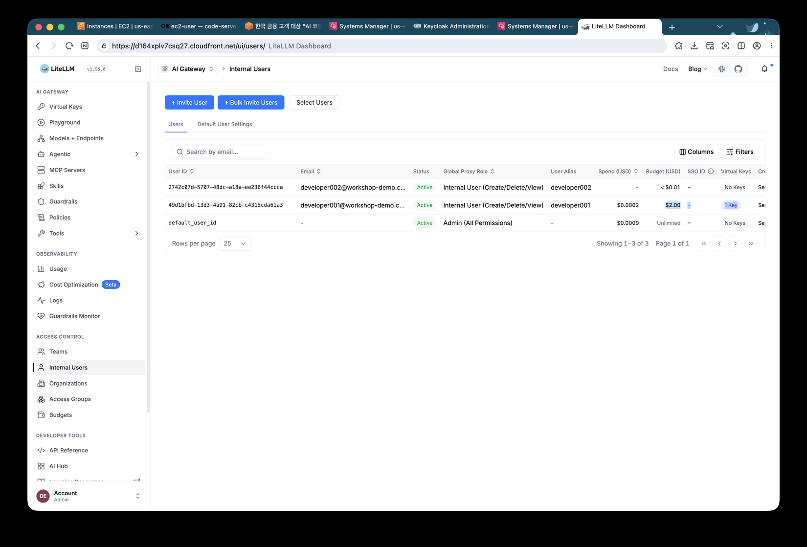

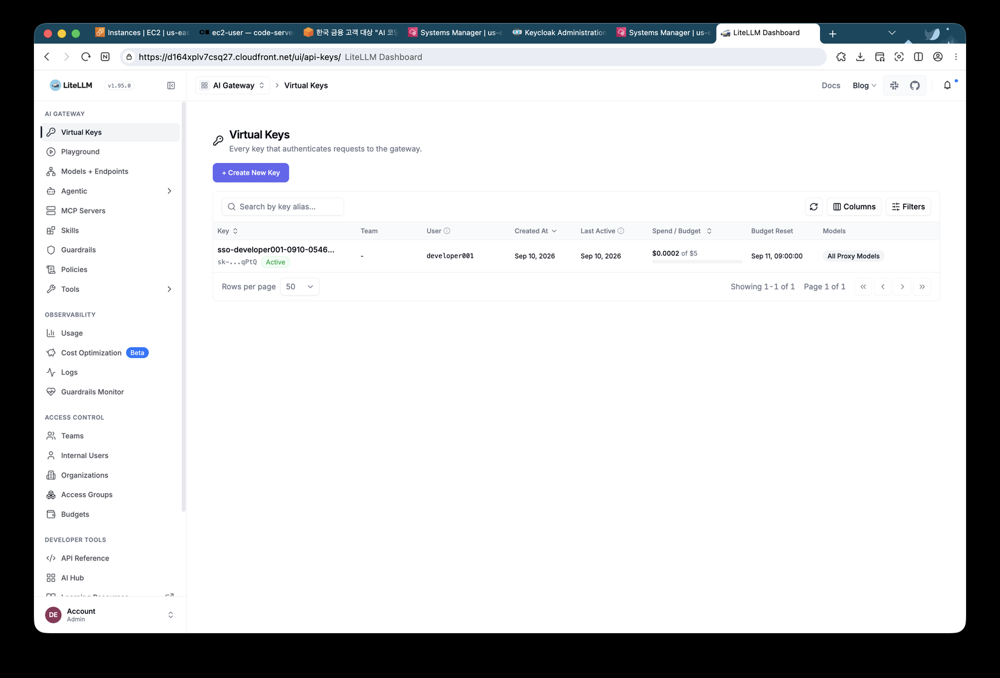

developer001 행의 Virtual Keys가 1 Key로 바뀌고 Spend가 0.0002달러로 잡혔다. Virtual Keys 메뉴에는 `sso-developer001-0910-0546...` alias의 키가 Active로 있다. SSO로 발급된 키도 운영자가 만든 Virtual Key와 똑같이 보이고 운영자가 이 화면에서 즉시 폐기할 수 있다. 키 행에 표시되는 5달러는 키 자체의 예산 칸인데 어디서 온 기본값인지는 확인하지 못했다. 워크샵 설명대로 실제로 발동하는 상한은 사용자에게 건 2달러다.

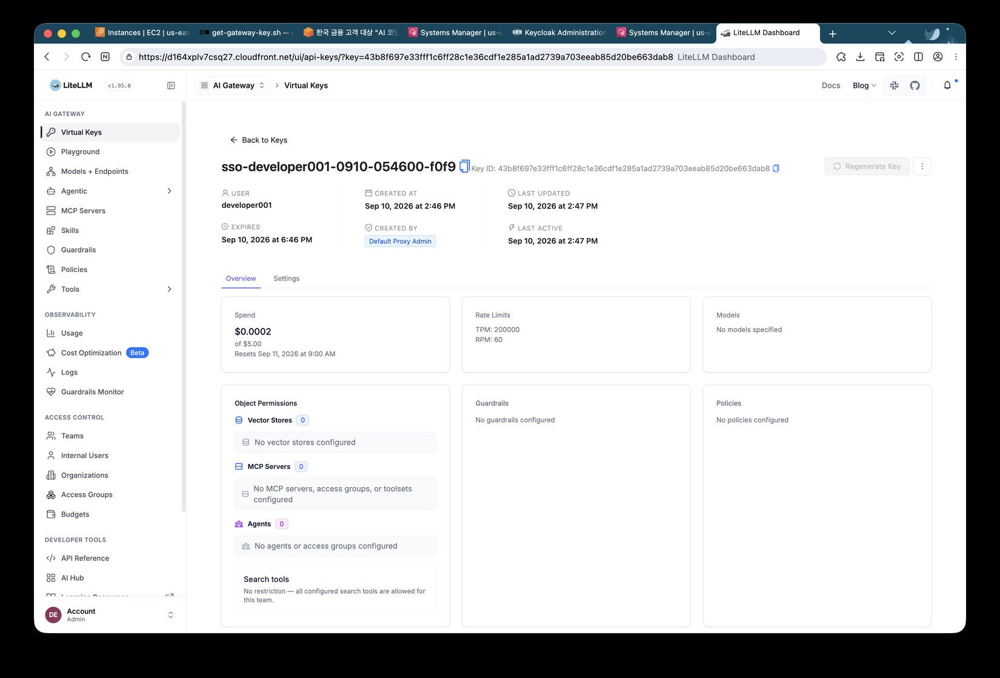

키 상세에는 생성 시각 2:46 PM, 만료 시각 6:46 PM, TPM 200000, RPM 60이 있다. 4시간을 기다릴 수 없으니 운영자 역할로 브로커의 발급 정책을 1분으로 줄여 만료를 직접 확인했다. 게이트웨이 SSM 세션에서 broker.env의 KEY_DURATION을 60s로 바꾸고 컨테이너를 다시 만들었다.

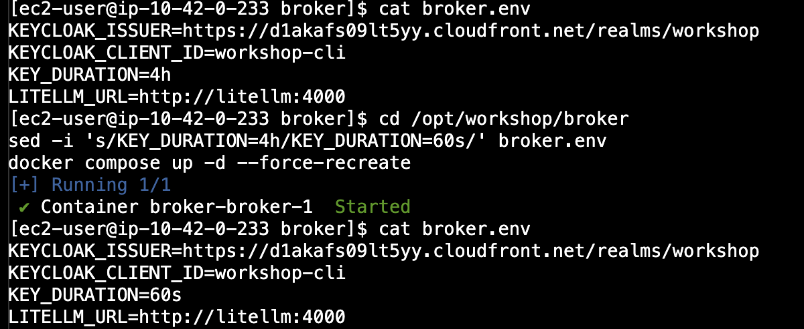

env만 바꾸고 재생성하지 않으면 실행 중인 컨테이너의 환경은 바뀌지 않는다. `--force-recreate`가 필요하다. 코드 에디터로 돌아와 4시간 키 캐시를 지우고 새 키를 받으면 Virtual Keys에 만료가 1분 뒤인 키가 하나 더 생긴다.

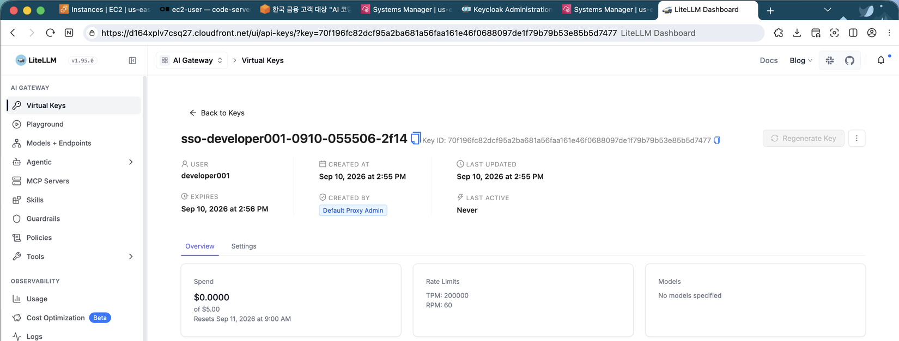

| 키 alias | 생성 | 만료 | 수명 |
|---|---|---|---|
| sso-developer001-0910-054600-f0f9 | 2:46 PM | 6:46 PM | 4시간 |
| sso-developer001-0910-055506-2f14 | 2:55 PM | 2:56 PM | 1분 |
| sso-developer001-0910-055747-2b12 | 2:57 PM | 2:58 PM | 1분. 아래 만료 확인에 쓴 키 |

만료 확인에 쓴 키는 표의 두 번째 키가 아니라 그 뒤 한 번 더 발급받은 세 번째 1분 키다. 발급 시각 05:57:47 UTC가 터미널에 찍혀 있고, 2편의 psql 조회에서 이 키의 만료 시각이 05:58:47로 확인된다.

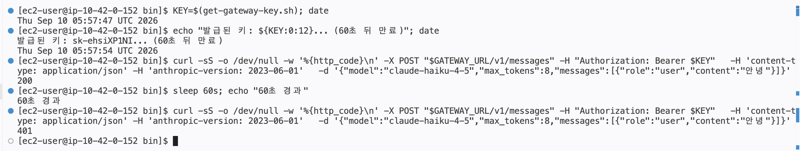

발급 직후 호출은 200이고, `sleep 60s` 뒤 같은 키로 다시 부르면 401이다. 이 실험에서는 상태 코드만 출력했는데, 워크샵 문서에 따르면 본문에는 만료 시각이 명시된 `expired_key` 오류가 담긴다. 2편에서 보듯 툴들이 이 401을 신호로 헬퍼를 자동 재실행해 새 키를 받으므로 개발자는 만료를 의식할 필요가 없다. 여기서 발급 블록까지 다시 실행하면 헬퍼가 새 1분짜리 키를 또 발급해 몇 번을 반복해도 200만 나온다. 키 수명이 헬퍼의 캐시 여유 10분보다 짧아 호출할 때마다 새 키가 발급되기 때문이다. 만료를 보려면 같은 KEY 변수로 다시 불러야 한다.

실험이 끝나면 KEY_DURATION을 4h로 되돌리고 컨테이너를 다시 만든다. 되돌리지 않으면 헬퍼를 부를 때마다 새 키가 발급되어 Keys UI에 `sso-developer001-*` 키가 계속 늘어난다. 2편 시작 화면에서 developer001의 키가 4개로 늘어 있고 그중 2개가 Expired인 것이 이 실험의 흔적이다.

## 정리

| 통제 | 이 글에서 확인한 증거 |
|---|---|
| 인증 | 브라우저 SSO 로그인 1회 뒤 헬퍼가 받아 온 4시간 만료 Virtual Key. 개발자에게 영구 키도 Master Key도 배포하지 않았다 |
| 사용량 상한 | developer001에 1일 2달러, developer002에 0.000001달러. 발동 절차는 2편에서 정리 |
| 기록 | Internal Users의 Spend와 Virtual Keys의 alias가 SSO 신원별로 쌓이기 시작했다 |
| 정책 | 등록한 이름 8개 이외의 모델은 호출할 수 없다 |
| 킬 스위치 | SSO로 발급된 키가 운영자 Keys UI에 보인다. 폐기 절차는 2편에서 정리 |

운영자 관점에서 남는 것은 구조다. 모델 경로는 PrivateLink와 인스턴스 역할 SigV4라 저장된 비밀값이 없고, 개발자 경로는 IdP가 인증한 사람에게만 4시간짜리 키가 나간다. 사내 IdP로 바꿀 때 할 일은 broker.env의 issuer 한 줄을 고치고 IdP에 public 클라이언트 하나를 등록하는 것뿐이다.

2편에서는 developer001의 이 세션을 그대로 이어받아 Claude Code, OpenCode, Codex를 게이트웨이에 연결하고, 게이트웨이를 지나지 않은 호출이 어디서 막히는지, 로그에 무엇이 남는지, 주민등록번호가 모델에 닿기 전에 어떻게 가려지는지 확인한다.
