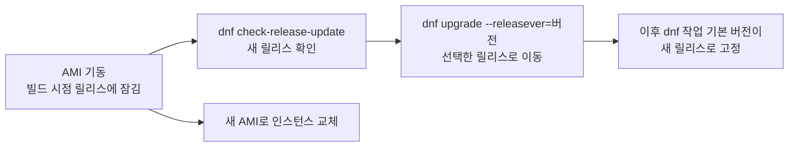

# Amazon Linux 2027 정리

AL2, AL2023, Rocky Linux 10.2와 함께 비교

<!-- more -->

## 세대별 비교

| 항목 | AL2 | AL2023 | AL2027 |
|---|---|---|---|
| 출시 | 2017년 12월 LTS 후보 공개 | 2023년 3월 15일 GA | 2026년 9월 3일 Preview |
| 지원 종료 | 2026년 6월 30일. 이미 종료되어 보안 업데이트 중단 | 표준 지원 2027년 6월 30일, maintenance 2029년 6월 30일 | 제품 페이지 FAQ 기준 GA 후 표준 지원 5년. 사용자 가이드 기준 2032년 |
| 기본 커널 | 5.10(최초 출하 4.14) | 6.18(AL2023 kernel-update 문서 기준 2026년 8월 17일부터. AL2027 비교 문서는 아직 6.1 기본으로 표기. 6.1, 6.12 선택 가능) | 7.1 |
| 패키지 관리자 | yum 3.4.3 | DNF 4.14. yum은 dnf 포인터 | DNF5 5.4. yum과 dnf 모두 DNF5 |
| SELinux 기본값 | disabled | enabled, permissive | enabled, enforcing |
| 네트워크 서비스 | ISC dhclient | systemd-networkd | systemd-networkd |
| init, cgroup | systemd 219, cgroup v1 | systemd 252, cgroup v2 | systemd 260, cgroup v2 전용 |
| 업데이트 모델 | 릴리스 버전 고정 없음(deterministic upgrades 도입 전) | deterministic upgrades. 릴리스 버전에 잠긴 저장소 | AL2023과 동일 |
| x86-64 baseline | 문서에 명시 없음 | x86-64-v2 | x86-64-v3 |
| 32비트 | x86-64 호스트에서 32비트 바이너리 실행만 제한적으로 지원 | userspace 패키지 없음 | i686 패키지 없고 32비트 userspace 실행도 미지원 |
| 컨테이너 이미지 | amazonlinux:2 | amazonlinux:2023, 2023-minimal | amazonlinux:2027, 2027-minimal |
| ECS, EKS optimized AMI | EKS용 AL2 AMI는 2025년 11월 26일 발행 중단 | 둘 다 제공. AWS Containers 블로그 기준 EKS 1.30 이상 관리형 노드 그룹의 기본 OS | EKS 레시피는 Phase 2 예정. ECS는 언급 없음 |

---

## 컴포넌트 변화

AWS 문서의 AL2023 대 AL2027 비교표. 문서는 GCC 11에서 16으로 가는 것을 툴체인 변화 중 가장 큰 것으로 꼽고, RPM은 4.16에서 6.0으로 메이저가 바뀌어 spec 파일 재검증이 필요

| 컴포넌트 | AL2023 | AL2027 | 비고 |
|---|---|---|---|
| SELinux | Permissive | Enforcing | 기본값이 Enforcing으로 바뀜 |
| Kernel | 6.1 기본. 6.12, 6.18 제공 | 7.1 | 패키지 이름에 버전이 붙음(kernel7.1). AL2023처럼 시간이 지나면 새 커널 추가. AL2023 열은 문서 표 기준이고 2026년 8월 17일부터 AL2023 기본 AMI는 6.18로 부팅 |
| GCC | 11.5 | 16.1 | 툴체인 대규모 업그레이드. 기본값이 엄격해져 재컴파일 시 새 경고나 오류 가능 |
| glibc | 2.34 | 2.44 | |
| binutils | 2.41 | 2.46 | |
| LLVM/Clang | 15, 18, 19(SRPM 분리) | 22(단일 SRPM) | clang, lld, lldb, libomp를 하나의 소스 패키지에서 빌드 |
| systemd | 252 | 260 | System V 서비스 스크립트 지원 제거 |
| RPM | 4.16 | 6.0 | OpenPGP 서명 검증이 rpm-sequoia 구현으로 바뀜. 자체 spec 파일은 테스트 필요 |
| DNF | DNF 4.14 | DNF5 5.4 | dnf와 yum 명령 모두 DNF5 실행. DNF 4 Python API(python3-dnf) 없음 |
| Python | 3.9 | 3.14 | 기본 python3가 3.14 |
| zlib | 1.2.11 | zlib-ng 2.3 | zlib-ng-compat 패키지로 drop-in 대체 |
| PCRE | PCRE 8.x + PCRE2 | PCRE2만 | PCRE1 제거 |

GCC 버전은 AWS 자료 안에서도 어긋남. 사용자 가이드는 네 페이지 모두 16.1이고 제품 페이지 FAQ도 16.1인데, 같은 제품 페이지의 Preview Features 카드만 16.2. 프리뷰 중 갱신되는 값이므로 설치 후 gcc --version으로 확인

비교표 밖의 주요 버전. AL2023 열은 2023.12 릴리스 기준으로 확인된 값만 적음

| 패키지 | AL2023 | AL2027 |
|---|---|---|
| OpenSSL | 3.5.7(AL2023.12 기준. GA 당시 3.0) | 3.5.7. AWS-LC 병행 |
| OpenSSH | 9.9p1(AL2023.12 기준. GA 당시 8.7) | 9.9p1. DSA 서명 제거, 2048비트 미만 RSA 키 기본 거부 |
| cloud-init | | 26.1 |
| bash | | 5.3 |
| curl | | 8.18 |
| GnuTLS | 3.8.10 | 3.8.10. ML-KEM 하이브리드 키 교환과 ML-DSA 서명 지원 |
| aws-lc-libs | 없음 | 5.2.0. 표준과 minimal AMI에 기본 설치, 컨테이너 이미지에는 없음 |
| selinux-policy | | 44.5 |

---

## Rocky Linux 10.2와 비교

2026년 9월 기준 Rocky Linux 최신 안정 버전은 2026년 5월 말 공개된 10.2(문서 릴리스 표는 5월 29일, 뉴스 글은 5월 28일). RHEL 10.2를 재빌드한 배포판이라 AL2027과는 계보가 다르지만, x86-64-v3 baseline과 SELinux Enforcing 기본, 32비트 제거, PCRE2 단일화, zlib-ng 채택처럼 같은 방향으로 움직인 항목이 많음

| 항목 | Rocky Linux 10.2 | AL2027 Preview |
|---|---|---|
| 계보 | RHEL 10.2 재빌드. CentOS Stream과 RHEL 릴리스를 최대한 추종 | Fedora 44와 45에 부분 기반. 특정 Fedora 릴리스와 직접 비교 불가 |
| 운영 주체 | Rocky Enterprise Software Foundation 커뮤니티 | AWS |
| 메이저 최초 공개 | 10.0 GA 2025년 6월 11일 | Preview 2026년 9월 3일. GA 미정 |
| 수명 | 10년. Active Support 2030년 5월 31일, Security Support 2035년 5월 31일까지 | GA 후 표준 지원 5년. 문서상 2032년까지 |
| 마이너 릴리스 | 6개월마다(대체로 5~6월, 11월). 최신 마이너만 지원 | 표준 지원 중 3개월마다 |
| 메이저 간 업그레이드 | 미지원. 재설치 권장 | in-place 메이저 업그레이드 절차 문서 없음. 런타임 선행 업그레이드와 애플리케이션 검증 후 새 AMI로 이동 |
| 업데이트 모델 | 롤링. releasever가 메이저 버전이고 별도 updates 저장소 없이 같은 저장소에 반영. 마이너 수명 동안 이전 빌드가 공존해 다운그레이드 가능. 옛 릴리스는 vault로 이동하며 미지원 | deterministic upgrades. AMI가 릴리스 버전 저장소에 잠기고 dnf upgrade --releasever로 이동. 공개된 릴리스는 불변 |
| 요금, 라이선스 | 무료. 프로젝트 기여분은 BSD 3-Clause | 무료. EC2 요금만 |
| 아키텍처 | x86_64(v3), aarch64(ARMv8.0-A), ppc64le, s390x, riscv64 5종 | x86_64(v3), aarch64(ARMv8.2와 Crypto Extension) 2종 |
| 32비트 | x86_64 32비트 호환 제거. 10.2 저장소 어디에도 i686 패키지 없음 | 없음 |

컴포넌트 버전. Rocky 값은 10.2 GA 저장소 실물 패키지 기준

| 컴포넌트 | Rocky Linux 10.2 | AL2027 Preview |
|---|---|---|
| 커널 | 6.12(6.12.0-211 계열) | 7.1 |
| glibc | 2.39 | 2.44 |
| GCC | 14.3 시스템. GCC Toolset 15로 15.2 추가 제공 | 16.1 단일 |
| binutils | 2.41 | 2.46 |
| LLVM/Clang | 21.1 | 22 |
| systemd | 257 | 260 |
| RPM | 4.19 | 6.0 |
| DNF | DNF 4.20. 릴리스 노트가 dnf5를 언급하지만 저장소에 dnf5 패키지는 없음 | DNF5 5.4 |
| Python | 3.12 시스템. 3.14는 별도 패키지 | 3.14 시스템 |
| OpenSSL | 3.5 | 3.5. AWS-LC 병행 |
| zlib | zlib-ng-compat 2.2 | zlib-ng 2.3 |
| PCRE | PCRE2 10.44만 | PCRE2만 |
| SELinux 기본 | enforcing, targeted | enforcing, targeted |
| cloud-init | 24.4 | 26.1 |

운영과 생태계

| 항목 | Rocky Linux 10.2 | AL2027 Preview |
|---|---|---|
| SysV init 스크립트 | systemd 257의 sysv-generator로 동작. initscripts와 chkconfig 제공 | 제거 |
| FIPS 140 | Rocky 10용 CMVP 인증서 없음. 8과 9는 CIQ가 벤더로 인증. fips-mode-setup 제거. 상류 RHEL 10 문서는 설치 시에만 FIPS 활성화를 지원한다고 안내 | 검증 모듈은 GA 전 제공 예정. fips-mode-setup 제거, 커널 인자 fips=1 |
| CIS 벤치마크 | Rocky Linux 10 Benchmark v1.0.0 | 언급 없음 |
| EPEL | 사용 가능. extras의 epel-release 설치와 CRB 활성화 필요 | 언급 없음. AL2027용으로 만든 저장소만 추가하라고 안내 |
| AWS AMI | Marketplace 공식 AMI. 무료. 기본 사용자 rocky | Preview AMI. 기본 사용자 ec2-user |
| 컨테이너 | quay.io와 Docker Hub의 rockylinux/rockylinux. 10.2, 10.2-minimal, 10-ubi-micro 등. Docker 공식 이미지 library/rockylinux에는 10 태그가 없음 | ECR Public의 amazonlinux:2027, 2027-minimal |
| 네트워크 | NetworkManager 필수. ifcfg 스크립트와 ifup, ifdown 제거. ISC DHCP는 Kea로 교체 | systemd-networkd |
| 눈에 띄는 제거 | redis(valkey로), sendmail(Postfix 권장), TigerVNC, X.Org Server(Wayland로), NIC teaming, GFS2, dnf module | ksh, opensmtpd, libdb, aspell-en. aspell 본체는 GA 전 제거 예정이라 프리뷰에는 있고, cron은 deprecated이지만 저장소에 존재 |
| PQC | FUTURE 정책의 그룹 목록이 하이브리드 ML-KEM만 허용 | DEFAULT 정책에 PQC 기본 활성 |

시스템 기본 패키지 기준으로 AL2027이 커널 한 세대, GCC 두 세대 앞서 있고 RPM은 4에서 6으로 건너뜀. Rocky는 GCC Toolset 15와 LLVM Toolset 21을 별도 제공. 대신 Rocky는 수명 10년, 아키텍처 5종, RHEL 호환, EPEL과 CIS 같은 생태계가 강점. 선택 기준은 버전 숫자보다 RHEL 호환이 필요한지, 그리고 EC2 밖에서도 같은 이미지를 써야 하는지

---

## 보안 기본값

| 항목 | AL2023 | AL2027 | 달라지는 점 |
|---|---|---|---|
| SELinux | enabled, permissive. 위반을 로그로만 기록 | enabled, enforcing. 위반을 실제로 차단. 정책은 targeted | permissive 동작에 기대던 애플리케이션은 정책 조정 필요. 문서는 잘못 라벨링되거나 라벨 없는 파일이 enforcing에서 문제를 일으킨다고만 설명. 일반적으로 사용자 정의 경로의 서비스 바이너리, 홈 디렉터리 아래 웹 루트, 컨테이너 볼륨 마운트처럼 라벨이 표준을 벗어난 구성이 먼저 걸림 |
| 컴파일러 하드닝 | | 제품 페이지 FAQ 기준, 메모리 초기화 관련 취약점을 컴파일 시점에 막는 compiler hardening으로 패키지 빌드 | 배포판 패키지 전체의 공격 표면 축소 |
| 암호화 라이브러리 | OpenSSL 3.5(2023.12 기준) | OpenSSL 3.5 기본. AWS-LC 병행 제공 | 아래 암호화 라이브러리 절 |
| 암호 정책 | | 시스템 전역 crypto policy가 post-quantum cryptography 기본 활성 | 해제는 update-crypto-policies --set DEFAULT:NO-PQ |
| FIPS | fips-mode-setup 유틸 | fips-mode-setup 제거. 커널 인자 fips=1만 켜면 재부팅 후 시스템 전역 FIPS 정책 자동 적용 | 프리뷰에는 FIPS 검증 커널과 모듈이 없고 GA 전 제공 예정. FIPS 모드에서 ED25519 SSH 사용자 키 미지원 |
| 서명 검증 | RPM 4.16 | RPM 6.0, rpm-sequoia | OpenPGP 구현 교체 |

Enforcing에서 막히는지 확인하고 임시로 풀어 보는 순서

```bash
getenforce                              # Enforcing 확인
sestatus                                # 정책 이름 targeted 확인
sudo ausearch -m AVC -ts recent         # 최근 차단 기록
sudo setenforce 0                       # 재부팅 전까지 Permissive
```

getenforce와 sestatus는 문서가 안내하는 명령이고 ausearch와 setenforce는 일반 SELinux 절차. audit 패키지는 AMI에 기본 설치되지만 컨테이너 이미지에는 없음

영구 전환은 /etc/selinux/config의 SELINUX 값을 permissive로 바꾸고 재부팅. 기동 시점에 바꾸려면 user data로 cloud-config 전달

```yaml
#cloud-config
selinux:
  mode: permissive
  selinux_no_reboot: 1   # 생략하면 기본으로 재부팅
```

완전 비활성화는 grubby로 커널 명령줄에 selinux=0을 추가하는 방식인데, AWS는 비활성화 대신 permissive를 권장. Permissive는 원인 파악용. AWS 문서에는 없는 절차이지만 서비스 경로를 표준 위치로 옮기거나 semanage fcontext와 restorecon으로 라벨을 맞추는 것이 일반적인 해결 경로

---

## 암호화 라이브러리

AWS-LC가 OpenSSL을 대체한다는 오해가 많은데, AL2027에서 기본 시스템 암호화 라이브러리는 여전히 OpenSSL 3.5. AWS-LC는 옆에 같이 설치되고, 선택한 패키지만 AWS-LC로 빌드됨

| 항목 | OpenSSL 3.5 | AWS-LC |
|---|---|---|
| 역할 | 기본 시스템 암호화 라이브러리. 대부분의 패키지가 링크 | 선택적으로 빌드하거나 링크하는 병행 라이브러리 |
| 출처 | OpenSSL 프로젝트 | AWS가 유지. Google BoringSSL과 OpenSSL 코드에서 파생 |
| 검증 | | 핵심 알고리즘 일부를 formal proofs로 기계 검증. AWS-LC 자체는 FIPS 140 validated 암호를 제공하지만 AL2027 프리뷰에는 검증된 커널과 모듈이 없음 |
| 성능 | | AWS 플랫폼과 워크로드에 맞춰 암호 연산 최적화 |
| ABI | | stable shared library ABI 최근 추가. 시스템 라이브러리로 배포하고 독립 갱신 가능 |
| 패키지 | openssl, openssl-libs | aws-lc, aws-lc-libs, aws-lc-devel. 순서대로 명령행 도구, libcrypto와 libssl 공유 라이브러리, 헤더와 개발 파일 |
| 기능 차이 | AWS-LC에 없는 기능 있음 | OpenSSL에 없는 기능 있음. 양방향 gap이 존재하고 AWS는 그중 고객 워크로드에 중요한 AWS-LC 쪽 gap을 줄여 가는 중 |

프리뷰 시점에 AWS-LC로 빌드된 패키지. 프리뷰 중 계속 늘어날 예정

| 분류 | 패키지 |
|---|---|
| 웹 서버, 프록시 | httpd, mod_http2, nginx-awslc, haproxy |
| 언어, 런타임 | python3.14, python-cryptography, python3-awscrt |
| 네트워크 도구 | rsync, socat, wget1, elinks |
| 시스템 라이브러리 | coreutils(sort), libpq, libmemcached-awesome |
| TPM | tpm2-tools, tpm2-tss, trousers |

nginx는 별도 패키지 이름을 씀. nginx 대신 nginx-awslc를 설치하면 AWS-LC 링크 빌드가 들어감

---

## 패키지 관리와 업데이트 모델

DNF5로 바뀌었지만 일상 명령은 그대로. dnf와 yum 명령 모두 DNF5를 실행하고, DNF 4 철자의 명령과 옵션은 호환 별칭으로 계속 동작. 별칭은 임시 조치가 아니라 AL2027의 표준 구성

| 항목 | AL2023(DNF 4.14) | AL2027(DNF5 5.4) |
|---|---|---|
| 일상 명령 | dnf install, search, remove, upgrade | 동일 |
| 호환 별칭 | | dnf check-update, dnf updateinfo, dnf list installed, dnf groupinstall, dnf erase 유지 |
| check-update | 업데이트 있으면 종료 코드 100 | dnf check-upgrade의 별칭. 종료 코드 100 동일 |
| 옵션 | --sec-severity, --skip-broken, --downloaddir | 동일하게 동작. DNF5가 모르는 --setopt은 중단 대신 경고 |
| 이름 바뀐 옵션 | --advisory | --advisories. 옛 철자는 별칭으로 유지 |
| Python API | python3-dnf | python3-libdnf5 |
| yum-utils 도구 | yum-utils 패키지 | dnf5-plugins 패키지. yum-utils나 dnf-utils 이름으로 설치해도 여기로 해석. repoquery, yumdownloader, yum-builddep, needs-restarting, reposync, repoclosure, package-cleanup, debuginfo-install 등 제공 |
| 리포 추가 | yum-config-manager --add-repo | dnf config-manager addrepo --from-repofile=URL(.repo 파일 주소). 순수 URL은 --id와 --set=baseurl 조합. yum-config-manager 제공 여부는 문서 간 서술이 엇갈림(package-management 페이지는 제공, manage-updates 페이지는 미제공) |
| 설정 파일 | /etc/dnf/dnf.conf, /etc/yum.repos.d/ | 동일 경로. dnf.conf는 비어 있는 상태로 시작하고 Amazon Linux 기본값은 별도 vendor 파일. 사용자가 추가한 설정은 그대로 적용 |
| 사용자 별칭 | | /etc/dnf/dnf5-aliases.d/ 아래 drop-in 파일 |
| 로그 | /var/log/dnf.log | /var/log/dnf5.log |
| rpm DB | Berkeley DB 형식 읽기 가능 | SQLite 형식만. libdb 제거 |
| 출력 형식 | | 다름. 출력을 파싱하는 스크립트는 --json으로 교체 |
| 성능 | | 더 빠르고 메모리 사용이 적음. 업스트림 개발이 DNF5에서 진행 |

DNF 4 철자와 DNF5 고유 명령의 대응. 왼쪽은 별칭으로 계속 동작

| DNF 4 | DNF5 고유 |
|---|---|
| dnf erase | dnf remove |
| dnf localinstall | dnf install |
| dnf groupinstall, groupremove, grouplist | dnf group install, group remove, group list |
| dnf list installed | dnf list --installed |
| dnf whatprovides | dnf provides |
| dnf deplist | dnf repoquery --providers-of=requires |
| dnf updateinfo list | dnf advisory list |
| dnf repolist enabled | dnf repolist --enabled |
| dnf history userinstalled | dnf repoquery --userinstalled |
| dnf update-minimal | dnf upgrade-minimal |

문서가 안내하는 스크립트 이전 절차. 11단계 중 마지막 참조 안내를 뺀 10단계

| 단계 | 내용 |
|---|---|
| 1 | 최신 프리뷰 AMI에서 기존 스크립트를 그대로 실행해 차이 확인 |
| 2 | 비대화형 명령에 -y 추가 |
| 3 | 종료 코드는 0과 0이 아닌 값으로만 판정 |
| 4 | 출력 파싱은 --json으로 교체 |
| 5 | --queryformat 끝에 개행 문자 추가 |
| 6 | 그룹은 이름보다 ID로 지정 |
| 7 | 로그 수집 경로를 /var/log/dnf5.log로 |
| 8 | import dnf를 python3-libdnf5로 |
| 9 | 자체 DNF 4 플러그인 포팅 |
| 10 | dnf --version이 dnf5를 보고하는지 확인 |

업데이트 모델은 AL2023의 deterministic upgrades를 그대로 씀. AMI와 컨테이너 이미지는 빌드된 릴리스 버전의 저장소에 잠기고, 기동 시 보안 업데이트를 자동으로 받지 않음. 릴리스는 공개 후 불변이라 배포 도중 새 릴리스가 나와도 영향 없음



| 구분 | 내용 |
|---|---|
| 메이저 업그레이드 | AL2023에서 AL2027처럼 패키지 추가, 제거, 변경이 큼. 애플리케이션 테스트 후 이동 |
| 마이너 업그레이드 | 기능과 보안 업데이트. Linux 기능과 시스템 라이브러리 API 유지. 단계적 배포 권장 |
| 업데이트 주기 | 제품 페이지 FAQ 기준 프리뷰 기간에는 CVE와 버그 수정을 격주로 배포. GA 이후 표준 지원 중에는 3개월마다 마이너 릴리스 |
| 저장소 | amazonlinux(enabled), amazonlinux-debuginfo(disabled), amazonlinux-source(disabled). 코어 저장소는 amazonlinux 하나 |
| 릴리스 확인 명령 | dnf check-release-update는 dnf-plugin-release-notification 패키지가 제공. AMI에는 기본 설치, 컨테이너 이미지에는 없음 |
| 서비스 재시작 | smart-restart 패키지가 DNF 트랜잭션 후 영향받는 systemd 서비스를 자동 재시작. 재부팅이 필요하면 /run/smart-restart/reboot-hint-marker 생성 |
| 프리뷰 저장소 | 옛 프리뷰 릴리스는 저장소에서 제거될 수 있음. 특정 버전에 고정한 시스템은 그 버전이 사라지면 resolve 실패 |
| 지원 정보 조회 | dnf supportinfo --pkg 패키지명, dnf supportinfo --show installed |
| 핵심 패키지 | glibc, OpenSSL, OpenSSH, DNF5는 메이저 버전 수명 내내 지원. 목록은 프리뷰 중 확정 |
| 자동화 | 파생 AMI는 EC2 Image Builder. 플릿 패치용 SSM Patch Manager는 프리뷰에서 동작하지 않음 |

---

## 커널, 아키텍처, 런타임

| 항목 | 내용 |
|---|---|
| 커널 | 7.1 단일 메이저 버전으로 출시. 패키지 이름은 kernel7.1. 표준 지원 중 매년 새 메이저 커널 추가. 제품 페이지 FAQ는 GA 시점에 그때의 최신 LTS 커널을 싣고 각 커널을 4년 지원한다고 설명. 제품 페이지 FAQ는 AL2023과 겹치는 커널 버전으로 마이그레이션이 쉬워진다고 설명하지만 프리뷰 시점 실제 구성은 AL2023 6.1, 6.12, 6.18과 AL2027 7.1로 겹치는 버전이 없음 |
| 커널 기능 | MGLRU는 CONFIG_LRU_GEN으로 컴파일돼 있으나 기본 비활성이고 /sys/kernel/mm/lru_gen/enabled로 제어. ENA와 EFA 최신 드라이버 탑재 |
| x86-64 baseline | x86-64-v3. v2 위에 AVX, AVX2, BMI1, BMI2, F16C, FMA, LZCNT, MOVBE, XSAVE 요구. 대략 2015년 이후 CPU. 인스턴스 패밀리 c1, c3, i2, m1, m2, m3, r3, t1 미지원 |
| aarch64 baseline | ARMv8.2와 Cryptography Extension. Graviton2 이상이라 a1 미지원. Raspberry Pi는 5부터 요건 충족 |
| 빌드 옵션 | -O2, LTO, -ftree-vectorize. aarch64는 glibc malloc 힙 아레나에 2MB transparent huge pages 기본 활성 |
| 최소 메모리 | 512MB(t3.nano, t3a.nano, t4g.nano). 800MB 미만이면 zram 스왑 기본 활성 |
| 가속기 | 발표문은 AWS Neuron 드라이버 지원을, 제품 페이지는 Trainium과 Inferentia용 Neuron 드라이버를 명시. 사용자 가이드에는 Neuron 서술이 없음. NVIDIA 드라이버는 초기 프리뷰 미제공 |
| 툴체인 | 현재 GCC는 16.1 하나이고 기본 표준은 C23, C++20. glibc 2.44, binutils 2.46, LLVM 22, Rust 1.97 이상, Go 1.25 |

언어 런타임. 오른쪽 열의 버전은 AL2023에는 있었지만 AL2027에 없으므로 마이그레이션 전에 올려야 함

| 언어 | AL2027 제공 | AL2023에 있었지만 제거 |
|---|---|---|
| Python | 3.14(system python), 3.15 beta | 3.9, 3.10, 3.11, 3.12, 3.13 |
| PHP | 8.5 | 8.1, 8.2, 8.3, 8.4 |
| Node.js | 24 | 18, 20, 22 |
| Ruby | 3.4 | 3.2 |
| Java(Corretto) | 8, 11, 17, 21, 25 | 22, 23, 24, 26 |
| .NET | 10.0 | 6.0, 8.0, 9.0 |
| Rust | 1.97 이상 | |
| Go | 1.25 | |
| Swift | 6.3 신규 | |
| Perl | 5.42 | 5.32 |

가이드의 런타임 표는 Python 3.10을 빠뜨렸지만 Python 페이지는 3.10도 제거 목록에 포함. 제품 페이지 FAQ는 언어별로 최소 하나의 공통 런타임 버전을 유지한다고 설명하지만 위 표 기준으로 Python, PHP, Node.js, Ruby, .NET은 공통 버전이 없음. system python은 AL2027 수명 내내 3.14 유지. 데이터베이스는 MariaDB 10.11, 11.4, 11.8과 PostgreSQL 16, 17, 18, Memcached 1.6 제공

---

## AMI와 컨테이너 이미지

| 형태 | 내용 |
|---|---|
| AMI 이름 | al2027-preview-ami-2027.0.20260903.0-kernel-7.1-x86_64 형식. minimal은 al2027-preview-ami-minimal로 시작. 콘솔에서 al2027-preview-ami로 검색하고 소유자는 amazon |
| SSM parameter | /aws/service/ami-amazon-linux-latest/ 아래 al2027-preview-ami-kernel-default-x86_64, al2027-preview-ami-kernel-default-arm64, al2027-preview-ami-minimal-kernel-default-x86_64, al2027-preview-ami-minimal-kernel-default-arm64 |
| CLI 기동 | --image-id에 resolve:ssm: 접두어와 위 parameter 경로를 주면 기동 시점의 최신 AMI ID로 해석. 기본 사용자는 ec2-user |
| AMI 제공 범위 | 모든 상용 리전, x86_64와 arm64. 별도 등록 절차 없음 |
| 디스크 사용량 | 표준 AMI 1715MiB에서 1142MiB로 33.4% 감소. minimal 1246MiB에서 893MiB로 28.3% 감소. aarch64 이미지에서 df -m으로 측정한 값 |
| 컨테이너 리포지토리 | public.ecr.aws/amazonlinux/amazonlinux. AL2023과 같은 리포지토리이고 태그로 구분. 비인증 pull 가능 |
| 컨테이너 태그 | 2027, 2027-minimal, 2027.0.20260903.0, 2027.0.20260903.0-minimal |
| 컨테이너 특징 | DNF5 사용. 패키지 구성은 minimal AMI에 가까움. dnf-plugin-release-notification 미포함. scratch에서 직접 쌓는 bare-bones 방식도 문서화 |
| ECS optimized AMI | AL2027 사용자 가이드, 릴리스 노트, 제품 페이지 FAQ, 발표문에 언급 없음 |
| EKS optimized AMI | Phase 2(2026년 11월)에 레시피 제공 예정 |
| 온프레미스 이미지 | Hyper-V, KVM, VMware용 이미지는 초기 프리뷰 미제공. GitHub 이슈에 따르면 릴리스 직전에 버그가 발견됐고 프리뷰가 임박해 부팅 초기 과정을 손대지 않기로 하면서 제외. 수정본은 테스트 중 |

사용자 가이드의 컨테이너 이미지 크기 표. 표준 이미지는 AL2023보다 작아졌지만 minimal은 오히려 조금 큼

| 태그 | AL2023 | AL2027 |
|---|---|---|
| 표준 | 54.6MB | 44.8MB |
| minimal | 37.4MB | 38.9MB |

프리뷰 공개 당일 GitHub에 올라온 알려진 이슈. 5건 중 4건은 Amazon Linux 팀 소속 계정이 직접 등록한 것

| 이슈 | 내용 | 임시 대응 |
|---|---|---|
| minimal 컨테이너 크기 | AL2023 minimal보다 큼 | 없음. AWS가 개선 추적 중 |
| /etc/image-id 누락 | 컨테이너 이미지에 파일 없음 | 이슈에 대응 없음. 이 파일로 이미지를 식별하는 스크립트는 /etc/os-release로 대체 검토 |
| GPG 키 미임포트 | 컨테이너 이미지에 키 파일은 있으나 RPM DB에 없음. 대화형 dnf가 키 임포트를 묻고 보안 스캐너가 지적 | rpm --import /etc/pki/rpm-gpg/RPM-GPG-KEY-amazon-linux-2027 |
| cracklib 사전 누락 | EC2에서 passwd 실행 시 사전 검사 경고. 변경 자체는 성공 | 이슈 제안은 사전 파일 동봉. 당장은 sudo dnf install cracklib-dicts |
| 온프레미스 이미지 | 프리뷰에 미포함 | 수정본 대기 |

---

## 제거된 기능과 마이그레이션 체크리스트

AL2023에 있었지만 AL2027에서 사라진 것. 문서는 deprecated 기능 대부분이 프리뷰 시점에 이미 제거됐고 일부는 GA 전에 추가로 제거된다고 설명

| 제거 항목 | 대체 |
|---|---|
| DNF 4와 Python API(python3-dnf) | DNF5, python3-libdnf5 |
| System V init 스크립트 | systemd unit 파일. systemd 260이 SysV 스크립트를 실행하지 않음 |
| cgroup v1 | cgroup v2만 지원. systemd 258에서 v1 지원이 빠졌고 AL2027은 그보다 새 systemd |
| 32비트 x86(i686) 런타임 | 없음. i686 패키지도 없고 32비트 userspace 실행 미지원 |
| Berkeley DB(libdb) | rpm DB는 SQLite 형식. BDB 형식 읽기 지원도 제거 |
| PCRE1 | PCRE2 |
| ksh | bash |
| opensmtpd | postfix 또는 sendmail |
| ftp 클라이언트 | AL2023에서 이미 제거. AL2027에도 없음 |
| aspell | 프리뷰에는 남아 있으나 GA 전 제거 예정 |
| clang, lld, lldb 개별 소스 패키지 | LLVM 22 단일 SRPM. 설치 명령과 바이너리 패키지 이름은 그대로 |
| zlib 1.2 | zlib-ng 2.3. zlib-ng-compat이 drop-in 대체 |
| fips-mode-setup | 커널 인자 fips=1 |
| compat- 접두어 라이브러리 패키지 | 이전 메이저 버전의 compat- 패키지는 넘어오지 않고 새로 추가되는 것도 처음부터 deprecated. 현재 라이브러리 버전으로 재빌드 |
| 지원 종료 패키지 | 메이저 버전 종료 전에 지원이 끝나는 패키지는 deprecated로 간주 |

cron(cronie)은 제거 항목이 아님. AL2023부터 기본 미설치이고 AL2027 저장소에도 있으며, 문서는 향후 버전에서 빠질 수 있다고 예고하며 systemd timer를 권장

AL2023에서 옮기기 전에 볼 것

| 점검 항목 | 확인 방법 | 걸리는 이유 |
|---|---|---|
| SELinux 라벨 | getenforce, ausearch -m AVC | permissive에서 enforcing으로 바뀌어 로그만 남던 위반이 차단으로 바뀜 |
| 언어 런타임 | 위 런타임 표 | Python 3.9에서 3.13, PHP 8.1에서 8.4, Node.js 18에서 22, .NET 6, 8, 9가 제거됨 |
| 재컴파일 | GCC 16으로 빌드 | 기본값이 엄격해져 새 경고와 오류 발생 가능. AL2023 바이너리는 대체로 그대로 실행 |
| 자체 RPM | rpmbuild, rpm -K | RPM 6.0과 rpm-sequoia 서명 검증. rpm DB는 SQLite |
| DNF 스크립트 | 옵션 철자와 출력 파싱 | 출력 형식과 종료 코드 변경. 옵션과 명령 이름 일부 변경. 로그 경로 변경. DNF 4 플러그인은 동작하지 않음 |
| DNF Python API | import dnf 사용처 | python3-dnf 없음 |
| init 스크립트 | /etc/init.d 아래 파일 | systemd 260이 SysV 스크립트를 실행하지 않음 |
| cgroup v1 의존 | 컨테이너 런타임과 모니터링 에이전트 설정 | v2 전용 |
| cron | crontab 사용처 | cronie 기본 미설치. 필요하면 설치하되 문서는 systemd timer 권장 |
| IMDSv1 | 메타데이터 호출 방식 | AL2023부터 IMDSv2 전용이 기본이고 문서는 향후 버전에서 IMDSv2 강제 가능성을 언급 |
| 인스턴스 타입 | 구세대 패밀리와 a1 사용 여부 | x86-64-v3 미만 CPU와 Graviton1 미지원 |
| 업데이트 절차 | dnf check-release-update | 기동 시 자동 업데이트 없음. 릴리스 잠금 전제로 패치 절차 설계. 프리뷰에서는 SSM Patch Manager 실패 |
| FIPS | /proc/sys/crypto/fips_enabled | 프리뷰에는 검증된 모듈 없음. GA 전 제공 |
| 지원 정책 | dnf supportinfo | 프리뷰 중에는 지원 기간이 2027년 3월 31일까지만 표시 |

---

## 결론

- AL2027은 새 배포판이 아니라 AL2023 모델 위의 세대 교체. 릴리스 주기, deterministic upgrades, systemd-networkd, Fedora 기반 구조는 그대로이고 커널, 툴체인, 패키지 도구, 보안 기본값을 올림
- 운영 관점에서 가장 먼저 걸리는 것은 SELinux Enforcing. 표준 경로를 벗어난 구성은 라벨 점검이 필요
- AWS-LC는 OpenSSL 대체가 아님. 기본은 OpenSSL 3.5이고 httpd, nginx-awslc, haproxy, python3.14 등 선택된 패키지만 AWS-LC 빌드
- DNF5 전환은 일상 명령과 호환 별칭 덕에 체감이 작지만, 출력 파싱 스크립트, 종료 코드 판정, DNF 4 플러그인, python3-dnf 사용처는 손봐야 함
- 언어 런타임 정리가 큼. Python 3.9에서 3.13, PHP 8.1에서 8.4, Node.js 18에서 22, .NET 6과 8, 9가 빠졌으므로 애플리케이션 쪽 업그레이드가 먼저
- 문서가 가장 큰 툴체인 변화로 꼽는 GCC 11에서 16과 RPM 4.16에서 6.0이 빌드 파이프라인에 주는 영향이 커널 변경보다 클 수 있음
- Rocky Linux 10.2와 견주면 AL2027은 시스템 기본 툴체인과 패키지 도구가 한두 세대 앞서고, Rocky는 수명 10년과 아키텍처 5종, RHEL 호환이 강점
- 프리뷰 패키지 지원은 2027년 3월 31일까지이고 GA 날짜는 미공개. 프리뷰 인스턴스는 업데이트를 자동으로 받지 않으므로 오래 켜 두는 용도가 아니라 AL2027 AMI나 컨테이너 이미지에서 기존 애플리케이션 호환성을 미리 확인하는 용도
