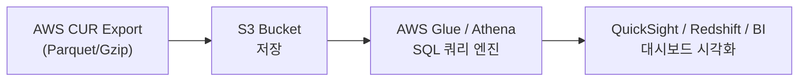
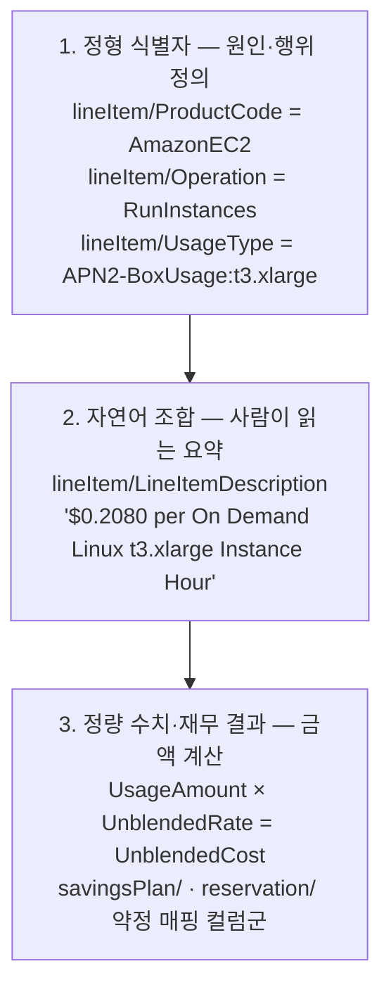
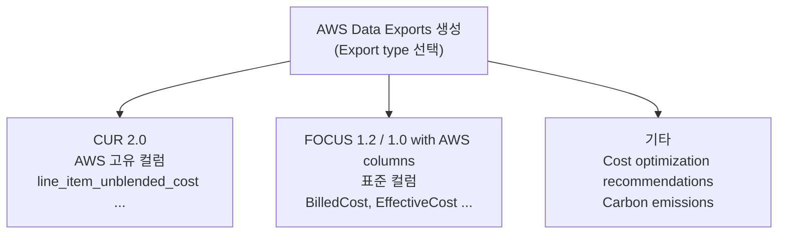
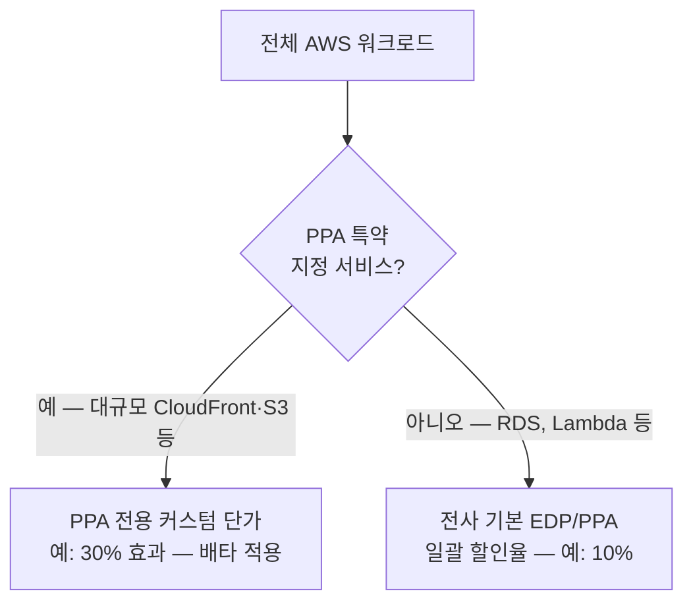
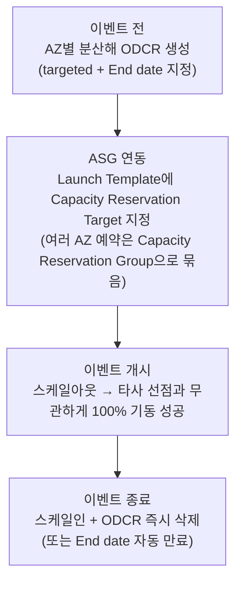
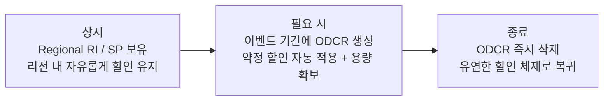
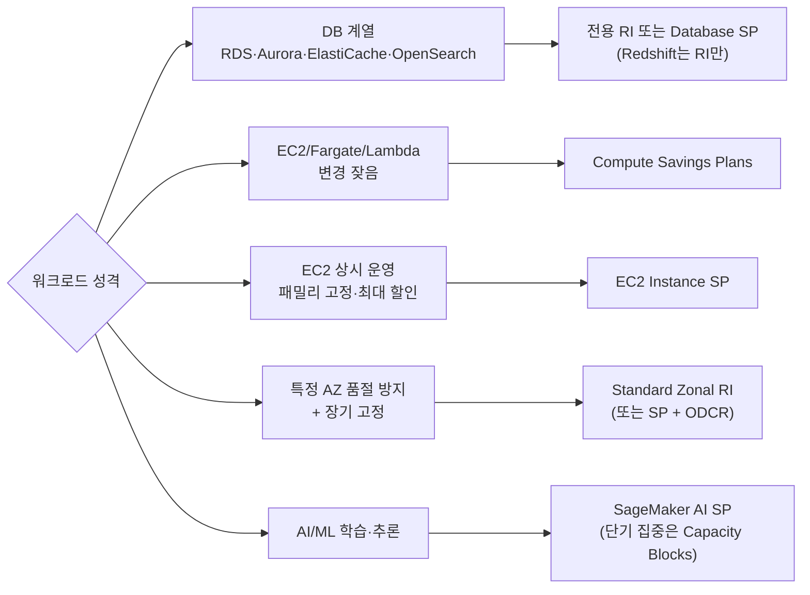
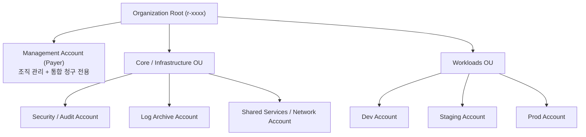
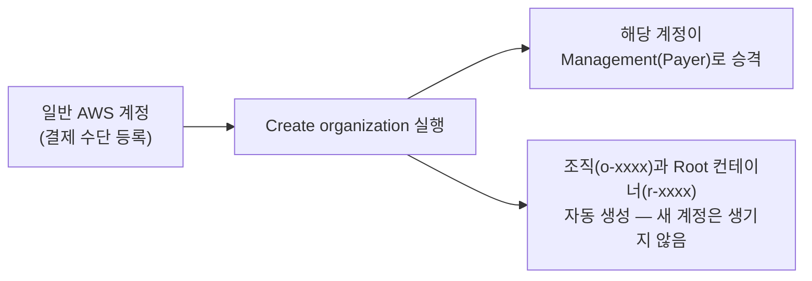
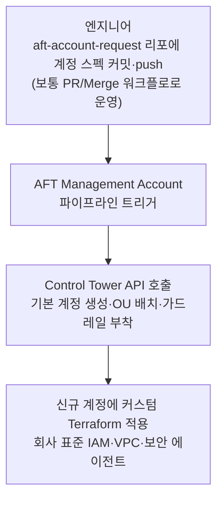

# FinOps 정리(상각, 약정, 용량예약, Payer 구조 등)

"CUR에서 amortized가 뭐야?"라는 질문 하나로 시작해 CUR 스키마, FOCUS 표준, Showback/Chargeback, EDP·PPA, RI vs Savings Plans, Capacity Reservation 운영 전략, 랜딩존 Payer 구조까지 꼬리에 꼬리를 물고 정리했다. 제목 그대로 **상각·약정·용량 예약·Payer 구조** 네 축으로 묶었다.

<!-- more -->

## FinOps란

FinOps는 FinOps Foundation이 정의한 클라우드 재무 관리 문화·실무 체계다. 엔지니어링·재무·비즈니스가 함께 클라우드 비용의 책임을 지고, 데이터 기반으로 "빠른 의사결정과 비즈니스 가치 극대화"를 노리는 것이 핵심이다.

| FinOps 프레임워크 단계 | 내용 | 이 글에서 대응하는 주제 |
|---|---|---|
| Inform (가시화) | 비용 데이터 수집·배분·벤치마킹 | CUR·FOCUS(§2~5), Showback(§6) |
| Optimize (최적화) | 단가·사용량 최적화 | 약정 할인 RI/SP·EDP(§7~9), Rightsizing(§7) |
| Operate (운영) | 거버넌스·프로세스 정착 | Chargeback 배분(§11), Payer·SCP 구조(§12) |

성숙도는 **Crawl(기다) → Walk(걷다) → Run(뛰다)** 3단계로 표현하며, 완벽한 체계를 한 번에 만들기보다 작은 범위에서 시작해 반복적으로 고도화하는 것을 권장한다.

### 이 글의 지도 — 제목의 네 축

| 축 | 섹션 | 핵심 질문 |
|---|---|---|
| 상각 (Amortized) | §1, §4, §5 | 선결제·약정 비용을 어떻게 사용 기간에 배분해 볼 것인가 |
| 약정 (Commitment) | §7~9 | RI vs SP, EDP·PPA — 무엇을 얼마나 약정할 것인가 |
| 용량 예약 (Capacity Reservation) | §10 | 할인과 별개로 물리 용량을 어떻게 보장할 것인가 |
| Payer 구조 (거버넌스) | §12 | 누가 결제하고, 정책(SCP)·계정을 어떻게 통제할 것인가 |

네 축의 데이터 기반이 되는 CUR·Line Item(§2~3)과, 축을 조직에 연결하는 비용 배분(§6, §11)이 그 사이를 잇는다.

---

## 1. Amortized Cost란

AWS CUR(Cost and Usage Report)과 Cost Explorer에서 **Amortized Cost(상각 비용)**는 선급금(Upfront)과 약정 할인(Savings Plans, Reserved Instances) 비용을 계약 기간에 걸쳐 일할(daily) 또는 시간 단위로 균등 분배한 비용을 말한다.

### Unblended vs Amortized

| 구분 | Unblended Cost (청구 기준) | Amortized Cost (상각 기준) |
|---|---|---|
| 관점 | 실제 결제 시점 중심 (현금주의) | 실제 리소스 사용 기간 중심 (발생주의) |
| 예시 | 1년 All Upfront SP $12,000 선결제 → 1일 차에 $12,000, 나머지 364일은 $0 | $12,000 ÷ 365일 → 매일 약 $32.87씩 균등 반영 |

### Amortized Cost가 필요한 이유

| 목적 | 내용 |
|---|---|
| 정확한 부서별 비용 귀속 (Chargeback/Showback) | Payer 계정에서 약정을 일시불 결제해도, 연결 계정·서비스 팀이 실제 혜택 본 만큼 비용을 배분 |
| 비용 트렌드 왜곡 방지 | 결제 당일 그래프가 치솟는(Spike) 현상 제거, 실제 일별/월별 운영 비용을 평탄화해 파악 |
| 미사용 약정 손실(Waste) 추적 | 약정을 맺고 리소스를 안 쓰면 미사용 약정 비용이 일별 손실로 드러나 FinOps 관리 가능 |

---

## 2. AWS CUR 개요

CUR은 AWS에서 제공하는 가장 상세하고 세분화된 원본 비용·사용량 데이터셋이다. Cost Explorer가 요약된 대시보드라면, CUR은 개별 리소스의 시간(Hourly)/일(Daily) 단위 사용량, 단가, 할인 내역, 태그를 행(Row) 단위 원천 데이터로 S3에 내보낸다.

### 핵심 특징

| 특징 | 내용 |
|---|---|
| 최고 수준의 세분성 | 서비스·계정·리전뿐 아니라 개별 리소스 ID(`i-xxx`, `vol-xxx`) 단위로 시간별 비용 추적 |
| 약정·할인 추적 | SP, RI, EDP, 크레딧 등 모든 할인이 리소스별로 어떻게 적용·상각됐는지 확인 가능 |
| 태그 메타데이터 통합 | 활성화된 비용 할당 태그가 컬럼으로 매핑 |
| 주기적 갱신 | 하루 최대 3회 S3로 갱신, 월말 청구 확정 시 최종본으로 마감 (확정 후에도 환불·크레딧·Support 요금 반영 시 재갱신될 수 있음) |

### CUR 1.0 (Legacy) vs CUR 2.0 (Data Exports)

| 비교 항목 | Legacy CUR (1.0) | CUR 2.0 (AWS Data Exports) |
|---|---|---|
| 스키마 구조 | 사용 서비스/태그에 따라 월별 컬럼 수 변동 | 고정 스키마(Fixed Schema) |
| 내보내기 제어 | 전체 일괄 내보내기만 가능 | SQL 유사 쿼리로 원하는 컬럼/행 선택 가능 |
| 표준화 | AWS 전용 컬럼 체계 | FOCUS 표준 내보내기와 같은 엔진 공유 |

### 주요 컬럼 접두어

| 접두어 | 내용 |
|---|---|
| `bill/` | 청구서 ID, Payer Account ID, 청구 기간 등 청구 메타데이터 |
| `lineItem/` | 사용량(UsageAmount), 단가, ResourceId, UnblendedCost 등 |
| `savingsPlan/`, `reservation/` | 약정 할인 혜택, 유효 단가, 선결제 상각 분배액 |
| `pricing/` | 온디맨드 정가(publicOnDemandCost/Rate) |
| `resourceTags/` | 사용자 정의 태그 (`resourceTags/user:Project` 등) |

> 위 `접두어/컬럼` 표기는 legacy CUR(1.0) 기준이다. CUR 2.0(Data Exports)에서는 `line_item_line_item_type`처럼 snake_case 컬럼으로 제공되고, 태그·product 속성은 중첩(nested) 컬럼으로 재구성된다.

### 분석 파이프라인



시각화는 AWS 오픈소스 템플릿인 **CID(Cloud Intelligence Dashboards)**를 QuickSight에 연동하면 C-Level 요약, 약정 최적화, 유휴 자원 대시보드를 빠르게 구축할 수 있다.

---

## 3. Line Item 파헤치기

CUR에서 **Line Item**은 리소스 사용량, 약정 할인, 세금, 크레딧 등 비용이 발생하는 최소 단위의 단일 레코드(행)다. 원본 CUR의 한 행이 곧 하나의 Line Item이다.

### 핵심 lineItem/ 컬럼

| 컬럼 | 내용 |
|---|---|
| `lineItem/LineItemType` | 행의 성격: `Usage`(온디맨드), `SavingsPlanCoveredUsage`/`DiscountedUsage`(약정 적용 사용량), `SavingsPlanRecurringFee`/`RIFee`(약정 요금), `Credit`/`Refund`, `Tax` 등 |
| `lineItem/UsageAmount` | 실제 사용량 수치 (가동 1시간, 전송 10GB 등) |
| `lineItem/UnblendedCost` | 해당 행의 실제 청구 금액 |
| `lineItem/ResourceId` | 비용을 유발한 리소스 식별자 |
| `lineItem/UsageStartDate` / `UsageEndDate` | 비용 발생 시각 |

### lineItem/LineItemDescription

해당 행이 어떤 작업·스펙·과금 항목으로 발생했는지 **사람이 읽을 수 있는 문장**으로 서술한 컬럼이다. 청구서 세부 내역의 텍스트와 동일하다.

- EC2: `$0.4160 per On Demand Linux t3.2xlarge Instance Hour` (서울 요율)
- EBS: `$0.0912 per GB-month of General Purpose SSD (gp3) provisioned storage - Asia Pacific (Seoul)`
- DTO: `$0.126 per GB - Asia Pacific (Seoul) data transfer to Internet`

### Description의 앞뒤 관계 (원인 → 서술 → 결과)



!!! warning "SQL 분석에서 Description을 GROUP BY 하지 말 것"
    설명 텍스트는 리전·OS·단가 변경에 따라 비정형적으로 달라진다. 자동화 분석에는 규격화된 `lineItem/Operation`, `lineItem/UsageType`, `product/instanceType`을 사용하는 것이 표준이다. Description은 청구서 대조·육안 검증용이다.

---

## 4. CUR에는 amortized 단일 열이 없다

CUR 1.0, 2.0(기본 스키마) 모두 `lineItem/amortized` 같은 **단일 통합 상각 열은 존재하지 않는다**. 상각 비용은 Line Item의 성격에 따라 서로 다른 컬럼에 분산 기록되며, 필요 시 SQL로 직접 합산해야 한다.

### 상각 비용이 분산 저장되는 위치

| Line Item 성격 | 상각 비용이 기록되는 컬럼 |
|---|---|
| 일반 온디맨드 (약정 미적용) | `lineItem/UnblendedCost` (청구액 = 상각액) |
| SP 적용 사용량 | `savingsPlan/SavingsPlanEffectiveCost` |
| RI 적용 사용량 | `reservation/EffectiveCost` |
| SP 미사용 약정 손실 | `SavingsPlanRecurringFee` 행에서 `TotalCommitmentToDate - UsedCommitment`로 계산 |
| RI 미사용 손실 | `reservation/UnusedAmortizedUpfrontFeeForBillingPeriod` + `reservation/UnusedRecurringFee` |

### Athena에서 Amortized Cost 재현 쿼리

Cost Explorer의 Amortized Cost를 CUR에서 재현하는 표준 공식이다.

```sql
SELECT
    SUM(
        CASE
            WHEN line_item_line_item_type = 'SavingsPlanCoveredUsage'
                THEN savings_plan_savings_plan_effective_cost
            WHEN line_item_line_item_type = 'SavingsPlanRecurringFee'
                THEN savings_plan_total_commitment_to_date - savings_plan_used_commitment
            WHEN line_item_line_item_type = 'SavingsPlanNegation'  THEN 0
            WHEN line_item_line_item_type = 'SavingsPlanUpfrontFee' THEN 0
            WHEN line_item_line_item_type = 'DiscountedUsage'
                THEN reservation_effective_cost
            WHEN line_item_line_item_type = 'RIFee'
                THEN reservation_unused_amortized_upfront_fee_for_billing_period
                     + reservation_unused_recurring_fee
            WHEN line_item_line_item_type = 'Fee'
                 AND reservation_reservation_a_r_n <> '' THEN 0
            ELSE line_item_unblended_cost
        END
    ) AS amortized_cost
FROM cur_table
```

> 표준 재현식이지만, CUR과 Cost Explorer의 갱신 시점·당월 미확정 데이터 차이로 소수점 수준의 오차는 발생할 수 있다.

### 왜 단일 열을 안 주는가

| 이유 | 설명 |
|---|---|
| 원천 회계 데이터의 무결성 | CUR은 감사 가능한 청구 원장. 현금주의(실결제)와 발생주의(상각 계산 결과)를 한 컬럼에 섞으면 인보이스와의 합계 검증(Reconciliation) 불가 |
| 약정 메커니즘의 차이 | RI는 리소스 규격 기반, SP는 시간당 금액 기반으로 상각·배분 규칙이 완전히 달라 별도 네임스페이스로 분리 |
| 실사용 상각과 미사용 손실의 분리 | 단일 열로 뭉개면 "효율적으로 사용된 상각액"인지 "약정을 못 채워 날린 손실"인지 구분 불가 |

단일 열이 필요하면 SQL 뷰를 만들거나, **FOCUS 표준 내보내기의 `EffectiveCost`**를 쓰면 된다.

---

## 5. FOCUS 표준 — CUR 2.0과는 다른 것

흔한 오해: "CUR 2.0 = FOCUS라서 3사 컬럼명이 같다" → **절반만 맞다.**

- **CUR 2.0**은 여전히 AWS 고유 컬럼 체계(`lineItem/...`)를 유지한다. 스키마 고정 + SQL 선택 기능이 추가된 것뿐이다.
- **FOCUS**(FinOps Open Cost and Usage Specification)는 FinOps Foundation 주도로 AWS·Microsoft·Google이 함께 만든 오픈 표준이며, **AWS Data Exports에서 FOCUS 테이블을 별도 Export type으로 선택**해야 표준 컬럼으로 출력된다. 2026년 현재 Data Exports는 CUR 2.0 외에 **FOCUS 1.2(권장)/1.0**, Cost optimization recommendations, Carbon emissions 테이블을 제공한다(FOCUS 스펙 자체의 최신 릴리스는 1.4).



### FOCUS 4대 비용 컬럼

FOCUS에도 `amortized`라는 열은 없다. 상각 개념은 `EffectiveCost`로 표준화됐다.

| FOCUS 컬럼 | 기존 AWS 개념 | 설명 |
|---|---|---|
| `BilledCost` | Unblended Cost | 인보이스에 청구된 실제 결제 기준 비용 |
| `EffectiveCost` | Amortized Cost | 선결제 상각 + 모든 할인 반영된 실효 비용 (계산 완료 상태로 제공) |
| `ListCost` | publicOnDemandCost | 할인이 전혀 없는 공식 정가 기준 비용 |
| `ContractedCost` | 협정 단가 기준 | EDP/PPA 협정 단가 기준 비용 |

### 3사 컬럼 매핑

| 의미 | AWS CUR | Azure | GCP | FOCUS (3사 공통) |
|---|---|---|---|---|
| 청구 금액 | `lineItem/UnblendedCost` | `CostInBillingCurrency` | `cost` | `BilledCost` |
| 실효 비용 | savingsPlan/reservation 컬럼 조합 계산 | Amortized 데이터셋의 `CostInBillingCurrency` | 자체 계산 필요 | `EffectiveCost` |
| 서비스명 | `product/servicecode` | `MeterCategory` | `service.description` | `ServiceName` |
| 리소스 ID | `lineItem/ResourceId` | `ResourceId` | `resource.name` | `ResourceId` |
| 계정 ID | `lineItem/UsageAccountId` | `SubscriptionId` | `project.id` | `SubAccountId` |

> Azure 네이티브 스키마에는 `EffectiveCost` 열이 없으며(FOCUS 내보내기 전용 컬럼) 상각 값은 별도의 Amortized cost 데이터셋으로 제공된다. GCP `cost`는 크레딧이 별도 필드라 인보이스 금액은 `cost + credits.amount` 합산이 필요하고, `resource.name`은 Detailed export에만 존재한다.

멀티클라우드를 하나의 테이블/대시보드로 관리하려면 CUR 2.0이 아닌 **FOCUS 내보내기**를 선택해야 한다.

---

## 6. Showback / Chargeback — 비용 배분의 시작

클라우드 비용을 실제 소비한 부서·팀에 투명하게 귀속시키는 FinOps 비용 배분 방식이다. 핵심 차이는 **"실제 부서 예산에서 돈을 차감하느냐, 보고서로 보여주기만 하느냐"**.

| 구분 | Showback (비용 가시화) | Chargeback (내부 정산) |
|---|---|---|
| 개념 | 팀별 사용 비용을 리포트/대시보드로 시각화 | 부서 예산/손익(P&L)에서 실제 차감 |
| 자금 이동 | 없음 (중앙이 일괄 결제) | 있음 (내부 회계 전표 처리) |
| 목적 | 비용 인식 제고, 낭비 식별, 자발적 최적화 | 부서별 손익 계산, 책임 경영, 리소스 남발 억제 |
| 장점 | 도입이 빠르고 회계 연동 부담 적음 | 팀이 낭비에 직접 재무 책임을 짐 |
| 단점 | 강제성이 없어 절감 동기 약함 | 정밀한 태깅·회계 프로세스 구축 난이도 높음 |

일반적인 도입 순서는 다음과 같다.


### 관련 용어

| 용어 | 설명 |
|---|---|
| Shameback | 리소스 낭비가 심한 팀 목록을 전사 공개해 자발적 개선을 유도하는 Showback 변형 (공식 용어라기보다 커뮤니티 속어) |
| Cost Allocation | 전체 청구 금액을 부서·프로젝트·환경·애플리케이션 등 비즈니스 단위에 매핑하는 프로세스 |
| Cost Center | 수익을 직접 창출하지 않지만 비용이 발생하는 단위. 배분의 기준 단위 |
| Shared Costs | NAT Gateway, 중앙 로깅, 보안 솔루션 등 1:1 매핑이 어려운 공통 비용을 규칙에 따라 안분 |
| Untagged Costs | 태그 누락으로 귀속 불명인 비용. FinOps 성숙도 지표로 미태깅 비율을 관리 |

---

## 7. 비용 지표·FinOps 용어 모음

### 청구 금액 유형 (CUR 관점)

| 용어 | 설명 |
|---|---|
| Unblended Cost | 계정 단위 실제 청구 단가 기준 비용 |
| Blended Cost | Organizations 통합 결제 내 전체 사용량을 합산한 '평균 단가' 기준. 공식 폐기는 아니지만 왜곡 가능성 때문에 실무에서는 사용을 피하는 추세 |
| Net Amortized Cost | Amortized Cost에 EDP/PPA 등 협상 할인까지 반영한 순상각 비용 (CUR의 `NetEffectiveCost` 계열 컬럼) |
| List Cost / On-Demand Cost | 할인 전 정가. 절감액(Savings) 계산의 기준선(Baseline) |

### 약정·효율성 지표

| 용어 | 설명 |
|---|---|
| Commitment-based Discounts (CBD) | 1년/3년 약정으로 대폭 할인받는 모든 모델 총칭 (AWS SP/RI, Azure Reservations, GCP CUD) |
| Spend-based Commitment | 시간당/연간 지출 금액을 약정 (Compute SP, GCP Spend-based CUD). 유연성 높음 |
| Resource-based Commitment | 특정 리전·패밀리·사이즈를 지정해 약정 (Standard RI, GCP Resource-based CUD). 할인율 높고 유연성 낮음 |
| Coverage (약정 적용률) | 전체 워크로드 중 약정 할인을 받는 비율. 통상 70~80% 이상 목표 |
| Utilization (약정 사용률) | 구매한 약정 중 실제 소진된 비율. 95% 이상이 건강한 상태 |
| Commitment Expiration | 약정 만료 시점 추적. 만료 당일 온디맨드로 튕겨 비용 급증하는 것 방지 |
| Unused Commitment | 약정을 맺고 리소스를 안 써서 허공에 날린 순수 손실 비용 |
| Unit Economics | 비용을 비즈니스 지표와 연계 (사용자 1명당 인프라 비용 등) |

### 낭비 제거·최적화

| 용어 | 설명 |
|---|---|
| Zombie Resource | 일을 안 하는데 비용만 내는 리소스 (미연결 EBS, 트래픽 없는 LB, 고아 EIP) |
| Rightsizing | 실사용률 기반으로 과잉 프로비저닝된 스펙을 하향/최적 타입 변경 |
| Rate Optimization | 사용량은 그대로 두고 약정·Spot·EDP로 '단가($/hr)'만 낮추는 작업 |
| Usage Optimization | 삭제·스케줄링·아키텍처 개선으로 '사용량 자체'를 줄이는 작업 |
| Parking / Auto-stopping | 야간·주말에 개발계 자동 정지로 60~70% 절감하는 자동화 기법 |
| Over-provisioning | 피크 대비 과도한 사양·용량 사전 할당으로 인한 구조적 비효율 |

### 회계 관점

| 용어 | 설명 |
|---|---|
| CapEx | 서버·데이터센터 등 자산 구매의 일시불 투자 비용 (수년간 감가상각) |
| OpEx | 클라우드 사용료처럼 일상 운영에서 지속 발생하는 비용 (당기 비용 처리) |
| True-up | 예측 기반 선지급/가상 배분 비용을 마감 시점에 실사용량과 비교해 차액 보정 |

### 네트워크·컨테이너 비용

| 용어 | 설명 |
|---|---|
| Container Cost Allocation | 공유 K8s 클러스터 비용을 Pod/Namespace의 Request·Usage 비율로 팀별 배분 (Kubecost/OpenCost, AWS Split Cost Allocation Data for EKS) |
| Data Transfer Out (DTO) | 인터넷/타 리전으로 내보내는 트래픽 비용. 예측 어려운 대표적 변동 비용 |
| Inter-AZ Transfer | 동일 리전 내 AZ 간 통신에 GB당 발생하는 내부 네트워크 비용 |
| Credit Burn-rate | 프로모션 크레딧의 월별 소진 속도·잔여 유효기간 추적 지표 |

---

## 8. EDP와 PPA

둘 다 일정 지출(Commitment)을 약정하고 추가 할인을 받는 프라이빗 계약이지만, 할인이 적용되는 **범위(Scope)**가 다르다.

| 구분 | EDP (Enterprise Discount Program) | PPA (Private Pricing Agreement) |
|---|---|---|
| 적용 범위 | 전사적/포괄적 — 전체 AWS 사용 금액 | 특정 서비스/리소스 단위 |
| 할인 구조 | 전사 총 지출액에 일괄 % 할인 | 특정 사용 유형에 커스텀 단가 |
| 약정 기준 | 연간/다년 총 지출 금액($) | 특정 서비스 사용량(GB, 시간) 또는 지출액 |
| 주요 대상 | 다방면 대규모 워크로드 엔터프라이즈 | 특정 리소스가 기형적으로 큰 기업 (대규모 CDN/스토리지) |
| 위험 요소 | Shortfall(약정 미달 시 차액 위약금) | 사용량 감소·아키텍처 변경 시 약정 이행 문제 |

참고로 최근에는 EDP가 **PPA(Private Pricing Agreement)라는 상위 명칭으로 흡수·통용**되는 추세이며, 하나의 PPA 계약 안에 '전사 기본 할인'과 '특정 서비스 전용 할인' 조항이 함께 들어간다. 다만 EDP/PPA는 비공개 사적 계약이라 AWS 공식 문서로 규정된 체계가 아니고, 세부 조건은 계약마다 다를 수 있다.

!!! danger "동일 항목에 EDP + PPA 이중 할인(Stacking)은 불가"
    동일한 Line Item에 EDP %를 깎고 그 위에 PPA %를 다시 곱하는 방식은 불가능하다. 특약 지정 서비스는 PPA 커스텀 단가가 **배타적으로** 적용되고, 그 외 서비스는 전사 기본 할인율이 적용되는 **서비스별 분기(Hybrid)** 구조다.



### 실제 중첩 가능한 할인 조합

| 조합 | 중첩 가능 | 작동 방식 |
|---|---|---|
| EDP(전사) + PPA(특정 서비스) | 불가 (배타적) | 특약 서비스는 PPA 단가 우선, 나머지는 EDP |
| EDP/PPA + Savings Plans | 가능 | SP 할인가 적용 후 잔여 금액에 계약 % 할인 반영 |
| EDP/PPA + Reserved Instances | 가능 | RI 적용 후 결제 금액에 계약 할인 반영 |

---

## 9. RI vs Savings Plans — 약정 메커니즘

가장 근본적인 차이는 **무엇을 기준으로 약정하느냐**다.

- **RI**: 리소스 단위(인스턴스 규격/수량) 약정 — "특정 규격의 인스턴스를 확보하겠다"
- **SP**: 금액 단위(시간당 지출액 $/hr) 약정 — "컴퓨팅에 시간당 최소 $X를 쓰겠다"

### RI 분류는 2축 조합이다

RI의 종류는 평면 나열이 아니라 **오퍼링 클래스(Standard/Convertible) × 적용 범위(Regional/Zonal)** 조합으로 결정된다.

| 구분 | Standard Zonal | Standard Regional | Convertible Zonal | Convertible Regional | 비-EC2 RI (RDS 등) |
|---|---|---|---|---|---|
| 최대 할인율 (3년) | ~72% | ~72% | ~66% | ~66% | 서비스별 상이 |
| 물리 용량 보장 | O (자동) | X | O (자동) | X | X |
| 크기 유연성 | X | O (Linux/공유 테넌시) | X | O (Linux/공유 테넌시) | 일부 엔진 지원 |
| 패밀리/OS 변경 | X | X | O (Exchange) | O (Exchange) | X |
| Marketplace 재판매 | O (수수료 12%) | O (수수료 12%) | X | X | X |
| 지원 서비스 | EC2 | EC2 | EC2 | EC2 | RDS, ElastiCache, Redshift, OpenSearch 등 |

> Regional RI의 크기 유연성은 Linux/UNIX + 공유(기본) 테넌시 조건에서만 적용되며, 일부 GPU/가속기 패밀리(G·P·Inf 등)는 Regional이어도 크기 유연성이 지원되지 않는다.

### SP 4종 비교

2025년 12월 **Database Savings Plans**가 추가되어 SP는 이제 4종이다.

| 항목 | Compute SP | EC2 Instance SP | SageMaker AI SP | Database SP |
|---|---|---|---|---|
| 지원 서비스 | EC2 + Fargate + Lambda | EC2 단독 | SageMaker AI 단독 | Aurora·RDS·DynamoDB·ElastiCache·DocumentDB·Neptune·Keyspaces·Timestream·DMS·OpenSearch |
| 최대 할인율 | ~66% (3년) | ~72% (3년) | ~64% (3년) | ~35% (1년·No Upfront, 서버리스 기준) |
| 리전/패밀리 유연성 | 전 리전·전 패밀리 자동 | 단일 리전·단일 패밀리 고정 | 모든 ML 인스턴스 자동 | 엔진·패밀리·리전 유연 |
| 용량 예약 | X (ODCR 별도 연동) | X (ODCR 별도 연동) | X | X |
| 재판매 | 불가 | 불가 | 불가 | 불가 |

재판매는 전부 불가지만, **시간당 약정 $100 이하 SP는 구매 후 7일 이내(동일 달력월)에 반품 가능**하다(100% 환불, 관리 계정당 연 10회 한도).

### 작동 방식 차이

| 구분 | SP (동적 자동 흡수) | RI (정적 매핑) |
|---|---|---|
| 적용 방식 | 매시간 실행 중인 컴퓨팅을 스캔해 **할인율이 가장 큰 리소스부터** 약정 금액 소진까지 자동 적용 | 조건이 일치하는 인스턴스에 1:1 매핑 |
| 인프라 변경 시 | 패밀리·리전·컴퓨팅 형태(EC2→Fargate/Lambda)가 바뀌어도 할인 유지 | 인스턴스를 바꾸면 RI가 Unused로 방치 |
| 크기 변경 | 자동 흡수 | 동일 패밀리 내 크기 변경만 정규화 팩터(Normalization Factor)로 자동 분할/병합 |

### 자주 틀리는 오개념 검증

!!! note "오개념 체크"
    - **"Compute SP가 무조건 좋다?"** → 아니다. 유연성 최고지만 할인율 ~66%. EC2 Instance SP는 패밀리/리전 고정 대신 Standard RI급 ~72%.
    - **"SP로 RDS·Redis도 할인?"** → 이제 가능. 2025-12 출시된 **Database SP**가 Aurora·RDS·DynamoDB·ElastiCache·DocumentDB·OpenSearch 등을 커버한다(최대 35%). 단 **Redshift는 여전히 전용 RI(예약 노드)만** 가능하며, 할인 폭이 더 필요하면 서비스 전용 RI와 비교해 선택한다.
    - **"Convertible RI vs Compute SP?"** → 유연성은 유사하나 Convertible은 수동 교환(Exchange) 필요, SP는 완전 자동. 그래서 신규 EC2 약정에서 Convertible RI를 새로 살 유인은 크게 줄었다(AWS 공식 문서도 RI보다 SP를 권장한다).

### RI는 24×7 계약이다

RI는 인스턴스를 켰는지와 무관하게 **계약 기간 내내 매시간(1년 8,760시간) 비용을 지불**하는 조건이다. 안 쓴 시간의 혜택은 이월·환불 없이 매시간 소멸한다.

| 운영 방식 | 연간 가동률 | 비용 (온디맨드 $100 기준) | 결과 |
|---|---|---|---|
| 24×7 가동 + RI (할인 40% 가정) | 100% | $60 | 상시 운영 시 최적 |
| 평일 주간만 가동 + 온디맨드 | ~27% | $27 | RI보다 훨씬 저렴 |
| 연 180일 24시간 + 온디맨드 | ~49% | $49 | RI($60)보다 저렴 |

**손익분기 기준**: 할인율 40%라면 가동률 60% 이상일 때만 RI가 이득. 그 밑이면 스케줄링(끄고 켜기)이 정답이다.

### 변경 시 비용 발생 여부

| 시나리오 | Standard RI | Convertible RI | 비용 |
|---|---|---|---|
| 동일 패밀리 내 크기 변경 | 가능 | 가능 | $0 (Regional은 자동, Zonal은 Modify) |
| 패밀리/OS/테넌시 변경 | 불가 (매각만) | 가능 (Exchange) | Standard: 판매 수수료 12% / Convertible: '동등 이상 가치' 규칙에 따른 차액만 |
| 리전 변경 | 불가 | 불가 (리전은 약정 기간 내내 고정) | — |
| 약정 수량 축소·중도 해지 | 불가 | 불가 | 환불 불가, 잔여 기간 100% 과금 |

Convertible Exchange는 신규 약정 가치가 기존보다 **크거나 같아야** 승인되며, 더 저렴한 쪽으로 줄여 환불받는 것은 불가능하다.

---

## 10. 용량 확보 — Capacity Reservation, Capacity Blocks, Zonal RI

### On-Demand Capacity Reservation (ODCR)

특정 AZ에 원하는 사양의 EC2 자리(슬롯)를 물리적으로 선점해, 트래픽 급증·장애 조치 시 `InsufficientInstanceCapacity`(ICE) 오류를 방지하는 기능이다.

**과금 원리 (핵심)**:

| 상태 | 과금 |
|---|---|
| 예약 자체 수수료 | $0 (별도 수수료 없음) |
| 인스턴스 실행 중 | 일반 실행 요금만 발생 (SP/RI 있으면 할인 적용) |
| 슬롯을 비워두면 | 실행 안 해도 해당 인스턴스의 **온디맨드 요율 100% 그대로 청구** |

**주요 속성**:

| 속성 | 내용 |
|---|---|
| 활성화 | 즉시형은 생성 즉시 Active + 과금 시작. 재고 없으면 즉시 ICE 오류로 실패 (승인 대기 개념 없음) |
| 종료일(End date) | 선택 사항: 수동 취소 방식 또는 특정 시각 자동 삭제 |
| 소비 방식 | `open`(조건 일치 인스턴스가 자동 소비) / `targeted`(예약 ID를 지정한 인스턴스만 소비) |
| 계정 공유 | AWS RAM으로 멀티 계정 공유 가능 |
| future-dated CR | 2024-11부터 미래 시작 시점 지정 예약 지원. 단 assessment를 거쳐 `assessing → scheduled`로 전환되고, 최소 약정 기간(commitment duration)이 있으며 기간 중 취소 시 취소 수수료가 발생할 수 있어 즉시형과 규칙이 다름 |

**"그냥 EC2 띄우는 거랑 뭐가 달라?"**:

| 구분 | 일반 EC2 직접 기동 | ODCR |
|---|---|---|
| 자원 점유 | 실행 중일 때만 자리 차지 | 실행 여부와 무관하게 슬롯 선점 |
| 인스턴스 Stop 시 | 자원 회수 → 재기동 실패 위험 | 슬롯 유지 → 100% 재기동 보장 |
| Auto Scaling | AWS 재고 품절 시 스케일아웃 실패 | 예약 풀 내 무조건 성공 |
| 용도 | 일상 가동 | 품절 방지, DR 페일오버, 이벤트 대비 |

!!! note "Active 상태의 의미"
    인스턴스를 띄우면 예약이 사라지는 게 아니라 내부의 **AvailableInstanceCount만 감소**한다. 인스턴스를 끄면 다시 증가하고, 예약 자체는 수동 취소하거나 종료일에 닿기 전까지 계속 `active`로 과금된다. 주차장의 '영업 중' 상태와 '빈 주차면 수'의 관계다.

### 대규모 이벤트에서의 ODCR 운영



| 주의사항 | 이유 |
|---|---|
| 너무 일찍 만들지 말 것 | 생성 시점부터 빈 슬롯 온디맨드 과금 시작 |
| 단일 AZ 몰빵 금지 | 고가용성을 위해 2~3개 AZ 균등 분산 |
| 초대형 이벤트는 사전 조율 | AWS IEM(Infrastructure Event Management)으로 리전 공급량 조율 |

!!! tip "End date는 계약 기간이 아니라 안전장치다"
    즉시형 ODCR은 **언제든 위약금 없이 즉시 취소·수정 가능**하다(future-dated 예약은 약정 기간·취소 수수료 규칙이 별도다). 이벤트가 조기 종료되면 인스턴스 정리 후 바로 예약을 삭제하면 그 시점부터 과금이 끊긴다. End date는 "삭제를 깜빡했을 때 무기한 과금을 막는 최대 안전선"으로 걸어두는 것이고, 이벤트가 연장되면 만료 전 End date를 늦추면 된다.

### EC2 Capacity Blocks for ML

공급이 부족한 고성능 GPU/가속기 인스턴스(P6·P5·P4d·Trn 계열, UltraServer 등)를 **미래 시점에 확정 예약**하는 서비스다.

| 항목 | 내용 |
|---|---|
| 과금 방식 | 예약 수수료가 따로 붙는 게 아니라 **예약 기간 전체 사용료를 선불 일괄 결제** |
| 이중 과금 | 블록 기간 중 인스턴스 실행 시 온디맨드 비용 중복 발생 없음 |
| 미사용 리스크 | 안 쓰거나 일찍 끝내도 **전액 과금, 취소·환불 불가** |
| 부가 리소스 | EBS·데이터 전송 등은 별도 청구 |
| 단가 | 수요·공급에 따른 동적 단가 (구매 후 고정) |
| 예약 기간 | 1일 단위 1~14일 또는 7일 배수로 최대 182일(약 6개월), 최대 8주 전 사전 예약·기간 연장(extend) 지원 — 출시 초기 1~14일 제한에서 확장 |

| 구분 | ODCR | Capacity Blocks for ML |
|---|---|---|
| 목적 | 상시/단기 일반 EC2 용량 확보 | 단기 AI/ML 학습·파인튜닝용 GPU 확보 |
| 대상 | 범용 EC2 | 고성능 GPU/가속기 |
| 기간 | 오픈엔드 (원할 때 생성/삭제) | 1~182일 사전 예약 (1~14일 또는 7일 배수) |
| 과금 | 온디맨드 후불 | 선불 일괄 결제 |
| 취소 | 언제든 가능 | 불가 |

### Zonal RI vs Regional RI — 용량 보장은 자동이 아니다

"RI면 용량이 보장된다"는 틀린 가정이다. **Scope에 따라 갈린다.**

| 항목 | Zonal RI | Regional RI | ODCR |
|---|---|---|---|
| 용량 보장 | O (약정 기간 내내 자동) | **X (0%)** | O (삭제 전까지) |
| 할인 | 최대 72% | 최대 72% | 없음 (온디맨드 단가) |
| 약정 | 1/3년 고정 | 1/3년 고정 | 없음 |
| 크기 유연성 | X | O | X |
| 위치 | 특정 AZ 고정 | 리전 내 전 AZ 커버 | 특정 AZ 고정 |

### Regional RI + ODCR 조합 — 할인 자동 적용

인스턴스 속성(인스턴스 타입·플랫폼(OS)·테넌시·AZ)이 일치하면, Regional RI(또는 SP)의 할인이 ODCR에 **자동 매핑**된다(크기 유연성이 적용되는 Linux/공유 테넌시 Regional RI는 패밀리 수준 매칭까지 커버). 슬롯이 비어 있을 때도 온디맨드 정가가 아닌 **RI 할인 요율**이 적용돼 손실이 최소화되며, 할인은 실행 중인 인스턴스에 우선 적용된 후 미사용 슬롯을 커버한다. 단, **Zonal RI의 할인은 ODCR에 적용되지 않는다**.



**"그럼 RI 기간 내내 ODCR을 걸어두면 되지 않나?"** — 기술적으로 가능하지만 다음 문제가 있다.

| 문제 | 설명 |
|---|---|
| 목적 중복 | 1년 내내 특정 AZ 고정이면 애초에 **Zonal RI 하나로 끝** (동일 효과 + 관리 공수 제로) |
| 재배치 실패 리스크 | ODCR을 재배치하는 순간 새 AZ에 재고가 없으면 ICE로 실패 가능 |
| 비용 누수 (휴먼 에러) | 인프라 변경 시 ODCR 정리를 깜빡하면 빈 슬롯 온디맨드 과금이 계속 발생 |

IaC(Terraform)로 ODCR 라이프사이클을 완벽 자동화할 수 있다면 유효한 전략이지만, 실무 표준은 **"평소 SP로 유연성 극대화 → 이벤트·핵심 DB에만 선별적으로 ODCR 일시 결합"**이다.

### 워크로드별 최종 선택 가이드



---

## 11. FinOps 실무 — 약정 배분과 Chargeback 시나리오

중앙에서 약정을 일괄 구매했을 때, 어떤 금액 기준으로 각 부서에 배분할지가 실무의 핵심이다.

### 3대 내부 과금 모델

| 모델 | 메커니즘 | 장점 | 단점 |
|---|---|---|---|
| 실효 비용 배분 (EffectiveCost) | 상각·할인 반영된 실효 비용을 그대로 청구 | 부서가 절감 혜택을 온전히 체감 | 약정 풀 변동으로 단가가 매달 미세 변동 |
| 정가 청구 + 차액 환수 (List Cost Arbitrage) | 부서엔 온디맨드 정가 청구, 할인 마진은 중앙이 환수 | 청구액 예측 쉬움, 수식 단순 | 부서의 최적화 동기 약화 |
| 비례 배분 (Proportional) | 전사 할인 총액을 사용량 비중대로 균등 분배 | 전 팀이 동일 유효 할인율 공유 | 특정 팀 기여도 반영 안 됨 |

### 시나리오별 전략

| 시나리오 | 상황 | 배분 전략 |
|---|---|---|
| A. 중앙 SP 일괄 구매 | Payer에서 전사 SP를 일괄 체결 | 사용된 약정은 EffectiveCost로 사용 계정에 100% 매핑. 미사용 손실(Unused Commitment)은 ① 예측 실패 부서에 귀책 청구 또는 ② 전사 공통비로 사용 비율대로 안분 |
| B. 멀티테넌트 EKS | 여러 팀이 하나의 클러스터 공유, CUR에는 노드 비용만 기록 | Kubecost/OpenCost 또는 AWS Split Cost Allocation Data로 Pod/Namespace별 점유율을 측정해 노드 EffectiveCost를 분할 Chargeback. 시스템 데몬셋·유휴 자원은 플랫폼 공통비로 비례 배분 |
| C. 이벤트용 ODCR | 사업부 요청으로 용량 예약 생성 | 미사용 슬롯 과금(예측 실패분)은 해당 사업부에 100% 직접 전가 → 용량 예약 남발(모럴 해저드) 차단 |
| D. 독립 예산 부서 혼합 | R&D는 자체 예산, 일반 팀은 중앙 풀 | R&D 전용 약정은 해당 계정에 직접 귀속(할인 공유 OFF), 일반 서비스 부서는 Payer 공유 풀(할인 공유 ON)로 유연 배분 |

### 미사용 약정·공통비 정산 모델 비교

| 정산 모델 | 장점 | 단점 | 적용 대상 |
|---|---|---|---|
| 직접 귀책 (Direct Allocation) | 책임감 극대화, 과잉 약정 억제 | 부서 간 갈등 유발 | 이벤트성 ODCR, 전용 RI |
| 비례 안분 (Proportional Split) | 수식 명확, 합의 쉬움 | 남의 낭비를 일부 떠안음 | 전사 공용 인프라 |
| 중앙 흡수 (Central Absorption) | 개발팀의 약정 거부감 해소 | 중앙 예산 적자, 비용 둔감화 | FinOps 도입 초기 (Showback 단계) |

---

## 12. 랜딩존과 Payer 계정

### Payer는 Management Account다

랜딩존(AWS Organizations / Control Tower)에서 **Management Account(관리 계정, 구 Master)가 곧 Payer(청구/결제) 계정**이다. 같은 12자리 계정 하나를 거버넌스 관점에서 부르면 Management, 재무 관점에서 부르면 Payer일 뿐이며, 조직 내부에서 결제 기능만 하위 멤버 계정으로 분리·위임하는 것은 불가능하다(예외적으로 최근 도입된 **Billing Transfer**로 조직 외부의 별도 관리 계정에 청구 관리·지불을 이전하는 것은 가능하다).



**Management를 Payer로 잡고 워크로드를 0으로 비우는 이유**:

| 이유 | 설명 |
|---|---|
| 구조적 강제 | Consolidated Billing은 Organizations를 생성한 Management Account가 결제 수단을 소유하는 구조로 고정 |
| 폭발 반경 격리 | 이 계정은 SCP 통제를 받지 않고 하위 계정 전체를 장악할 수 있는 절대 권한 보유 → 침해 시 전 조직 탈취. 워크로드 배포 금지 |
| 볼륨 할인·약정 통합 | S3·DTO 등 사용량이 전 계정 합산으로 상위 할인 티어 진입, Payer에서 산 SP가 전 계정 사용량에 자동 흡수 |
| 직무 분리·감사 | 조직 전체가 합산된 CUR/FOCUS는 Payer에서만 생성 가능 → 전사 회계 데이터의 단일 원천 유지 (멤버 계정도 자기 데이터만 담긴 CUR은 만들 수 있으며, 필요 시 SCP로 차단) |

| Management(Payer) 운영 원칙 | 내용 |
|---|---|
| 리소스 배포 | EC2/VPC/RDS 등 워크로드 생성 금지 (0대 유지) |
| 루트 사용자 | 로그인 금지, 하드웨어 MFA 후 금고 보관 |
| 액세스 | IAM User 금지, IAM Identity Center(SSO) 임시 자격 증명만 |
| 역할 | Organizations·Control Tower 관리, 통합 청구, CUR 출력 |

### Root는 계정이 아니다

| 용어 | 실체 | Payer 여부 |
|---|---|---|
| Organization Root (`r-xxxx`) | 조직 트리 최상위 **논리적 컨테이너** (로그인 불가, 리소스 생성 불가) | X |
| Management Account | 조직을 생성·소유한 실제 12자리 계정 | **O** |
| Root User | 각 계정마다 1개 존재하는 이메일 기반 최고 관리자 자격 증명 | X |

생성 순서도 "Root가 있어서 조직을 만드는" 게 아니라 그 반대다.



이때 총 계정 수는 1개로 유지되며, Management Account는 이후 다른 계정으로 교체할 수 없다(조직 트리 내 배치 위치는 옮길 수 있지만, 어디에 두든 SCP는 적용되지 않는다).

### SCP는 어디에 적용하고, 어디서 관리하나

**적용 위치 (Attach 대상)**: Root, OU, 개별 멤버 계정 3곳.

| 적용 위치 | 권장 정책 예시 |
|---|---|
| Root | 허용 리전 외 차단, CloudTrail/보안 로그 삭제 금지, 하위 계정 루트 사용자 차단 |
| Prod OU | MFA 없는 삭제 API 차단, 미검증 서비스 제한 |
| Dev OU | 고비용 GPU/대형 인스턴스 생성 금지 |
| Sandbox OU | 온프레미스 연동 차단, Egress 제한 |
| 개별 계정 | 특수 예외 격리 시에만 (개별 부착 남발은 안티패턴, OU 단위가 원칙) |

**관리 주체 (생성·수정·부착 가능한 계정)**: Management Account 또는 **Delegated Administrator**(보안 계정 등에 정책 관리 위임) 두 곳뿐이다. 일반 멤버 계정은 자신에게 걸린 SCP를 보거나 해제할 수 없다.

!!! warning "Management Account에는 SCP가 적용되지 않는다"
    Root에 SCP를 걸어도 Management Account 자체는 100% 무효화(Bypass)된다. 잘못된 Deny로 조직 전체가 영구 잠기는 사태를 방지하기 위한 설계다. 따라서 Management 계정 보안은 SCP가 아닌 SSO 접근 통제 + 루트 잠금(MFA)으로 지켜야 한다.

**평가 규칙**: 상위에서 Explicit Deny된 액션은 하위 IAM이 AdministratorAccess여도 절대 실행 불가. 반대로 Root부터 계정까지 전 계층에서 Allow 체인이 끊기지 않아야 권한이 유효하다.

### Account Factory는 어디서 실행하나

Control Tower의 Account Factory는 표준 가드레일이 사전 적용된 신규 계정을 자동 프로비저닝한다.

| 구분 | 콘솔 (Control Tower GUI) | Service Catalog | AFT (Account Factory for Terraform) |
|---|---|---|---|
| 실행 위치 | Management Account | Management Account | **전용 AFT Management Account (멤버 계정)** |
| 인터페이스 | 웹 콘솔 | 콘솔/CLI (Launch 권한 위임 가능) | Git Repo (GitOps) |
| 커스터마이징 | 기본 베이스라인 수준 | 기본 수준 | 무제한 (커스텀 Terraform 전체 배포) |
| 적합 환경 | 계정 10개 미만 초기 구축 | 중앙 IT의 셀프서비스 포털 | 수십~수백 계정 엔터프라이즈 |

AFT는 Management Account의 권한 과밀을 피하려고 전용 멤버 계정에 파이프라인(CodePipeline, Step Functions 등)을 격리한다. 실행 흐름은 다음과 같다.



```hcl
module "sandbox_account" {
  # AFT가 벤딩한 aft-account-request 리포지토리 내 로컬 모듈
  source = "./modules/aft-account-request"

  control_tower_parameters = {
    AccountEmail              = "cloud-dev@company.com"
    AccountName               = "service-search-dev"
    ManagedOrganizationalUnit = "Sandbox" # 중첩 OU는 "OUName (ou-xxxx-xxxxxxxx)" 형식
    SSOUserEmail              = "admin@company.com"
    SSOUserFirstName          = "Dev"
    SSOUserLastName           = "Admin"
  }
  account_tags = {
    "Environment" = "Development"
    "Owner"       = "SearchTeam"
  }
}
```

---

## 마무리

- **Amortized Cost**는 선급·약정 비용을 사용 기간에 걸쳐 상각한 발생주의 비용이며, CUR에는 단일 열이 없어 SQL로 합산하거나 **FOCUS의 `EffectiveCost`**를 쓴다.
- **CUR 2.0 ≠ FOCUS**. 멀티클라우드 표준 스키마가 필요하면 Data Exports에서 FOCUS를 선택해야 한다.
- 약정은 **RI(리소스 기반) vs SP(금액 기반)**의 메커니즘 차이를 이해하고, 용량 보장이 필요하면 **Zonal RI 또는 ODCR**을 조합한다.
- **Showback → Chargeback**으로 성숙도를 올리고, 미사용 약정 손실의 귀속 규칙을 미리 합의해 두는 것이 FinOps 운영의 핵심이다.
- 랜딩존에서 **Management = Payer**이며, 워크로드 0대 유지·SCP 미적용 특성 이해가 거버넌스의 출발점이다.
