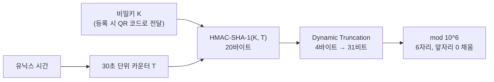

# OTP 정리(RFC 4226, 6238)

6자리 OTP는 어떻게 만들어질까

<!-- more -->

## OTP 세 가지

같은 이름으로 불리지만 만드는 방식이 다름. 인증 앱이 보여 주는 숫자는 TOTP

| 방식 | 표준 | 숫자를 만드는 재료 | 예 |
|---|---|---|---|
| HOTP | RFC 4226 | 비밀키 + 카운터. 버튼을 누르면 토큰의 카운터가 1 증가. 서버는 검증에 성공했을 때 증가시키고, 어긋난 값은 앞으로 몇 개까지 더 계산해 보는 룩어헤드 창으로 맞춤 | 버튼식 하드웨어 토큰 |
| TOTP | RFC 6238 | 비밀키 + 시간. HOTP의 카운터 자리에 유닉스 시간에서 만든 값을 넣음 | Google Authenticator, Microsoft Authenticator |
| 전송형 OTP | 표준 알고리즘 아님 | 서버가 난수를 만들어 저장하고 문자나 이메일로 보냄. 유효 시간만 둠 | SMS 인증번호 |

전송형은 이름만 OTP이고 시간 기반 계산과 무관. NIST SP 800-63B 4판은 문자나 전화로 코드를 받는 방식을 제한 등급으로 둠. 쓰지 말라는 것은 아니고, 위험하다는 사실을 사용자에게 알리고 다른 인증 방법도 같이 제공하라는 조건이 붙음. 이메일로 코드를 보내는 방식은 아예 쓰지 말라고 함. 비밀번호 하나만 알면 어디서든 메일함을 열 수 있고, 가는 길에 가로채거나 다른 곳으로 돌리기도 쉽기 때문

---

## TOTP 계산 과정

HMAC은 비밀키를 함께 넣어 해시를 계산하는 함수. 키를 모르면 같은 출력을 만들 수 없음

```
T = (현재 유닉스 시간 - T0) / X      ← 내림. T0는 계산 기준 시각(기본 0, 유닉스 에폭), X는 시간 스텝(기본 30초)
OTP = Truncate(HMAC-SHA-1(K, T))    ← Truncate = Dynamic Truncation + mod 10^6
```

| 단계 | 하는 일 | 값의 크기 |
|---|---|---|
| 1. 시간 카운터 | 유닉스 시간을 30으로 나눈 몫. 30초마다 1씩 증가. 1970년 1월 1일 0시(UTC)부터 센 값이라 타임존과 무관 | 8바이트 정수. 큰 자릿수 바이트를 앞에 놓는 빅엔디안 순서로 채움 |
| 2. HMAC | 공유 비밀키 K와 시간 카운터 T로 HMAC-SHA-1 계산 | 20바이트(160비트) |
| 3. Dynamic Truncation | 20바이트 중 4바이트를 골라 31비트 정수로 만듦(아래 Dynamic Truncation 절에서 설명) | 31비트 |
| 4. 십진수 6자리 | 10^6으로 나눈 나머지. 앞자리가 0이면 0을 채움 | 000000~999999 |



시간은 공개 값, 비밀은 K 하나. 아래 "미래 값" 절의 출발점

---

## RFC 테스트 벡터로 따라가기

RFC 4226 부록 D의 값. 비밀키는 ASCII 문자열 `12345678901234567890`(20바이트). 카운터 0, 1, 2에 대한 결과를 로컬에서 다시 계산해 RFC와 일치함을 확인

| 카운터 | HMAC-SHA-1 결과(20바이트) | 마지막 바이트 | 오프셋 | 잘라낸 4바이트(최상위 비트 제거 후) | 십진수 | OTP |
|---|---|---|---|---|---|---|
| 0 | cc93cf18 508d9493 4c64b65d 8ba7667f b7cde4b0 | 0xb0 → 하위 4비트 0 | 0 | 4c93cf18 | 1284755224 | 755224 |
| 1 | 75a48a19 d4cbe100 644e8ac1 397eea74 7a2d33ab | 0xab → 하위 4비트 11 | 11 | 41397eea | 1094287082 | 287082 |
| 2 | 0bacb7fa 082fef30 78221193 8bc1c5e7 0416ff44 | 0x44 → 하위 4비트 4 | 4 | 082fef30 | 137359152 | 359152 |

카운터 2는 잘라낸 첫 바이트가 0x08이라 최상위 비트를 제거해도 값이 같음

카운터 0을 따라가면 이렇게 됨

1. 마지막 바이트 0xb0의 하위 4비트는 0. 오프셋 0
2. 0번째부터 4바이트 `cc 93 cf 18`을 가져옴
3. 잘라낸 4바이트의 첫 바이트 0xcc에서 최상위 비트를 제거하면 0x4c. 네 바이트를 빅엔디안 정수로 읽으면 0x4c93cf18 = 1284755224
4. 10^6으로 나눈 나머지 755224

카운터 1에서는 오프셋이 11로 바뀌어 전혀 다른 위치에서 잘라냄. 이것이 "동적"의 뜻

TOTP도 같은 함수를 씀. RFC 6238 부록 B의 8자리 테스트 벡터 중 네 개를 세 해시로 재계산한 결과도 일치

| 유닉스 시간 | T(30초 단위) | SHA-1 | SHA-256 | SHA-512 |
|---|---|---|---|---|
| 59 | 1 | 94287082 | 46119246 | 90693936 |
| 1111111109 | 37037036 | 07081804 | 68084774 | 25091201 |
| 1234567890 | 41152263 | 89005924 | 91819424 | 93441116 |
| 20000000000 | 666666666 | 65353130 | 77737706 | 47863826 |

RFC 6238 참조 코드의 비밀키는 해시별로 길이가 다름(SHA-1 20바이트, SHA-256 32바이트, SHA-512 64바이트). 부록 B 본문은 키가 하나인 것처럼 적혀 있는데 정오표 2866으로 정정된 오류. 다른 구현체와 값이 안 맞을 때 가장 먼저 의심할 지점

---

## Dynamic Truncation이 하는 일

HMAC-SHA-1 결과는 160비트. 사람이 입력할 수 있는 6자리로 줄이는 것이 목적이고, 관건은 어디를 자르느냐

```
1. H = HMAC-SHA-1(K, T)            20바이트
2. offset = H[len-1] & 0x0F        마지막 바이트의 하위 4비트(0~15). SHA-1이면 H[19]
3. P = H[offset .. offset+3]       그 위치부터 4바이트
4. S = P & 0x7FFFFFFF              최상위 비트 제거 → 31비트
5. OTP = S mod 10^6                6자리
```

오프셋이 최대 15이므로 offset+3은 최대 18. 20바이트 범위를 벗어나지 않음

| 질문 | 답 |
|---|---|
| 왜 최상위 비트를 지우나 | 보안 목적이 아님. RFC 4226이 밝힌 이유는 부호 있는 정수와 부호 없는 정수의 나머지 연산 혼동 제거. 최상위 비트가 1인 4바이트를 부호 있는 32비트 정수로 읽으면 음수가 됨. RFC 원문은 프로세서마다 이 연산이 다르다고 적고 있고, 실무에서는 언어별 나머지 연산 차이로 드러남(Java와 C는 음수, Python은 양수). 같은 키와 같은 시간인데 서버와 앱의 값이 갈리는 사고를 막는 장치 |
| 잘라 낼 위치를 왜 매번 바꾸나 | RFC 4226은 목적을 "160비트 결과에서 4바이트 동적 코드를 뽑는 것"이라고만 적고, 위치를 고정하지 않는 이유나 보안 이득은 설명하지 않음. HMAC 출력은 무작위와 구별되지 않는다는 가정 위에 있으므로 어느 4바이트를 뽑든 통계적 성질은 같다고 봄. 고정 위치여도 안전성 차이가 있다고 알려진 바는 없음. 관측자 입장에서는 OTP 값이 160비트 중 어느 31비트에서 나왔는지도 알 수 없다는 부수 효과가 있음(RFC의 설명은 아님) |
| 31비트를 10^6으로 나누면 고르게 나오나 | 거의. 2^31 = 2,147,483,648 = 2147 × 10^6 + 483,648. 그래서 000000부터 483647까지는 2148번, 483648부터 999999까지는 2147번 나옴. 편향은 약 0.047%로 무시 가능 |
| SHA-256, SHA-512를 쓰면 | RFC 6238은 허용하지만 Dynamic Truncation 로직은 그대로 "마지막 바이트 & 0x0F". SHA-512 출력은 64바이트. 오프셋이 0에서 15 사이라 값은 앞 19바이트에서만 나옴. 오프셋을 정하는 마지막 바이트를 빼면 남는 44바이트는 쓰이지 않음. 참조 구현도 세 해시에 같은 코드를 씀. 알려진 취약점은 없지만 자체 구현을 검증할 때 알아 둘 것 |

---

## 미래 값을 미리 계산할 수 있는데 왜 안전한가

계산식의 입력은 시간 T와 비밀키 K 둘. T는 완전히 공개된 값이고 보안을 지탱하는 것은 K 하나

| 누가 | 할 수 있는 것 |
|---|---|
| K를 아는 쪽(사용자의 인증 앱, 검증 서버) | 1년 뒤 오후 3시의 OTP도 지금 계산 가능. 실제로 서버가 앞뒤 시간 창을 허용하는 것도 미래와 과거 값을 미리 계산해 비교하는 것 |
| K를 모르는 쪽 | 시간을 알아도 아무것도 만들지 못함 |

관측한 OTP를 모아 K를 역추적하는 것도 안 됨. 두 가지 장벽

- RFC 4226은 HMAC이 안전한 PRF라고 가정함(부록 A.5). PRF는 의사난수함수. 키를 모르는 쪽에서 보면 입력과 출력 쌍이 진짜 난수 함수와 구별되지 않는 함수. 이 가정 아래에서는 출력만 모아 키를 복원할 수 없음
- Dynamic Truncation이 160비트 중 31비트만 뽑고 다시 10^6으로 나눈 나머지만 내놓음. 관측자는 매번 정보의 극히 일부만 보므로 코드를 아무리 모아도 키 후보를 줄이지 못함

RFC 4226은 무차별 대입 성공 확률을 s × v / 10^Digit로 씀. s는 서버가 한 번에 정답으로 인정하는 코드의 개수. HOTP는 사용자가 버튼을 헛눌러 토큰의 카운터가 서버보다 앞서 갈 수 있어서, 서버가 자기 카운터의 다음 값 몇 개까지 미리 계산해 두고 그중 하나가 맞으면 통과시킴. RFC는 이것을 룩어헤드 창이라 부르고, 그 개수가 s. v는 허용 시도 횟수. TOTP에서 s는 앞뒤로 허용하는 시간 스텝 개수에 해당하고, 앞뒤 1스텝 정책이면 s는 3. 즉 6자리의 안전성은 알고리즘이 아니라 서버가 s와 v를 얼마나 작게 두느냐에 달림

---

## 실제로 뚫리는 경로

TOTP가 뚫리는 경로는 크게 둘. 하나는 K 유출(서버 저장소 또는 QR 코드), 다른 하나는 사용자가 방금 입력한 진짜 코드를 공격자가 가로채 30초 안에 대신 쓰는 것. 둘 다 코드를 미리 알아맞히는 방식이 아님

| 경로 | 내용 | 대응 |
|---|---|---|
| 서버의 비밀키 저장소 유출 | 비밀번호와 달리 해시로 저장할 수 없음. 서버도 원본 K로 계산해야 하기 때문. 평문 저장 상태에서 유출되면 공격자가 영구히 모든 OTP 생성 가능 | KMS(키 관리 서비스)나 HSM(키 전용 하드웨어)으로 암호화 저장, 접근 통제, 회수 절차. OTP 시드 관리를 보안 감사에서 별도 항목으로 다루는 경우가 많음 |
| QR 코드 유출 | 등록 화면의 QR에는 K가 base32로 들어 있음. base32는 A부터 Z와 2부터 7까지 32개 문자로 바꾸는 표기 변환일 뿐이라 되돌리면 K 원본. 스크린샷이 클라우드에 백업되면 K가 복제될 위험 | 등록 화면 캡처 방지, 스크린샷 보관 금지 안내 |
| 실시간 피싱(AiTM, 중간자 공격자) | 사용자가 가짜 사이트에 30초 유효한 코드를 입력하면 공격자가 즉시 진짜 사이트에 중계. NIST 표현으로는 "사칭 검증자가 인증기 출력을 진짜 검증자에게 중계해 인증에 성공"하는 경우. Microsoft 보안 블로그 표현으로는 "인증 트래픽을 실시간으로 가로채 피싱 저항이 없는 MFA를 우회" | OTP로는 막을 수 없음. FIDO2와 패스키는 브라우저와 기기가 사이트 도메인을 확인하는 인증 방식이라 가짜 사이트에서는 자격 증명이 동작하지 않음. WebAuthn 표준은 공개키 자격 증명을 해당 서비스(신뢰 당사자)에 속한 출처에서만 접근하도록 규정하고, 표준을 따르는 브라우저와 인증기(보안키나 폰의 인증 모듈)가 함께 강제함 |

NIST SP 800-63B 4판(2025년 7월)은 OTP를 피싱에 약한 인증 수단으로 봄. 코드 자체에는 어느 사이트의 어느 로그인에 쓰는 값인지가 담겨 있지 않아서, 사용자가 가짜 사이트에 입력한 코드를 공격자가 진짜 사이트에 그대로 넣어도 통하기 때문. NIST는 로그인 보증 수준(AAL)을 1에서 3까지 세 단계로 나눔. 가장 엄격한 AAL3는 피싱에 강한 방식만 허용하고, 중간인 AAL2도 피싱에 강한 방식을 최소 하나는 선택지로 제공해야 함

---

## 구현과 운영 체크리스트

| 항목 | 내용 |
|---|---|
| 앞자리 0 | S mod 10^6이 42면 OTP는 000042. 정수를 그대로 문자열로 바꾸면 42가 됨. 앞자리가 0인 경우가 10%라 자주 발생. Python이면 `f"{value % 10**6:06d}"` |
| 비교 방식 | 정수가 아니라 고정 길이 문자열끼리, 일치 여부와 무관하게 같은 시간이 걸리는 상수 시간 비교 사용. 응답 시간 차이로 자릿수를 맞춰 가는 공격을 막기 위함. Python은 `hmac.compare_digest()` |
| 시간 창 | RFC 6238 권고는 네트워크 지연 보정으로 최대 한 스텝. 실무에서는 시계 오차까지 감안해 앞뒤 1스텝(±30초)을 두는 구현도 많고(라이브러리 기본값은 0인 경우가 많음), 이 경우 s는 3. 창을 넓히면 사용성은 오르지만 탈취된 코드의 유효 시간도 늘어남 |
| 재사용 차단 | RFC 6238은 한 번 성공한 코드의 두 번째 시도를 "MUST NOT accept"로 규정. 안 하면 30초 안에 재생 공격 가능 |
| 시도 제한 | RFC 4226 권고. 최대 시도 횟수를 가능한 한 작게, 또는 실패 횟수에 비례해 지연 시간 증가(T×A초) |
| 시계 | 유닉스 시간은 UTC 기준이라 타임존은 무관하고 시계 오차만 문제. 폰이 수동 시간 설정으로 몇 분 틀어지면 계속 실패하므로 "자동 날짜와 시간" 안내. 서버는 실무상 NTP 동기화가 전제(RFC 6238은 시간 동기화만 요구하고 NTP를 명시하진 않음) |
| 비밀키 | 사용자마다 서로 다른 K를 발급하고 KMS나 HSM으로 암호화 저장. 사용자 재등록 시 이전 K 폐기 |
| 백업 코드 | K 없이도 로그인할 수 있는 일회용 코드를 별도로 발급하고 해시로 저장 |
| 인증 앱 호환 | Google Authenticator의 `otpauth://` URI는 algorithm, digits, period 파라미터를 받지만 algorithm과 period는 무시되고 digits도 안드로이드, 블랙베리 구현에서는 무시됨. SHA-256이나 8자리, 60초 주기를 쓰면 앱에 따라 값이 어긋날 수 있으므로 기본값(SHA-1, 6자리, 30초)이 호환성 면에서 가장 안전한 선택 |

---

## 결론

- 인증 앱의 6자리는 시간 카운터와 비밀키로 HMAC을 계산해 31비트를 뽑고 10^6으로 나눈 나머지. 시간은 공개 값이고 비밀은 키 하나
- 미래 값을 미리 계산할 수 있는 것은 설계상 당연한 성질. 키를 아는 쪽만 계산할 수 있고, 관측한 코드로 키를 되찾는 것은 HMAC의 성질과 31비트만 남기는 Dynamic Truncation 때문에 현실적으로 불가능
- Dynamic Truncation의 최상위 비트 제거는 보안이 아니라 환경 간 나머지 연산 차이를 없애기 위한 것. 잘라 낼 위치를 바꾸는 것도 보안 효과는 미미
- 6자리의 안전성은 알고리즘이 아니라 서버 정책이 결정. 시간 창은 최소로, 성공한 코드는 재사용 금지, 시도 횟수 제한
- 실제 위협은 예측이 아니라 비밀키 유출과 실시간 피싱. 후자는 OTP로 못 막으므로 FIDO2, 패스키로 이전하는 것이 해법
- 자체 구현 시 앞자리 0, 상수 시간 비교, 해시별 키 길이, 인증 앱의 파라미터 무시를 확인할 것
