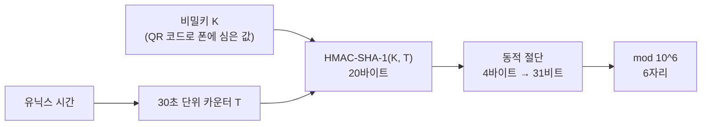

# OTP 정리(RFC 4226, 6238)

6자리 OTP는 어떻게 만들어질까

<!-- more -->

## OTP 세 가지

같은 이름으로 불리지만 만드는 방식이 다름. 인증 앱이 보여 주는 숫자는 TOTP

| 방식 | 표준 | 숫자를 만드는 재료 | 예 |
|---|---|---|---|
| HOTP | RFC 4226 | 비밀키 + 카운터. 버튼을 누를 때마다 양쪽 카운터가 1씩 증가 | 버튼식 하드웨어 토큰 |
| TOTP | RFC 6238 | 비밀키 + 시간. HOTP의 카운터 자리에 유닉스 시간에서 만든 값을 넣음 | Google Authenticator, Microsoft Authenticator |
| 전송형 OTP | 표준 알고리즘 아님 | 서버가 난수를 만들어 저장하고 문자나 이메일로 보냄. 유효 시간만 둠 | SMS 인증번호 |

전송형은 이름만 OTP이고 시간 기반 계산과 무관. NIST SP 800-63B 4판은 전화망(PSTN)으로 보내는 인증 수단을 "제한된 인증 수단"으로 분류함

---

## TOTP 계산 과정

```
T = (현재 유닉스 시간 - T0) / X      ← 내림. T0는 보통 0, X는 보통 30초
OTP = Truncate(HMAC-SHA-1(K, T)) mod 10^6
```

| 단계 | 하는 일 | 값의 크기 |
|---|---|---|
| 1. 시간 카운터 | 유닉스 시간을 30으로 나눈 몫. 30초마다 1씩 증가. 1970년 1월 1일 0시(UTC)부터 센 값이라 타임존과 무관 | 8바이트 정수(빅엔디안) |
| 2. HMAC | 공유 비밀키 K와 시간 카운터 T로 HMAC-SHA-1 계산 | 20바이트(160비트) |
| 3. 동적 절단 | 20바이트 중 4바이트를 골라 31비트 정수로 만듦(아래 절) | 31비트 |
| 4. 십진수 6자리 | 10^6으로 나눈 나머지. 앞자리가 0이면 0을 채움 | 000000~999999 |



시간은 누구나 아는 값이고 비밀은 K 하나. 이 점이 뒤에 나오는 "미래 값을 미리 계산할 수 있는데 왜 안전한가"의 답

---

## RFC 테스트 벡터로 따라가기

RFC 4226 부록 D의 값. 비밀키는 ASCII 문자열 `12345678901234567890`(20바이트). 카운터 0, 1, 2에 대한 결과를 로컬에서 다시 계산해 RFC와 일치함을 확인

| 카운터 | HMAC-SHA-1 결과(20바이트) | 마지막 바이트 | 오프셋 | 잘라낸 4바이트(MSB 제거 후) | 십진수 | OTP |
|---|---|---|---|---|---|---|
| 0 | cc93cf18 508d9493 4c64b65d 8ba7667f b7cde4b0 | 0xb0 → 하위 4비트 0 | 0 | 4c93cf18 | 1284755224 | 755224 |
| 1 | 75a48a19 d4cbe100 644e8ac1 397eea74 7a2d33ab | 0xab → 하위 4비트 11 | 11 | 41397eea | 1094287082 | 287082 |
| 2 | 0bacb7fa 082fef30 78221193 8bc1c5e7 0416ff44 | 0x44 → 하위 4비트 4 | 4 | 082fef30 | 137359152 | 359152 |

카운터 0을 따라가면 이렇게 됨

1. 마지막 바이트 0xb0의 하위 4비트는 0. 오프셋 0
2. 0번째부터 4바이트 `cc 93 cf 18`을 가져옴
3. 첫 바이트 0xcc의 최상위 비트를 지우면 0x4c. 그래서 0x4c93cf18 = 1284755224
4. 10^6으로 나눈 나머지 755224

카운터 1에서는 오프셋이 11로 바뀌어 전혀 다른 위치에서 잘라냄. 이것이 "동적"의 뜻

TOTP도 같은 함수를 씀. RFC 6238 부록 B의 8자리 테스트 벡터를 세 해시로 재계산한 결과도 일치

| 유닉스 시간 | T(30초 단위) | SHA-1 | SHA-256 | SHA-512 |
|---|---|---|---|---|
| 59 | 1 | 94287082 | 46119246 | 90693936 |
| 1111111109 | 37037036 | 07081804 | 68084774 | 25091201 |
| 1234567890 | 41152263 | 89005924 | 91819424 | 93441116 |
| 20000000000 | 666666666 | 65353130 | 77737706 | 47863826 |

RFC 6238 벡터의 비밀키는 해시별로 길이가 다름(SHA-1 20바이트, SHA-256 32바이트, SHA-512 64바이트). 다른 구현체와 값이 안 맞을 때 가장 먼저 의심할 지점

---

## 동적 절단이 하는 일

HMAC-SHA-1 결과는 160비트. 사람이 40자리 16진수를 입력할 수는 없으니 6자리로 줄여야 함. 문제는 어디를 자르느냐

```
1. H = HMAC-SHA-1(K, T)            20바이트
2. offset = H[19] & 0x0F           마지막 바이트의 하위 4비트(0~15)
3. P = H[offset .. offset+3]       그 위치부터 4바이트
4. S = P & 0x7FFFFFFF              최상위 비트 제거 → 31비트
5. OTP = S mod 10^6                6자리
```

오프셋이 최대 15이므로 offset+3은 최대 18. 20바이트 범위를 벗어나지 않음

| 질문 | 답 |
|---|---|
| 왜 최상위 비트를 지우나 | 보안 목적이 아님. RFC 4226 원문은 "부호 있는 정수와 부호 없는 정수의 나머지 연산 혼동을 피하기 위해"라고 명시. 최상위 비트가 1인 4바이트를 부호 있는 32비트 정수로 읽으면 음수가 되고, 음수의 나머지 연산 결과는 언어마다 다름(Java, C는 음수, Python은 양수). 같은 키와 같은 시간인데 서버와 앱의 값이 달라지는 사고를 막는 장치 |
| 잘라 낼 위치를 왜 매번 바꾸나 | HMAC 출력은 모든 비트가 균일하게 무작위라 어느 4바이트를 뽑든 통계적 성질은 같음. 고정 위치였어도 안전성에 차이가 없다는 것이 일반적 평가. 실제 효과는 관측자가 OTP 값이 160비트 중 어느 31비트에서 나왔는지조차 모르게 하는 것과, "앞 4바이트만 쓰니 HMAC 전체를 계산할 필요 없다"는 잘못된 최적화를 막는 것 |
| 31비트를 10^6으로 나누면 고르게 나오나 | 거의. 2^31 = 2,147,483,648 = 2147 × 10^6 + 483,648. 그래서 000000~483647은 2148번, 483648~999999는 2147번 대응됨. 편향은 약 0.047%로 무시 가능 |
| SHA-256, SHA-512를 쓰면 | RFC 6238은 허용하지만 절단 로직은 그대로 "마지막 바이트 & 0x0F". SHA-512는 64바이트를 내놓아도 오프셋이 0~15라 앞 19바이트에서만 값을 뽑고, 나머지는 오프셋을 정하는 마지막 1바이트를 빼면 버려짐. 참조 구현도 세 해시에 같은 코드를 씀. 취약점은 아니지만 자체 구현을 검증할 때 알아 둘 것 |

---

## 미래 값을 미리 계산할 수 있는데 왜 안전한가

계산식의 입력은 시간 T와 비밀키 K 둘. T는 완전히 공개된 값이고 보안을 지탱하는 것은 K 하나

| 누가 | 할 수 있는 것 |
|---|---|
| K를 아는 쪽(사용자의 인증 앱, 검증 서버) | 1년 뒤 오후 3시의 OTP도 지금 계산 가능. 실제로 서버가 앞뒤 시간 창을 허용하는 것도 미래와 과거 값을 미리 계산해 비교하는 것 |
| K를 모르는 쪽 | 시간을 알아도 아무것도 만들지 못함 |

관측한 OTP를 모아 K를 역추적하는 것도 안 됨. 두 가지 장벽

- HMAC-SHA-1은 출력에서 키를 복원할 수 없음. RFC 4226이 근거로 삼는 가정은 HMAC이 안전한 의사난수함수(PRF)라는 것. 입력과 출력 쌍이 진짜 난수 함수와 구별되지 않음
- 동적 절단이 160비트 중 31비트만 뽑고 다시 10^6으로 나눈 나머지만 내놓음. 관측자는 매번 정보의 극히 일부만 보므로 코드를 수천 개 모아도 키 공간을 의미 있게 좁히지 못함

RFC 4226은 무차별 대입 성공 확률을 s × v / 10^Digit로 씀. s는 서버가 허용하는 시간 창 크기, v는 허용 시도 횟수. 즉 6자리의 안전성은 알고리즘이 아니라 서버가 s와 v를 얼마나 작게 두느냐에 달림

---

## 실제로 뚫리는 경로

TOTP가 뚫리는 경로는 예측이 아니라 K의 유출이거나, 정상 코드를 실시간으로 가로채는 것

| 경로 | 내용 | 대응 |
|---|---|---|
| 서버의 비밀키 저장소 유출 | 비밀번호와 달리 해시로 저장할 수 없음. 서버도 원본 K로 계산해야 하기 때문. 평문 저장 상태에서 유출되면 공격자가 영구히 모든 OTP 생성 가능 | KMS나 HSM으로 암호화 저장, 접근 통제, 회수 절차. 금융권 감사가 OTP 시드 관리를 별도 항목으로 보는 이유 |
| QR 코드 유출 | 등록 화면의 QR에는 K가 base32로 그대로 들어 있음. 스크린샷이 클라우드에 백업되면 K가 복제됨 | 등록 화면 캡처 방지, 스크린샷 보관 금지 안내 |
| 실시간 피싱(AiTM) | 사용자가 가짜 사이트에 30초 유효한 코드를 입력하면 공격자가 즉시 진짜 사이트에 중계. Microsoft 보안 블로그 표현으로는 "인증 트래픽을 실시간으로 가로채 피싱 저항이 없는 MFA를 우회" | OTP로는 막을 수 없음. FIDO2, 패스키처럼 자격 증명이 사이트 도메인에 묶이는 방식으로 이전. WebAuthn 표준은 "자격 증명은 해당 서비스의 출처(origin)에서만 접근 가능"하도록 브라우저와 인증기가 함께 강제 |

NIST SP 800-63B 4판(2025년 7월)은 OTP를 "피싱 저항이 없는 인증 수단"으로 분류하고, 수동 입력은 인증 결과를 특정 세션에 묶지 못한다는 점을 이유로 듦. 가장 높은 보증 수준(AAL3)에서는 피싱 저항이 필수이고, 중간 수준(AAL2)에서도 검증자는 피싱 저항 옵션을 하나 이상 제공해야 함

---

## 구현과 운영 체크리스트

| 항목 | 내용 |
|---|---|
| 앞자리 0 | S mod 10^6이 42면 OTP는 000042. 정수를 그대로 문자열로 바꾸면 42가 됨. 앞자리에 0이 오는 경우가 10%라 자주 터짐. Python이면 `f"{value % 10**6:06d}"` |
| 비교 방식 | 정수가 아니라 고정 길이 문자열끼리, 상수 시간으로 비교. Python `hmac.compare_digest()`. 타이밍 공격 때문 |
| 시간 창 | RFC 6238 권고는 네트워크 지연으로 최대 한 스텝. 앞뒤 1스텝(±30초)이면 충분. 창을 넓히면 사용성은 오르지만 탈취된 코드의 유효 시간도 늘어남 |
| 재사용 차단 | RFC 6238은 한 번 성공한 코드의 두 번째 시도를 "MUST NOT accept"로 규정. 안 하면 30초 안에 재생 공격 가능 |
| 시도 제한 | RFC 4226 권고. 최대 시도 횟수를 가능한 한 작게, 또는 실패 횟수에 따라 지연 시간 증가 |
| 시계 | 유닉스 시간은 UTC 기준이라 타임존은 무관하고 시계 오차만 문제. 폰이 수동 시간 설정으로 몇 분 틀어지면 계속 실패하므로 "자동 날짜와 시간" 안내. 서버는 실무상 NTP 동기화가 전제(RFC 6238은 시간 동기화만 요구하고 NTP를 명시하진 않음) |
| 비밀키 | 앱마다 다른 K를 발급하고 KMS나 HSM으로 암호화 저장. 사용자 재등록 시 이전 K 폐기 |
| 백업 코드 | K 없이도 로그인할 수 있는 일회용 코드를 별도로 발급하고 해시로 저장 |
| 인증 앱 호환 | Google Authenticator의 `otpauth://` URI는 algorithm, digits, period 파라미터를 받지만 구현이 이를 무시함. SHA-256이나 8자리, 60초 주기를 쓰면 앱에 따라 값이 안 맞을 수 있으므로 기본값(SHA-1, 6자리, 30초)이 가장 안전한 선택 |

---

## 결론

- 인증 앱의 6자리는 시간 카운터와 비밀키로 HMAC을 계산해 31비트를 뽑고 10^6으로 나눈 나머지. 시간은 공개 값이고 비밀은 키 하나
- 미래 값을 미리 계산할 수 있는 것은 설계상 당연한 성질. 키를 아는 쪽만 계산할 수 있고, 관측한 코드로 키를 되찾는 것은 HMAC의 성질과 31비트 절단 때문에 불가능
- 동적 절단의 최상위 비트 제거는 보안이 아니라 언어 간 나머지 연산 차이를 없애기 위한 것. 잘라 낼 위치를 바꾸는 것도 보안 효과는 미미
- 6자리의 안전성은 알고리즘이 아니라 서버 정책이 결정. 시간 창은 앞뒤 1스텝, 성공한 코드는 재사용 금지, 시도 횟수 제한
- 실제 위협은 예측이 아니라 비밀키 유출과 실시간 피싱. 후자는 OTP로 못 막으므로 FIDO2, 패스키가 답
- 자체 구현 시 앞자리 0, 상수 시간 비교, 해시별 키 길이, 인증 앱의 파라미터 무시를 확인할 것
