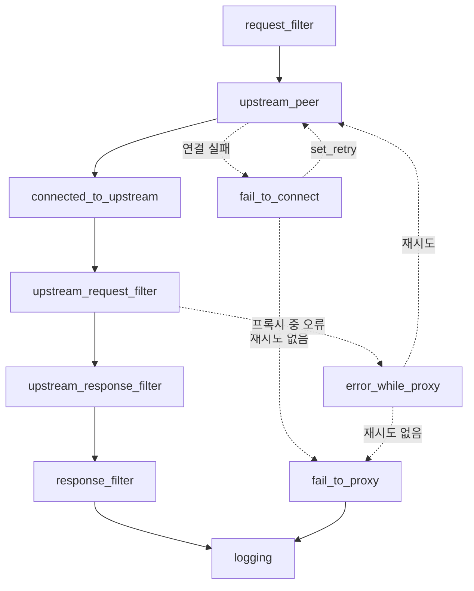
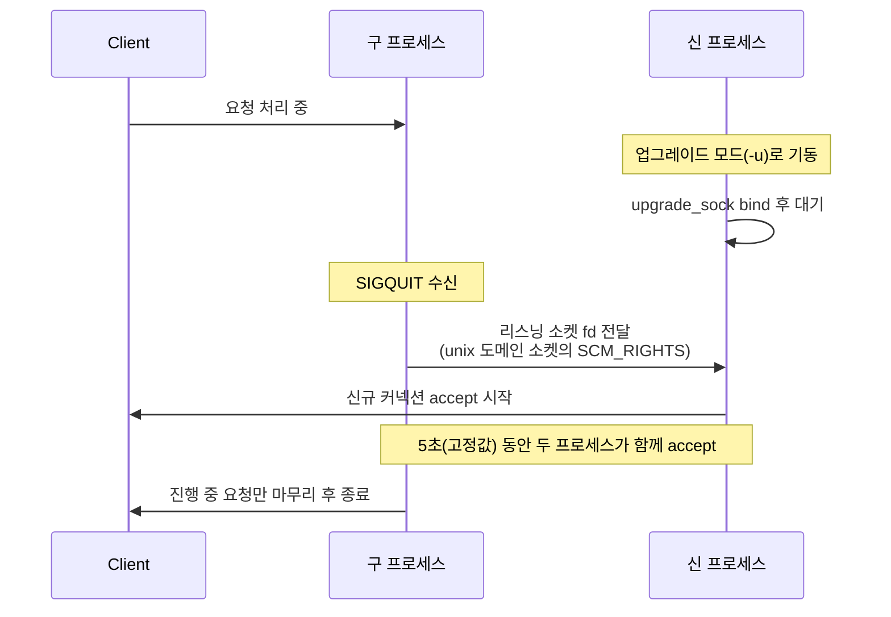

# Pingora 정리

nginx의 워커 프로세스 모델과 Pingora의 멀티스레드 구조를 커넥션 풀이 나뉘는 단위를 기준으로 비교했다. 요청 처리 phase와 리스닝 소켓을 넘기는 무중단 업그레이드까지 정리한 글이다.

<!-- more -->

## Pingora란
Pingora란 프록시 동작을 코드로 직접 구현하도록 Cloudflare가 Rust로 만들어 공개한 라이브러리. 설정 파일만으로 띄우는 완제품 프록시 서버는 아님

- 형태: 설치해서 띄우는 실행 파일이 없음. Rust 라이브러리(크레이트) 묶음을 의존성으로 받은 뒤, 요청을 어느 백엔드로 보낼지 같은 처리 로직을 콜백 함수로 작성하고 컴파일하면 그 결과물이 자기만의 프록시 바이너리가 됨
- 프로토콜: HTTP/1과 HTTP/2 종단 간 프록시, gRPC·websocket 프록시 지원
- HTTP/3·QUIC: 기능 목록에 없음 → 미지원
- 지원 OS: Linux가 tier 1. 유닉스 계열은 대부분 컴파일되지만 macOS는 일부 기능이 빠짐
- 릴리스: 최신 stable 0.8.1(2026-06-04)
- 빌드 의존: BoringSSL을 쓰면 Clang, OpenSSL을 쓰면 Perl 5 필요

---

## nginx와 구조 차이
두 프로젝트가 갈리는 지점은 처리 속도보다 요청을 어떤 실행 단위에 태우는지에 있음

| 비교 항목 | nginx | Pingora |
|---|---|---|
| 동시성 모델 | 마스터 프로세스 1개 + 워커 프로세스 여러 개. 워커가 실제 요청 처리 | 프로세스 1개. 서비스마다 tokio 런타임(스레드 풀)을 따로 가짐 |
| 요청 처리 주체 | 커넥션을 accept한 워커 프로세스 | 런타임의 스레드. work stealing으로 유휴 스레드가 작업을 가져감 |
| 커넥션 풀 범위 | upstream keepalive 커넥션이 워커 프로세스별 캐시에 보존 | upstream 연결을 만들고 재사용하는 커넥터의 풀을 같은 서비스의 스레드끼리 공유. 프록시 서비스가 하나면 프로세스 전체가 풀 하나 |
| 설정 방식 | `nginx.conf`의 지시어(directive) | Rust 코드. 설정 파일은 서버 런타임 항목만 담당 |
| 배포 형태 | 패키지로 설치해 바로 기동 | 크레이트 의존성. 직접 빌드한 바이너리로 배포 |
| 확장 방법 | C 모듈 컴파일 또는 njs 스크립트 | `ProxyHttp` 트레이트(Rust의 인터페이스)의 phase 콜백 구현 |
| 재시작 방식 | SIGHUP으로 설정 재적용. 바이너리 교체는 USR2 → WINCH → QUIT | 신 프로세스를 `-u`로 기동한 뒤 구 프로세스에 SIGQUIT |

- Pingora의 서비스는 리스너와 tokio 런타임을 함께 갖는 실행 단위(프록시 서비스, 헬스체크 같은 백그라운드 서비스, Prometheus 서비스 등) → 스레드와 커넥션 풀은 이 단위로 갈림
- 무중단 재시작은 양쪽 다 가능 → 갈리는 것은 구 마스터가 새 실행 파일을 직접 기동하느냐, 서로 무관한 두 프로세스가 소켓으로 fd를 주고받느냐
- nginx의 `keepalive` 지시어는 워커 프로세스별 캐시에 보존되는 idle keepalive 커넥션 수를 지정 → 워커가 여러 개면 풀도 그 수만큼 나뉨
- Pingora의 `work_stealing` 설정은 기본 true → 유휴 스레드가 다른 스레드의 작업을 가져가는 런타임으로 시작
- `upstream_keepalive_pool_size`는 upstream keepalive 커넥션 풀에 유지할 커넥션 총량이고 기본 128 → 워커별로 쪼개지는 값이 없음
- `threads`는 서비스마다 따로 배정되고 기본 1 → 서비스 사이에서 스레드를 공유하지 않음
- Cloudflare가 2022년에 공개한 글은 멀티스레드를 고른 이유로 nginx에서는 요청 하나를 워커 하나만 처리할 수 있다는 점과 커넥션 풀이 워커 단위라는 점을 들었음

### Cloudflare 자체 측정

| 항목 | 측정값 |
|---|---|
| 커넥션 재사용률 | 한 대형 고객 기준 87.1% → 99.92%. 오리진으로 나가는 신규 커넥션 비율이 12.9%에서 0.08%로 줄어 160분의 1 |
| 초당 신규 커넥션 | 전체 고객 기준 구 서비스의 3분의 1 수준 |
| TTFB | 중앙값 5ms, 95퍼센타일 80ms 감소 |
| 자원 | 구 서비스 대비 CPU 약 70%, 메모리 약 67% 절감 |
| 규모 | 하루 1조 건이 넘는 요청 처리 |

- 비교 대상은 Cloudflare 사내 구 프록시 서비스이고 측정 환경도 Cloudflare 자사 트래픽 → 일반적인 성능 우열로 옮겨 읽을 수 없음

---

## 요청 처리 phase
요청 하나가 지나는 지점마다 콜백이 정의돼 있고, `ProxyHttp` 트레이트에서 필요한 것만 구현하는 구조. 아래 흐름도는 본문·모듈 관련 phase를 뺀 주 흐름만 그린 것



| phase | 호출 시점 | 용도 |
|---|---|---|
| `early_request_filter()` | 모든 요청의 첫 단계 | 다운스트림 요청에 붙는 내장 모듈(압축 등)의 동작을 요청별로 조정 |
| `request_filter()` | 요청 헤더를 받은 뒤 | 입력 검증, rate limiting, phase 사이에서 값을 나르는 요청별 컨텍스트 초기화 |
| `request_body_filter()` | 요청 본문을 upstream으로 보낼 준비가 된 뒤 | 요청 본문 가공 |
| `proxy_upstream_filter()` | (캐시를 켠 경우) 캐시에서 응답하지 못한 뒤, upstream 연결 직전 | upstream까지 갈지 여기서 끊을지 판단 |
| `upstream_peer()` | 연결할 upstream을 정하는 시점 | DNS 조회·해싱·라운드로빈으로 peer 선택 |
| `connected_to_upstream()` | upstream 연결 성공 후 | 연결 성공 기록 |
| `fail_to_connect()` | upstream 연결에 실패했을 때 | 재시도 표시, failover 판단 |
| `upstream_request_filter()` | upstream으로 보내기 직전 | 요청 헤더 수정 |
| `upstream_response_filter()` | upstream 응답 헤더를 받은 뒤 | 응답 헤더 가공 |
| `response_filter()` | 다운스트림으로 보낼 응답 헤더가 준비된 뒤 | 클라이언트로 나갈 헤더 수정 |
| `response_body_filter()` | 응답 본문이 준비된 뒤 | 응답 본문 가공 |
| `error_while_proxy()` | 연결 수립 이후 프록시 도중 오류 | 재시도 판단 |
| `fail_to_proxy()` | 위 단계 어디서든 오류가 났을 때 | 오류 응답 결정 |
| `logging()` | 요청이 끝나고 자원 해제 직전 | 로깅, 메트릭 집계 |

- 구현하지 않은 phase는 기본 동작으로 지나감 → 필요한 지점만 골라 덮어씀. `upstream_peer()`만 기본 구현이 없어 필수
- 기본 제공 요청 메트릭이 없음 → 요청 수·상태 코드 집계는 `logging()`에서 직접 등록해 올려야 함
- 접근 로그·메트릭까지 직접 붙여야 한다는 점에서 라이브러리 성격이 드러남

---

## 실패와 재시도
연결 실패의 재시도는 콜백에서 명시적으로 켜는 항목이고, 재사용 커넥션에서 난 오류는 기본 구현이 판단

| 상황 | 콜백 | 가능한 조치 |
|---|---|---|
| upstream 연결 실패 | `fail_to_connect()` | 기본 구현은 오류를 그대로 반환. `e.set_retry(true)`로 재시도 표시 → `upstream_peer()` 재호출 |
| 연결 수립 후 프록시 중 오류 | `error_while_proxy()` | 기본 구현이 재사용 커넥션에서 난 오류인지와 다시 보내려고 담아 둔 요청 본문 버퍼가 잘리지 않았는지로 재시도 여부를 결정. 공식 문서는 재사용 커넥션 + 멱등(idempotent) 메서드일 때 재시도할 수 있다고 설명 |
| 어느 단계에서든 오류가 발생함 | `fail_to_proxy()` | 오류 응답 결정, 로깅. 기본 구현은 upstream 오류를 502로 매핑 |

- `fail_to_connect()`가 호출된 시점에는 upstream으로 아무것도 전송되지 않은 것이 보장됨 → 같은 요청을 다시 보내도 중복 처리되지 않음
- 재시도가 표시되면 `upstream_peer()`가 다시 호출됨 → 같은 upstream 재시도와 다른 peer로의 failover를 여기서 갈라 씀
- failover는 시도 횟수를 컨텍스트에 쌓아 두고 `upstream_peer()`가 그 값을 보고 다른 peer를 고르는 방식
- 연결 실패는 재시도 표시를 하지 않으면 그대로 오류 응답 → 로드밸런서를 만들 때 이 콜백을 비워 두면 죽은 백엔드로 간 요청이 바로 실패함
- 재시도 횟수 상한은 conf.yaml의 `max_retries` 키이고 기본 16

---

## 크레이트 구성
pingora는 우산 크레이트고 실제 기능은 목적별 크레이트로 나뉨

| 크레이트 | 역할 |
|---|---|
| `pingora` | 우산 크레이트. `pingora-core`를 재수출하고 `lb`·`proxy`·`http` 모듈을 묶음 |
| `pingora-core` | 서버 기동, 설정, 리스너, upstream peer, 무중단 업그레이드, Prometheus 서비스 |
| `pingora-proxy` | `ProxyHttp` 트레이트와 `Session`, 프록시 서비스 생성 |
| `pingora-load-balancing` | `LoadBalancer`, `RoundRobin`, `TcpHealthCheck`·`HttpHealthCheck` |
| `pingora-cache` | HTTP 캐시 |
| `pingora-openssl` / `pingora-boringssl` / `pingora-rustls` / `pingora-s2n` | TLS 백엔드별 크레이트 |

- Cargo의 feature(빌드할 때 켜고 끄는 기능 스위치)는 `default`가 빈 목록 → 필요한 기능을 feature로 켜서 씀
- `lb` feature는 `pingora-load-balancing`과 `proxy`를 함께 끌어옴 → 로드밸런싱만 켜도 프록시 모듈이 딸려옴
- 그 밖의 feature: `proxy`, `cache`, `sentry`, `time`, `connection_filter`, `patched_http1`
- 같은 워크스페이스에 `pingora-http`, `pingora-error`, `pingora-timeout`, `pingora-limits`, `pingora-ketama`, `pingora-memory-cache`, `pingora-pool`, `pingora-lru`, `pingora-runtime`, `pingora-header-serde`, 캐시 알고리즘 크레이트 TinyUfo가 함께 있음

---

## 무중단 업그레이드
구 프로세스가 리스닝 소켓 자체를 신 프로세스에 넘겨 포트를 놓지 않는 방식이고, Linux 전용



- 보장 1: 서버 엔드포인트로 접속하는 요청이 connection refused를 보지 않음
- 보장 2: grace period 안에 끝나는 요청은 도중에 끊기지 않음
- 순서: 두 프로세스가 같은 `upgrade_sock` 경로를 보게 맞춤 → 신 프로세스를 `-u`(`--upgrade`)로 기동 → 구 프로세스에 SIGQUIT
- 바인드 주체는 신 프로세스 → 신 프로세스가 `upgrade_sock`을 bind하고 구 프로세스가 connect해서 fd를 보냄
- 전달 수단은 unix 도메인 소켓의 SCM_RIGHTS(열린 fd 자체를 다른 프로세스에 건네는 제어 메시지)이고 한 번에 최대 32개 fd
- 신 프로세스의 fd 수신 대기와 구 프로세스의 소켓 연결 모두 기본 5회, 1초 간격으로 재시도 → 신 프로세스 기동과 SIGQUIT 사이에 5~6초쯤의 여유가 있음
- fd를 넘긴 뒤에도 구 프로세스가 5초(설정 키가 아닌 고정값) 동안 리스너를 유지 → 그 구간에는 구·신 프로세스가 같은 소켓에서 함께 accept
- 이후 grace period 동안 진행 중 요청만 마무리하고 종료
- 비Linux 빌드에서는 fd 이관 함수가 스텁으로 컴파일됨 → 신 프로세스 쪽은 지원되지 않는다는 오류 로그를 남기고 실패
- 구 프로세스 쪽 스텁은 로그 없이 성공한 것처럼 반환 → 구 프로세스는 이관에 성공한 것처럼 종료 절차로 들어가고 소켓을 넘겨받은 프로세스는 없음

```s
# 신 프로세스를 업그레이드 모드로 먼저 기동
./lb -c conf.yaml -u

# 구 프로세스에 SIGQUIT 전달
kill -QUIT <구 프로세스 PID>
```

| 항목 | 설명 |
|---|---|
| `upgrade_sock` | fd를 넘길 unix 도메인 소켓 경로. 기본 `/tmp/pingora_upgrade.sock` |
| `pid_file` | pid 파일 경로. 기본 `/tmp/pingora.pid`. daemon 모드에서만 기록 |
| `grace_period_seconds` | 이관 후 진행 중 요청을 마무리할 시간. 미설정 시 300초 |
| `graceful_shutdown_timeout_seconds` | grace period가 끝난 뒤 런타임이 정리되기를 기다리는 시간. 미설정 시 5초 |
| SIGQUIT | graceful upgrade 개시. 구 프로세스가 소켓을 넘기고 빠짐 |
| SIGTERM | graceful terminate. fd 이관 없이 종료 |

```yaml title="conf.yaml"
version: 1                                #설정 포맷 버전, 현재는 상수 1
threads: 2                                #서비스마다 배정할 스레드 수
upgrade_sock: /tmp/pingora_upgrade.sock   #fd를 넘길 unix 도메인 소켓 경로
grace_period_seconds: 10                  #미설정 시 300초라 명시하는 편이 안전
graceful_shutdown_timeout_seconds: 5      #미설정 시 5초
```

- `grace_period_seconds`를 비워 두면 구 프로세스가 5분간 남음 → 자주 배포하는 환경에서는 값을 줄여 명시
- foreground로 띄우면 pid 파일이 생기지 않음 → PID는 `pgrep`이나 `ss -lntp`로 확인
- 신·구 프로세스의 설정 파일은 `upgrade_sock`만 같으면 됨 → pid·로그 경로는 나눠도 됨

---

## TLS 백엔드 선택
TLS는 기본으로 켜져 있지 않고 feature로 하나만 골라 켜는 항목

| 백엔드 | feature 이름 | 상태 |
|---|---|---|
| 없음 | 기본값 | `default`가 빈 목록. 암호화 없는 HTTP만 처리 |
| OpenSSL | `openssl` | 네이티브 openssl 라이브러리와 빌드 도구 필요 |
| BoringSSL | `boringssl` | 네이티브 boring 라이브러리와 빌드 도구 필요 |
| s2n-tls | `s2n` | 네이티브 s2n-tls 라이브러리와 빌드 도구 필요 |
| rustls | `rustls` | 실험 단계. 아직 의존하지 말라고 원문 주석에 명시 |

- TLS를 제공하는 feature는 한 번에 하나만 선택 가능 → 두 개를 같이 켤 수 없음
- 평문 HTTP만 프록시하면 TLS feature 없이 빌드 가능 → 네이티브 의존성이 빠져 빌드가 단순해짐

---

## 보안 이력
지금까지 공개된 CVE는 5건. 4건은 HTTP 메시지 경계 해석(요청 스머글링, request smuggling)과 캐시 키 범위 문제이고 1건은 HTTP/2 스트림 리셋 반복에 따른 메모리 소모 문제

| CVE | 내용 | 영향 버전 | 수정 버전 |
|---|---|---|---|
| CVE-2025-4366 | 캐시 HIT 응답에서 HTTP/1.1 요청 본문을 읽지 않은 채 커넥션을 재사용 → 남은 본문이 다음 요청으로 해석되는 요청 스머글링. 2025-05-22 공개 | 0.5.0 미만(캐시 기능 사용 시) | 0.5.0 |
| CVE-2025-8671 | HTTP/2 스트림 리셋을 반복하는 클라이언트(MadeYouReset)가 서버 메모리 소모를 비정상적으로 키움. 2025-09-17 공개 | 0.6.0 미만 | 0.6.0 |
| CVE-2026-2833 | 백엔드가 101 Switching Protocols를 주기 전에 Upgrade 헤더만 보고 passthrough 모드로 진입 | 0.8.0 미만 | 0.8.0 |
| CVE-2026-2835 | Transfer-Encoding 해석 결함(HTTP/1.0 요청의 Transfer-Encoding 허용, 인식 못한 인코딩을 close 종료 본문으로 처리 등)으로 프록시와 백엔드가 보는 본문 경계가 어긋남 | 0.8.0 미만 | 0.8.0 |
| CVE-2026-2836 | 기본 CacheKey가 URI path만 사용. host 헤더나 upstream 스킴 같은 다른 요소를 반영하지 않음 | 0.8.0 미만(alpha 캐시 기능) | 0.8.0 |

- CVE-2026-2833/2835/2836 세 건은 2026-03-04에 함께 공개됐고 모두 0.8.0에서 수정
- CVE-2025-4366은 Cloudflare가 밝힌 노출 대상이 자사 CDN 무료 요금제 이용자와 pingora-proxy·pingora-cache의 캐시 기능 사용자

---

## 도입 판단

| 사용 사례 | 권장 | 사유 |
|---|---|---|
| 프록시 동작을 코드로 제어해야 함 | Pingora | 라우팅·인증·재시도 로직을 phase 콜백에 직접 작성 |
| 설정 파일 지시어로 끝나는 리버스 프록시 | nginx | Rust 빌드·배포 체계를 새로 얹을 이유가 없음 |
| 바로 쓸 완제품이 필요함 | pingap | Pingora 기반 리버스 프록시. TOML 설정, 웹 관리 UI, 무중단 재시작, Prometheus, OpenTelemetry, Let's Encrypt 지원. v0.13.9 |
| 참고할 오픈소스 구현이 필요함 | River | Pingora 기반 리버스 프록시 애플리케이션. v0.5.0(2024-08-30) 이후 릴리스가 멈췄고 안정성을 기대하지 말라고 원문에 명시 |
| HTTP/3가 필요함 | 대상 아님 | HTTP/3·QUIC 미지원 |
| Windows 운영이 전제 | 대상 아님 | 커뮤니티 기여에만 의존하는 예비 지원 단계 |

- 도입 비용은 프록시 로직보다 접근 로그·메트릭·설정 관리 같은 주변 도구를 얼마나 새로 만들어야 하는지에서 나옴
- 0.x 버전대라 릴리스마다 API가 바뀔 수 있음 → 의존성 버전을 고정해 쓸 것
- MSRV(빌드에 필요한 최소 Rust 버전)는 6개월 rolling 정책(6개월 이상 지난 Rust 버전까지 요구 버전을 올릴 수 있음)이라 툴체인 갱신 주기를 같이 잡아야 함

---

## 결론
- Pingora는 프록시를 만들어 쓰는 Rust 라이브러리 → 설치해서 바로 띄우는 nginx와 놓이는 자리가 다름
- 구조 차이의 핵심은 요청을 태우는 실행 단위 → 워커 프로세스냐 프로세스 하나 안의 스레드 풀이냐에 따라 커넥션 풀이 나뉘는 단위도 갈림
- 요청 처리는 phase 콜백으로 갈라져 있고 연결 실패의 재시도는 콜백에서 켜야 동작
- 무중단 업그레이드는 리스닝 fd를 unix 도메인 소켓으로 넘기는 Linux 전용 경로 → 다른 플랫폼에서는 성립하지 않음
- HTTP/3 미지원, rustls 실험 단계, 요청 메트릭 미제공 → 완제품 서버를 기대하고 접근하면 어긋남
- nginx는 "설정해서 쓰는 서버", Pingora는 "코드로 짜는 프록시"로 나눠 보면 됌
