# Pingora로 로드밸런서 만들어 무중단 업그레이드 확인하기

Rust로 라운드로빈 로드밸런서를 짜서 컨테이너 백엔드 3대에 부하를 걸고, 백엔드 한 대를 멈췄을 때와 로드밸런서 자신을 새 바이너리로 갈아치울 때 요청이 어떻게 되는지 실측했다. 헬스체크 구간에서는 502가 났고 소켓을 넘기는 업그레이드 구간에서는 9869건 중 실패가 0건이었다.

<!-- more -->

## 목표

---

- Pingora 0.8.1로 라운드로빈 로드밸런서를 작성해 백엔드 3대에 요청이 균등하게 나뉘는지 확인한다
- 백엔드 한 대를 멈추고 헬스체크가 그 백엔드를 빼기까지 걸린 시간과 그 사이 실패한 요청 수를 센다
- 부하가 걸린 상태에서 리스닝 소켓을 신 프로세스로 넘겨 v1을 v2로 교체하고 실패 건수를 확인한다
- 소켓 소유 PID, 구·신 프로세스 로그, 응답 헤더의 버전 값을 대조해 교체가 실제로 일어났는지 검증한다

리스닝 소켓 fd를 넘기는 업그레이드 절차와 phase 콜백 구조는 [Pingora 정리](pingora.md)에 정리해 뒀다. 이 글은 그 절차를 트래픽이 흐르는 상태에서 돌려 숫자로 확인하는 데 집중한다.

## 구성

---

백엔드 3대와 관측 스택, 로드밸런서를 전부 하나의 compose 네트워크에 올린다. k6는 그때그때 docker run으로 띄우는 일회성 컨테이너다.

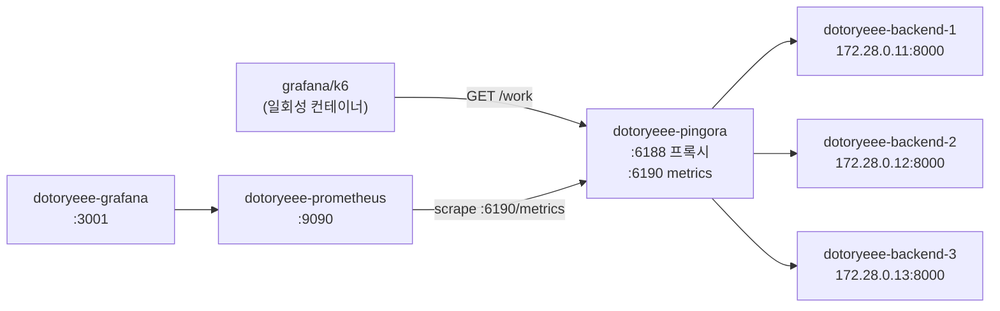

|컨테이너|이미지|역할|
|---|---|---|
|dotoryeee-pingora|rust:1-bookworm 기반 로컬 빌드|로드밸런서. 메인 프로세스는 sleep, v1·v2를 exec로 기동|
|dotoryeee-backend-1~3|Flask + gunicorn|응답에 자기 이름을 실어 주는 백엔드. 50ms 지연 내장|
|dotoryeee-prometheus|prom/prometheus|6190 포트의 metrics를 5초 간격으로 수집|
|dotoryeee-grafana|grafana/grafana|대시보드 dotoryeee pingora lb|
|k6|grafana/k6|일회성 부하 컨테이너|

작업 디렉터리 구성은 다음과 같고, 이 글의 명령은 전부 이 디렉터리에서 실행한다.

```s
pingora-lab/
├── compose.yaml
├── lb/                      # 로드밸런서. Dockerfile, Cargo.toml, conf*.yaml, src/main.rs
├── backend/                 # Dockerfile, app.py
├── observability/           # prometheus.yml, grafana/ (프로비저닝 2개, 대시보드 JSON)
└── scripts/                 # lb.js, healthcheck.js, upgrade.js
```

빌드도 실행도 전부 컨테이너 안에서 한다. Pingora의 무중단 업그레이드는 구 프로세스가 리스닝 소켓의 fd(파일 디스크립터)를 unix 도메인 소켓으로 신 프로세스에 넘기는 방식인데 이 fd 이관이 Linux 전용이라, macOS 호스트에서 네이티브로 돌리면 이 글의 실측 자체가 성립하지 않기 때문이다. fd는 같은 unix 소켓 경로를 함께 보는 같은 호스트(여기서는 같은 컨테이너)의 프로세스 사이에서만 건너가므로 구 프로세스와 신 프로세스도 같은 컨테이너 안에 둔다.

컨테이너의 메인 프로세스는 sleep infinity로 두고(init: true라 실제 PID 1은 docker-init, sleep은 그 자식) v1과 v2를 모두 docker exec로 띄운다. 로드밸런서를 컨테이너의 메인 프로세스로 올리면 업그레이드 마지막에 구 프로세스가 빠질 때 컨테이너가 통째로 죽어 신 프로세스까지 함께 사라진다.

백엔드는 서비스명 DNS 대신 고정 IP를 준다. LoadBalancer가 기동 시점에 주소를 한 번 해석해 붙들기 때문에, 백엔드를 stop하고 start하는 사이 IP가 바뀌면 죽은 주소를 계속 찌른다.

|항목|값|
|---|---|
|호스트|Mac Studio, Darwin 25.5.0, arm64|
|Docker|29.7.2, Compose v5.3.1|
|베이스 이미지|rust:1-bookworm (Debian GNU/Linux 12)|
|툴체인|rustc 1.97.1, cargo 1.97.1|
|pingora|0.8.1 (Cargo.lock의 pingora 계열 크레이트 전부 0.8.1)|
|prometheus 크레이트|0.13.4|

## 로드밸런서 작성

---

rust:1-bookworm에는 ss도 ps도 없다. 소켓 소유자와 프로세스를 봐야 하므로 iproute2와 procps를 넣어 이미지를 새로 굽는다.

```dockerfile title="lb/Dockerfile"
FROM rust:1-bookworm

RUN apt-get update && apt-get install -y --no-install-recommends \
    iproute2 \
    procps \
    curl \
    cmake \
    && rm -rf /var/lib/apt/lists/*

WORKDIR /app
```

!!! warning
    💡 이미지에 cmake가 없으면 첫 빌드가 zlib-ng 컴파일 단계에서 실패하므로 Dockerfile에 함께 넣는다

TLS는 켜지 않는다. 백엔드도 로드밸런서도 평문 HTTP라 lb feature 하나면 충분하고, 그러면 네이티브 TLS 의존성이 빠져 빌드가 단순해진다.

```toml title="lb/Cargo.toml"
[package]
name = "lb"
version = "0.1.0"
edition = "2021"

[[bin]]
name = "lb"
path = "src/main.rs"

[dependencies]
pingora = { version = "0.8.1", features = ["lb"] }   #lb feature가 로드밸런싱과 프록시를 함께 끌어옴
async-trait = "0.1"
prometheus = "0.13"                                  #pingora-core 0.8.1과 같은 버전으로 맞춤
once_cell = "1"
log = "0.4"
env_logger = "0.11"
```

!!! tip
    💡 prometheus 버전이 pingora-core와 갈리면 기본 레지스트리가 나뉘어 등록한 메트릭이 응답에 안 나온다

Pingora는 요청 하나가 지나는 단계(phase)마다 콜백을 두고 필요한 것만 구현하게 돼 있는데, 요청 수나 상태 코드 같은 기본 메트릭은 제공하지 않는다. 그래서 카운터를 직접 등록하고 요청이 끝난 뒤 불리는 logging phase에서 올린다. 버전 게이지는 v1과 v2 중 지금 무엇이 떠 있는지 그래프로 보려고 둔 것이다.

```rust title="lb/src/main.rs"
use async_trait::async_trait;
use log::info;
use once_cell::sync::Lazy;
use prometheus::{register_int_counter_vec, register_int_gauge_vec, IntCounterVec, IntGaugeVec};
use std::sync::Arc;
use std::time::Duration;

use pingora::prelude::*;                              //Server, Opt, HttpPeer, LoadBalancer, ProxyHttp 등
use pingora::services::listening::Service as ListeningService;

// v1 빌드에는 "v1", v2 재빌드 때 "v2"로 바꾼다.
const LB_VERSION: &str = "v1";

static REQUESTS_TOTAL: Lazy<IntCounterVec> = Lazy::new(|| {
    register_int_counter_vec!(
        "dotoryeee_lb_requests_total",                //백엔드별·상태코드별 요청 수
        "dotoryeee lb: requests proxied, labeled by upstream and response status",
        &["upstream", "status"]
    )
    .unwrap()
});

static BUILD_INFO: Lazy<IntGaugeVec> = Lazy::new(|| {
    register_int_gauge_vec!(
        "dotoryeee_lb_build_info",                    //지금 떠 있는 버전만 1
        "dotoryeee lb: 1 for the version currently running",
        &["version"]
    )
    .unwrap()
});

pub struct LB(Arc<LoadBalancer<RoundRobin>>);

pub struct RequestCtx {
    upstream_addr: Option<String>,                    //logging phase까지 들고 갈 선택 결과
}
```

CTX는 요청 하나가 끝날 때까지 phase 사이에서 값을 나르는 컨텍스트 타입이다. 여기서는 어느 백엔드로 보냈는지를 담아 두었다가 응답 헤더와 메트릭에 쓴다. upstream_peer는 구현이 필수인 phase다. 여기서 백엔드를 고르고 peer 옵션을 붙인다. HttpPeer의 타임아웃은 기본이 전부 None이라, 명시하지 않으면 멈춘 백엔드로 간 요청이 커널 SYN 재시도 시간만큼 매달린다. 헬스체크 실측의 502가 몇 초 안에 드러나느냐가 여기에 달려 있다.

```rust title="lb/src/main.rs"
#[async_trait]
impl ProxyHttp for LB {
    type CTX = RequestCtx;

    fn new_ctx(&self) -> Self::CTX {
        RequestCtx {
            upstream_addr: None,
        }
    }

    async fn upstream_peer(
        &self,
        _session: &mut Session,
        ctx: &mut Self::CTX,
    ) -> Result<Box<HttpPeer>> {
        let upstream = self.0.select(b"", 256).unwrap();   //RoundRobin이 다음 백엔드를 고름. b""는 해시 키(RoundRobin은 무시), 256은 건강한 백엔드를 찾을 때까지 훑을 최대 횟수

        info!("upstream peer is: {:?}", upstream);
        ctx.upstream_addr = Some(upstream.addr.to_string());

        let mut peer = HttpPeer::new(upstream, false, String::new());   //평문 HTTP라 tls는 false
        // HttpPeer 기본 타임아웃은 전부 None이라 stop된 백엔드로 가는 요청이
        // 커널 SYN 재시도 시간만큼 매달린다. 명시적으로 짧게 잡는다.
        peer.options.connection_timeout = Some(Duration::from_millis(500));
        peer.options.read_timeout = Some(Duration::from_secs(5));

        Ok(Box::new(peer))
    }

    async fn response_filter(
        &self,
        _session: &mut Session,
        upstream_response: &mut ResponseHeader,
        ctx: &mut Self::CTX,
    ) -> Result<()> {
        let upstream = ctx
            .upstream_addr
            .clone()
            .unwrap_or_else(|| "none".to_string());

        upstream_response
            .insert_header("x-dotoryeee-lb", LB_VERSION)      //어느 버전이 처리했는지
            .unwrap();
        upstream_response
            .insert_header("x-dotoryeee-upstream", upstream)  //어느 백엔드로 갔는지
            .unwrap();

        Ok(())
    }

    async fn logging(&self, session: &mut Session, _e: Option<&Error>, ctx: &mut Self::CTX) {
        let status = session
            .response_written()
            .map(|resp| resp.status.as_u16().to_string())
            .unwrap_or_else(|| "none".to_string());
        let upstream = ctx
            .upstream_addr
            .clone()
            .unwrap_or_else(|| "none".to_string());

        REQUESTS_TOTAL
            .with_label_values(&[upstream.as_str(), status.as_str()])
            .inc();                                           //요청이 끝나는 자리에서 카운터 증가
    }
}
```

main에서는 백엔드 목록으로 LoadBalancer를 만들고, TcpHealthCheck를 백그라운드 서비스로 붙이고, 프록시 서비스와 Prometheus 서비스를 각각 다른 포트에 태운다. LoadBalancer는 백엔드 목록과 선택 정책(여기서는 RoundRobin)을 들고 있는 객체이고, 헬스체크는 별도 백그라운드 서비스가 주기적으로 돌려 그 목록에 반영한다. background_service가 그 서비스를 만들고 task()는 그 안의 LoadBalancer를 Arc로 돌려주므로, 프록시는 이 Arc를 공유해 헬스체크 결과가 반영된 목록에서 백엔드를 고른다. Opt::parse_args를 Server에 넘겨야 -c와 -u 플래그가 동작한다.

```rust title="lb/src/main.rs"
fn main() {
    env_logger::init();

    let opt = Opt::parse_args();                       //-c, -u, -d 플래그를 pingora에 넘김
    let mut my_server = Server::new(Some(opt)).unwrap();
    my_server.bootstrap();

    BUILD_INFO.with_label_values(&[LB_VERSION]).set(1);

    let mut upstreams = LoadBalancer::try_from_iter([  //기동 시점에 주소를 해석해 고정
        "172.28.0.11:8000",
        "172.28.0.12:8000",
        "172.28.0.13:8000",
    ])
    .unwrap();

    let hc = TcpHealthCheck::new();                    //L4 연결만 확인. 자체 연결 타임아웃 1초
    upstreams.set_health_check(hc);
    upstreams.health_check_frequency = Some(Duration::from_secs(1));   //1초마다 확인

    let background = background_service("health check", upstreams);
    let upstreams = background.task();

    let mut lb_service = http_proxy_service(&my_server.configuration, LB(upstreams));
    lb_service.add_tcp("0.0.0.0:6188");                //프록시 포트

    let mut prometheus_service = ListeningService::prometheus_http_service();
    prometheus_service.add_tcp("0.0.0.0:6190");        //metrics 포트

    my_server.add_service(background);
    my_server.add_service(lb_service);
    my_server.add_service(prometheus_service);

    my_server.run_forever();
}
```

서버 런타임 설정은 코드가 아니라 설정 파일이 맡는다. grace_period_seconds는 소켓을 넘긴 뒤 구 프로세스가 진행 중인 요청을 마무리하도록 기다리는 시간이다. 비워 두면 기본이 300초라 구 프로세스가 5분 동안 남으므로 10초로 줄여 적는다.

```yaml title="lb/conf.yaml"
---
version: 1                                #설정 포맷 버전, 현재는 상수 1
threads: 2                                #서비스마다 배정할 스레드 수
pid_file: /tmp/dotoryeee-lb.pid
error_log: /tmp/dotoryeee-lb-err.log
upgrade_sock: /tmp/dotoryeee-lb.sock      #fd를 넘길 unix 도메인 소켓. v2도 같은 경로를 봐야 함
grace_period_seconds: 10                  #미설정 시 300초
graceful_shutdown_timeout_seconds: 5      #미설정 시 5초
```

v2용으로는 같은 파일을 conf-v2.yaml로 복사해 pid_file과 error_log만 v2 경로로 바꾼다. upgrade_sock은 반드시 v1과 같아야 한다. 이번 실습은 foreground로 띄워서 pid_file과 error_log가 실제로 쓰이지는 않지만, daemon 모드로 돌릴 때 두 프로세스의 파일이 겹치지 않도록 나눠 둔 것이다.

compose는 다음과 같다. 백엔드 3대는 이름과 IP만 다르므로 한 대만 적었다. 로드밸런서는 소스와 cargo 캐시를 볼륨으로 물려 v2 재빌드가 증분으로 끝나게 했다.

```yaml title="compose.yaml"
services:
  dotoryeee-backend-1:                    #backend-2, backend-3은 이름·BACKEND_NAME·IP(172.28.0.12, .13)만 다름
    build: ./backend
    image: dotoryeee-backend:local
    container_name: dotoryeee-backend-1
    environment:
      BACKEND_NAME: "dotoryeee-backend-1"
      DELAY_SECONDS: "0.05"               #응답마다 50ms 지연
    networks:
      dotoryeee-net:
        ipv4_address: 172.28.0.11

  dotoryeee-pingora:
    build: ./lb
    image: dotoryeee-pingora-build:local
    container_name: dotoryeee-pingora
    init: true
    command: sleep infinity               #컨테이너를 살려 두는 메인 프로세스. v1·v2는 exec로 띄움
    working_dir: /app
    environment:
      RUST_LOG: "info"                    #SIGQUIT 수신 로그를 보려면 info 레벨 필요
    volumes:
      - ./lb:/app
      - dotoryeee-lb-target:/app/target   #target을 볼륨으로 두어 재빌드를 증분으로
      - dotoryeee-cargo-registry:/usr/local/cargo/registry
    ports:
      - "6188:6188"
      - "6190:6190"
    networks:
      dotoryeee-net:
        ipv4_address: 172.28.0.20
    depends_on:
      - dotoryeee-backend-1
      - dotoryeee-backend-2
      - dotoryeee-backend-3

  dotoryeee-prometheus:
    image: prom/prometheus:latest
    container_name: dotoryeee-prometheus
    volumes:
      - ./observability/prometheus.yml:/etc/prometheus/prometheus.yml:ro
    ports:
      - "9090:9090"
    networks:
      - dotoryeee-net
    depends_on:
      - dotoryeee-pingora

  dotoryeee-grafana:
    image: grafana/grafana:latest
    container_name: dotoryeee-grafana
    environment:
      GF_SECURITY_ADMIN_USER: "dotoryeee"
      GF_SECURITY_ADMIN_PASSWORD: "dotoryeee-grafana-demo"
    volumes:
      - ./observability/grafana/provisioning/datasources:/etc/grafana/provisioning/datasources:ro
      - ./observability/grafana/provisioning/dashboards:/etc/grafana/provisioning/dashboards:ro
      - ./observability/grafana/dashboards:/var/lib/grafana/dashboards:ro
    ports:
      - "3001:3000"                       #호스트 3000 충돌을 피해 3001로
    networks:
      - dotoryeee-net
    depends_on:
      - dotoryeee-prometheus

networks:
  dotoryeee-net:
    name: dotoryeee-net
    ipam:
      config:
        - subnet: 172.28.0.0/24

volumes:
  dotoryeee-lb-target:
  dotoryeee-cargo-registry:
```

백엔드는 자기 이름을 그대로 실어 주는 Flask 앱이다. /healthz는 HTTP 헬스체크로 바꿀 때를 위해 넣어 뒀고, 이번 실습의 TcpHealthCheck는 L4 연결만 보므로 쓰지 않는다.

```dockerfile title="backend/Dockerfile"
FROM python:3.12-slim
WORKDIR /app
RUN pip install --no-cache-dir flask==3.0.3 gunicorn==23.0.0
COPY app.py /app/
CMD ["gunicorn", "--workers", "2", "--threads", "1", "--worker-class", "sync", "--bind", "0.0.0.0:8000", "app:app"]
```

```python title="backend/app.py"
import os
import time
from flask import Flask, jsonify

app = Flask(__name__)

BACKEND_NAME = os.environ.get("BACKEND_NAME", "unknown")
DELAY_SECONDS = float(os.environ.get("DELAY_SECONDS", "0.05"))


@app.route("/healthz")
def healthz():
    return jsonify({"status": "ok", "backend": BACKEND_NAME})


@app.route("/work")
def work():
    time.sleep(DELAY_SECONDS)
    return jsonify({"backend": BACKEND_NAME, "delay_ms": int(DELAY_SECONDS * 1000)})
```

Prometheus는 로드밸런서의 6190 포트 하나만 5초 간격으로 긁는다.

```yaml title="observability/prometheus.yml"
global:
  scrape_interval: 5s

scrape_configs:
  - job_name: dotoryeee-pingora
    static_configs:
      - targets:
          - dotoryeee-pingora:6190
```

Grafana는 데이터소스와 대시보드를 프로비저닝 파일로 넣는다. 데이터소스 uid를 명시해야 대시보드 JSON이 참조하는 uid와 맞는다.

```yaml title="observability/grafana/provisioning/datasources/datasource.yml"
apiVersion: 1

datasources:
  - name: Prometheus
    uid: Prometheus                       #대시보드 JSON이 이 uid를 참조
    type: prometheus
    access: proxy
    url: http://dotoryeee-prometheus:9090
    isDefault: true
    editable: false
```

```yaml title="observability/grafana/provisioning/dashboards/dashboard.yml"
apiVersion: 1

providers:
  - name: dotoryeee-pingora
    orgId: 1
    folder: ""
    type: file
    disableDeletion: false
    updateIntervalSeconds: 10
    allowUiUpdates: true
    options:
      path: /var/lib/grafana/dashboards   #대시보드 JSON을 둔 경로
```

대시보드 dotoryeee pingora lb는 시간 범위를 최근 15분으로 고정하고 패널 4개를 둔다. 카운터를 그대로 그리지 않고 rate로 초당 값을 만든 이유는 뒤에서 나온다.

|패널|쿼리|
|---|---|
|RPS by backend|`sum by (upstream) (rate(dotoryeee_lb_requests_total[15s]))`|
|RPS by status code|`sum by (status) (rate(dotoryeee_lb_requests_total[15s]))`|
|error ratio (non-2xx)|`sum(rate(dotoryeee_lb_requests_total{status!~"2.."}[15s])) / sum(rate(dotoryeee_lb_requests_total[15s]))`|
|build_info by version|`dotoryeee_lb_build_info`|

## 기동과 분산 확인

---

스택을 올리고 컨테이너 안에서 릴리스 빌드를 돌린다.

```s
docker compose up -d --build
docker exec dotoryeee-pingora sh -c 'cd /app && cargo build --release'
```

```s
   Compiling pingora-cache v0.8.1
   Compiling pingora-load-balancing v0.8.1
   Compiling pingora-proxy v0.8.1
   Compiling pingora v0.8.1
   Compiling lb v0.1.0 (/app)
    Finished `release` profile [optimized] target(s) in 20.06s
```

첫 전체 빌드가 20.06초, 실측 경과 시간으로는 21초였다. 백엔드 컨테이너에 직접 붙어 보면 이름이 담긴 JSON이 온다.

```s
docker exec dotoryeee-pingora curl -s http://172.28.0.11:8000/work
{"backend":"dotoryeee-backend-1","delay_ms":50}
docker exec dotoryeee-pingora curl -s http://172.28.0.12:8000/work
{"backend":"dotoryeee-backend-2","delay_ms":50}
docker exec dotoryeee-pingora curl -s http://172.28.0.13:8000/work
{"backend":"dotoryeee-backend-3","delay_ms":50}
```

이제 v1을 띄운다. Pingora의 error_log는 daemon 모드에서만 파일로 가고 foreground에서는 stderr로 나가므로 셸 리다이렉트로 받는다. pid_file도 daemon 모드에서만 기록되니 PID는 pgrep으로 확인한다. sh -c 안에서 exec로 sh를 대체해야 pgrep과 kill이 lb 프로세스를 직접 잡는다.

```s
docker exec -d dotoryeee-pingora sh -c 'exec /app/target/release/lb -c /app/conf.yaml >> /tmp/dotoryeee-lb-v1.log 2>&1'
docker exec dotoryeee-pingora pgrep -af lb
2432 /app/target/release/lb -c /app/conf.yaml
```

라운드로빈이 도는지 curl로 먼저 본다. 응답 헤더만 모아 6번 연속 호출한다.

```s
for i in $(seq 6); do
  curl -sD - -o /dev/null http://localhost:6188/work | grep -i x-dotoryeee | tr -d '\r' | tr '\n' ' '; echo
done
```

```s
x-dotoryeee-lb: v1  x-dotoryeee-upstream: 172.28.0.11:8000
x-dotoryeee-lb: v1  x-dotoryeee-upstream: 172.28.0.12:8000
x-dotoryeee-lb: v1  x-dotoryeee-upstream: 172.28.0.13:8000
x-dotoryeee-lb: v1  x-dotoryeee-upstream: 172.28.0.11:8000
x-dotoryeee-lb: v1  x-dotoryeee-upstream: 172.28.0.12:8000
x-dotoryeee-lb: v1  x-dotoryeee-upstream: 172.28.0.13:8000
```

.11, .12, .13이 순서대로 돌아간다. metrics 서비스는 Accept-Encoding 협상에 따라 gzip 응답도 주므로 curl에는 압축 요청과 해제를 함께 맡기는 --compressed를 붙였다(없어도 평문으로 온다).

```s
curl -s http://localhost:6190/metrics --compressed | grep -i dotoryeee
# HELP dotoryeee_lb_build_info dotoryeee lb: 1 for the version currently running
# TYPE dotoryeee_lb_build_info gauge
dotoryeee_lb_build_info{version="v1"} 1
# HELP dotoryeee_lb_requests_total dotoryeee lb: requests proxied, labeled by upstream and response status
# TYPE dotoryeee_lb_requests_total counter
dotoryeee_lb_requests_total{status="200",upstream="172.28.0.11:8000"} 2
dotoryeee_lb_requests_total{status="200",upstream="172.28.0.12:8000"} 2
dotoryeee_lb_requests_total{status="200",upstream="172.28.0.13:8000"} 2
```

curl 6번이 백엔드별 2건씩으로 그대로 찍혔다. Prometheus 타깃 목록에서도 이 로드밸런서가 UP으로 잡힌다. 프로세스가 뜨기 전에는 down이었다.

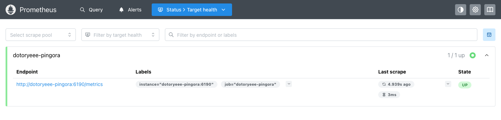

이제 k6로 가상 사용자(VU) 20명을 60초 동안 건다.

```javascript title="scripts/lb.js"
import http from 'k6/http';
import { check } from 'k6';

export const options = {
  vus: 20,
  duration: '60s',
};

export default function () {
  const res = http.get(`${__ENV.TARGET_URL}/work`);
  check(res, { 'status is 200': (r) => r.status === 200 });
}
```

```s
docker run --rm --network dotoryeee-net -v "$(pwd)/scripts:/scripts" \
  -e TARGET_URL=http://dotoryeee-pingora:6188 \
  grafana/k6 run --quiet /scripts/lb.js
```

```s
checks_total.......: 6560    108.947853/s
checks_succeeded...: 100.00% 6560 out of 6560
http_req_duration..: avg=183.05ms min=53.13ms med=167.94ms max=236.23ms p(90)=221.81ms p(95)=224.42ms
http_req_failed....: 0.00%  0 out of 6560
```

같은 구간을 Prometheus에서 백엔드별로 세면 2189, 2189, 2188이다. 앞서 curl 6번이 누계에 남아 있어 합은 6566이고, k6가 보낸 6560건이 세 갈래로 거의 정확히 갈렸다. 카운터는 Prometheus API로 뽑았다.

```s
curl -s http://localhost:9090/api/v1/query --data-urlencode 'query=dotoryeee_lb_requests_total' \
  | python3 -c "import sys,json; [print(r['metric'].get('upstream'), r['metric'].get('status'), r['value'][1]) for r in json.load(sys.stdin)['data']['result']]"
172.28.0.11:8000 200 2189
172.28.0.12:8000 200 2189
172.28.0.13:8000 200 2188
```

응답 시간이 백엔드 지연 50ms보다 훨씬 긴 평균 183ms로 나온 이유는 백엔드 쪽 처리 폭이다. gunicorn sync 워커가 백엔드당 2개라 세 대를 합쳐 동시에 6건만 처리하고 나머지는 대기하므로, 초당 약 110건이 상한이 되고 20 VU면 대기 시간이 붙어 평균 183ms가 된다.

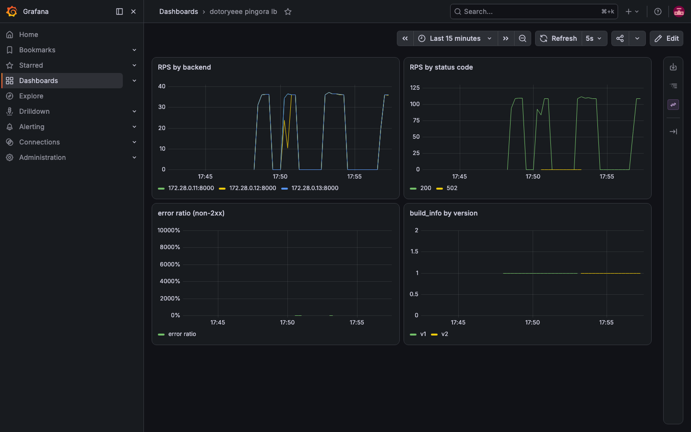

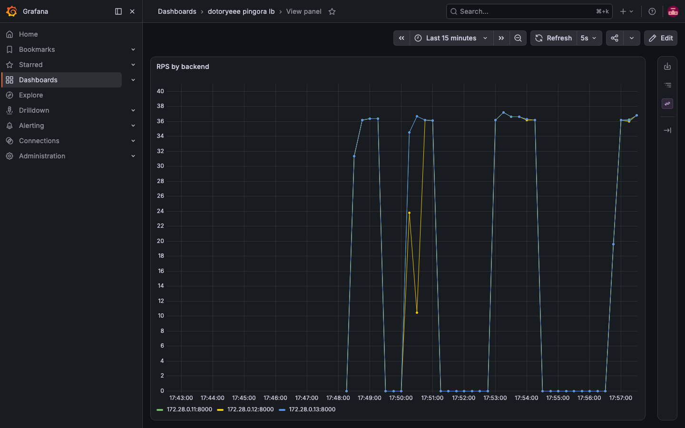

세 곡선이 겹쳐 하나처럼 보인다. 곡선이 갈라지는 구간은 다음 절에서 백엔드를 멈춘 순간이다.

## 백엔드 중단과 헬스체크

---

부하 스크립트 healthcheck.js는 lb.js에서 VU만 10으로 낮추고 실행 시간을 환경변수로 받게 바꾼 것이다.

```javascript title="scripts/healthcheck.js"
import http from 'k6/http';
import { check } from 'k6';

export const options = {
  vus: 10,
  duration: `${__ENV.TEST_DURATION || '90s'}`,
};

export default function () {
  const res = http.get(`${__ENV.TARGET_URL}/work`);
  check(res, { 'status is 200': (r) => r.status === 200 });
}
```

이 부하를 백그라운드로 걸어 둔 상태에서 백엔드 한 대를 멈추고, 별도 셸에서 0.3~0.5초 간격으로 curl을 돌려 응답이 어떻게 바뀌는지 시각과 함께 기록했다.

```s
docker run --rm --network dotoryeee-net -v "$(pwd)/scripts:/scripts" \
  -e TARGET_URL=http://dotoryeee-pingora:6188 -e TEST_DURATION=60s \
  grafana/k6 run --quiet /scripts/healthcheck.js &
sleep 5
docker stop dotoryeee-backend-2
```

```s
while true; do
  printf '%s  ' "$(date +%s.%N)"
  curl -sD - -o /dev/null http://localhost:6188/work | tr -d '\r' \
    | awk 'NR==1{printf "%s %s ", $2, $3} /x-dotoryeee-upstream/{print}'
  sleep 0.3
done
```

폴링 기록의 앞부분은 다음과 같다. 첫 열은 에포크 초이고 1786956609.75는 08:50:09.75 UTC다.

```s
1786956609.751717000  STOP 명령 실행
1786956610.050398000  200 x-dotoryeee-upstream: 172.28.0.11:8000
1786956610.477461000  502 Bad Gateway
1786956611.365837000  200 x-dotoryeee-upstream: 172.28.0.11:8000
1786956611.787675000  200 x-dotoryeee-upstream: 172.28.0.11:8000
1786956612.266294000  200 x-dotoryeee-upstream: 172.28.0.13:8000   (이후 .11/.13 2등분)
```

로드밸런서 쪽 로그에는 이탈과 복귀가 한 줄씩 남는다.

```s
[2026-08-17T08:50:11Z WARN  pingora_load_balancing] Backend { addr: Inet(172.28.0.12:8000), weight: 1, ext: {} } becomes unhealthy,  ConnectTimedout context: timeout 1s connecting to server BasicPeer { _address: Inet(172.28.0.12:8000), ... }
[2026-08-17T08:50:25Z INFO  pingora_load_balancing] Backend { addr: Inet(172.28.0.12:8000), weight: 1, ext: {} } becomes healthy
```

stop 명령이 끝난 시점(08:50:10)과 unhealthy 로그(08:50:11) 사이는 1~2초다. TcpHealthCheck 기본값이 연속 1회 실패로 바로 이탈시키는 것이라, 주기 1초에 자체 연결 타임아웃 1초를 더한 만큼이면 빠진다. 복구는 더 빨라서 start(08:50:24) 다음 초에 healthy로 돌아왔다. 같은 실험을 한 번 더 돌렸을 때도 stop 2초 뒤 이탈, start 다음 초 복귀로 같은 모양이었다.

**헬스체크는 무중단 장치가 아니다.** 이탈이 감지되기 전까지 로드밸런서는 멈춘 백엔드를 정상으로 알고 계속 고르고, 그 요청들은 연결에 실패해 502로 나간다.

```s
checks_total.......: 5898   98.084812/s
checks_succeeded...: 99.50% 5869 out of 5898
checks_failed......: 0.49%  29 out of 5898
http_req_duration..: avg=101.6ms p(95)=166.71ms
```

k6가 센 실패는 29건이고 같은 구간 Prometheus 카운터는 502 30건이다. 실험을 다시 돌렸을 때는 k6와 Prometheus가 모두 39건으로 정확히 일치했다. 실패가 수십 건 나오는 이유는 이탈을 알아채기까지 1~2초 동안 멈춘 백엔드로 라우팅된 요청이 그대로 실패하기 때문이다. 초당 100건 안팎 중 3분의 1이 그 백엔드로 가므로 1초 남짓이면 30건대가 된다. fail_to_connect에서 재시도를 켜지 않았으므로 그 요청들은 다른 백엔드로 넘어가지 않고 그대로 502가 된다.

```s
172.28.0.11:8000 200 4351     #앞 실험까지 포함한 누계
172.28.0.12:8000 200 3798
172.28.0.13:8000 200 4351
172.28.0.12:8000 502 30
```

.11과 .13의 누계가 정확히 같고 .12만 뒤처졌다. 이탈 구간 동안 남은 2대가 요청을 나눠 받았다는 뜻이다.

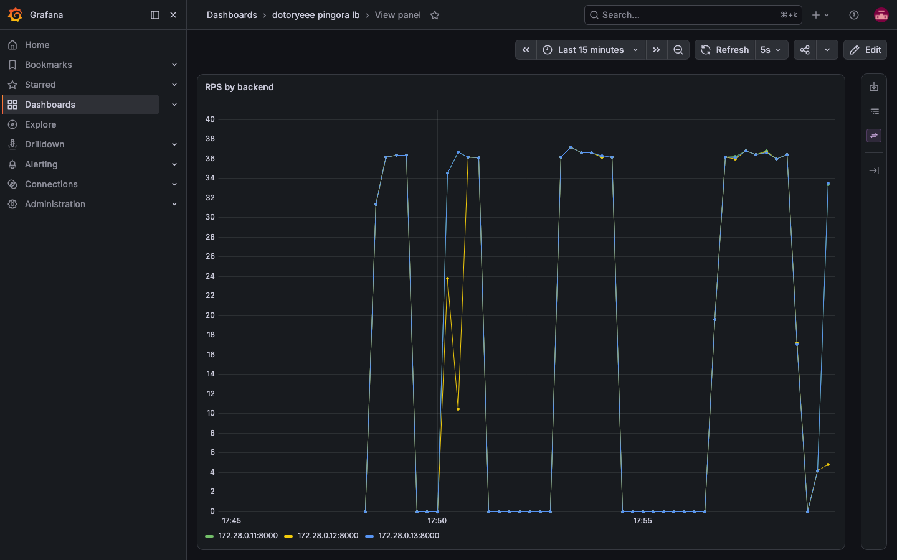

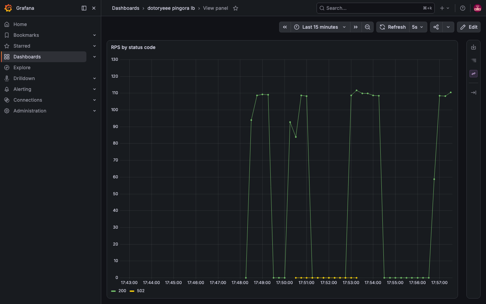

502는 그래프에서 0 선에 거의 붙어 있다. 초당 100건 가까이 흐르는 구간에 전부 합쳐 30건 안팎이라 곡선으로는 잘 드러나지 않는다.

```s
docker start dotoryeee-backend-2
```

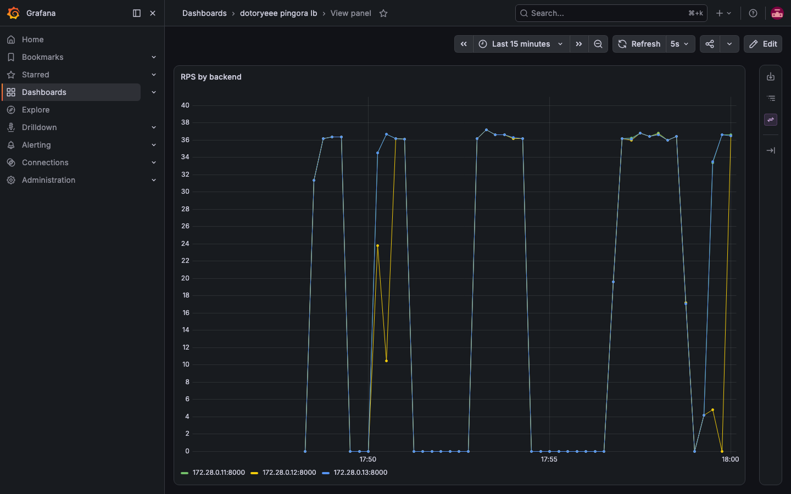

## 무중단 업그레이드

---

main.rs의 LB_VERSION 상수 한 줄만 v2로 바꾸고 다시 빌드한다. 의존성이 그대로라 증분 빌드로 끝난다.

```s
docker exec dotoryeee-pingora sh -c 'cd /app && cargo build --release'
```

```s
   Compiling lb v0.1.0 (/app)
    Finished `release` profile [optimized] target(s) in 4.13s
```

부하 스크립트에는 실패율 threshold(k6가 통과 여부를 종료 코드로 알려 주는 합격 기준)와 버전별 카운터를 넣었다. 응답 헤더의 x-dotoryeee-lb 값을 보고 v1이 처리한 건과 v2가 처리한 건을 따로 센다. 이 카운터가 없으면 구 프로세스가 끝까지 혼자 처리한 경우와 구분할 수 없다.

```javascript title="scripts/upgrade.js"
import http from 'k6/http';
import { check } from 'k6';
import { Counter } from 'k6/metrics';

export const options = {
  vus: 30,
  duration: '90s',
  thresholds: {
    http_req_failed: ['rate==0'],       //한 건이라도 실패하면 종료 코드가 갈림
  },
};

const lbV1 = new Counter('lb_v1');
const lbV2 = new Counter('lb_v2');
const upstream1 = new Counter('upstream_backend_1');
const upstream2 = new Counter('upstream_backend_2');
const upstream3 = new Counter('upstream_backend_3');

export default function () {
  const res = http.get(`${__ENV.TARGET_URL}/work`);
  check(res, { 'status is 200': (r) => r.status === 200 });

  const version = res.headers['X-Dotoryeee-Lb'];    //어느 버전이 응답했는지
  if (version === 'v1') {
    lbV1.add(1);
  } else if (version === 'v2') {
    lbV2.add(1);
  }

  const upstream = res.headers['X-Dotoryeee-Upstream'] || '';
  if (upstream.includes('.11:')) {
    upstream1.add(1);
  } else if (upstream.includes('.12:')) {
    upstream2.add(1);
  } else if (upstream.includes('.13:')) {
    upstream3.add(1);
  }
}
```

업그레이드 절차는 두 단계다. 신 프로세스를 -u 플래그로 띄우면 conf의 upgrade_sock 경로에서 리스닝 소켓 fd가 오기를 기다리고, 그 상태에서 구 프로세스에 SIGQUIT을 보내면 구 프로세스가 fd를 넘긴 뒤 진행 중인 요청만 마무리하고 빠진다. 부하를 백그라운드로 띄우고 5초를 기다린 뒤, 신 프로세스 기동과 SIGQUIT을 한 셸에서 이어 실행한다.

```s
docker run --rm --network dotoryeee-net -v "$(pwd)/scripts:/scripts" \
  -e TARGET_URL=http://dotoryeee-pingora:6188 \
  grafana/k6 run --quiet /scripts/upgrade.js &
sleep 5
V1_PID=$(docker exec dotoryeee-pingora pgrep -f "release/lb -c /app/conf.yaml")
docker exec -d dotoryeee-pingora sh -c 'exec /app/target/release/lb -u -c /app/conf-v2.yaml >> /tmp/dotoryeee-lb-v2.log 2>&1'
sleep 1     # 신 프로세스가 upgrade_sock을 bind할 틈
docker exec dotoryeee-pingora kill -QUIT $V1_PID
```

!!! warning
    💡 신 프로세스는 fd를 1초 간격 재시도 몇 번(기본 5회) 동안만 기다리므로 기동과 SIGQUIT을 한 셸에서 이어 실행한다

리스닝 소켓을 누가 쥐고 있는지는 컨테이너 안에서 본다. 업그레이드 전후로 0.5초 간격 루프를 돌려 시각과 함께 남겼다.

```s
while true; do
  echo "t=$(date +%s.%N) $(docker exec dotoryeee-pingora ss -lntp | grep 6188)"
  sleep 0.5
done
```

```s
LISTEN ... users:(("lb",pid=2565,fd=6),("lb",pid=2432,fd=21))
```

반복 캡처한 결과를 SIGQUIT 시점 기준으로 늘어놓으면 다음과 같다.

|시점|6188 리스닝 소켓 소유|
|---|---|
|v2 기동 전|`("lb",pid=2432,fd=21)`|
|SIGQUIT +0.1초|`("lb",pid=2432,fd=21)`|
|SIGQUIT +1.3초|`("lb",pid=2565,fd=6),("lb",pid=2432,fd=21)`|
|SIGQUIT +4.7초|`("lb",pid=2565,fd=6),("lb",pid=2432,fd=21)`|
|SIGQUIT +5.3초|`("lb",pid=2565,fd=6)`|

같은 소켓을 두 PID가 함께 쥐고 있는 구간이 실제로 잡혔다. 구 프로세스가 fd를 넘긴 뒤에도 5초 동안 리스너를 유지하기 때문이다. 구 프로세스(v1) 로그는 다음과 같다.

```s
[2026-08-17T08:53:02Z INFO  pingora_core::server] SIGQUIT received, sending socks and gracefully exiting
[2026-08-17T08:53:07Z INFO  pingora_core::server] Broadcasting graceful shutdown
[2026-08-17T08:53:07Z INFO  pingora_core::server] Graceful shutdown started!
[2026-08-17T08:53:07Z INFO  pingora_core::server] Broadcast graceful shutdown complete
[2026-08-17T08:53:07Z INFO  pingora_core::server] Graceful shutdown: grace period 10s starts
[2026-08-17T08:53:07Z INFO  pingora_core::server] service 'BG health check' exited.
[2026-08-17T08:53:17Z INFO  pingora_core::server] Graceful shutdown: grace period ends
[2026-08-17T08:53:17Z INFO  pingora_core::server] Waiting for runtimes to exit!
[2026-08-17T08:53:22Z INFO  pingora_core::server] Waiting for service runtime Prometheus metric HTTP to exit
[2026-08-17T08:53:22Z INFO  pingora_core::server] Waiting for service runtime Pingora HTTP Proxy Service to exit
[2026-08-17T08:53:22Z INFO  pingora_core::server] Waiting for service runtime BG health check to exit
[2026-08-17T08:53:22Z INFO  pingora_core::server] All runtimes exited, exiting now
```

신 프로세스(v2) 로그는 다음과 같다.

```s
[2026-08-17T08:53:00Z INFO  pingora_core::server::bootstrap_services] Bootstrap starting
[2026-08-17T08:53:00Z ERROR pingora_core::server::transfer_fd] No incoming socket transfer, sleep 1s and try again
[2026-08-17T08:53:01Z ERROR pingora_core::server::transfer_fd] No incoming socket transfer, sleep 1s and try again
[2026-08-17T08:53:02Z INFO  pingora_core::server::bootstrap_services] Bootstrap done
[2026-08-17T08:53:02Z INFO  pingora_core::server] Server starting
[2026-08-17T08:53:02Z INFO  pingora_core::server] Starting services in dependency order: ["Prometheus metric HTTP", "Pingora HTTP Proxy Service", "BG health check"]
```

신 프로세스는 2초 동안 fd를 못 받아 재시도 로그를 두 줄 남겼고, SIGQUIT이 떨어진 08:53:02에 부트스트랩을 끝냈다. 재시도 기본값이 5회(1초 간격)라 두 명령 사이가 6초 안팎을 넘으면 이관이 깨진다.

부하 결과는 다음과 같다.

```s
█ THRESHOLDS
  http_req_failed
  ✓ 'rate==0' rate=0.00%

█ TOTAL RESULTS
  checks_total.......: 9869    109.305714/s
  checks_succeeded...: 100.00% 9869 out of 9869
  checks_failed......: 0.00%   0 out of 9869

  CUSTOM
  lb_v1..........................: 2194   24.300004/s
  lb_v2..........................: 7675   85.00571/s
  upstream_backend_1.............: 3291   36.450005/s
  upstream_backend_2.............: 3289   36.427854/s
  upstream_backend_3.............: 3289   36.427854/s

  HTTP
  http_req_duration..............: avg=273.74ms p(95)=330.22ms
  http_req_failed................: 0.00%  0 out of 9869
```

9869건 중 실패가 0건이고, v1이 2194건, v2가 7675건을 처리했다. 두 값을 더하면 9869로 총 요청 수와 같다. 모든 응답에 버전 헤더가 실렸고 두 프로세스가 실제로 나눠 처리했다는 뜻이다. 백엔드별 분포도 3291, 3289, 3289로 총합 기준으로 균등했다.

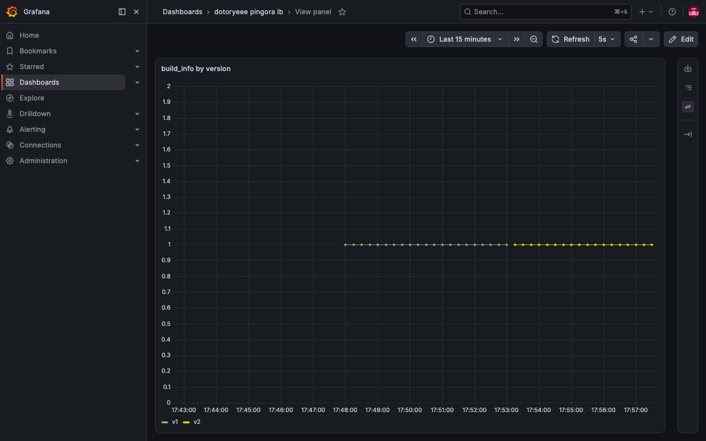

여기서 예상과 다른 결과가 하나 나왔다. 구 프로세스가 리스너를 5초 더 유지하니 그 5초 동안 v1과 v2의 응답이 섞일 것으로 봤는데, 각 프로세스 로그의 upstream peer is 줄을 초 단위로 세어 보면 그렇지 않았다.

```s
docker exec dotoryeee-pingora sh -c "grep 'upstream peer is' /tmp/dotoryeee-lb-v1.log | cut -c2-20 | sort | uniq -c"
```

|초|v1 처리 건수|v2 처리 건수|
|---|---|---|
|08:53:02|114|0|
|08:53:03|108|0|
|08:53:04|114|0|
|08:53:05|114|0|
|08:53:06|114|0|
|08:53:07|34|74|
|08:53:08|0|114|
|08:53:09|0|114|

소켓은 약 4초 공유했지만 그 구간 내내 요청은 거의 전부 v1이 받았고, 실제 전환은 08:53:07 한 초 안에 끝났다. 그 초의 34건과 74건을 더하면 108건으로 다른 초의 처리량과 비슷하다.

전환이 몰린 시각은 v1이 Broadcasting graceful shutdown을 남긴 시각과 정확히 같다. 직접 확인한 사실은 여기까지이고, 나머지는 Pingora 소스와 k6 기본 동작으로 이어 붙인 설명이다. k6는 로드밸런서와 맺은 keep-alive 커넥션을 재사용하므로 30 VU가 열어 둔 커넥션이 v1에 붙어 있었고, 초당 110건 안팎의 요청이 전부 그 커넥션 위로 흘렀다. 소켓을 함께 소유한 약 4초 동안 새 커넥션이 거의 생기지 않았으니 v2가 accept할 것도 없었다. Pingora는 shutdown 신호를 받은 뒤 처리하는 요청부터 keep-alive를 끄므로 v1이 응답마다 커넥션을 닫았고, k6가 다시 연결한 새 커넥션을 v2가 받았다. 진행 중이던 요청은 정상 응답으로 끝났고 커넥션 재사용만 끊긴 것이라 실패는 0건이다.

구 프로세스가 완전히 사라지기까지는 SIGQUIT부터 20초가 걸렸고, 그 20초는 앞 5초의 고정값과 뒤 두 설정값으로 그대로 쪼개진다.

|로그 시각|남긴 줄|앞 단계와의 간격|
|---|---|---|
|08:53:02|SIGQUIT received, sending socks and gracefully exiting|기준|
|08:53:07|Graceful shutdown: grace period 10s starts|5초. fd를 넘긴 뒤 리스너를 유지하는 구간(설정 키가 아닌 고정값)|
|08:53:17|Graceful shutdown: grace period ends|10초. grace_period_seconds|
|08:53:22|All runtimes exited, exiting now|5초. graceful_shutdown_timeout_seconds|

grace_period_seconds를 적지 않았다면 이 자리가 300초가 되어 구 프로세스가 5분 더 살아 있게 된다.

교체된 프로세스의 metrics를 브라우저로 열면 버전 게이지가 v2로 바뀌어 있다.

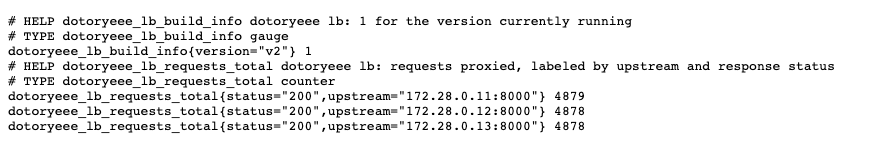

카운터는 신 프로세스에서 0부터 다시 시작한다. Prometheus에서 원본 카운터를 그대로 그리면 업그레이드 시점에 급락하는 계단이 보인다.

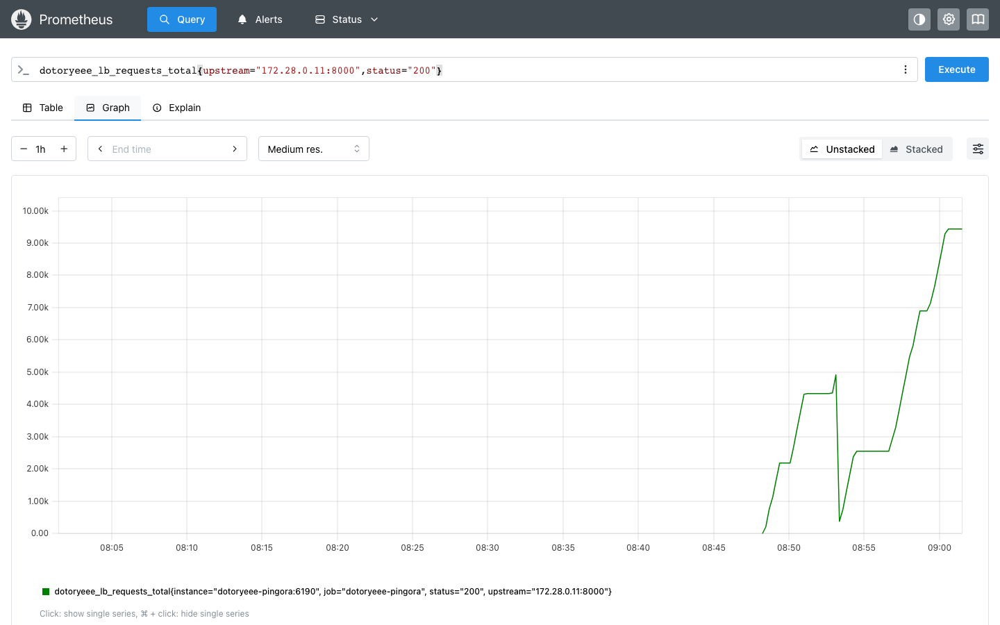

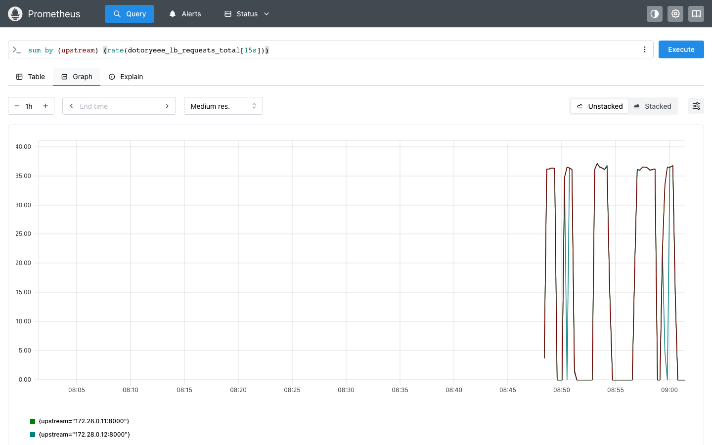

대시보드를 rate로 짠 이유가 여기 있다. 카운터를 그대로 그리면 업그레이드 때마다 그래프가 절벽이 되지만, rate는 리셋을 감지해 이어 준다. 수집 자체도 끊기지 않았다. fd 이관은 6188뿐 아니라 6190 리스너에도 함께 적용되기 때문이다. 업그레이드 구간의 up 지표를 5초 간격으로 조회하면 27개 샘플이 전부 1이다.

```s
curl -s http://localhost:9090/api/v1/query_range --data-urlencode 'query=up{job="dotoryeee-pingora"}' \
  --data-urlencode 'start=<업그레이드 시작 시각>' --data-urlencode 'end=<종료 시각>' --data-urlencode 'step=5s'
```

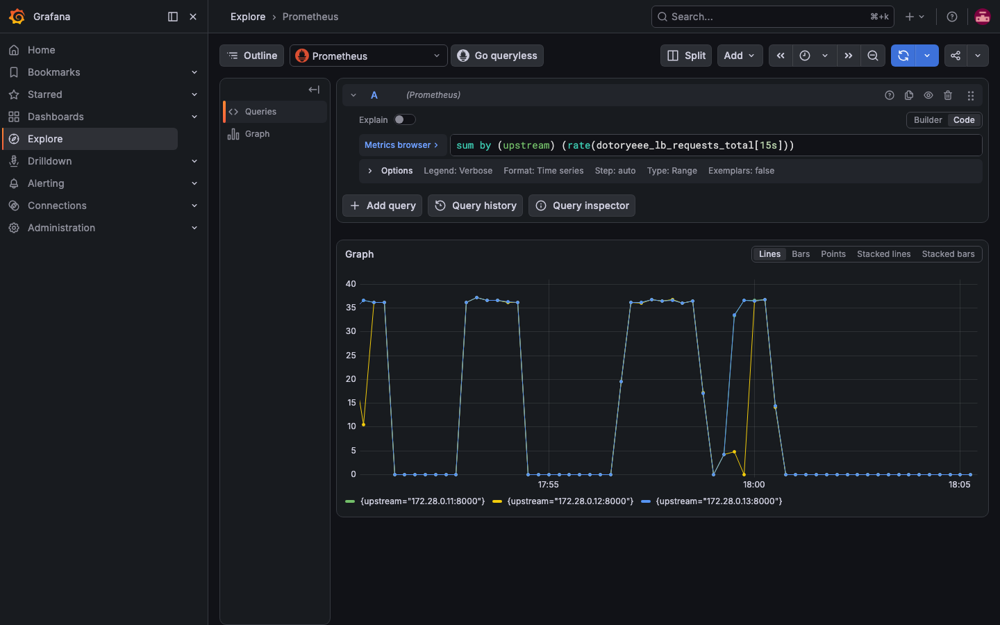

## 결과 정리

---

|실측|결과|근거|
|---|---|---|
|라운드로빈 분산|3대에 균등|curl 6연속이 .11→.12→.13 순환, 60초 부하 뒤 카운터 2189/2189/2188|
|백엔드 이탈 감지|1~2초|stop 직후 becomes unhealthy 로그. 재현 실험도 2초 안|
|이탈 구간 실패 건수|29건(1차), 39건(2차)|1차 k6 29건·Prometheus 30건, 2차 k6 39건·Prometheus 39건|
|이탈 뒤 재분배|남은 2대로 분산|curl 폴링이 .11과 .13만 응답, 두 백엔드 누계가 4351로 동일|
|백엔드 복구|start 다음 초에 재편입|becomes healthy 로그. 재현 실험도 동일|
|업그레이드 중 실패율|0%|threshold rate==0 통과, 실패 0/9869|
|버전 전환|v1이 멎고 v2가 이어받음|lb_v1 2194 + lb_v2 7675 = 9869로 총 요청 수와 일치|
|리스닝 소켓 소유|2432 단독 → 두 PID 동시 → 2565 단독|`ss -lntp` 반복 캡처|
|구·신 프로세스 로그|양쪽 확보|v1의 SIGQUIT 수신 로그, v2의 fd 수신 재시도와 부트스트랩 로그|
|메트릭 카운터|신 프로세스에서 0부터 다시|원본 카운터 급락 후 재상승, build_info가 v1에서 v2로|
|구 프로세스 잔류|20초|SIGQUIT 기준 5초 + 10초 + 5초 로그 간격|
|v1·v2 혼재|소켓은 약 4초 공유, 전환은 shutdown 방송과 같은 초에 완료|`ss` 관찰과 초당 요청 로그 대조. keep-alive 커넥션이 닫힌 시각과 일치|

k6 실패 0건 하나만으로 무중단이라고 적지 않으려고 증거를 넷으로 나눠 잡았다.

|증거|확인 지점|결과|
|---|---|---|
|클라이언트|k6 http_req_failed|rate==0 threshold 통과, 종료 코드 0|
|전환 실증|k6 버전 헤더 카운터|lb_v1 2194, lb_v2 7675, 합이 총 요청 수와 일치|
|프로세스|구·신 error_log|v1에 SIGQUIT 수신, v2에 기동 로그. PID가 2432와 2565로 다름|
|소켓|컨테이너 안 `ss -lntp`|6188 소유 PID가 2432에서 2565로 넘어감|

버전 헤더 카운터가 없으면 구 프로세스가 끝까지 혼자 처리한 경우와 구분되지 않는다. 네 항목이 모두 맞아서 이 구간을 무중단으로 적을 수 있었다.

## 주의

---

- fd 이관은 Linux 전용이므로 이 실습을 재현할 환경은 리눅스로 잡을 것
- 이미지에 cmake를 넣을 것. TLS feature와 무관하게 첫 빌드가 zlib-ng 컴파일 단계에서 멈춘다
- 로드밸런서를 컨테이너의 메인 프로세스로 띄우지 말 것. 구 프로세스가 빠질 때 컨테이너가 함께 죽는다
- upstream_peer에서 connection_timeout과 read_timeout을 명시할 것. 기본값이 없어 실패가 늦게 드러난다
- grace_period_seconds를 비워 두면 구 프로세스가 300초 남으므로 배포 주기에 맞춰 값을 적을 것
- 대시보드는 rate로 그릴 것. 카운터는 업그레이드마다 0으로 돌아간다
