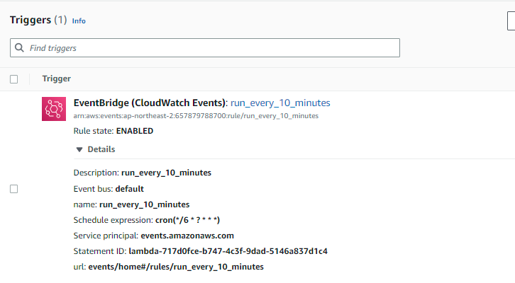
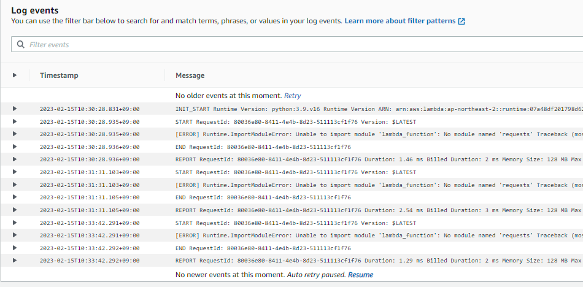
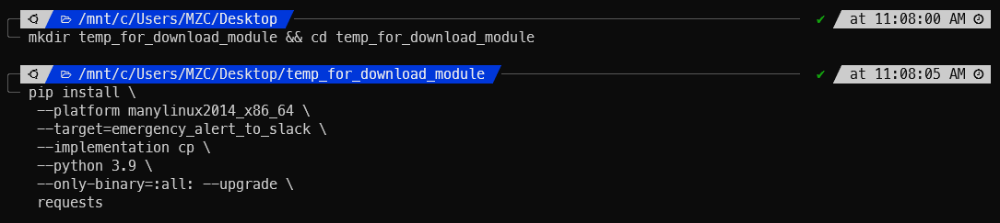
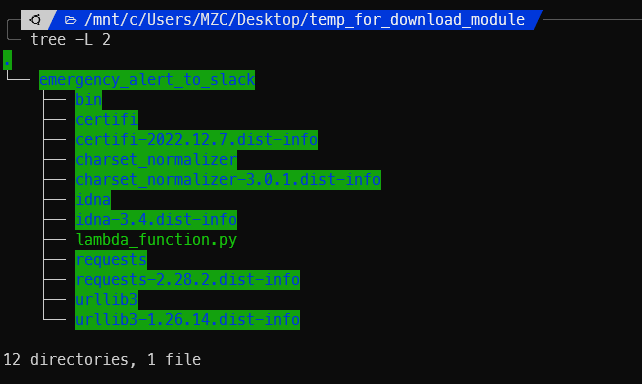
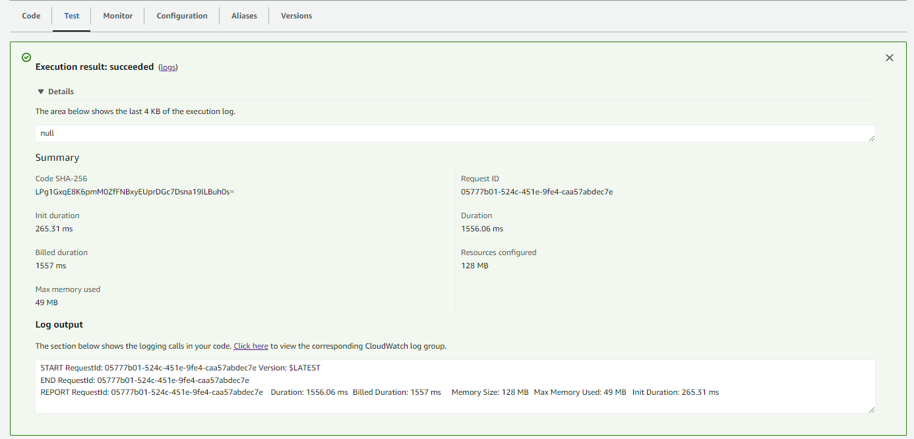

# 재난안전문자 API 활용하기

## 목적
재난문자 발생 시점마다 트래픽이 튀어서 광범위로 발송되는 재난문자 발생 시점 파악이 필요했습니다.<br>
때문에 재난문자 발생 시 Slack으로 알람을 쏴주도록 구성해보았습니다

## 절차
1. 아래 사이트에서 재난문자 발생 내역을 확인할 수 있습니다<br>
   https://www.safekorea.go.kr/idsiSFK/neo/sfk/cs/sfc/dis/disasterMsgList.jsp?menuSeq=679

2. 아래 공공데이터 포털에서 재난문자 API 사용신청 후 인증키를 수령합니다<br>
   https://www.data.go.kr/iim/api/selectAPIAcountView.do

3. API를 호출하고 Slack으로 메세지를 발송해주는 코드를 작성합니다
```python title="emergency_alert_to_slack.py" linenums="1"
import requests
import datetime

auth_key = ""
return_type = "json"
request_row = "100"
target_message_time = 10 #cron 주기로 사용 할 분(minutes) 값을 입력한다. 1을 입력할 경우 최근 1분간 메시지만 전송한다.
target_location_ids = ["2", "21", "53", "74", "98", "104", "113", "119", "136", "162", "168", "179", "202", "217", "222", "238", "6474", "6474"]
# location_id는 다음 문서를 참조: https://www.data.go.kr/data/15066113/fileData.do 

slack_webhook_url = "https://hooks.slack.com/services/~~~~~~~~~~"

def load_messages() -> list: 
    """
    https://www.safekorea.go.kr/idsiSFK/neo/sfk/cs/sfc/dis/disasterMsgList.jsp?menuSeq=679 의 데이터 호출하는 함수
    https://www.data.go.kr/data/3058822/openapi.do API 사용
    auth_key: 이정원 계정의 인증키
    """
    r = requests.get(f'http://apis.data.go.kr/1741000/DisasterMsg3/getDisasterMsg1List?ServiceKey={auth_key}&type={return_type}&numOfRows={request_row}')
    return r.json()["DisasterMsg"][1]["row"]

def time_str_to_obj(time_str: str) -> object:
    """
    string type으로 제공되는 날짜데이터를 datetime object로 변환한다
    """
    time_obj = datetime.datetime.strptime(time_str, "%Y/%m/%d %H:%M:%S") #공공데이터 time format을 datetime object format으로 변환
    return time_obj

def time_kst_to_utc(time_obj: object) -> object:
    """
    KST datetime object를 입력받아 UTC datetime object를 리턴
    """
    time_obj += datetime.timedelta(hours = -9) # KST -> UTC 연산
    return time_obj

def check_message_time(message_time: object) -> bool:
    """
    target_message_time 변수값을 참조하여 지난 몇 분 사이에 생성된 메세지가 맞는지 검증한다 (timeWindow filtering)
    """
    target_time = datetime.datetime.now() + datetime.timedelta(hours=9) - datetime.timedelta(minutes = target_message_time)
    if target_time < message_time:
        return True
    return False

def check_location_id(location_id: str) -> bool:
    """
    location_id가 target_location_ids 리스트 내에 존재하는 경우에만 메세지 발송
    공공API에서 제공되는 Location_id는 string일 수도 있고 List일 수도 있어서 (랜덤) split 처리함
    """
    location_ids = location_id.split(',')
    for location_id in location_ids:
        if location_id in target_location_ids:
            return True
    return False

def send_slack_message(message: dict) -> None:
    """
    slack webhook을 이용해 slack channel로 메세시 발신하는 함수
    backslash parsing때문에 코드가 좀 어지럽습니다
    참고: chr92 = backslash
    """
    kst_time = time_str_to_obj(message['create_date'])
    utc_time = time_kst_to_utc(kst_time)

    if check_message_time(kst_time) & check_location_id(message["location_id"]):
        kst_msg = f"KST: {kst_time}"
        utc_msg = f"UTC: {utc_time}"
        # location_msg = f"발송지역: {message['location_name']}"
        emergency_msg = message["msg"].replace("\n", "").split(".")[0]
        payload={
            "text": f"{kst_msg} | {utc_msg} {chr(92)}n {emergency_msg}".replace("\\n", "\n")
        }
        # requests.post(slack_webhook_url, json=payload)
        print(payload)

def lambda_handler(event, context):
    messages = load_messages()
    for message in messages:
        send_slack_message(message)
```

5. AWS Lambda를 매 10분 마다 실행합니다
    
    

6. 함수를 자주 실행하면 API throttling에 걸리기 때문에 Lambda 설정에서 코드 재실행을 2회까지 허용합니다
    
    

7. CloudWatch를 이용해 확인해보니 requests 라이브러리가 없다고 합니다
    

8. Local에 python3.9용 requests library를 다운로드하고 압축합니다
    ```s
    mkdir temp_for_download_module && cd temp_for_download_module

    pip install \
    --platform manylinux2014_x86_64 \
    --target=emergency_alert_to_slack \
    --implementation cp \
    --python 3.9 \
    --only-binary=:all: --upgrade \
    requests
    ```
    
    

9. 작성했던 코드로 lambda_function.py로 저장해줍니다
    

10. AWS Lambda -> Code 탭 > Upload from > .zip file 클릭 후 방금 생성한 압축파일을 업로드 해줍니다
    
    

11. 잘 동작하는 구조는 다음과 같습니다
    

12. Test 탭에서 'Test'버튼을 클릭했을 때 에러가 발생하지 않으면 다음과 같이 초록색 화면이 표시됩니다(에러나면 빨간색)
    

13. Slack에 다음과 같이 메세지가 잘 전송됩니다
    
